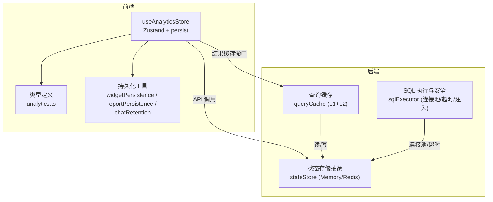
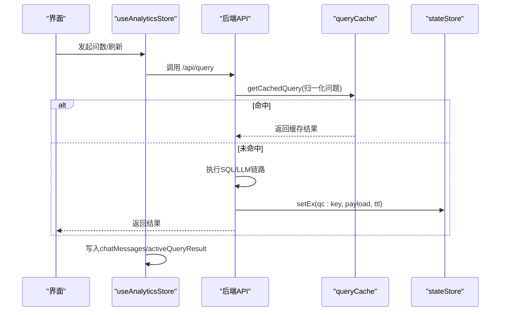
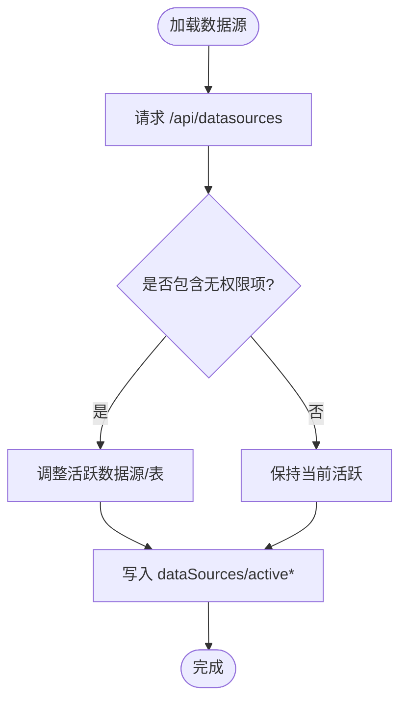
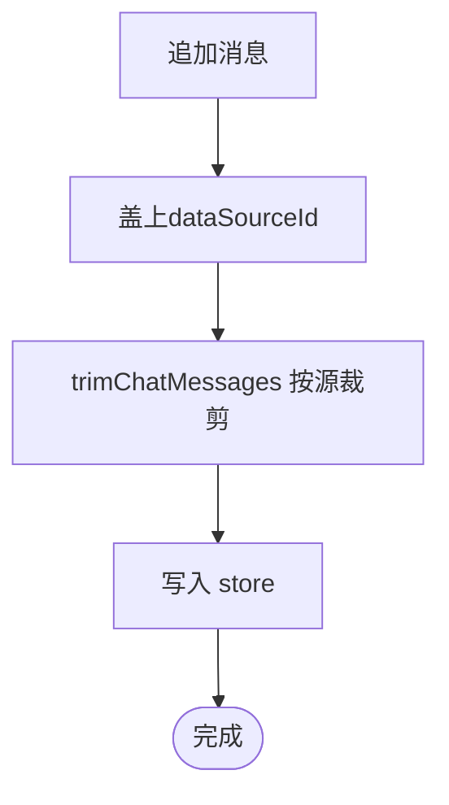
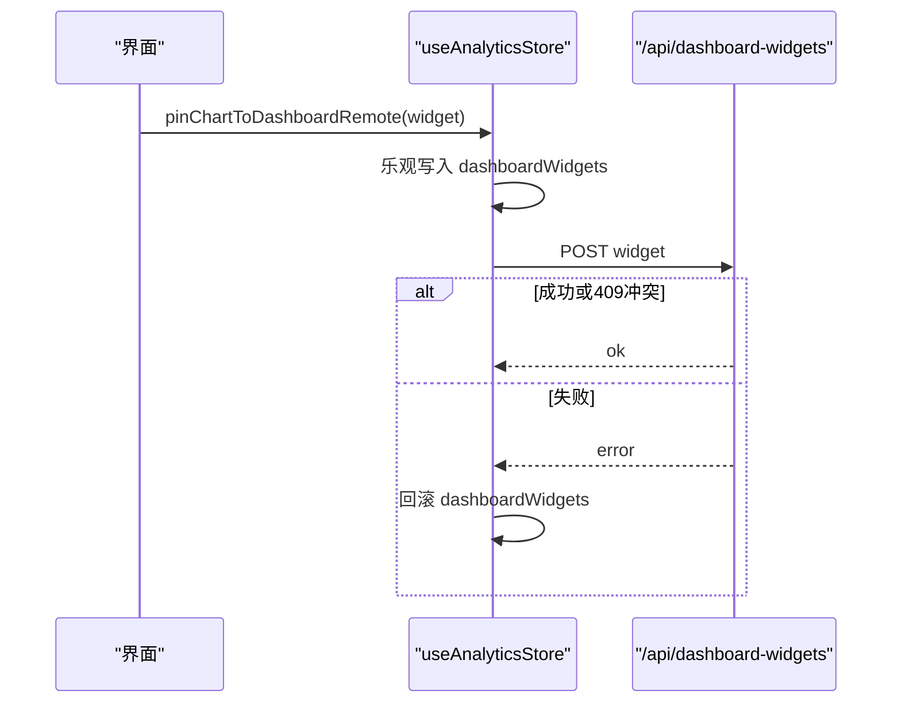
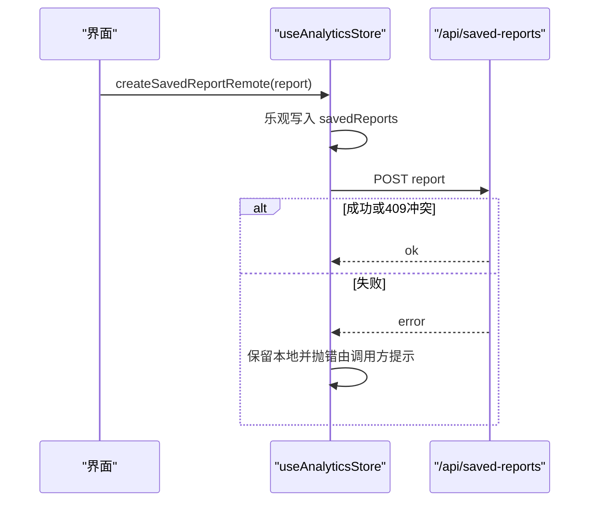
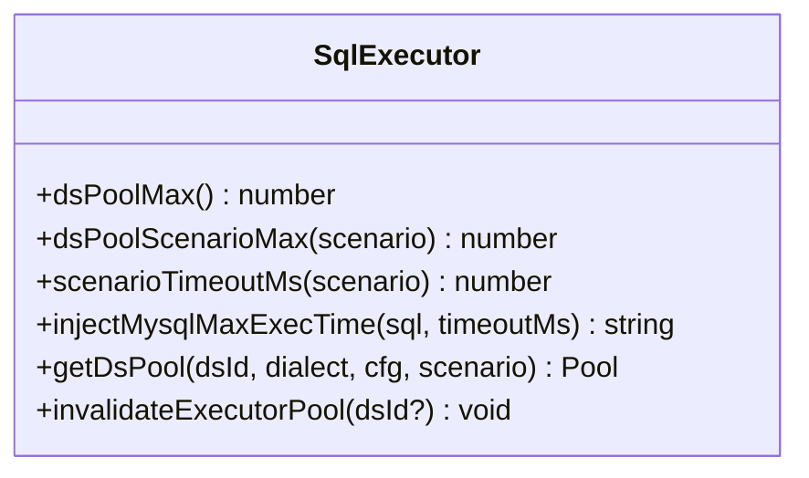
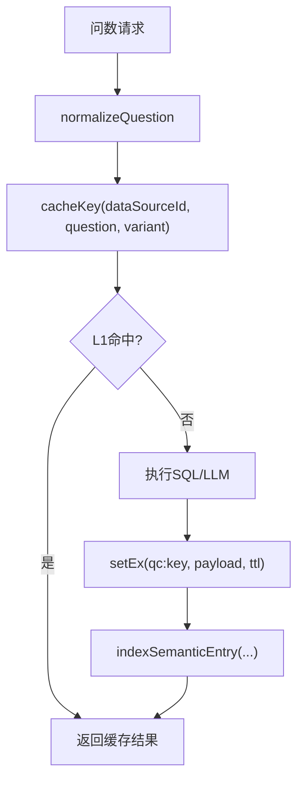
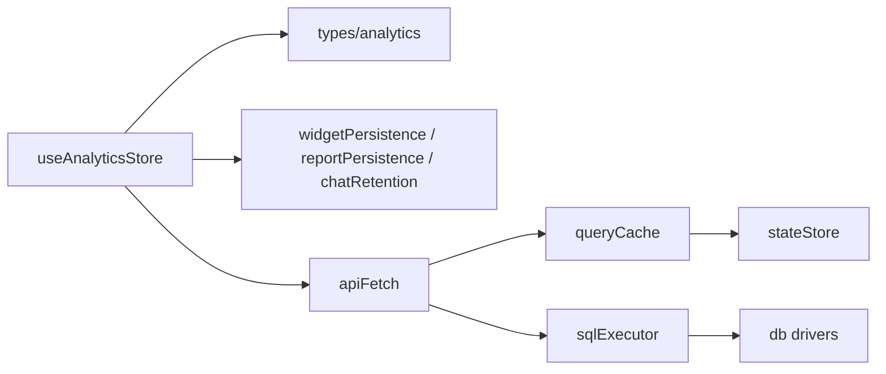

# 分析状态管理

<cite>
**本文引用的文件**
- [src/hooks/useAnalyticsStore.ts](file://src/hooks/useAnalyticsStore.ts)
- [src/types/analytics.ts](file://src/types/analytics.ts)
- [src/utils/widgetPersistence.ts](file://src/utils/widgetPersistence.ts)
- [src/utils/reportPersistence.ts](file://src/utils/reportPersistence.ts)
- [src/utils/chatRetention.ts](file://src/utils/chatRetention.ts)
- [server/infra/stateStore.ts](file://server/infra/stateStore.ts)
- [server/query/queryCache.ts](file://server/query/queryCache.ts)
- [server/query/sqlExecutor.ts](file://server/query/sqlExecutor.ts)
</cite>

## 目录
1. [简介](#简介)
2. [项目结构](#项目结构)
3. [核心组件](#核心组件)
4. [架构总览](#架构总览)
5. [详细组件分析](#详细组件分析)
6. [依赖关系分析](#依赖关系分析)
7. [性能考量](#性能考量)
8. [故障排查指南](#故障排查指南)
9. [结论](#结论)
10. [附录](#附录)

## 简介
本文件聚焦“智能问数据分析系统”的前端状态管理与后端状态缓存、连接池与查询缓存等关键能力，系统性说明 useAnalyticsStore 的设计与实现，覆盖数据源状态、查询历史、用户偏好、Widget 持久化、状态同步策略以及调试与监控方法。目标是帮助读者快速理解并安全扩展系统的状态管理能力。

## 项目结构
- 前端状态层：基于 Zustand 的 useAnalyticsStore 集中管理数据源、对话历史、看板 Widget、已保存报表、活动标签页等；通过 persist 中间件进行本地持久化（localStorage），并提供迁移与裁剪逻辑防止膨胀。
- 类型定义：统一的数据模型（DataSource、TableSchema、ChatMessage、SavedReport、DashboardWidget 等）确保前后端契约一致。
- 持久化工具：widgetPersistence、reportPersistence、chatRetention 提供迁移筛选、服务端记录映射与消息滚动裁剪。
- 后端状态与缓存：stateStore 抽象进程内/Redis 状态存储；queryCache 提供语义缓存（L1 精确 + L2 embedding 近似）；sqlExecutor 提供 SQL 安全执行与分级连接池。

图表来源
- [src/hooks/useAnalyticsStore.ts:249-733](file://src/hooks/useAnalyticsStore.ts#L249-L733)
- [src/types/analytics.ts:54-85](file://src/types/analytics.ts#L54-L85)
- [src/utils/widgetPersistence.ts:1-36](file://src/utils/widgetPersistence.ts#L1-L36)
- [src/utils/reportPersistence.ts:1-32](file://src/utils/reportPersistence.ts#L1-L32)
- [src/utils/chatRetention.ts:1-49](file://src/utils/chatRetention.ts#L1-L49)
- [server/infra/stateStore.ts:10-23](file://server/infra/stateStore.ts#L10-L23)
- [server/query/queryCache.ts:1-21](file://server/query/queryCache.ts#L1-L21)
- [server/query/sqlExecutor.ts:44-109](file://server/query/sqlExecutor.ts#L44-L109)

章节来源
- [src/hooks/useAnalyticsStore.ts:249-733](file://src/hooks/useAnalyticsStore.ts#L249-L733)
- [src/types/analytics.ts:54-85](file://src/types/analytics.ts#L54-L85)
- [server/infra/stateStore.ts:10-23](file://server/infra/stateStore.ts#L10-L23)
- [server/query/queryCache.ts:1-21](file://server/query/queryCache.ts#L1-L21)
- [server/query/sqlExecutor.ts:44-109](file://server/query/sqlExecutor.ts#L44-L109)

## 核心组件
- useAnalyticsStore：集中式状态容器，封装数据源、对话历史、看板 Widget、已保存报表、活动标签页等状态与操作；通过 persist 中间件实现本地持久化与版本迁移；提供与服务端的增量同步接口。
- 类型体系：统一描述数据源、表结构、查询结果、对话消息、报表、Widget 等数据结构，保障前后端一致性。
- 持久化工具：负责旧版 localStorage 数据迁移、服务端记录映射、聊天消息按数据源分组裁剪，避免存储膨胀。
- 后端状态存储：抽象 Memory/Redis 两种实现，提供键值存取、窗口计数、分布式锁、前缀删除等能力，支撑缓存与限流。
- 查询缓存：L1 精确匹配 + L2 语义相似度命中，支持 Redis 外置共享与 TTL 过期控制。
- SQL 执行与安全：SELECT-only 校验、白名单、敏感列拒绝、强制 LIMIT、执行超时、MySQL hint 注入；按场景分级连接池与超时。

章节来源
- [src/hooks/useAnalyticsStore.ts:181-247](file://src/hooks/useAnalyticsStore.ts#L181-L247)
- [src/types/analytics.ts:54-85](file://src/types/analytics.ts#L54-L85)
- [src/utils/widgetPersistence.ts:1-36](file://src/utils/widgetPersistence.ts#L1-L36)
- [src/utils/reportPersistence.ts:1-32](file://src/utils/reportPersistence.ts#L1-L32)
- [src/utils/chatRetention.ts:1-49](file://src/utils/chatRetention.ts#L1-L49)
- [server/infra/stateStore.ts:10-23](file://server/infra/stateStore.ts#L10-L23)
- [server/query/queryCache.ts:1-21](file://server/query/queryCache.ts#L1-L21)
- [server/query/sqlExecutor.ts:44-109](file://server/query/sqlExecutor.ts#L44-L109)

## 架构总览
useAnalyticsStore 作为前端状态中枢，负责：
- 数据源状态：加载、切换、活跃表、表结构更新。
- 查询历史：追加消息、设置加载态、结果缓存、反馈标记、按数据源隔离与裁剪。
- Widget 持久化：本地快照迁移、服务端权威列表拉取、增删改排序的乐观更新与回滚。
- 报表持久化：本地遗留迁移、服务端权威列表、创建/更新/删除与批注同步。
- 用户偏好：当前活动标签页、演示报表隐藏标记等轻量配置。

后端侧：
- stateStore 提供统一的进程内或 Redis 状态存取，支撑缓存与并发控制。
- queryCache 提供两级缓存（精确 + 语义），减少重复 LLM 调用。
- sqlExecutor 提供安全的 SQL 执行与分级连接池，保证交互体验与资源保护。

图表来源
- [src/hooks/useAnalyticsStore.ts:347-380](file://src/hooks/useAnalyticsStore.ts#L347-L380)
- [server/query/queryCache.ts:43-90](file://server/query/queryCache.ts#L43-L90)
- [server/infra/stateStore.ts:46-52](file://server/infra/stateStore.ts#L46-L52)

## 详细组件分析

### 数据源状态管理
- 状态字段：dataSources、activeDataSourceId、activeTableId。
- 关键操作：
  - loadDataSources：从服务端拉取数据源列表，过滤无权限项，维护活跃数据源与活跃表。
  - setActiveDataSource：切换数据源时自动选择首个表为活跃表。
  - updateTableSchema：增量更新表结构，新增或替换表元信息。
- 设计要点：
  - 访问控制：无权限数据源不可作为活跃源，避免误用。
  - 表级业务口径：表结构包含业务说明与分区/过滤列，用于后续提示与约束。

图表来源
- [src/hooks/useAnalyticsStore.ts:281-315](file://src/hooks/useAnalyticsStore.ts#L281-L315)
- [src/types/analytics.ts:54-85](file://src/types/analytics.ts#L54-L85)

章节来源
- [src/hooks/useAnalyticsStore.ts:281-315](file://src/hooks/useAnalyticsStore.ts#L281-L315)
- [src/types/analytics.ts:54-85](file://src/types/analytics.ts#L54-L85)

### 查询历史记录管理
- 状态字段：chatMessages、currentQuery、isQueryLoading、activeQueryResult。
- 关键操作：
  - addChatMessage：追加消息并盖上当前的 dataSourceId，按数据源分组裁剪，防止 localStorage 无限增长。
  - clearChat：仅清空当前数据源的对话历史，其他数据源保留。
  - updateMessageChartConfig / setMessageFeedback：对单条消息的图表配置与反馈进行局部更新。
- 优化策略：
  - 滚动上限：每个数据源保留最近 N 条消息，无归属消息全局限量。
  - 会话内防重入：初始化流程使用 Promise 守卫，避免重复迁移与拉取。

图表来源
- [src/hooks/useAnalyticsStore.ts:347-380](file://src/hooks/useAnalyticsStore.ts#L347-L380)
- [src/utils/chatRetention.ts:16-48](file://src/utils/chatRetention.ts#L16-L48)

章节来源
- [src/hooks/useAnalyticsStore.ts:347-380](file://src/hooks/useAnalyticsStore.ts#L347-L380)
- [src/utils/chatRetention.ts:1-49](file://src/utils/chatRetention.ts#L1-L49)

### 用户偏好设置存储
- 状态字段：activeTab、demoReportDismissed。
- 行为：
  - activeTab：记录当前活动标签页（如 query/reports/dashboard）。
  - demoReportDismissed：演示报表的本地隐藏标记，刷新后不再显示。
- 持久化：通过 persist partialize 仅持久化必要偏好，避免冗余。

章节来源
- [src/hooks/useAnalyticsStore.ts:680-685](file://src/hooks/useAnalyticsStore.ts#L680-L685)
- [src/hooks/useAnalyticsStore.ts:693-731](file://src/hooks/useAnalyticsStore.ts#L693-L731)

### Widget 状态持久化机制
- 本地迁移：initDashboardWidgets 在首次加载时迁移本地遗留 Widget（排除出厂内置），再拉取服务端权威列表。
- 远端同步：pinChartToDashboardRemote、updateDashboardWidgetRemote、removeDashboardWidgetRemote、reorderDashboardWidgetsRemote 提供增删改排序，支持 keepLocalOnError 与 localOnly 模式以优化高频拖拽体验。
- 版本兼容：persist version 与 migrate 函数处理旧快照到新版结构的迁移（如补齐 dataSourceId）。

图表来源
- [src/hooks/useAnalyticsStore.ts:386-439](file://src/hooks/useAnalyticsStore.ts#L386-L439)
- [src/utils/widgetPersistence.ts:11-35](file://src/utils/widgetPersistence.ts#L11-L35)

章节来源
- [src/hooks/useAnalyticsStore.ts:386-500](file://src/hooks/useAnalyticsStore.ts#L386-L500)
- [src/utils/widgetPersistence.ts:1-36](file://src/utils/widgetPersistence.ts#L1-L36)

### 报表状态持久化机制
- 本地迁移：initSavedReports 迁移本地遗留报表（排除演示报表），再拉取服务端权威列表。
- 远端同步：createSavedReportRemote、updateSavedReportRemote、removeSavedReportRemote 提供创建/更新/删除，支持 404 降级为创建、409 视为幂等。
- 批注同步：addReportComment/addReportCommentReply/toggleReportCommentResolve 即时更新内存并异步同步至服务端。

图表来源
- [src/hooks/useAnalyticsStore.ts:517-564](file://src/hooks/useAnalyticsStore.ts#L517-L564)
- [src/utils/reportPersistence.ts:16-31](file://src/utils/reportPersistence.ts#L16-L31)

章节来源
- [src/hooks/useAnalyticsStore.ts:517-621](file://src/hooks/useAnalyticsStore.ts#L517-L621)
- [src/utils/reportPersistence.ts:1-32](file://src/utils/reportPersistence.ts#L1-L32)

### 数据源连接状态管理（后端）
- 连接池分级：按场景（interactive/chain/export）独立配额与超时，避免大导出阻塞交互。
- 超时注入：MySQL SELECT 注入 MAX_EXECUTION_TIME 提示，PG 通过 statement_timeout 控制。
- 失效与重建：invalidateExecutorPool 可按数据源或全部失效连接池，配置变更后重建。

图表来源
- [server/query/sqlExecutor.ts:44-109](file://server/query/sqlExecutor.ts#L44-L109)
- [server/query/sqlExecutor.ts:118-153](file://server/query/sqlExecutor.ts#L118-L153)

章节来源
- [server/query/sqlExecutor.ts:44-109](file://server/query/sqlExecutor.ts#L44-L109)
- [server/query/sqlExecutor.ts:118-153](file://server/query/sqlExecutor.ts#L118-L153)

### 查询缓存与状态同步策略
- 缓存策略：
  - L1 精确命中：按 dataSourceId + normalizeQuestion + variant 生成 key，TTL 默认 30 分钟，支持 Redis 外置共享。
  - L2 语义命中：embedding 相似度阈值≥0.95，命中后再校验 L1 条目存在，避免索引残留误命中。
- 失效策略：数据源结构变更时按前缀清理缓存与语义索引。
- 同步策略：
  - 本地与云端：Widget/报表采用“乐观本地更新 + 远端同步 + 失败回滚”的模式；部分高频操作支持 localOnly 延迟同步。
  - 冲突解决：服务端 409 冲突视为幂等成功；404 更新降级为创建补建。
  - 增量更新：仅发送差异字段（updates），减少网络开销。

图表来源
- [server/query/queryCache.ts:22-34](file://server/query/queryCache.ts#L22-L34)
- [server/query/queryCache.ts:43-90](file://server/query/queryCache.ts#L43-L90)
- [server/query/queryCache.ts:201-223](file://server/query/queryCache.ts#L201-L223)

章节来源
- [server/query/queryCache.ts:1-21](file://server/query/queryCache.ts#L1-L21)
- [server/query/queryCache.ts:43-90](file://server/query/queryCache.ts#L43-L90)
- [server/query/queryCache.ts:201-223](file://server/query/queryCache.ts#L201-L223)

### 状态调试工具与性能监控
- 监控埋点：
  - 缓存命中：observeCacheHit('l1'/'l2') 区分精确命中与语义命中。
  - SQL 执行：observeSqlExec/observeExplainGuard 用于执行与解释计划审计。
- 调试建议：
  - 检查 localStorage 中 analytics-store 的版本与迁移结果，确认旧数据正确升级。
  - 观察 chatMessages 长度与按源裁剪效果，避免存储膨胀。
  - 查看服务端日志与 Prometheus 指标，评估缓存命中率与 SQL 执行耗时。

章节来源
- [server/query/queryCache.ts:43-61](file://server/query/queryCache.ts#L43-L61)
- [server/query/queryCache.ts:235-253](file://server/query/queryCache.ts#L235-L253)
- [server/infra/stateStore.ts:169-187](file://server/infra/stateStore.ts#L169-L187)

## 依赖关系分析
- 前端依赖：
  - useAnalyticsStore 依赖 types/analytics 提供统一数据结构。
  - 持久化依赖 widgetPersistence/reportPersistence/chatRetention 提供迁移与裁剪。
  - 网络请求依赖 apiFetch（封装于 client），统一错误处理与鉴权。
- 后端依赖：
  - queryCache 依赖 stateStore 提供键值存取与 TTL。
  - sqlExecutor 依赖 db 驱动与 secretsCrypto，结合 monitoring 输出指标。
  - stateStore 根据环境变量选择 Memory 或 Redis 实现，提供锁与计数器。

图表来源
- [src/hooks/useAnalyticsStore.ts:249-733](file://src/hooks/useAnalyticsStore.ts#L249-L733)
- [server/query/queryCache.ts:43-90](file://server/query/queryCache.ts#L43-L90)
- [server/infra/stateStore.ts:169-187](file://server/infra/stateStore.ts#L169-L187)
- [server/query/sqlExecutor.ts:44-109](file://server/query/sqlExecutor.ts#L44-L109)

章节来源
- [src/hooks/useAnalyticsStore.ts:249-733](file://src/hooks/useAnalyticsStore.ts#L249-L733)
- [server/query/queryCache.ts:43-90](file://server/query/queryCache.ts#L43-L90)
- [server/infra/stateStore.ts:169-187](file://server/infra/stateStore.ts#L169-L187)
- [server/query/sqlExecutor.ts:44-109](file://server/query/sqlExecutor.ts#L44-L109)

## 性能考量
- 前端：
  - 对话消息按数据源分组裁剪，避免 localStorage 无限增长。
  - Widget/报表的乐观更新与 localOnly 模式降低高频拖拽的网络压力。
  - 版本迁移仅在首次加载执行，避免重复开销。
- 后端：
  - 连接池按场景分级，避免大任务阻塞交互。
  - MySQL hint 注入与 PG statement_timeout 双重保障执行时限。
  - 缓存 TTL 可调，语义缓存阈值保守，减少误命中风险。

[本节为通用指导，不直接分析具体文件]

## 故障排查指南
- 前端状态异常：
  - 检查 analytics-store 的 persist 版本与迁移逻辑，确认旧数据正确升级。
  - 若 Widget/报表同步失败，查看是否触发回滚逻辑与错误提示。
  - 对话历史过长导致卡顿，确认 trimChatMessages 生效与 MAX_MESSAGES_PER_SOURCE 配置。
- 后端缓存与连接：
  - 缓存未命中：检查 normalizeQuestion 与 cacheKey 生成是否正确，确认 Redis 可用与 TTL。
  - 连接池耗尽：检查 dsPoolScenarioMax 与场景超时配置，必要时调整 DS_POOL_MAX。
  - 健康检查：使用 warmStateStore 预热 Redis，避免冷启动窗口报错。

章节来源
- [src/hooks/useAnalyticsStore.ts:693-731](file://src/hooks/useAnalyticsStore.ts#L693-L731)
- [src/utils/chatRetention.ts:1-49](file://src/utils/chatRetention.ts#L1-L49)
- [server/query/queryCache.ts:43-90](file://server/query/queryCache.ts#L43-L90)
- [server/query/sqlExecutor.ts:44-109](file://server/query/sqlExecutor.ts#L44-L109)
- [server/infra/stateStore.ts:195-213](file://server/infra/stateStore.ts#L195-L213)

## 结论
useAnalyticsStore 通过集中式状态管理、严格的本地持久化与迁移、与服务端的乐观同步策略，构建了稳定高效的前端状态体系。配合后端的 stateStore、queryCache 与 sqlExecutor，系统在多实例、高并发与复杂查询场景下仍能提供良好的用户体验与资源保护。建议在扩展新功能时遵循现有模式：明确数据契约、谨慎处理本地与云端一致性、合理设置缓存 TTL 与连接池配额，并通过监控与调试手段持续优化性能。

[本节为总结性内容，不直接分析具体文件]

## 附录
- 关键配置与环境变量：
  - DS_POOL_MAX、DS_POOL_INTERACTIVE/CHAIN/EXPORT：连接池配额。
  - QUERY_TIMEOUT_INTERACTIVE_MS/CHAIN_MS/EXPORT_MS：场景超时。
  - QUERY_CACHE_TTL_MINUTES：缓存 TTL。
  - SEMANTIC_CACHE_THRESHOLD：语义缓存相似度阈值。
  - REDIS_URL：启用 Redis 外置状态存储。

[本节为补充信息，不直接分析具体文件]