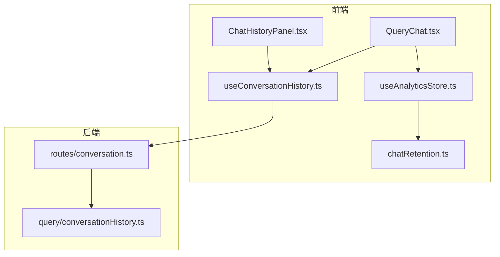
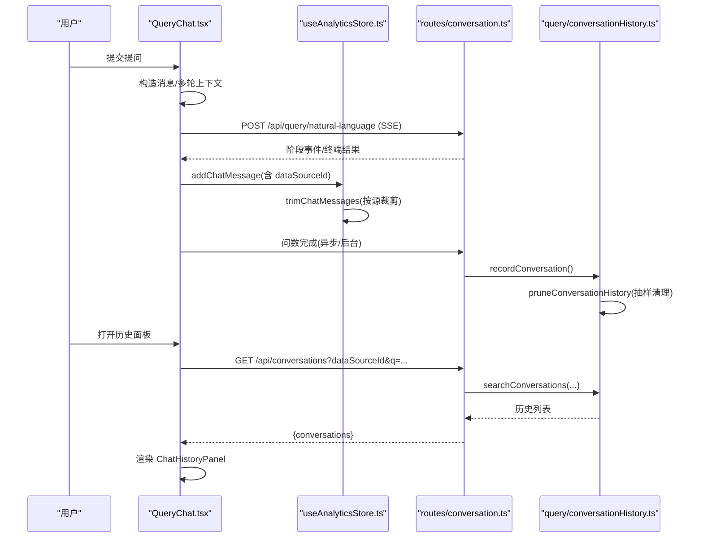
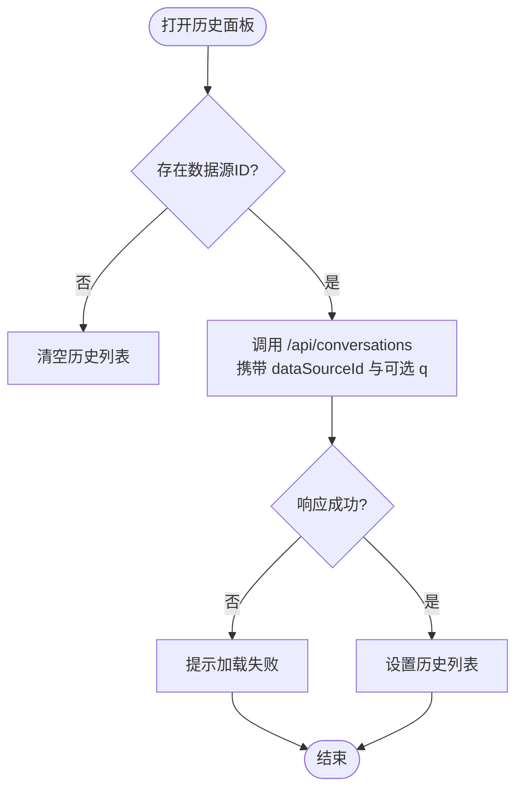
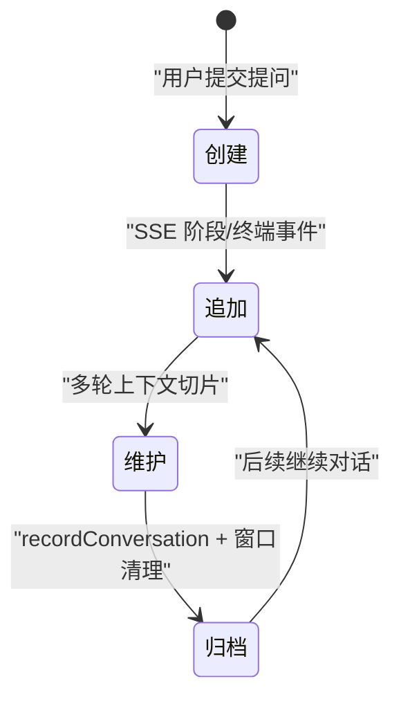
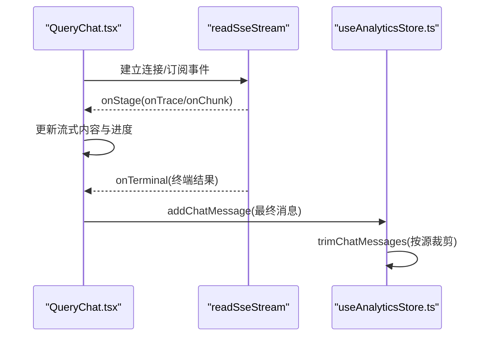
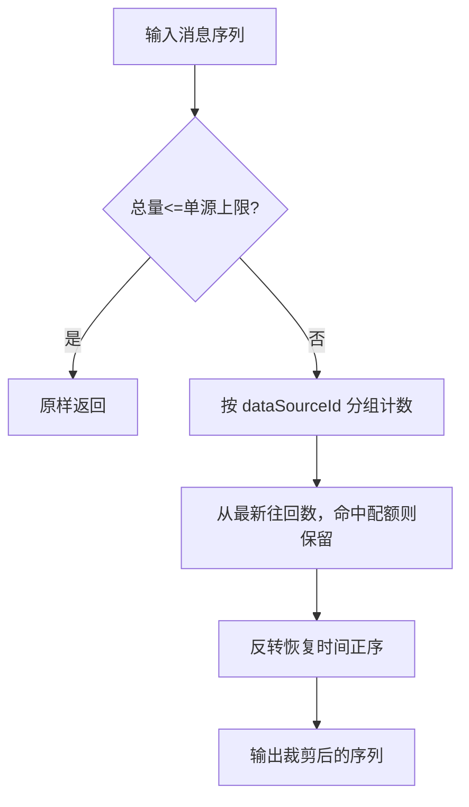
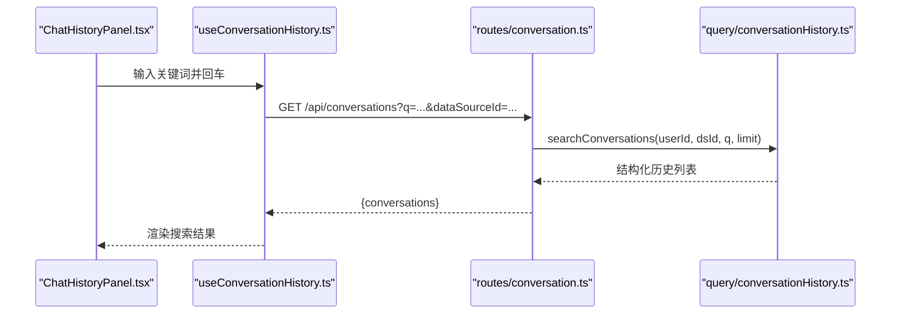
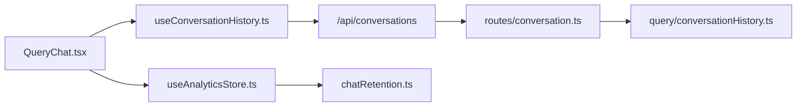

# 对话状态管理

<cite>
**本文引用的文件**
- [useConversationHistory.ts](file://src/hooks/useConversationHistory.ts)
- [chatRetention.ts](file://src/utils/chatRetention.ts)
- [conversationHistory.ts](file://server/query/conversationHistory.ts)
- [conversation.ts](file://server/routes/conversation.ts)
- [QueryChat.tsx](file://src/components/query/QueryChat.tsx)
- [ChatHistoryPanel.tsx](file://src/components/query/ChatHistoryPanel.tsx)
- [useAnalyticsStore.ts](file://src/hooks/useAnalyticsStore.ts)
</cite>

## 目录
1. [简介](#简介)
2. [项目结构](#项目结构)
3. [核心组件](#核心组件)
4. [架构总览](#架构总览)
5. [详细组件分析](#详细组件分析)
6. [依赖关系分析](#依赖关系分析)
7. [性能考量](#性能考量)
8. [故障排查指南](#故障排查指南)
9. [结论](#结论)
10. [附录](#附录)

## 简介
本文件聚焦“对话状态管理”，围绕 useConversationHistory 的实现与协作，系统说明多轮对话上下文管理、消息状态同步、历史记录存储机制；解释对话生命周期（创建、追加、维护、归档）；阐述消息状态同步（实时更新、一致性、并发控制）；详述历史记录的本地存储策略（压缩、索引优化、空间管理）；说明 chatRetention 功能（自动清理、数据迁移、备份恢复）；并覆盖对话搜索与检索（关键词、语义、分页）以及调试方法与性能优化技巧。

## 项目结构
对话状态管理由前端 Hook、UI 面板、全局 Store 与服务端持久化共同组成：
- 前端 Hook：useConversationHistory 负责历史面板的数据加载、删除、导出等交互。
- UI 面板：ChatHistoryPanel 展示历史条目并提供搜索、重问、删除等操作入口。
- 全局 Store：useAnalyticsStore 维护聊天消息列表、追加消息、按数据源隔离与滚动裁剪。
- 服务端：conversationHistory 提供落库、检索、删除、个人 few-shot 沉淀；conversation 路由暴露 REST API。

图表来源
- [QueryChat.tsx:321-338](file://src/components/query/QueryChat.tsx#L321-L338)
- [useConversationHistory.ts:41-123](file://src/hooks/useConversationHistory.ts#L41-L123)
- [ChatHistoryPanel.tsx:21-116](file://src/components/query/ChatHistoryPanel.tsx#L21-L116)
- [useAnalyticsStore.ts:347-355](file://src/hooks/useAnalyticsStore.ts#L347-L355)
- [chatRetention.ts:16-48](file://src/utils/chatRetention.ts#L16-L48)
- [conversation.ts:16-41](file://server/routes/conversation.ts#L16-L41)
- [conversationHistory.ts:43-138](file://server/query/conversationHistory.ts#L43-L138)

章节来源
- [QueryChat.tsx:321-338](file://src/components/query/QueryChat.tsx#L321-L338)
- [useConversationHistory.ts:41-123](file://src/hooks/useConversationHistory.ts#L41-L123)
- [ChatHistoryPanel.tsx:21-116](file://src/components/query/ChatHistoryPanel.tsx#L21-L116)
- [useAnalyticsStore.ts:347-355](file://src/hooks/useAnalyticsStore.ts#L347-L355)
- [chatRetention.ts:16-48](file://src/utils/chatRetention.ts#L16-L48)
- [conversation.ts:16-41](file://server/routes/conversation.ts#L16-L41)
- [conversationHistory.ts:43-138](file://server/query/conversationHistory.ts#L43-L138)

## 核心组件
- useConversationHistory：封装历史面板的开关、关键词搜索、加载、删除、导出等功能，基于当前数据源与可见消息联动。
- ChatHistoryPanel：纯展示组件，渲染历史条目、状态标签、时间戳，支持回车搜索、一键重问、单条删除。
- useAnalyticsStore：集中管理聊天消息数组，提供 addChatMessage/clearChat 等方法，并在追加时进行按数据源的滚动裁剪。
- chatRetention：实现按数据源分组的最近 N 条保留策略，防止 localStorage 无限增长。
- 服务端 conversationHistory：负责对话记录写入、窗口清理、关键词检索、删除、个人 few-shot 检索。
- 服务端 conversation 路由：对外暴露 GET/DELETE 接口，鉴权限权后调用业务逻辑。

章节来源
- [useConversationHistory.ts:41-123](file://src/hooks/useConversationHistory.ts#L41-L123)
- [ChatHistoryPanel.tsx:21-116](file://src/components/query/ChatHistoryPanel.tsx#L21-L116)
- [useAnalyticsStore.ts:347-355](file://src/hooks/useAnalyticsStore.ts#L347-L355)
- [chatRetention.ts:16-48](file://src/utils/chatRetention.ts#L16-L48)
- [conversationHistory.ts:43-138](file://server/query/conversationHistory.ts#L43-L138)
- [conversation.ts:16-41](file://server/routes/conversation.ts#L16-L41)

## 架构总览
对话状态管理贯穿“前端交互—状态管理—服务持久化”的全链路：
- 用户发起问数后，前端通过 QueryChat 构建消息并发送请求，SSE 流式接收阶段事件与终端结果，实时更新 UI 与 store。
- 问数完成后，服务端将问题、SQL、摘要、状态等写入 conversation_history，并按窗口策略定期清理。
- 历史面板通过 useConversationHistory 调用 /api/conversations 获取本人某数据源的历史，支持关键词模糊匹配。
- 本地消息在 useAnalyticsStore 中追加时，使用 chatRetention 按数据源分组裁剪，避免浏览器存储膨胀。

图表来源
- [QueryChat.tsx:547-770](file://src/components/query/QueryChat.tsx#L547-L770)
- [useAnalyticsStore.ts:347-355](file://src/hooks/useAnalyticsStore.ts#L347-L355)
- [conversation.ts:16-41](file://server/routes/conversation.ts#L16-L41)
- [conversationHistory.ts:43-138](file://server/query/conversationHistory.ts#L43-L138)

## 详细组件分析

### useConversationHistory 实现架构
- 多轮对话上下文管理：Hook 不直接持有上下文，而是依赖 QueryChat 传入的 visibleMessages（已按当前数据源过滤），用于导出 Markdown 的范围限定。
- 消息状态同步：通过 loadHistory 拉取服务端历史，失败时清空并提示；删除操作成功后即时从本地列表移除对应项。
- 历史记录存储机制：服务端 conversation_history 表承载跨设备共享的历史；前端仅缓存当前会话所需列表。
- 数据源切换：当 historyOpen 为真且 activeDataSourceId 变化时，自动重新加载对应数据源的历史。

图表来源
- [useConversationHistory.ts:48-84](file://src/hooks/useConversationHistory.ts#L48-L84)

章节来源
- [useConversationHistory.ts:41-123](file://src/hooks/useConversationHistory.ts#L41-L123)

### 对话生命周期管理
- 对话创建：用户提交提问后，QueryChat 构造 user 消息并加入 store，同时发起 SSE 请求。
- 消息追加：SSE onChunk/onTerminal 阶段更新流式内容与最终结果，addChatMessage 追加到 store。
- 上下文维护：多轮上下文取自 visibleMessages 最近若干轮，仅包含 user 与成功的 assistant 消息，避免跨源污染。
- 对话归档：服务端 recordConversation 将问答对持久化；pruneConversationHistory 按用户+数据源维度执行保留窗口清理。

图表来源
- [QueryChat.tsx:547-770](file://src/components/query/QueryChat.tsx#L547-L770)
- [conversationHistory.ts:43-90](file://server/query/conversationHistory.ts#L43-L90)

章节来源
- [QueryChat.tsx:547-770](file://src/components/query/QueryChat.tsx#L547-L770)
- [conversationHistory.ts:43-90](file://server/query/conversationHistory.ts#L43-L90)

### 消息状态同步机制
- 实时消息更新：SSE 流式推送阶段事件与增量内容，QueryChat 在 onChunk 中动态更新最后一条 assistant 消息的内容，保证打字机效果与界面一致。
- 状态一致性保证：每条消息携带 dataSourceId，visibleMessages 按当前数据源过滤；store 追加时使用 trimChatMessages 保证本地容量上限。
- 并发访问控制：React 状态更新串行化；SSE 断线续传通过 traceId 与事件序号 lastSeq 实现，最多重试两次，避免重复执行 SQL。

图表来源
- [QueryChat.tsx:676-725](file://src/components/query/QueryChat.tsx#L676-L725)
- [useAnalyticsStore.ts:347-355](file://src/hooks/useAnalyticsStore.ts#L347-L355)

章节来源
- [QueryChat.tsx:676-725](file://src/components/query/QueryChat.tsx#L676-L725)
- [useAnalyticsStore.ts:347-355](file://src/hooks/useAnalyticsStore.ts#L347-L355)

### 历史记录的本地存储策略
- 数据压缩：trimChatMessages 按数据源分组保留最近 N 条，无归属消息单独限量，避免 localStorage 无限增长。
- 索引优化：消息按时间正序追加，裁剪时从最新往回计数，保持顺序不变，便于 UI 渲染与后续扩展索引。
- 存储空间管理：默认每数据源保留约 200 条，无归属消息保留约 50 条；可通过参数调整上限。

图表来源
- [chatRetention.ts:16-48](file://src/utils/chatRetention.ts#L16-L48)

章节来源
- [chatRetention.ts:16-48](file://src/utils/chatRetention.ts#L16-L48)

### chatRetention 功能详解
- 自动清理策略：每次 addChatMessage 都会触发 trimChatMessages，确保每个数据源的消息数量不超过阈值。
- 数据迁移：useAnalyticsStore 的 persist migrate 会将旧版本缺失 dataSourceId 的消息补上活跃数据源 ID，实现历史按源隔离。
- 备份恢复：persist 配置将 chatMessages 序列化至 localStorage；迁移失败不影响下一会话重试，保证可用性。

章节来源
- [useAnalyticsStore.ts:695-732](file://src/hooks/useAnalyticsStore.ts#L695-L732)
- [useAnalyticsStore.ts:347-355](file://src/hooks/useAnalyticsStore.ts#L347-L355)
- [chatRetention.ts:16-48](file://src/utils/chatRetention.ts#L16-L48)

### 对话搜索与检索功能
- 关键词搜索：前端 ChatHistoryPanel 支持回车触发搜索，传递 q 参数；服务端 searchConversations 对 question 与 answer_summary 做 LIKE 模糊匹配。
- 语义检索：loadConversationFewShot 基于 bigram 重叠与 SQL 引用表重合度打分，选取 top 2 作为个人 few-shot，提升后续问数准确率。
- 分页加载：searchConversations 限制 limit 最大 200，前端可结合 UI 实现分页或滚动加载（当前实现为单次拉取）。

图表来源
- [ChatHistoryPanel.tsx:41-49](file://src/components/query/ChatHistoryPanel.tsx#L41-L49)
- [useConversationHistory.ts:48-66](file://src/hooks/useConversationHistory.ts#L48-L66)
- [conversation.ts:16-27](file://server/routes/conversation.ts#L16-L27)
- [conversationHistory.ts:107-129](file://server/query/conversationHistory.ts#L107-L129)

章节来源
- [ChatHistoryPanel.tsx:41-49](file://src/components/query/ChatHistoryPanel.tsx#L41-L49)
- [useConversationHistory.ts:48-66](file://src/hooks/useConversationHistory.ts#L48-L66)
- [conversation.ts:16-27](file://server/routes/conversation.ts#L16-L27)
- [conversationHistory.ts:107-129](file://server/query/conversationHistory.ts#L107-L129)

## 依赖关系分析
- 前端依赖：
  - QueryChat 依赖 useAnalyticsStore 管理消息与查询状态，依赖 useConversationHistory 驱动历史面板。
  - useConversationHistory 依赖 apiFetch 调用 /api/conversations，依赖 conversationExport 工具进行 Markdown 导出。
  - useAnalyticsStore 依赖 chatRetention 进行消息裁剪。
- 后端依赖：
  - routes/conversation 依赖 authMiddleware、requireRole、rateLimiter 进行鉴权与限流。
  - conversationHistory 依赖数据库连接池、SQL 归一化与相似度计算工具。

图表来源
- [QueryChat.tsx:321-338](file://src/components/query/QueryChat.tsx#L321-L338)
- [useConversationHistory.ts:48-66](file://src/hooks/useConversationHistory.ts#L48-L66)
- [conversation.ts:16-41](file://server/routes/conversation.ts#L16-L41)
- [conversationHistory.ts:43-138](file://server/query/conversationHistory.ts#L43-L138)
- [useAnalyticsStore.ts:347-355](file://src/hooks/useAnalyticsStore.ts#L347-L355)
- [chatRetention.ts:16-48](file://src/utils/chatRetention.ts#L16-L48)

章节来源
- [QueryChat.tsx:321-338](file://src/components/query/QueryChat.tsx#L321-L338)
- [useConversationHistory.ts:48-66](file://src/hooks/useConversationHistory.ts#L48-L66)
- [conversation.ts:16-41](file://server/routes/conversation.ts#L16-L41)
- [conversationHistory.ts:43-138](file://server/query/conversationHistory.ts#L43-L138)
- [useAnalyticsStore.ts:347-355](file://src/hooks/useAnalyticsStore.ts#L347-L355)
- [chatRetention.ts:16-48](file://src/utils/chatRetention.ts#L16-L48)

## 性能考量
- 本地存储裁剪：trimChatMessages 采用从新到旧的一次遍历，时间复杂度 O(n)，空间复杂度 O(k)（k 为保留条数），有效抑制 localStorage 膨胀。
- 服务端窗口清理：pruneConversationHistory 抽样 10% 触发，减少写放大；CONVERSATION_RETENTION 可配置关闭。
- SSE 断线续传：基于 traceId 与 lastSeq 的续传机制，避免重复执行 SQL，降低网络抖动影响。
- 多轮上下文切片：仅取最近若干轮，控制 prompt 长度与 token 预算，提升推理效率。
- 搜索限制：searchConversations 限制 limit 最大 200，防止大结果集拖慢响应。

[本节为通用性能讨论，不直接分析具体文件]

## 故障排查指南
- 历史加载失败：检查 activeDataSourceId 是否有效；查看网络请求与错误提示；确认服务端鉴权与权限。
- 删除失败：确认 ID 合法且属于当前用户；检查 rateLimiter 与鉴权中间件；查看服务端日志。
- 消息不同步：确认 addChatMessage 是否正确附加 dataSourceId；检查 trimChatMessages 是否误删；核对 visibleMessages 过滤条件。
- SSE 异常：关注 onTerminal 是否触发；若出现 AbortError 或 sseTerminal，不应重试；必要时检查 traceId 与 lastSeq。

章节来源
- [useConversationHistory.ts:86-99](file://src/hooks/useConversationHistory.ts#L86-L99)
- [conversation.ts:30-41](file://server/routes/conversation.ts#L30-L41)
- [QueryChat.tsx:738-769](file://src/components/query/QueryChat.tsx#L738-L769)

## 结论
该对话状态管理体系以前端 Hook 与 Store 为核心，结合服务端持久化与窗口治理，实现了多轮上下文管理、消息状态同步与历史记录的可靠存储。chatRetention 保障本地存储可控，SSE 断线续传提升稳定性，个人 few-shot 沉淀增强后续问数质量。整体设计兼顾用户体验与系统可扩展性，适合企业级数据分析场景。

[本节为总结性内容，不直接分析具体文件]

## 附录
- 关键接口
  - GET /api/conversations：检索本人某数据源的对话历史，支持关键词模糊匹配。
  - DELETE /api/conversations/:id：删除单条对话（仅限本人记录）。
- 环境变量
  - CONVERSATION_RETENTION：对话历史保留窗口大小，默认 500，设为 0 关闭清理。
- 最佳实践
  - 合理设置 MAX_MESSAGES_PER_SOURCE 与 MAX_UNASSIGNED_MESSAGES，平衡体验与存储。
  - 开启 SSE 断线续传，提升弱网环境下的鲁棒性。
  - 利用个人 few-shot 沉淀，持续优化问数准确率。

[本节为补充信息，不直接分析具体文件]