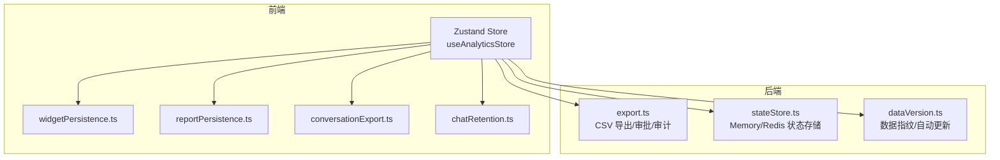
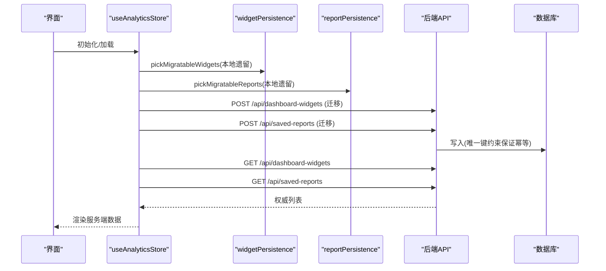
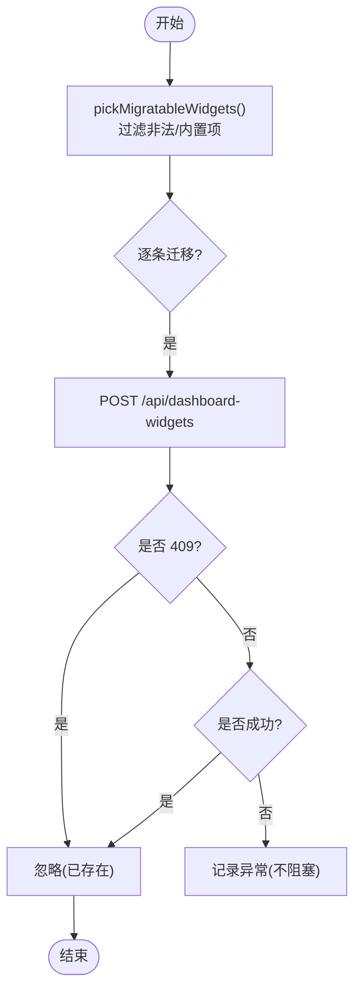
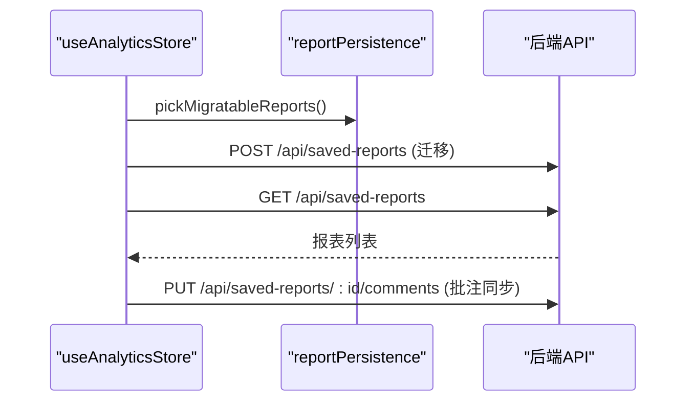
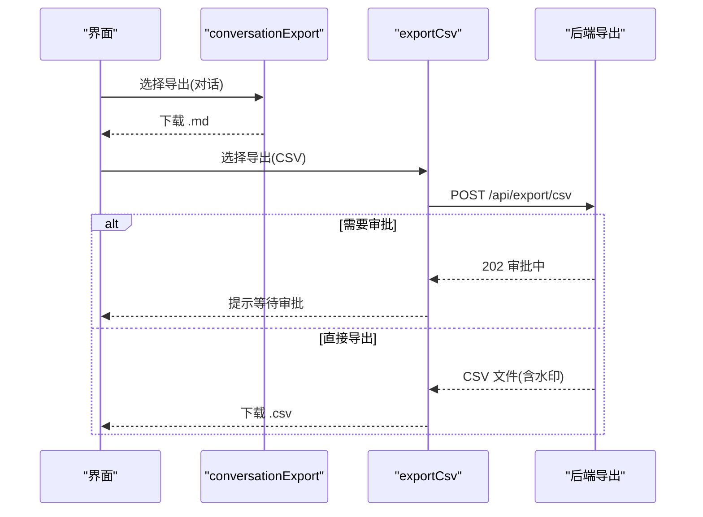
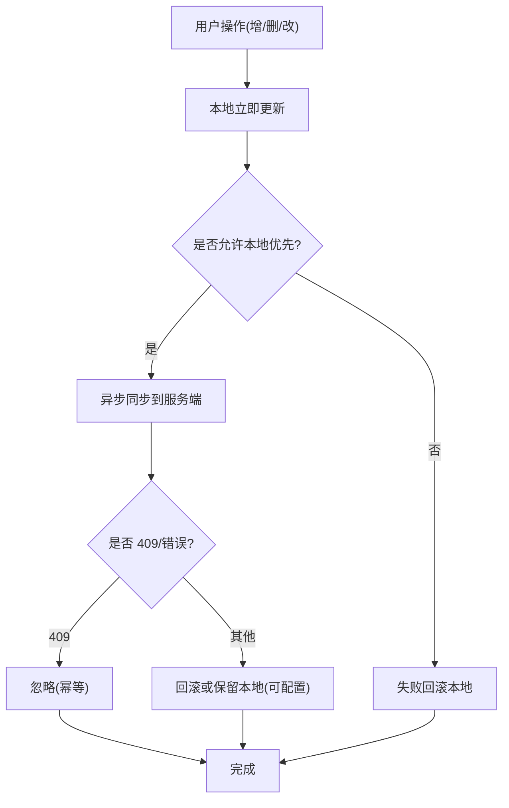
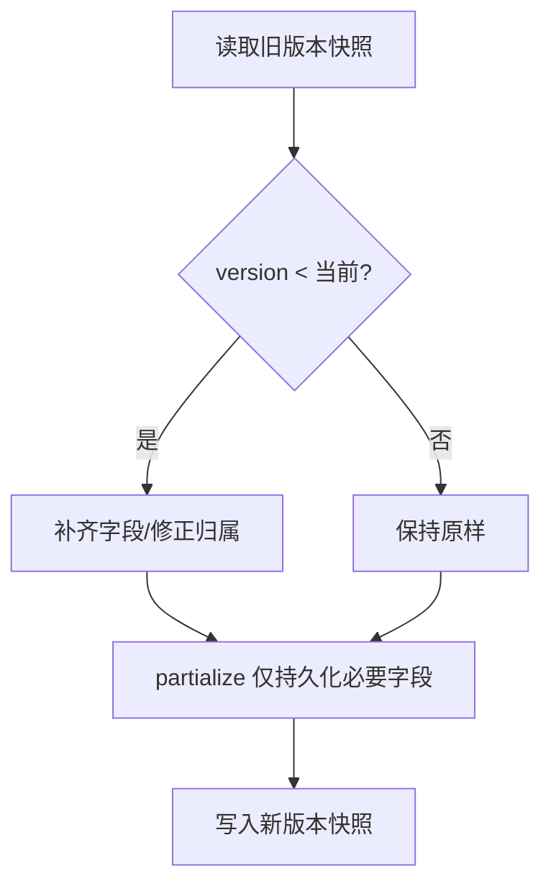
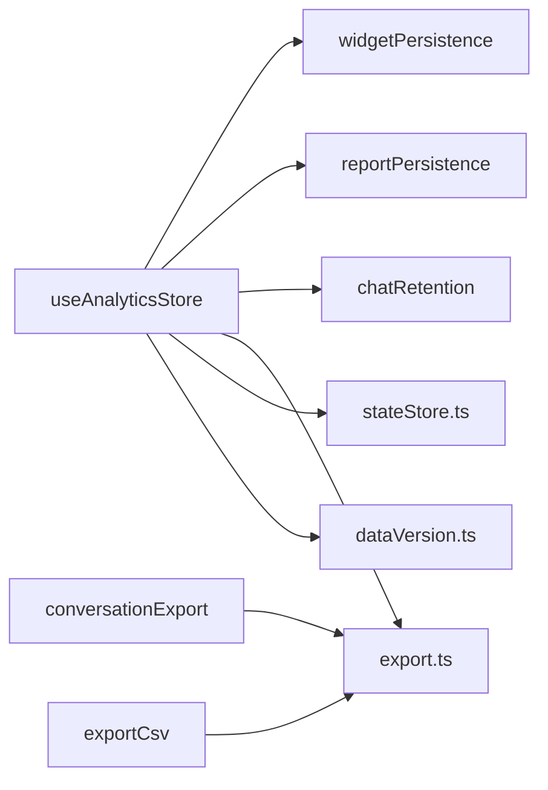

# 状态持久化

<cite>
**本文引用的文件**
- [src/utils/widgetPersistence.ts](file://src/utils/widgetPersistence.ts)
- [src/utils/reportPersistence.ts](file://src/utils/reportPersistence.ts)
- [src/utils/conversationExport.ts](file://src/utils/conversationExport.ts)
- [src/hooks/useAnalyticsStore.ts](file://src/hooks/useAnalyticsStore.ts)
- [src/utils/chatRetention.ts](file://src/utils/chatRetention.ts)
- [server/routes/export.ts](file://server/routes/export.ts)
- [src/utils/exportCsv.ts](file://src/utils/exportCsv.ts)
- [server/infra/stateStore.ts](file://server/infra/stateStore.ts)
- [server/dataVersion.ts](file://server/dataVersion.ts)
</cite>

## 目录
1. [简介](#简介)
2. [项目结构](#项目结构)
3. [核心组件](#核心组件)
4. [架构总览](#架构总览)
5. [详细组件分析](#详细组件分析)
6. [依赖关系分析](#依赖关系分析)
7. [性能考虑](#性能考虑)
8. [故障排查指南](#故障排查指南)
9. [结论](#结论)
10. [附录](#附录)

## 简介
本文件围绕“状态持久化”主题，系统化说明以下能力：
- widgetPersistence：本地存储策略、数据序列化格式、版本兼容与迁移机制。
- reportPersistence：报表配置保存、模板管理、导出格式支持。
- conversationExport：对话导出（Markdown/CSV）与批量导出流程。
- 状态同步机制：本地与服务端一致性、冲突检测、增量更新策略。
- 数据迁移方案：版本升级、数据结构变更、向后兼容。
- 存储优化：压缩、分片、清理策略。
- 调试与排障：定位问题与恢复手段。

## 项目结构
前端通过 Zustand + persist 中间件维护应用状态，并将部分字段持久化到浏览器 localStorage；同时通过 API 将关键业务对象（看板图表、报表、批注等）持久化到服务端数据库。后端提供统一导出通道与状态共享存储抽象（内存/Redis）。

**图示来源**
- [src/hooks/useAnalyticsStore.ts:249-733](file://src/hooks/useAnalyticsStore.ts#L249-L733)
- [src/utils/widgetPersistence.ts:1-36](file://src/utils/widgetPersistence.ts#L1-L36)
- [src/utils/reportPersistence.ts:1-32](file://src/utils/reportPersistence.ts#L1-L32)
- [src/utils/conversationExport.ts:1-44](file://src/utils/conversationExport.ts#L1-L44)
- [src/utils/chatRetention.ts:1-49](file://src/utils/chatRetention.ts#L1-L49)
- [server/routes/export.ts:1-226](file://server/routes/export.ts#L1-L226)
- [server/infra/stateStore.ts:1-219](file://server/infra/stateStore.ts#L1-L219)
- [server/dataVersion.ts:1-104](file://server/dataVersion.ts#L1-L104)

**章节来源**
- [src/hooks/useAnalyticsStore.ts:249-733](file://src/hooks/useAnalyticsStore.ts#L249-L733)

## 核心组件
- widgetPersistence：负责从本地遗留数据中筛选可迁移的看板图表，并将服务端记录映射为前端 Widget 模型，确保幂等迁移与结构校验。
- reportPersistence：负责从本地遗留数据中筛选可迁移的报表，排除内置演示报表，并将服务端记录映射为 SavedReport。
- conversationExport：构建对话 Markdown 并触发下载；配合后端 CSV 导出通道完成批量导出。
- useAnalyticsStore：集中管理数据源、对话、看板图表、报表等状态，封装初始化、迁移、远端同步、回滚与并发控制。
- chatRetention：对持久化的对话消息按数据源分组裁剪，防止 localStorage 无限膨胀。
- export.ts：统一 CSV 导出入口，含水印、阈值审批、审计日志。
- stateStore.ts：进程内/分布式状态存储抽象（Memory/Redis），用于计划、缓存、限流、配额等。
- dataVersion.ts：基于表统计计算轻量数据指纹，驱动前端“数据变化自动检测、自主更新”。

**章节来源**
- [src/utils/widgetPersistence.ts:1-36](file://src/utils/widgetPersistence.ts#L1-L36)
- [src/utils/reportPersistence.ts:1-32](file://src/utils/reportPersistence.ts#L1-L32)
- [src/utils/conversationExport.ts:1-44](file://src/utils/conversationExport.ts#L1-L44)
- [src/hooks/useAnalyticsStore.ts:249-733](file://src/hooks/useAnalyticsStore.ts#L249-L733)
- [src/utils/chatRetention.ts:1-49](file://src/utils/chatRetention.ts#L1-L49)
- [server/routes/export.ts:1-226](file://server/routes/export.ts#L1-L226)
- [server/infra/stateStore.ts:1-219](file://server/infra/stateStore.ts#L1-L219)
- [server/dataVersion.ts:1-104](file://server/dataVersion.ts#L1-L104)

## 架构总览
前端状态由 Zustand 管理，部分字段通过 persist 写入 localStorage；初始化时执行本地遗留数据迁移至服务端，再拉取服务端权威列表覆盖内存镜像。写操作采用“先本地后远端”的乐观更新，失败时回滚或保留本地（可选）。后端提供统一的导出通道与状态共享存储。

**图示来源**
- [src/hooks/useAnalyticsStore.ts:386-419](file://src/hooks/useAnalyticsStore.ts#L386-L419)
- [src/hooks/useAnalyticsStore.ts:517-550](file://src/hooks/useAnalyticsStore.ts#L517-L550)
- [src/utils/widgetPersistence.ts:10-35](file://src/utils/widgetPersistence.ts#L10-L35)
- [src/utils/reportPersistence.ts:12-31](file://src/utils/reportPersistence.ts#L12-L31)

## 详细组件分析

### widgetPersistence：本地存储策略、序列化与版本兼容
- 本地存储策略
  - 旧版看板图表数据随 Zustand persist 进入内存；当前 partialize 已移除 dashboardWidgets，避免继续落库 localStorage。
  - 首次初始化时，从内存镜像中筛选可迁移项，调用服务端接口进行一次性迁移。
- 数据序列化格式
  - 服务端记录包含 widgetId 与 widget JSON；前端通过 widgetFromRecord 校验 id/title/chartConfig/data 等关键字段，不合法则丢弃。
- 版本兼容处理
  - DEFAULT_WIDGET_IDS 排除出厂内置图表，避免覆盖。
  - 重复迁移由服务端 widget_id UNIQUE 约束吸收（409 视为成功）。
  - 迁移失败单条不影响整体，下一会话重试。

**图示来源**
- [src/utils/widgetPersistence.ts:10-35](file://src/utils/widgetPersistence.ts#L10-L35)
- [src/hooks/useAnalyticsStore.ts:386-419](file://src/hooks/useAnalyticsStore.ts#L386-L419)

**章节来源**
- [src/utils/widgetPersistence.ts:1-36](file://src/utils/widgetPersistence.ts#L1-L36)
- [src/hooks/useAnalyticsStore.ts:386-419](file://src/hooks/useAnalyticsStore.ts#L386-L419)

### reportPersistence：报表配置保存、模板管理与导出格式
- 报表配置保存
  - 初始化时从本地遗留数据筛选可迁移报表（排除演示报表 DEMO_REPORT_ID），POST 到服务端 saved_reports。
  - 随后拉取服务端权威列表，填充内存镜像。
- 模板管理
  - 报表对象包含 templateType、charts、kpiList、insights、comments 等字段，支持评论与回复的增量同步。
- 导出格式支持
  - 前端通过 conversationExport 生成 Markdown 对话导出；数据结果可通过后端统一 CSV 导出通道导出（带水印与审计）。

**图示来源**
- [src/utils/reportPersistence.ts:12-31](file://src/utils/reportPersistence.ts#L12-L31)
- [src/hooks/useAnalyticsStore.ts:517-550](file://src/hooks/useAnalyticsStore.ts#L517-L550)
- [src/hooks/useAnalyticsStore.ts:609-621](file://src/hooks/useAnalyticsStore.ts#L609-L621)

**章节来源**
- [src/utils/reportPersistence.ts:1-32](file://src/utils/reportPersistence.ts#L1-L32)
- [src/hooks/useAnalyticsStore.ts:517-550](file://src/hooks/useAnalyticsStore.ts#L517-L550)
- [src/hooks/useAnalyticsStore.ts:609-621](file://src/hooks/useAnalyticsStore.ts#L609-L621)

### conversationExport：JSON/CSV/批量导出
- Markdown 导出
  - buildConversationMessages 组装标题、数据源、时间、消息数与每条问答内容，若回答包含 SQL 则以代码块形式输出。
  - downloadMarkdownFile 使用 Blob + a.click 触发浏览器下载。
- CSV 导出（批量）
  - 前端通过 exportCsv.downloadServerCsv 调用后端 /api/export/csv。
  - 后端根据行数阈值决定是否进入审批流；超过硬上限直接拒绝；所有导出均嵌入水印并记录审计日志。

**图示来源**
- [src/utils/conversationExport.ts:11-43](file://src/utils/conversationExport.ts#L11-L43)
- [src/utils/exportCsv.ts:15-58](file://src/utils/exportCsv.ts#L15-L58)
- [server/routes/export.ts:91-165](file://server/routes/export.ts#L91-L165)

**章节来源**
- [src/utils/conversationExport.ts:1-44](file://src/utils/conversationExport.ts#L1-44)
- [src/utils/exportCsv.ts:1-59](file://src/utils/exportCsv.ts#L1-59)
- [server/routes/export.ts:1-226](file://server/routes/export.ts#L1-L226)

### 状态同步机制：本地与云端、冲突检测、增量更新
- 本地优先（乐观更新）
  - 看板图表与报表的增删改在本地立即生效，再异步同步到服务端；失败时可选择回滚或保留本地（如 keepLocalOnError）。
- 冲突检测
  - 服务端唯一键约束（widget_id、report_id）保证幂等；409 视为已存在，前端视为成功。
- 增量更新
  - 批注通过 PUT comments 整体同步；高频拖拽预览使用 localOnly 仅本地更新，mouseup 再发远端同步一次。
- 权威列表
  - 初始化完成后拉取服务端权威列表覆盖内存镜像，确保多端一致。

**图示来源**
- [src/hooks/useAnalyticsStore.ts:421-500](file://src/hooks/useAnalyticsStore.ts#L421-L500)
- [src/hooks/useAnalyticsStore.ts:552-607](file://src/hooks/useAnalyticsStore.ts#L552-L607)
- [src/hooks/useAnalyticsStore.ts:609-621](file://src/hooks/useAnalyticsStore.ts#L609-L621)

**章节来源**
- [src/hooks/useAnalyticsStore.ts:421-500](file://src/hooks/useAnalyticsStore.ts#L421-L500)
- [src/hooks/useAnalyticsStore.ts:552-607](file://src/hooks/useAnalyticsStore.ts#L552-L607)
- [src/hooks/useAnalyticsStore.ts:609-621](file://src/hooks/useAnalyticsStore.ts#L609-L621)

### 数据迁移方案：版本升级、结构变更、向后兼容
- 版本管理
  - Zustand persist 配置 version=6，migrate 函数针对历史版本补齐字段（如 dataSourceId、dataSourceId 归属等）。
- 结构变更
  - v5：savedReports 退出持久化，改为服务端 saved_reports 表；v6：dashboardWidgets 退出持久化，改为服务端 dashboard_widgets 表。
- 向后兼容
  - 旧快照经 migrate 补齐后，partialize 仅持久化必要字段；缺失字段由默认值兜底。
  - 演示报表（report-demo-1）不落库，仅本地隐藏标记。

**图示来源**
- [src/hooks/useAnalyticsStore.ts:687-733](file://src/hooks/useAnalyticsStore.ts#L687-L733)

**章节来源**
- [src/hooks/useAnalyticsStore.ts:687-733](file://src/hooks/useAnalyticsStore.ts#L687-L733)

### 存储优化策略：压缩、分片、清理
- 对话消息清理
  - 按数据源分组保留最近 N 条（默认每源 200 条），无归属消息全局保留 50 条，防止 localStorage 膨胀。
- 分片存储
  - 通过 dataSourceId 作为分组键实现逻辑分片，避免跨源污染。
- 压缩
  - 当前未启用显式压缩；如需进一步节省空间，可在后续引入压缩层（例如 gzip 后再 base64）。
- 清理策略
  - 初始化时迁移本地遗留数据后，partialize 不再持久化 dashboardWidgets/savedReports，避免冗余。

**章节来源**
- [src/utils/chatRetention.ts:1-49](file://src/utils/chatRetention.ts#L1-L49)
- [src/hooks/useAnalyticsStore.ts:687-733](file://src/hooks/useAnalyticsStore.ts#L687-L733)

## 依赖关系分析
- 前端依赖
  - useAnalyticsStore 依赖 widgetPersistence、reportPersistence、chatRetention 以及后端 API。
  - conversationExport 与 exportCsv 分别对接 Markdown 下载与后端 CSV 导出。
- 后端依赖
  - export.ts 依赖认证、限流、数据库连接池、审计日志。
  - stateStore.ts 提供 Memory/Redis 两种实现，供进程内状态共享。
  - dataVersion.ts 依赖数据源连接池，计算表统计指纹。

**图示来源**
- [src/hooks/useAnalyticsStore.ts:249-733](file://src/hooks/useAnalyticsStore.ts#L249-L733)
- [src/utils/widgetPersistence.ts:1-36](file://src/utils/widgetPersistence.ts#L1-L36)
- [src/utils/reportPersistence.ts:1-32](file://src/utils/reportPersistence.ts#L1-L32)
- [src/utils/chatRetention.ts:1-49](file://src/utils/chatRetention.ts#L1-L49)
- [src/utils/conversationExport.ts:1-44](file://src/utils/conversationExport.ts#L1-L44)
- [src/utils/exportCsv.ts:1-59](file://src/utils/exportCsv.ts#L1-59)
- [server/routes/export.ts:1-226](file://server/routes/export.ts#L1-L226)
- [server/infra/stateStore.ts:1-219](file://server/infra/stateStore.ts#L1-L219)
- [server/dataVersion.ts:1-104](file://server/dataVersion.ts#L1-L104)

**章节来源**
- [src/hooks/useAnalyticsStore.ts:249-733](file://src/hooks/useAnalyticsStore.ts#L249-L733)
- [server/routes/export.ts:1-226](file://server/routes/export.ts#L1-L226)
- [server/infra/stateStore.ts:1-219](file://server/infra/stateStore.ts#L1-L219)
- [server/dataVersion.ts:1-104](file://server/dataVersion.ts#L1-L104)

## 性能考虑
- 本地优先与局部更新
  - 高频交互（如拖拽缩放）使用 localOnly 减少网络请求，降低抖动。
- 幂等与去重
  - 唯一键约束与 409 处理避免重复写入，提升鲁棒性。
- 数据指纹缓存
  - dataVersion 对指纹结果进行短时缓存（10s），避免多端轮询风暴。
- 导出限制
  - 后端设置最大行数与审批阈值，防止超大导出导致内存压力。

[本节为通用性能建议，无需特定文件引用]

## 故障排查指南
- 本地迁移失败
  - 现象：初始化后看板/报表未出现。
  - 排查：检查网络与鉴权；查看控制台异常；确认服务端唯一键冲突（409）是否被正确忽略。
- 批注不同步
  - 现象：评论/回复未持久化。
  - 排查：确认 syncReportCommentsRemote 调用是否成功；检查后端返回码与审计日志。
- 对话历史过大
  - 现象：localStorage 增长过快。
  - 排查：确认 trimChatMessages 是否生效；调整 MAX_MESSAGES_PER_SOURCE/MAX_UNASSIGNED_MESSAGES。
- 导出被拦截
  - 现象：CSV 导出返回 202 或 413。
  - 排查：查看行数是否超过阈值或硬上限；检查审批单状态；确认审计日志。
- 数据未自动更新
  - 现象：看板/报表未感知数据变化。
  - 排查：检查 dataVersion 缓存与计算结果；确认数据源类型与连接可用性。

**章节来源**
- [src/hooks/useAnalyticsStore.ts:386-419](file://src/hooks/useAnalyticsStore.ts#L386-L419)
- [src/hooks/useAnalyticsStore.ts:517-550](file://src/hooks/useAnalyticsStore.ts#L517-L550)
- [src/hooks/useAnalyticsStore.ts:609-621](file://src/hooks/useAnalyticsStore.ts#L609-L621)
- [src/utils/chatRetention.ts:1-49](file://src/utils/chatRetention.ts#L1-L49)
- [server/routes/export.ts:91-165](file://server/routes/export.ts#L91-L165)
- [server/dataVersion.ts:56-98](file://server/dataVersion.ts#L56-L98)

## 结论
本系统通过“本地优先 + 服务端权威 + 幂等迁移”的模式实现了稳健的状态持久化。widgetPersistence 与 reportPersistence 保证了本地遗留数据的平滑迁移；conversationExport 与后端导出通道提供了安全的批量导出能力；stateStore 与 dataVersion 为多实例与自动更新提供了基础设施支撑。结合严格的版本迁移与清理策略，系统在可扩展性与可维护性方面具备良好基础。

[本节为总结性内容，无需特定文件引用]

## 附录
- 关键接口路径
  - /api/dashboard-widgets：看板图表 CRUD 与排序
  - /api/saved-reports：报表 CRUD 与批注同步
  - /api/export/csv：统一 CSV 导出（水印/审批/审计）
- 环境变量
  - REDIS_URL：启用 Redis 外置状态存储
  - DLP_EXPORT_APPROVE_ROWS：导出审批阈值
  - DLP_EXPORT_MAX_ROWS：导出硬上限

[本节为补充信息，无需特定文件引用]