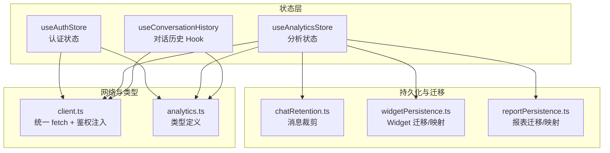
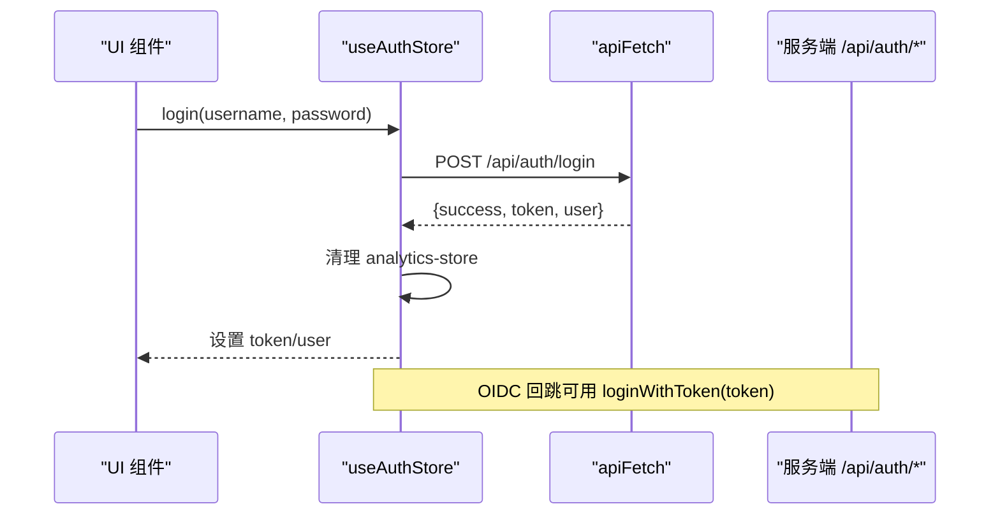
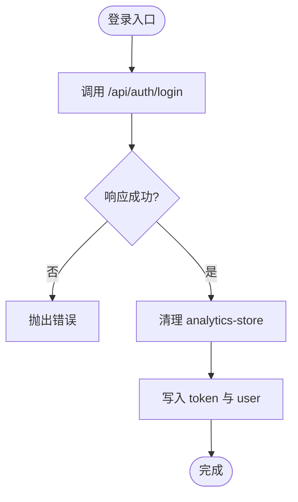
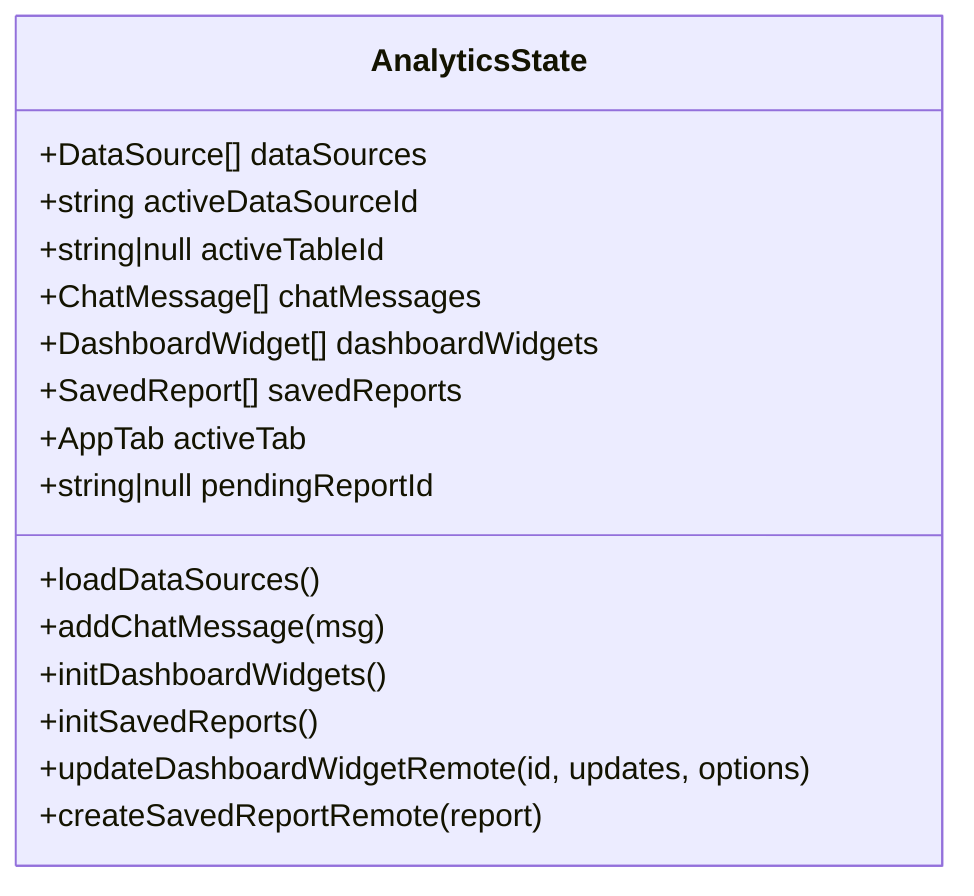
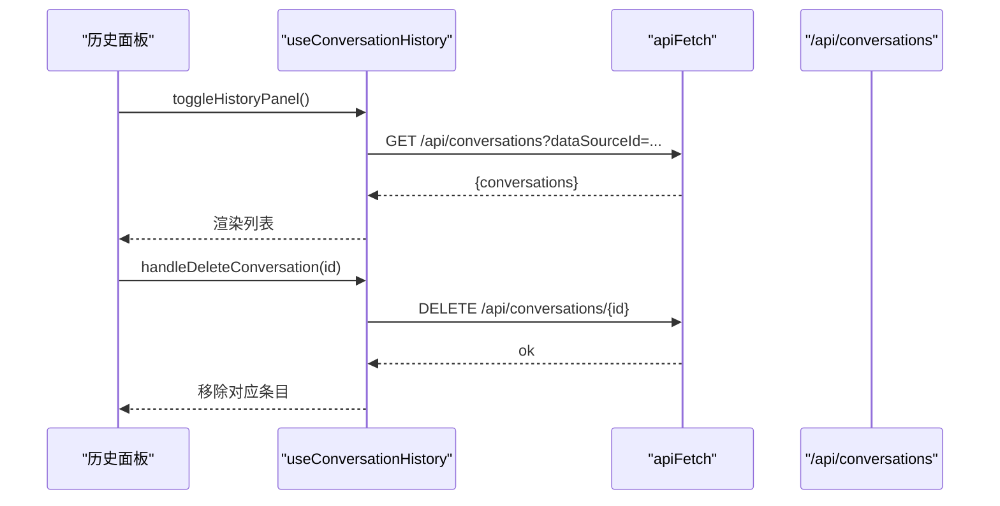
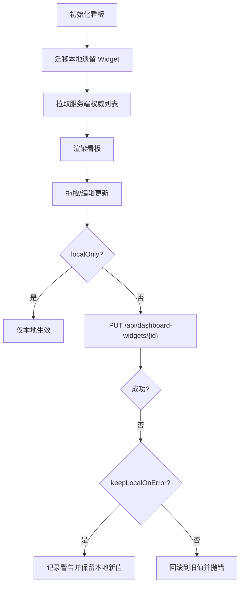
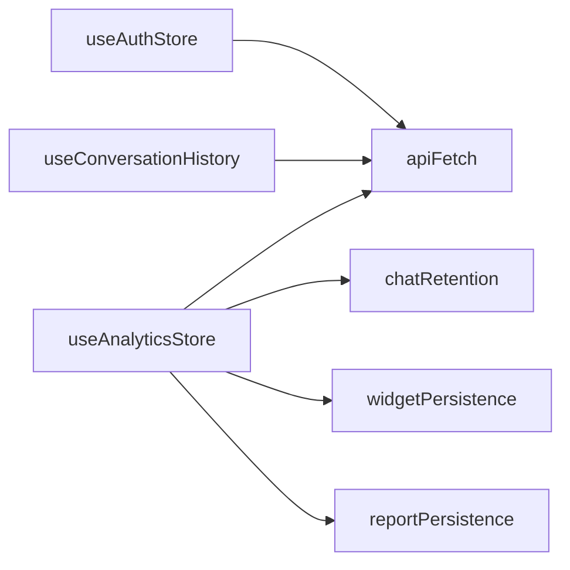

# 状态管理

<cite>
**本文引用的文件**
- [useAuthStore.ts](file://src/hooks/useAuthStore.ts)
- [useAnalyticsStore.ts](file://src/hooks/useAnalyticsStore.ts)
- [useConversationHistory.ts](file://src/hooks/useConversationHistory.ts)
- [widgetPersistence.ts](file://src/utils/widgetPersistence.ts)
- [reportPersistence.ts](file://src/utils/reportPersistence.ts)
- [chatRetention.ts](file://src/utils/chatRetention.ts)
- [client.ts](file://src/api/client.ts)
- [analytics.ts](file://src/types/analytics.ts)
</cite>

## 目录
1. [简介](#简介)
2. [项目结构](#项目结构)
3. [核心组件](#核心组件)
4. [架构总览](#架构总览)
5. [详细组件分析](#详细组件分析)
6. [依赖关系分析](#依赖关系分析)
7. [性能考虑](#性能考虑)
8. [故障排查指南](#故障排查指南)
9. [结论](#结论)
10. [附录](#附录)

## 简介
本文件系统性说明智能问数据分析系统的状态管理设计，聚焦基于 Zustand 的前端状态架构与持久化策略。文档覆盖：
- 全局状态结构设计、版本迁移与持久化契约
- 认证状态管理（登录态、权限控制、会话处理）
- 分析状态管理（数据源、查询历史、用户偏好）
- 对话历史管理（多轮上下文、消息同步、历史记录存储）
- Widget 状态持久化机制（本地迁移、云端同步、版本兼容）
- 状态调试工具、性能优化技巧与常见问题解决方案

## 项目结构
前端状态以多个独立的 Zustand store 和 React hooks 组织，围绕“认证”“分析”“对话历史”三大域进行职责划分；通用能力通过 utils 与 api client 解耦实现。

图表来源
- [useAuthStore.ts:19-83](file://src/hooks/useAuthStore.ts#L19-L83)
- [useAnalyticsStore.ts:249-733](file://src/hooks/useAnalyticsStore.ts#L249-L733)
- [useConversationHistory.ts:41-123](file://src/hooks/useConversationHistory.ts#L41-L123)
- [chatRetention.ts:16-48](file://src/utils/chatRetention.ts#L16-L48)
- [widgetPersistence.ts:11-35](file://src/utils/widgetPersistence.ts#L11-L35)
- [reportPersistence.ts:16-31](file://src/utils/reportPersistence.ts#L16-L31)
- [client.ts:48-73](file://src/api/client.ts#L48-L73)
- [analytics.ts:1-372](file://src/types/analytics.ts#L1-L372)

章节来源
- [useAuthStore.ts:19-83](file://src/hooks/useAuthStore.ts#L19-L83)
- [useAnalyticsStore.ts:249-733](file://src/hooks/useAnalyticsStore.ts#L249-L733)
- [useConversationHistory.ts:41-123](file://src/hooks/useConversationHistory.ts#L41-L123)
- [chatRetention.ts:16-48](file://src/utils/chatRetention.ts#L16-L48)
- [widgetPersistence.ts:11-35](file://src/utils/widgetPersistence.ts#L11-L35)
- [reportPersistence.ts:16-31](file://src/utils/reportPersistence.ts#L16-L31)
- [client.ts:48-73](file://src/api/client.ts#L48-L73)
- [analytics.ts:1-372](file://src/types/analytics.ts#L1-L372)

## 核心组件
- useAuthStore：认证与会话状态，包含 token、用户信息、角色判断、强制改密标记等，使用 zustand/middleware persist 持久化到 localStorage。
- useAnalyticsStore：分析域主状态，涵盖数据源、聊天消息、看板 Widget、历史报表、当前 Tab、待跳转报告等，采用服务端权威数据 + 本地迁移的混合模式。
- useConversationHistory：对话历史面板 Hook，负责拉取、搜索、删除、导出 Markdown 以及切换数据源时自动刷新。
- 持久化工具：chatRetention 用于消息滚动上限；widgetPersistence/reportPersistence 用于本地遗留数据迁移与服务端记录映射。
- 网络客户端：apiFetch 统一注入 Authorization 头、处理 401/403 并触发会话侧行为。

章节来源
- [useAuthStore.ts:19-83](file://src/hooks/useAuthStore.ts#L19-L83)
- [useAnalyticsStore.ts:249-733](file://src/hooks/useAnalyticsStore.ts#L249-L733)
- [useConversationHistory.ts:41-123](file://src/hooks/useConversationHistory.ts#L41-L123)
- [chatRetention.ts:16-48](file://src/utils/chatRetention.ts#L16-L48)
- [widgetPersistence.ts:11-35](file://src/utils/widgetPersistence.ts#L11-L35)
- [reportPersistence.ts:16-31](file://src/utils/reportPersistence.ts#L16-L31)
- [client.ts:48-73](file://src/api/client.ts#L48-L73)

## 架构总览
整体采用“薄 Store + 厚逻辑”的设计：Zustand store 仅维护最小必要状态与原子更新方法，复杂流程（如服务端同步、迁移、错误回滚）在 store 内组合调用，并通过 utils 提供纯函数辅助。

图表来源
- [useAuthStore.ts:26-57](file://src/hooks/useAuthStore.ts#L26-L57)
- [client.ts:48-73](file://src/api/client.ts#L48-L73)

章节来源
- [useAuthStore.ts:26-57](file://src/hooks/useAuthStore.ts#L26-L57)
- [client.ts:48-73](file://src/api/client.ts#L48-L73)

## 详细组件分析

### 认证状态管理（useAuthStore）
- 状态字段
  - token：访问令牌
  - user：当前用户对象（含 role、department、mustChangePassword）
- 关键方法
  - login：调用登录接口，成功后写入 token 与 user，并清理旧分析缓存
  - loginWithToken：OIDC 回跳场景，用本地 JWT 校验并填充用户
  - logout：清除 token 与 user，同时清理分析缓存
  - hasRole：基于当前用户角色进行权限判断
  - markMustChangePassword/clearMustChangePassword：配合服务端 403 拦截，强制改密流程
- 持久化策略
  - 使用 persist 中间件，name 为 auth-store，partialize 仅持久化 token 与 user
  - 登出或切换账号时主动清理 analytics-store，避免跨账号污染

图表来源
- [useAuthStore.ts:26-57](file://src/hooks/useAuthStore.ts#L26-L57)

章节来源
- [useAuthStore.ts:19-83](file://src/hooks/useAuthStore.ts#L19-L83)
- [analytics.ts:6-17](file://src/types/analytics.ts#L6-L17)

### 分析状态管理（useAnalyticsStore）
- 状态字段
  - 数据源：dataSources、activeDataSourceId、activeTableId
  - 聊天与查询：chatMessages、currentQuery、isQueryLoading、activeQueryResult
  - 看板 Widget：dashboardWidgets（服务端权威）
  - 历史报表：savedReports（服务端权威）
  - 视图与导航：activeTab、pendingReportId
- 关键方法
  - 数据源加载与切换：loadDataSources、setActiveDataSource、updateTableSchema
  - 聊天消息：addChatMessage（带按源隔离与滚动裁剪）、setMessageFeedback、clearChat
  - Widget 持久化：initDashboardWidgets（迁移+拉取）、pinChartToDashboardRemote、updateDashboardWidgetRemote（支持 localOnly/keepLocalOnError）、removeDashboardWidgetRemote、reorderDashboardWidgetsRemote
  - 报表持久化：initSavedReports（迁移+拉取）、create/update/removeSavedReportRemote、syncReportCommentsRemote、demoReportDismissed
- 持久化与版本迁移
  - 使用 persist，name 为 analytics-store，version=6，partialize 仅持久化必要字段
  - migrate 处理旧版本快照补齐（如 dataSourceId、dataSourceId 缺失的消息归属）
  - 聊天消息通过 trimChatMessages 限制每源保留条数，防止 localStorage 膨胀

图表来源
- [useAnalyticsStore.ts:181-247](file://src/hooks/useAnalyticsStore.ts#L181-L247)
- [useAnalyticsStore.ts:249-733](file://src/hooks/useAnalyticsStore.ts#L249-L733)
- [analytics.ts:54-85](file://src/types/analytics.ts#L54-L85)
- [analytics.ts:191-237](file://src/types/analytics.ts#L191-L237)
- [analytics.ts:278-345](file://src/types/analytics.ts#L278-L345)

章节来源
- [useAnalyticsStore.ts:181-247](file://src/hooks/useAnalyticsStore.ts#L181-L247)
- [useAnalyticsStore.ts:249-733](file://src/hooks/useAnalyticsStore.ts#L249-L733)
- [chatRetention.ts:16-48](file://src/utils/chatRetention.ts#L16-L48)
- [widgetPersistence.ts:11-35](file://src/utils/widgetPersistence.ts#L11-L35)
- [reportPersistence.ts:16-31](file://src/utils/reportPersistence.ts#L16-L31)
- [analytics.ts:54-85](file://src/types/analytics.ts#L54-L85)
- [analytics.ts:191-237](file://src/types/analytics.ts#L191-L237)
- [analytics.ts:278-345](file://src/types/analytics.ts#L278-L345)

### 对话历史管理（useConversationHistory）
- 职责
  - 打开面板时按当前数据源拉取历史列表
  - 支持关键词搜索（q 参数）
  - 删除单条记录并刷新本地列表
  - 将当前数据源的可见消息导出为 Markdown
  - 面板打开期间切换数据源自动重拉
- 数据流
  - 通过 apiFetch 调用 /api/conversations?dataSourceId&[q]
  - 失败时清空列表并提示
  - 导出使用 buildConversationMarkdown + downloadMarkdownFile

图表来源
- [useConversationHistory.ts:48-99](file://src/hooks/useConversationHistory.ts#L48-L99)

章节来源
- [useConversationHistory.ts:41-123](file://src/hooks/useConversationHistory.ts#L41-L123)

### Widget 状态持久化机制
- 本地迁移
  - pickMigratableWidgets：从 rehydrate 带入内存的旧本地图表中筛选需迁移项（排除出厂内置与结构不完整项）
  - 重复迁移由服务端 widget_id UNIQUE 约束幂等吸收
- 服务端同步
  - initDashboardWidgets：先迁移本地遗留，再拉取服务端权威列表
  - updateDashboardWidgetRemote：支持 localOnly（高频拖拽预览仅本地）与 keepLocalOnError（失败不回滚，避免闪回）
  - reorderDashboardWidgetRemote：批量排序同步
- 版本兼容
  - 默认固化图表 ID 固定，迁移时跳过，避免覆盖出厂 seed
  - 旧版缺失 dataSourceId 的 Widget 可通过 resolveNpaDataSource 推导上游数据源

图表来源
- [useAnalyticsStore.ts:386-500](file://src/hooks/useAnalyticsStore.ts#L386-L500)
- [widgetPersistence.ts:11-35](file://src/utils/widgetPersistence.ts#L11-L35)

章节来源
- [useAnalyticsStore.ts:386-500](file://src/hooks/useAnalyticsStore.ts#L386-L500)
- [widgetPersistence.ts:11-35](file://src/utils/widgetPersistence.ts#L11-L35)

## 依赖关系分析
- 模块耦合
  - useAuthStore 与 apiFetch 解耦：通过 main.tsx 注入 getToken/onUnauthorized/onMustChangePassword，避免循环依赖
  - useAnalyticsStore 依赖 apiFetch 与 utils（chatRetention、reportPersistence、widgetPersistence）
  - useConversationHistory 依赖 apiFetch 与 conversationExport
- 外部依赖
  - 服务端 REST 接口：/api/auth/*、/api/datasources、/api/dashboard-widgets、/api/saved-reports、/api/conversations
- 潜在风险
  - 若 apiFetch 未正确配置会话回调，401/403 无法触发登出或强制改密流程
  - 大量本地持久化字段未受 partialize 保护可能导致存储膨胀

图表来源
- [client.ts:21-23](file://src/api/client.ts#L21-L23)
- [client.ts:48-73](file://src/api/client.ts#L48-L73)
- [useAnalyticsStore.ts:249-733](file://src/hooks/useAnalyticsStore.ts#L249-L733)
- [useConversationHistory.ts:41-123](file://src/hooks/useConversationHistory.ts#L41-L123)

章节来源
- [client.ts:21-23](file://src/api/client.ts#L21-L23)
- [client.ts:48-73](file://src/api/client.ts#L48-L73)
- [useAnalyticsStore.ts:249-733](file://src/hooks/useAnalyticsStore.ts#L249-L733)
- [useConversationHistory.ts:41-123](file://src/hooks/useConversationHistory.ts#L41-L123)

## 性能考虑
- 消息滚动上限：trimChatMessages 按数据源分组保留最近 N 条，避免 localStorage 无限增长
- 本地优先更新：Widget 高频拖拽使用 localOnly 减少请求；mouseup 后再同步远端
- 幂等迁移：服务端唯一约束保证重复迁移安全，失败不阻塞整体流程
- 会话防重入：initDashboardWidgets/initSavedReports 使用 Promise 守卫，避免重复初始化
- 权限过滤：加载数据源时过滤无权限项，减少无效 UI 渲染

[本节为通用性能建议，无需具体文件引用]

## 故障排查指南
- 登录态失效
  - 现象：页面跳转登录页或操作失败
  - 原因：apiFetch 收到 401，触发 onUnauthorized
  - 处理：检查 token 注入与生命周期，确认 main.tsx 已配置 configureApiAuth
- 强制改密拦截
  - 现象：操作返回 403 且 code 为 PASSWORD_CHANGE_REQUIRED
  - 原因：服务端要求修改密码
  - 处理：调用 markMustChangePassword 进入强制改密页，完成后 clearMustChangePassword
- Widget 同步失败
  - 现象：拖拽后数值闪回或保存失败
  - 原因：网络异常或权限不足
  - 处理：使用 keepLocalOnError 保留本地新值并提示；必要时回滚并重试
- 历史报表迁移失败
  - 现象：刷新后报表丢失
  - 原因：本地遗留数据迁移失败
  - 处理：检查 pickMigratableReports 过滤条件；查看服务端 409 是否被忽略

章节来源
- [client.ts:58-70](file://src/api/client.ts#L58-L70)
- [useAuthStore.ts:64-76](file://src/hooks/useAuthStore.ts#L64-L76)
- [useAnalyticsStore.ts:455-483](file://src/hooks/useAnalyticsStore.ts#L455-L483)
- [useAnalyticsStore.ts:517-550](file://src/hooks/useAnalyticsStore.ts#L517-L550)

## 结论
本系统采用清晰的 Zustand 状态分层与持久化策略：认证与分析状态分离，服务端作为权威数据源，本地仅做轻量缓存与迁移；通过 utils 提供可测试的纯函数，提升可维护性与稳定性。结合消息裁剪、本地优先更新与幂等迁移，系统在交互体验与可靠性之间取得平衡。建议在后续迭代中继续强化错误码驱动的用户反馈与更细粒度的状态监控指标。

[本节为总结性内容，无需具体文件引用]

## 附录
- 类型参考
  - 用户与角色：AuthUser、UserRole
  - 数据源与表结构：DataSource、TableSchema、ColumnSchema
  - 聊天与结果：ChatMessage、QueryResultData
  - 报表与评论：SavedReport、ChartComment、ChartCommentReply
  - 看板 Widget：DashboardWidget

章节来源
- [analytics.ts:6-17](file://src/types/analytics.ts#L6-L17)
- [analytics.ts:54-85](file://src/types/analytics.ts#L54-L85)
- [analytics.ts:156-180](file://src/types/analytics.ts#L156-L180)
- [analytics.ts:191-237](file://src/types/analytics.ts#L191-L237)
- [analytics.ts:254-345](file://src/types/analytics.ts#L254-L345)