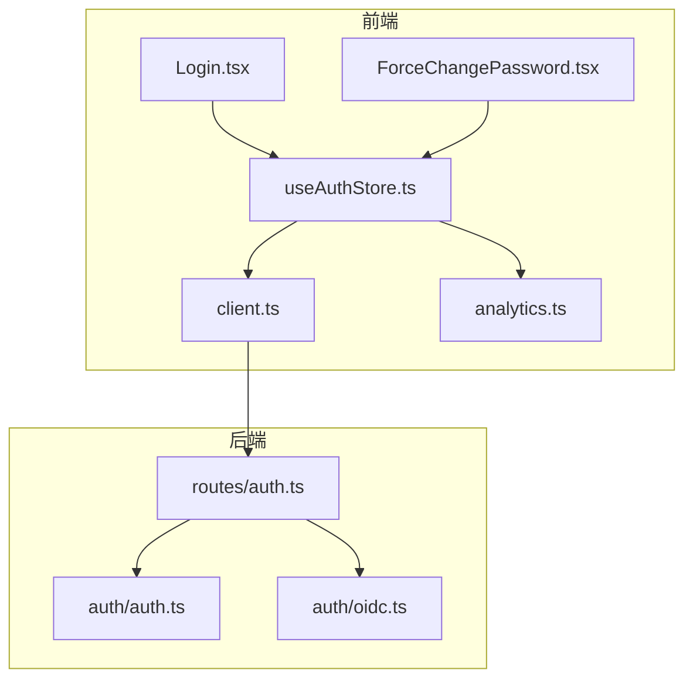
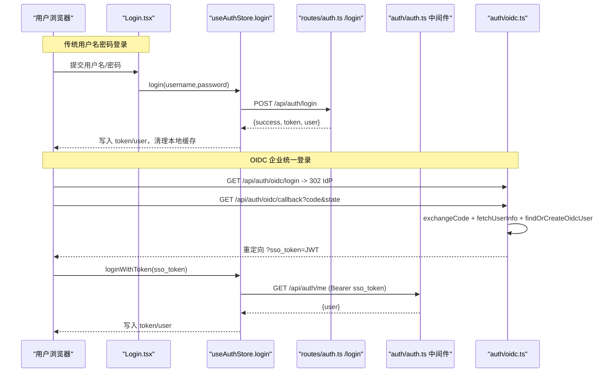
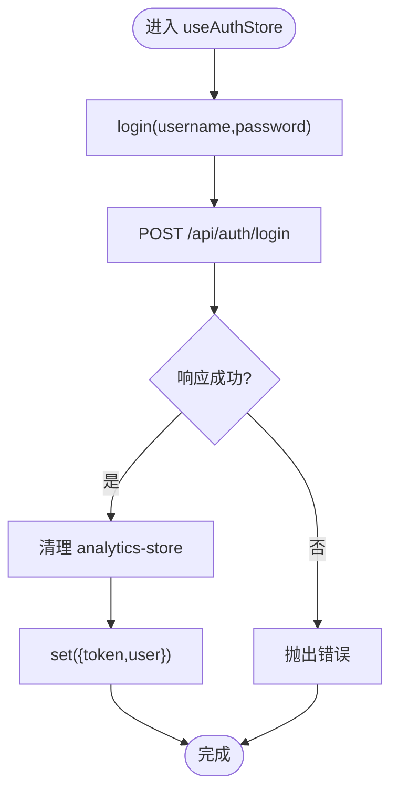
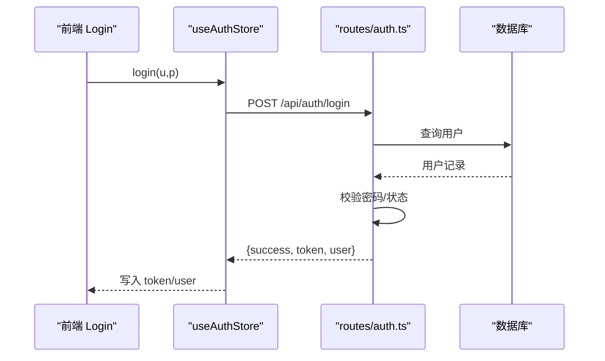
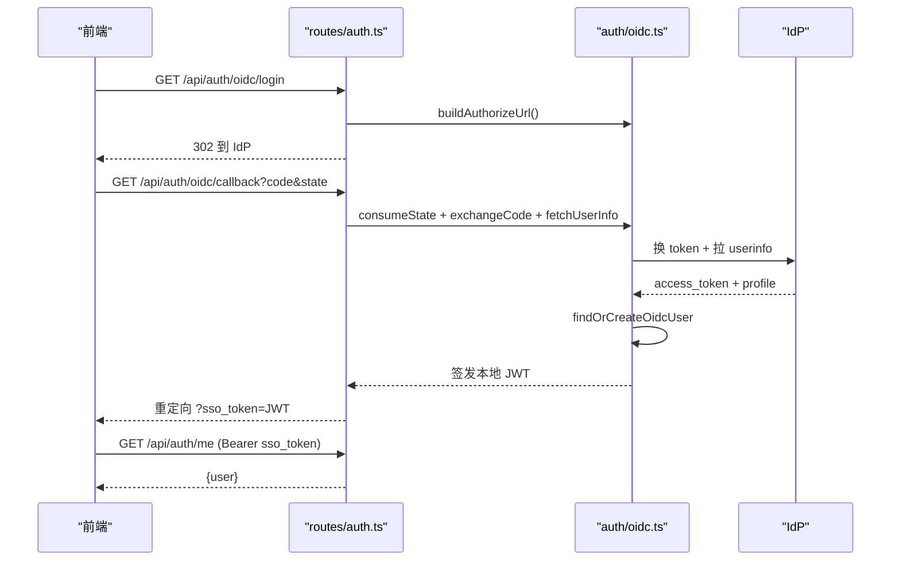
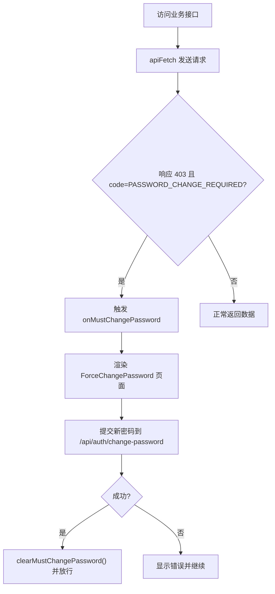
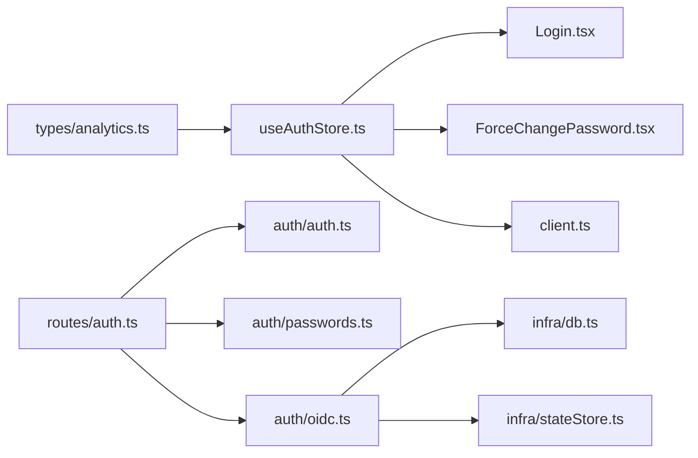

# 认证状态管理

<cite>
**本文引用的文件**
- [useAuthStore.ts](file://src/hooks/useAuthStore.ts)
- [auth.ts](file://server/auth/auth.ts)
- [oidc.ts](file://server/auth/oidc.ts)
- [auth.ts（路由）](file://server/routes/auth.ts)
- [Login.tsx](file://src/components/auth/Login.tsx)
- [ForceChangePassword.tsx](file://src/components/auth/ForceChangePassword.tsx)
- [client.ts](file://src/api/client.ts)
- [analytics.ts](file://src/types/analytics.ts)
- [useAuthStore.test.ts](file://src/hooks/useAuthStore.test.ts)
</cite>

## 目录
1. [简介](#简介)
2. [项目结构](#项目结构)
3. [核心组件](#核心组件)
4. [架构总览](#架构总览)
5. [详细组件分析](#详细组件分析)
6. [依赖关系分析](#依赖关系分析)
7. [性能与优化](#性能与优化)
8. [故障排查指南](#故障排查指南)
9. [结论](#结论)

## 简介
本文件面向认证状态管理的实现与使用，聚焦前端 useAuthStore 的状态设计、登录态维护、JWT 令牌管理、角色权限控制；并覆盖服务端鉴权中间件、OIDC 集成、强制改密流程、登出机制与常见问题的定位方法。目标是帮助开发者快速理解从前端到后端的完整认证链路，并在实际项目中正确扩展与维护。

## 项目结构
认证相关代码分为前后端两部分：
- 前端
  - 状态与持久化：useAuthStore（Zustand + persist）
  - UI 入口：Login、ForceChangePassword
  - 统一请求封装：apiFetch（自动注入 Authorization、处理 401/403）
  - 类型定义：AuthUser、UserRole
- 后端
  - 鉴权与授权：auth 模块（JWT 签发/校验、中间件、角色守卫）
  - OIDC 集成：oidc 模块（发现、授权码交换、JIT 建号/同步）
  - 认证路由：/api/auth/*（登录、当前用户、改密、OIDC 回调）

图表来源
- [useAuthStore.ts:1-84](file://src/hooks/useAuthStore.ts#L1-L84)
- [client.ts:1-74](file://src/api/client.ts#L1-L74)
- [auth.ts（路由）:1-156](file://server/routes/auth.ts#L1-L156)
- [auth.ts:1-127](file://server/auth/auth.ts#L1-L127)
- [oidc.ts:1-244](file://server/auth/oidc.ts#L1-L244)

章节来源
- [useAuthStore.ts:1-84](file://src/hooks/useAuthStore.ts#L1-L84)
- [auth.ts:1-127](file://server/auth/auth.ts#L1-L127)
- [oidc.ts:1-244](file://server/auth/oidc.ts#L1-L244)
- [auth.ts（路由）:1-156](file://server/routes/auth.ts#L1-L156)
- [Login.tsx:1-137](file://src/components/auth/Login.tsx#L1-L137)
- [ForceChangePassword.tsx:1-138](file://src/components/auth/ForceChangePassword.tsx#L1-L138)
- [client.ts:1-74](file://src/api/client.ts#L1-L74)
- [analytics.ts:1-372](file://src/types/analytics.ts#L1-L372)

## 核心组件
- useAuthStore：基于 Zustand 的认证状态管理，负责 token、用户信息、登录/登出、角色判断、强制改密标记等。
- 服务端 auth 中间件：校验 JWT、回查用户状态、注入 req.user、拦截未改密访问。
- OIDC 模块：授权码流程、state 防重放、token 交换、userinfo 拉取、JIT 建号/同步。
- 认证路由：/api/auth/login、/me、/change-password、/oidc/*。
- 前端 API 客户端：统一注入 Authorization、处理 401/403 并触发会话清理或强制改密。

章节来源
- [useAuthStore.ts:1-84](file://src/hooks/useAuthStore.ts#L1-L84)
- [auth.ts:1-127](file://server/auth/auth.ts#L1-L127)
- [oidc.ts:1-244](file://server/auth/oidc.ts#L1-L244)
- [auth.ts（路由）:1-156](file://server/routes/auth.ts#L1-L156)
- [client.ts:1-74](file://src/api/client.ts#L1-L74)

## 架构总览
下图展示了从前端登录到服务端鉴权的完整调用链，以及 OIDC 回跳流程。

图表来源
- [Login.tsx:1-137](file://src/components/auth/Login.tsx#L1-L137)
- [useAuthStore.ts:1-84](file://src/hooks/useAuthStore.ts#L1-L84)
- [auth.ts（路由）:1-156](file://server/routes/auth.ts#L1-L156)
- [auth.ts:1-127](file://server/auth/auth.ts#L1-L127)
- [oidc.ts:1-244](file://server/auth/oidc.ts#L1-L244)

## 详细组件分析

### useAuthStore 实现架构
- 状态字段
  - token：字符串或 null，用于后续请求携带。
  - user：当前用户对象（含 role、department、mustChangePassword）。
- 关键方法
  - login：直接调用 /api/auth/login，成功后清空 analytics-store 并写入 token/user。
  - loginWithToken：OIDC 回跳用，通过 /api/auth/me 校验 JWT 并获取用户信息，成功后写入 token/user。
  - logout：清除本地存储并重置 token/user。
  - hasRole：基于当前 user.role 进行角色匹配。
  - markMustChangePassword/clearMustChangePassword：设置/清除 mustChangePassword 标记。
- 持久化
  - 使用 zustand/middleware 的 persist，仅持久化 token 与 user，键名为 'auth-store'。
  - 登录/登出时主动清理 'analytics-store'，避免跨账号数据污染。

图表来源
- [useAuthStore.ts:25-39](file://src/hooks/useAuthStore.ts#L25-L39)

章节来源
- [useAuthStore.ts:1-84](file://src/hooks/useAuthStore.ts#L1-L84)
- [useAuthStore.test.ts:1-93](file://src/hooks/useAuthStore.test.ts#L1-L93)

### 登录流程（login 方法）
- 前端
  - Login 组件收集用户名/密码，调用 useAuthStore.login。
  - 失败时捕获错误并展示给用户。
- 后端
  - /api/auth/login 接收参数，校验格式，查询用户并验证密码。
  - 更新最后登录时间，签发 JWT，返回 token 与用户信息。
- 安全
  - 限流器保护登录接口。
  - 统一错误文案，避免泄露账号是否存在。

图表来源
- [Login.tsx:27-40](file://src/components/auth/Login.tsx#L27-L40)
- [useAuthStore.ts:25-39](file://src/hooks/useAuthStore.ts#L25-L39)
- [auth.ts（路由）:41-77](file://server/routes/auth.ts#L41-L77)

章节来源
- [Login.tsx:1-137](file://src/components/auth/Login.tsx#L1-L137)
- [useAuthStore.ts:25-39](file://src/hooks/useAuthStore.ts#L25-L39)
- [auth.ts（路由）:41-77](file://server/routes/auth.ts#L41-L77)

### OIDC 集成（loginWithToken 与回跳）
- 前端
  - 登录页可检测是否启用 OIDC，并提供“企业统一登录”入口。
  - 回跳 URL 带 sso_token，调用 loginWithToken 通过 /api/auth/me 校验并填充用户。
- 后端
  - /api/auth/oidc/login：生成 state，302 跳转 IdP 授权页。
  - /api/auth/oidc/callback：校验 state、交换 access_token、拉取 userinfo、JIT 建号/同步、签发本地 JWT，并重定向回前端。
  - /api/auth/me：鉴权中间件校验 JWT，返回当前用户。
- 安全
  - state 一次性消费，支持内存 Map 或 Redis（多实例场景）。
  - discovery 结果缓存 1 小时，减少 IdP 压力。

图表来源
- [auth.ts（路由）:116-153](file://server/routes/auth.ts#L116-L153)
- [oidc.ts:62-189](file://server/auth/oidc.ts#L62-L189)
- [oidc.ts:207-243](file://server/auth/oidc.ts#L207-L243)
- [useAuthStore.ts:41-52](file://src/hooks/useAuthStore.ts#L41-L52)

章节来源
- [auth.ts（路由）:116-153](file://server/routes/auth.ts#L116-L153)
- [oidc.ts:1-244](file://server/auth/oidc.ts#L1-L244)
- [useAuthStore.ts:41-52](file://src/hooks/useAuthStore.ts#L41-L52)
- [Login.tsx:14-25](file://src/components/auth/Login.tsx#L14-L25)

### 登出机制（logout）
- 行为
  - 清除本地存储中的 'analytics-store' 与 'analytics-store'（业务缓存），重置 token 与 user。
- 安全考虑
  - 前端登出不销毁服务端 JWT（无状态），但会移除本地凭证，使后续请求不再携带 token。
  - 若需服务端失效，应结合黑名单或短过期策略（当前实现依赖过期时间与中间件回查）。

章节来源
- [useAuthStore.ts:54-57](file://src/hooks/useAuthStore.ts#L54-L57)
- [useAuthStore.test.ts:50-61](file://src/hooks/useAuthStore.test.ts#L50-L61)

### 权限检查（hasRole）
- 逻辑
  - 读取当前 user，判断其 role 是否在传入的角色列表中。
  - 未登录时恒为 false。
- 性能
  - 纯内存操作，O(n) 其中 n 为传入角色数量，通常很小。
  - 建议在高频路径中复用结果或缓存。

章节来源
- [useAuthStore.ts:59-62](file://src/hooks/useAuthStore.ts#L59-L62)
- [useAuthStore.test.ts:63-74](file://src/hooks/useAuthStore.test.ts#L63-L74)

### 强制改密（mustChangePassword）
- 业务场景
  - 首次登录或管理员重置密码后，用户必须修改密码才能访问业务接口。
- 服务端拦截
  - authMiddleware 在 JWT 校验通过后回查 users 表，若 must_change_password 为真且访问非 /api/auth/*，返回 403 并附带 code='PASSWORD_CHANGE_REQUIRED'。
- 前端处理
  - apiFetch 收到 403 且 code 匹配时，触发 onMustChangePassword，引导至 ForceChangePassword 页面。
  - 修改成功后调用 /api/auth/change-password，服务端将 must_change_password 置 0，前端清除标记。

图表来源
- [auth.ts:67-113](file://server/auth/auth.ts#L67-L113)
- [client.ts:48-73](file://src/api/client.ts#L48-L73)
- [ForceChangePassword.tsx:23-42](file://src/components/auth/ForceChangePassword.tsx#L23-L42)

章节来源
- [auth.ts:67-113](file://server/auth/auth.ts#L67-L113)
- [client.ts:48-73](file://src/api/client.ts#L48-L73)
- [ForceChangePassword.tsx:1-138](file://src/components/auth/ForceChangePassword.tsx#L1-L138)

## 依赖关系分析
- 前端
  - useAuthStore 依赖 types/analytics 中的 AuthUser、UserRole。
  - Login/ForceChangePassword 依赖 useAuthStore 提供的状态与方法。
  - apiFetch 通过组合根注入 getToken/onUnauthorized/onMustChangePassword，解耦 store 循环依赖。
- 后端
  - routes/auth 依赖 auth/auth（signToken、authMiddleware）、auth/passwords、auth/oidc。
  - oidc 依赖 db 连接池、stateStore（Redis 可选）、logger。

图表来源
- [useAuthStore.ts:1-84](file://src/hooks/useAuthStore.ts#L1-L84)
- [client.ts:1-74](file://src/api/client.ts#L1-L74)
- [auth.ts（路由）:1-156](file://server/routes/auth.ts#L1-L156)
- [auth.ts:1-127](file://server/auth/auth.ts#L1-L127)
- [oidc.ts:1-244](file://server/auth/oidc.ts#L1-L244)

章节来源
- [useAuthStore.ts:1-84](file://src/hooks/useAuthStore.ts#L1-L84)
- [client.ts:1-74](file://src/api/client.ts#L1-L74)
- [auth.ts（路由）:1-156](file://server/routes/auth.ts#L1-L156)
- [auth.ts:1-127](file://server/auth/auth.ts#L1-L127)
- [oidc.ts:1-244](file://server/auth/oidc.ts#L1-L244)

## 性能与优化
- 前端
  - hasRole 为轻量级内存判断，适合频繁调用。
  - 登录/登出时清理 analytics-store，避免跨账号数据污染。
  - 使用原生 fetch 调用登录接口，避免循环依赖。
- 后端
  - OIDC discovery 结果缓存 1 小时，降低 IdP 调用频率。
  - state 支持 Redis，保障多实例下的一次性消费与并发安全。
  - JWT 过期时间可配置，默认 12h；生产建议配置固定强密钥。
  - 登录接口加限流，防止暴力破解。

[本节为通用指导，不直接分析具体文件]

## 故障排查指南
- 常见问题
  - 登录失败：检查 /api/auth/login 返回的错误信息；确认用户名/密码正确且账号状态为 ACTIVE。
  - 401 未登录：确认请求头包含 Authorization: Bearer <token>；检查 token 是否过期或被篡改。
  - 403 强制改密：确认 must_change_password 是否为真；前往强制改密页面完成修改。
  - OIDC 回调失败：检查 state 是否有效、code 是否过期；查看 IdP 配置是否正确。
- 调试技巧
  - 前端：打开控制台查看 apiFetch 抛出的 ApiError 及 code；检查 localStorage 中 auth-store 内容。
  - 后端：查看日志输出，关注 [Auth]、[OIDC] 前缀；核对 JWT_SECRET、OIDC_* 环境变量。
  - 网络：使用浏览器网络面板抓包，确认请求/响应体与状态码。

章节来源
- [client.ts:29-73](file://src/api/client.ts#L29-L73)
- [auth.ts:67-113](file://server/auth/auth.ts#L67-L113)
- [auth.ts（路由）:41-77](file://server/routes/auth.ts#L41-L77)
- [oidc.ts:134-153](file://server/auth/oidc.ts#L134-L153)

## 结论
该认证系统以前端 useAuthStore 为核心，配合服务端的 JWT 鉴权与 OIDC 集成，实现了完整的登录态管理、角色权限控制与强制改密流程。通过清晰的职责划分与安全加固（限流、state 防重放、强制改密拦截），系统在易用性与安全性之间取得平衡。建议在生产环境严格配置 JWT 密钥与 OIDC 参数，并结合监控与日志完善问题定位能力。