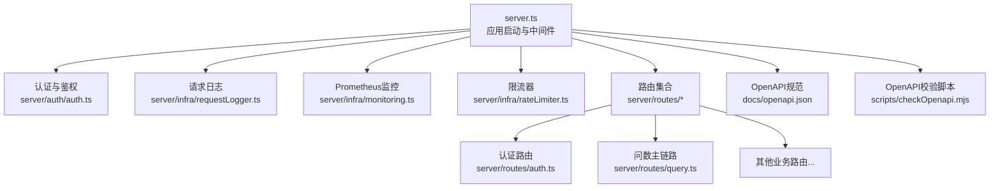
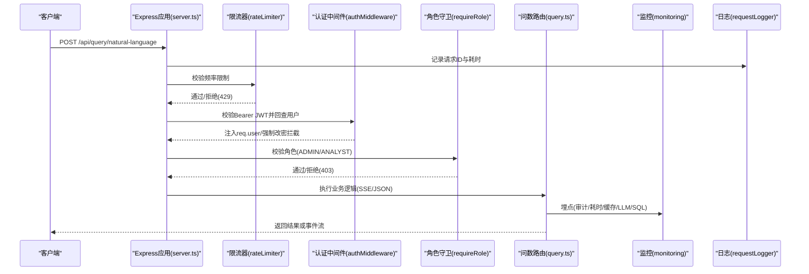
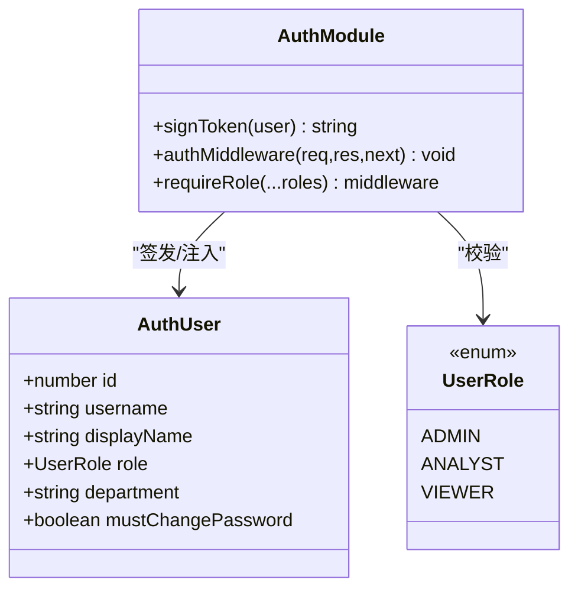
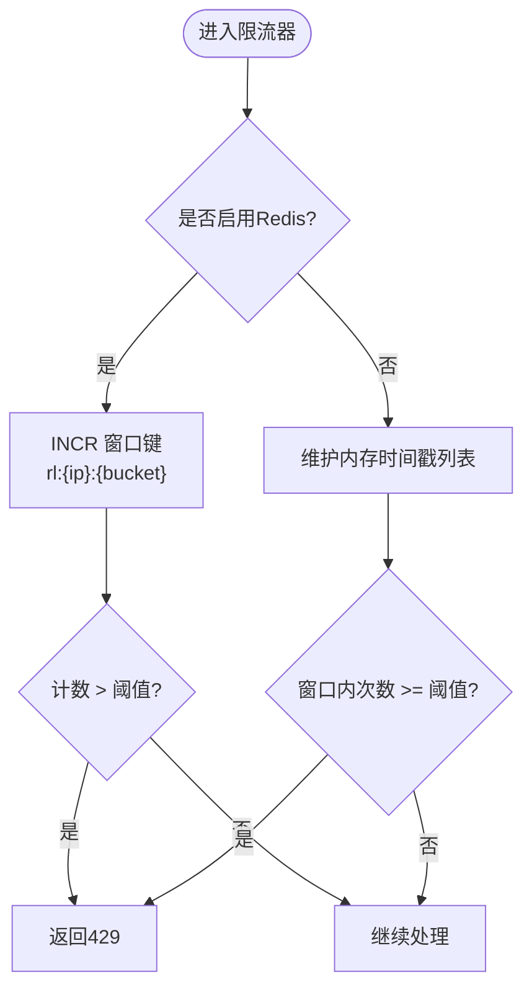
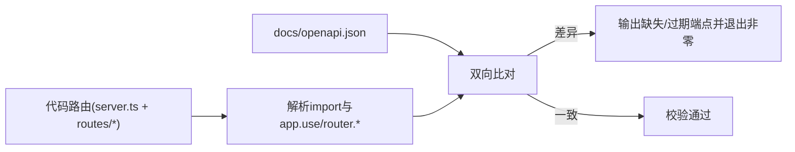
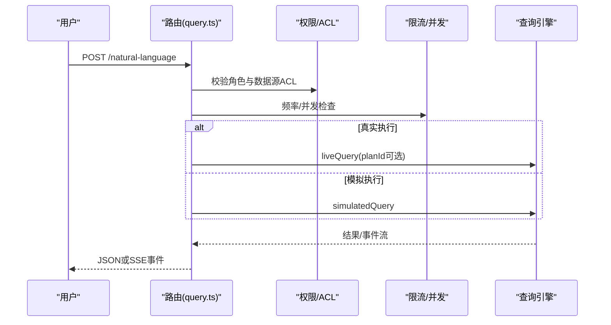
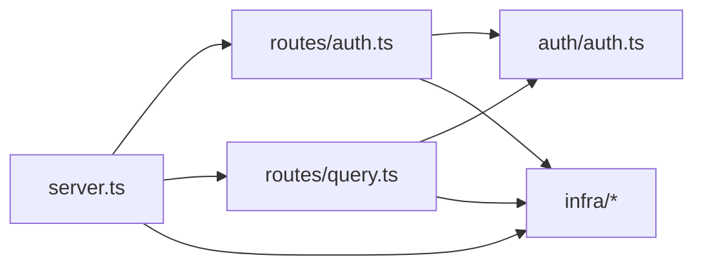

# API设计与规范

<cite>
**本文引用的文件**
- [server.ts](file://server.ts)
- [package.json](file://package.json)
- [server/auth/auth.ts](file://server/auth/auth.ts)
- [server/routes/auth.ts](file://server/routes/auth.ts)
- [server/infra/rateLimiter.ts](file://server/infra/rateLimiter.ts)
- [server/infra/errorCodes.ts](file://server/infra/errorCodes.ts)
- [server/infra/requestLogger.ts](file://server/infra/requestLogger.ts)
- [server/infra/monitoring.ts](file://server/infra/monitoring.ts)
- [server/routes/query.ts](file://server/routes/query.ts)
- [docs/openapi.json](file://docs/openapi.json)
- [scripts/checkOpenapi.mjs](file://scripts/checkOpenapi.mjs)
- [scripts/sync-openapi.py](file://scripts/sync-openapi.py)
</cite>

## 目录
1. [简介](#简介)
2. [项目结构](#项目结构)
3. [核心组件](#核心组件)
4. [架构总览](#架构总览)
5. [详细组件分析](#详细组件分析)
6. [依赖关系分析](#依赖关系分析)
7. [性能考量](#性能考量)
8. [故障排查指南](#故障排查指南)
9. [结论](#结论)
10. [附录](#附录)

## 简介
本文件面向“智能问数据分析系统”的后端API，基于Express.js构建RESTful服务，系统化说明路由组织、中间件机制、错误处理策略；统一API版本与请求响应格式、状态码与错误码体系；认证授权（JWT、RBAC）、请求限流、CORS与安全头；OpenAPI文档生成与同步校验；接口测试策略；并给出最佳实践、性能优化与安全加固建议。

## 项目结构
后端以单入口 server.ts 启动 Express 应用，集中注册全局中间件与安全头，挂载各业务路由模块；认证与鉴权集中在 server/auth；通用基础设施（日志、监控、限流、错误码）在 server/infra；业务路由按领域拆分至 server/routes；OpenAPI 规范位于 docs/openapi.json，并提供脚本进行同步校验与补齐。

**图表来源**
- [server.ts:82-296](file://server.ts#L82-L296)
- [server/auth/auth.ts:66-127](file://server/auth/auth.ts#L66-L127)
- [server/infra/requestLogger.ts:19-35](file://server/infra/requestLogger.ts#L19-L35)
- [server/infra/monitoring.ts:80-88](file://server/infra/monitoring.ts#L80-L88)
- [server/infra/rateLimiter.ts:14-42](file://server/infra/rateLimiter.ts#L14-L42)
- [server/routes/auth.ts:41-156](file://server/routes/auth.ts#L41-L156)
- [server/routes/query.ts:46-200](file://server/routes/query.ts#L46-L200)
- [docs/openapi.json:1-84](file://docs/openapi.json#L1-L84)
- [scripts/checkOpenapi.mjs:1-75](file://scripts/checkOpenapi.mjs#L1-L75)

**章节来源**
- [server.ts:82-296](file://server.ts#L82-L296)
- [package.json:1-76](file://package.json#L1-L76)

## 核心组件
- 应用启动与中间件管线：JSON解析大小控制、安全响应头、请求日志、Prometheus指标采集、健康检查与系统信息接口、统一404与全局错误兜底。
- 认证与授权：JWT签发/校验、用户回查、强制改密拦截、角色守卫（ADMIN/ANALYST/VIEWER）。
- 请求限流：按IP滑动窗口或Redis固定分钟窗口，支持多实例共享计数。
- 错误处理：统一错误响应体与错误码体系，便于前端精准分支。
- 可观测性：结构化访问日志、Prometheus指标（HTTP耗时、LLM调用、SQL执行等）。
- OpenAPI：规范文档与同步校验脚本，保障代码与文档一致。

**章节来源**
- [server.ts:133-280](file://server.ts#L133-L280)
- [server/auth/auth.ts:60-127](file://server/auth/auth.ts#L60-L127)
- [server/infra/rateLimiter.ts:14-42](file://server/infra/rateLimiter.ts#L14-L42)
- [server/infra/errorCodes.ts:1-36](file://server/infra/errorCodes.ts#L1-L36)
- [server/infra/requestLogger.ts:19-35](file://server/infra/requestLogger.ts#L19-L35)
- [server/infra/monitoring.ts:80-153](file://server/infra/monitoring.ts#L80-L153)
- [scripts/checkOpenapi.mjs:1-75](file://scripts/checkOpenapi.mjs#L1-L75)

## 架构总览
下图展示一次受保护的问数请求从进入服务器到返回结果的完整流程，包括鉴权、限流、权限校验、SSE流式输出与监控埋点。

**图表来源**
- [server.ts:169-183](file://server.ts#L169-L183)
- [server/infra/rateLimiter.ts:14-42](file://server/infra/rateLimiter.ts#L14-L42)
- [server/auth/auth.ts:66-127](file://server/auth/auth.ts#L66-L127)
- [server/routes/query.ts:46-200](file://server/routes/query.ts#L46-L200)
- [server/infra/monitoring.ts:92-133](file://server/infra/monitoring.ts#L92-L133)
- [server/infra/requestLogger.ts:19-35](file://server/infra/requestLogger.ts#L19-L35)

## 详细组件分析

### 认证与授权（JWT + RBAC）
- JWT签发与校验：使用环境变量密钥或进程级临时密钥（开发），令牌包含用户标识、用户名与角色；校验失败返回401。
- 用户回查：每次鉴权回查数据库，确保禁用/角色变更立即生效；首次登录或被重置密码时强制改密，仅放行 /api/auth/*。
- 角色守卫：requireRole 用于细粒度资源访问控制，未命中返回403。

**图表来源**
- [server/auth/auth.ts:13-33](file://server/auth/auth.ts#L13-L33)
- [server/auth/auth.ts:60-127](file://server/auth/auth.ts#L60-L127)

**章节来源**
- [server/auth/auth.ts:60-127](file://server/auth/auth.ts#L60-L127)
- [server/routes/auth.ts:41-156](file://server/routes/auth.ts#L41-L156)

### 请求限流（Rate Limiting）
- 内存模式：按IP维护最近60秒的请求时间戳列表，超过阈值返回429。
- Redis模式：固定分钟窗口原子计数，支持多实例共享；存储异常fail-closed直接拒绝。
- 配置项：RATE_LIMIT_MAX 默认30次/分钟；可通过环境变量调整。

**图表来源**
- [server/infra/rateLimiter.ts:14-42](file://server/infra/rateLimiter.ts#L14-L42)

**章节来源**
- [server/infra/rateLimiter.ts:14-42](file://server/infra/rateLimiter.ts#L14-L42)

### 错误处理与错误码体系
- 全局错误兜底：捕获未处理异常，统一返回JSON，避免HTML错误页。
- 统一错误码：ERROR_CODES 提供标准化错误码（如 INVALID_INPUT、FORBIDDEN、DS_ACCESS_DENIED、RATE_LIMITED、QUERY_IN_FLIGHT、PLAN_INVALID、PLAN_MISMATCH、NOT_FOUND、CONFLICT、SQL_REJECTED、LLM_UNAVAILABLE、INTERNAL_ERROR）。
- 路由层结合业务语义返回对应code与HTTP状态码，便于前端精准分支。

**章节来源**
- [server.ts:267-280](file://server.ts#L267-L280)
- [server/infra/errorCodes.ts:1-36](file://server/infra/errorCodes.ts#L1-L36)
- [server/routes/query.ts:58-109](file://server/routes/query.ts#L58-L109)

### 请求与响应规范
- 内容类型：JSON为主；SSE流式响应使用 text/event-stream。
- 请求体大小：默认2MB；报告导出、知识库导入、文件数据源导入放宽至10MB。
- 响应体：成功返回业务对象；错误返回 { error, code? }。
- 状态码：遵循REST约定（200/201/400/401/403/404/409/429/500等）。

**章节来源**
- [server.ts:133-143](file://server.ts#L133-L143)
- [docs/openapi.json:92-182](file://docs/openapi.json#L92-L182)

### 安全与CORS
- 安全响应头：X-Content-Type-Options、X-Frame-Options、Referrer-Policy；生产环境启用HSTS与严格CSP。
- CORS：当前未显式启用CORS中间件；跨域需由反向代理或网关统一处理。
- 生产安全检查：缺失JWT_SECRET时拒绝启动，防止弱密钥导致伪造token。

**章节来源**
- [server.ts:145-167](file://server.ts#L145-L167)
- [server.ts:91-96](file://server.ts#L91-L96)

### OpenAPI规范与文档同步
- 规范位置：docs/openapi.json，定义所有路径、标签、参数、响应与公共组件。
- 同步校验：scripts/checkOpenapi.mjs 扫描 server.ts 与各路由文件，比对代码端点与文档端点，CI中运行 npm run docs:check。
- 补齐脚本：scripts/sync-openapi.py 一次性补齐缺失的端点与标签，保持文档与实现一致。

**图表来源**
- [scripts/checkOpenapi.mjs:15-75](file://scripts/checkOpenapi.mjs#L15-L75)
- [scripts/sync-openapi.py:1-251](file://scripts/sync-openapi.py#L1-L251)
- [docs/openapi.json:1-84](file://docs/openapi.json#L1-L84)

**章节来源**
- [scripts/checkOpenapi.mjs:1-75](file://scripts/checkOpenapi.mjs#L1-L75)
- [scripts/sync-openapi.py:1-251](file://scripts/sync-openapi.py#L1-L251)
- [docs/openapi.json:1-84](file://docs/openapi.json#L1-L84)

### 问数主链路（SSE与双链路）
- 输入防护：L1输入过滤与注入拒绝、长度截断。
- 权限与ACL：角色白名单 + 数据源访问控制（部门/个人）。
- 并发与限流：用户级并发槽（串行化昂贵LLM调用）+ 用户级频率限制。
- 双链路：真实执行（liveQuery）与模拟执行（simulatedQuery）；计划模式（planId）校验后执行。
- SSE与断线续传：事件入缓冲，客户端断开后可凭traceId重放。

**图表来源**
- [server/routes/query.ts:46-200](file://server/routes/query.ts#L46-L200)

**章节来源**
- [server/routes/query.ts:46-200](file://server/routes/query.ts#L46-L200)

## 依赖关系分析
- 外部依赖：express、jsonwebtoken、mysql2、prom-client、ioredis等。
- 内部依赖：server.ts 聚合各路由与中间件；auth 模块被多个路由复用；infra 提供通用能力。
- 潜在循环依赖：通过 infra 抽象避免循环；限流器独立于路由模块。

**图表来源**
- [server.ts:22-64](file://server.ts#L22-L64)
- [server/routes/auth.ts:1-20](file://server/routes/auth.ts#L1-L20)
- [server/routes/query.ts:17-43](file://server/routes/query.ts#L17-L43)

**章节来源**
- [server.ts:22-64](file://server.ts#L22-L64)
- [server/routes/auth.ts:1-20](file://server/routes/auth.ts#L1-L20)
- [server/routes/query.ts:17-43](file://server/routes/query.ts#L17-L43)

## 性能考量
- 请求体大小分层控制：默认2MB，特定接口放宽至10MB，避免大报文阻塞。
- Prometheus直方图：HTTP、LLM、SQL执行耗时分桶合理，便于定位瓶颈。
- 缓存与会话：查询缓存（精确/语义）、SSE重放缓冲减少重复计算。
- 并发控制：用户级并发槽串行化昂贵操作，降低抖动。
- 多实例：Redis限流与状态外置，消除冷启动抖动与计数不一致。

[本节为通用指导，不直接分析具体文件]

## 故障排查指南
- 登录失败/令牌无效：检查JWT_SECRET配置与过期时间；确认用户状态ACTIVE且未被禁用。
- 401/403：确认携带正确Bearer Token；检查角色与数据源ACL；若must_change_password为真，仅允许访问 /api/auth/*。
- 429限流：检查RATE_LIMIT_MAX与客户端重试策略；Redis模式下关注连接稳定性。
- 404/500：查看全局错误兜底日志；确认路由挂载与OpenAPI同步校验通过。
- 监控与日志：通过 /metrics 抓取指标；利用 X-Request-Id 关联请求日志。

**章节来源**
- [server/auth/auth.ts:66-127](file://server/auth/auth.ts#L66-L127)
- [server/infra/rateLimiter.ts:14-42](file://server/infra/rateLimiter.ts#L14-L42)
- [server.ts:267-280](file://server.ts#L267-L280)
- [server/infra/requestLogger.ts:19-35](file://server/infra/requestLogger.ts#L19-L35)
- [server/infra/monitoring.ts:135-153](file://server/infra/monitoring.ts#L135-L153)

## 结论
本系统采用清晰的Express中间件链路与模块化路由设计，配合JWT+RBAC、统一错误码、限流与可观测性，形成高可用、可运维、可扩展的API体系。通过OpenAPI规范与自动化校验，确保接口契约稳定可靠。建议在后续迭代中持续完善CORS策略、细化限流维度、增强审计与合规能力。

[本节为总结性内容，不直接分析具体文件]

## 附录

### API版本管理
- 当前版本：package.json 中 version 为 0.9.43。
- 版本策略：建议通过URL前缀（/api/v1/...）或请求头（Accept-Version）进行版本控制；当前实现以功能演进为主，OpenAPI描述中保留版本字段以便对外发布。

**章节来源**
- [package.json:1-10](file://package.json#L1-L10)
- [docs/openapi.json:1-7](file://docs/openapi.json#L1-L7)

### 请求响应格式规范
- 成功响应：业务对象或数组；SSE流式事件以 event/data 形式推送。
- 错误响应：{ error: string, code?: ErrorCode }；HTTP状态码与业务错误码配合使用。
- 分页与排序：按业务接口定义；建议在OpenAPI中明确limit/offset或cursor。

**章节来源**
- [server/infra/errorCodes.ts:1-36](file://server/infra/errorCodes.ts#L1-L36)
- [docs/openapi.json:92-182](file://docs/openapi.json#L92-L182)

### 状态码定义
- 200/201：成功
- 400：参数非法或输入被拒
- 401：未登录或令牌无效
- 403：无权限或强制改密
- 404：资源不存在
- 409：冲突（幂等场景可忽略）
- 429：限流
- 500：服务器内部错误

**章节来源**
- [server/routes/query.ts:58-109](file://server/routes/query.ts#L58-L109)
- [server/routes/auth.ts:41-156](file://server/routes/auth.ts#L41-L156)

### 安全加固措施
- 生产环境强制JWT_SECRET；缺失则拒绝启动。
- 安全响应头：禁止嗅探、禁止嵌套、严格CSP。
- 输入净化与注入拒绝；金额单位白名单校验。
- 数据源ACL与部门维度授权；敏感列自动剔除。

**章节来源**
- [server.ts:91-96](file://server.ts#L91-L96)
- [server.ts:145-167](file://server.ts#L145-L167)
- [server/routes/query.ts:70-94](file://server/routes/query.ts#L70-L94)

### 接口测试策略
- 单元测试：针对关键函数与工具模块（如queryGuard、sqlExecutor等）编写用例。
- 端到端测试：使用Playwright对关键用户流程进行冒烟测试。
- OpenAPI校验：CI中运行 npm run docs:check 保证文档与代码一致。

**章节来源**
- [package.json:15-24](file://package.json#L15-L24)
- [scripts/checkOpenapi.mjs:1-75](file://scripts/checkOpenapi.mjs#L1-L75)