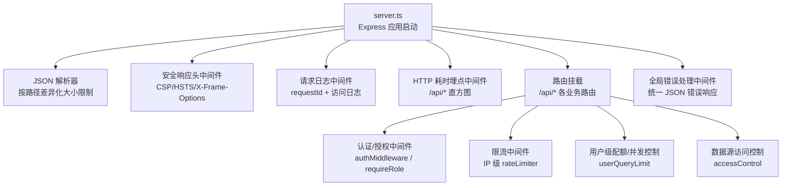
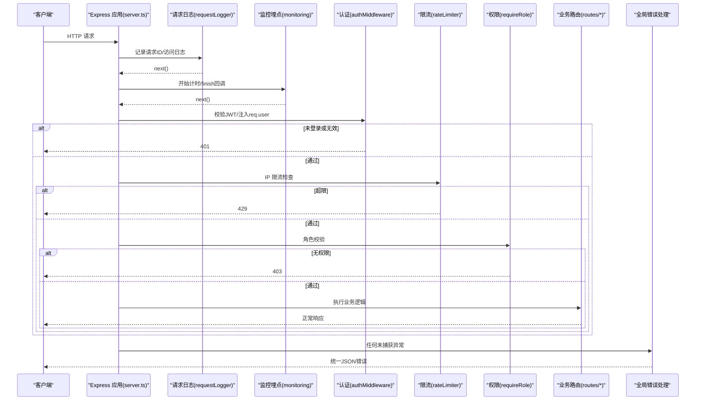
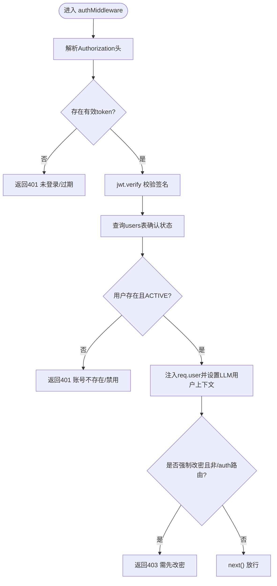
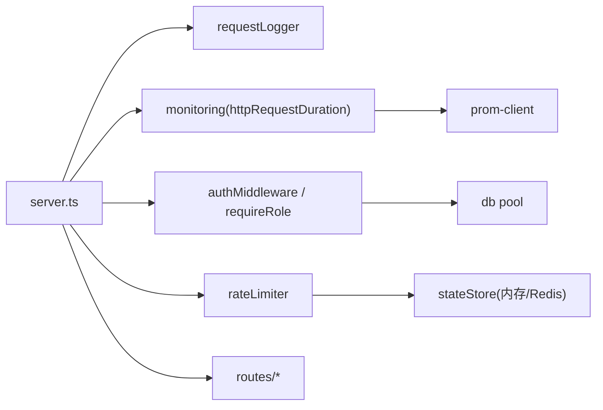

# 中间件机制

<cite>
**本文引用的文件**
- [server.ts](file://server.ts)
- [auth.ts](file://server/auth/auth.ts)
- [requestLogger.ts](file://server/infra/requestLogger.ts)
- [rateLimiter.ts](file://server/infra/rateLimiter.ts)
- [accessControl.ts](file://server/auth/accessControl.ts)
- [logger.ts](file://server/infra/logger.ts)
- [monitoring.ts](file://server/infra/monitoring.ts)
- [errorCodes.ts](file://server/infra/errorCodes.ts)
- [datasources.ts](file://server/routes/datasources.ts)
- [userQueryLimit.ts](file://server/infra/userQueryLimit.ts)
- [auth.ts](file://server/routes/auth.ts)
</cite>

## 目录
1. [简介](#简介)
2. [项目结构](#项目结构)
3. [核心组件](#核心组件)
4. [架构总览](#架构总览)
5. [详细组件分析](#详细组件分析)
6. [依赖关系分析](#依赖关系分析)
7. [性能考量](#性能考量)
8. [故障排查指南](#故障排查指南)
9. [结论](#结论)
10. [附录](#附录)

## 简介
本文件系统化梳理智能问数据分析系统的 Express 中间件机制，覆盖执行顺序、注册位置与职责边界；重点说明认证、日志记录、限流、权限控制等核心中间件；给出自定义中间件开发规范、中间件间数据传递方式、错误处理设计；并总结请求拦截、响应修改、异步处理等高级用法，以及性能优化、调试技巧与最佳实践。

## 项目结构
系统以 server.ts 为应用入口，集中完成：
- 全局中间件注册（JSON 解析、安全响应头、请求日志、Prometheus 耗时统计）
- 路由挂载（按业务域拆分到 routes/*）
- 全局错误兜底与静态资源服务

图表来源
- [server.ts:133-183](file://server.ts#L133-L183)
- [server.ts:224-265](file://server.ts#L224-L265)
- [server.ts:275-280](file://server.ts#L275-L280)

章节来源
- [server.ts:82-183](file://server.ts#L82-L183)
- [server.ts:224-280](file://server.ts#L224-L280)

## 核心组件
- 认证中间件：校验 JWT、回查用户状态、注入 req.user、强制改密策略
- 日志记录中间件：生成 requestId、记录结构化访问日志、响应头透传
- 限流中间件：IP 维度滑动/固定窗口限流，支持 Redis 多实例共享
- 权限控制中间件：角色守卫 requireRole；数据源 ACL 访问控制
- 监控埋点中间件：/api/* 接口耗时直方图，配合 Prometheus 暴露指标
- 全局错误处理中间件：统一捕获异常，返回 JSON 错误响应

章节来源
- [auth.ts:67-127](file://server/auth/auth.ts#L67-L127)
- [requestLogger.ts:19-35](file://server/infra/requestLogger.ts#L19-L35)
- [rateLimiter.ts:14-42](file://server/infra/rateLimiter.ts#L14-L42)
- [accessControl.ts:43-73](file://server/auth/accessControl.ts#L43-L73)
- [monitoring.ts:82-88](file://server/infra/monitoring.ts#L82-L88)
- [server.ts:275-280](file://server.ts#L275-L280)

## 架构总览
下图展示一次受保护的 API 请求在 Express 中的完整链路：从进入服务器到最终路由处理与响应返回，贯穿认证、日志、限流、权限与监控。

图表来源
- [server.ts:169-183](file://server.ts#L169-L183)
- [auth.ts:67-127](file://server/auth/auth.ts#L67-L127)
- [rateLimiter.ts:14-42](file://server/infra/rateLimiter.ts#L14-L42)
- [monitoring.ts:82-88](file://server/infra/monitoring.ts#L82-L88)
- [server.ts:275-280](file://server.ts#L275-L280)

## 详细组件分析

### 认证中间件（authMiddleware）
- 职责：解析 Authorization 头、验证 JWT、回查用户状态、注入 req.user、强制改密策略
- 数据传递：将用户信息写入 req.user，供后续中间件/路由使用
- 错误处理：非法 token、账号禁用、数据库查询失败分别返回 401/403/500
- 与 LLM 用量关联：鉴权后设置请求级用户上下文，便于埋点统计

图表来源
- [auth.ts:67-113](file://server/auth/auth.ts#L67-L113)

章节来源
- [auth.ts:67-127](file://server/auth/auth.ts#L67-L127)

### 日志记录中间件（requestLogger）
- 职责：为每个请求生成唯一 requestId，写入响应头 X-Request-Id；仅对 /api/* 记录访问日志
- 数据传递：req.requestId 贯穿全链路，便于问题定位
- 性能：仅在 finish 事件时落盘，避免阻塞热路径

章节来源
- [requestLogger.ts:19-35](file://server/infra/requestLogger.ts#L19-L35)
- [logger.ts:27-40](file://server/infra/logger.ts#L27-L40)

### 限流中间件（rateLimiter）
- 职责：按 IP 进行请求频率限制，默认内存滑动窗口；启用 Redis 后切换为固定分钟窗口计数
- 行为：超过阈值返回 429；Redis 不可用时 fail-closed 拒绝
- 适用场景：登录、OIDC 回调等高敏感接口

章节来源
- [rateLimiter.ts:14-42](file://server/infra/rateLimiter.ts#L14-L42)
- [auth.ts:41-42](file://server/routes/auth.ts#L41-L42)

### 权限控制中间件（requireRole）与数据源 ACL
- 角色守卫：requireRole(...roles) 校验 req.user.role，不满足则返回 403
- 数据源 ACL：基于部门/用户白名单的访问控制，管理员豁免；提供加载、判定、审批并入等能力
- 典型用法：在路由组或具体路由上组合使用

章节来源
- [auth.ts:116-127](file://server/auth/auth.ts#L116-L127)
- [accessControl.ts:43-73](file://server/auth/accessControl.ts#L43-L73)
- [datasources.ts:62-62](file://server/routes/datasources.ts#L62-L62)

### 监控埋点中间件（httpRequestDuration）
- 职责：对 /api/* 请求记录端到端耗时直方图，finish 时读取 route 与 status 打点
- 目的：配合 Prometheus 观测接口性能与稳定性

章节来源
- [monitoring.ts:82-88](file://server/infra/monitoring.ts#L82-L88)
- [server.ts:174-183](file://server.ts#L174-L183)

### 用户级配额与并发控制（userQueryLimit）
- 职责：按登录用户限制每小时问数次数，并保证同一用户并发数为 1
- 存储：默认进程内存；启用 Redis 后分布式共享，崩溃自动释放
- 典型用法：在问数主链路入口处调用 checkUserQueryLimit/acquireQuerySlot/releaseQuerySlot

章节来源
- [userQueryLimit.ts:23-81](file://server/infra/userQueryLimit.ts#L23-L81)

### 全局错误处理中间件
- 职责：统一捕获路由/中间件抛出的异常，返回 JSON 错误响应，避免默认 HTML 错误页
- 行为：优先使用 err.status/err.statusCode，否则 500

章节来源
- [server.ts:275-280](file://server.ts#L275-L280)

## 依赖关系分析
- server.ts 作为编排中心，依次注册 JSON 解析、安全头、日志、监控、路由与错误处理中间件
- 认证模块依赖数据库连接池与 LLM 用户上下文注入
- 限流模块依赖 stateStore（内存或 Redis），可跨实例共享
- 监控模块通过 prom-client 暴露指标，fail-open 不影响业务
- 路由层按需组合认证、限流、权限等中间件

图表来源
- [server.ts:133-183](file://server.ts#L133-L183)
- [auth.ts:67-113](file://server/auth/auth.ts#L67-L113)
- [rateLimiter.ts:14-42](file://server/infra/rateLimiter.ts#L14-L42)
- [monitoring.ts:82-88](file://server/infra/monitoring.ts#L82-L88)

章节来源
- [server.ts:133-183](file://server.ts#L133-L183)
- [auth.ts:67-113](file://server/auth/auth.ts#L67-L113)
- [rateLimiter.ts:14-42](file://server/infra/rateLimiter.ts#L14-L42)
- [monitoring.ts:82-88](file://server/infra/monitoring.ts#L82-L88)

## 性能考量
- 中间件顺序优化
  - 将轻量、高命中率的中间件（日志、监控）置于前，尽早短路（如 401/429）减少后续开销
  - 将重操作（DB 查询、外部调用）放在认证通过后，避免无效请求浪费
- 缓存与复用
  - 限流/配额在 Redis 模式下使用固定窗口原子计数，降低内存占用与抖动
  - 监控埋点采用直方图分桶，避免高频采样带来的 GC 压力
- 资源保护
  - JSON 解析器按路径差异化 body size 限制，防止大报文攻击
  - 生产环境 CSP/HSTS 等安全头零成本设置，提升安全性
- 可观测性
  - 通过 requestId 串联日志与错误，快速定位瓶颈
  - 利用 Prometheus 指标观察热点接口与慢请求

[本节为通用指导，不直接分析具体文件]

## 故障排查指南
- 常见问题与定位
  - 401 未登录/过期：检查 Authorization 头格式与 JWT_SECRET 配置；查看认证中间件日志
  - 403 无权限：确认 requireRole 与数据源 ACL 配置；核对用户角色与部门
  - 429 请求过于频繁：检查 rateLimiter 阈值与 Redis 可用性；关注登录/OIDC 回调是否被限流
  - 500 内部错误：查看全局错误处理中间件输出的错误堆栈；确认业务路由 try/catch 是否完善
- 关键线索
  - 使用 X-Request-Id 关联前后端日志
  - 结合 Prometheus 指标（http_request_duration_seconds、nl2sql_duration_seconds、llm_call_duration_seconds）定位慢请求
- 建议步骤
  - 复现最小化请求，逐步关闭中间件定位问题范围
  - 开启 DEBUG 级别日志（LOG_LEVEL=debug）获取更详细信息
  - 针对 Redis 模式限流/配额，检查连接健康与键空间清理

章节来源
- [auth.ts:67-127](file://server/auth/auth.ts#L67-L127)
- [rateLimiter.ts:14-42](file://server/infra/rateLimiter.ts#L14-L42)
- [monitoring.ts:82-88](file://server/infra/monitoring.ts#L82-L88)
- [server.ts:275-280](file://server.ts#L275-L280)

## 结论
本系统通过清晰的中间件分层与严格的执行顺序，实现了认证、日志、限流、权限与监控的解耦与协作。认证与权限保障安全，日志与监控提供可观测性，限流与配额保护后端资源。遵循本文的开发规范与最佳实践，可在扩展新中间件时保持代码内聚、低耦合与高性能。

[本节为总结性内容，不直接分析具体文件]

## 附录

### 中间件执行流程与注册顺序
- 全局中间件注册顺序（server.ts）
  - JSON 解析器（按路径差异化大小限制）
  - 安全响应头（CSP/HSTS/X-Frame-Options）
  - 请求日志（requestId + 访问日志）
  - HTTP 耗时埋点（/api/*）
  - 路由挂载（按业务域）
  - 全局错误处理
- 典型受保护路由链
  - 请求 -> 日志 -> 监控 -> 认证 -> 限流 -> 权限 -> 路由处理 -> 响应

章节来源
- [server.ts:133-183](file://server.ts#L133-L183)
- [server.ts:224-265](file://server.ts#L224-L265)
- [server.ts:275-280](file://server.ts#L275-L280)

### 自定义中间件开发规范
- 基本形态
  - 函数签名：(req, res, next) => void | Promise<void>
  - 必须调用 next() 或提前返回响应，避免挂起请求
- 数据传递
  - 通过 req 扩展字段（如 req.user、req.requestId）在中间件链中共享
  - 通过 res 设置响应头（如 X-Request-Id）
- 错误处理
  - 业务错误尽量返回明确状态码与结构化错误体
  - 异常抛出由全局错误处理中间件统一收敛
- 性能与安全
  - 避免在热路径做昂贵计算；必要时使用缓存或异步批处理
  - 严格校验输入，防止注入与超大负载

章节来源
- [requestLogger.ts:19-35](file://server/infra/requestLogger.ts#L19-L35)
- [auth.ts:67-127](file://server/auth/auth.ts#L67-L127)
- [server.ts:275-280](file://server.ts#L275-L280)

### 常见场景实现示例
- 登录接口限流
  - 在路由处理器前挂载 rateLimiter，防止密码爆破
- 受保护路由
  - 使用 authMiddleware 确保已登录，再使用 requireRole('ADMIN') 限制管理员操作
- 数据源访问控制
  - 在数据源相关路由中调用 checkDataSourceAccess，依据 ACL 决定是否允许访问
- 用户级配额与并发
  - 在问数主链路入口调用 checkUserQueryLimit 与 acquireQuerySlot/releaseQuerySlot

章节来源
- [auth.ts:41-42](file://server/routes/auth.ts#L41-L42)
- [datasources.ts:62-62](file://server/routes/datasources.ts#L62-L62)
- [accessControl.ts:66-73](file://server/auth/accessControl.ts#L66-L73)
- [userQueryLimit.ts:23-81](file://server/infra/userQueryLimit.ts#L23-L81)

### 错误码约定
- 统一错误码用于前端精准分支处理，避免解析中文文案
- 常用码：INVALID_INPUT、FORBIDDEN、DS_ACCESS_DENIED、RATE_LIMITED、NOT_FOUND、INTERNAL_ERROR 等

章节来源
- [errorCodes.ts:6-33](file://server/infra/errorCodes.ts#L6-L33)