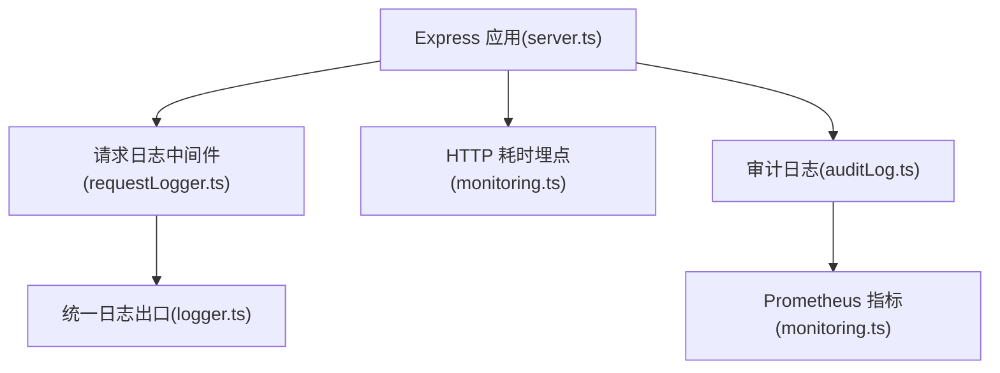
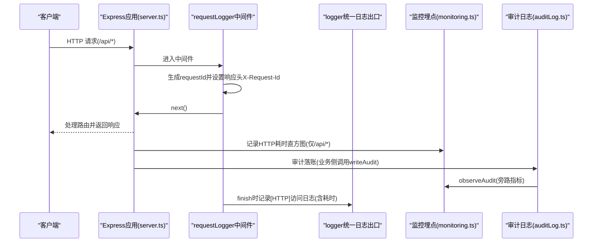
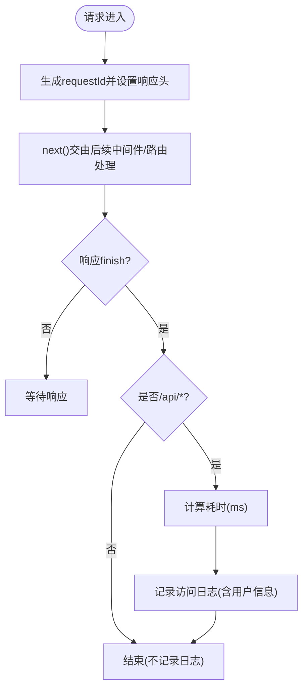
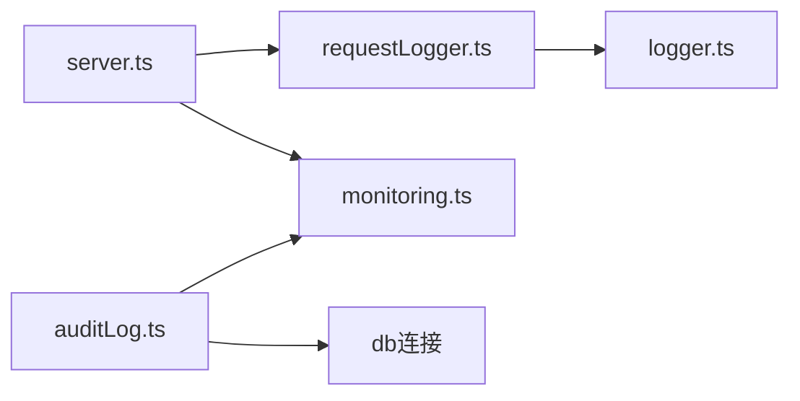

# 日志中间件

<cite>
**本文引用的文件**
- [server/infra/requestLogger.ts](file://server/infra/requestLogger.ts)
- [server/infra/logger.ts](file://server/infra/logger.ts)
- [server/infra/monitoring.ts](file://server/infra/monitoring.ts)
- [server/infra/auditLog.ts](file://server/infra/auditLog.ts)
- [server.ts](file://server.ts)
</cite>

## 目录
1. [简介](#简介)
2. [项目结构](#项目结构)
3. [核心组件](#核心组件)
4. [架构总览](#架构总览)
5. [详细组件分析](#详细组件分析)
6. [依赖关系分析](#依赖关系分析)
7. [性能考量](#性能考量)
8. [故障排查指南](#故障排查指南)
9. [结论](#结论)
10. [附录](#附录)

## 简介
本文件面向“智能问数据分析系统”的日志中间件，重点说明 requestLogger 中间件的请求日志记录机制，包括 HTTP 请求信息捕获、响应时间统计、错误日志记录；并给出日志格式规范、日志级别配置、结构化日志输出方案、敏感信息过滤策略、日志轮转建议、与性能监控（Prometheus）集成方式。同时提供自定义日志格式、日志聚合方案、故障排查技巧、日志分析示例与最佳实践。

## 项目结构
与日志中间件相关的核心位置如下：
- Express 应用启动与中间件挂载：server.ts
- 请求日志中间件：server/infra/requestLogger.ts
- 统一日志出口（控制台封装）：server/infra/logger.ts
- Prometheus 指标埋点与 /metrics 端点：server/infra/monitoring.ts
- 审计日志落库与旁路指标：server/infra/auditLog.ts

图表来源
- [server.ts:169-183](file://server.ts#L169-L183)
- [server/infra/requestLogger.ts:19-35](file://server/infra/requestLogger.ts#L19-L35)
- [server/infra/logger.ts:27-40](file://server/infra/logger.ts#L27-L40)
- [server/infra/monitoring.ts:82-88](file://server/infra/monitoring.ts#L82-L88)
- [server/infra/auditLog.ts:38-61](file://server/infra/auditLog.ts#L38-L61)

章节来源
- [server.ts:169-183](file://server.ts#L169-L183)
- [server/infra/requestLogger.ts:19-35](file://server/infra/requestLogger.ts#L19-L35)
- [server/infra/logger.ts:27-40](file://server/infra/logger.ts#L27-L40)
- [server/infra/monitoring.ts:82-88](file://server/infra/monitoring.ts#L82-L88)
- [server/infra/auditLog.ts:38-61](file://server/infra/auditLog.ts#L38-L61)

## 核心组件
- requestLogger 中间件：为每个请求生成唯一 requestId，写入响应头 X-Request-Id，并在请求结束时记录访问日志（仅 /api/*），包含方法、原始路径、状态码、耗时毫秒及用户信息（若存在）。
- logger 统一日志出口：基于环境变量 LOG_LEVEL 控制日志级别，测试环境默认只输出 error，避免噪音；底层使用 console，便于未来替换为结构化日志框架。
- monitoring 监控埋点：对 /api/* 接口耗时进行直方图统计，暴露 /metrics 端点，支持可选令牌保护；审计落账时同步更新业务指标。
- auditLog 审计层：将关键链路事件持久化到数据库，失败不阻塞主流程；同时调用 observeAudit 将指标推送到 Prometheus。

章节来源
- [server/infra/requestLogger.ts:19-35](file://server/infra/requestLogger.ts#L19-L35)
- [server/infra/logger.ts:12-25](file://server/infra/logger.ts#L12-L25)
- [server/infra/monitoring.ts:82-88](file://server/infra/monitoring.ts#L82-L88)
- [server/infra/auditLog.ts:38-61](file://server/infra/auditLog.ts#L38-L61)

## 架构总览
下图展示了从请求进入 Express 到日志与指标输出的完整链路：

图表来源
- [server.ts:169-183](file://server.ts#L169-L183)
- [server/infra/requestLogger.ts:19-35](file://server/infra/requestLogger.ts#L19-L35)
- [server/infra/monitoring.ts:82-88](file://server/infra/monitoring.ts#L82-L88)
- [server/infra/auditLog.ts:38-61](file://server/infra/auditLog.ts#L38-L61)

## 详细组件分析

### requestLogger 中间件
- 功能要点
  - 为每个请求生成随机 requestId，并通过 req.requestId 注入上下文，同时在响应头中回传 X-Request-Id，便于前端关联错误。
  - 仅在 /api/* 路径下记录访问日志，避免静态资源噪音。
  - 在响应 finish 事件中计算耗时并输出结构化日志，包含方法、原始 URL、状态码、耗时毫秒以及用户标识（若已登录）。
- 数据流
  - 请求进入 -> 生成 requestId -> 设置响应头 -> 继续处理 -> 响应完成 -> 记录日志。
- 错误处理
  - 中间件本身无复杂异常路径；若后续路由抛出未捕获异常，将由全局错误处理器统一返回 JSON 并记录错误日志。
- 可扩展性
  - 当前日志为字符串形式，可在 logger 层替换为结构化对象（如 pino），保持字段一致即可。

图表来源
- [server/infra/requestLogger.ts:19-35](file://server/infra/requestLogger.ts#L19-L35)

章节来源
- [server/infra/requestLogger.ts:19-35](file://server/infra/requestLogger.ts#L19-L35)
- [server.ts:169-183](file://server.ts#L169-L183)

### 统一日志出口 logger
- 功能要点
  - 通过 LOG_LEVEL 环境变量控制日志级别（debug/info/warn/error），进程启动时读取一次。
  - 测试环境下仅保留 error，避免干扰单测输出。
  - 底层使用 console.*，便于未来替换为结构化日志框架（如 pino）而不影响上层调用。
- 使用方式
  - 所有服务端运行时代码应通过 logger.debug/info/warn/error 输出，避免散落 console.*。

章节来源
- [server/infra/logger.ts:1-40](file://server/infra/logger.ts#L1-L40)

### 监控埋点与 /metrics 端点
- 功能要点
  - 对 /api/* 接口耗时进行直方图统计，标签包含 method、route、status。
  - 审计落账时通过 observeAudit 更新 nl2sql_requests_total 与 nl2sql_duration_seconds。
  - 暴露 /metrics 端点用于 Prometheus 抓取，支持可选 METRICS_TOKEN 鉴权。
- 安全与可用性
  - 所有埋点函数采用 fail-open 设计，异常不会阻断业务。
  - /metrics 可配置令牌保护，防止未授权抓取。

章节来源
- [server/infra/monitoring.ts:82-88](file://server/infra/monitoring.ts#L82-L88)
- [server/infra/monitoring.ts:92-100](file://server/infra/monitoring.ts#L92-L100)
- [server/infra/monitoring.ts:137-152](file://server/infra/monitoring.ts#L137-L152)
- [server.ts:174-183](file://server.ts#L174-L183)

### 审计日志
- 功能要点
  - 将关键链路事件（成功、降级、错误、拒绝等）写入数据库表 query_audit_log，字段包含用户、端点、问题、状态、详情、执行 SQL、行数、耗时等。
  - 写入失败仅告警，不影响主流程可用性。
  - 写入前调用 observeAudit 将指标推送到 Prometheus。
- 数据长度限制
  - 对 question、detail、executedSql 等字段做了长度截断，避免超长导致入库失败。

章节来源
- [server/infra/auditLog.ts:10-36](file://server/infra/auditLog.ts#L10-L36)
- [server/infra/auditLog.ts:38-61](file://server/infra/auditLog.ts#L38-L61)

## 依赖关系分析
- server.ts 作为入口，按顺序注册 requestLogger 与 HTTP 耗时埋点中间件，确保所有 /api/* 请求均被观测。
- requestLogger 依赖 logger 输出访问日志，并通过 req.user 获取用户信息（由鉴权中间件注入）。
- auditLog 依赖 db 连接与 monitoring 指标，实现“落库 + 指标”双写。
- monitoring 提供统一的指标定义与 /metrics 端点，供 Prometheus 采集。

图表来源
- [server.ts:169-183](file://server.ts#L169-L183)
- [server/infra/requestLogger.ts:19-35](file://server/infra/requestLogger.ts#L19-L35)
- [server/infra/logger.ts:27-40](file://server/infra/logger.ts#L27-L40)
- [server/infra/monitoring.ts:82-88](file://server/infra/monitoring.ts#L82-L88)
- [server/infra/auditLog.ts:38-61](file://server/infra/auditLog.ts#L38-L61)

章节来源
- [server.ts:169-183](file://server.ts#L169-L183)
- [server/infra/requestLogger.ts:19-35](file://server/infra/requestLogger.ts#L19-L35)
- [server/infra/logger.ts:27-40](file://server/infra/logger.ts#L27-L40)
- [server/infra/monitoring.ts:82-88](file://server/infra/monitoring.ts#L82-L88)
- [server/infra/auditLog.ts:38-61](file://server/infra/auditLog.ts#L38-L61)

## 性能考量
- 低开销日志
  - requestLogger 仅在 finish 事件触发时记录日志，避免在请求处理过程中增加额外负担。
  - 仅对 /api/* 路径记录日志与指标，减少静态资源带来的噪音与基数膨胀。
- 指标基数控制
  - HTTP 耗时直方图的 route 标签使用匹配到的路由模式，避免高基数路径导致内存增长。
- 容错设计
  - 监控埋点与审计落库均采用 fail-open，异常不会阻塞主链路。
- 扩展建议
  - 可将 logger 替换为结构化日志框架（如 pino），以 JSON 行输出，便于集中收集与分析。
  - 引入日志轮转（如按天或大小轮转）以避免磁盘占用过大。

[本节为通用性能讨论，不直接分析具体代码文件]

## 故障排查指南
- 定位单个请求
  - 通过响应头 X-Request-Id 在日志中检索对应请求，结合 requestId 串联上下游。
- 检查日志级别
  - 确认 LOG_LEVEL 环境变量是否正确设置；测试环境默认仅输出 error。
- 查看 HTTP 耗时
  - 通过 /metrics 端点抓取 http_request_duration_seconds，筛选 method、route、status 维度分析慢请求。
- 审计日志分析
  - 查询 query_audit_log 表，关注 status 为 ERROR/FALLBACK/REFUSED 的记录，结合 detail 与 executed_sql 定位问题。
- 常见错误
  - 未匹配的 /api/* 会返回 404 JSON；全局错误处理器会将异常转为 JSON 响应并记录错误日志。

章节来源
- [server/infra/requestLogger.ts:19-35](file://server/infra/requestLogger.ts#L19-L35)
- [server/infra/logger.ts:12-25](file://server/infra/logger.ts#L12-L25)
- [server/infra/monitoring.ts:137-152](file://server/infra/monitoring.ts#L137-L152)
- [server/infra/auditLog.ts:38-61](file://server/infra/auditLog.ts#L38-L61)
- [server.ts:267-280](file://server.ts#L267-L280)

## 结论
requestLogger 中间件以最小侵入方式为系统提供了稳定的请求追踪能力：生成 requestId、记录访问日志、配合监控埋点形成端到端可观测性。结合审计日志与 Prometheus 指标，可实现从日志到指标的闭环分析。建议在后续演进中引入结构化日志与日志轮转，进一步提升可维护性与可观测性。

[本节为总结性内容，不直接分析具体代码文件]

## 附录

### 日志格式规范
- 访问日志（由 requestLogger 输出）
  - 字段：请求方法、原始 URL、状态码、耗时毫秒、用户信息（可选）、requestId（可通过响应头获取）
  - 输出位置：标准输出（经 logger.info）
- 审计日志（由 auditLog 写入数据库）
  - 字段：user_id、username、endpoint、data_source_id、question、status、detail、executed_sql、row_count、duration_ms
  - 写入失败仅告警，不阻塞主流程

章节来源
- [server/infra/requestLogger.ts:19-35](file://server/infra/requestLogger.ts#L19-L35)
- [server/infra/auditLog.ts:10-36](file://server/infra/auditLog.ts#L10-L36)

### 日志级别配置
- 环境变量：LOG_LEVEL
- 取值：debug、info、warn、error（默认 info）
- 测试环境：仅输出 error

章节来源
- [server/infra/logger.ts:12-25](file://server/infra/logger.ts#L12-L25)

### 结构化日志输出
- 当前 logger 基于 console，可替换为 pino 等结构化日志框架，保持接口不变。
- 建议输出 JSON 行，包含 requestId、method、url、status、durationMs、userId 等字段，便于集中收集与分析。

章节来源
- [server/infra/logger.ts:1-40](file://server/infra/logger.ts#L1-L40)

### 敏感信息过滤
- 审计日志中对 question、detail、executedSql 等字段进行了长度截断，降低敏感信息泄露风险。
- 建议在后续版本中加入敏感字段脱敏规则（如掩码手机号、邮箱、密码等）。

章节来源
- [server/infra/auditLog.ts:38-61](file://server/infra/auditLog.ts#L38-L61)

### 日志轮转策略
- 建议按天或按文件大小轮转日志文件，保留最近 N 天的日志。
- 结合容器化部署，可使用 sidecar 或日志采集器（如 Fluent Bit）将 stdout 日志转发至集中式存储。

[本节为通用建议，不直接分析具体代码文件]

### 性能监控集成
- HTTP 耗时：http_request_duration_seconds（method、route、status）
- 审计指标：nl2sql_requests_total、nl2sql_duration_seconds
- 缓存命中：nl2sql_cache_hits_total
- LLM 用量：llm_call_duration_seconds、llm_tokens_total
- SQL 执行：sql_execute_duration_seconds、sql_explain_guard_total
- 端点：/metrics（可选 METRICS_TOKEN 保护）

章节来源
- [server/infra/monitoring.ts:21-88](file://server/infra/monitoring.ts#L21-L88)
- [server/infra/monitoring.ts:92-152](file://server/infra/monitoring.ts#L92-L152)

### 自定义日志格式
- 可在 logger 层替换为结构化对象，例如：
  - { level, msg, requestId, method, url, status, durationMs, userId }
- 保持字段稳定，便于下游解析与可视化。

章节来源
- [server/infra/logger.ts:27-40](file://server/infra/logger.ts#L27-L40)

### 日志聚合方案
- 推荐方案：stdout 日志 + 采集器（Fluent Bit/Vector） -> 集中式存储（Elasticsearch/Loki）
- 指标：Prometheus 抓取 /metrics，Grafana 可视化
- 关联：通过 requestId 关联日志与指标

[本节为通用方案，不直接分析具体代码文件]

### 故障排查技巧
- 使用 X-Request-Id 在日志中检索完整链路
- 通过 /metrics 分析慢请求与错误率
- 审计日志中关注 ERROR/FALLBACK/REFUSED 状态
- 检查 LOG_LEVEL 与 METRICS_TOKEN 配置

章节来源
- [server/infra/requestLogger.ts:19-35](file://server/infra/requestLogger.ts#L19-L35)
- [server/infra/monitoring.ts:137-152](file://server/infra/monitoring.ts#L137-L152)
- [server/infra/auditLog.ts:38-61](file://server/infra/auditLog.ts#L38-L61)

### 日志分析示例
- 慢请求分析
  - 查询 http_request_duration_seconds 直方图，筛选高耗时 bucket 与特定 route/status
- 错误率分析
  - 统计 nl2sql_requests_total 中 ERROR 比例，结合审计日志 detail 定位根因
- 用户行为分析
  - 通过审计日志中的 username 与 endpoint 分析高频操作

[本节为分析方法论，不直接分析具体代码文件]

### 最佳实践指南
- 始终使用 requestId 关联请求
- 仅对 /api/* 记录日志与指标，避免噪音
- 使用结构化日志，便于集中处理
- 启用日志轮转，避免磁盘占满
- 定期审查审计日志，发现异常与风险

[本节为通用实践，不直接分析具体代码文件]