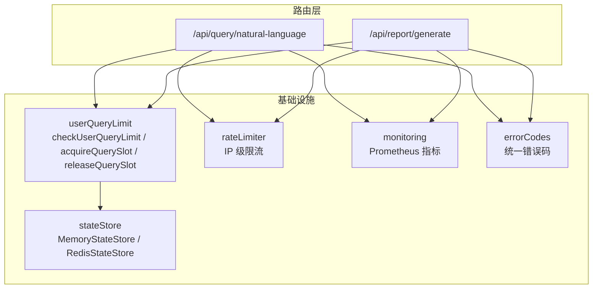
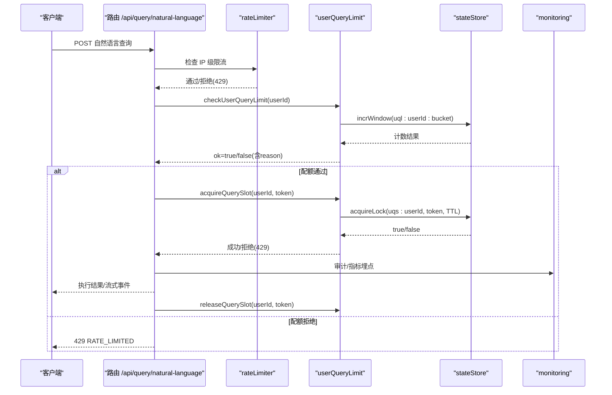
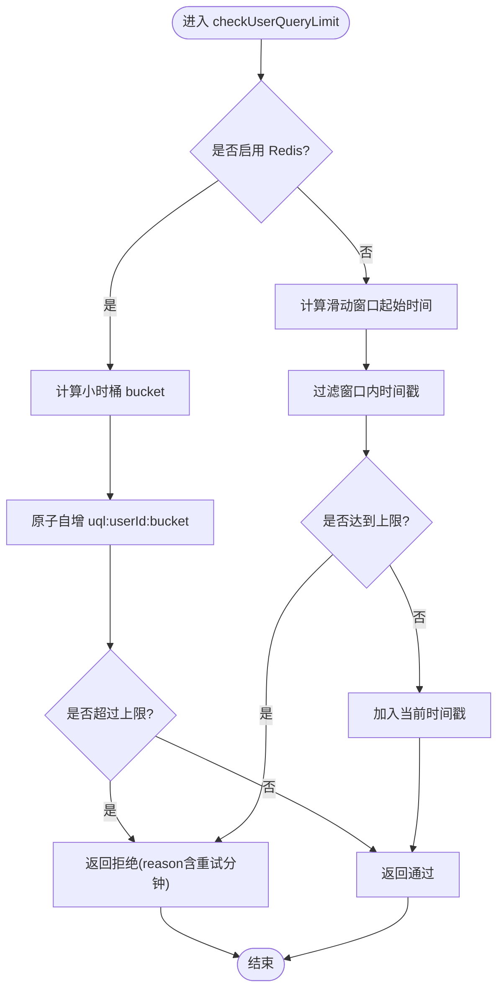
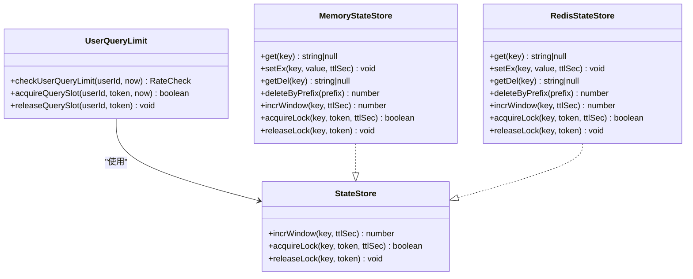
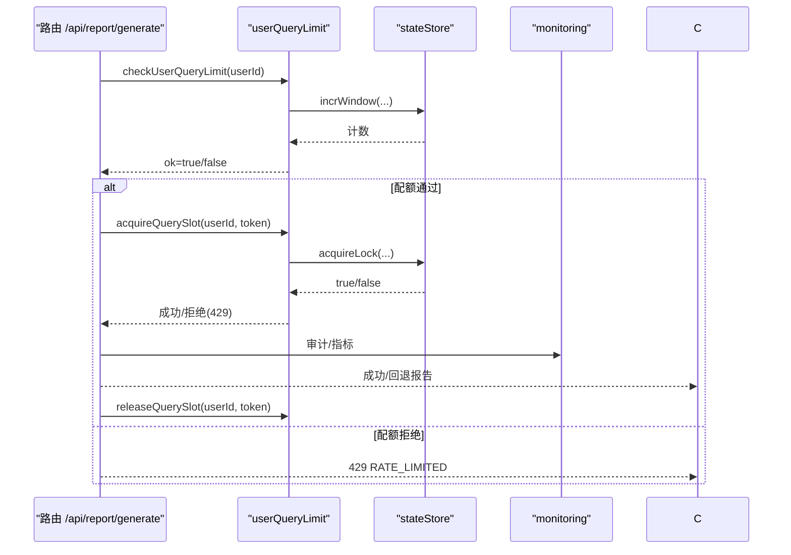
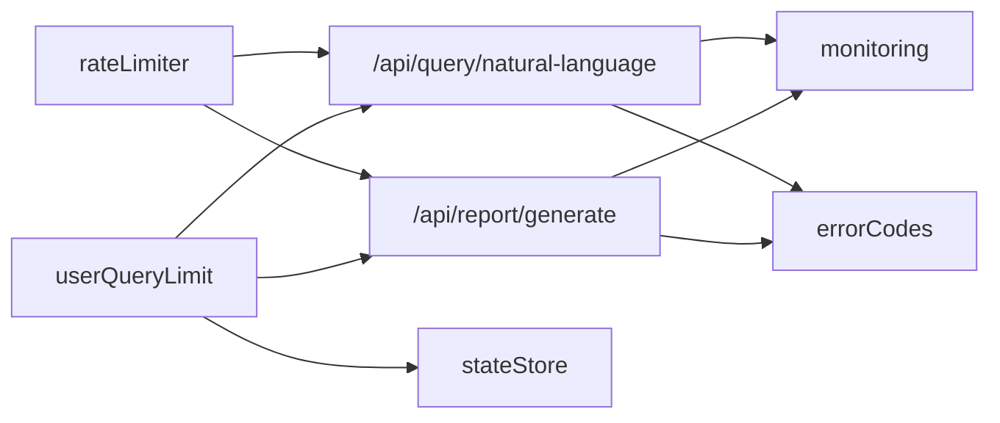

# 查询限制中间件

<cite>
**本文引用的文件**
- [server/infra/userQueryLimit.ts](file://server/infra/userQueryLimit.ts)
- [server/infra/userQueryLimit.test.ts](file://server/infra/userQueryLimit.test.ts)
- [server/infra/rateLimiter.ts](file://server/infra/rateLimiter.ts)
- [server/infra/stateStore.ts](file://server/infra/stateStore.ts)
- [server/routes/query.ts](file://server/routes/query.ts)
- [server/routes/report.ts](file://server/routes/report.ts)
- [server/infra/errorCodes.ts](file://server/infra/errorCodes.ts)
- [server/infra/monitoring.ts](file://server/infra/monitoring.ts)
</cite>

## 目录
1. [简介](#简介)
2. [项目结构](#项目结构)
3. [核心组件](#核心组件)
4. [架构总览](#架构总览)
5. [详细组件分析](#详细组件分析)
6. [依赖关系分析](#依赖关系分析)
7. [性能与容量规划](#性能与容量规划)
8. [故障排查指南](#故障排查指南)
9. [结论](#结论)
10. [附录：配置与示例](#附录：配置与示例)

## 简介
本文件面向“智能问数据分析系统”的查询限制中间件，聚焦 userQueryLimit 模块的用户级配额与并发控制机制。该中间件在 L5 频率层对登录用户进行“每小时固定次数上限 + 同用户并发限 1”的双重保护，避免昂贵的 LLM 调用被滥用或拥塞。其设计目标包括：
- 用户级配额管理：按小时滑动窗口（内存）或固定小时窗口（Redis）计数，默认 20 次/小时，支持环境变量动态调整。
- 并发查询控制：同一用户同时仅允许一个进行中的查询，使用 token 化锁防止误释放，TTL 兜底防死锁。
- 资源使用监控：通过统一监控埋点与审计日志，统计请求、耗时、拒绝原因等指标。
- 降级策略：存储异常时 fail-closed 拒绝请求，保障系统安全；客户端断开提前释放槽位，提升可用性。
- 公平调度：串行化昂贵链路，避免单用户独占资源，结合 IP 级 rateLimiter 形成多层防护。

## 项目结构
查询限制能力由 infra 层的 userQueryLimit 提供，并在路由层（query、report）中集成。状态存储通过 stateStore 抽象，支持内存与 Redis 两种实现。IP 级限流由 rateLimiter 提供，与用户级配额互补。

图表来源
- [server/routes/query.ts:47-116](file://server/routes/query.ts#L47-L116)
- [server/routes/report.ts:31-75](file://server/routes/report.ts#L31-L75)
- [server/infra/userQueryLimit.ts:24-81](file://server/infra/userQueryLimit.ts#L24-L81)
- [server/infra/rateLimiter.ts:14-42](file://server/infra/rateLimiter.ts#L14-L42)
- [server/infra/stateStore.ts:10-23](file://server/infra/stateStore.ts#L10-L23)
- [server/infra/monitoring.ts:92-133](file://server/infra/monitoring.ts#L92-L133)
- [server/infra/errorCodes.ts:6-33](file://server/infra/errorCodes.ts#L6-L33)

章节来源
- [server/routes/query.ts:47-116](file://server/routes/query.ts#L47-L116)
- [server/routes/report.ts:31-75](file://server/routes/report.ts#L31-L75)
- [server/infra/userQueryLimit.ts:24-81](file://server/infra/userQueryLimit.ts#L24-L81)
- [server/infra/rateLimiter.ts:14-42](file://server/infra/rateLimiter.ts#L14-L42)
- [server/infra/stateStore.ts:10-23](file://server/infra/stateStore.ts#L10-L23)
- [server/infra/monitoring.ts:92-133](file://server/infra/monitoring.ts#L92-L133)
- [server/infra/errorCodes.ts:6-33](file://server/infra/errorCodes.ts#L6-L33)

## 核心组件
- 用户配额检查 checkUserQueryLimit：按小时窗口计数，超过阈值返回拒绝并附带重试提示；支持环境变量 USER_QUERY_RATE_MAX 动态调整上限。
- 并发槽获取 acquireQuerySlot / releaseQuerySlot：同一用户并发限 1，token 绑定请求，TTL 过期自动释放；Redis 模式为分布式锁，内存模式以 Map 记录。
- 状态存储 stateStore：抽象接口封装 incrWindow 与 acquireLock/releaseLock，提供 MemoryStateStore 与 RedisStateStore 两种实现。
- IP 级限流 rateLimiter：按 IP 固定分钟窗口计数，超限返回 429，与用户级配额互补。
- 错误码 errorCodes：统一错误码 RATE_LIMITED、QUERY_IN_FLIGHT 等，便于前端精准处理。
- 监控埋点 monitoring：通过审计与指标收集，观察请求量、耗时、缓存命中、LLM 用量、SQL 执行等。

章节来源
- [server/infra/userQueryLimit.ts:24-81](file://server/infra/userQueryLimit.ts#L24-L81)
- [server/infra/stateStore.ts:10-23](file://server/infra/stateStore.ts#L10-L23)
- [server/infra/rateLimiter.ts:14-42](file://server/infra/rateLimiter.ts#L14-L42)
- [server/infra/errorCodes.ts:6-33](file://server/infra/errorCodes.ts#L6-L33)
- [server/infra/monitoring.ts:92-133](file://server/infra/monitoring.ts#L92-L133)

## 架构总览
查询限制中间件位于路由层之前，作为 L5 频率层参与请求处理流程。典型路径：
- 进入路由后先经 IP 级 rateLimiter 过滤匿名高频请求。
- 再经 authMiddleware 与角色校验，确保具备问数权限。
- 调用 checkUserQueryLimit 进行用户级配额检查。
- 若通过，则尝试 acquireQuerySlot 获取并发槽；失败则立即拒绝。
- 业务执行完成后，finally 中 releaseQuerySlot 释放槽位；客户端断开时 res.on('close') 提前释放。

图表来源
- [server/routes/query.ts:47-116](file://server/routes/query.ts#L47-L116)
- [server/infra/userQueryLimit.ts:24-81](file://server/infra/userQueryLimit.ts#L24-L81)
- [server/infra/stateStore.ts:140-162](file://server/infra/stateStore.ts#L140-L162)
- [server/infra/rateLimiter.ts:14-42](file://server/infra/rateLimiter.ts#L14-L42)
- [server/infra/monitoring.ts:92-133](file://server/infra/monitoring.ts#L92-L133)

## 详细组件分析

### 用户配额检查（checkUserQueryLimit）
- 窗口语义：
  - 内存模式：滑动窗口，维护 userId -> 时间戳列表，定期清理过期记录。
  - Redis 模式：固定小时窗口，按 bucket 原子自增，首次写入设置 TTL。
- 阈值与配置：
  - 默认每小时 20 次，可通过环境变量 USER_QUERY_RATE_MAX 动态调整。
- 拒绝行为：
  - 返回 ok=false 及 reason，包含建议重试时间（分钟）。
  - 存储异常时 fail-closed，直接拒绝，避免配额不可信导致 LLM 失控。
- 复杂度与性能：
  - 内存模式 O(n) 过滤窗口内时间戳，n 为窗口内请求数；Redis 模式 O(1) 原子操作。
  - 定期清理避免内存膨胀。

图表来源
- [server/infra/userQueryLimit.ts:24-48](file://server/infra/userQueryLimit.ts#L24-L48)
- [server/infra/stateStore.ts:71-80](file://server/infra/stateStore.ts#L71-L80)
- [server/infra/stateStore.ts:140-153](file://server/infra/stateStore.ts#L140-L153)

章节来源
- [server/infra/userQueryLimit.ts:24-48](file://server/infra/userQueryLimit.ts#L24-L48)
- [server/infra/stateStore.ts:71-80](file://server/infra/stateStore.ts#L71-L80)
- [server/infra/stateStore.ts:140-153](file://server/infra/stateStore.ts#L140-L153)

### 并发槽控制（acquireQuerySlot / releaseQuerySlot）
- 并发策略：
  - 同一用户同一时间仅允许一个进行中的查询。
  - 内存模式：Map 记录 token 与过期时间；Redis 模式：分布式锁 SET NX EX。
- Token 化与 TTL：
  - 释放时比对 token，防止旧请求误删新请求的槽。
  - 槽 TTL 覆盖最长链路耗时，崩溃后自动释放，避免永久锁死。
- 客户端断开处理：
  - res.on('close') 提前释放槽位，提升用户体验。
- 复杂度与性能：
  - 内存模式 O(1) 读写；Redis 模式 O(1) 原子操作。

图表来源
- [server/infra/userQueryLimit.ts:56-81](file://server/infra/userQueryLimit.ts#L56-L81)
- [server/infra/stateStore.ts:10-23](file://server/infra/stateStore.ts#L10-L23)
- [server/infra/stateStore.ts:32-98](file://server/infra/stateStore.ts#L32-L98)
- [server/infra/stateStore.ts:105-163](file://server/infra/stateStore.ts#L105-L163)

章节来源
- [server/infra/userQueryLimit.ts:56-81](file://server/infra/userQueryLimit.ts#L56-L81)
- [server/infra/stateStore.ts:32-98](file://server/infra/stateStore.ts#L32-L98)
- [server/infra/stateStore.ts:105-163](file://server/infra/stateStore.ts#L105-L163)

### 路由集成与降级策略
- 路由集成：
  - /api/query/natural-language 与 /api/report/generate 均调用 userQueryLimit，共享配额与并发槽。
  - 失败时写审计日志并返回 429，携带统一错误码 RATE_LIMITED 或 QUERY_IN_FLIGHT。
- 降级策略：
  - 存储异常时 fail-closed 拒绝，避免配额不可信导致风险。
  - 客户端断开提前释放槽位，保证后续请求可快速重入。
  - 报告生成失败时回退到模拟报表，保障可用性。

图表来源
- [server/routes/report.ts:31-75](file://server/routes/report.ts#L31-L75)
- [server/infra/userQueryLimit.ts:24-81](file://server/infra/userQueryLimit.ts#L24-L81)
- [server/infra/stateStore.ts:140-162](file://server/infra/stateStore.ts#L140-L162)
- [server/infra/monitoring.ts:92-133](file://server/infra/monitoring.ts#L92-L133)

章节来源
- [server/routes/report.ts:31-75](file://server/routes/report.ts#L31-L75)
- [server/infra/userQueryLimit.ts:24-81](file://server/infra/userQueryLimit.ts#L24-L81)
- [server/infra/stateStore.ts:140-162](file://server/infra/stateStore.ts#L140-L162)
- [server/infra/monitoring.ts:92-133](file://server/infra/monitoring.ts#L92-L133)

### 公平调度算法
- 串行化昂贵链路：通过并发槽将同一用户的昂贵 LLM 调用串行化，避免资源争用。
- 多用户隔离：不同用户互不影响，保证公平性。
- 超时与恢复：槽 TTL 保证崩溃后自动释放，避免长期占用。

章节来源
- [server/infra/userQueryLimit.ts:56-81](file://server/infra/userQueryLimit.ts#L56-L81)
- [server/infra/stateStore.ts:82-91](file://server/infra/stateStore.ts#L82-L91)
- [server/infra/stateStore.ts:155-162](file://server/infra/stateStore.ts#L155-L162)

## 依赖关系分析
- userQueryLimit 依赖 stateStore 提供的 incrWindow 与 acquireLock/releaseLock。
- 路由层依赖 userQueryLimit 与 rateLimiter，形成 IP 级与用户级双层防护。
- 监控埋点通过审计与指标收集，不侵入业务热路径。
- 错误码统一输出，便于前端分支处理。

图表来源
- [server/infra/rateLimiter.ts:14-42](file://server/infra/rateLimiter.ts#L14-L42)
- [server/infra/userQueryLimit.ts:24-81](file://server/infra/userQueryLimit.ts#L24-L81)
- [server/infra/stateStore.ts:10-23](file://server/infra/stateStore.ts#L10-L23)
- [server/infra/monitoring.ts:92-133](file://server/infra/monitoring.ts#L92-L133)
- [server/infra/errorCodes.ts:6-33](file://server/infra/errorCodes.ts#L6-L33)

章节来源
- [server/infra/rateLimiter.ts:14-42](file://server/infra/rateLimiter.ts#L14-L42)
- [server/infra/userQueryLimit.ts:24-81](file://server/infra/userQueryLimit.ts#L24-L81)
- [server/infra/stateStore.ts:10-23](file://server/infra/stateStore.ts#L10-L23)
- [server/infra/monitoring.ts:92-133](file://server/infra/monitoring.ts#L92-L133)
- [server/infra/errorCodes.ts:6-33](file://server/infra/errorCodes.ts#L6-L33)

## 性能与容量规划
- 窗口与计数：
  - 内存模式适合单机部署，定期清理避免内存增长。
  - Redis 模式适合多实例部署，固定小时窗口原子计数，TTL 自动过期。
- 并发控制：
  - 并发槽 TTL 覆盖最长链路耗时，崩溃后自动释放。
  - 客户端断开提前释放槽位，提升响应速度。
- 监控与告警：
  - 通过 Prometheus 指标观察请求量、耗时、拒绝率等。
  - 审计日志记录拒绝原因与耗时，便于定位问题。
- 容量规划建议：
  - 根据用户规模与 LLM 成本调整 USER_QUERY_RATE_MAX。
  - 多实例部署务必配置 REDIS_URL，确保配额与并发槽全局共享。
  - 关注 Redis 连接健康，启动预热 warmStateStore 消除冷启动窗口。

章节来源
- [server/infra/userQueryLimit.ts:84-91](file://server/infra/userQueryLimit.ts#L84-L91)
- [server/infra/stateStore.ts:194-213](file://server/infra/stateStore.ts#L194-L213)
- [server/infra/monitoring.ts:92-133](file://server/infra/monitoring.ts#L92-L133)

## 故障排查指南
- 常见问题：
  - 配额不足：检查 USER_QUERY_RATE_MAX 与环境变量是否正确设置。
  - 并发冲突：确认客户端是否正确释放槽位，避免重复释放或 token 不匹配。
  - Redis 异常：查看 stateStore 连接日志，必要时重启服务或切换内存模式。
- 诊断步骤：
  - 查看审计日志中的 DENIED_RATE 与 DENIED_INPUT 等状态。
  - 通过 /metrics 端点观察 nl2sql_requests_total、nl2sql_duration_seconds 等指标。
  - 检查 Redis 键空间，确认 uql:* 与 uqs:* 键的 TTL 与计数。
- 恢复策略：
  - 存储异常时 fail-closed 拒绝，等待恢复后自动恢复。
  - 客户端断开提前释放槽位，避免长时间占用。

章节来源
- [server/infra/userQueryLimit.ts:24-48](file://server/infra/userQueryLimit.ts#L24-L48)
- [server/infra/stateStore.ts:178-186](file://server/infra/stateStore.ts#L178-L186)
- [server/infra/monitoring.ts:137-153](file://server/infra/monitoring.ts#L137-L153)

## 结论
userQueryLimit 中间件通过用户级配额与并发槽控制，有效保护昂贵的 LLM 调用资源，避免滥用与拥塞。其设计兼顾了单机与多实例部署，支持动态配置与降级策略，并通过监控与审计提供可观测性。建议在多实例环境中启用 Redis 模式，并根据业务需求调整配额阈值与并发策略。

## 附录：配置与示例
- 环境变量：
  - USER_QUERY_RATE_MAX：用户每小时最大查询次数，默认 20。
  - REDIS_URL：启用 Redis 模式，支持多实例共享配额与并发槽。
  - RATE_LIMIT_MAX：IP 级限流阈值，默认 30。
- 角色配额示例：
  - 管理员（ADMIN）：可设置较高配额，如 50 次/小时，满足批量分析需求。
  - 分析师（ANALYST）：默认 20 次/小时，平衡使用与成本。
  - 普通用户：可限制为 10 次/小时，防止资源浪费。
- 性能优化建议：
  - 启用 Redis 模式，确保配额与并发槽全局共享。
  - 合理设置槽 TTL，覆盖最长链路耗时。
  - 监控拒绝率与耗时，及时调整配额与并发策略。

章节来源
- [server/infra/userQueryLimit.ts:9-12](file://server/infra/userQueryLimit.ts#L9-L12)
- [server/infra/rateLimiter.ts:9-12](file://server/infra/rateLimiter.ts#L9-L12)
- [server/infra/stateStore.ts:171-186](file://server/infra/stateStore.ts#L171-L186)
- [server/infra/errorCodes.ts:15-18](file://server/infra/errorCodes.ts#L15-L18)