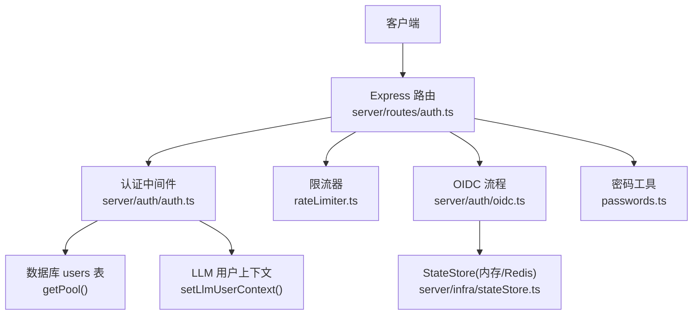
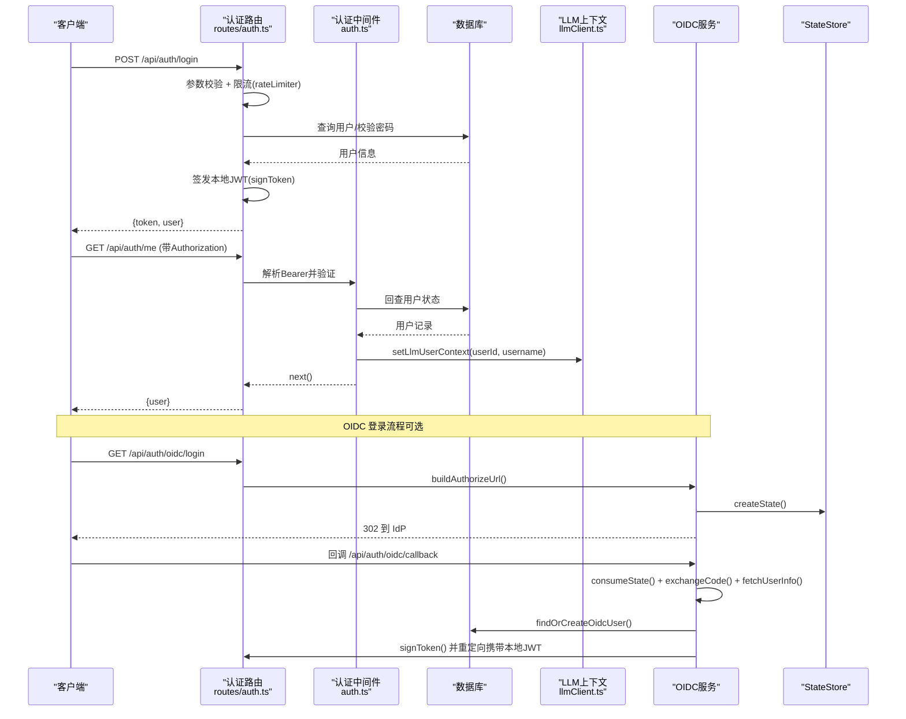
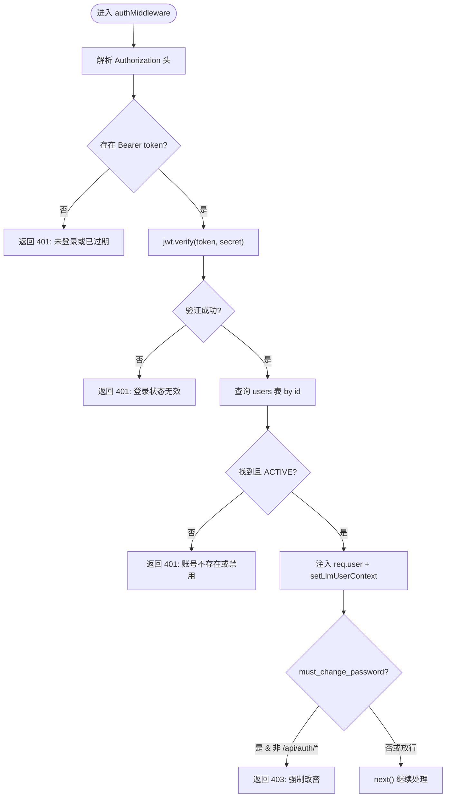
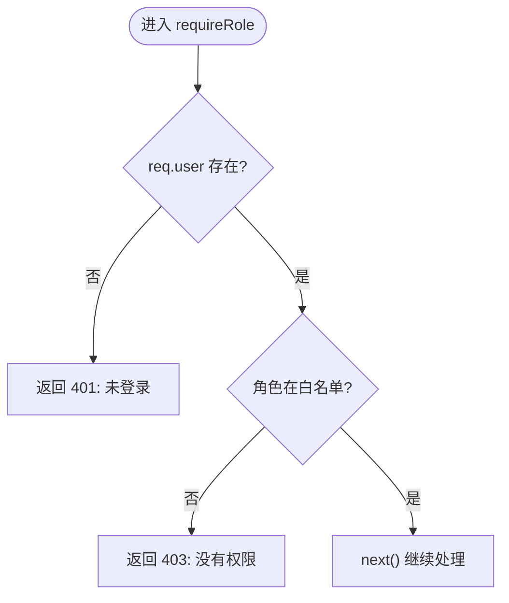
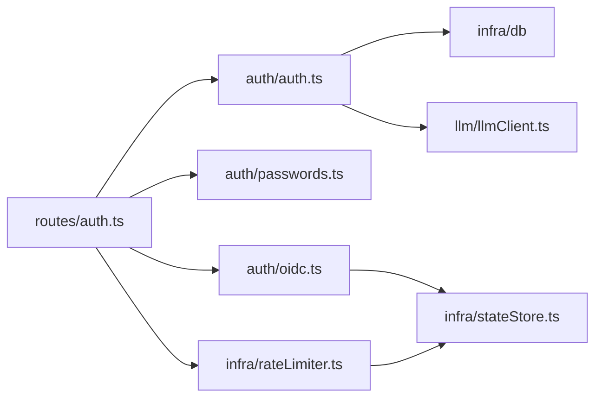

# 认证中间件

<cite>
**本文引用的文件**
- [server/auth/auth.ts](file://server/auth/auth.ts)
- [server/routes/auth.ts](file://server/routes/auth.ts)
- [server/auth/oidc.ts](file://server/auth/oidc.ts)
- [server/auth/passwords.ts](file://server/auth/passwords.ts)
- [server/infra/rateLimiter.ts](file://server/infra/rateLimiter.ts)
- [server/infra/stateStore.ts](file://server/infra/stateStore.ts)
- [server/llm/llmClient.ts](file://server/llm/llmClient.ts)
</cite>

## 目录
1. [简介](#简介)
2. [项目结构](#项目结构)
3. [核心组件](#核心组件)
4. [架构总览](#架构总览)
5. [详细组件分析](#详细组件分析)
6. [依赖关系分析](#依赖关系分析)
7. [性能与可用性](#性能与可用性)
8. [故障排查指南](#故障排查指南)
9. [结论](#结论)
10. [附录：使用场景与示例路径](#附录使用场景与示例路径)

## 简介
本文件面向“智能问数据分析系统”的认证中间件，系统性说明 JWT 令牌签发与验证机制、authMiddleware 完整执行流程、角色守卫 requireRole 的权限控制逻辑，以及用户会话管理、强制改密、LLM 用户上下文注入等高级能力。文档同时给出认证失败的错误处理策略与安全最佳实践，并提供可直接定位的代码片段路径以便快速查阅与二次开发。

## 项目结构
认证相关代码主要分布在以下模块：
- server/auth/auth.ts：JWT 签发/校验、Express 鉴权中间件、角色守卫、LLM 用户上下文注入
- server/routes/auth.ts：认证路由（登录、当前用户、修改密码、OIDC 回调）
- server/auth/oidc.ts：OIDC 授权码流程、JIT 建号、state 防 CSRF、端点发现缓存
- server/auth/passwords.ts：密码哈希/校验、强度校验、pepper 支持
- server/infra/rateLimiter.ts：按 IP 限流（内存/Redis 双实现）
- server/infra/stateStore.ts：状态存储抽象（Memory/Redis），供 OIDC state、限流等使用
- server/llm/llmClient.ts：LLM 调用通道与请求级用户上下文（AsyncLocalStorage）

图表来源
- [server/routes/auth.ts:41-153](file://server/routes/auth.ts#L41-L153)
- [server/auth/auth.ts:60-127](file://server/auth/auth.ts#L60-L127)
- [server/auth/oidc.ts:129-243](file://server/auth/oidc.ts#L129-L243)
- [server/infra/rateLimiter.ts:14-42](file://server/infra/rateLimiter.ts#L14-L42)
- [server/infra/stateStore.ts:169-187](file://server/infra/stateStore.ts#L169-L187)
- [server/auth/passwords.ts:34-99](file://server/auth/passwords.ts#L34-L99)

章节来源
- [server/auth/auth.ts:1-127](file://server/auth/auth.ts#L1-L127)
- [server/routes/auth.ts:1-156](file://server/routes/auth.ts#L1-L156)
- [server/auth/oidc.ts:1-244](file://server/auth/oidc.ts#L1-L244)
- [server/auth/passwords.ts:1-100](file://server/auth/passwords.ts#L1-L100)
- [server/infra/rateLimiter.ts:1-54](file://server/infra/rateLimiter.ts#L1-L54)
- [server/infra/stateStore.ts:1-219](file://server/infra/stateStore.ts#L1-L219)
- [server/llm/llmClient.ts:200-226](file://server/llm/llmClient.ts#L200-L226)

## 核心组件
- JWT 签发与验证
  - 签发：基于用户信息生成 token，设置过期时间；密钥从环境变量或进程级随机值获取（开发兜底）。
  - 验证：解析 Authorization 头中的 Bearer token，校验签名与有效期，回查用户状态并注入 req.user。
- authMiddleware 中间件
  - 解析请求头、校验 token、回查用户、设置 LLM 用户上下文、强制改密拦截。
- requireRole 角色守卫
  - 校验用户是否具备指定角色，未登录返回 401，无权限返回 403。
- 密码安全
  - 强度校验、scrypt 哈希/校验、可选 pepper、兼容旧格式。
- OIDC 统一身份
  - 授权码流程、state 一次性票据、端点发现缓存、JIT 建号/同步、重定向回前端携带本地 JWT。
- 限流与状态存储
  - 登录接口限流保护；OIDC state 与限流计数通过 StateStore（内存/Redis）管理。
- LLM 用户上下文
  - 鉴权后注入 userId/username，随 AsyncLocalStorage 在请求异步链内传播，用于用量统计与审计。

章节来源
- [server/auth/auth.ts:46-127](file://server/auth/auth.ts#L46-L127)
- [server/auth/passwords.ts:34-99](file://server/auth/passwords.ts#L34-L99)
- [server/auth/oidc.ts:41-243](file://server/auth/oidc.ts#L41-L243)
- [server/infra/rateLimiter.ts:14-42](file://server/infra/rateLimiter.ts#L14-L42)
- [server/infra/stateStore.ts:169-187](file://server/infra/stateStore.ts#L169-L187)
- [server/llm/llmClient.ts:200-226](file://server/llm/llmClient.ts#L200-L226)

## 架构总览
下图展示认证主流程：客户端发起请求，经过限流与认证中间件，必要时走 OIDC 流程完成第三方认证，最终在服务端签发本地 JWT 并建立会话。

图表来源
- [server/routes/auth.ts:41-153](file://server/routes/auth.ts#L41-L153)
- [server/auth/auth.ts:60-127](file://server/auth/auth.ts#L60-L127)
- [server/auth/oidc.ts:129-243](file://server/auth/oidc.ts#L129-L243)
- [server/infra/stateStore.ts:100-127](file://server/infra/stateStore.ts#L100-L127)
- [server/infra/rateLimiter.ts:14-42](file://server/infra/rateLimiter.ts#L14-L42)
- [server/llm/llmClient.ts:212-214](file://server/llm/llmClient.ts#L212-L214)

## 详细组件分析

### JWT 令牌签发与验证
- 密钥管理策略
  - 生产环境必须配置固定强密钥（环境变量），避免伪造 token。
  - 开发环境若未配置，则使用进程级随机密钥，重启后所有登录态失效，防止跨环境泄露。
- 过期处理
  - 通过环境变量控制过期时长；过期或未签名的 token 将导致 401 响应。
- 签发内容
  - 包含用户标识、用户名、角色等最小必要字段，减少 payload 暴露面。
- 验证流程
  - 从 Authorization 头提取 Bearer token，校验签名与有效期。
  - 成功后回查 users 表，确保账号状态为 ACTIVE，并注入 req.user。
  - 若 must_change_password 为真且访问非 /api/auth/* 路径，返回 403 并要求先改密。

图表来源
- [server/auth/auth.ts:67-113](file://server/auth/auth.ts#L67-L113)

章节来源
- [server/auth/auth.ts:46-113](file://server/auth/auth.ts#L46-L113)

### 认证失败错误处理策略
- 401 未登录/过期：缺少或无效的 Authorization/Bearer token。
- 401 账号异常：用户不存在或状态非 ACTIVE。
- 403 强制改密：must_change_password 为真且访问非认证相关路径。
- 500 服务异常：数据库查询或内部错误时返回通用错误消息。
- 限流 429：登录接口启用 rateLimiter，防止爆破。

章节来源
- [server/auth/auth.ts:72-112](file://server/auth/auth.ts#L72-L112)
- [server/routes/auth.ts:41-77](file://server/routes/auth.ts#L41-L77)
- [server/infra/rateLimiter.ts:14-42](file://server/infra/rateLimiter.ts#L14-L42)

### 角色守卫 requireRole
- 用法：在需要角色控制的控制器前挂载 requireRole('ADMIN') 或 requireRole('ADMIN','ANALYST')。
- 行为：
  - 未登录：返回 401。
  - 无权限：返回 403。
  - 有权限：继续处理。

图表来源
- [server/auth/auth.ts:115-127](file://server/auth/auth.ts#L115-L127)

章节来源
- [server/auth/auth.ts:115-127](file://server/auth/auth.ts#L115-L127)

### 用户会话管理与强制改密
- 会话载体：服务端无状态，使用 JWT 作为会话凭证；客户端需保存并在后续请求中携带 Authorization: Bearer <token>。
- 强制改密：
  - 首次登录或被管理员重置密码的用户，must_change_password 置位。
  - 除 /api/auth/* 外，其他业务接口将被拒绝并要求先改密。
  - 修改密码成功后清除标志位。

章节来源
- [server/auth/auth.ts:94-108](file://server/auth/auth.ts#L94-L108)
- [server/routes/auth.ts:84-114](file://server/routes/auth.ts#L84-L114)

### LLM 用户上下文设置
- 注入时机：authMiddleware 验证通过后，立即设置当前请求的 LLM 用户上下文（userId、username）。
- 作用域：通过 AsyncLocalStorage 在当前请求的异步链内传播，供 LLM 调用埋点、用量统计与审计。
- 读取：在 LLM 调用链路中自动携带用户上下文，无需逐层透传。

章节来源
- [server/auth/auth.ts:102-104](file://server/auth/auth.ts#L102-L104)
- [server/llm/llmClient.ts:200-226](file://server/llm/llmClient.ts#L200-L226)

### OIDC 统一身份认证（可选）
- 流程：
  - 前端跳转至 /api/auth/oidc/login，服务端构建授权链接并生成一次性 state。
  - 用户在 IdP 授权后回调 /api/auth/oidc/callback，服务端校验 state、换取 access_token、拉取 userinfo。
  - JIT 建号/同步用户信息，签发本地 JWT 并重定向回前端携带 token。
- 安全要点：
  - state 一次性消费，TTL 10 分钟，支持 Redis 多实例共享。
  - 端点发现结果缓存 1 小时，降低对 IdP 的压力。
  - 未配置 OIDC_ISSUER/OIDC_CLIENT_ID 时不启用。

章节来源
- [server/auth/oidc.ts:41-243](file://server/auth/oidc.ts#L41-L243)
- [server/routes/auth.ts:116-153](file://server/routes/auth.ts#L116-L153)
- [server/infra/stateStore.ts:100-127](file://server/infra/stateStore.ts#L100-L127)

### 密码安全与强度校验
- 强度规则：长度 8-64 位，必须包含字母和数字，排除常见弱口令，禁止包含用户名。
- 存储：采用 scrypt（N=2^15, r=8, p=1），支持 pepper（可选环境变量），兼容旧格式。
- 修改密码：校验原密码与新密码强度，更新哈希并清除 must_change_password。

章节来源
- [server/auth/passwords.ts:34-99](file://server/auth/passwords.ts#L34-L99)
- [server/routes/auth.ts:84-114](file://server/routes/auth.ts#L84-L114)

## 依赖关系分析
- 模块耦合
  - routes/auth.ts 依赖 auth.ts、passwords.ts、oidc.ts、rateLimiter.ts。
  - auth.ts 依赖 db、llmClient、logger。
  - oidc.ts 依赖 db、passwords、stateStore、auth。
  - rateLimiter.ts 依赖 stateStore。
- 外部依赖
  - MySQL（users、data_sources 等表）、Redis（可选，用于 stateStore 与限流）。
- 潜在循环依赖
  - 通过模块化拆分与惰性读取环境变量避免启动时序问题。

图表来源
- [server/routes/auth.ts:1-156](file://server/routes/auth.ts#L1-L156)
- [server/auth/auth.ts:1-127](file://server/auth/auth.ts#L1-L127)
- [server/auth/oidc.ts:1-244](file://server/auth/oidc.ts#L1-L244)
- [server/infra/rateLimiter.ts:1-54](file://server/infra/rateLimiter.ts#L1-L54)
- [server/infra/stateStore.ts:1-219](file://server/infra/stateStore.ts#L1-L219)

章节来源
- [server/routes/auth.ts:1-156](file://server/routes/auth.ts#L1-L156)
- [server/auth/auth.ts:1-127](file://server/auth/auth.ts#L1-L127)
- [server/auth/oidc.ts:1-244](file://server/auth/oidc.ts#L1-L244)
- [server/infra/rateLimiter.ts:1-54](file://server/infra/rateLimiter.ts#L1-L54)
- [server/infra/stateStore.ts:1-219](file://server/infra/stateStore.ts#L1-L219)

## 性能与可用性
- 无状态鉴权：JWT 验证轻量，配合数据库回查保证实时性（仅一次 SELECT）。
- 密钥与过期：合理设置过期时间，避免频繁刷新；生产环境固定密钥保障安全性。
- 限流保护：登录接口限流，防止暴力破解；Redis 模式支持多实例共享。
- OIDC 优化：端点发现缓存 1 小时，state TTL 10 分钟，减少外部依赖压力。
- LLM 上下文：通过 AsyncLocalStorage 零开销传递，不影响主链路性能。

[本节提供一般性指导，不直接分析具体文件]

## 故障排查指南
- 401 未登录/过期
  - 检查 Authorization 头是否携带 Bearer token。
  - 确认 token 未过期且由正确密钥签发。
  - 查看数据库用户状态是否为 ACTIVE。
- 403 强制改密
  - 检查 must_change_password 标志位；访问 /api/auth/change-password 修改密码。
- 429 请求过于频繁
  - 检查 rateLimiter 配置与 Redis 连接；确认 REDIS_URL 是否正确。
- OIDC 登录失败
  - 检查 OIDC_ISSUER、OIDC_CLIENT_ID、OIDC_CLIENT_SECRET 配置。
  - 查看回调地址与 state 是否一致；确认 Redis 可用（多实例部署）。
- 数据库异常
  - 检查 getPool() 连接池状态与 SQL 语句；关注日志中的认证异常堆栈。

章节来源
- [server/auth/auth.ts:72-112](file://server/auth/auth.ts#L72-L112)
- [server/infra/rateLimiter.ts:14-42](file://server/infra/rateLimiter.ts#L14-L42)
- [server/auth/oidc.ts:129-243](file://server/auth/oidc.ts#L129-L243)

## 结论
本认证中间件以 JWT 为核心，结合数据库回查与角色守卫，实现了细粒度权限控制与强制改密机制。通过 OIDC 集成与 StateStore 抽象，系统在多实例环境下仍保持高可用与安全。LLM 用户上下文注入使得用量统计与审计更精准。建议在生产环境严格配置 JWT 密钥、合理设置过期时间与限流阈值，并启用 Redis 以提升扩展性与稳定性。

[本节总结性内容，不直接分析具体文件]

## 附录：使用场景与示例路径
- 登录并获取 JWT
  - 路径：POST /api/auth/login
  - 参考：[server/routes/auth.ts:41-77](file://server/routes/auth.ts#L41-L77)
- 获取当前用户信息
  - 路径：GET /api/auth/me
  - 参考：[server/routes/auth.ts:79-82](file://server/routes/auth.ts#L79-L82)
- 修改密码（含强制改密）
  - 路径：POST /api/auth/change-password
  - 参考：[server/routes/auth.ts:84-114](file://server/routes/auth.ts#L84-L114)
- OIDC 登录（企业统一身份）
  - 路径：GET /api/auth/oidc/login、GET /api/auth/oidc/callback
  - 参考：[server/routes/auth.ts:116-153](file://server/routes/auth.ts#L116-L153)
- 鉴权中间件与角色守卫
  - 参考：[server/auth/auth.ts:60-127](file://server/auth/auth.ts#L60-L127)
- LLM 用户上下文注入
  - 参考：[server/llm/llmClient.ts:200-226](file://server/llm/llmClient.ts#L200-L226)
- 限流与状态存储
  - 参考：[server/infra/rateLimiter.ts:14-42](file://server/infra/rateLimiter.ts#L14-L42)、[server/infra/stateStore.ts:169-187](file://server/infra/stateStore.ts#L169-L187)