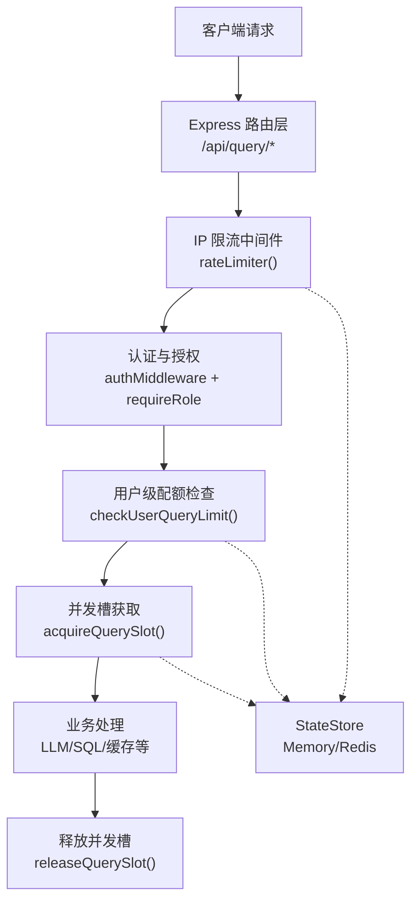
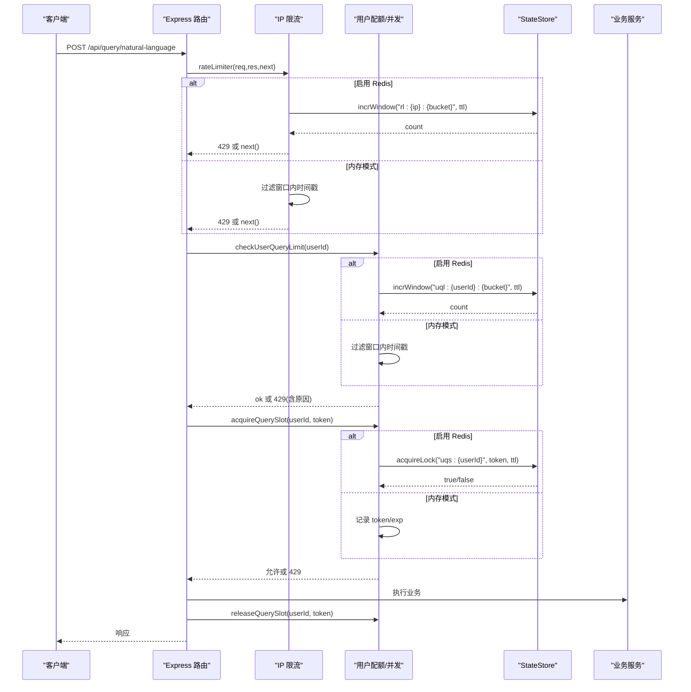
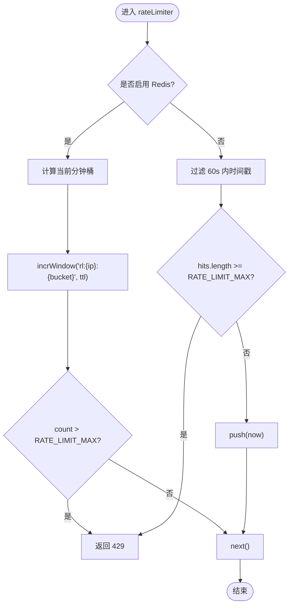
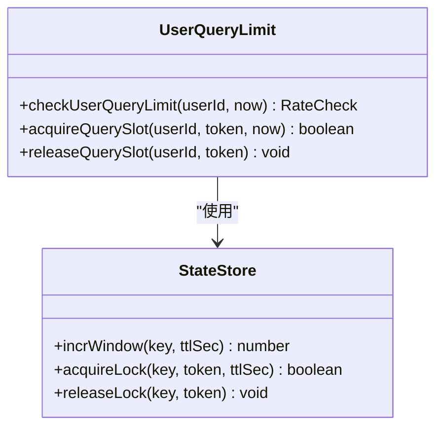
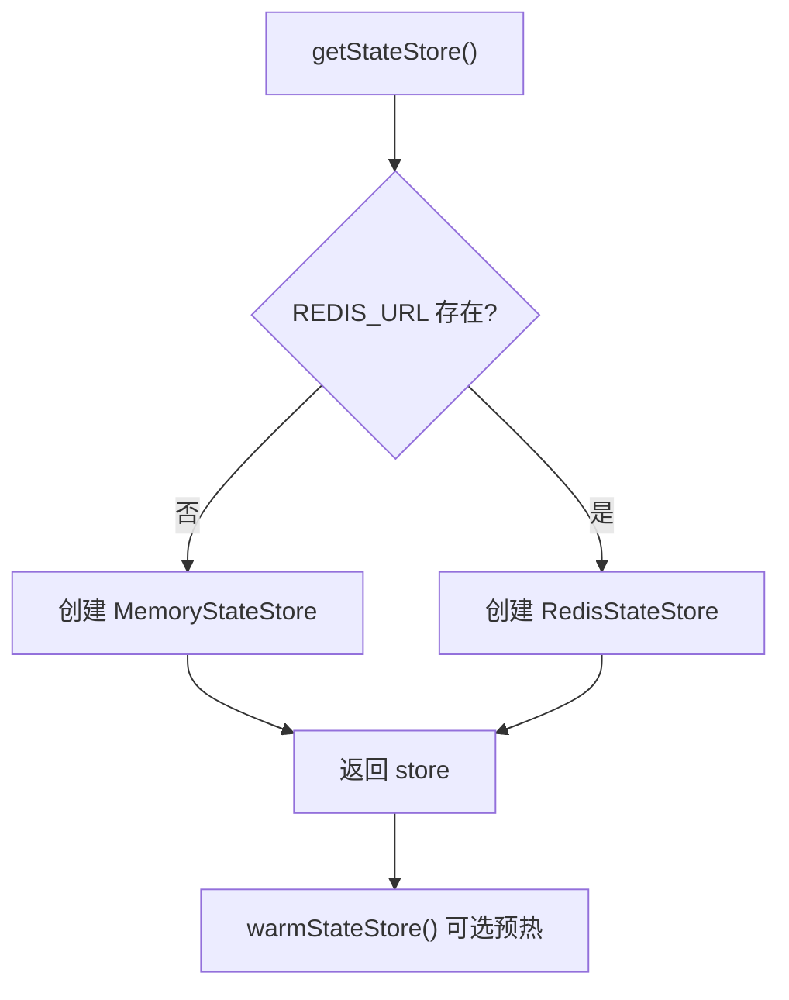
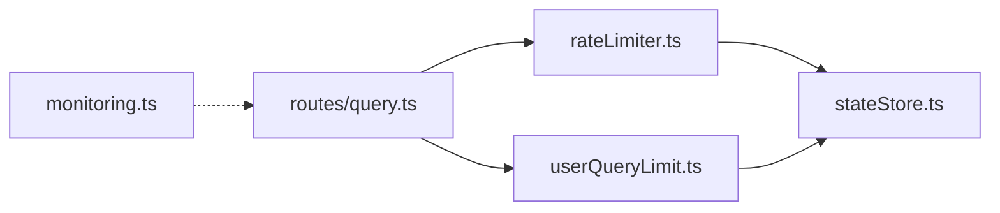

# 限流中间件

<cite>
**本文引用的文件**
- [rateLimiter.ts](file://server/infra/rateLimiter.ts)
- [userQueryLimit.ts](file://server/infra/userQueryLimit.ts)
- [stateStore.ts](file://server/infra/stateStore.ts)
- [query.ts](file://server/routes/query.ts)
- [monitoring.ts](file://server/infra/monitoring.ts)
- [errorCodes.ts](file://server/infra/errorCodes.ts)
</cite>

## 目录
1. [简介](#简介)
2. [项目结构](#项目结构)
3. [核心组件](#核心组件)
4. [架构总览](#架构总览)
5. [详细组件分析](#详细组件分析)
6. [依赖关系分析](#依赖关系分析)
7. [性能与容量规划](#性能与容量规划)
8. [故障排查指南](#故障排查指南)
9. [结论](#结论)
10. [附录：配置与示例](#附录配置与示例)

## 简介
本文件面向“智能问数据分析系统”的限流中间件，系统性说明 IP 级限流、用户级配额与并发互斥的实现机制、Redis 分布式支持、内存优化策略、监控指标与动态调整方式，并提供不同场景下的配置建议与调优要点。

## 项目结构
限流能力由三层组成：
- IP 级限流中间件：基于滑动窗口（内存）或固定分钟窗口（Redis）对请求频率进行限制。
- 用户级配额与并发互斥：按登录用户限制每小时调用次数，并保证同一用户同一时刻仅一个查询在途。
- 状态存储抽象：统一封装进程内 Map 与 Redis 两种实现，提供原子计数与分布式锁能力。

图表来源
- [rateLimiter.ts:14-42](file://server/infra/rateLimiter.ts#L14-L42)
- [userQueryLimit.ts:24-68](file://server/infra/userQueryLimit.ts#L24-L68)
- [stateStore.ts:10-23](file://server/infra/stateStore.ts#L10-L23)
- [query.ts:47-116](file://server/routes/query.ts#L47-L116)

章节来源
- [rateLimiter.ts:1-54](file://server/infra/rateLimiter.ts#L1-L54)
- [userQueryLimit.ts:1-98](file://server/infra/userQueryLimit.ts#L1-L98)
- [stateStore.ts:1-219](file://server/infra/stateStore.ts#L1-L219)
- [query.ts:1-200](file://server/routes/query.ts#L1-L200)

## 核心组件
- IP 级限流中间件 rateLimiter：对每个 IP 在时间窗口内进行计数，超限返回 429。默认使用进程内滑动窗口；启用 Redis 后切换为固定分钟窗口 INCR 计数，多实例共享。
- 用户级配额 checkUserQueryLimit：按 userId 统计每小时调用次数，超限拒绝并给出重试时间提示。默认进程内滑动窗口；启用 Redis 后为固定小时窗口 INCR。
- 并发互斥 acquireQuerySlot/releaseQuerySlot：确保同一用户同时只有一个查询在执行中。默认进程内 Map；启用 Redis 后使用分布式锁，带 token 校验与 TTL 自动释放。
- 状态存储 StateStore：统一接口 MemoryStateStore 与 RedisStateStore，提供 incrWindow、acquireLock、releaseLock 等原子操作。

章节来源
- [rateLimiter.ts:14-42](file://server/infra/rateLimiter.ts#L14-L42)
- [userQueryLimit.ts:24-81](file://server/infra/userQueryLimit.ts#L24-L81)
- [stateStore.ts:10-23](file://server/infra/stateStore.ts#L10-L23)

## 架构总览
限流整体采用“分层防护 + 可插拔存储”的设计：
- 第一层：IP 级限流，防止匿名爆破与高频探测。
- 第二层：认证与角色校验，确保只有合法用户进入业务链路。
- 第三层：用户级配额与并发互斥，保护昂贵的 LLM/SQL 资源。
- 存储层：通过 StateStore 抽象，根据环境变量 REDIS_URL 选择内存或 Redis 实现，兼顾单机零依赖与多实例水平扩展。

图表来源
- [rateLimiter.ts:14-42](file://server/infra/rateLimiter.ts#L14-L42)
- [userQueryLimit.ts:24-81](file://server/infra/userQueryLimit.ts#L24-L81)
- [stateStore.ts:71-163](file://server/infra/stateStore.ts#L71-L163)
- [query.ts:47-116](file://server/routes/query.ts#L47-L116)

## 详细组件分析

### IP 级限流中间件 rateLimiter
- 算法与窗口
  - 内存模式：维护 Map<ip, number[]> 记录请求时间戳，每次请求时过滤掉超过 60 秒的请求，若数量达到阈值则拒绝。
  - Redis 模式：以当前分钟为桶，key 形如 rl:{ip}:{bucket}，使用 incrWindow 原子自增并设置 TTL，超出阈值返回 429。
- 阈值与配置
  - 窗口大小：60 秒。
  - 最大请求数：RATE_LIMIT_MAX，默认 30。
- 超限处理
  - 直接返回 HTTP 429，JSON 错误消息提示稍后再试。
  - Redis 异常时 fail-closed，同样返回 429，避免放大攻击面。
- 内存优化
  - 定时清理过期条目，每 60 秒扫描一次，删除空列表或仅保留窗口内时间戳。

图表来源
- [rateLimiter.ts:14-42](file://server/infra/rateLimiter.ts#L14-L42)
- [stateStore.ts:71-80](file://server/infra/stateStore.ts#L71-L80)
- [stateStore.ts:140-153](file://server/infra/stateStore.ts#L140-L153)

章节来源
- [rateLimiter.ts:1-54](file://server/infra/rateLimiter.ts#L1-L54)

### 用户级配额与并发互斥 userQueryLimit
- 用户级配额
  - 窗口：1 小时。
  - 阈值：USER_QUERY_RATE_MAX，默认 20。
  - 内存模式：Map<userId, number[]> 记录时间戳，过滤窗口外数据后判断是否超限。
  - Redis 模式：固定小时窗口 key 形如 uql:{userId}:{bucket}，INCR 原子计数并设置 TTL。
  - 超限返回 429，附带重试时间提示。
- 并发互斥
  - 目标：同一用户同一时间仅一个查询在途，避免昂贵 LLM/SQL 被并发放大。
  - 内存模式：Map<userId, {token, exp}> 记录当前持有者及过期时间；客户端断开时主动释放。
  - Redis 模式：分布式锁 key 形如 uqs:{userId}，set NX + EX 抢占，release 使用 Lua 原子比对 token 再删除，TTL 兜底释放。
  - 超时与容错：TTL 覆盖最长链路耗时，崩溃后可自动释放；失败路径 fail-closed。

图表来源
- [userQueryLimit.ts:24-81](file://server/infra/userQueryLimit.ts#L24-L81)
- [stateStore.ts:10-23](file://server/infra/stateStore.ts#L10-L23)

章节来源
- [userQueryLimit.ts:1-98](file://server/infra/userQueryLimit.ts#L1-L98)
- [stateStore.ts:71-163](file://server/infra/stateStore.ts#L71-L163)

### 状态存储 StateStore（内存与 Redis）
- 内存实现 MemoryStateStore
  - 计数器：Map<string, {count, exp}>，首次写入设置 TTL，后续自增。
  - 锁：Map<string, MemEntry>，读取时检查过期，写入时设置过期。
- Redis 实现 RedisStateStore
  - 计数器：INCR 原子自增，首次写入设置 TTL；EXPIRE 失败时主动 DEL 防止永久键绕过窗口。
  - 锁：SET key token NX EX 抢占；RELEASE 使用 Lua 脚本原子比较 token 后删除，避免误删他人锁。
- 工厂与预热
  - getStateStore：惰性单例，根据 REDIS_URL 决定实现。
  - warmStateStore：启动时等待 Redis 就绪，减少冷启动窗口内的失败。

图表来源
- [stateStore.ts:169-213](file://server/infra/stateStore.ts#L169-L213)

章节来源
- [stateStore.ts:1-219](file://server/infra/stateStore.ts#L1-L219)

### 路由集成与错误码
- 路由集成
  - 所有写端点均经过 rateLimiter、认证与角色校验，随后执行用户级配额与并发槽检查。
  - 并发槽绑定 token，客户端断开时立即释放，finally 中释放因 token 不匹配为 no-op，避免误删新请求槽。
- 错误码
  - RATE_LIMITED：用户级配额超限。
  - QUERY_IN_FLIGHT：用户级并发槽占用中。
  - IP 级限流直接返回 429 通用错误消息。

章节来源
- [query.ts:47-116](file://server/routes/query.ts#L47-L116)
- [errorCodes.ts:16-18](file://server/infra/errorCodes.ts#L16-L18)

## 依赖关系分析
- rateLimiter 依赖 stateStore 的 incrWindow 用于 Redis 模式；内存模式仅依赖进程内 Map。
- userQueryLimit 依赖 stateStore 的 incrWindow 与 acquireLock/releaseLock。
- query 路由组合使用 rateLimiter、userQueryLimit，并在成功/失败路径中正确释放并发槽。
- monitoring 提供 Prometheus 指标，但不直接耦合限流逻辑；可通过审计与外部埋点观察限流影响。

图表来源
- [rateLimiter.ts:14-42](file://server/infra/rateLimiter.ts#L14-L42)
- [userQueryLimit.ts:24-81](file://server/infra/userQueryLimit.ts#L24-L81)
- [stateStore.ts:71-163](file://server/infra/stateStore.ts#L71-L163)
- [query.ts:47-116](file://server/routes/query.ts#L47-L116)
- [monitoring.ts:1-153](file://server/infra/monitoring.ts#L1-L153)

章节来源
- [rateLimiter.ts:1-54](file://server/infra/rateLimiter.ts#L1-L54)
- [userQueryLimit.ts:1-98](file://server/infra/userQueryLimit.ts#L1-L98)
- [stateStore.ts:1-219](file://server/infra/stateStore.ts#L1-L219)
- [query.ts:1-200](file://server/routes/query.ts#L1-L200)
- [monitoring.ts:1-153](file://server/infra/monitoring.ts#L1-L153)

## 性能与容量规划
- 内存模式
  - 优点：零依赖、低延迟、适合单机开发测试。
  - 缺点：多实例无法共享计数；需定期清理避免内存增长。
  - 适用：本地调试、单实例部署。
- Redis 模式
  - 优点：多实例共享计数、TTL 自动过期、支持水平扩展。
  - 注意：连接建立有冷启动窗口，建议启动时调用预热函数；EXPIRE 失败会主动删除 key 防止永久键。
  - 适用：生产多实例部署。
- 容量估算
  - IP 限流：60 秒窗口，默认 30 次/分钟/IP。可根据流量模型调整 RATE_LIMIT_MAX。
  - 用户配额：1 小时窗口，默认 20 次/小时/用户。结合并发互斥，控制 LLM/SQL 并发度。
  - 并发槽 TTL：15 分钟，覆盖最长链路耗时，崩溃后自动释放。
- 监控与观测
  - 通过 Prometheus 指标观察整体请求量、耗时、缓存命中、LLM 用量、SQL 执行耗时等。
  - 限流相关告警：429 比例升高、用户配额命中率、并发槽争用情况。

[本节为通用指导，不直接分析具体代码文件]

## 故障排查指南
- 常见问题
  - 频繁 429：检查 RATE_LIMIT_MAX 与 USER_QUERY_RATE_MAX 是否过低；确认是否存在恶意刷量或客户端重试风暴。
  - Redis 异常导致限流：查看 stateStore 日志中的连接异常；必要时回退到内存模式或修复 Redis。
  - 并发槽未释放：确认客户端断开回调是否正确触发 releaseQuerySlot；检查 token 是否一致。
- 定位步骤
  - 查看 /metrics 暴露的指标，关注 nl2sql_requests_total、nl2sql_duration_seconds、http_request_duration_seconds。
  - 核对环境变量：REDIS_URL、RATE_LIMIT_MAX、USER_QUERY_RATE_MAX。
  - 检查 Redis 键空间：rl:*、uql:*、uqs:* 是否符合预期 TTL。
- 恢复策略
  - 临时提升阈值：调整 RATE_LIMIT_MAX 或 USER_QUERY_RATE_MAX 并重启。
  - 降级：关闭 Redis，回退到内存模式（仅限单机）。
  - 扩容：增加实例并配合 Redis 共享计数。

章节来源
- [stateStore.ts:178-181](file://server/infra/stateStore.ts#L178-L181)
- [monitoring.ts:137-152](file://server/infra/monitoring.ts#L137-L152)

## 结论
本限流方案通过 IP 级与用户级双层防护，结合并发互斥与可插拔存储，既满足单机快速迭代，又支持生产多实例水平扩展。通过合理的阈值配置、监控指标与故障恢复策略，可有效保护后端 LLM/SQL 资源，保障系统稳定性与用户体验。

[本节为总结性内容，不直接分析具体代码文件]

## 附录：配置与示例
- 环境变量
  - REDIS_URL：启用 Redis 分布式限流与并发锁。
  - RATE_LIMIT_MAX：IP 级每分钟最大请求数，默认 30。
  - USER_QUERY_RATE_MAX：用户级每小时最大请求数，默认 20。
  - METRICS_TOKEN：可选，保护 /metrics 端点。
- 典型场景
  - 单机开发：不配置 REDIS_URL，使用内存模式；适当提高 RATE_LIMIT_MAX 便于压测。
  - 多实例生产：配置 REDIS_URL，开启分布式计数与锁；根据峰值 QPS 调整 RATE_LIMIT_MAX 与 USER_QUERY_RATE_MAX。
  - 高并发 LLM 场景：降低 USER_QUERY_RATE_MAX 或缩短窗口，强化并发互斥，避免 LLM 过载。
- 监控与调优
  - 观察 429 比例与请求耗时分布，评估阈值是否合理。
  - 针对热点 IP 或用户，考虑更细粒度限流或黑名单策略。
  - 结合 Grafana 看板与 Prometheus 告警，及时发现问题。

[本节为配置与示例，不直接分析具体代码文件]