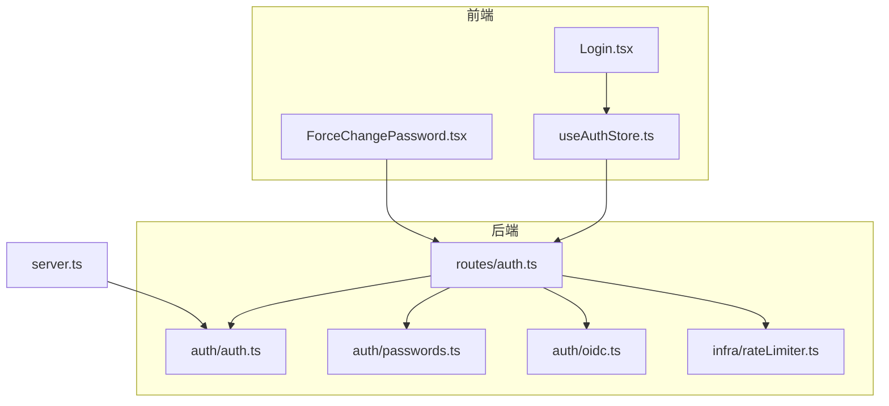
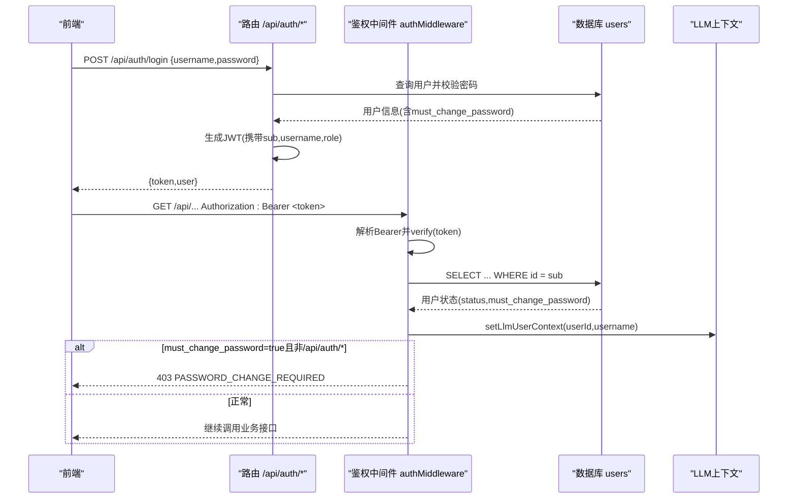
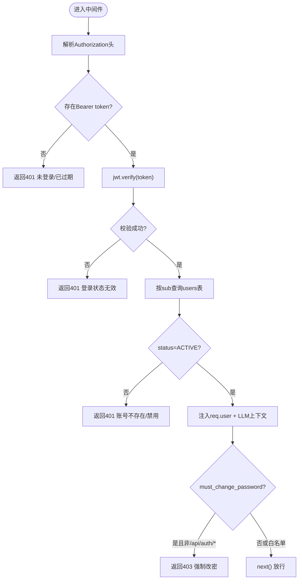
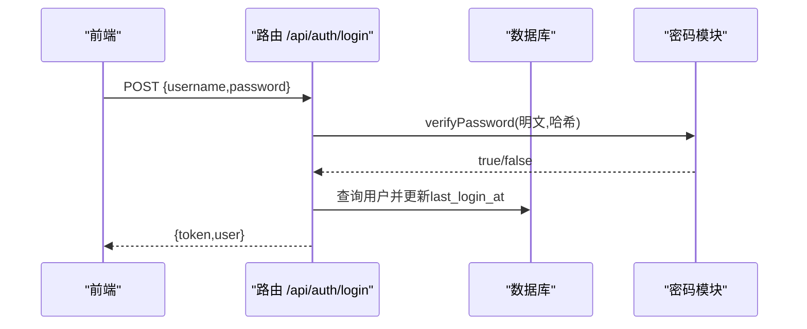
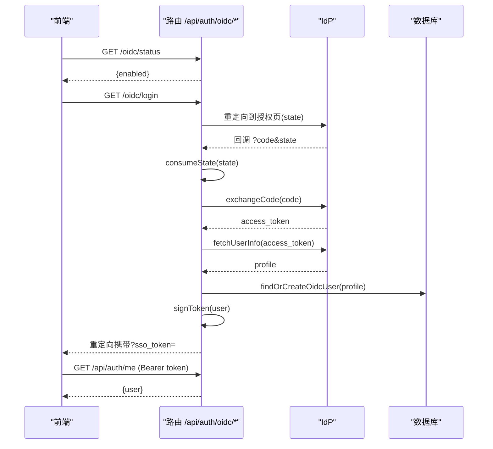
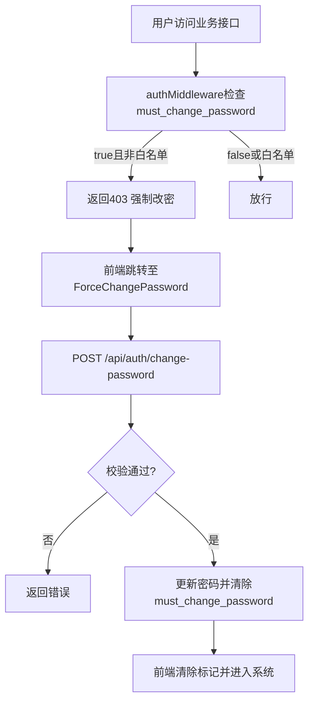
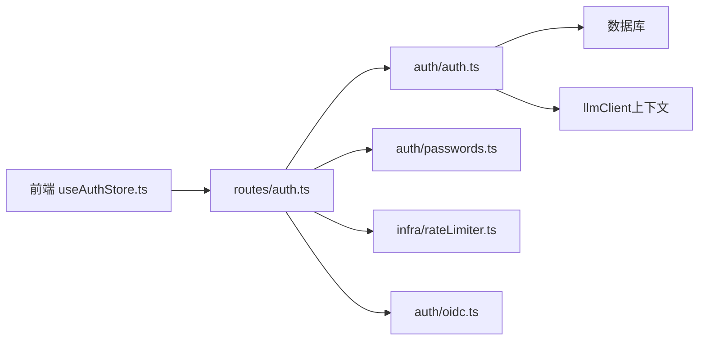

# JWT令牌认证

<cite>
**本文引用的文件**
- [server/auth/auth.ts](file://server/auth/auth.ts)
- [server/routes/auth.ts](file://server/routes/auth.ts)
- [server/auth/passwords.ts](file://server/auth/passwords.ts)
- [server/auth/oidc.ts](file://server/auth/oidc.ts)
- [src/hooks/useAuthStore.ts](file://src/hooks/useAuthStore.ts)
- [src/components/auth/Login.tsx](file://src/components/auth/Login.tsx)
- [src/components/auth/ForceChangePassword.tsx](file://src/components/auth/ForceChangePassword.tsx)
- [server/infra/rateLimiter.ts](file://server/infra/rateLimiter.ts)
- [server.ts](file://server.ts)
</cite>

## 目录
1. [简介](#简介)
2. [项目结构](#项目结构)
3. [核心组件](#核心组件)
4. [架构总览](#架构总览)
5. [详细组件分析](#详细组件分析)
6. [依赖关系分析](#依赖关系分析)
7. [性能与安全考量](#性能与安全考量)
8. [故障排查指南](#故障排查指南)
9. [结论](#结论)
10. [附录：配置与最佳实践](#附录配置与最佳实践)

## 简介
本文件系统化说明本项目的JWT令牌认证机制，覆盖令牌的签发、验证、刷新策略（当前实现为无状态短期令牌）、密钥管理、中间件鉴权流程、登录/登出与会话管理、以及强制改密的安全逻辑。文档同时给出前后端交互的关键路径与流程图，便于开发与运维快速定位问题并落地安全最佳实践。

## 项目结构
围绕认证的核心文件分布如下：
- 服务端鉴权与路由：server/auth/auth.ts、server/routes/auth.ts
- 密码哈希与强度校验：server/auth/passwords.ts
- OIDC统一身份认证（可选）：server/auth/oidc.ts
- 前端状态与页面：src/hooks/useAuthStore.ts、src/components/auth/Login.tsx、src/components/auth/ForceChangePassword.tsx
- 限流防护：server/infra/rateLimiter.ts
- 启动安全检查：server.ts

图表来源
- [server/auth/auth.ts:1-127](file://server/auth/auth.ts#L1-L127)
- [server/routes/auth.ts:1-156](file://server/routes/auth.ts#L1-L156)
- [server/auth/passwords.ts:1-100](file://server/auth/passwords.ts#L1-L100)
- [server/auth/oidc.ts:1-244](file://server/auth/oidc.ts#L1-L244)
- [src/hooks/useAuthStore.ts:1-84](file://src/hooks/useAuthStore.ts#L1-L84)
- [src/components/auth/Login.tsx:1-137](file://src/components/auth/Login.tsx#L1-L137)
- [src/components/auth/ForceChangePassword.tsx:1-138](file://src/components/auth/ForceChangePassword.tsx#L1-L138)
- [server/infra/rateLimiter.ts:1-54](file://server/infra/rateLimiter.ts#L1-L54)
- [server.ts:80-120](file://server.ts#L80-L120)

章节来源
- [server/auth/auth.ts:1-127](file://server/auth/auth.ts#L1-L127)
- [server/routes/auth.ts:1-156](file://server/routes/auth.ts#L1-L156)
- [server/auth/passwords.ts:1-100](file://server/auth/passwords.ts#L1-L100)
- [server/auth/oidc.ts:1-244](file://server/auth/oidc.ts#L1-L244)
- [src/hooks/useAuthStore.ts:1-84](file://src/hooks/useAuthStore.ts#L1-L84)
- [src/components/auth/Login.tsx:1-137](file://src/components/auth/Login.tsx#L1-L137)
- [src/components/auth/ForceChangePassword.tsx:1-138](file://src/components/auth/ForceChangePassword.tsx#L1-L138)
- [server/infra/rateLimiter.ts:1-54](file://server/infra/rateLimiter.ts#L1-L54)
- [server.ts:80-120](file://server.ts#L80-L120)

## 核心组件
- JWT签发与验证：基于jsonwebtoken库，使用环境变量或进程级临时密钥签名；支持过期时间配置；每次请求通过中间件回查用户表以同步禁用/角色变更。
- 中间件鉴权：解析Authorization头Bearer token，校验签名后查询users表，注入req.user，并处理强制改密拦截。
- 密码安全：scrypt哈希+pepper，兼容旧格式；统一强度校验规则。
- 登录/改密/OIDC：提供本地账号登录、修改密码、企业SSO（授权码流程+JIT建号）。
- 前端状态：持久化token与用户信息，封装登录、登出、角色判断、强制改密标记。

章节来源
- [server/auth/auth.ts:1-127](file://server/auth/auth.ts#L1-L127)
- [server/routes/auth.ts:1-156](file://server/routes/auth.ts#L1-L156)
- [server/auth/passwords.ts:1-100](file://server/auth/passwords.ts#L1-L100)
- [server/auth/oidc.ts:1-244](file://server/auth/oidc.ts#L1-L244)
- [src/hooks/useAuthStore.ts:1-84](file://src/hooks/useAuthStore.ts#L1-L84)

## 架构总览
下图展示从浏览器到服务端的完整认证链路，包括本地登录、OIDC登录、鉴权中间件与强制改密拦截。

图表来源
- [server/routes/auth.ts:41-82](file://server/routes/auth.ts#L41-L82)
- [server/auth/auth.ts:60-113](file://server/auth/auth.ts#L60-L113)
- [server.ts:223-225](file://server.ts#L223-L225)

## 详细组件分析

### JWT令牌结构与生命周期
- 载荷字段：sub（用户ID）、username、role（ADMIN/ANALYST/VIEWER）。
- 过期时间：由环境变量控制，默认12小时；可通过JWT_EXPIRES_IN调整。
- 密钥来源：优先读取JWT_SECRET；开发环境未配置时生成进程级随机密钥（重启失效），生产环境缺失则拒绝启动。
- 刷新机制：当前实现为无状态短期令牌，未提供服务端刷新接口；建议客户端在即将过期前主动重新登录或刷新。

章节来源
- [server/auth/auth.ts:46-64](file://server/auth/auth.ts#L46-L64)
- [server/auth/auth.ts:66-83](file://server/auth/auth.ts#L66-L83)
- [server.ts:88-96](file://server.ts#L88-L96)

### 鉴权中间件 authMiddleware 原理
- Bearer解析：从Authorization头提取token，缺失返回401。
- 签名校验：使用jwt.verify校验，失败返回401。
- 用户状态回查：根据payload.sub查询users表，校验status=ACTIVE，否则返回401。
- 上下文注入：将用户信息写入req.user，并设置LLM用量统计的用户上下文。
- 强制改密拦截：若must_change_password为真且请求非/api/auth/*，返回403并提示需先改密。

图表来源
- [server/auth/auth.ts:66-113](file://server/auth/auth.ts#L66-L113)

章节来源
- [server/auth/auth.ts:66-113](file://server/auth/auth.ts#L66-L113)

### 登录流程（本地账号）
- 入口：POST /api/auth/login，受rateLimiter保护。
- 校验：用户名/密码非空校验；查询用户并校验密码；检查账号状态。
- 更新：记录最后登录时间。
- 响应：返回{success:true, token,user}，user包含mustChangePassword标记。

图表来源
- [server/routes/auth.ts:41-77](file://server/routes/auth.ts#L41-L77)
- [server/auth/passwords.ts:58-99](file://server/auth/passwords.ts#L58-L99)

章节来源
- [server/routes/auth.ts:41-77](file://server/routes/auth.ts#L41-L77)
- [server/auth/passwords.ts:58-99](file://server/auth/passwords.ts#L58-L99)

### 登录流程（OIDC SSO）
- 前端检测：GET /api/auth/oidc/status决定是否显示SSO入口。
- 重定向：GET /api/auth/oidc/login -> IdP授权页（带一次性state）。
- 回调：GET /api/auth/oidc/callback?code&state -> 校验state -> exchangeCode获取access_token -> fetchUserInfo -> JIT建号/同步 -> 签发本地JWT -> 重定向回前端携带token。
- 前端完成登录：使用loginWithToken调用/api/auth/me填充用户信息。

图表来源
- [server/auth/oidc.ts:129-164](file://server/auth/oidc.ts#L129-L164)
- [server/auth/oidc.ts:207-243](file://server/auth/oidc.ts#L207-L243)
- [server/routes/auth.ts:116-153](file://server/routes/auth.ts#L116-L153)
- [src/hooks/useAuthStore.ts:41-52](file://src/hooks/useAuthStore.ts#L41-L52)

章节来源
- [server/auth/oidc.ts:129-164](file://server/auth/oidc.ts#L129-L164)
- [server/auth/oidc.ts:207-243](file://server/auth/oidc.ts#L207-L243)
- [server/routes/auth.ts:116-153](file://server/routes/auth.ts#L116-L153)
- [src/hooks/useAuthStore.ts:41-52](file://src/hooks/useAuthStore.ts#L41-L52)

### 强制改密机制（mustChangePassword）
- 触发条件：首次登录或管理员重置密码后，用户must_change_password置位。
- 服务端拦截：authMiddleware对非/api/auth/*的请求返回403并提示PASSWORD_CHANGE_REQUIRED。
- 前端处理：ForceChangePassword页面调用/api/auth/change-password，成功后清除mustChangePassword标记。
- 安全考虑：仅允许改密接口在白名单内访问；新密码需满足强度规则且不能与原密码相同。

图表来源
- [server/auth/auth.ts:104-108](file://server/auth/auth.ts#L104-L108)
- [server/routes/auth.ts:84-114](file://server/routes/auth.ts#L84-L114)
- [src/components/auth/ForceChangePassword.tsx:23-42](file://src/components/auth/ForceChangePassword.tsx#L23-L42)

章节来源
- [server/auth/auth.ts:104-108](file://server/auth/auth.ts#L104-L108)
- [server/routes/auth.ts:84-114](file://server/routes/auth.ts#L84-L114)
- [src/components/auth/ForceChangePassword.tsx:23-42](file://src/components/auth/ForceChangePassword.tsx#L23-L42)

### 登出与会话管理
- 当前实现为无状态JWT，服务端不维护会话；登出即删除前端存储的token与用户信息。
- 前端logout：清空本地auth-store，移除analytics-store等缓存。
- 注意：由于无服务端注销，短时效JWT过期后自然失效；如需立即失效，可结合黑名单或缩短过期时间。

章节来源
- [src/hooks/useAuthStore.ts:54-57](file://src/hooks/useAuthStore.ts#L54-L57)

### 权限上下文注入与角色守卫
- 鉴权后注入req.user，供后续路由使用。
- requireRole守卫：限制特定角色访问敏感接口（如ADMIN）。
- LLM用量统计：鉴权后将userId与username注入LLM上下文，用于按用户聚合用量。

章节来源
- [server/auth/auth.ts:94-103](file://server/auth/auth.ts#L94-L103)
- [server/auth/auth.ts:115-126](file://server/auth/auth.ts#L115-L126)

## 依赖关系分析
- 路由层依赖：authRoutes依赖鉴权中间件、密码模块、限流器、OIDC模块。
- 中间件依赖：authMiddleware依赖数据库连接池、LLM上下文注入、日志。
- 前端依赖：useAuthStore封装登录/登出/角色判断；Login与ForceChangePassword分别调用对应API。

图表来源
- [server/routes/auth.ts:1-20](file://server/routes/auth.ts#L1-L20)
- [server/auth/auth.ts:1-12](file://server/auth/auth.ts#L1-L12)
- [server/infra/rateLimiter.ts:1-12](file://server/infra/rateLimiter.ts#L1-L12)
- [server/auth/oidc.ts:1-20](file://server/auth/oidc.ts#L1-L20)
- [src/hooks/useAuthStore.ts:1-17](file://src/hooks/useAuthStore.ts#L1-L17)

章节来源
- [server/routes/auth.ts:1-20](file://server/routes/auth.ts#L1-L20)
- [server/auth/auth.ts:1-12](file://server/auth/auth.ts#L1-L12)
- [server/infra/rateLimiter.ts:1-12](file://server/infra/rateLimiter.ts#L1-L12)
- [server/auth/oidc.ts:1-20](file://server/auth/oidc.ts#L1-L20)
- [src/hooks/useAuthStore.ts:1-17](file://src/hooks/useAuthStore.ts#L1-L17)

## 性能与安全考量
- 性能
  - 鉴权中间件每次请求回查数据库，确保状态实时生效；在高并发场景下建议优化查询索引（id,status,role等）。
  - OIDC discovery结果缓存1小时，减少外部网络开销。
  - 限流器支持内存与Redis两种模式，多实例部署建议使用Redis保证全局计数一致。
- 安全
  - 生产环境必须配置JWT_SECRET，否则拒绝启动（fail-fast）。
  - 密码采用scrypt+pepper，兼容旧格式；统一强度校验，防止弱口令与包含用户名的口令。
  - 强制改密机制避免初始密码长期有效。
  - 限流器保护登录接口，降低暴力破解风险。

[本节为通用指导，无需具体文件引用]

## 故障排查指南
- 401 未登录或登录已过期
  - 检查Authorization头是否携带Bearer token。
  - 检查JWT_SECRET是否一致（多实例部署）。
  - 检查用户状态是否为ACTIVE。
- 403 强制改密
  - 确认must_change_password标志；访问/api/auth/*白名单接口进行改密。
- 429 请求过于频繁
  - 检查rateLimiter配置与Redis可用性。
- OIDC登录失败
  - 检查OIDC_ISSUER、OIDC_CLIENT_ID、OIDC_REDIRECT_URI配置。
  - 检查state是否过期或被重复消费。

章节来源
- [server/auth/auth.ts:72-83](file://server/auth/auth.ts#L72-L83)
- [server/auth/auth.ts:104-108](file://server/auth/auth.ts#L104-L108)
- [server/infra/rateLimiter.ts:14-42](file://server/infra/rateLimiter.ts#L14-L42)
- [server/auth/oidc.ts:100-127](file://server/auth/oidc.ts#L100-L127)

## 结论
本项目采用无状态JWT认证，结合严格的密钥管理、密码安全与强制改密机制，保障登录与会话安全。鉴权中间件在每次请求中回查用户状态，确保权限变更即时生效。对于高可用与多实例部署，建议统一JWT_SECRET、启用Redis限流与状态存储，并在客户端实现令牌过期前的主动刷新策略。

[本节为总结性内容，无需具体文件引用]

## 附录：配置与最佳实践
- 环境变量
  - JWT_SECRET：生产环境必须配置，所有实例保持一致。
  - JWT_EXPIRES_IN：令牌过期时间，默认12小时。
  - SCRYPT_PEPPER：可选pepper，增强离线爆破成本。
  - OIDC_*：启用企业SSO所需配置。
  - RATE_LIMIT_MAX：登录接口限流阈值。
- 开发环境
  - 未配置JWT_SECRET时自动生成进程级临时密钥，重启后失效。
- 生产环境
  - 缺失JWT_SECRET直接拒绝启动，防止伪造token。
  - 建议配合HTTPS、CSP、HSTS等安全响应头。

章节来源
- [server/auth/auth.ts:46-58](file://server/auth/auth.ts#L46-L58)
- [server/auth/passwords.ts:15-16](file://server/auth/passwords.ts#L15-L16)
- [server/auth/oidc.ts:41-56](file://server/auth/oidc.ts#L41-L56)
- [server/infra/rateLimiter.ts:9-12](file://server/infra/rateLimiter.ts#L9-L12)
- [server.ts:88-96](file://server.ts#L88-L96)