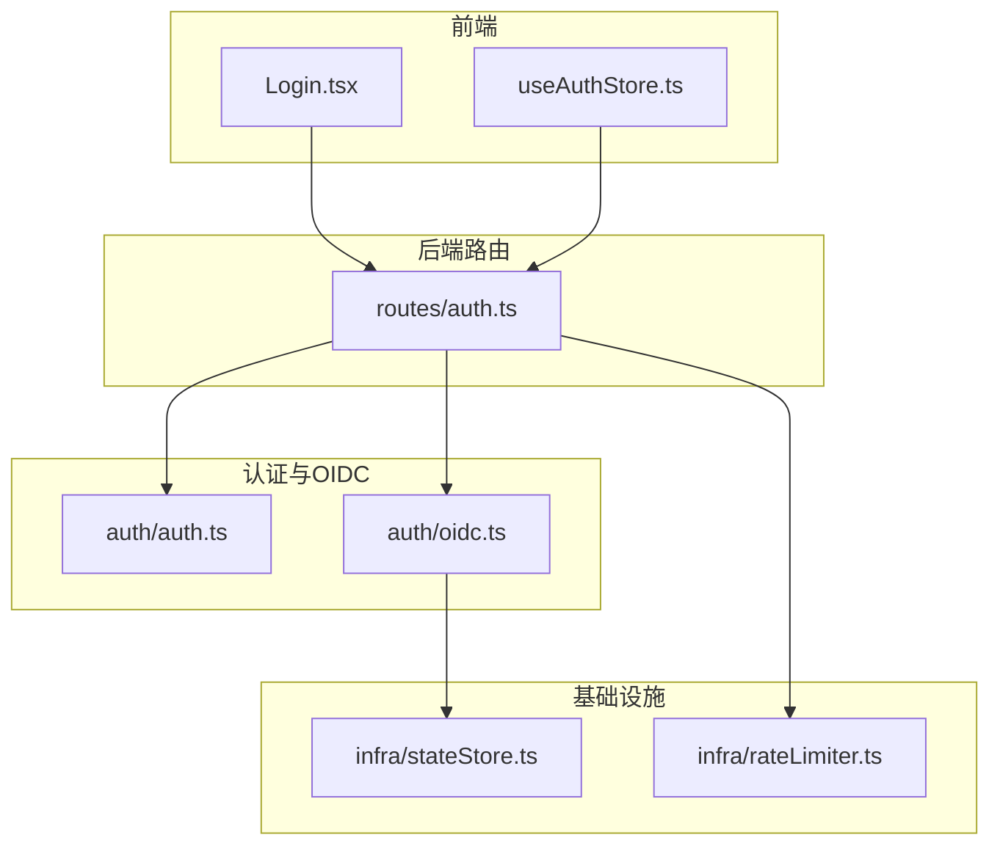
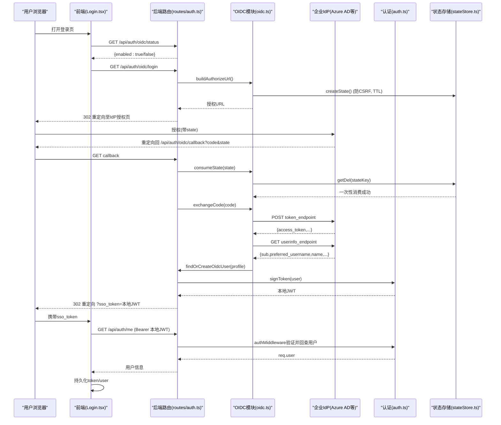
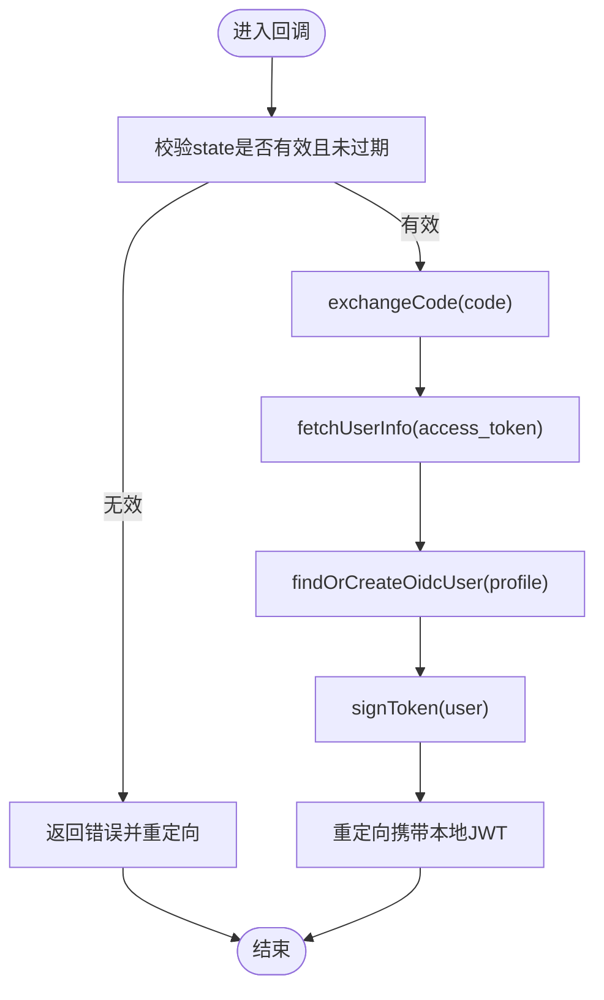
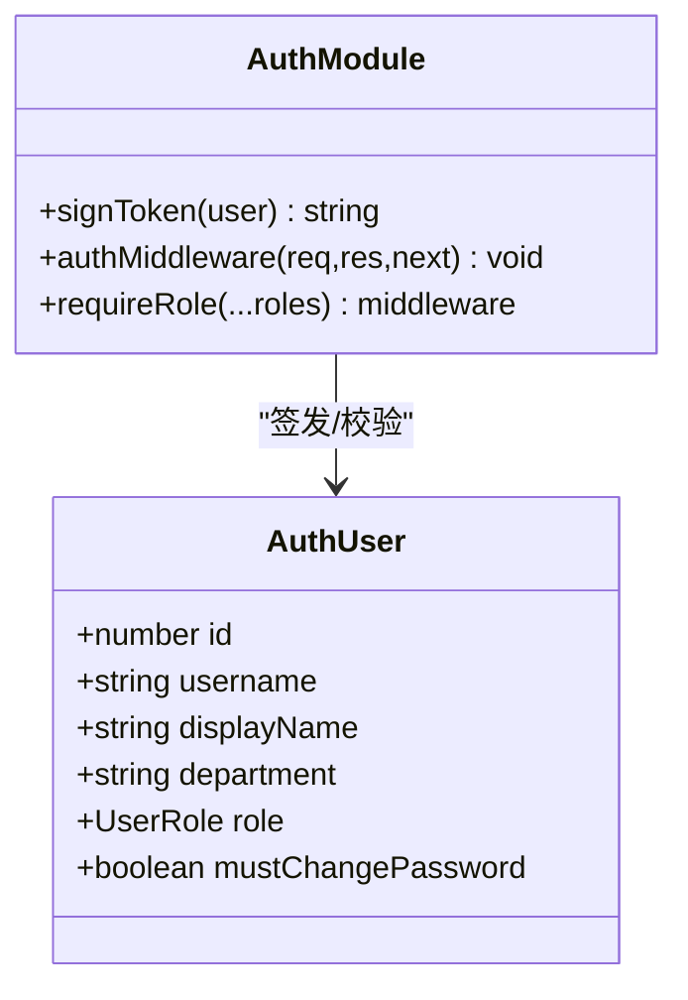
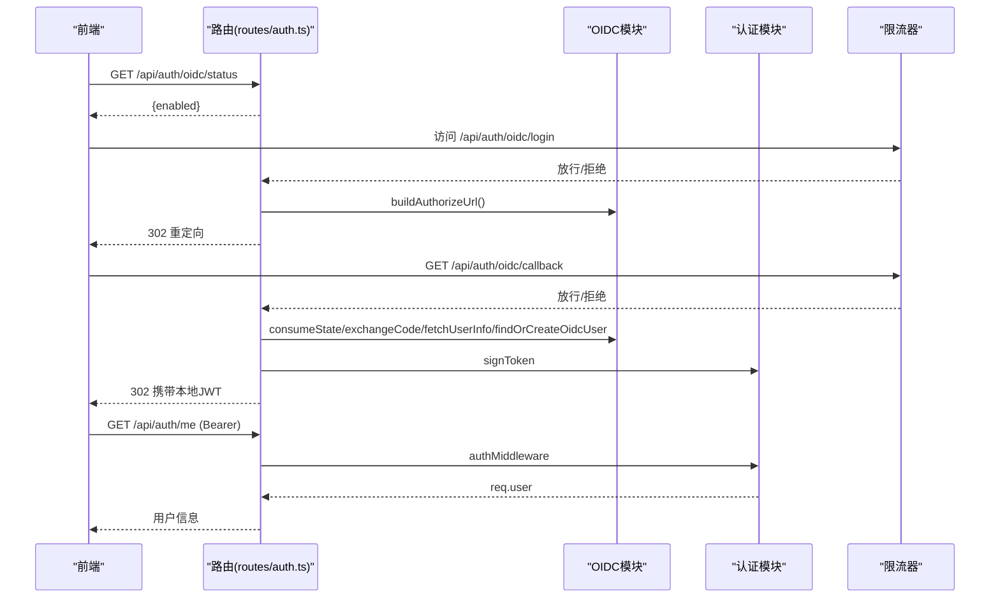
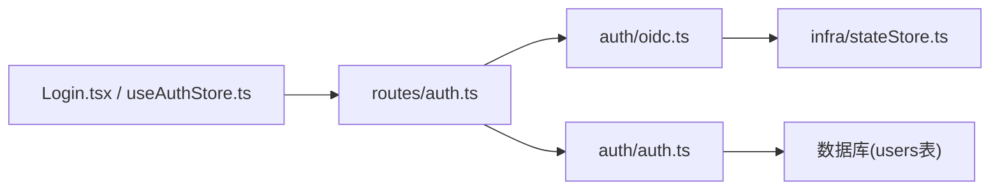

# OIDC企业集成

<cite>
**本文引用的文件**
- [server/auth/oidc.ts](file://server/auth/oidc.ts)
- [server/auth/auth.ts](file://server/auth/auth.ts)
- [server/routes/auth.ts](file://server/routes/auth.ts)
- [src/components/auth/Login.tsx](file://src/components/auth/Login.tsx)
- [src/hooks/useAuthStore.ts](file://src/hooks/useAuthStore.ts)
- [server/infra/stateStore.ts](file://server/infra/stateStore.ts)
- [server/infra/rateLimiter.ts](file://server/infra/rateLimiter.ts)
- [server/auth/oidc.test.ts](file://server/auth/oidc.test.ts)
</cite>

## 目录
1. [简介](#简介)
2. [项目结构](#项目结构)
3. [核心组件](#核心组件)
4. [架构总览](#架构总览)
5. [详细组件分析](#详细组件分析)
6. [依赖关系分析](#依赖关系分析)
7. [性能考虑](#性能考虑)
8. [故障排查指南](#故障排查指南)
9. [结论](#结论)
10. [附录：配置与对接方案](#附录配置与对接方案)

## 简介
本文件面向企业级部署，说明本系统对OpenID Connect（OIDC）协议的支持与集成方式。内容涵盖OAuth2授权码流程、ID Token与访问令牌的使用、用户信息获取、JIT建号与同步、会话与本地JWT的衔接、回调处理与安全加固，以及与企业身份系统（如Azure AD等）的对接要点。同时提供错误处理策略、性能优化建议与迁移策略，帮助在生产环境中稳定落地。

## 项目结构
与OIDC企业集成相关的代码主要分布在以下模块：
- 认证与OIDC实现：server/auth/oidc.ts、server/auth/auth.ts
- 路由与入口：server/routes/auth.ts
- 前端登录与SSO入口：src/components/auth/Login.tsx、src/hooks/useAuthStore.ts
- 状态存储与限流：server/infra/stateStore.ts、server/infra/rateLimiter.ts
- 单元测试：server/auth/oidc.test.ts

图表来源
- [server/routes/auth.ts:1-156](file://server/routes/auth.ts#L1-L156)
- [server/auth/oidc.ts:1-244](file://server/auth/oidc.ts#L1-L244)
- [server/auth/auth.ts:1-127](file://server/auth/auth.ts#L1-L127)
- [src/components/auth/Login.tsx:1-137](file://src/components/auth/Login.tsx#L1-L137)
- [src/hooks/useAuthStore.ts:1-84](file://src/hooks/useAuthStore.ts#L1-L84)
- [server/infra/stateStore.ts:1-219](file://server/infra/stateStore.ts#L1-L219)
- [server/infra/rateLimiter.ts:1-54](file://server/infra/rateLimiter.ts#L1-L54)

章节来源
- [server/routes/auth.ts:1-156](file://server/routes/auth.ts#L1-L156)
- [server/auth/oidc.ts:1-244](file://server/auth/oidc.ts#L1-L244)
- [server/auth/auth.ts:1-127](file://server/auth/auth.ts#L1-L127)
- [src/components/auth/Login.tsx:1-137](file://src/components/auth/Login.tsx#L1-L137)
- [src/hooks/useAuthStore.ts:1-84](file://src/hooks/useAuthStore.ts#L1-L84)
- [server/infra/stateStore.ts:1-219](file://server/infra/stateStore.ts#L1-L219)
- [server/infra/rateLimiter.ts:1-54](file://server/infra/rateLimiter.ts#L1-L54)

## 核心组件
- OIDC客户端能力：发现端点、构建授权URL、交换code为access_token、拉取userinfo、用户名规整、JIT建号/同步。
- 认证中间件：校验本地JWT并回查用户状态，注入req.user，强制改密拦截。
- 路由层：提供登录、当前用户、修改密码、OIDC状态查询、OIDC登录重定向与回调处理。
- 状态存储：支持内存与Redis两种模式，用于state一次性票据、限流计数等。
- 前端登录页：根据服务端状态动态展示“企业统一登录”入口；接收SSO回调携带的本地JWT完成登录态建立。

章节来源
- [server/auth/oidc.ts:1-244](file://server/auth/oidc.ts#L1-L244)
- [server/auth/auth.ts:1-127](file://server/auth/auth.ts#L1-L127)
- [server/routes/auth.ts:1-156](file://server/routes/auth.ts#L1-L156)
- [server/infra/stateStore.ts:1-219](file://server/infra/stateStore.ts#L1-L219)
- [src/components/auth/Login.tsx:1-137](file://src/components/auth/Login.tsx#L1-L137)
- [src/hooks/useAuthStore.ts:1-84](file://src/hooks/useAuthStore.ts#L1-L84)

## 架构总览
下图展示了从浏览器到IdP再到后端的完整OIDC授权码流程，以及本地JWT签发与会话使用。

图表来源
- [server/routes/auth.ts:116-153](file://server/routes/auth.ts#L116-L153)
- [server/auth/oidc.ts:62-189](file://server/auth/oidc.ts#L62-L189)
- [server/auth/auth.ts:66-113](file://server/auth/auth.ts#L66-L113)
- [server/infra/stateStore.ts:100-127](file://server/infra/stateStore.ts#L100-L127)
- [src/components/auth/Login.tsx:14-25](file://src/components/auth/Login.tsx#L14-L25)
- [src/hooks/useAuthStore.ts:41-52](file://src/hooks/useAuthStore.ts#L41-L52)

## 详细组件分析

### OIDC客户端与JIT建号（server/auth/oidc.ts）
- 配置解析与环境变量：
  - 通过环境变量读取Issuer、Client ID/Secret、Redirect URI、默认角色等，未配置则禁用OIDC入口。
- Discovery缓存：
  - 拉取/.well-known/openid-configuration，解析授权、令牌、用户信息端点，缓存1小时减少回源。
- State一次性票据：
  - 生成随机state并写入状态存储（内存或Redis），TTL 10分钟；回调时原子消费一次，防止CSRF与重放。
- 授权码交换：
  - 向token_endpoint提交grant_type=authorization_code换取access_token。
- 用户信息获取：
  - 使用access_token调用userinfo_endpoint，规范化username/displayName/department字段。
- JIT建号/同步：
  - 按规整后的username查找本地用户；不存在则按默认角色创建（随机密码占位，禁止本地密码登录）；存在则同步displayName/department并更新最后登录时间。
- 用户名规整：
  - 转为合法小写字母数字及_.-，长度限制，不足补前缀，避免非法字符。

图表来源
- [server/auth/oidc.ts:95-189](file://server/auth/oidc.ts#L95-L189)
- [server/auth/oidc.ts:202-243](file://server/auth/oidc.ts#L202-L243)
- [server/routes/auth.ts:132-153](file://server/routes/auth.ts#L132-L153)

章节来源
- [server/auth/oidc.ts:1-244](file://server/auth/oidc.ts#L1-L244)
- [server/auth/oidc.test.ts:1-214](file://server/auth/oidc.test.ts#L1-L214)

### 认证中间件与JWT（server/auth/auth.ts）
- JWT签发：
  - 基于用户信息签发本地JWT，包含子标识、用户名、角色，有效期可配置。
- 鉴权中间件：
  - 校验请求头中的Bearer token，失败返回401；成功后回查users表确认账号状态与角色变更立即生效。
- 强制改密：
  - 若must_change_password置位，除/api/auth/*外拒绝访问业务接口，保障安全合规。
- 角色守卫：
  - 提供requireRole中间件，按角色控制资源访问。

图表来源
- [server/auth/auth.ts:13-127](file://server/auth/auth.ts#L13-L127)

章节来源
- [server/auth/auth.ts:1-127](file://server/auth/auth.ts#L1-L127)

### 路由与回调处理（server/routes/auth.ts）
- 公开接口：
  - /api/auth/oidc/status：查询是否启用OIDC，前端据此显示SSO入口。
  - /api/auth/oidc/login：重定向到IdP授权页。
  - /api/auth/oidc/callback：校验state、交换code、拉取userinfo、JIT建号/同步、签发本地JWT并重定向回前端。
- 受保护接口：
  - /api/auth/me：需要有效JWT，返回当前用户信息。
  - /api/auth/change-password：修改密码，含强度校验与旧密码验证。
- 限流保护：
  - 登录与OIDC相关接口应用rateLimiter，防止暴力破解与滥用。

图表来源
- [server/routes/auth.ts:41-153](file://server/routes/auth.ts#L41-L153)
- [server/infra/rateLimiter.ts:14-42](file://server/infra/rateLimiter.ts#L14-L42)

章节来源
- [server/routes/auth.ts:1-156](file://server/routes/auth.ts#L1-L156)
- [server/infra/rateLimiter.ts:1-54](file://server/infra/rateLimiter.ts#L1-L54)

### 前端登录与SSO衔接（src/components/auth/Login.tsx, src/hooks/useAuthStore.ts）
- 登录页：
  - 启动时查询OIDC状态，若启用则展示“企业统一登录”按钮。
  - 支持传统用户名/密码登录。
  - 处理回调错误参数（sso_error）。
- 状态管理：
  - loginWithToken：收到本地JWT后调用/api/auth/me校验并填充用户信息，持久化token与user。
  - hasRole：前端权限判断。
  - 强制改密标记：配合服务端拦截进行UI提示与流程引导。

章节来源
- [src/components/auth/Login.tsx:1-137](file://src/components/auth/Login.tsx#L1-L137)
- [src/hooks/useAuthStore.ts:1-84](file://src/hooks/useAuthStore.ts#L1-L84)

### 状态存储与多实例支持（server/infra/stateStore.ts）
- 内存模式：
  - 单机默认实现，提供get/setEx/getDel等基础操作，适合单实例部署。
- Redis模式：
  - 配置REDIS_URL后启用，支持多实例共享state与限流计数，具备TTL与原子操作。
- 预热与健康检查：
  - warmStateStore在进程启动时等待Redis就绪，避免冷启动窗口导致登录失败。
  - isRedisEnabled用于健康检查与行为切换。

章节来源
- [server/infra/stateStore.ts:1-219](file://server/infra/stateStore.ts#L1-L219)

## 依赖关系分析
- 路由层依赖：
  - routes/auth.ts依赖oidc.ts与auth.ts，提供OIDC与本地JWT的统一入口。
- OIDC模块依赖：
  - oidc.ts依赖stateStore.ts用于state存储，依赖db池进行JIT建号/同步。
- 认证模块依赖：
  - auth.ts依赖db池回查用户状态，注入req.user供后续中间件使用。
- 前端依赖：
  - Login.tsx与useAuthStore.ts通过REST API与后端交互，完成SSO与本地JWT登录。

图表来源
- [server/routes/auth.ts:1-156](file://server/routes/auth.ts#L1-L156)
- [server/auth/oidc.ts:1-244](file://server/auth/oidc.ts#L1-L244)
- [server/auth/auth.ts:1-127](file://server/auth/auth.ts#L1-L127)
- [server/infra/stateStore.ts:1-219](file://server/infra/stateStore.ts#L1-L219)

章节来源
- [server/routes/auth.ts:1-156](file://server/routes/auth.ts#L1-L156)
- [server/auth/oidc.ts:1-244](file://server/auth/oidc.ts#L1-L244)
- [server/auth/auth.ts:1-127](file://server/auth/auth.ts#L1-L127)
- [server/infra/stateStore.ts:1-219](file://server/infra/stateStore.ts#L1-L219)

## 性能考虑
- Discovery缓存：
  - 端点发现结果缓存1小时，显著降低IdP回源频率。
- State存储：
  - 生产环境建议启用Redis，保证多实例下state的一次性消费与高可用。
- 限流：
  - 登录与OIDC接口均有限流保护，生产建议结合WAF与IP白名单。
- 网络超时：
  - discovery/token/userinfo请求设置超时，避免长时间阻塞。
- 数据库回查：
  - 鉴权中间件每次请求回查用户状态，确保禁用/角色变更即时生效；在高并发场景可结合缓存策略降低DB压力。

[本节为通用性能建议，不直接分析具体文件]

## 故障排查指南
- OIDC未启用：
  - 现象：登录页无SSO入口，/api/auth/oidc/status返回false。
  - 排查：检查OIDC_ISSUER与OIDC_CLIENT_ID是否配置正确。
- state无效或已过期：
  - 现象：回调报state无效或已过期。
  - 排查：确认state TTL与Redis连接；确保发起登录与回调落在同一集群或共享存储。
- token交换失败：
  - 现象：回调中exchangeCode报错。
  - 排查：检查token_endpoint可达性与client_secret；查看HTTP状态码与响应体。
- userinfo获取失败：
  - 现象：缺少sub或HTTP错误。
  - 排查：确认IdP返回标准字段；检查userinfo_endpoint是否配置。
- JIT建号失败：
  - 现象：无法创建本地用户或同步失败。
  - 排查：检查数据库连接与权限；确认users表结构与字段。
- 强制改密拦截：
  - 现象：非/auth接口返回PASSWORD_CHANGE_REQUIRED。
  - 排查：引导用户先修改密码；确认must_change_password字段。

章节来源
- [server/routes/auth.ts:116-153](file://server/routes/auth.ts#L116-L153)
- [server/auth/oidc.ts:62-189](file://server/auth/oidc.ts#L62-L189)
- [server/auth/auth.ts:66-113](file://server/auth/auth.ts#L66-L113)
- [server/auth/oidc.test.ts:115-214](file://server/auth/oidc.test.ts#L115-L214)

## 结论
本系统实现了完整的OIDC企业集成：基于授权码流程、IdP端点发现、state防CSRF、access_token换取与userinfo拉取、JIT建号与属性同步、本地JWT签发与会话校验。通过Redis模式的状态存储与限流器，系统在多实例环境下具备高可用与安全性。生产部署建议启用Redis、配置合理的超时与限流阈值，并结合企业IdP的最佳实践进行安全加固。

[本节为总结性内容，不直接分析具体文件]

## 附录：配置与对接方案

### OIDC配置参数说明
- OIDC_ISSUER：IdP根地址（例如Azure AD租户的Issuer URL），去尾斜杠后用于发现端点。
- OIDC_CLIENT_ID：应用客户端ID。
- OIDC_CLIENT_SECRET：可选，公共客户端可留空。
- OIDC_REDIRECT_URI：回调地址，默认指向/api/auth/oidc/callback。
- OIDC_DEFAULT_ROLE：JIT建号默认角色，支持ADMIN/ANALYST/VIEWER，超出白名单回退VIEWER。

章节来源
- [server/auth/oidc.ts:33-56](file://server/auth/oidc.ts#L33-L56)
- [server/auth/oidc.test.ts:22-73](file://server/auth/oidc.test.ts#L22-L73)

### 回调处理与会话同步机制
- 回调流程：
  - 校验state → 交换code → 拉取userinfo → JIT建号/同步 → 签发本地JWT → 重定向回前端。
- 会话同步：
  - 每次登录更新最后登录时间；每次鉴权回查users表确保状态最新。
- 前端衔接：
  - 前端收到本地JWT后调用/api/auth/me完成用户信息加载与持久化。

章节来源
- [server/routes/auth.ts:132-153](file://server/routes/auth.ts#L132-L153)
- [server/auth/oidc.ts:202-243](file://server/auth/oidc.ts#L202-L243)
- [src/hooks/useAuthStore.ts:41-52](file://src/hooks/useAuthStore.ts#L41-L52)

### 错误处理策略
- 统一错误文案：避免泄露账号是否存在。
- fail-closed：当状态存储异常或网络超时，拒绝登录或限流，优先安全。
- 强制改密：首次登录或被重置密码的用户必须修改密码后方可访问业务接口。

章节来源
- [server/routes/auth.ts:41-77](file://server/routes/auth.ts#L41-L77)
- [server/auth/auth.ts:66-113](file://server/auth/auth.ts#L66-L113)
- [server/infra/stateStore.ts:17-23](file://server/infra/stateStore.ts#L17-L23)

### 安全加固措施
- CSRF防护：state一次性票据+TTL，Redis模式下原子消费。
- 限流保护：登录与OIDC接口应用限流器，防止暴力破解。
- 最小权限：JIT建号默认低权限角色，按需提升。
- 密钥管理：JWT_SECRET需固定强密钥；开发环境自动生成为临时密钥，重启失效。

章节来源
- [server/auth/oidc.ts:95-127](file://server/auth/oidc.ts#L95-L127)
- [server/infra/rateLimiter.ts:14-42](file://server/infra/rateLimiter.ts#L14-L42)
- [server/auth/auth.ts:46-64](file://server/auth/auth.ts#L46-L64)

### 与企业身份系统的对接方案
- Azure AD：
  - 在Azure门户注册应用，配置重定向URI为/api/auth/oidc/callback，获取Issuer与Client ID/Secret。
  - 确保开启OIDC/OAuth2授权码流程，并在应用清单中允许获取userinfo。
- 其他IdP（如Keycloak、Okta、ADFS等）：
  - 遵循OIDC标准，配置Issuer、Client ID/Secret、Redirect URI；确保返回standard claims（sub、preferred_username、name等）。
- LDAP/Active Directory：
  - 本系统通过OIDC对接企业身份系统，LDAP/AD可作为后端IdP（如通过AD FS或第三方网关暴露OIDC端点）。
  - 无需在本系统内直接实现LDAP协议，聚焦OIDC集成即可。

[本节为概念性对接指导，不直接分析具体文件]

### 混合使用模式与迁移策略
- 混合模式：
  - 系统同时支持本地用户名/密码登录与OIDC SSO；前端根据服务端的OIDC状态动态展示入口。
  - 登录后统一使用本地JWT进行鉴权，便于权限控制与审计。
- 迁移策略：
  - 逐步启用OIDC：先在测试环境配置并验证回调与JIT建号；再灰度开放给部分用户；最后全量切换。
  - 数据一致性：JIT建号会同步displayName/department，确保与IdP一致；必要时批量清洗历史数据。
  - 回滚预案：保留本地登录入口，遇到IdP不可用时仍可降级登录。

章节来源
- [src/components/auth/Login.tsx:14-25](file://src/components/auth/Login.tsx#L14-L25)
- [server/routes/auth.ts:116-153](file://server/routes/auth.ts#L116-L153)
- [server/auth/oidc.ts:202-243](file://server/auth/oidc.ts#L202-L243)