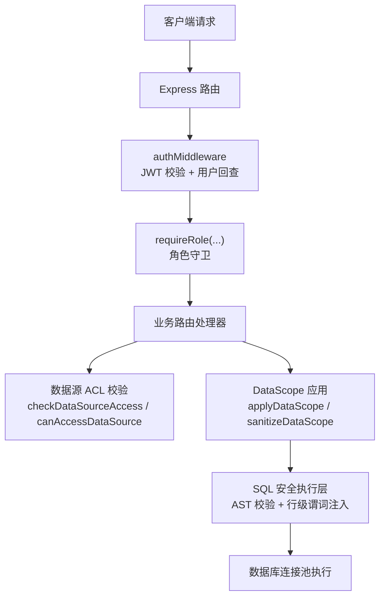
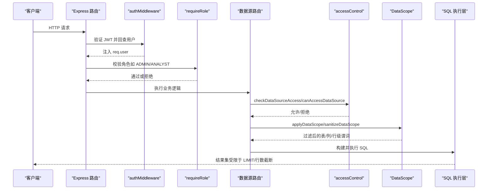
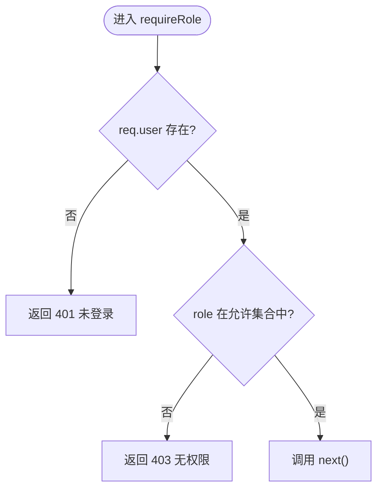
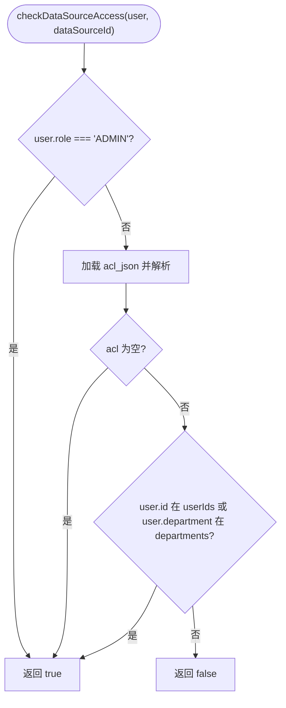
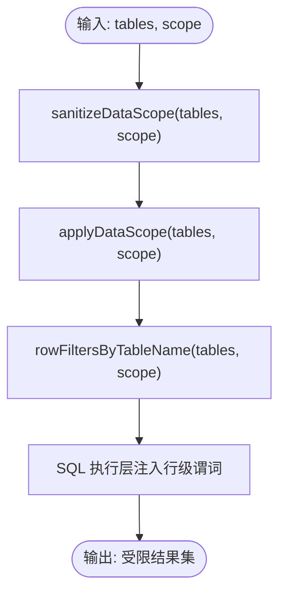
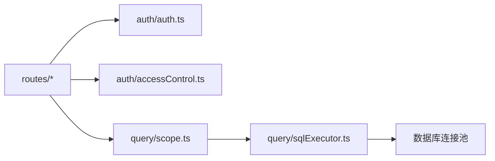

# RBAC权限控制

<cite>
**本文引用的文件**
- [server/auth/auth.ts](file://server/auth/auth.ts)
- [server/auth/accessControl.ts](file://server/auth/accessControl.ts)
- [server/routes/admin.ts](file://server/routes/admin.ts)
- [server/routes/datasources.ts](file://server/routes/datasources.ts)
- [server/query/scope.ts](file://server/query/scope.ts)
- [server/query/sqlExecutor.ts](file://server/query/sqlExecutor.ts)
</cite>

## 目录
1. [简介](#简介)
2. [项目结构](#项目结构)
3. [核心组件](#核心组件)
4. [架构总览](#架构总览)
5. [详细组件分析](#详细组件分析)
6. [依赖关系分析](#依赖关系分析)
7. [性能考量](#性能考量)
8. [故障排查指南](#故障排查指南)
9. [结论](#结论)
10. [附录](#附录)

## 简介
本文件面向“智能问数据分析系统”的基于角色的访问控制（RBAC）体系，系统性说明用户角色模型、权限定义与职责划分，以及资源级、操作级、数据级的权限控制实现。重点覆盖：
- 角色模型：ADMIN、ANALYST、VIEWER 的职责与权限边界
- requireRole 守卫函数：多角色检查、使用方式与扩展点
- 资源级权限：数据源 ACL（部门/个人白名单）与列表/详情可见性
- 操作级权限：路由级中间件组合（authMiddleware + requireRole）
- 数据级权限：DataScope（表/列/行级过滤）在查询执行层的强制注入
- 集成方式：如何在路由中接入鉴权与授权
- 最佳实践：权限矩阵、常见场景解决方案与自定义守卫开发指南

## 项目结构
RBAC 相关代码主要分布在以下模块：
- 认证与角色守卫：server/auth/auth.ts
- 数据源访问控制（ACL）：server/auth/accessControl.ts
- 管理员路由（仅 ADMIN）：server/routes/admin.ts
- 数据源路由（读写分离、ACL 校验）：server/routes/datasources.ts
- 数据范围（DataScope）与行级过滤：server/query/scope.ts
- SQL 安全执行层（结合 DataScope 注入行级谓词）：server/query/sqlExecutor.ts

图表来源
- [server/auth/auth.ts:67-126](file://server/auth/auth.ts#L67-L126)
- [server/auth/accessControl.ts:44-73](file://server/auth/accessControl.ts#L44-L73)
- [server/query/scope.ts:28-100](file://server/query/scope.ts#L28-L100)
- [server/query/sqlExecutor.ts:155-200](file://server/query/sqlExecutor.ts#L155-L200)

章节来源
- [server/auth/auth.ts:1-127](file://server/auth/auth.ts#L1-L127)
- [server/auth/accessControl.ts:1-108](file://server/auth/accessControl.ts#L1-L108)
- [server/routes/datasources.ts:1-200](file://server/routes/datasources.ts#L1-L200)
- [server/query/scope.ts:1-101](file://server/query/scope.ts#L1-L101)
- [server/query/sqlExecutor.ts:1-200](file://server/query/sqlExecutor.ts#L1-L200)

## 核心组件
- 认证与角色守卫（auth.ts）
  - 提供 authMiddleware：校验 JWT、回查用户状态、注入 req.user
  - 提供 requireRole：支持多角色守卫，未通过返回 401/403
- 数据源访问控制（accessControl.ts）
  - 解析/清洗 ACL（部门/个人白名单）
  - 判定用户是否可访问数据源（canAccessDataSource）
  - 服务端统一入口（checkDataSourceAccess），并支持审批并入个人授权（grantUserAccess）
- 数据范围（scope.ts）
  - 表/列/行级权限的结构化描述与清洗
  - 将 scope 应用到 schema 列表（applyDataScope）
  - 生成按真实表名映射的行级谓词（rowFiltersByTableName）
- SQL 安全执行层（sqlExecutor.ts）
  - 对 LLM 生成的 SQL 进行 AST 校验、关键字拒绝、只读限制等
  - 结合 DataScope 注入行级过滤谓词，确保数据级权限落地

章节来源
- [server/auth/auth.ts:13-126](file://server/auth/auth.ts#L13-L126)
- [server/auth/accessControl.ts:13-108](file://server/auth/accessControl.ts#L13-L108)
- [server/query/scope.ts:10-100](file://server/query/scope.ts#L10-L100)
- [server/query/sqlExecutor.ts:155-200](file://server/query/sqlExecutor.ts#L155-L200)

## 架构总览
下图展示从请求进入路由到最终执行 SQL 的完整鉴权与授权链路：

图表来源
- [server/auth/auth.ts:67-126](file://server/auth/auth.ts#L67-L126)
- [server/auth/accessControl.ts:44-73](file://server/auth/accessControl.ts#L44-L73)
- [server/query/scope.ts:28-100](file://server/query/scope.ts#L28-L100)
- [server/query/sqlExecutor.ts:155-200](file://server/query/sqlExecutor.ts#L155-L200)

## 详细组件分析

### 角色模型与职责划分
- 角色类型：ADMIN、ANALYST、VIEWER
- 职责与权限要点
  - ADMIN：全量管理权限（创建/更新/删除数据源、配置 ACL/Scope、环境配置、用户管理等）
  - ANALYST：分析与查询能力（读取 Schema、灵活查询、部分写操作如看板组件维护；需数据源 ACL 放行）
  - VIEWER：只读浏览（查看数据源列表摘要、受限查询；需数据源 ACL 放行）
- 继承机制
  - 当前实现为“集合包含”判断：requireRole('ADMIN','ANALYST') 表示任一匹配即通过
  - 无显式层级继承（如 ANALYST 不自动拥有 VIEWER 的全部能力），但可通过路由守卫组合实现“宽泛角色集合”

章节来源
- [server/auth/auth.ts:13-24](file://server/auth/auth.ts#L13-L24)
- [server/auth/auth.ts:115-126](file://server/auth/auth.ts#L115-L126)
- [server/routes/admin.ts:12-16](file://server/routes/admin.ts#L12-L16)
- [server/routes/datasources.ts:419-444](file://server/routes/datasources.ts#L419-L444)

### requireRole 守卫函数：原理与用法
- 原理
  - 前置 authMiddleware 已注入 req.user
  - requireRole(...roles) 检查 req.user.role 是否在传入角色集合中
  - 未登录返回 401，无权限返回 403
- 用法
  - 单角色：requireRole('ADMIN')
  - 多角色：requireRole('ADMIN', 'ANALYST')
  - 典型位置：路由级别中间件链（先 authMiddleware，再 requireRole）
- 扩展建议
  - 如需更细粒度（如按资源 ID 或操作类型），可在 requireRole 基础上封装自定义守卫（例如 requireResourceAction(resourceId, action)）

图表来源
- [server/auth/auth.ts:115-126](file://server/auth/auth.ts#L115-L126)

章节来源
- [server/auth/auth.ts:67-126](file://server/auth/auth.ts#L67-L126)

### 资源级权限控制（数据源 ACL）
- 模型
  - data_sources.acl_json = { departments: string[], userIds: number[] }
  - NULL 或两组皆空 → 不限制（全员可见）
  - 非空 → 仅 ADMIN / 清单内部门成员 / 清单内个人用户可访问
- 判定流程
  - ADMIN 短路放行
  - 若 acl 为空 → 不限制
  - 否则检查 userIds 或 department（去空白后匹配）
- 集成点
  - 数据源列表接口：非 ADMIN 且无 ACL 权限时，仅返回最小元信息并标记 accessDenied
  - 灵活 Schema 接口：需同时通过 requireRole('ADMIN','ANALYST') 与 checkDataSourceAccess

图表来源
- [server/auth/accessControl.ts:44-73](file://server/auth/accessControl.ts#L44-L73)

章节来源
- [server/auth/accessControl.ts:1-108](file://server/auth/accessControl.ts#L1-L108)
- [server/routes/datasources.ts:370-440](file://server/routes/datasources.ts#L370-L440)

### 操作级权限验证（路由级中间件）
- 模式
  - 所有路由统一挂载 authMiddleware
  - 敏感操作通过 requireRole 限定角色集合
- 示例
  - 管理员专属：router.use(authMiddleware, requireRole('ADMIN'))
  - 分析师可用：requireRole('ADMIN', 'ANALYST')
- 注意事项
  - 避免在业务逻辑中重复判断角色，统一由中间件集中处理
  - 对跨域或特殊路径（如 /api/auth/*）放行策略已在 authMiddleware 中处理

章节来源
- [server/routes/admin.ts:12-16](file://server/routes/admin.ts#L12-L16)
- [server/routes/datasources.ts:419-444](file://server/routes/datasources.ts#L419-L444)
- [server/auth/auth.ts:67-126](file://server/auth/auth.ts#L67-L126)

### 数据级权限过滤（DataScope 与行级谓词）
- 数据结构
  - tables：允许的表集合
  - columns[tableId]：允许的列集合
  - rowFilters[tableId]：行级过滤谓词（WHERE 片段）
- 清洗与应用
  - sanitizeDataScope：剔除不存在的表/列，校验行级谓词结构合法性
  - applyDataScope：根据 tables/columns 过滤 Schema 列表
  - rowFiltersByTableName：将 tableId 映射到真实表名，供执行层注入
- 执行层注入
  - SQL 安全执行层在 AST 校验通过后，按表名注入行级谓词，确保数据级权限生效

图表来源
- [server/query/scope.ts:17-100](file://server/query/scope.ts#L17-L100)
- [server/query/sqlExecutor.ts:155-200](file://server/query/sqlExecutor.ts#L155-L200)

章节来源
- [server/query/scope.ts:1-101](file://server/query/scope.ts#L1-L101)
- [server/query/sqlExecutor.ts:155-200](file://server/query/sqlExecutor.ts#L155-L200)

### 权限矩阵表
- 角色 vs 能力
  - ADMIN：数据源 CRUD、ACL/Scope 配置、环境配置、用户管理、审计
  - ANALYST：读取 Schema、灵活查询、看板组件维护（需数据源 ACL 放行）
  - VIEWER：数据源列表摘要、受限查询（需数据源 ACL 放行）
- 资源 vs 操作
  - 数据源列表：所有登录用户可读（非 ADMIN 无权限时仅返回最小信息）
  - 数据源 Schema：需 requireRole('ADMIN','ANALYST') 且通过 ACL
  - 数据源写入/测试连接：仅 ADMIN
  - 管理员功能：仅 ADMIN

章节来源
- [server/routes/admin.ts:12-16](file://server/routes/admin.ts#L12-L16)
- [server/routes/datasources.ts:370-444](file://server/routes/datasources.ts#L370-L444)

### 权限分配最佳实践
- 最小权限原则
  - 默认授予 VIEWER，按需提升为 ANALYST 或 ADMIN
- 组织维度授权
  - 优先使用 departments 白名单批量授权，减少个人授权维护成本
- 个人授权兜底
  - 针对临时需求，使用 grantUserAccess 并入个人授权，保持幂等
- 定期审计
  - 定期审查 ACL/Scope 配置，清理不再需要的授权
- 变更流程
  - 管理员修改角色/状态时，保证至少保留一个 ACTIVE 管理员

章节来源
- [server/auth/accessControl.ts:75-86](file://server/auth/accessControl.ts#L75-L86)
- [server/routes/admin.ts:116-133](file://server/routes/admin.ts#L116-L133)

### 常见权限场景与解决方案
- 场景：分析师无法查看某数据源 Schema
  - 检查 requireRole('ADMIN','ANALYST') 是否命中
  - 检查 checkDataSourceAccess 是否通过（ACL 是否包含该用户或其部门）
- 场景：普通用户能看到数据源但无法查询
  - 列表接口对非 ACL 用户仅返回最小信息；查询需额外 ACL 校验
- 场景：行级数据泄露风险
  - 确保 DataScope.rowFilters 正确配置并通过 sanitizeRowFilterPredicate 校验
  - 确认执行层已注入行级谓词
- 场景：管理员误删最后一个 ACTIVE 管理员
  - 路由层已保护：降级/禁用/删除前会校验剩余 ACTIVE 管理员数量

章节来源
- [server/routes/datasources.ts:419-440](file://server/routes/datasources.ts#L419-L440)
- [server/query/scope.ts:17-26](file://server/query/scope.ts#L17-L26)
- [server/routes/admin.ts:116-133](file://server/routes/admin.ts#L116-L133)

### 自定义权限守卫开发指南
- 基础思路
  - 在 requireRole 基础上封装更细粒度的守卫（如 requireResourceAction(resourceId, action)）
  - 复用 authMiddleware 提供的 req.user，结合业务上下文（resourceId、action）做决策
- 推荐步骤
  - 定义资源与动作枚举（如 DataSource.Read、DataSource.Write）
  - 实现守卫函数：校验角色 + 资源权限（可结合 ACL/Scope）
  - 在路由中组合使用：authMiddleware -> 自定义守卫 -> 业务处理器
- 注意事项
  - 保持幂等与可观测性（记录审计日志）
  - 避免在业务逻辑中散落权限判断，统一收敛至中间件层

[本节为概念性指导，不直接分析具体文件]

## 依赖关系分析
- 模块耦合
  - routes 依赖 auth 与 accessControl 完成鉴权与资源级授权
  - query/scope 与 query/sqlExecutor 协作实现数据级权限
- 外部依赖
  - JWT（jsonwebtoken）用于会话签发与校验
  - MySQL/PG 驱动用于数据源连接与执行
- 潜在循环依赖
  - 当前结构清晰，未见循环导入迹象

图表来源
- [server/routes/datasources.ts:1-200](file://server/routes/datasources.ts#L1-L200)
- [server/auth/auth.ts:1-127](file://server/auth/auth.ts#L1-L127)
- [server/auth/accessControl.ts:1-108](file://server/auth/accessControl.ts#L1-L108)
- [server/query/scope.ts:1-101](file://server/query/scope.ts#L1-L101)
- [server/query/sqlExecutor.ts:1-200](file://server/query/sqlExecutor.ts#L1-L200)

章节来源
- [server/routes/datasources.ts:1-200](file://server/routes/datasources.ts#L1-L200)
- [server/auth/auth.ts:1-127](file://server/auth/auth.ts#L1-L127)
- [server/auth/accessControl.ts:1-108](file://server/auth/accessControl.ts#L1-L108)
- [server/query/scope.ts:1-101](file://server/query/scope.ts#L1-L101)
- [server/query/sqlExecutor.ts:1-200](file://server/query/sqlExecutor.ts#L1-L200)

## 性能考量
- 连接池与超时
  - 数据源连接池容量按并发用户数推导，支持场景化配额（交互/分析链/导出）
  - 场景化超时：交互 15s、分析链 120s、导出 60s，防止长任务阻塞交互
- 行级谓词注入
  - 仅在 AST 校验通过后注入，避免无效计算
- 列表接口优化
  - 非 ACL 用户仅返回最小信息，减少不必要的数据传输

章节来源
- [server/query/sqlExecutor.ts:44-109](file://server/query/sqlExecutor.ts#L44-L109)
- [server/routes/datasources.ts:370-400](file://server/routes/datasources.ts#L370-L400)

## 故障排查指南
- 401 未登录/登录过期
  - 检查 JWT 是否有效、是否被篡改
  - 确认 authMiddleware 是否正确回查用户状态
- 403 无权限
  - 检查 requireRole 是否包含当前角色
  - 检查数据源 ACL 是否包含用户或其部门
  - 检查 DataScope 是否限制了表/列/行级访问
- 查询失败或结果异常
  - 检查 SQL 安全执行层是否拦截（关键字/语句类型）
  - 检查行级谓词是否合法且已注入
- 管理员操作受限
  - 检查是否尝试修改/删除自己或导致无 ACTIVE 管理员

章节来源
- [server/auth/auth.ts:67-126](file://server/auth/auth.ts#L67-L126)
- [server/auth/accessControl.ts:44-73](file://server/auth/accessControl.ts#L44-L73)
- [server/query/scope.ts:17-26](file://server/query/scope.ts#L17-L26)
- [server/query/sqlExecutor.ts:155-200](file://server/query/sqlExecutor.ts#L155-L200)

## 结论
本 RBAC 体系通过“角色守卫 + 资源 ACL + 数据 Scope + SQL 执行层注入”的多层防护，实现了从身份认证到资源与数据访问的全链路控制。建议在生产环境中：
- 严格遵循最小权限原则，合理分配角色与 ACL
- 定期审计权限配置，及时清理冗余授权
- 结合审计日志与监控，持续优化权限策略与性能

## 附录
- 关键函数与路径参考
  - 角色守卫：requireRole
    - [server/auth/auth.ts:115-126](file://server/auth/auth.ts#L115-L126)
  - 数据源 ACL 判定：canAccessDataSource / checkDataSourceAccess
    - [server/auth/accessControl.ts:44-73](file://server/auth/accessControl.ts#L44-L73)
  - 数据范围清洗与应用：sanitizeDataScope / applyDataScope / rowFiltersByTableName
    - [server/query/scope.ts:28-100](file://server/query/scope.ts#L28-L100)
  - SQL 安全执行与行级谓词注入
    - [server/query/sqlExecutor.ts:155-200](file://server/query/sqlExecutor.ts#L155-L200)
  - 管理员路由（仅 ADMIN）
    - [server/routes/admin.ts:12-16](file://server/routes/admin.ts#L12-L16)
  - 数据源路由（ACL 与 Schema 访问）
    - [server/routes/datasources.ts:370-444](file://server/routes/datasources.ts#L370-L444)