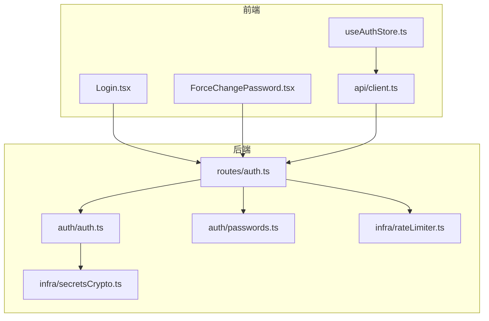
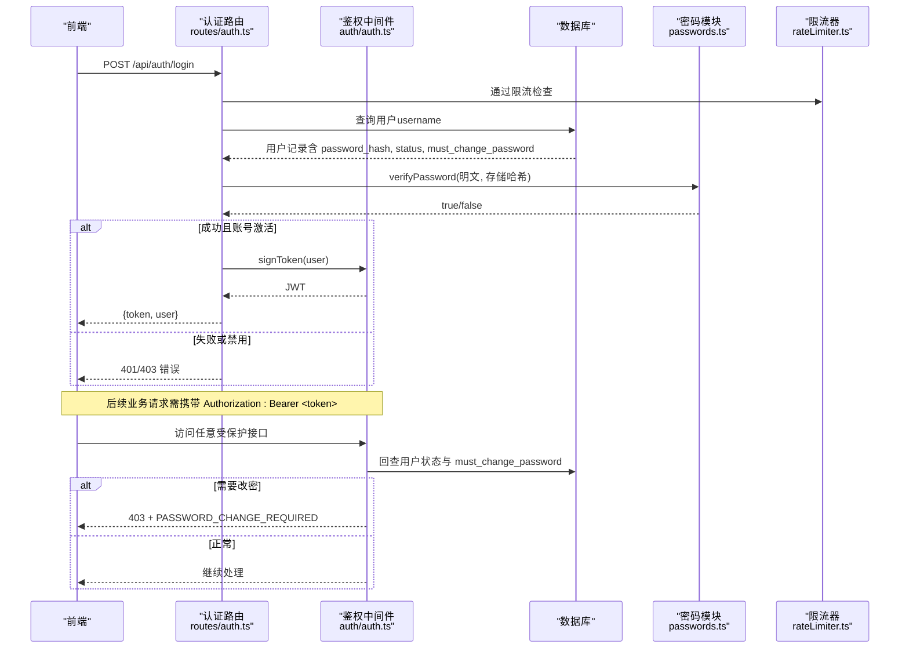
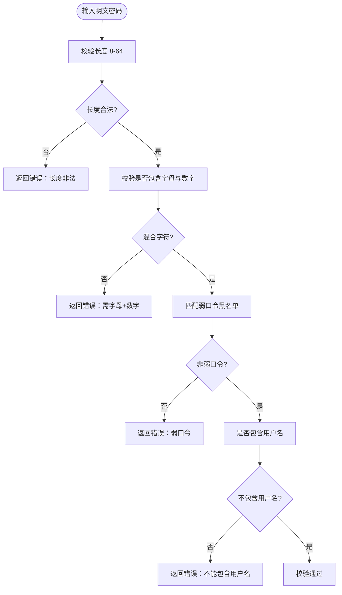
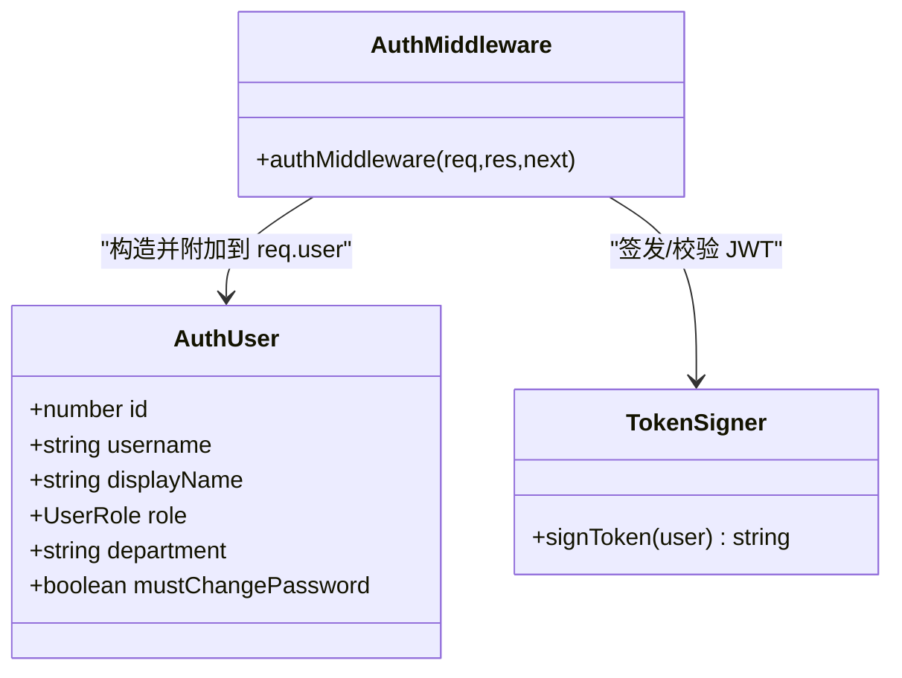
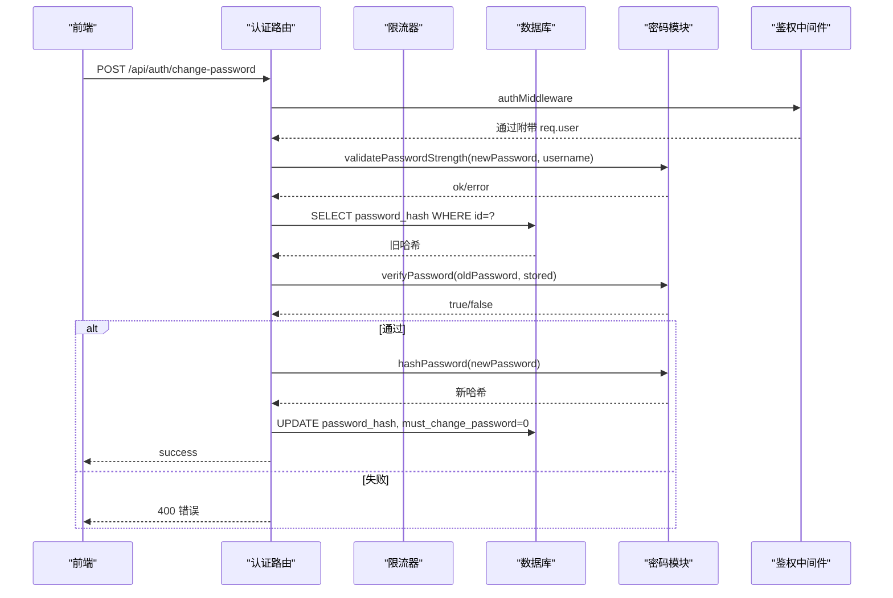
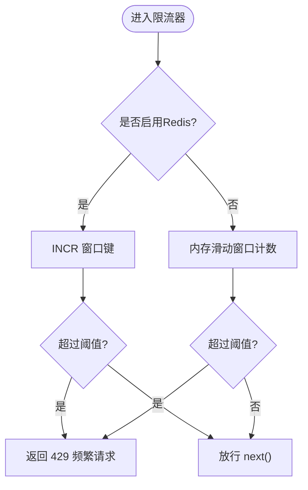
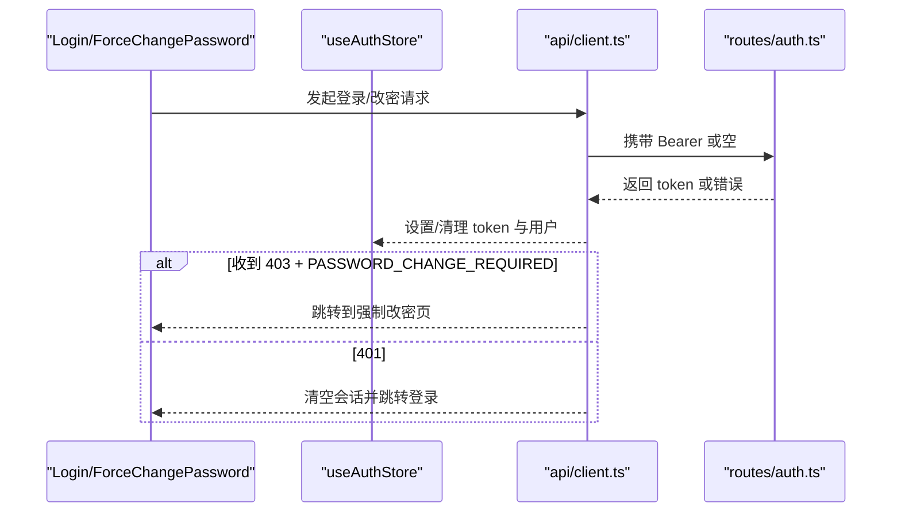
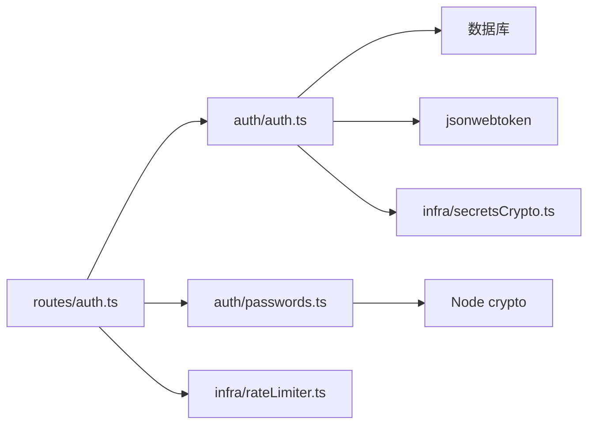

# 密码安全管理

<cite>
**本文引用的文件**
- [server/auth/passwords.ts](file://server/auth/passwords.ts)
- [server/auth/passwords.test.ts](file://server/auth/passwords.test.ts)
- [server/auth/auth.ts](file://server/auth/auth.ts)
- [server/routes/auth.ts](file://server/routes/auth.ts)
- [server/infra/rateLimiter.ts](file://server/infra/rateLimiter.ts)
- [server/infra/secretsCrypto.ts](file://server/infra/secretsCrypto.ts)
- [src/components/auth/Login.tsx](file://src/components/auth/Login.tsx)
- [src/components/auth/ForceChangePassword.tsx](file://src/components/auth/ForceChangePassword.tsx)
- [src/hooks/useAuthStore.ts](file://src/hooks/useAuthStore.ts)
- [src/api/client.ts](file://src/api/client.ts)
- [src/types/analytics.ts](file://src/types/analytics.ts)
</cite>

## 目录
1. [简介](#简介)
2. [项目结构](#项目结构)
3. [核心组件](#核心组件)
4. [架构总览](#架构总览)
5. [详细组件分析](#详细组件分析)
6. [依赖关系分析](#依赖关系分析)
7. [性能与安全考量](#性能与安全考量)
8. [故障排查指南](#故障排查指南)
9. [结论](#结论)
10. [附录：API 与集成](#附录api-与集成)

## 简介
本文件系统化梳理本项目的密码安全能力，覆盖密码加密存储算法、盐值与 pepper 策略、哈希计算流程；密码强度校验规则与弱口令检测；密码重置与首次登录强制改密、密码过期策略的实现现状；传输安全、防暴力破解与账户锁定机制；并提供密码管理 API 文档、前端集成示例与安全配置最佳实践。同时给出与外部身份系统（OIDC）的同步方案说明及迁移注意事项。

## 项目结构
围绕密码安全的核心代码分布在服务端认证模块、路由层、限流器、密钥工具以及前端登录与强制改密页面中：
- 服务端
  - 密码哈希与强度校验：server/auth/passwords.ts
  - JWT 签发/鉴权中间件与强制改密拦截：server/auth/auth.ts
  - 认证路由（登录、改密、OIDC）：server/routes/auth.ts
  - 请求限流（防暴力破解）：server/infra/rateLimiter.ts
  - 数据源凭据加密（AES-GCM）：server/infra/secretsCrypto.ts
- 前端
  - 登录页与企业统一登录入口：src/components/auth/Login.tsx
  - 首次登录强制改密页：src/components/auth/ForceChangePassword.tsx
  - 认证状态与令牌管理：src/hooks/useAuthStore.ts
  - 统一 API 客户端（自动注入 Bearer、处理 401/403）：src/api/client.ts
  - 用户类型定义（含 mustChangePassword）：src/types/analytics.ts

图表来源
- [server/routes/auth.ts:1-156](file://server/routes/auth.ts#L1-L156)
- [server/auth/auth.ts:1-127](file://server/auth/auth.ts#L1-L127)
- [server/auth/passwords.ts:1-100](file://server/auth/passwords.ts#L1-L100)
- [server/infra/rateLimiter.ts:1-54](file://server/infra/rateLimiter.ts#L1-L54)
- [server/infra/secretsCrypto.ts:1-50](file://server/infra/secretsCrypto.ts#L1-L50)
- [src/components/auth/Login.tsx:1-137](file://src/components/auth/Login.tsx#L1-L137)
- [src/components/auth/ForceChangePassword.tsx:1-138](file://src/components/auth/ForceChangePassword.tsx#L1-L138)
- [src/hooks/useAuthStore.ts:1-84](file://src/hooks/useAuthStore.ts#L1-L84)
- [src/api/client.ts:1-74](file://src/api/client.ts#L1-L74)

章节来源
- [server/auth/passwords.ts:1-100](file://server/auth/passwords.ts#L1-L100)
- [server/auth/auth.ts:1-127](file://server/auth/auth.ts#L1-L127)
- [server/routes/auth.ts:1-156](file://server/routes/auth.ts#L1-L156)
- [server/infra/rateLimiter.ts:1-54](file://server/infra/rateLimiter.ts#L1-L54)
- [server/infra/secretsCrypto.ts:1-50](file://server/infra/secretsCrypto.ts#L1-L50)
- [src/components/auth/Login.tsx:1-137](file://src/components/auth/Login.tsx#L1-L137)
- [src/components/auth/ForceChangePassword.tsx:1-138](file://src/components/auth/ForceChangePassword.tsx#L1-L138)
- [src/hooks/useAuthStore.ts:1-84](file://src/hooks/useAuthStore.ts#L1-L84)
- [src/api/client.ts:1-74](file://src/api/client.ts#L1-L74)

## 核心组件
- 密码哈希与强度校验
  - 使用 Node 内置 crypto.scrypt，参数 N=2^15、r=8、p=1，KEY_LEN=64，显式放宽 maxmem 以适配默认限制。
  - 支持新旧两种哈希格式：新格式为 7 段（包含 N、r、p、是否使用 pepper），旧格式 4 段兼容验证。
  - 可选 pepper（环境变量 SCRYPT_PEPPER），未配置时不启用，向后兼容。
  - 密码强度校验：长度 8-64 位、必须包含字母和数字、黑名单弱口令、禁止包含用户名。
- 认证与授权
  - 基于 JWT 签发与校验，鉴权中间件在每次请求回查 users 表，确保禁用/角色变更立即生效。
  - 强制改密：当 must_change_password 置位时，除 /api/auth/* 外，其他业务接口返回 403 并携带特定 code。
- 限流与防暴力破解
  - 登录等敏感接口挂载 rateLimiter，按 IP 滑动窗口计数，支持内存或 Redis 模式（多实例共享）。
- 数据源凭据加密
  - AES-256-GCM 落库加密，密钥由 DS_SECRET_KEY 或 JWT_SECRET 派生，提供加解密工具函数。

章节来源
- [server/auth/passwords.ts:1-100](file://server/auth/passwords.ts#L1-L100)
- [server/auth/passwords.test.ts:1-73](file://server/auth/passwords.test.ts#L1-L73)
- [server/auth/auth.ts:1-127](file://server/auth/auth.ts#L1-L127)
- [server/routes/auth.ts:1-156](file://server/routes/auth.ts#L1-L156)
- [server/infra/rateLimiter.ts:1-54](file://server/infra/rateLimiter.ts#L1-L54)
- [server/infra/secretsCrypto.ts:1-50](file://server/infra/secretsCrypto.ts#L1-L50)

## 架构总览
下图展示从前端到后端的完整认证与密码管理链路，包括限流、JWT、数据库回查与强制改密控制。

图表来源
- [server/routes/auth.ts:41-77](file://server/routes/auth.ts#L41-L77)
- [server/auth/auth.ts:66-113](file://server/auth/auth.ts#L66-L113)
- [server/auth/passwords.ts:58-99](file://server/auth/passwords.ts#L58-L99)
- [server/infra/rateLimiter.ts:14-42](file://server/infra/rateLimiter.ts#L14-L42)

## 详细组件分析

### 密码哈希与强度校验（passwords.ts）
- 算法与参数
  - scrypt(N=32768, r=8, p=1)，KEY_LEN=64，maxmem 放宽至 64MB。
  - 随机盐 randomBytes(16)。
  - pepper 可选：若配置 SCRYPT_PEPPER，则在哈希前拼接 pepper，并在哈希串中标记 usedPepper。
- 新旧格式兼容
  - 新格式：scrypt$N$r$p$P$salt$hash（7 段）。
  - 旧格式：scrypt$N$salt$hash（4 段，隐含 r=8/p=1，无 pepper）。
- 强度校验规则
  - 长度 8-64 位。
  - 必须同时包含字母与数字。
  - 常见弱口令黑名单拦截。
  - 禁止包含用户名（大小写不敏感）。

图表来源
- [server/auth/passwords.ts:34-48](file://server/auth/passwords.ts#L34-L48)

章节来源
- [server/auth/passwords.ts:1-100](file://server/auth/passwords.ts#L1-L100)
- [server/auth/passwords.test.ts:1-73](file://server/auth/passwords.test.ts#L1-L73)

### 认证与授权（auth.ts）
- JWT 签发
  - 载荷包含 sub、username、role；有效期由环境变量控制；生产建议固定强密钥。
- 鉴权中间件
  - 解析 Authorization 头，校验 JWT。
  - 回查 users 表确认账号状态与 must_change_password。
  - 强制改密：must_change_password 为真且访问非 /api/auth/* 路径时，返回 403 与特定 code。
- 角色守卫
  - requireRole 用于按角色限制接口访问。

图表来源
- [server/auth/auth.ts:15-24](file://server/auth/auth.ts#L15-L24)
- [server/auth/auth.ts:60-64](file://server/auth/auth.ts#L60-L64)
- [server/auth/auth.ts:66-113](file://server/auth/auth.ts#L66-L113)

章节来源
- [server/auth/auth.ts:1-127](file://server/auth/auth.ts#L1-L127)

### 认证路由（routes/auth.ts）
- 登录
  - 限流保护；查询用户；统一错误文案；更新最后登录时间；签发 JWT。
- 修改密码
  - 鉴权；强度校验；验证原密码；禁止与新密码相同；写入新哈希并清除 must_change_password。
- OIDC
  - 状态查询、授权跳转、回调换取本地 JWT 并重定向回前端。

图表来源
- [server/routes/auth.ts:84-114](file://server/routes/auth.ts#L84-L114)
- [server/auth/passwords.ts:34-56](file://server/auth/passwords.ts#L34-L56)
- [server/auth/passwords.ts:58-99](file://server/auth/passwords.ts#L58-L99)

章节来源
- [server/routes/auth.ts:1-156](file://server/routes/auth.ts#L1-L156)

### 限流与防暴力破解（rateLimiter.ts）
- 按 IP 滑动窗口计数，默认 60 秒窗口内最多 30 次（可配置 RATE_LIMIT_MAX）。
- 支持内存模式与 Redis 模式（多实例共享计数）。
- 登录与 OIDC 相关接口均挂载限流。

图表来源
- [server/infra/rateLimiter.ts:14-42](file://server/infra/rateLimiter.ts#L14-L42)

章节来源
- [server/infra/rateLimiter.ts:1-54](file://server/infra/rateLimiter.ts#L1-L54)

### 数据源凭据加密（secretsCrypto.ts）
- 使用 AES-256-GCM 对数据源连接密码进行落库加密，密文带 IV 与认证标签。
- 密钥来源优先级：DS_SECRET_KEY > JWT_SECRET；缺失时在开发环境降级提示。
- 提供幂等的加密/解密与配置对象密码字段加密方法。

章节来源
- [server/infra/secretsCrypto.ts:1-50](file://server/infra/secretsCrypto.ts#L1-L50)

### 前端集成（Login 与 ForceChangePassword）
- 登录页
  - 调用 /api/auth/login 获取 token 与用户信息。
  - 动态显示企业统一登录入口（根据 /api/auth/oidc/status）。
- 强制改密页
  - 仅在 must_change_password 为真时出现；提交 /api/auth/change-password 完成改密。
  - 成功后清除 mustChangePassword 标记，允许进入系统。
- 认证状态与 API 客户端
  - useAuthStore 管理 token、用户与会话生命周期。
  - apiFetch 自动注入 Authorization，处理 401 与 403（PASSWORD_CHANGE_REQUIRED）并触发对应 UI 行为。

图表来源
- [src/components/auth/Login.tsx:27-40](file://src/components/auth/Login.tsx#L27-L40)
- [src/components/auth/ForceChangePassword.tsx:23-42](file://src/components/auth/ForceChangePassword.tsx#L23-L42)
- [src/hooks/useAuthStore.ts:26-52](file://src/hooks/useAuthStore.ts#L26-L52)
- [src/api/client.ts:48-73](file://src/api/client.ts#L48-L73)
- [server/routes/auth.ts:41-77](file://server/routes/auth.ts#L41-L77)

章节来源
- [src/components/auth/Login.tsx:1-137](file://src/components/auth/Login.tsx#L1-L137)
- [src/components/auth/ForceChangePassword.tsx:1-138](file://src/components/auth/ForceChangePassword.tsx#L1-L138)
- [src/hooks/useAuthStore.ts:1-84](file://src/hooks/useAuthStore.ts#L1-L84)
- [src/api/client.ts:1-74](file://src/api/client.ts#L1-L74)

## 依赖关系分析
- 模块耦合
  - routes/auth.ts 依赖 auth/auth.ts、auth/passwords.ts、infra/rateLimiter.ts。
  - auth/auth.ts 依赖数据库连接池与 JWT 库，并读取环境变量。
  - passwords.ts 仅依赖 Node 内置 crypto，零外部依赖。
  - secretsCrypto.ts 被鉴权模块间接使用（如数据源凭据），与密码模块解耦。
- 外部依赖
  - JSON Web Token（jsonwebtoken）、MySQL 驱动（mysql2/promise）。
  - 可选 Redis（stateStore）用于多实例限流。

图表来源
- [server/routes/auth.ts:1-20](file://server/routes/auth.ts#L1-L20)
- [server/auth/auth.ts:1-12](file://server/auth/auth.ts#L1-L12)
- [server/auth/passwords.ts:1-8](file://server/auth/passwords.ts#L1-L8)
- [server/infra/rateLimiter.ts:1-8](file://server/infra/rateLimiter.ts#L1-L8)
- [server/infra/secretsCrypto.ts:1-8](file://server/infra/secretsCrypto.ts#L1-L8)

章节来源
- [server/routes/auth.ts:1-156](file://server/routes/auth.ts#L1-L156)
- [server/auth/auth.ts:1-127](file://server/auth/auth.ts#L1-L127)
- [server/auth/passwords.ts:1-100](file://server/auth/passwords.ts#L1-L100)
- [server/infra/rateLimiter.ts:1-54](file://server/infra/rateLimiter.ts#L1-L54)
- [server/infra/secretsCrypto.ts:1-50](file://server/infra/secretsCrypto.ts#L1-L50)

## 性能与安全考量
- 哈希性能
  - scrypt 参数 N=2^15、r=8、p=1，单次哈希约 80ms，兼顾安全性与可用性。
  - 显式放宽 maxmem 以避免默认限制导致异常。
- 安全加固
  - 可选 pepper（SCRYPT_PEPPER）与数据库隔离，降低拖库离线爆破风险。
  - 登录接口限流，防止暴力破解；多实例部署建议使用 Redis 模式。
  - JWT 密钥生产环境必须配置固定强密钥，避免进程级临时密钥泄露。
  - 强制改密：首登或管理员重置后，必须修改密码方可访问业务接口。
- 传输安全
  - 所有 API 通过 HTTPS 传输；前端统一通过 apiFetch 注入 Authorization。
- 账户锁定
  - 当前实现未包含基于失败次数的账户锁定；可通过扩展 rateLimiter 或引入独立计数器实现。

[本节为通用指导，无需具体文件引用]

## 故障排查指南
- 登录失败
  - 检查用户名/密码是否正确；确认账号状态为 ACTIVE；查看限流是否触发 429。
- 强制改密拦截
  - 若收到 403 且 code 为 PASSWORD_CHANGE_REQUIRED，请前往强制改密页完成改密。
- 哈希验证失败
  - 检查存储哈希格式是否为 scrypt 开头；确认 salt/hash 段非空；若使用了 pepper，请确保环境变量一致。
- 数据源凭据解密失败
  - 检查 DS_SECRET_KEY/JWT_SECRET 是否一致；确认密文格式为 enc:v1:...。

章节来源
- [server/routes/auth.ts:41-77](file://server/routes/auth.ts#L41-L77)
- [server/auth/auth.ts:66-113](file://server/auth/auth.ts#L66-L113)
- [server/auth/passwords.ts:58-99](file://server/auth/passwords.ts#L58-L99)
- [server/infra/secretsCrypto.ts:27-43](file://server/infra/secretsCrypto.ts#L27-L43)

## 结论
本项目采用 scrypt 作为密码哈希算法，配合随机盐与可选 pepper，实现了高安全性的密码存储；通过统一的强度校验与弱口令黑名单，有效降低弱密码风险；结合 JWT 鉴权与强制改密机制，保障首登与重置后的安全性；限流器提供基础防暴力破解能力；前端与后端协作良好，具备可扩展性。建议在多实例环境中启用 Redis 限流，并为生产环境配置固定强密钥与合适的超时策略。

[本节为总结，无需具体文件引用]

## 附录：API 与集成

### 密码管理 API
- 登录
  - 方法：POST
  - 路径：/api/auth/login
  - 请求体：{ username, password }
  - 响应：{ success, token, user }
  - 说明：受限流保护；统一错误文案；更新最后登录时间。
- 当前用户
  - 方法：GET
  - 路径：/api/auth/me
  - 头部：Authorization: Bearer <token>
  - 响应：{ success, user }
- 修改密码
  - 方法：POST
  - 路径：/api/auth/change-password
  - 头部：Authorization: Bearer <token>
  - 请求体：{ oldPassword, newPassword }
  - 响应：{ success }
  - 说明：强度校验；禁止与原密码相同；成功后清除 must_change_password。
- OIDC 状态
  - 方法：GET
  - 路径：/api/auth/oidc/status
  - 响应：{ enabled }
- OIDC 登录
  - 方法：GET
  - 路径：/api/auth/oidc/login
  - 说明：重定向到 IdP 授权页（受限流保护）。
- OIDC 回调
  - 方法：GET
  - 路径：/api/auth/oidc/callback?code=&state=
  - 说明：校验 state、换 token、拉取 userinfo、JIT 建号/同步、签发本地 JWT 并重定向回前端。

章节来源
- [server/routes/auth.ts:41-156](file://server/routes/auth.ts#L41-L156)

### 前端集成要点
- 登录流程
  - 调用 /api/auth/login，保存 token 与用户信息；根据 mustChangePassword 决定是否进入强制改密页。
- 强制改密
  - 调用 /api/auth/change-password，成功后清除 mustChangePassword 标记。
- 统一 API 客户端
  - 自动注入 Authorization；处理 401 与 403（PASSWORD_CHANGE_REQUIRED）并触发相应 UI 行为。

章节来源
- [src/components/auth/Login.tsx:27-40](file://src/components/auth/Login.tsx#L27-L40)
- [src/components/auth/ForceChangePassword.tsx:23-42](file://src/components/auth/ForceChangePassword.tsx#L23-L42)
- [src/hooks/useAuthStore.ts:26-52](file://src/hooks/useAuthStore.ts#L26-L52)
- [src/api/client.ts:48-73](file://src/api/client.ts#L48-L73)

### 安全配置最佳实践
- 环境变量
  - JWT_SECRET：生产环境必须配置固定强密钥。
  - JWT_EXPIRES_IN：合理设置令牌有效期。
  - SCRYPT_PEPPER：建议配置，提升离线爆破成本。
  - RATE_LIMIT_MAX：根据业务调整限流阈值。
  - REDIS_URL：多实例部署时启用 Redis 模式限流。
  - DS_SECRET_KEY：优先于 JWT_SECRET 用于数据源凭据加密。
- 部署建议
  - 全站 HTTPS；最小权限原则；定期轮换密钥；监控登录失败与限流命中情况。

章节来源
- [server/auth/auth.ts:46-58](file://server/auth/auth.ts#L46-L58)
- [server/auth/passwords.ts:9-16](file://server/auth/passwords.ts#L9-L16)
- [server/infra/rateLimiter.ts:9-12](file://server/infra/rateLimiter.ts#L9-L12)
- [server/infra/secretsCrypto.ts:11-21](file://server/infra/secretsCrypto.ts#L11-L21)

### 与外部身份系统的密码同步与迁移
- OIDC 同步
  - 通过 /api/auth/oidc/callback 完成授权码流程，服务端执行 JIT 建号/同步并签发本地 JWT，前端据此完成登录。
- 迁移与兼容
  - 密码哈希兼容旧 4 段格式，便于历史数据迁移；新哈希采用 7 段格式并显式记录参数。
  - 数据源凭据支持明文存量读取与就地加密，迁移期兼容。

章节来源
- [server/routes/auth.ts:116-156](file://server/routes/auth.ts#L116-L156)
- [server/auth/passwords.ts:58-99](file://server/auth/passwords.ts#L58-L99)
- [server/infra/secretsCrypto.ts:27-43](file://server/infra/secretsCrypto.ts#L27-L43)