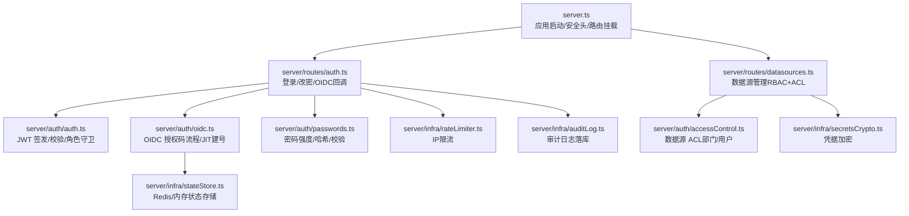
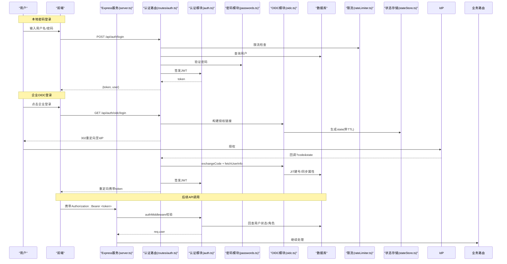
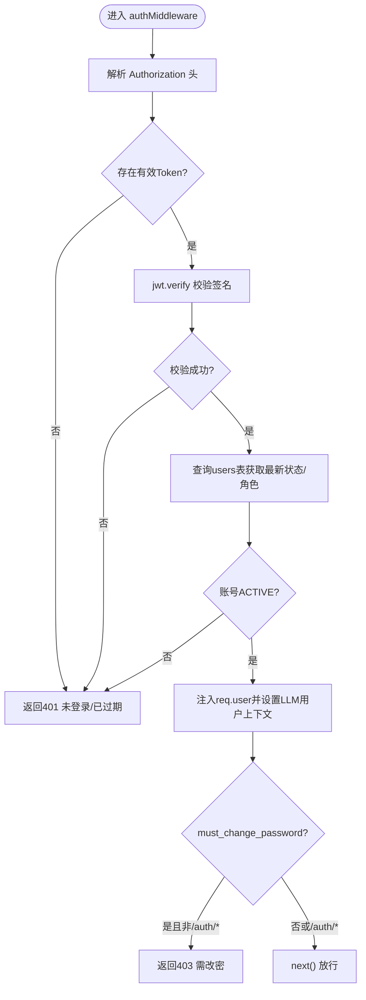
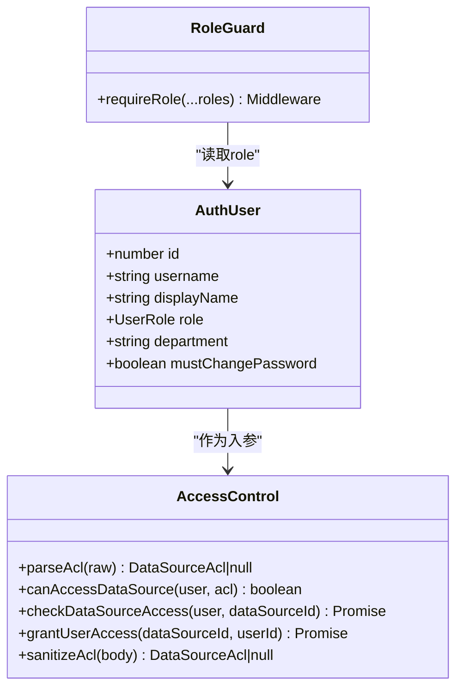
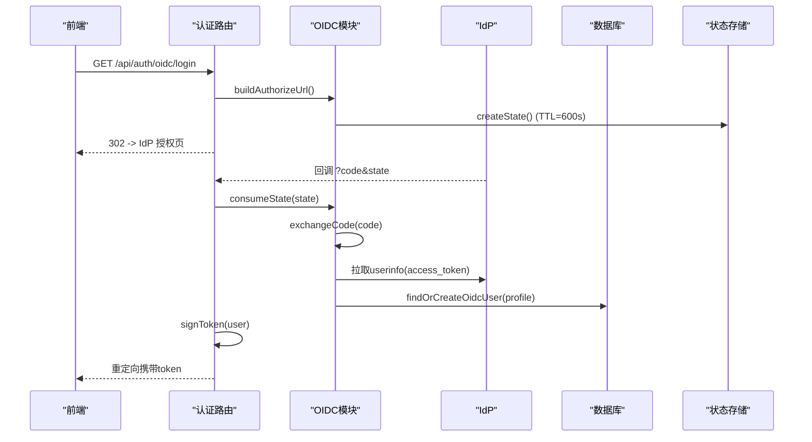
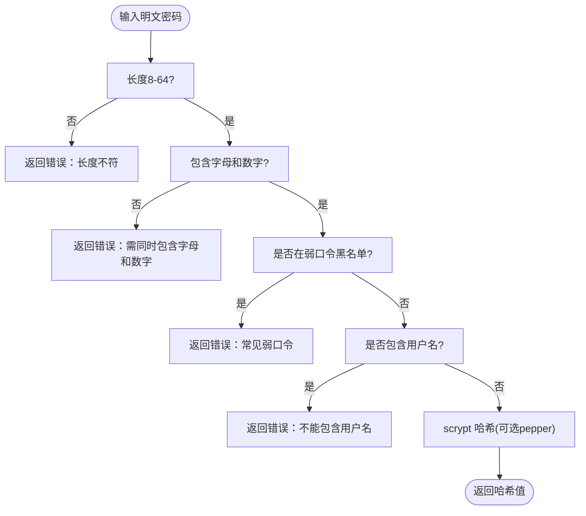
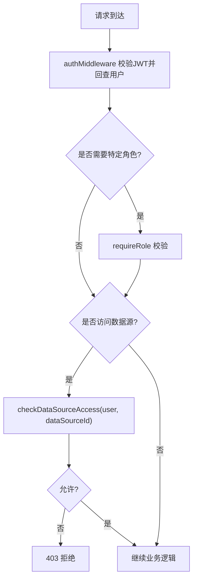
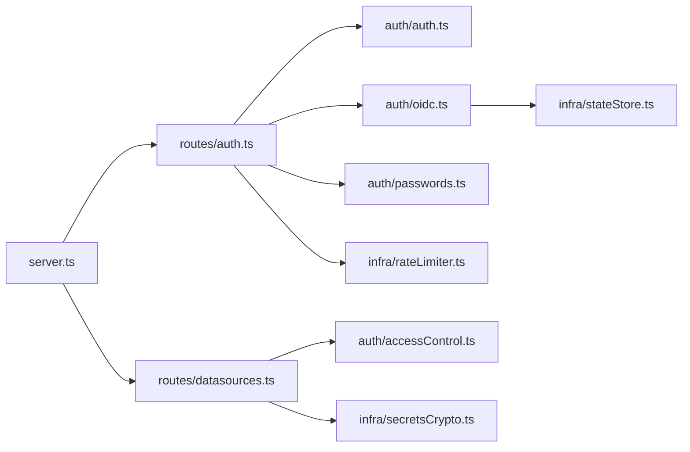

# 认证授权机制

<cite>
**本文引用的文件**
- [server.ts](file://server.ts)
- [server/auth/auth.ts](file://server/auth/auth.ts)
- [server/routes/auth.ts](file://server/routes/auth.ts)
- [server/auth/oidc.ts](file://server/auth/oidc.ts)
- [server/auth/passwords.ts](file://server/auth/passwords.ts)
- [server/auth/accessControl.ts](file://server/auth/accessControl.ts)
- [server/routes/datasources.ts](file://server/routes/datasources.ts)
- [server/infra/rateLimiter.ts](file://server/infra/rateLimiter.ts)
- [server/infra/stateStore.ts](file://server/infra/stateStore.ts)
- [server/infra/secretsCrypto.ts](file://server/infra/secretsCrypto.ts)
- [server/infra/auditLog.ts](file://server/infra/auditLog.ts)
</cite>

## 目录
1. [简介](#简介)
2. [项目结构](#项目结构)
3. [核心组件](#核心组件)
4. [架构总览](#架构总览)
5. [详细组件分析](#详细组件分析)
6. [依赖关系分析](#依赖关系分析)
7. [性能与安全考量](#性能与安全考量)
8. [故障排查指南](#故障排查指南)
9. [结论](#结论)
10. [附录](#附录)

## 简介
本文件面向“智能问数据分析系统”的认证与授权机制，覆盖以下主题：
- JWT 令牌签发与校验、会话管理策略
- RBAC 角色权限模型与资源访问控制
- OIDC 企业统一身份认证集成（授权码流程 + JIT 建号）
- 密码加密存储、多因素认证扩展点、会话安全策略
- 权限检查中间件、数据级权限控制、操作审计日志
- 认证扩展开发、第三方集成与安全加固最佳实践

## 项目结构
认证授权相关代码主要分布在 server/auth、server/routes/auth、server/infra 等模块中，并通过 Express 路由与中间件串联。关键入口在 server.ts 中完成应用初始化、安全头设置、路由挂载与生产环境密钥强制校验。

图表来源
- [server.ts:82-183](file://server.ts#L82-L183)
- [server/routes/auth.ts:41-153](file://server/routes/auth.ts#L41-L153)
- [server/auth/auth.ts:60-126](file://server/auth/auth.ts#L60-L126)
- [server/auth/oidc.ts:41-243](file://server/auth/oidc.ts#L41-L243)
- [server/auth/passwords.ts:34-99](file://server/auth/passwords.ts#L34-L99)
- [server/auth/accessControl.ts:18-73](file://server/auth/accessControl.ts#L18-L73)
- [server/infra/rateLimiter.ts:14-42](file://server/infra/rateLimiter.ts#L14-L42)
- [server/infra/stateStore.ts:169-218](file://server/infra/stateStore.ts#L169-L218)
- [server/infra/secretsCrypto.ts:27-43](file://server/infra/secretsCrypto.ts#L27-L43)
- [server/infra/auditLog.ts:38-61](file://server/infra/auditLog.ts#L38-L61)

章节来源
- [server.ts:82-183](file://server.ts#L82-L183)

## 核心组件
- JWT 认证与角色守卫：负责令牌签发、校验、回查用户状态并注入请求上下文；提供 requireRole 角色守卫。
- 密码安全：基于 scrypt 的密码哈希与强度校验，支持 pepper 与环境密钥派生。
- OIDC 集成：授权码流程、state 防 CSRF、token 交换、userinfo 拉取、JIT 建号与属性同步。
- 数据源访问控制（ACL）：按部门与用户维度限制数据源可见性，与管理员豁免。
- 限流与状态存储：按 IP 滑动窗口或 Redis 固定窗口限流；Redis/内存状态存储抽象用于 state、缓存、锁等。
- 审计日志：对成功、降级、错误与被拒绝的请求进行落库记录。

章节来源
- [server/auth/auth.ts:60-126](file://server/auth/auth.ts#L60-L126)
- [server/auth/passwords.ts:34-99](file://server/auth/passwords.ts#L34-L99)
- [server/auth/oidc.ts:41-243](file://server/auth/oidc.ts#L41-L243)
- [server/auth/accessControl.ts:18-73](file://server/auth/accessControl.ts#L18-L73)
- [server/infra/rateLimiter.ts:14-42](file://server/infra/rateLimiter.ts#L14-L42)
- [server/infra/stateStore.ts:169-218](file://server/infra/stateStore.ts#L169-L218)
- [server/infra/auditLog.ts:38-61](file://server/infra/auditLog.ts#L38-L61)

## 架构总览
下图展示从浏览器到后端的认证授权主链路，包括本地密码登录与企业 OIDC 登录两条路径，以及鉴权后的资源访问控制。

图表来源
- [server.ts:82-183](file://server.ts#L82-L183)
- [server/routes/auth.ts:41-153](file://server/routes/auth.ts#L41-L153)
- [server/auth/auth.ts:60-126](file://server/auth/auth.ts#L60-L126)
- [server/auth/oidc.ts:129-243](file://server/auth/oidc.ts#L129-L243)
- [server/auth/passwords.ts:50-99](file://server/auth/passwords.ts#L50-L99)
- [server/infra/rateLimiter.ts:14-42](file://server/infra/rateLimiter.ts#L14-L42)
- [server/infra/stateStore.ts:169-218](file://server/infra/stateStore.ts#L169-L218)

## 详细组件分析

### JWT 认证与会话管理
- 令牌签发：使用 jwt.sign 将用户标识、用户名、角色写入载荷，结合环境变量配置的过期时间签发。
- 令牌校验：authMiddleware 解析 Authorization 头中的 Bearer Token，验证签名后回查 users 表确认账号状态与最新角色，并将用户信息注入 req.user。
- 强制改密：若 must_change_password 为真，除 /api/auth/* 外禁止访问其他接口，确保首登或重置密码后立即修改。
- 会话策略：无服务端会话存储，采用无状态 JWT；通过短过期时间与强制改密策略降低风险。

图表来源
- [server/auth/auth.ts:66-113](file://server/auth/auth.ts#L66-L113)

章节来源
- [server/auth/auth.ts:60-126](file://server/auth/auth.ts#L60-L126)

### RBAC 权限模型与资源访问控制
- 角色定义：ADMIN、ANALYST、VIEWER。
- 角色守卫：requireRole(...roles) 在路由层校验当前用户是否具备所需角色，否则返回 403。
- 数据源 ACL：data_sources.acl_json 支持 departments 与 userIds 白名单；管理员豁免；未配置视为不限制。
- 数据级权限：ACL 决定能否访问某数据源；与 DataScope（表/列/行级圈定）正交，后者进一步约束可用范围。

图表来源
- [server/auth/accessControl.ts:18-73](file://server/auth/accessControl.ts#L18-L73)
- [server/auth/auth.ts:115-126](file://server/auth/auth.ts#L115-L126)

章节来源
- [server/auth/accessControl.ts:18-73](file://server/auth/accessControl.ts#L18-L73)
- [server/auth/auth.ts:115-126](file://server/auth/auth.ts#L115-L126)
- [server/routes/datasources.ts:62-89](file://server/routes/datasources.ts#L62-L89)

### OIDC 企业登录集成
- 发现端点：/.well-known/openid-configuration 获取授权/令牌/userinfo 端点，带缓存。
- 授权流程：生成一次性 state（内存或 Redis），302 跳转 IdP；回调时校验 state，换取 access_token，拉取 userinfo。
- JIT 建号：按规范化用户名匹配本地账号；不存在则创建（随机密码占位，禁用本地密码登录），默认角色可配。
- 安全要点：state TTL 10 分钟；失败走 fail-closed；多实例共享 state 通过 Redis。

图表来源
- [server/routes/auth.ts:116-153](file://server/routes/auth.ts#L116-L153)
- [server/auth/oidc.ts:129-243](file://server/auth/oidc.ts#L129-L243)
- [server/infra/stateStore.ts:169-218](file://server/infra/stateStore.ts#L169-L218)

章节来源
- [server/routes/auth.ts:116-153](file://server/routes/auth.ts#L116-L153)
- [server/auth/oidc.ts:41-243](file://server/auth/oidc.ts#L41-L243)

### 密码加密存储与强度校验
- 强度校验：长度 8-64，必须包含字母与数字，黑名单弱口令，不能包含用户名。
- 哈希算法：scrypt（N=2^15, r=8, p=1），可选 pepper（SCRYPT_PEPPER），兼容旧格式。
- 存储格式：新格式含 N/r/p/P/salt/hash；旧格式向后兼容。
- 安全建议：生产务必配置 SCRYPT_PEPPER 与 JWT_SECRET，避免离线爆破与伪造令牌。

图表来源
- [server/auth/passwords.ts:34-99](file://server/auth/passwords.ts#L34-L99)

章节来源
- [server/auth/passwords.ts:34-99](file://server/auth/passwords.ts#L34-L99)

### 权限检查中间件与数据级权限控制
- 全局鉴权：authMiddleware 对所有受保护接口生效，校验 JWT 并回查用户状态。
- 角色守卫：requireRole 在路由级别限定 ADMIN/ANALYST/VIEWER。
- 数据源 ACL：在数据源相关路由中调用 checkDataSourceAccess/canAccessDataSource，结合部门与用户白名单控制访问。
- 数据范围（DataScope）：与 ACL 正交，进一步限制可用表/列/行。

图表来源
- [server/auth/auth.ts:66-126](file://server/auth/auth.ts#L66-L126)
- [server/auth/accessControl.ts:43-73](file://server/auth/accessControl.ts#L43-L73)
- [server/routes/datasources.ts:62-89](file://server/routes/datasources.ts#L62-L89)

章节来源
- [server/auth/auth.ts:66-126](file://server/auth/auth.ts#L66-L126)
- [server/auth/accessControl.ts:43-73](file://server/auth/accessControl.ts#L43-L73)
- [server/routes/datasources.ts:62-89](file://server/routes/datasources.ts#L62-L89)

### 操作审计日志
- 审计范围：成功、缓存命中、降级、错误、澄清、拒绝（输入/权限/频率/开关）、排队等。
- 落库策略：异步写入 query_audit_log，失败仅告警不阻塞主流程。
- 指标埋点：Prometheus 旁路埋点，不影响可用性。

章节来源
- [server/infra/auditLog.ts:38-61](file://server/infra/auditLog.ts#L38-L61)

## 依赖关系分析
- server.ts 负责应用启动、安全响应头、路由挂载与生产环境密钥强制检查。
- routes/auth.ts 聚合认证能力：本地登录、改密、OIDC 回调，并接入限流器。
- auth/auth.ts 提供 JWT 与角色守卫，被各路由复用。
- auth/oidc.ts 依赖 stateStore 实现跨实例 state 共享与过期清理。
- auth/accessControl.ts 与 datasources 路由协作实现数据源 ACL。
- infra/secretsCrypto.ts 为数据源凭据提供 AES-GCM 加密。

图表来源
- [server.ts:82-183](file://server.ts#L82-L183)
- [server/routes/auth.ts:41-153](file://server/routes/auth.ts#L41-L153)
- [server/routes/datasources.ts:62-89](file://server/routes/datasources.ts#L62-L89)
- [server/auth/auth.ts:60-126](file://server/auth/auth.ts#L60-L126)
- [server/auth/oidc.ts:41-243](file://server/auth/oidc.ts#L41-L243)
- [server/auth/passwords.ts:34-99](file://server/auth/passwords.ts#L34-L99)
- [server/auth/accessControl.ts:18-73](file://server/auth/accessControl.ts#L18-L73)
- [server/infra/rateLimiter.ts:14-42](file://server/infra/rateLimiter.ts#L14-L42)
- [server/infra/stateStore.ts:169-218](file://server/infra/stateStore.ts#L169-L218)
- [server/infra/secretsCrypto.ts:27-43](file://server/infra/secretsCrypto.ts#L27-L43)

章节来源
- [server.ts:82-183](file://server.ts#L82-L183)

## 性能与安全考量
- 性能
  - 无状态 JWT：减少服务端会话存储压力，适合水平扩展。
  - OIDC 端点发现缓存：避免每次登录都回源 IdP。
  - 限流器：内存滑动窗口或 Redis 固定窗口，防止暴力破解与滥用。
  - 审计日志：异步写入，失败不阻塞主流程。
- 安全
  - 生产强制 JWT_SECRET：缺失直接拒绝启动，防止伪造令牌。
  - 密码强度与弱口令拦截：注册/改密/重置统一校验。
  - scrypt 参数调优：N=2^15 提升离线破解成本；可选 pepper 增加额外安全层。
  - 数据源凭据加密：AES-256-GCM 落库，防止拖库泄露。
  - 强制改密：首登或重置后限制访问直至改密完成。
  - CSP/安全头：生产启用 HSTS、严格 CSP 等。

章节来源
- [server.ts:91-96](file://server.ts#L91-L96)
- [server/auth/passwords.ts:34-99](file://server/auth/passwords.ts#L34-L99)
- [server/infra/rateLimiter.ts:14-42](file://server/infra/rateLimiter.ts#L14-L42)
- [server/infra/secretsCrypto.ts:27-43](file://server/infra/secretsCrypto.ts#L27-L43)
- [server/auth/auth.ts:104-107](file://server/auth/auth.ts#L104-L107)

## 故障排查指南
- 登录失败
  - 检查用户名/密码是否正确，确认账号状态为 ACTIVE。
  - 查看限流器是否触发 429。
  - 检查数据库连接与用户表字段。
- OIDC 登录失败
  - 确认 OIDC_ISSUER、OIDC_CLIENT_ID 已配置且网络可达。
  - 检查 state 是否过期或被重复消费（Redis/内存）。
  - 查看 token 交换与 userinfo 拉取的网络错误。
- 权限不足
  - 确认用户角色是否满足 requireRole 要求。
  - 检查数据源 ACL 是否限制了该用户或部门。
- 审计日志未写入
  - 关注异步写入失败告警，确认数据库连接与表结构。

章节来源
- [server/routes/auth.ts:41-153](file://server/routes/auth.ts#L41-L153)
- [server/auth/oidc.ts:129-243](file://server/auth/oidc.ts#L129-L243)
- [server/auth/accessControl.ts:43-73](file://server/auth/accessControl.ts#L43-L73)
- [server/infra/auditLog.ts:38-61](file://server/infra/auditLog.ts#L38-L61)

## 结论
本系统采用无状态 JWT 与 RBAC 相结合的身份认证与授权方案，配合 OIDC 企业统一登录实现零信任边界外的可信身份接入。通过 ACL 与 DataScope 实现细粒度数据访问控制，辅以强密码策略、限流、审计与凭据加密，形成完整的安全闭环。生产部署需严格配置关键密钥与响应头，确保系统在可扩展性与安全性之间取得平衡。

## 附录
- 环境变量参考
  - JWT_SECRET：JWT 签名密钥（生产必填）
  - JWT_EXPIRES_IN：JWT 过期时间（如 12h）
  - SCRYPT_PEPPER：密码哈希 pepper（推荐配置）
  - OIDC_ISSUER/OIDC_CLIENT_ID/OIDC_CLIENT_SECRET/OIDC_REDIRECT_URI/OIDC_DEFAULT_ROLE：OIDC 集成配置
  - REDIS_URL：启用 Redis 模式（多实例共享状态）
  - RATE_LIMIT_MAX：每分钟最大请求数
  - DS_SECRET_KEY：数据源凭据加密密钥（优先于 JWT_SECRET）
- 扩展建议
  - 多因素认证（MFA）：可在 authMiddleware 之后、业务路由之前插入 MFA 校验中间件，结合 session 或临时凭证控制二次验证。
  - 第三方集成：遵循 OIDC 标准，复用 discoverEndpoints/exchangeCode/fetchUserInfo；新增 IdP 仅需配置环境变量。
  - 安全加固：定期轮换 JWT_SECRET/SCRYPT_PEPPER/DS_SECRET_KEY；开启审计告警；最小化公开接口；加强 CSP 与 HSTS。