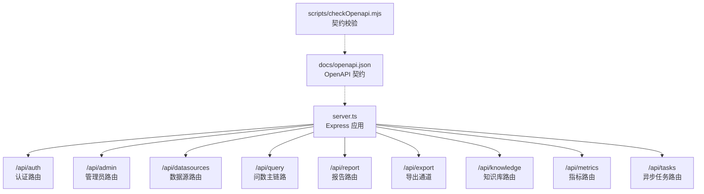
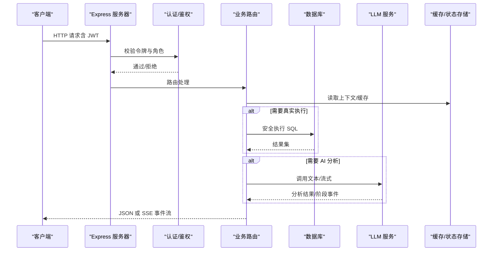
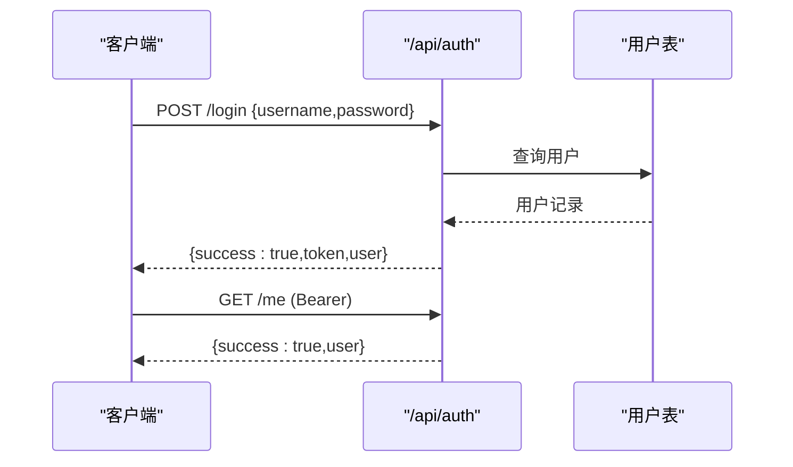
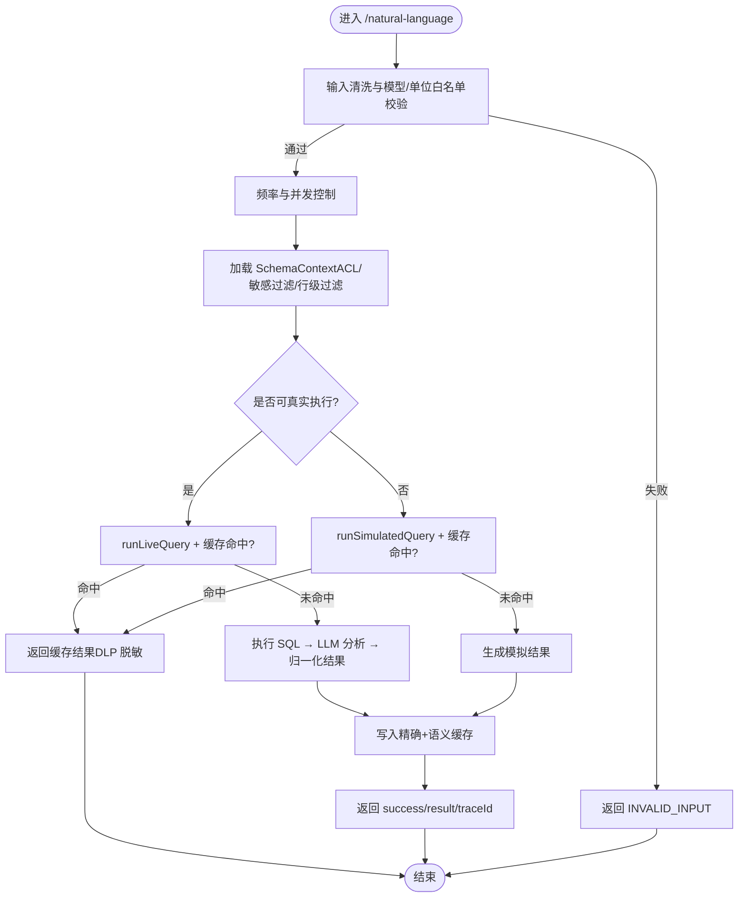
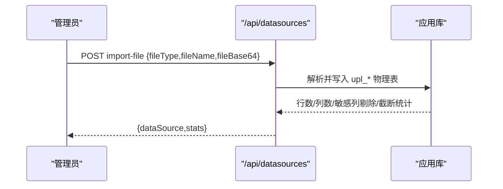
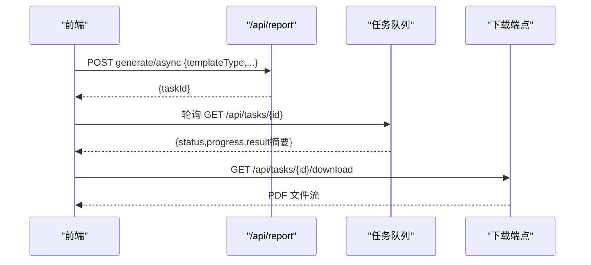
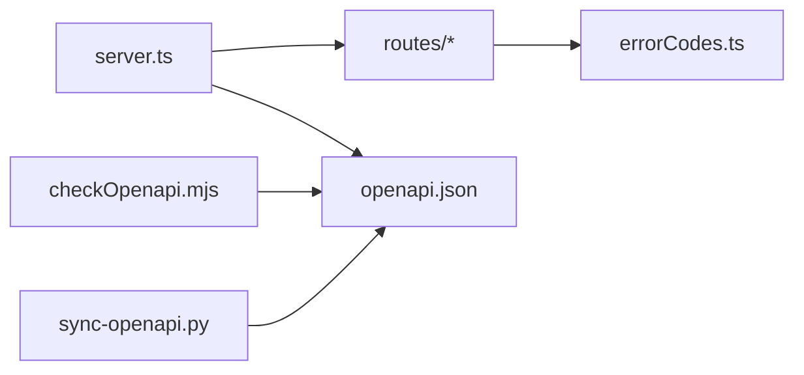

# 请求响应格式

<cite>
**本文引用的文件**
- [server.ts](file://server.ts)
- [openapi.json](file://docs/openapi.json)
- [sync-openapi.py](file://scripts/sync-openapi.py)
- [checkOpenapi.mjs](file://scripts/checkOpenapi.mjs)
- [errorCodes.ts](file://server/infra/errorCodes.ts)
- [auth.ts](file://server/routes/auth.ts)
- [query.ts](file://server/routes/query.ts)
</cite>

## 目录
1. [简介](#简介)
2. [项目结构](#项目结构)
3. [核心组件](#核心组件)
4. [架构总览](#架构总览)
5. [详细组件分析](#详细组件分析)
6. [依赖关系分析](#依赖关系分析)
7. [性能考虑](#性能考虑)
8. [故障排查指南](#故障排查指南)
9. [结论](#结论)
10. [附录](#附录)

## 简介
本文件面向“智能问数据分析系统”的 RESTful API 请求与响应格式，覆盖统一错误码、认证鉴权、数据源管理、自然语言问数主链路、报告导出、知识库、指标、权限申请、异步任务等。文档基于 OpenAPI 3.0.3 规范定义（docs/openapi.json），并结合服务端路由实现（Express）说明请求体结构、响应体结构、分页约定、文件上传下载、流式响应处理、请求验证、数据转换、压缩策略以及版本兼容性管理。同时提供 API 测试工具、Mock 服务与契约测试的实施建议。

## 项目结构
- 入口与中间件：server.ts 负责 Express 应用初始化、全局中间件（JSON 解析大小限制、安全响应头、请求日志、Prometheus 指标）、路由挂载、健康检查、模型信息、兜底 404 与全局错误处理。
- 路由模块：按业务域拆分在 server/routes/*，如 auth、admin、datasources、query、conversation、report、export、knowledge、metrics、skills、accessRequests、tasks 等。
- OpenAPI 文档：docs/openapi.json 为权威接口契约；scripts/sync-openapi.py 用于补齐缺失端点；scripts/checkOpenapi.mjs 用于 CI 校验代码与文档一致性。
- 错误码：server/infra/errorCodes.ts 定义统一错误码枚举，供各路由返回 code 字段。

图示来源
- [server.ts:82-265](file://server.ts#L82-L265)
- [openapi.json:1-84](file://docs/openapi.json#L1-L84)

章节来源
- [server.ts:82-265](file://server.ts#L82-L265)
- [openapi.json:1-84](file://docs/openapi.json#L1-L84)

## 核心组件
- 统一错误码与错误响应
  - 所有错误响应统一包含 error 字符串，可选 code 字段使用 server/infra/errorCodes.ts 中的枚举值（如 INVALID_INPUT、FORBIDDEN、RATE_LIMITED、QUERY_IN_FLIGHT、PLAN_INVALID、PLAN_MISMATCH、NOT_FOUND、CONFLICT、SQL_REJECTED、LLM_UNAVAILABLE、INTERNAL_ERROR）。
  - 成功响应通常包含 success 布尔字段与业务数据；部分接口返回 executionTimeMs、dataProvenance、traceId 等元信息。
- 认证与鉴权
  - 登录获取 JWT（公开），后续多数接口需携带 Bearer Token；支持 OIDC 跳转与回调；当前用户信息接口返回角色与是否强制改密标记。
  - 管理员操作通过 requireRole('ADMIN') 保护；普通问数能力要求 ADMIN/ANALYST。
- 请求体与参数校验
  - JSON 解析器默认 2MB，特定路径放宽至 10MB（知识库导入、文件数据源导入、报告导出）。
  - 输入清洗与长度限制（如问题截断、SQL 长度上限），非法值直接拒绝并返回 INVALID_INPUT。
- 流式响应与 SSE
  - 问数主链路支持 stream=true 时以 text/event-stream 推送阶段事件、推导步骤、终态结果；支持 Last-Event-ID 续传。
- 文件上传与下载
  - 文件数据源导入通过 application/json 提交 fileBase64；报告 PDF 导出支持同步与异步两种模式，异步任务完成后通过 /api/tasks/{id}/download 下载。
- 分页与列表
  - 列表接口遵循 OpenAPI 中定义的查询参数与返回结构；具体分页键名由对应端点描述决定（例如 ops 漂移事件、任务列表等）。
- 版本兼容性与别名
  - OpenAPI 声明 x-legacy-aliases，将旧路径 /api/datasource/* 映射到 /api/datasources/*；server.ts 中也注册了 legacy 前缀路由。

章节来源
- [errorCodes.ts:1-36](file://server/infra/errorCodes.ts#L1-L36)
- [auth.ts:41-153](file://server/routes/auth.ts#L41-L153)
- [server.ts:133-143](file://server.ts#L133-L143)
- [openapi.json:85-90](file://docs/openapi.json#L85-L90)

## 架构总览
下图展示从客户端到后端的核心调用链：客户端发起请求，经过全局中间件（限流、鉴权、日志、指标），进入具体路由处理器，执行业务逻辑（数据库访问、LLM 调用、缓存、审计、DLP 脱敏），最终返回统一格式的响应或流式事件。

图示来源
- [server.ts:169-183](file://server.ts#L169-L183)
- [query.ts:47-393](file://server/routes/query.ts#L47-L393)
- [auth.ts:41-153](file://server/routes/auth.ts#L41-L153)

## 详细组件分析

### 认证与鉴权（Auth）
- 登录
  - POST /api/auth/login：公开接口，限流保护；请求体包含 username、password；成功返回 token 与用户信息；失败返回 400/401/429。
  - 首次登录若 mustChangePassword=true，前端应引导修改密码。
- 当前用户
  - GET /api/auth/me：需鉴权；返回当前用户信息（含角色与是否强制改密）。
- 修改密码
  - POST /api/auth/change-password：需鉴权；强度校验（长度≥8 且含字母与数字）；成功返回 success。
- OIDC 集成
  - GET /api/auth/oidc/status：公开，返回是否启用。
  - GET /api/auth/oidc/login：公开，重定向到 IdP。
  - GET /api/auth/oidc/callback：公开，换取本地 JWT 并重定向回前端。

图示来源
- [auth.ts:41-82](file://server/routes/auth.ts#L41-L82)
- [auth.ts:84-114](file://server/routes/auth.ts#L84-L114)
- [auth.ts:116-153](file://server/routes/auth.ts#L116-L153)

章节来源
- [auth.ts:41-153](file://server/routes/auth.ts#L41-L153)

### 自然语言问数主链路（Query）
- 主端点
  - POST /api/query/natural-language：六层防护（输入清洗、权限、上下文、历史、频率/并发、审计），支持 live 真实执行与 simulated 演示模式；可开启 stream=true 进行 SSE 流式输出；支持 planId 计划模式；结果经 DLP 脱敏后返回。
  - 请求体关键字段：query、schema、dataSourceId、model（engine/model）、amountUnit、history、stream、planId、refreshCache、deepAnalysis。
  - 响应体关键字段：success、executionTimeMs、result、defense、dataProvenance、traceId；流式模式下 event 类型包括 stage、trace、clarify、refuse、done、error。
- SSE 断线续传
  - GET /api/query/stream-replay/:traceId：支持 Last-Event-ID 或 after 参数，回放未完成事件直至终态。
- 推导过程回放
  - GET /api/query/trace/:traceId：返回 steps 数组，仅本人或管理员可查。
- 计划模式
  - POST /api/query/plan：先生成分析计划（不执行），返回 plan 与过期时间；批准后携带 planId 执行。
- 反馈闭环
  - POST /api/query/feedback：点赞/点踩，沉淀 few-shot 样例。
- SQL 重跑与助手
  - POST /api/query/execute-sql：安全执行 SELECT-only SQL，返回 rows、rowCount、finalSql、dlp 掩码列信息。
  - POST /api/query/sql-assist：解释/优化 SQL，纯文本输出。
- 图表下钻
  - POST /api/query/drill：根据原聚合 SQL 与维度值生成明细查询，返回行列与列名映射。

图示来源
- [query.ts:47-393](file://server/routes/query.ts#L47-L393)
- [query.ts:395-476](file://server/routes/query.ts#L395-L476)

章节来源
- [query.ts:47-710](file://server/routes/query.ts#L47-L710)

### 数据源管理（DataSources）
- 列表与创建
  - GET /api/datasources：按角色返回授权范围的数据源。
  - POST /api/datasources：新建数据源（凭据加密存储），返回连通性校验结果。
- 文件导入
  - POST /api/datasources/import-file：上传 CSV/Excel/JSON 文件（application/json，fileBase64），服务端解析落库 upl_* 表，返回 stats（rows/columns/droppedSensitive/truncated）。
- 连通性测试
  - POST /api/datasources/test-connection：不落库，仅测试连接与表统计。
- 其他扩展端点（由脚本补齐）
  - 数据版本指纹、灵活查询只读 Schema、ACL 更新等。

图示来源
- [openapi.json:711-766](file://docs/openapi.json#L711-L766)
- [sync-openapi.py:49-59](file://scripts/sync-openapi.py#L49-L59)

章节来源
- [openapi.json:669-797](file://docs/openapi.json#L669-L797)
- [sync-openapi.py:49-59](file://scripts/sync-openapi.py#L49-L59)

### 报告与导出（Reports & Export）
- 报告生成与导出
  - POST /api/report/export-pdf：同步导出 PDF（ReportLab 服务端生成，环境缺资产时 503 降级）。
  - POST /api/report/generate-from-query：从问数结果一键生成报告。
  - 异步版本：/api/report/generate/async、/api/report/generate-from-query/async、/api/report/export-pdf/async，返回 taskId，前端轮询 /api/tasks/{id}。
- 统一导出通道（DLP）
  - POST /api/export/csv：CSV 导出，支持脱敏与水印，超阈值转审批；支持我的导出申请列表与审批流程。
- 决策报表与看板固化
  - saved-reports、dashboard-widgets、flex-queries 提供持久化与排序、替换、删除等操作。

图示来源
- [openapi.json:133-161](file://docs/openapi.json#L133-L161)
- [openapi.json:208-224](file://docs/openapi.json#L208-L224)
- [sync-openapi.py:133-161](file://scripts/sync-openapi.py#L133-L161)
- [sync-openapi.py:208-224](file://scripts/sync-openapi.py#L208-L224)

章节来源
- [openapi.json:133-224](file://docs/openapi.json#L133-L224)
- [sync-openapi.py:133-224](file://scripts/sync-openapi.py#L133-L224)

### 知识库与外部知识（Knowledge & ExternalKnowledge）
- 内部知识库
  - GET /api/knowledge/export：导出 JSON 备份（含元数据与版本信息）。
  - GET /api/knowledge/seed-entries：预置知识条目列表。
  - POST /api/knowledge/import：导入合并（replace/append/skip），body 上限 10MB。
- 外部知识库
  - 配置 CRUD（仅 ADMIN），支持测试连通性。

章节来源
- [openapi.json:89-109](file://docs/openapi.json#L89-L109)
- [sync-openapi.py:89-109](file://scripts/sync-openapi.py#L89-L109)

### 指标与运维（Metrics & Ops）
- 指标
  - POST /api/metrics/query：指标试算，支持金额单位换算（亿元/百万元/万元/元）。
  - 版本管理与审批：listMetricVersions、approve/reject/repropose/restore。
- 运维度量与漂移检测
  - GET /api/ops/metrics：北极星指标与趋势（仅 ADMIN）。
  - GET /api/ops/drift：漂移事件列表（OPEN 优先，倒序）。
  - POST /api/ops/drift/scan：手动触发扫描。
  - POST/DELETE /api/ops/drift/watch：登记/移除观察列。
  - POST /api/ops/drift/{id}/ack：确认事件。

章节来源
- [openapi.json:183-382](file://docs/openapi.json#L183-L382)
- [sync-openapi.py:111-131](file://scripts/sync-openapi.py#L111-L131)

### 权限申请与技能库（AccessRequests & Skills）
- 权限申请
  - POST /api/access-requests：提交申请（dataSourceId、reason）。
  - GET /api/access-requests/mine：我的申请列表。
  - GET /api/access-requests：全部申请（仅 ADMIN）。
  - POST /api/access-requests/{id}/approve|reject：审批通过/驳回。
- 技能库
  - 提供技能管理与共享审批相关端点（详见 openapi.json tags）。

章节来源
- [openapi.json:61-73](file://docs/openapi.json#L61-L73)
- [sync-openapi.py:61-73](file://scripts/sync-openapi.py#L61-L73)

### 异步任务（Tasks）
- 任务生命周期
  - 提交长任务（报告生成/导出）返回 taskId。
  - 轮询任务状态：GET /api/tasks/{id}。
  - 文件类任务下载：GET /api/tasks/{id}/download。
  - 我的任务列表：GET /api/tasks/mine。

章节来源
- [openapi.json:208-224](file://docs/openapi.json#L208-L224)
- [sync-openapi.py:208-224](file://scripts/sync-openapi.py#L208-L224)

## 依赖关系分析
- 路由与中间件
  - server.ts 挂载多个路由模块，统一注入 rateLimiter、authMiddleware、requireRole 等中间件。
  - 全局中间件包括 JSON 解析大小限制、安全响应头、请求日志、Prometheus 指标收集。
- 错误码与响应
  - 各路由统一使用 ERROR_CODES 枚举返回 code，便于前端精准分支处理。
- OpenAPI 契约与代码一致性
  - docs/openapi.json 作为契约；scripts/sync-openapi.py 补齐缺失端点；scripts/checkOpenapi.mjs 在 CI 中比对代码与文档，防止漂移。

图示来源
- [server.ts:224-265](file://server.ts#L224-L265)
- [errorCodes.ts:1-36](file://server/infra/errorCodes.ts#L1-L36)
- [checkOpenapi.mjs:1-75](file://scripts/checkOpenapi.mjs#L1-L75)
- [sync-openapi.py:1-251](file://scripts/sync-openapi.py#L1-L251)

章节来源
- [server.ts:224-265](file://server.ts#L224-L265)
- [checkOpenapi.mjs:1-75](file://scripts/checkOpenapi.mjs#L1-L75)
- [sync-openapi.py:1-251](file://scripts/sync-openapi.py#L1-L251)

## 性能考虑
- 请求体大小限制
  - 默认 JSON 解析限制 2MB；知识库导入、文件数据源导入、报告导出放宽至 10MB；报告导出路由自带更大解析器。
- 并发与限流
  - 每用户并发槽限制（同用户串行执行昂贵 LLM 调用）；滑动窗口限流（每小时次数限制）。
- 缓存
  - 精确缓存（L1）与语义缓存（L2）；支持 refreshCache 强制刷新；缓存命中显著降低延迟。
- 流式响应
  - SSE 事件流减少首屏等待；断线续传避免重复执行 SQL。
- 审计与慢查询治理
  - 慢查询（>3s 或 >10万行）标记审计；AST 解析失败走正则白名单兜底。

章节来源
- [server.ts:133-143](file://server.ts#L133-L143)
- [query.ts:97-116](file://server/routes/query.ts#L97-L116)
- [query.ts:205-223](file://server/routes/query.ts#L205-L223)
- [query.ts:595-612](file://server/routes/query.ts#L595-L612)

## 故障排查指南
- 常见错误码
  - INVALID_INPUT：参数校验失败（输入超长、指令被拒、非法单位等）。
  - FORBIDDEN：角色或权限不足。
  - DS_ACCESS_DENIED：无数据源访问权限（可通过权限申请开通）。
  - RATE_LIMITED：触发限流。
  - QUERY_IN_FLIGHT：同用户上一个查询仍在进行中。
  - PLAN_INVALID/PLAN_MISMATCH：计划无效或不匹配。
  - SQL_REJECTED：SQL 未通过安全校验。
  - LLM_UNAVAILABLE：AI 服务不可用。
  - INTERNAL_ERROR：服务端内部错误。
- 诊断要点
  - 查看请求日志与 Prometheus 指标（/metrics）定位耗时与错误分布。
  - 对 SSE 场景使用 Last-Event-ID 续传，避免重复执行。
  - 关注审计日志中的 status（SUCCESS/CACHE/REFUSED/FALLBACK/ERROR）与 detail。
  - 对于文件导入与报告导出，检查 body 大小限制与资源可用性。

章节来源
- [errorCodes.ts:1-36](file://server/infra/errorCodes.ts#L1-L36)
- [server.ts:267-280](file://server.ts#L267-L280)
- [query.ts:377-393](file://server/routes/query.ts#L377-L393)

## 结论
本系统采用统一的错误码与响应结构，结合严格的输入校验、权限控制、限流与并发控制，保障高可用与安全。OpenAPI 契约与代码双向校验确保接口演进可控；SSE 流式与断线续传提升交互体验；缓存与审计机制兼顾性能与可观测性。建议在团队内持续维护 docs/openapi.json，并通过 scripts/checkOpenapi.mjs 在 CI 中强制执行契约一致性。

## 附录

### RESTful API 设计规范
- 路径命名：名词复数形式（/api/datasources、/api/tasks）。
- 方法语义：GET 查询、POST 创建/执行、PUT 更新、DELETE 删除。
- 状态码：200/201 成功，400 参数错误，401 未认证，403 权限不足，404 不存在，409 冲突，422 业务校验失败，429 限流，5xx 服务端错误。
- 统一响应：{ success?: boolean, error?: string, code?: ErrorCode, ...业务字段 }。

章节来源
- [openapi.json:1-84](file://docs/openapi.json#L1-L84)
- [errorCodes.ts:1-36](file://server/infra/errorCodes.ts#L1-L36)

### 统一响应格式
- 成功：{ success: true, result?: any, executionTimeMs?: number, dataProvenance?: string, traceId?: string, dlp?: { maskedColumns, maskedLabels } }
- 失败：{ error: string, code?: ErrorCode }
- 流式：text/event-stream，event 类型包括 stage、trace、clarify、refuse、done、error。

章节来源
- [query.ts:118-153](file://server/routes/query.ts#L118-L153)
- [query.ts:249-314](file://server/routes/query.ts#L249-L314)
- [query.ts:395-456](file://server/routes/query.ts#L395-L456)

### 请求体结构标准
- 认证：{ username, password }
- 问数：{ query, schema?, dataSourceId?, model?, amountUnit?, history?, stream?, planId?, refreshCache?, deepAnalysis? }
- 数据源导入：{ name?, fileType, fileName, fileBase64 }
- 指标试算：{ metricId, dimensions?, limit?, amountUnit? }
- 报告导出：{ report?, charts? } 或 { title?, orientation? }

章节来源
- [auth.ts:41-77](file://server/routes/auth.ts#L41-L77)
- [openapi.json:383-486](file://docs/openapi.json#L383-L486)
- [openapi.json:711-766](file://docs/openapi.json#L711-L766)
- [openapi.json:111-131](file://docs/openapi.json#L111-L131)
- [openapi.json:133-161](file://docs/openapi.json#L133-L161)

### 分页格式
- 列表接口遵循各自端点的参数与返回结构；示例：ops 漂移事件列表、任务列表等。请参照对应端点描述中的 parameters 与 responses。

章节来源
- [openapi.json:213-382](file://docs/openapi.json#L213-L382)
- [openapi.json:208-224](file://docs/openapi.json#L208-L224)

### 文件上传与下载
- 上传：application/json，fileBase64 字段承载二进制内容；注意 body 大小限制。
- 下载：文件类任务通过 /api/tasks/{id}/download 获取；报告 PDF 同步或异步导出。

章节来源
- [openapi.json:711-766](file://docs/openapi.json#L711-L766)
- [openapi.json:208-224](file://docs/openapi.json#L208-L224)

### 流式响应处理
- 客户端设置 stream=true 接收 SSE；支持 Last-Event-ID 续传；事件顺序与终态保证。

章节来源
- [query.ts:118-153](file://server/routes/query.ts#L118-L153)
- [query.ts:395-456](file://server/routes/query.ts#L395-L456)

### 请求验证、数据转换、响应压缩
- 验证：输入清洗、长度限制、白名单校验（模型、金额单位）。
- 转换：金额单位标准化、结果归一化、列名中文化。
- 压缩：未在中间件显式启用 gzip；可按部署需求在反向代理层配置。

章节来源
- [query.ts:70-95](file://server/routes/query.ts#L70-L95)
- [query.ts:225-248](file://server/routes/query.ts#L225-L248)
- [query.ts:694-706](file://server/routes/query.ts#L694-L706)

### 版本兼容性管理
- OpenAPI 声明 x-legacy-aliases，将旧路径映射到新路径；server.ts 注册 legacy 前缀路由。
- CI 通过 checkOpenapi.mjs 校验代码与文档一致性，防止漂移。

章节来源
- [openapi.json:85-90](file://docs/openapi.json#L85-L90)
- [server.ts:229-230](file://server.ts#L229-L230)
- [checkOpenapi.mjs:1-75](file://scripts/checkOpenapi.mjs#L1-L75)

### API 测试工具、Mock 服务、契约测试实施指南
- 测试工具
  - 使用 OpenAPI 文档生成客户端 SDK 或 Postman 集合；利用 operationId 与 schemas 自动生成请求模板。
- Mock 服务
  - 基于 docs/openapi.json 启动 Mock 服务（如 Prism），快速联调前端与并行开发。
- 契约测试
  - 在 CI 中运行 scripts/checkOpenapi.mjs，确保新增/修改路由与 OpenAPI 一致；必要时引入 Pact/Swagger Validator 进行端到端契约校验。

章节来源
- [openapi.json:1-84](file://docs/openapi.json#L1-L84)
- [checkOpenapi.mjs:1-75](file://scripts/checkOpenapi.mjs#L1-L75)