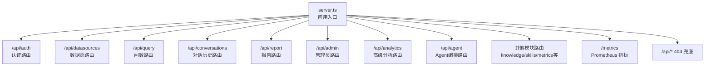
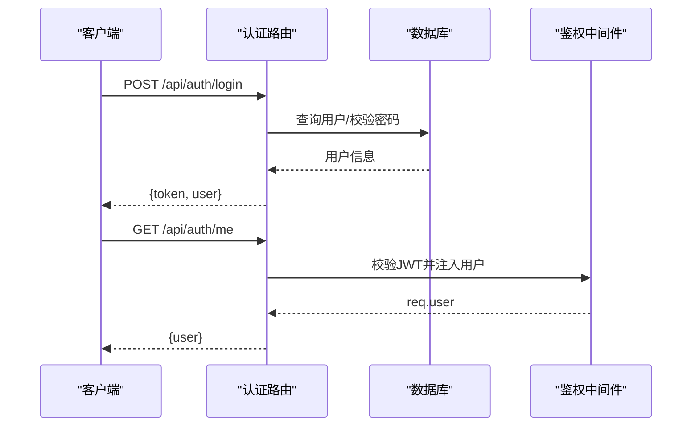
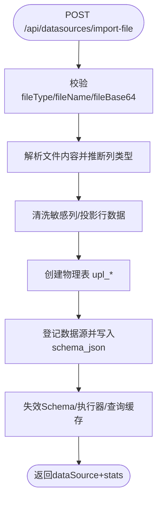
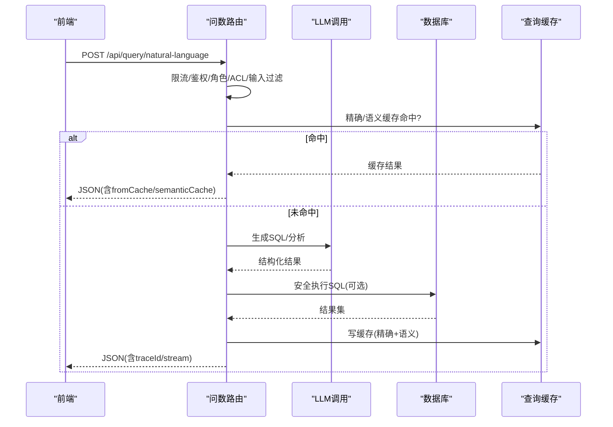
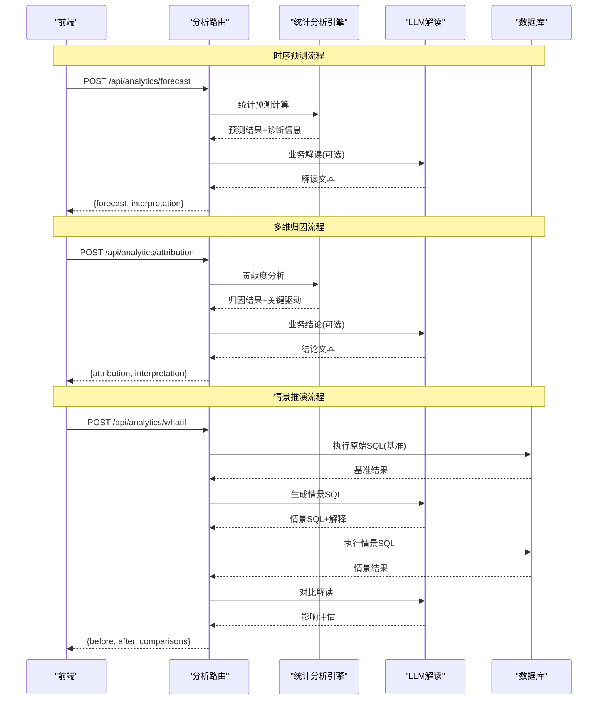
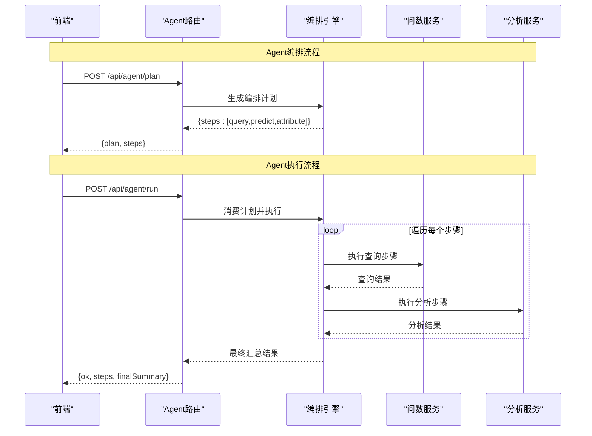
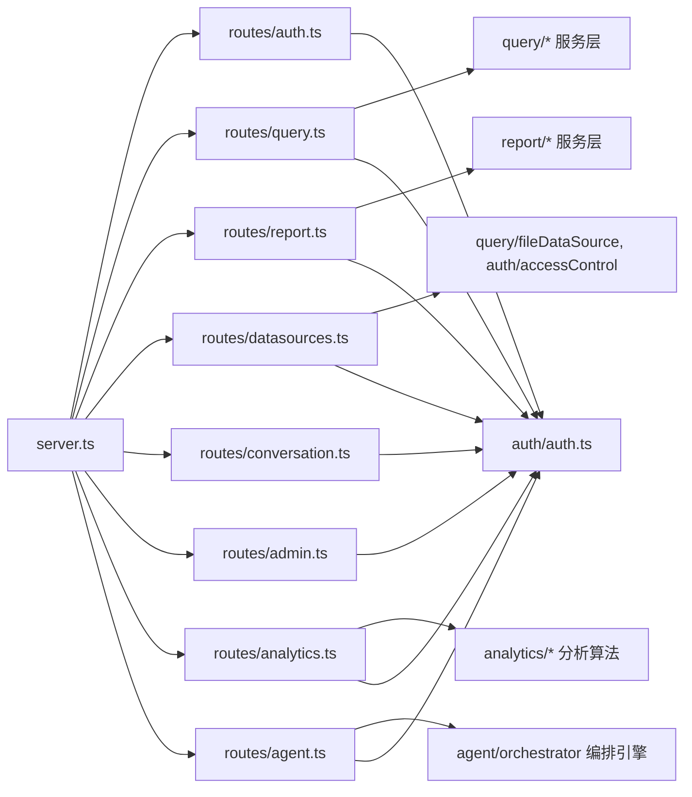

# 路由架构设计

<cite>
**本文引用的文件**
- [server.ts](file://server.ts)
- [auth.ts](file://server/routes/auth.ts)
- [query.ts](file://server/routes/query.ts)
- [datasources.ts](file://server/routes/datasources.ts)
- [report.ts](file://server/routes/report.ts)
- [conversation.ts](file://server/routes/conversation.ts)
- [admin.ts](file://server/routes/admin.ts)
- [analytics.ts](file://server/routes/analytics.ts)
- [agent.ts](file://server/routes/agent.ts)
- [auth.ts（鉴权中间件）](file://server/auth/auth.ts)
- [rateLimiter.ts](file://server/infra/rateLimiter.ts)
</cite>

## 更新摘要
**变更内容**
- 新增高级分析能力路由模块 `/api/analytics`，包含时序预测、多维归因、情景推演三个核心功能
- 新增 Agent 编排路由模块 `/api/agent`，支持多能力编排计划生成与执行
- 在 server.ts 中正确挂载新增路由到应用入口
- 扩展了 API 端点清单，新增5个高级分析相关端点

## 目录
1. [简介](#简介)
2. [项目结构](#项目结构)
3. [核心组件](#核心组件)
4. [架构总览](#架构总览)
5. [详细组件分析](#详细组件分析)
6. [依赖关系分析](#依赖关系分析)
7. [性能考量](#性能考量)
8. [故障排查指南](#故障排查指南)
9. [结论](#结论)
10. [附录：API端点清单与约定](#附录api端点清单与约定)

## 简介
本文件面向智能问数据分析系统的后端路由架构，聚焦基于 Express.js 的路由组织模式、模块化拆分、RESTful API 设计规范、URL 路径约定、中间件注册顺序与请求处理流程。文档同时覆盖路由参数传递、请求体解析配置、CORS 跨域策略、版本管理策略、错误路由处理机制，以及性能优化与安全加固建议。

**最新更新**：系统新增了高级分析能力和 Agent 编排功能，通过独立的模块化解耦复杂的数据分析工作流，支持时序预测、多维归因、情景推演和多步骤任务编排。

## 项目结构
系统采用"按功能模块拆分路由"的组织方式：所有业务路由以独立的 Router 模块存在，统一在应用入口集中挂载到 /api 前缀下。关键文件职责如下：
- server.ts：应用启动、全局中间件注册、健康检查、Prometheus 指标、各模块路由挂载、兜底 404 与全局错误处理。
- server/routes/*：按领域拆分的子路由模块（认证、数据源、查询、对话历史、报表、高级分析、Agent编排等）。
- server/auth/auth.ts：JWT 签发与校验、用户上下文注入、角色守卫。
- server/infra/rateLimiter.ts：IP 级限流中间件（内存或 Redis 模式）。
- server/analytics/*：高级分析算法实现（时序预测、多维归因、情景推演）。
- server/agent/orchestrator.ts：Agent 编排引擎，支持多能力任务规划与执行。



**图表来源**
- [server.ts:259-311](file://server.ts#L259-L311)

**章节来源**
- [server.ts:82-361](file://server.ts#L82-L361)

## 核心组件
- 认证与授权
  - JWT 签发/校验、用户上下文注入、强制改密拦截、角色守卫。
- 限流器
  - IP 维度滑动窗口（内存）或固定分钟窗口（Redis），支持多实例共享计数。
- 请求体解析
  - 默认 JSON 限制为 2MB；特定接口放宽至 10MB/20MB（如知识库导入、文件导入、报告导出）。
- 安全响应头
  - X-Content-Type-Options、X-Frame-Options、Referrer-Policy、HSTS、CSP（生产/开发差异化）。
- 可观测性
  - 请求日志、Prometheus 耗时直方图（仅 /api/*）。
- 路由挂载
  - 统一 /api 前缀，按模块划分；未匹配返回 JSON 404。
- 全局错误处理
  - 统一 JSON 错误响应，避免 HTML 错误页导致前端解析异常。
- **新增：高级分析引擎**
  - 时序预测：统计模型自动选择 + LLM 业务解读
  - 多维归因：贡献度拆解 + 关键驱动因素识别
  - 情景推演：SQL改写对比 + 影响评估
- **新增：Agent编排引擎**
  - 多能力任务规划：LLM驱动的复杂分析流程编排
  - 分步执行控制：query → forecast/attribution → 结果汇总

**章节来源**
- [auth.ts（鉴权中间件）:60-127](file://server/auth/auth.ts#L60-L127)
- [rateLimiter.ts:1-54](file://server/infra/rateLimiter.ts#L1-L54)
- [server.ts:133-183](file://server.ts#L133-L183)
- [server.ts:145-167](file://server.ts#L145-L167)
- [server.ts:169-183](file://server.ts#L169-L183)
- [server.ts:267-280](file://server.ts#L267-L280)
- [analytics.ts:1-307](file://server/routes/analytics.ts#L1-L307)
- [agent.ts:1-115](file://server/routes/agent.ts#L1-L115)

## 架构总览
请求进入 Express 后的典型处理链路：
1. 环境变量加载与数据库 Schema 初始化。
2. 预热状态存储（可选）、清理调度器、任务队列、SSE 重放缓冲、漂移检测等后台任务。
3. 注册全局中间件：JSON 解析（按路径动态调整大小限制）、安全响应头、请求日志、Prometheus 计时。
4. 注册健康检查与系统信息接口。
5. 挂载各业务路由模块（均位于 /api/*）。
6. 注册 /api 兜底 404。
7. 注册全局错误处理器。
8. 开发态 Vite 中间件或生产静态资源服务与 SPA 回退。

```mermaid
sequenceDiagram
participant Client as "客户端"
participant App as "Express 应用(server.ts)"
participant Auth as "认证中间件(authMiddleware)"
module Routes as "业务路由模块"
Client->>App : HTTP 请求(/api/*)
App->>App : JSON解析(按路径限制)
App->>App : 安全响应头/日志/指标
App->>Auth : 需要认证的请求
Auth-->>App : 注入req.user或拒绝
App->>Routes : 路由分发
Routes-->>Client : JSON 响应/文件流/SSE
Note over Routes : 新增 analytics/agent 模块提供高级分析能力
```

**图表来源**
- [server.ts:133-183](file://server.ts#L133-L183)
- [server.ts:187-265](file://server.ts#L187-L265)
- [auth.ts（鉴权中间件）:67-113](file://server/auth/auth.ts#L67-L113)

**章节来源**
- [server.ts:82-361](file://server.ts#L82-L361)

## 详细组件分析

### 认证路由（/api/auth）
- 登录 POST /login：限流 + 密码强度校验 + 账号状态检查 + 签发 JWT。
- 当前用户 GET /me：需登录。
- 修改密码 POST /change-password：需登录 + 新密码强度校验。
- OIDC 相关：/oidc/status、/oidc/login、/oidc/callback（公开，限流）。



**图表来源**
- [auth.ts:41-82](file://server/routes/auth.ts#L41-L82)
- [auth.ts（鉴权中间件）:67-113](file://server/auth/auth.ts#L67-L113)

**章节来源**
- [auth.ts:1-156](file://server/routes/auth.ts#L1-L156)
- [auth.ts（鉴权中间件）:1-127](file://server/auth/auth.ts#L1-L127)

### 数据源路由（/api/datasources）
- 列表 GET /：所有登录用户可见；非 ADMIN 剥离 tables 详情并按 ACL 标记访问权限。
- 数据版本探测 GET /:id/data-version：轻量探测底层数据变化，服务端缓存。
- 灵活查询 schema GET /:id/flex-schema：ADMIN/ANALYST，受 ACL 约束。
- 创建 POST /：仅 ADMIN，数据库类型自动提取 Schema。
- 文件导入 POST /import-file：仅 ADMIN，解析 CSV/Excel/JSON 落库并登记数据源。
- 同步 Schema POST /:id/sync-schema：仅 ADMIN，刷新表结构并失效缓存。
- 更新 PUT /:id、删除 DELETE /:id：仅 ADMIN，级联清理物理表（文件型）。
- 元数据维护 PUT /:id/schema-meta：仅 ADMIN，维护列角色与业务口径。



**图表来源**
- [datasources.ts:484-586](file://server/routes/datasources.ts#L484-L586)
- [datasources.ts:642-651](file://server/routes/datasources.ts#L642-L651)

**章节来源**
- [datasources.ts:1-800](file://server/routes/datasources.ts#L1-L800)

### 问数路由（/api/query）
- 主链路 POST /natural-language：六层防护（输入过滤、权限、上下文、历史、频率/并发、审计），支持 live/simulated 双链路、计划模式、结果缓存（精确+语义）、SSE 流式与断线续传、推导留痕回放。
- SSE 续传 GET /stream-replay/:traceId：按 traceId 回放事件，Last-Event-ID 语义。
- 推导回放 GET /trace/:traceId：仅本人或管理员。
- 计划模式 POST /plan：先生成计划后批准执行。
- 反馈 POST /feedback：点赞/点踩沉淀 few-shot。
- SQL 重跑 POST /execute-sql：SELECT-only 安全执行层，带慢查询与 AST 降级审计。
- SQL 助手 POST /sql-assist：解释/优化。
- 下钻 POST /drill：根据聚合 SQL 生成明细查询。



**图表来源**
- [query.ts:47-393](file://server/routes/query.ts#L47-L393)

**章节来源**
- [query.ts:1-710](file://server/routes/query.ts#L1-L710)

### 对话历史路由（/api/conversations）
- 检索 GET /：按数据源与关键词检索本人记录。
- 删除 DELETE /:id：仅限本人记录，越权返回 404。

**章节来源**
- [conversation.ts:1-44](file://server/routes/conversation.ts#L1-L44)

### 报告路由（/api/report）
- 生成 POST /generate：live/simulated 双阶段，金额单位白名单，计划模式支持。
- 计划 POST /plan：先生成报表查询计划，批准后执行。
- 从对话生成 POST /generate-from-query：结合模板或智能推断。
- 异步化：/generate/async、/generate-from-query/async、/export-pdf/async：提交即返回 taskId，独立 worker 执行。
- 导出 POST /export：PPTX 导出（base64 PNG 图表）。
- PDF 导出 POST /export-pdf：ReportLab 原生排版，水印防伪造。

**章节来源**
- [report.ts:1-584](file://server/routes/report.ts#L1-L584)

### 管理员路由（/api/admin）
- 用户管理：GET/POST/PUT/DELETE /users，包含密码强度校验、至少保留一个 ACTIVE 管理员的自我保护。
- 环境配置：GET/PUT /env-config，键白名单控制，敏感值脱敏展示。

**章节来源**
- [admin.ts:1-295](file://server/routes/admin.ts#L1-L295)

### **新增：高级分析路由（/api/analytics）**
- **时序预测 POST /forecast**：基于历史时序数据的统计预测，支持多种模型（移动平均、线性回归、季节性模型），可选 LLM 业务解读。
- **多维归因 POST /attribution**：对指标变化的多维度贡献度分析，识别关键驱动因素，支持两种输入模式（原始数据行或预聚合结果）。
- **情景推演 POST /whatif**：基于现有 SQL 进行场景模拟，LLM 自动生成情景 SQL 并对比执行结果，评估不同策略的影响。



**图表来源**
- [analytics.ts:65-119](file://server/routes/analytics.ts#L65-L119)
- [analytics.ts:123-202](file://server/routes/analytics.ts#L123-L202)
- [analytics.ts:206-304](file://server/routes/analytics.ts#L206-L304)

**章节来源**
- [analytics.ts:1-307](file://server/routes/analytics.ts#L1-L307)

### **新增：Agent编排路由（/api/agent）**
- **计划生成 POST /plan**：基于自然语言问题，LLM 自动生成多步骤分析计划，包含查询、预测、归因等能力组合。
- **计划执行 POST /run**：用户批准后顺序执行编排计划，支持 query → forecast/attribution → 结果汇总的完整分析流程。



**图表来源**
- [agent.ts:20-61](file://server/routes/agent.ts#L20-L61)
- [agent.ts:64-112](file://server/routes/agent.ts#L64-L112)

**章节来源**
- [agent.ts:1-115](file://server/routes/agent.ts#L1-L115)

## 依赖关系分析
- 中间件依赖
  - 认证中间件依赖数据库连接池（用于回查用户状态）、JWT 密钥（进程级或环境变量）。
  - 限流中间件依赖状态存储（内存 Map 或 Redis），多实例共享计数。
- 路由模块依赖
  - 问数/报告模块依赖 schemaContext、sqlExecutor、llmClient、queryCache、auditLog、taskQueue 等基础设施。
  - 数据源模块依赖 db、accessControl、fileDataSource、secretsCrypto。
  - **新增：分析模块依赖** seriesForecast、attribution、whatIf 等统计分析算法。
  - **新增：Agent模块依赖** orchestrator 编排引擎，协调多个分析能力。
- 耦合与内聚
  - 路由层专注参数校验、权限控制、审计埋点与响应组装；具体业务逻辑下沉至 query/report/datasources/analytics/agent 等服务层，保持高内聚低耦合。



**图表来源**
- [server.ts:259-311](file://server.ts#L259-L311)
- [auth.ts（鉴权中间件）:60-127](file://server/auth/auth.ts#L60-L127)

**章节来源**
- [server.ts:259-311](file://server.ts#L259-L311)

## 性能考量
- 请求体解析
  - 默认 2MB；知识库导入、文件导入放宽至 10MB；报告导出放宽至 20MB，避免大图表 base64 被拒。
- 缓存策略
  - 问数结果缓存（精确键 + 语义索引），数据源变更时主动失效缓存，减少重复计算。
- 并发控制
  - 用户级并发槽互斥（同一用户串行执行昂贵 LLM/SQL 链路），断开连接及时释放。
- 流式与断线续传
  - SSE 事件入缓冲，支持 Last-Event-ID 续传，降低网络抖动影响。
- 指标与日志
  - Prometheus 直方图仅对 /api/* 生效，避免 label 基数爆炸；请求日志在鉴权之前，便于审计被拒请求。
- **新增：分析性能优化**
  - 时序预测：限制序列长度（最大240期），自动模型选择避免过度计算。
  - 多维归因：限制行数（最大1000行）和维度数量（最大3维），防止大数据量分析。
  - 情景推演：限制SQL长度（最大500字符），结果行数限制（最多1000行）。
  - Agent编排：计划有效期10分钟，一次性消费防止重复执行。

**章节来源**
- [server.ts:133-143](file://server.ts#L133-L143)
- [server.ts:172-183](file://server.ts#L172-L183)
- [query.ts:205-223](file://server/routes/query.ts#L205-L223)
- [query.ts:395-456](file://server/routes/query.ts#L395-L456)
- [analytics.ts:27-29](file://server/routes/analytics.ts#L27-L29)
- [agent.ts:3-5](file://server/routes/agent.ts#L3-L5)

## 故障排查指南
- 401/403
  - 检查 JWT 是否有效、用户是否禁用、是否强制改密拦截、角色是否满足 requireRole。
- 404
  - 确认路由是否正确挂载；未匹配的 /api/* 会返回 JSON 404。
- 429
  - 检查 rateLimiter 配置与 Redis 连接；确认是否存在进行中的查询占用并发槽。
- 500/502
  - 查看全局错误处理器输出；关注 LLM 不可用、数据库连接失败、缓存失效异常。
- 流式中断
  - 使用 /api/query/stream-replay/:traceId 续传；检查 SSE 缓冲 TTL 与订阅超时。
- **新增：分析功能故障**
  - 时序预测：检查输入数据格式、序列长度、模型参数合法性。
  - 多维归因：验证 rows 数据结构、数值类型、维度字段完整性。
  - 情景推演：确认数据源权限、SQL语法、LLM改写结果有效性。
  - Agent编排：验证计划ID有效性、数据源兼容性、步骤执行状态。

**章节来源**
- [auth.ts（鉴权中间件）:67-113](file://server/auth/auth.ts#L67-L113)
- [server.ts:267-280](file://server.ts#L267-L280)
- [rateLimiter.ts:14-42](file://server/infra/rateLimiter.ts#L14-L42)
- [query.ts:395-456](file://server/routes/query.ts#L395-L456)
- [analytics.ts:69-91](file://server/routes/analytics.ts#L69-L91)
- [analytics.ts:127-174](file://server/routes/analytics.ts#L127-L174)
- [analytics.ts:213-239](file://server/routes/analytics.ts#L213-L239)
- [agent.ts:24-41](file://server/routes/agent.ts#L24-L41)
- [agent.ts:68-82](file://server/routes/agent.ts#L68-L82)

## 结论
本系统采用清晰的模块化路由架构：通过 Express Router 将认证、数据源、问数、对话历史、报表与管理等功能解耦，并在应用入口统一挂载到 /api 前缀下。**最新的高级分析能力和 Agent 编排功能进一步增强了系统的智能化水平**，通过独立的模块化解耦复杂的数据分析工作流。配合严格的中间件链（限流、鉴权、角色、输入过滤、审计、指标），实现了高可用、可扩展且安全的 API 体系。通过缓存、并发控制、SSE 断线续传与异步任务队列，显著提升了用户体验与系统吞吐能力。

**新增功能的价值**：
- 高级分析模块提供了专业的统计分析能力，支持时序预测、多维归因和情景推演
- Agent 编排模块实现了复杂分析任务的自动化编排和执行
- 两个模块都集成了 LLM 解读能力，提供智能化的业务洞察
- 统一的权限控制和限流机制确保了系统的安全性和稳定性

## 附录：API端点清单与约定
- 认证
  - POST /api/auth/login（公开，限流）
  - GET /api/auth/me（需登录）
  - POST /api/auth/change-password（需登录）
  - GET /api/auth/oidc/status（公开）
  - GET /api/auth/oidc/login（公开，限流）
  - GET /api/auth/oidc/callback（公开，限流）
- 数据源
  - GET /api/datasources（需登录）
  - GET /api/datasources/:id/data-version（需登录）
  - GET /api/datasources/:id/flex-schema（ADMIN/ANALYST）
  - POST /api/datasources（ADMIN）
  - POST /api/datasources/import-file（ADMIN）
  - POST /api/datasources/:id/sync-schema（ADMIN）
  - PUT /api/datasources/:id（ADMIN）
  - DELETE /api/datasources/:id（ADMIN）
  - PUT /api/datasources/:id/schema-meta（ADMIN）
- 问数
  - POST /api/query/natural-language（ADMIN/ANALYST，限流）
  - GET /api/query/stream-replay/:traceId（需登录）
  - GET /api/query/trace/:traceId（需登录）
  - POST /api/query/plan（ADMIN/ANALYST，限流）
  - POST /api/query/feedback（ADMIN/ANALYST，限流）
  - POST /api/query/execute-sql（ADMIN/ANALYST，限流）
  - POST /api/query/sql-assist（ADMIN/ANALYST，限流）
  - POST /api/query/drill（ADMIN/ANALYST，限流）
- 对话历史
  - GET /api/conversations（ADMIN/ANALYST）
  - DELETE /api/conversations/:id（ADMIN/ANALYST，限流）
- 报告
  - POST /api/report/generate（ADMIN/ANALYST，限流）
  - POST /api/report/plan（ADMIN/ANALYST，限流）
  - POST /api/report/generate-from-query（ADMIN/ANALYST，限流）
  - POST /api/report/generate/async（ADMIN/ANALYST，限流）
  - POST /api/report/generate-from-query/async（ADMIN/ANALYST，限流）
  - POST /api/report/export（ADMIN/ANALYST，限流，20mb）
  - POST /api/report/export-pdf（ADMIN/ANALYST，限流，20mb）
  - POST /api/report/export-pdf/async（ADMIN/ANALYST，限流，20mb）
- **新增：高级分析**
  - POST /api/analytics/forecast（ADMIN/ANALYST，限流）
  - POST /api/analytics/attribution（ADMIN/ANALYST，限流）
  - POST /api/analytics/whatif（ADMIN/ANALYST，限流）
- **新增：Agent编排**
  - POST /api/agent/plan（ADMIN/ANALYST，限流）
  - POST /api/agent/run（ADMIN/ANALYST，限流）
- 管理
  - GET/POST/PUT/DELETE /api/admin/users（ADMIN）
  - GET/PUT /api/admin/env-config（ADMIN）

**章节来源**
- [auth.ts:1-156](file://server/routes/auth.ts#L1-L156)
- [datasources.ts:364-800](file://server/routes/datasources.ts#L364-L800)
- [query.ts:47-710](file://server/routes/query.ts#L47-L710)
- [conversation.ts:1-44](file://server/routes/conversation.ts#L1-L44)
- [report.ts:31-584](file://server/routes/report.ts#L31-L584)
- [admin.ts:27-295](file://server/routes/admin.ts#L27-L295)
- [analytics.ts:65-304](file://server/routes/analytics.ts#L65-L304)
- [agent.ts:20-112](file://server/routes/agent.ts#L20-L112)