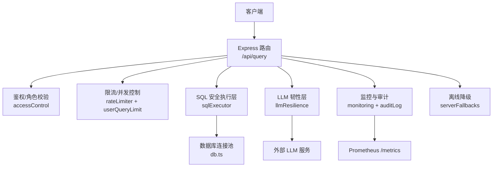
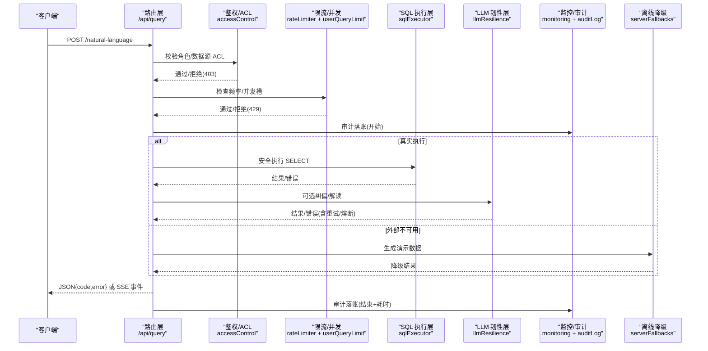
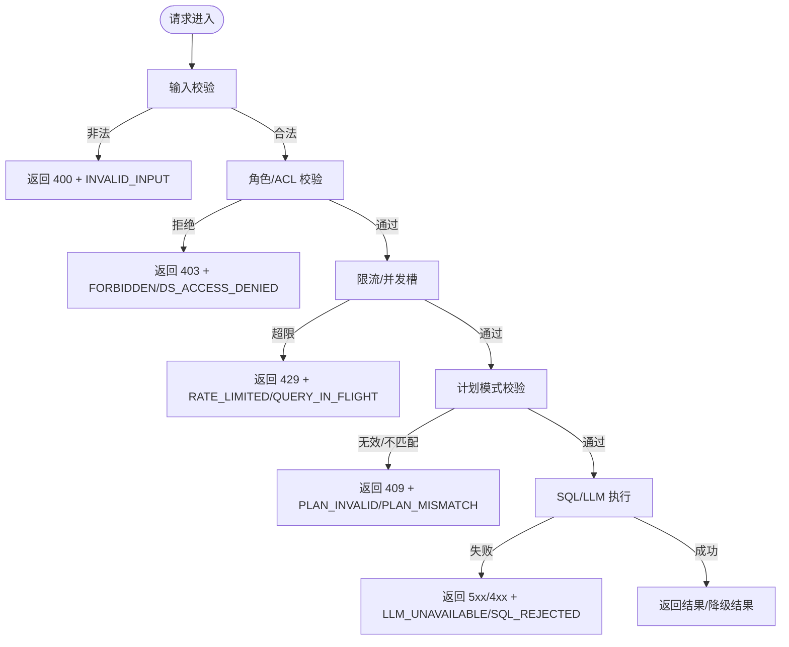
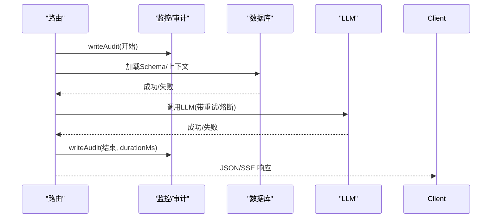
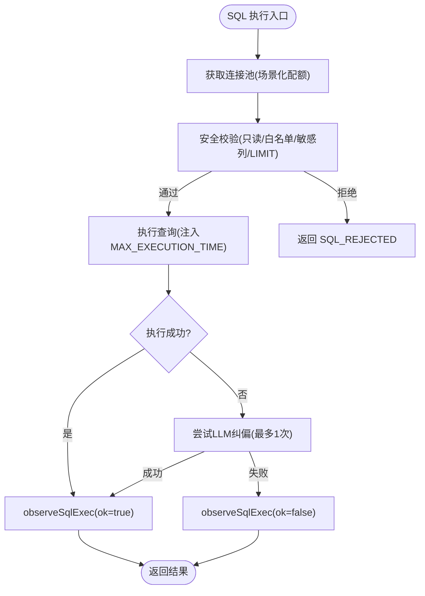
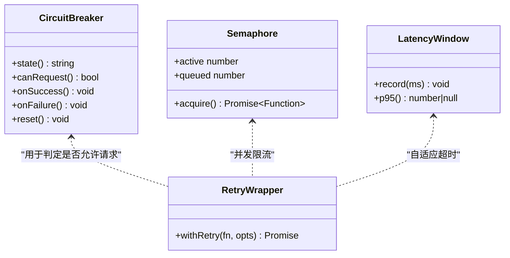
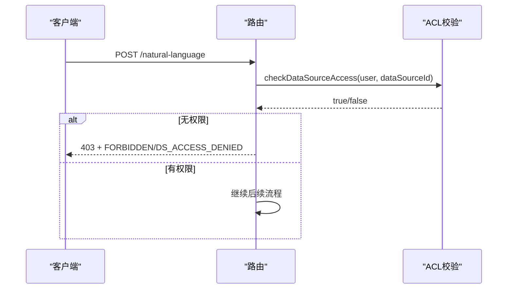
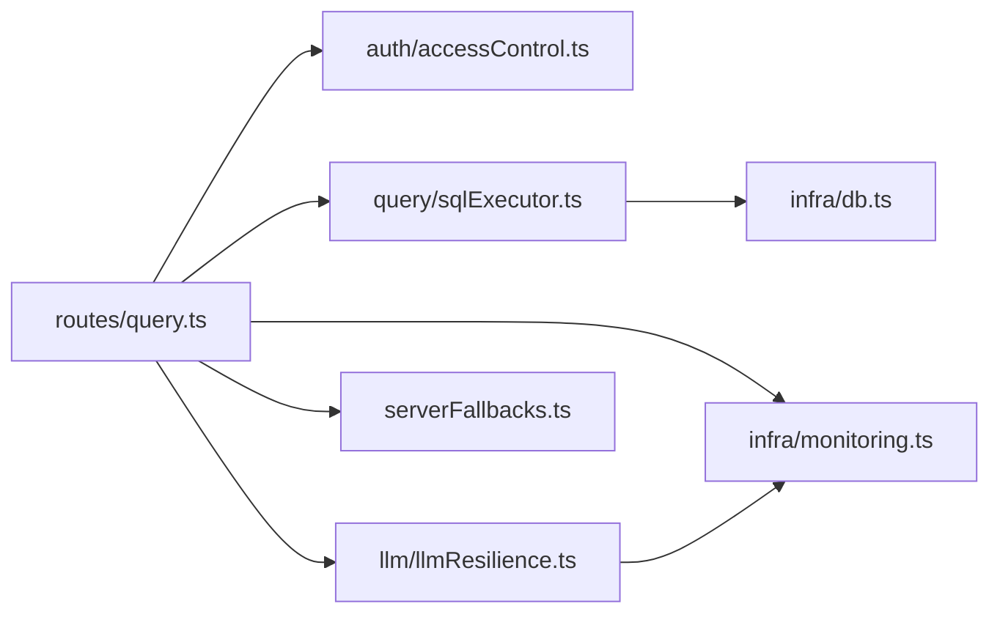

# 错误处理策略

<cite>
**本文引用的文件**
- [server/infra/errorCodes.ts](file://server/infra/errorCodes.ts)
- [server/infra/logger.ts](file://server/infra/logger.ts)
- [server/infra/requestLogger.ts](file://server/infra/requestLogger.ts)
- [server/infra/monitoring.ts](file://server/infra/monitoring.ts)
- [server/routes/query.ts](file://server/routes/query.ts)
- [server/auth/accessControl.ts](file://server/auth/accessControl.ts)
- [server/llm/llmResilience.ts](file://server/llm/llmResilience.ts)
- [server/query/sqlExecutor.ts](file://server/query/sqlExecutor.ts)
- [server/serverFallbacks.ts](file://server/serverFallbacks.ts)
- [server/infra/db.ts](file://server/infra/db.ts)
</cite>

## 目录
1. [引言](#引言)
2. [项目结构](#项目结构)
3. [核心组件](#核心组件)
4. [架构总览](#架构总览)
5. [详细组件分析](#详细组件分析)
6. [依赖关系分析](#依赖关系分析)
7. [性能与可用性考量](#性能与可用性考量)
8. [故障排查指南](#故障排查指南)
9. [结论](#结论)
10. [附录](#附录)

## 引言
本文件系统化梳理智能问数据分析系统的错误处理策略，覆盖全局错误处理器设计、业务异常分类、错误码规范、HTTP 状态码使用规则、错误响应格式标准化、异常捕获机制，以及数据库连接错误、LLM 调用失败、权限验证错误等特定场景的处理方案。同时给出错误日志记录、监控告警集成、用户友好提示、错误恢复策略、降级处理与重试机制的实现指南，帮助开发与运维在复杂链路中保持系统稳定与可观测性。

## 项目结构
错误处理贯穿“请求入口 → 鉴权与限流 → 业务路由 → 数据执行/LLM 调用 → 监控与审计”的全链路：
- 统一错误码定义集中管理，便于前端按 code 分支处理。
- 请求级日志与监控埋点提供可观测性支撑。
- 路由层对输入、权限、频率、并发进行多层防护并返回标准化错误。
- LLM 韧性组件提供重试、熔断、信号量与自适应超时。
- SQL 安全执行层保障数据库访问安全与资源保护。
- 离线降级模块在外部依赖不可用时提供演示数据，保证界面可用。

图表来源
- [server/routes/query.ts:47-200](file://server/routes/query.ts#L47-L200)
- [server/auth/accessControl.ts:43-73](file://server/auth/accessControl.ts#L43-L73)
- [server/llm/llmResilience.ts:179-245](file://server/llm/llmResilience.ts#L179-L245)
- [server/query/sqlExecutor.ts:44-109](file://server/query/sqlExecutor.ts#L44-L109)
- [server/infra/monitoring.ts:92-153](file://server/infra/monitoring.ts#L92-L153)
- [server/serverFallbacks.ts:97-229](file://server/serverFallbacks.ts#L97-L229)
- [server/infra/db.ts:47-70](file://server/infra/db.ts#L47-L70)

章节来源
- [server/routes/query.ts:47-200](file://server/routes/query.ts#L47-L200)
- [server/infra/errorCodes.ts:1-36](file://server/infra/errorCodes.ts#L1-L36)
- [server/infra/logger.ts:1-41](file://server/infra/logger.ts#L1-L41)
- [server/infra/requestLogger.ts:1-36](file://server/infra/requestLogger.ts#L1-L36)
- [server/infra/monitoring.ts:1-153](file://server/infra/monitoring.ts#L1-L153)
- [server/serverFallbacks.ts:1-392](file://server/serverFallbacks.ts#L1-L392)
- [server/query/sqlExecutor.ts:1-200](file://server/query/sqlExecutor.ts#L1-L200)
- [server/llm/llmResilience.ts:1-245](file://server/llm/llmResilience.ts#L1-L245)
- [server/infra/db.ts:1-800](file://server/infra/db.ts#L1-L800)

## 核心组件
- 统一错误码：集中定义业务错误码，命名采用全大写蛇形，按“失败原因”而非 HTTP 状态命名，便于前端精准分支处理。
- 请求日志：为每个请求生成 requestId，记录访问日志并在响应头回传，便于前后端关联排查。
- 监控埋点：基于 Prometheus 的指标采集，包含请求耗时、缓存命中、LLM 调用耗时与 token、SQL 执行耗时等，全部 fail-open。
- 安全执行层：SQL 白名单、只读限制、敏感列过滤、强制 LIMIT、执行超时、结果行数截断，并提供自愈纠偏入口。
- LLM 韧性：指数退避重试、引擎级熔断器、并发信号量、自适应超时，确保外部服务不稳定时的系统韧性。
- 离线降级：当 LLM 或外部依赖不可用时，基于 Schema 动态生成演示数据，保证界面可用性与用户体验。

章节来源
- [server/infra/errorCodes.ts:1-36](file://server/infra/errorCodes.ts#L1-L36)
- [server/infra/requestLogger.ts:1-36](file://server/infra/requestLogger.ts#L1-L36)
- [server/infra/monitoring.ts:1-153](file://server/infra/monitoring.ts#L1-L153)
- [server/query/sqlExecutor.ts:1-200](file://server/query/sqlExecutor.ts#L1-L200)
- [server/llm/llmResilience.ts:1-245](file://server/llm/llmResilience.ts#L1-L245)
- [server/serverFallbacks.ts:1-392](file://server/serverFallbacks.ts#L1-L392)

## 架构总览
下图展示一次智能问数请求的错误处理路径：从路由层的多层防护到 LLM/SQL 执行，再到监控与审计，最终输出标准化错误响应或降级结果。

图表来源
- [server/routes/query.ts:47-200](file://server/routes/query.ts#L47-L200)
- [server/auth/accessControl.ts:43-73](file://server/auth/accessControl.ts#L43-L73)
- [server/query/sqlExecutor.ts:44-109](file://server/query/sqlExecutor.ts#L44-L109)
- [server/llm/llmResilience.ts:179-245](file://server/llm/llmResilience.ts#L179-L245)
- [server/serverFallbacks.ts:97-229](file://server/serverFallbacks.ts#L97-L229)
- [server/infra/monitoring.ts:92-153](file://server/infra/monitoring.ts#L92-L153)

## 详细组件分析

### 全局错误处理器与错误码规范
- 错误码集中定义，采用 SCREAMING_SNAKE_CASE，按失败原因命名，如 INVALID_INPUT、FORBIDDEN、DS_ACCESS_DENIED、RATE_LIMITED、QUERY_IN_FLIGHT、PLAN_INVALID、PLAN_MISMATCH、NOT_FOUND、CONFLICT、SQL_REJECTED、LLM_UNAVAILABLE、INTERNAL_ERROR。
- 路由层在各阶段（输入校验、权限、限流、计划模式）返回对应错误码与 HTTP 状态码，并写入审计日志。
- 前端可按 code 做精准分支，避免解析中文文案。

图表来源
- [server/routes/query.ts:47-200](file://server/routes/query.ts#L47-L200)
- [server/infra/errorCodes.ts:1-36](file://server/infra/errorCodes.ts#L1-L36)

章节来源
- [server/infra/errorCodes.ts:1-36](file://server/infra/errorCodes.ts#L1-L36)
- [server/routes/query.ts:47-200](file://server/routes/query.ts#L47-L200)

### HTTP 状态码使用规则与错误响应格式
- 400：请求参数校验失败（INVALID_INPUT）。
- 403：角色/权限不足或数据源无访问权限（FORBIDDEN、DS_ACCESS_DENIED、AI_SWITCHED_OFF）。
- 409：计划模式相关错误（PLAN_INVALID、PLAN_MISMATCH）。
- 429：触发限流或并发冲突（RATE_LIMITED、QUERY_IN_FLIGHT）。
- 5xx：服务端内部错误或外部依赖不可用（LLM_UNAVAILABLE、INTERNAL_ERROR）。
- 响应体统一包含 code 与 error 字段，便于前端按 code 分支处理；SSE 模式下以事件形式推送中间状态，最终 done 事件携带结果或错误。

章节来源
- [server/routes/query.ts:47-200](file://server/routes/query.ts#L47-L200)
- [server/infra/errorCodes.ts:1-36](file://server/infra/errorCodes.ts#L1-L36)

### 异常捕获机制与审计日志
- 路由层 try/catch 包裹关键步骤，确保并发槽释放与审计落账。
- 审计日志在入口处记录 userId、endpoint、dataSourceId、question，结束时记录 status、detail、durationMs。
- 监控埋点旁路化，fail-open，不影响主链路。

图表来源
- [server/routes/query.ts:47-200](file://server/routes/query.ts#L47-L200)
- [server/infra/monitoring.ts:92-153](file://server/infra/monitoring.ts#L92-L153)

章节来源
- [server/routes/query.ts:47-200](file://server/routes/query.ts#L47-L200)
- [server/infra/monitoring.ts:92-153](file://server/infra/monitoring.ts#L92-L153)

### 数据库连接错误处理
- 连接池容量公式化：应用库与数据源连接池大小根据 EXPECTED_CONCURRENT_USERS 推导并 clamp，避免打爆数据库。
- 场景化超时：交互/分析链/导出三类场景独立配额与超时，防止长任务阻塞交互链路。
- 自愈纠偏：SQL 校验失败时可调用 LLM 纠偏重试一次，统一审计出口。
- 监控埋点：SQL 执行耗时直方图、EXPLAIN 防线统计，fail-open。

图表来源
- [server/query/sqlExecutor.ts:44-109](file://server/query/sqlExecutor.ts#L44-L109)
- [server/query/sqlExecutor.ts:118-153](file://server/query/sqlExecutor.ts#L118-L153)
- [server/infra/monitoring.ts:128-133](file://server/infra/monitoring.ts#L128-L133)

章节来源
- [server/query/sqlExecutor.ts:44-109](file://server/query/sqlExecutor.ts#L44-L109)
- [server/query/sqlExecutor.ts:118-153](file://server/query/sqlExecutor.ts#L118-L153)
- [server/infra/db.ts:29-43](file://server/infra/db.ts#L29-L43)
- [server/infra/monitoring.ts:128-133](file://server/infra/monitoring.ts#L128-L133)

### LLM 调用失败处理（重试、熔断、信号量、自适应超时）
- 重试策略：仅对可恢复错误（超时、5xx、网络错误、429）进行指数退避重试，带抖动避免雪崩。
- 熔断器：按引擎隔离，连续失败 N 次开路，冷却期后半开探测恢复。
- 信号量：每引擎并发上限，超出排队，避免打爆本地推理进程。
- 自适应超时：基于近期成功调用 P95×3 动态调整，夹在配置上下限之间。

图表来源
- [server/llm/llmResilience.ts:90-160](file://server/llm/llmResilience.ts#L90-L160)
- [server/llm/llmResilience.ts:179-245](file://server/llm/llmResilience.ts#L179-L245)

章节来源
- [server/llm/llmResilience.ts:1-245](file://server/llm/llmResilience.ts#L1-L245)

### 权限验证错误处理
- 路由层双重校验：Controller 层 requireRole 与服务端 Service 层 checkDataSourceAccess（ACL）共同决定访问权限。
- 无权限时返回 403 与对应错误码（FORBIDDEN、DS_ACCESS_DENIED），并写入审计日志。
- ACL 支持部门与个人用户清单，ADMIN 豁免。

图表来源
- [server/routes/query.ts:58-68](file://server/routes/query.ts#L58-L68)
- [server/auth/accessControl.ts:43-73](file://server/auth/accessControl.ts#L43-L73)

章节来源
- [server/routes/query.ts:58-68](file://server/routes/query.ts#L58-L68)
- [server/auth/accessControl.ts:43-73](file://server/auth/accessControl.ts#L43-L73)

### 错误日志记录与监控告警集成
- 请求级日志：requestLogger 为每个请求生成 requestId，记录方法、URL、状态码与耗时，并在响应头回传 X-Request-Id。
- 监控指标：nl2sql_requests_total、nl2sql_duration_seconds、llm_call_duration_seconds、llm_tokens_total、sql_execute_duration_seconds、http_request_duration_seconds 等。
- 告警：可通过 Prometheus 配置告警规则（如高错误率、慢请求、LLM 超时激增），结合 Alertmanager 通知。

章节来源
- [server/infra/requestLogger.ts:1-36](file://server/infra/requestLogger.ts#L1-L36)
- [server/infra/monitoring.ts:1-153](file://server/infra/monitoring.ts#L1-L153)

### 用户友好错误提示与降级处理
- 错误提示：前端按 code 分支显示不同提示（如“上一个查询仍在进行中”、“该数据源的智能问数功能已被管理员停用”）。
- 降级处理：当 LLM 不可用时，serverFallbacks 基于 Schema 动态生成演示数据，保证界面可用；报告与图表块也提供降级模板。

章节来源
- [server/routes/query.ts:97-109](file://server/routes/query.ts#L97-L109)
- [server/routes/query.ts:172-176](file://server/routes/query.ts#L172-L176)
- [server/serverFallbacks.ts:97-229](file://server/serverFallbacks.ts#L97-L229)
- [server/serverFallbacks.ts:246-392](file://server/serverFallbacks.ts#L246-L392)

## 依赖关系分析
- 路由层依赖鉴权、限流、SQL 执行、LLM 韧性、监控与审计、降级模块。
- SQL 执行层依赖数据库连接池与安全校验工具。
- LLM 韧性层提供重试、熔断、信号量与自适应超时，供 llmClient 集成。
- 监控模块对外暴露 /metrics 端点，支持可选令牌保护。

图表来源
- [server/routes/query.ts:47-200](file://server/routes/query.ts#L47-L200)
- [server/query/sqlExecutor.ts:44-109](file://server/query/sqlExecutor.ts#L44-L109)
- [server/llm/llmResilience.ts:179-245](file://server/llm/llmResilience.ts#L179-L245)
- [server/infra/monitoring.ts:92-153](file://server/infra/monitoring.ts#L92-L153)
- [server/infra/db.ts:47-70](file://server/infra/db.ts#L47-L70)

章节来源
- [server/routes/query.ts:47-200](file://server/routes/query.ts#L47-L200)
- [server/query/sqlExecutor.ts:44-109](file://server/query/sqlExecutor.ts#L44-L109)
- [server/llm/llmResilience.ts:179-245](file://server/llm/llmResilience.ts#L179-L245)
- [server/infra/monitoring.ts:92-153](file://server/infra/monitoring.ts#L92-L153)
- [server/infra/db.ts:47-70](file://server/infra/db.ts#L47-L70)

## 性能与可用性考量
- 连接池容量公式化：避免连接不足或过多导致性能抖动或数据库压力过大。
- 场景化超时：交互链路快速失败，后台任务合理等待，提升整体吞吐。
- 监控埋点 fail-open：确保监控异常不影响业务。
- LLM 韧性：重试与熔断降低外部依赖波动影响，信号量保护本地算力。
- 降级策略：外部不可用时提供演示数据，维持用户体验。

[本节为通用指导，无需具体文件引用]

## 故障排查指南
- 定位请求：通过 X-Request-Id 关联前后端日志与审计记录。
- 查看监控：/metrics 端点暴露关键指标，结合 Prometheus 面板观察错误率与耗时分布。
- 审计日志：query_audit_log 表记录每次请求的状态与耗时，便于回溯。
- 常见错误：
  - 输入非法：检查 sanitizeQuestion 与模型选择校验。
  - 权限不足：确认角色与 ACL 配置。
  - 限流/并发：检查 rateLimiter 与 acquireQuerySlot 逻辑。
  - SQL 被拒：检查白名单、敏感列、LIMIT 与 MAX_EXECUTION_TIME。
  - LLM 不可用：检查重试次数、熔断状态与自适应超时。

章节来源
- [server/infra/requestLogger.ts:1-36](file://server/infra/requestLogger.ts#L1-L36)
- [server/infra/monitoring.ts:135-153](file://server/infra/monitoring.ts#L135-L153)
- [server/infra/db.ts:181-199](file://server/infra/db.ts#L181-L199)
- [server/routes/query.ts:47-200](file://server/routes/query.ts#L47-L200)
- [server/query/sqlExecutor.ts:118-153](file://server/query/sqlExecutor.ts#L118-L153)
- [server/llm/llmResilience.ts:179-245](file://server/llm/llmResilience.ts#L179-L245)

## 结论
本系统通过统一错误码、分层防护、韧性调用、安全执行与全面监控，构建了稳健的错误处理体系。建议在新增功能时遵循以下原则：
- 所有错误必须映射到统一错误码，并附带用户友好的 error 文案。
- 关键路径必须写入审计日志与监控埋点，且监控必须 fail-open。
- 外部依赖调用必须使用韧性组件（重试、熔断、信号量、自适应超时）。
- 数据库访问必须经过安全执行层，设置场景化超时与行限制。
- 提供降级策略，确保外部不可用时系统仍可用。

[本节为总结性内容，无需具体文件引用]

## 附录
- 环境变量参考：
  - LOG_LEVEL：日志级别（debug/info/warn/error）。
  - METRICS_TOKEN：/metrics 端点访问令牌（可选）。
  - EXPECTED_CONCURRENT_USERS：并发用户估算值，用于连接池容量推导。
  - DS_POOL_MAX、APP_POOL_MAX：数据源与应用库连接池上限。
  - QUERY_TIMEOUT_INTERACTIVE_MS、QUERY_TIMEOUT_CHAIN_MS、QUERY_TIMEOUT_EXPORT_MS：场景化超时。

[本节为补充信息，无需具体文件引用]