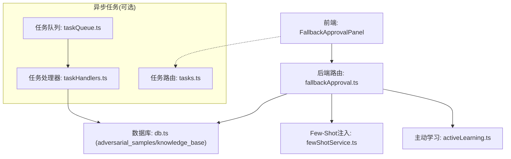
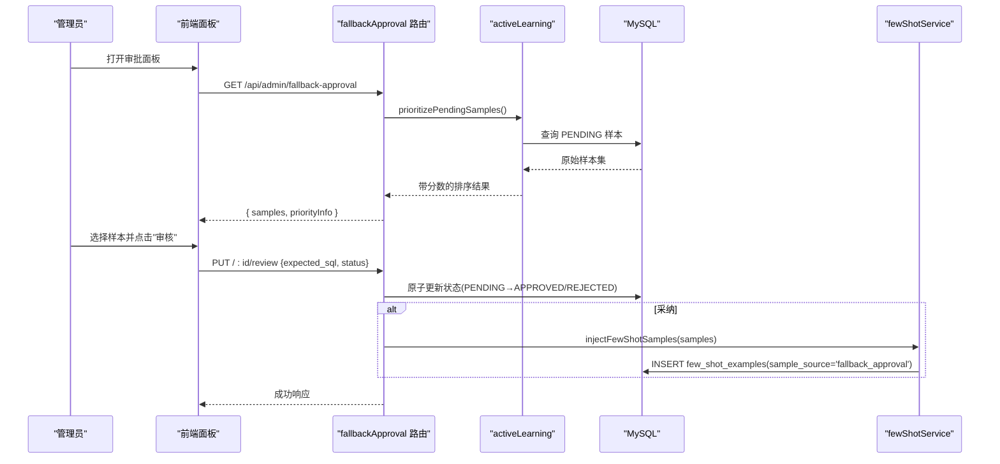
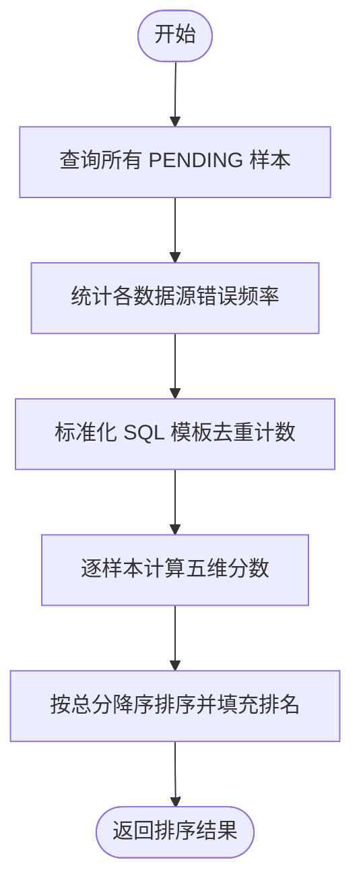
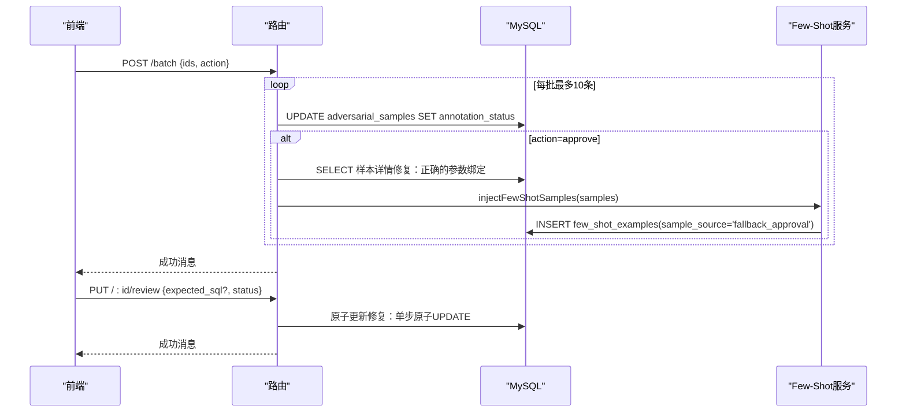
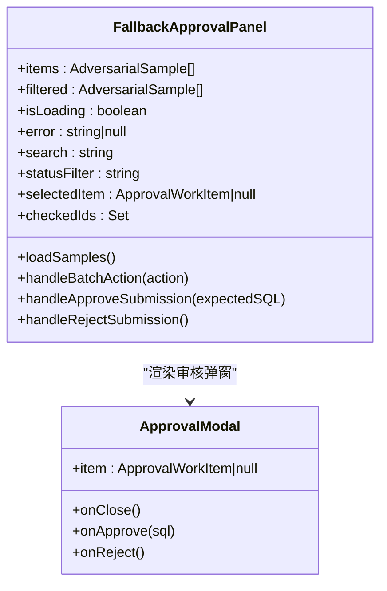
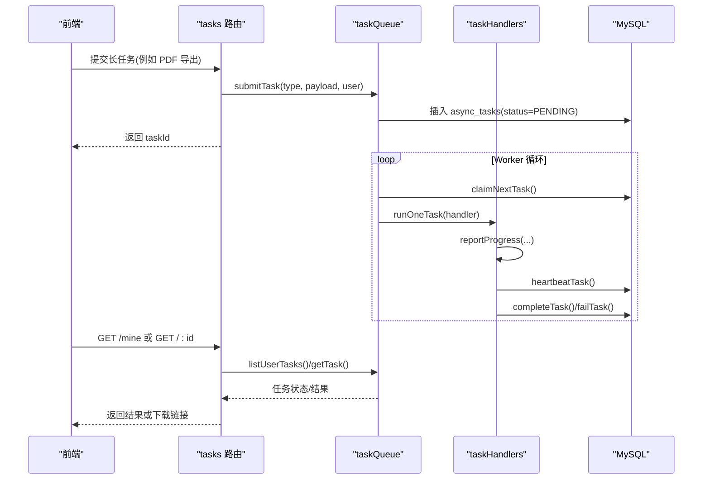
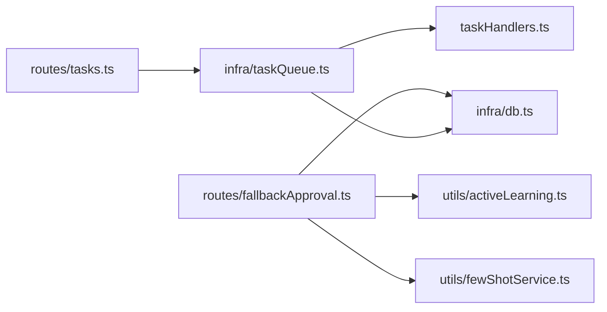

# 人类审批工作流

<cite>
**本文引用的文件**
- [server/routes/fallbackApproval.ts](file://server/routes/fallbackApproval.ts)
- [src/components/admin/FallbackApprovalPanel.tsx](file://src/components/admin/FallbackApprovalPanel.tsx)
- [server/utils/activeLearning.ts](file://server/utils/activeLearning.ts)
- [server/utils/fewShotService.ts](file://server/utils/fewShotService.ts)
- [server/infra/taskQueue.ts](file://server/infra/taskQueue.ts)
- [server/taskHandlers.ts](file://server/taskHandlers.ts)
- [server/routes/tasks.ts](file://server/routes/tasks.ts)
- [server/infra/db.ts](file://server/infra/db.ts)
</cite>

## 更新摘要
**所做更改**
- **v0.9.47 P0 关键Bug修复**：修复了缺失SELECT参数导致500错误、非原子多步更新被合并为单个原子操作、批量操作的适当参数绑定、以及与少样本注入系统的集成用于批准的样本
- 更新了前端面板的视觉样式，特别是IN_REVIEW徽章颜色从蓝色改为青色，提升了可读性和对比度
- 改进了SQL关键字高亮功能，使用更清晰的色彩方案（violet、emerald、amber）增强代码可读性
- 优化了浅色模式下的视觉一致性，确保在不同主题下都有适当的对比度
- 增强了整体用户体验，使审核界面更加直观和易用

## 目录
1. [简介](#简介)
2. [项目结构](#项目结构)
3. [核心组件](#核心组件)
4. [架构总览](#架构总览)
5. [详细组件分析](#详细组件分析)
6. [依赖关系分析](#依赖关系分析)
7. [性能与可靠性](#性能与可靠性)
8. [故障排查指南](#故障排查指南)
9. [结论](#结论)

## 简介
本系统提供"人类审批工作流"，用于对 NL2SQL 失败样本进行主动学习、人工审核与知识注入。管理员可在管理面板中查看待审样本，按优先级排序，编辑并采纳正确 SQL；采纳后自动注入 Few-Shot 知识库，提升后续查询成功率。同时，系统内置异步任务队列支撑长耗时流程（如报告生成、PDF 导出），确保高并发下的稳定性与可观测性。

**最新更新**：v0.9.47 P0 版本修复了多个关键bug，包括缺失SELECT参数导致的500错误、非原子多步更新问题、批量操作参数绑定问题，以及Few-Shot注入系统的深度集成。前端面板经过视觉优化，显著提升了用户体验。

## 项目结构
围绕人类审批工作流的关键代码分布在以下模块：
- 路由层：提供 REST API 供前端调用
- 业务逻辑层：优先级评分、Few-Shot 注入、审计与持久化
- 前端界面：管理员面板，支持搜索、筛选、批量操作与单条审核
- 基础设施：MySQL 建表、连接池、异步任务队列与 Worker

**图表来源**
- [server/routes/fallbackApproval.ts:1-200](file://server/routes/fallbackApproval.ts#L1-L200)
- [src/components/admin/FallbackApprovalPanel.tsx:1-479](file://src/components/admin/FallbackApprovalPanel.tsx#L1-L479)
- [server/utils/activeLearning.ts:1-164](file://server/utils/activeLearning.ts#L1-L164)
- [server/utils/fewShotService.ts:1-121](file://server/utils/fewShotService.ts#L1-L121)
- [server/infra/taskQueue.ts:1-347](file://server/infra/taskQueue.ts#L1-L347)
- [server/taskHandlers.ts:1-198](file://server/taskHandlers.ts#L1-L198)
- [server/routes/tasks.ts:1-86](file://server/routes/tasks.ts#L1-L86)
- [server/infra/db.ts:720-782](file://server/infra/db.ts#L720-L782)

**章节来源**
- [server/routes/fallbackApproval.ts:1-200](file://server/routes/fallbackApproval.ts#L1-L200)
- [src/components/admin/FallbackApprovalPanel.tsx:1-479](file://src/components/admin/FallbackApprovalPanel.tsx#L1-L479)
- [server/utils/activeLearning.ts:1-164](file://server/utils/activeLearning.ts#L1-L164)
- [server/utils/fewShotService.ts:1-121](file://server/utils/fewShotService.ts#L1-L121)
- [server/infra/taskQueue.ts:1-347](file://server/infra/taskQueue.ts#L1-L347)
- [server/taskHandlers.ts:1-198](file://server/taskHandlers.ts#L1-L198)
- [server/routes/tasks.ts:1-86](file://server/routes/tasks.ts#L1-L86)
- [server/infra/db.ts:720-782](file://server/infra/db.ts#L720-L782)

## 核心组件
- 困难样本列表与优先级排序：从 adversarial_samples 表读取 PENDING 样本，计算多维分数并按总分降序返回
- 批量审批/拒绝：将多个样本状态由 PENDING 更新为 APPROVED/REJECTED，采纳时自动注入 Few-Shot
- 单条审核：进入 IN_REVIEW 中间态，最终确认 APPROVED/REJECTED，并可写入 expected_sql 与 resolved_strategy
- 前端面板：展示 KPI、搜索过滤、批量操作、审核弹窗与结果反馈
- 异步任务队列：为长耗时流程提供提交、领取、心跳、完成/失败、孤儿回收能力

**章节来源**
- [server/routes/fallbackApproval.ts:25-197](file://server/routes/fallbackApproval.ts#L25-L197)
- [src/components/admin/FallbackApprovalPanel.tsx:146-479](file://src/components/admin/FallbackApprovalPanel.tsx#L146-L479)
- [server/utils/activeLearning.ts:40-149](file://server/utils/activeLearning.ts#L40-L149)
- [server/utils/fewShotService.ts:34-64](file://server/utils/fewShotService.ts#L34-L64)
- [server/infra/taskQueue.ts:119-227](file://server/infra/taskQueue.ts#L119-L227)

## 架构总览
人类审批工作流涉及"数据收集 → 优先级排序 → 人工审核 → 知识注入"的闭环。同时，系统通过异步任务队列承载长耗时任务，避免阻塞请求线程。

**图表来源**
- [server/routes/fallbackApproval.ts:25-197](file://server/routes/fallbackApproval.ts#L25-L197)
- [server/utils/activeLearning.ts:40-149](file://server/utils/activeLearning.ts#L40-L149)
- [server/utils/fewShotService.ts:34-64](file://server/utils/fewShotService.ts#L34-L64)
- [server/infra/db.ts:767-782](file://server/infra/db.ts#L767-L782)

## 详细组件分析

### 困难样本优先级排序
- 目标：对 PENDING 样本进行多因子评分，优先处理高价值样本
- 维度：时间衰减、错误频率、查询复杂度、多样性探索、重要用户加权
- 输出：包含 total_score 与 rank 的排序结果

**图表来源**
- [server/utils/activeLearning.ts:40-149](file://server/utils/activeLearning.ts#L40-L149)

**章节来源**
- [server/utils/activeLearning.ts:1-164](file://server/utils/activeLearning.ts#L1-L164)

### 批量审批与单条审核

**已更新** v0.9.47 P0 版本修复了多个关键bug：

#### 批量操作修复
- **参数绑定修复**：修复了filter后sampleSet长度与占位符数量不匹配的问题
- **原子操作优化**：采用分批更新（每批10条），防止SQL过长风险
- **Few-Shot集成**：采纳时自动注入到独立的few_shot_examples表

#### 单条审核修复
- **缺失参数修复**：修复了SELECT语句中缺少[id]参数导致的500错误
- **原子更新**：将原本的两步更新（先置IN_REVIEW再终态）合并为单步原子UPDATE
- **并发安全**：通过WHERE条件确保并发场景下的数据一致性

**图表来源**
- [server/routes/fallbackApproval.ts:67-197](file://server/routes/fallbackApproval.ts#L67-L197)
- [server/utils/fewShotService.ts:34-64](file://server/utils/fewShotService.ts#L34-L64)

**章节来源**
- [server/routes/fallbackApproval.ts:25-197](file://server/routes/fallbackApproval.ts#L25-L197)
- [server/utils/fewShotService.ts:1-121](file://server/utils/fewShotService.ts#L1-L121)

### 前端审批面板

**已更新** 前端面板经过显著的视觉改进，包括：

#### 状态徽章颜色优化
- **IN_REVIEW状态**：从蓝色改为青色（`bg-cyan-500/20 text-cyan-400 border-cyan-500/30`），提供更好的视觉对比度和识别度
- **其他状态**：保持原有的颜色体系（PENDING-琥珀色、APPROVED-翠绿色、REJECTED-玫瑰色）

#### SQL语法高亮增强
- **关键字高亮**：SELECT、FROM、WHERE等SQL关键字使用紫色（`text-violet-400 font-bold`）突出显示
- **字符串常量**：使用翠绿色（`text-emerald-400`）标识
- **数字常量**：使用琥珀色（`text-amber-400`）标记
- **字体优化**：使用等宽字体（`font-mono`）提升代码可读性

#### 界面交互改进
- 增强的KPI统计卡片，使用统一的深色主题设计
- 改进的搜索和过滤功能，支持实时筛选
- 优化的批量操作按钮，提供更直观的视觉反馈
- 增强的审核对话框，包含更好的SQL预览和编辑体验

**图表来源**
- [src/components/admin/FallbackApprovalPanel.tsx:1-479](file://src/components/admin/FallbackApprovalPanel.tsx#L1-L479)

**章节来源**
- [src/components/admin/FallbackApprovalPanel.tsx:1-479](file://src/components/admin/FallbackApprovalPanel.tsx#L1-L479)

### 异步任务队列（与审批工作流的协同）
- 用途：报告生成、问数报告、PDF 导出等长耗时任务
- 机制：提交任务 → Worker 领取执行 → 心跳保活 → 完成/失败 → 孤儿回收
- 安全：用户并发上限、任务超时、最大重试次数

**图表来源**
- [server/infra/taskQueue.ts:119-227](file://server/infra/taskQueue.ts#L119-L227)
- [server/taskHandlers.ts:39-198](file://server/taskHandlers.ts#L39-L198)
- [server/routes/tasks.ts:27-86](file://server/routes/tasks.ts#L27-L86)

**章节来源**
- [server/infra/taskQueue.ts:1-347](file://server/infra/taskQueue.ts#L1-L347)
- [server/taskHandlers.ts:1-198](file://server/taskHandlers.ts#L1-L198)
- [server/routes/tasks.ts:1-86](file://server/routes/tasks.ts#L1-L86)

## 依赖关系分析
- 路由依赖鉴权与角色控制，仅 ADMIN 可访问审批接口
- 优先级排序依赖数据库查询与本地计算，不引入外部服务
- Few-Shot 注入依赖独立的 few_shot_examples 表，成功后增强后续 NL2SQL 效果
- 异步任务队列独立于审批流程，但共享同一数据库与审计体系

**图表来源**
- [server/routes/fallbackApproval.ts:1-200](file://server/routes/fallbackApproval.ts#L1-L200)
- [server/utils/activeLearning.ts:1-164](file://server/utils/activeLearning.ts#L1-L164)
- [server/utils/fewShotService.ts:1-121](file://server/utils/fewShotService.ts#L1-L121)
- [server/infra/taskQueue.ts:1-347](file://server/infra/taskQueue.ts#L1-L347)
- [server/taskHandlers.ts:1-198](file://server/taskHandlers.ts#L1-L198)
- [server/routes/tasks.ts:1-86](file://server/routes/tasks.ts#L1-L86)
- [server/infra/db.ts:720-782](file://server/infra/db.ts#L720-L782)

**章节来源**
- [server/routes/fallbackApproval.ts:1-200](file://server/routes/fallbackApproval.ts#L1-L200)
- [server/infra/taskQueue.ts:1-347](file://server/infra/taskQueue.ts#L1-L347)
- [server/infra/db.ts:720-782](file://server/infra/db.ts#L720-L782)

## 性能与可靠性
- 优先级排序：在内存中对 PENDING 样本进行多因子评分与排序，适合中等规模数据；若样本量增长，可考虑分页或增量计算
- 批量更新：采用分批（每批 10 条）降低 SQL 长度风险，提高吞吐
- Few-Shot 注入：批量并行插入 few_shot_examples 表，注意索引与写入压力
- 任务队列：
  - 并发上限：默认 2，可通过环境变量调整
  - 心跳与超时：默认 90s 心跳超时，任务执行默认 10 分钟超时
  - 孤儿回收：启动与周期巡检，超过最大重试次数标记 FAILED
  - 用户限流：同用户在途任务上限默认 3，防排队风暴

**章节来源**
- [server/utils/activeLearning.ts:40-149](file://server/utils/activeLearning.ts#L40-L149)
- [server/routes/fallbackApproval.ts:74-131](file://server/routes/fallbackApproval.ts#L74-L131)
- [server/utils/fewShotService.ts:34-64](file://server/utils/fewShotService.ts#L34-L64)
- [server/infra/taskQueue.ts:65-84](file://server/infra/taskQueue.ts#L65-L84)
- [server/infra/taskQueue.ts:206-227](file://server/infra/taskQueue.ts#L206-L227)

## 故障排查指南

**已更新** 针对v0.9.47 P0版本的bug修复：

- **无待审样本**：检查 adversarial_samples 表中是否存在 PENDING 记录；确认优先级算法是否正常工作
- **批量操作失败**：检查数据库连接与权限；确认批次大小与 SQL 参数绑定是否正确（已修复filter后的参数对齐问题）
- **Few-Shot 注入失败**：检查 few_shot_examples 表结构与权限；关注注入日志中的错误信息（已迁移到独立表）
- **任务长时间 RUNNING**：检查 worker 是否运行；确认心跳是否正常；必要时手动回收孤儿任务
- **无法下载 PDF**：确认任务状态为 SUCCESS；检查结果文件是否存在；核对下载端点鉴权
- **500错误**：检查SELECT语句参数绑定（已修复缺失[id]参数问题）
- **并发冲突**：确认原子更新操作正常执行（已修复非原子多步更新问题）

**章节来源**
- [server/routes/fallbackApproval.ts:60-63](file://server/routes/fallbackApproval.ts#L60-L63)
- [server/routes/fallbackApproval.ts:127-131](file://server/routes/fallbackApproval.ts#L127-L131)
- [server/utils/fewShotService.ts:56-64](file://server/utils/fewShotService.ts#L56-L64)
- [server/infra/taskQueue.ts:206-227](file://server/infra/taskQueue.ts#L206-L227)
- [server/routes/tasks.ts:58-83](file://server/routes/tasks.ts#L58-L83)

## 结论
人类审批工作流通过"主动学习 + 人工审核 + 知识注入"形成持续改进闭环，显著提升 NL2SQL 的成功率与稳定性。配合异步任务队列，系统在复杂场景下具备高可用与可扩展性。

**最新改进**：v0.9.47 P0 版本修复了多个关键bug，包括缺失参数导致的500错误、非原子更新问题、批量操作参数绑定问题，以及Few-Shot注入系统的深度集成。前端面板的视觉优化显著提升了用户体验，特别是IN_REVIEW状态的青色徽章和改进的SQL语法高亮功能，使得审核过程更加直观和高效。

建议在生产环境中：
- 定期审查 PENDING 样本，保持知识库质量
- 监控任务队列健康度（孤儿回收、超时、失败率）
- 结合审计日志与指标，评估策略效果与资源消耗
- 利用改进的前端界面，提高管理员的工作效率
- 关注 few_shot_examples 表的注入效果和复用情况

**章节来源**
- [src/components/admin/FallbackApprovalPanel.tsx:29-34](file://src/components/admin/FallbackApprovalPanel.tsx#L29-L34)
- [src/components/admin/FallbackApprovalPanel.tsx:37-57](file://src/components/admin/FallbackApprovalPanel.tsx#L37-L57)
- [server/routes/fallbackApproval.ts:156-197](file://server/routes/fallbackApproval.ts#L156-L197)
- [server/utils/fewShotService.ts:1-121](file://server/utils/fewShotService.ts#L1-L121)