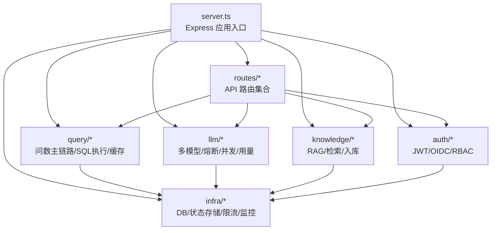
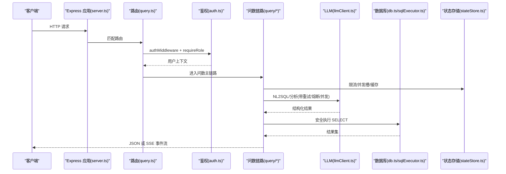
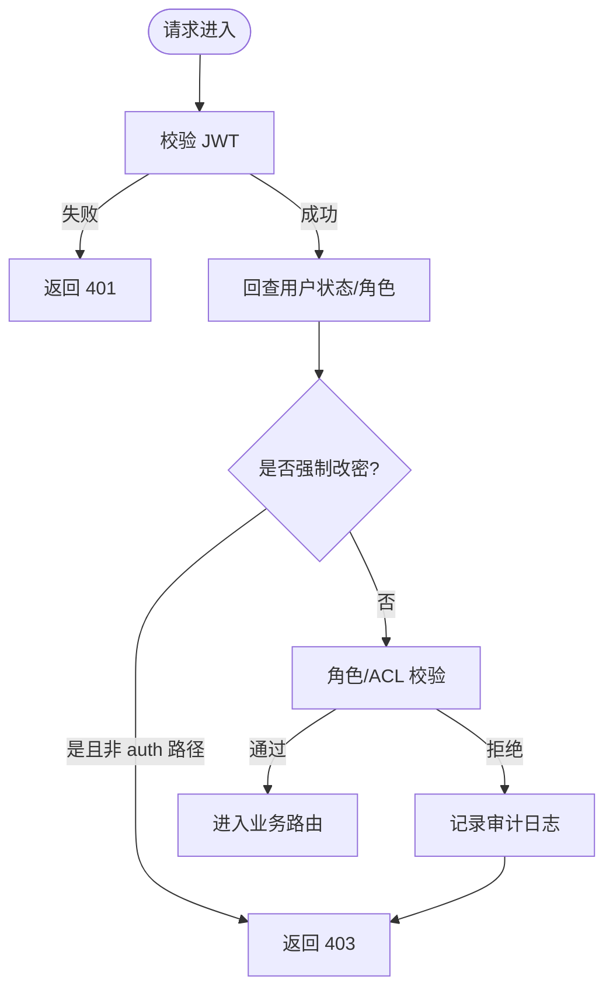
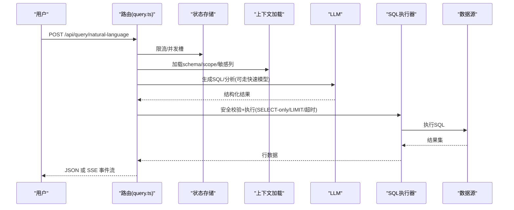
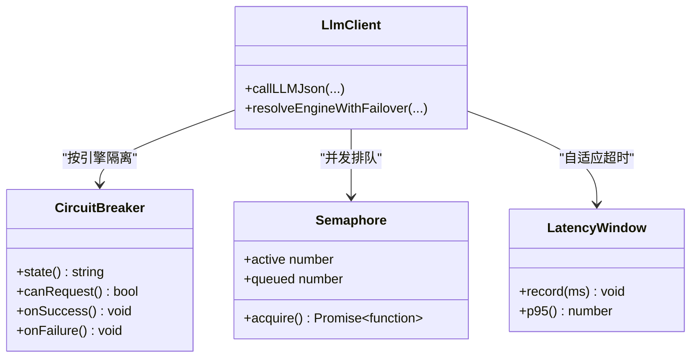
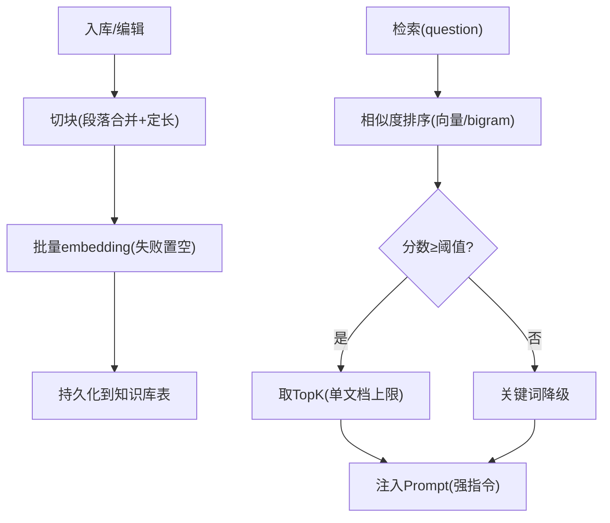
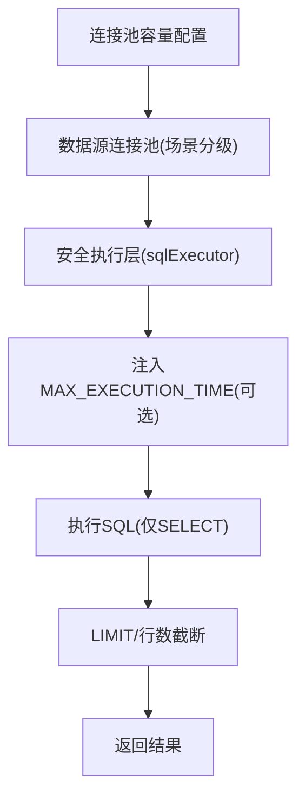
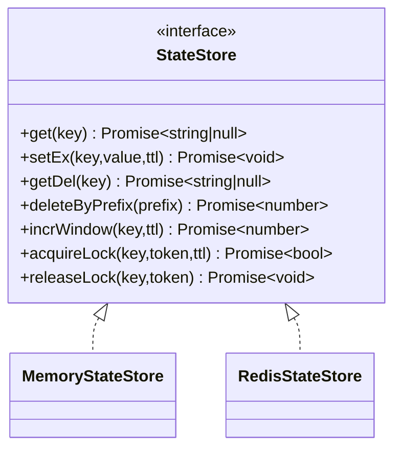
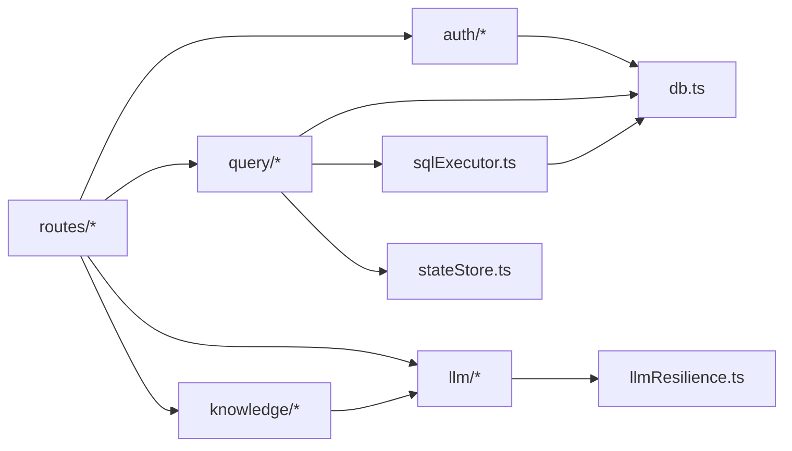

# 后端服务

<cite>
**本文引用的文件**
- [server.ts](file://server.ts)
- [package.json](file://package.json)
- [server/routes/query.ts](file://server/routes/query.ts)
- [server/infra/db.ts](file://server/infra/db.ts)
- [server/llm/llmClient.ts](file://server/llm/llmClient.ts)
- [server/knowledge/knowledgeBase.ts](file://server/knowledge/knowledgeBase.ts)
- [server/auth/auth.ts](file://server/auth/auth.ts)
- [server/infra/errorCodes.ts](file://server/infra/errorCodes.ts)
- [server/query/sqlExecutor.ts](file://server/query/sqlExecutor.ts)
- [server/llm/llmResilience.ts](file://server/llm/llmResilience.ts)
- [server/infra/stateStore.ts](file://server/infra/stateStore.ts)
- [server/routes/auth.ts](file://server/routes/auth.ts)
</cite>

## 目录
1. [简介](#简介)
2. [项目结构](#项目结构)
3. [核心组件](#核心组件)
4. [架构总览](#架构总览)
5. [详细组件分析](#详细组件分析)
6. [依赖关系分析](#依赖关系分析)
7. [性能考量](#性能考量)
8. [故障排查指南](#故障排查指南)
9. [结论](#结论)
10. [附录](#附录)

## 简介
本文件为“智能问数据分析系统”后端服务的综合技术文档，聚焦基于 Express.js 的 RESTful API 架构与核心业务模块。内容涵盖：
- 路由组织、中间件机制、错误处理策略
- 查询处理引擎（NL2SQL 转换、SQL 执行、结果分析）
- LLM 集成层（多模型支持、熔断降级、并发控制）
- 知识库管理（CRUD、语义搜索、外部集成）
- 权限控制系统（RBAC、资源访问控制、审计日志）
- 数据库连接池管理、缓存策略、消息队列集成
- API 设计规范、请求响应格式、错误码定义
- 性能调优、安全加固、监控埋点等企业级特性

## 项目结构
后端采用 Express 应用作为入口，集中注册全局中间件与安全头，按功能域拆分路由模块；核心能力分布在 query、llm、knowledge、auth、infra 等子目录中。启动时完成数据库初始化、任务队列与清理调度、SSE 重放缓冲清扫、漂移检测等基础设施预热。

图表来源
- [server.ts:82-265](file://server.ts#L82-L265)
- [server/routes/query.ts:1-45](file://server/routes/query.ts#L1-L45)

章节来源
- [server.ts:82-265](file://server.ts#L82-L265)
- [package.json:1-25](file://package.json#L1-L25)

## 核心组件
- 应用入口与中间件链：统一 JSON Body 大小限制、安全响应头、请求日志、Prometheus 耗时直方图、健康检查与系统信息接口。
- 认证与授权：JWT 签发与校验、角色守卫、强制改密拦截、OIDC 登录流程。
- 问数主链路：输入清洗、权限与频率限制、上下文加载、计划模式、双链路（live/simulated）、SSE 流式输出与断线续传、推导留痕与回放。
- SQL 安全执行层：SELECT-only、表白名单、敏感列拒绝、强制 LIMIT、超时保护、场景化连接池与超时。
- LLM 集成层：多引擎（Ollama/Gemini/Qwen）、阶段级路由、重试、熔断、并发信号量、自适应超时、用量统计。
- 知识库 RAG：文本切块、向量嵌入与相似度检索、关键词降级、高价值文档保留槽位、Prompt 注入。
- 状态存储抽象：内存/Redis 双实现，提供 TTL、原子计数、分布式锁、前缀删除等能力。
- 监控与可观测性：请求日志、Prometheus 指标、审计日志、SSE 事件重放缓冲。

章节来源
- [server.ts:133-183](file://server.ts#L133-L183)
- [server/auth/auth.ts:60-127](file://server/auth/auth.ts#L60-L127)
- [server/routes/query.ts:46-200](file://server/routes/query.ts#L46-L200)
- [server/query/sqlExecutor.ts:1-110](file://server/query/sqlExecutor.ts#L1-L110)
- [server/llm/llmClient.ts:1-120](file://server/llm/llmClient.ts#L1-L120)
- [server/knowledge/knowledgeBase.ts:1-166](file://server/knowledge/knowledgeBase.ts#L1-L166)
- [server/infra/stateStore.ts:1-200](file://server/infra/stateStore.ts#L1-L200)

## 架构总览
整体采用分层架构：路由层负责鉴权、限流、参数校验与编排；业务层封装问数链路、报告生成、知识管理等；基础设施层提供 DB、状态存储、监控、审计、任务队列等通用能力。LLM 调用通过统一通道接入，具备韧性保障。

图表来源
- [server.ts:133-183](file://server.ts#L133-L183)
- [server/routes/query.ts:46-200](file://server/routes/query.ts#L46-L200)
- [server/auth/auth.ts:60-127](file://server/auth/auth.ts#L60-L127)
- [server/llm/llmClient.ts:120-200](file://server/llm/llmClient.ts#L120-L200)
- [server/query/sqlExecutor.ts:1-110](file://server/query/sqlExecutor.ts#L1-L110)
- [server/infra/stateStore.ts:1-200](file://server/infra/stateStore.ts#L1-L200)

## 详细组件分析

### 认证与权限控制（RBAC、资源访问控制、审计）
- JWT 签发与校验：在鉴权中间件中验证 token，并回查 users 表确保账号状态与角色最新；支持强制首次改密拦截。
- 角色守卫：requireRole 用于细粒度路由级权限控制。
- 数据源访问控制：非管理员需命中部门/个人 ACL 清单方可访问指定数据源。
- 审计日志：关键决策点（拒绝、限流、开关关闭等）写入审计表，便于追溯。

图表来源
- [server/auth/auth.ts:60-127](file://server/auth/auth.ts#L60-L127)
- [server/routes/query.ts:58-68](file://server/routes/query.ts#L58-L68)
- [server/infra/db.ts:181-199](file://server/infra/db.ts#L181-L199)

章节来源
- [server/auth/auth.ts:60-127](file://server/auth/auth.ts#L60-L127)
- [server/routes/auth.ts:41-156](file://server/routes/auth.ts#L41-L156)
- [server/routes/query.ts:58-68](file://server/routes/query.ts#L58-L68)
- [server/infra/db.ts:181-199](file://server/infra/db.ts#L181-L199)

### 问数主链路（NL2SQL、SQL 执行、结果分析）
- 输入清洗与注入防护：过滤非法字符、拒绝注入特征、长度截断。
- 模型自选与单位口径：请求级覆盖引擎/模型，金额单位白名单校验，影响缓存键。
- 频率与并发控制：每用户滑动窗口限频，同用户并发槽互斥，断开自动释放。
- 上下文加载：落库 schema + scope 白名单 + 敏感列过滤，5 分钟缓存。
- 双阶段真实执行：数据库型数据源启用 live 链路（LLM 生成 SQL → 安全执行 → 真实 rows 回喂分析）。
- 计划模式：先生成计划，用户批准后携带 planId 执行，防篡改与过期校验。
- SSE 流式与断线续传：事件入缓冲，支持按 traceId + 序号续传，不重新执行 SQL。
- 推导留痕：traceId 全链路旁路落库，前端可回放。

图表来源
- [server/routes/query.ts:46-200](file://server/routes/query.ts#L46-L200)
- [server/query/sqlExecutor.ts:1-110](file://server/query/sqlExecutor.ts#L1-L110)
- [server/llm/llmClient.ts:120-200](file://server/llm/llmClient.ts#L120-L200)
- [server/infra/stateStore.ts:1-200](file://server/infra/stateStore.ts#L1-L200)

章节来源
- [server/routes/query.ts:46-200](file://server/routes/query.ts#L46-L200)
- [server/query/sqlExecutor.ts:1-110](file://server/query/sqlExecutor.ts#L1-L110)

### LLM 集成层（多模型、熔断降级、并发控制）
- 多引擎支持：Ollama、Gemini、Qwen（OpenAI 兼容），按环境变量与密钥可用性选择。
- 阶段级路由：SQL 生成与分析解读可分别配置快速小模型以提升吞吐。
- 韧性保障：指数退避重试、引擎级熔断（连续失败开路/冷却半开探测）、并发信号量（默认每引擎 4）。
- 自适应超时：以近期 P95×3 动态收紧上限，避免慢模型误杀或快模型被长超时拖累。
- 用量统计：按用户聚合，支撑成本对比与审计。

图表来源
- [server/llm/llmResilience.ts:90-200](file://server/llm/llmResilience.ts#L90-L200)
- [server/llm/llmClient.ts:120-200](file://server/llm/llmClient.ts#L120-L200)

章节来源
- [server/llm/llmClient.ts:1-120](file://server/llm/llmClient.ts#L1-L120)
- [server/llm/llmResilience.ts:1-200](file://server/llm/llmResilience.ts#L1-L200)

### 知识库管理（CRUD、语义搜索、外部集成）
- 文本切块：按段落合并、定长切分、重叠防止语义断裂。
- 向量检索：embedding 余弦相似度排序，阈值过滤无关片段；无 embedding 时降级 bigram 关键词检索。
- 高价值文档优先：标题命中“口径/指南/速查/规则/枚举/对比/模式”的文档保留一个槽位，避免被字段字典挤占。
- Prompt 注入：将命中片段格式化后注入阶段一提示词，约束口径/术语/枚举，不放开表列白名单。
- 持久化：批量 embedding 入库，失败置空走关键词降级，保证可用。

图表来源
- [server/knowledge/knowledgeBase.ts:43-166](file://server/knowledge/knowledgeBase.ts#L43-L166)

章节来源
- [server/knowledge/knowledgeBase.ts:1-200](file://server/knowledge/knowledgeBase.ts#L1-L200)

### 数据库连接池与查询场景分级
- 应用库连接池：容量公式化，默认按并发用户数/2，上下限钳制，启动时建库建表与种子数据。
- 数据源连接池：按场景分级（交互/分析链/导出）独立配额与超时，避免大导出阻塞交互。
- MySQL 执行时限：对 SELECT 注入 MAX_EXECUTION_TIME hint（含 WITH 链定位），驱动层 query timeout 兜底。
- 安全执行：SELECT-only、表名白名单、敏感列拒绝、强制 LIMIT、单语句、执行超时、结果行数截断。

图表来源
- [server/infra/db.ts:29-70](file://server/infra/db.ts#L29-L70)
- [server/query/sqlExecutor.ts:44-110](file://server/query/sqlExecutor.ts#L44-L110)
- [server/query/sqlExecutor.ts:111-153](file://server/query/sqlExecutor.ts#L111-L153)

章节来源
- [server/infra/db.ts:29-70](file://server/infra/db.ts#L29-L70)
- [server/query/sqlExecutor.ts:44-153](file://server/query/sqlExecutor.ts#L44-L153)

### 缓存策略与状态存储
- 状态存储抽象：MemoryStateStore（单机默认）与 RedisStateStore（多实例共享）；提供 TTL、原子计数、分布式锁、前缀删除。
- 预热：启动时等待 Redis 就绪，消除冷启动窗口内的限流/缓存抖动。
- 问数缓存：按模型变体与金额单位区分缓存键，避免口径串扰。
- SSE 重放缓冲：事件先入缓冲再写流，支持断线续传。

图表来源
- [server/infra/stateStore.ts:10-23](file://server/infra/stateStore.ts#L10-L23)
- [server/infra/stateStore.ts:32-98](file://server/infra/stateStore.ts#L32-L98)
- [server/infra/stateStore.ts:105-163](file://server/infra/stateStore.ts#L105-L163)

章节来源
- [server/infra/stateStore.ts:1-200](file://server/infra/stateStore.ts#L1-L200)
- [server/routes/query.ts:118-153](file://server/routes/query.ts#L118-L153)

### 消息队列与异步任务
- 任务队列：注册处理器并启动内置 worker，支持孤儿任务恢复。
- 路由暴露：/api/tasks 查询与下载异步任务结果。
- 典型用途：报告导出、PDF 生成、批量导入等耗时操作。

章节来源
- [server.ts:124-126](file://server.ts#L124-L126)
- [server/routes/tasks.ts:1-200](file://server/routes/tasks.ts#L1-L200)

## 依赖关系分析
- 路由层依赖鉴权、限流、审计、问数链路、LLM、知识库、状态存储等模块。
- 问数链路依赖 SQL 安全执行层、上下文加载、缓存、SSE 重放缓冲。
- LLM 层依赖韧性原语（重试、熔断、信号量、自适应超时）与用量统计。
- 知识库依赖 embedding 能力与关键词降级。
- 基础设施层提供 DB 连接池、状态存储、监控、审计、加密等。

图表来源
- [server.ts:223-265](file://server.ts#L223-L265)
- [server/routes/query.ts:17-43](file://server/routes/query.ts#L17-L43)
- [server/llm/llmClient.ts:1-26](file://server/llm/llmClient.ts#L1-L26)
- [server/knowledge/knowledgeBase.ts:1-12](file://server/knowledge/knowledgeBase.ts#L1-L12)
- [server/query/sqlExecutor.ts:11-22](file://server/query/sqlExecutor.ts#L11-L22)
- [server/infra/db.ts:1-12](file://server/infra/db.ts#L1-L12)

章节来源
- [server.ts:223-265](file://server.ts#L223-L265)

## 性能考量
- 连接池容量公式化：应用库按并发用户数/2，数据源连接池按场景分级，避免打爆数据源端 max_connections。
- 执行超时与 LIMIT：MySQL MAX_EXECUTION_TIME hint + 驱动层超时兜底，强制 LIMIT 与行数截断防 OOM。
- LLM 并发与重试：每引擎并发信号量限制，指数退避重试，熔断保护，自适应超时提升稳定性。
- 缓存与 SSE：问数结果缓存、SSE 事件缓冲减少重复计算与网络开销。
- 监控埋点：Prometheus 直方图记录 API 耗时，审计日志记录关键决策点。

[本节为通用性能指导，无需特定文件引用]

## 故障排查指南
- 未捕获异常与未处理拒绝：进程级监听 unhandledRejection/uncaughtException，记录日志避免崩溃。
- 全局错误处理：Express 全局错误中间件统一返回 JSON，避免 HTML 错误页导致前端解析失败。
- 404 兜底：/api/* 未匹配返回 JSON，避免默认 HTML。
- 常见错误码：INVALID_INPUT、FORBIDDEN、DS_ACCESS_DENIED、RATE_LIMITED、QUERY_IN_FLIGHT、PLAN_INVALID/MISMATCH、SQL_REJECTED、LLM_UNAVAILABLE、INTERNAL_ERROR。

章节来源
- [server.ts:72-80](file://server.ts#L72-L80)
- [server.ts:267-280](file://server.ts#L267-L280)
- [server/infra/errorCodes.ts:1-36](file://server/infra/errorCodes.ts#L1-L36)

## 结论
本后端服务以 Express 为核心，围绕“问数主链路”构建了从输入清洗、权限校验、上下文加载、LLM 调用、SQL 安全执行到结果分析与流式输出的完整闭环。通过韧性化的 LLM 集成、场景化的数据库连接池、可插拔的状态存储与完善的监控审计，满足企业级在生产环境的高可用、可扩展与安全合规需求。建议在生产部署中合理配置 JWT_SECRET、LLM 相关环境变量与连接池容量，并结合 Prometheus/Grafana 进行持续观测与调优。

[本节为总结性内容，无需特定文件引用]

## 附录

### API 设计规范与示例
- 基础规范
  - 路径前缀：/api/*
  - 认证：Bearer Token（部分公开端点除外）
  - 内容类型：application/json（部分导出/导入放宽 body 大小）
  - 错误响应：包含 error 与 code 字段
- 典型端点
  - POST /api/query/natural-language：智能问数主链路（支持 stream=true 返回 SSE）
  - GET /api/query/stream-replay/:traceId：SSE 断线续传
  - GET /api/query/trace/:traceId：推导过程回放
  - POST /api/query/plan：计划模式
  - POST /api/query/feedback：反馈闭环
  - POST /api/query/execute-sql：安全执行 SELECT
  - POST /api/query/sql-assist：SQL 助手
  - POST /api/query/drill：图表下钻
  - GET /api/health：健康检查
  - GET /metrics：Prometheus 指标
  - GET /api/system/engine：当前 AI 引擎信息
  - GET /api/system/models：可用模型目录
  - GET /api/system/llm-usage：LLM 用量统计（ADMIN）
  - POST /api/auth/login：登录
  - GET /api/auth/me：当前用户
  - POST /api/auth/change-password：修改密码
  - GET /api/auth/oidc/status：OIDC 状态
  - GET /api/auth/oidc/login：OIDC 登录跳转
  - GET /api/auth/oidc/callback：OIDC 回调
- 请求/响应约定
  - 请求体：JSON，字段见各路由说明（如 query、history、stream、model、amountUnit、dataSourceId、planId 等）
  - 响应体：{ success?: boolean; data?: any; error?: string; code?: string }
  - SSE：Content-Type: text/event-stream，事件 id/event/data 格式

章节来源
- [server/routes/query.ts:1-45](file://server/routes/query.ts#L1-L45)
- [server/routes/auth.ts:41-156](file://server/routes/auth.ts#L41-L156)
- [server.ts:187-221](file://server.ts#L187-L221)
- [server/infra/errorCodes.ts:1-36](file://server/infra/errorCodes.ts#L1-L36)

### 错误码定义
- INVALID_INPUT：请求参数校验失败（含输入超长/指令内容被拒）
- FORBIDDEN：角色或权限不足
- DS_ACCESS_DENIED：无该数据源访问权限
- AI_SWITCHED_OFF：管理员已停用该数据源的智能问数功能
- RATE_LIMITED：触发限流
- QUERY_IN_FLIGHT：同一数据源上一个查询仍在进行中
- PLAN_INVALID：分析计划无效或已过期
- PLAN_MISMATCH：提交问题与分析计划不匹配
- NOT_FOUND：目标资源不存在
- CONFLICT：资源冲突
- SQL_REJECTED：SQL 未通过安全校验被拒绝执行
- LLM_UNAVAILABLE：AI/LLM 服务不可用
- INTERNAL_ERROR：服务端内部错误

章节来源
- [server/infra/errorCodes.ts:1-36](file://server/infra/errorCodes.ts#L1-L36)