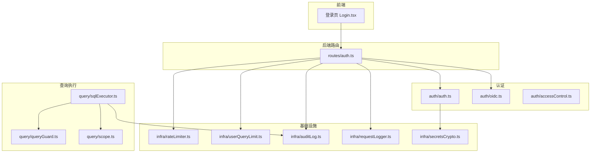
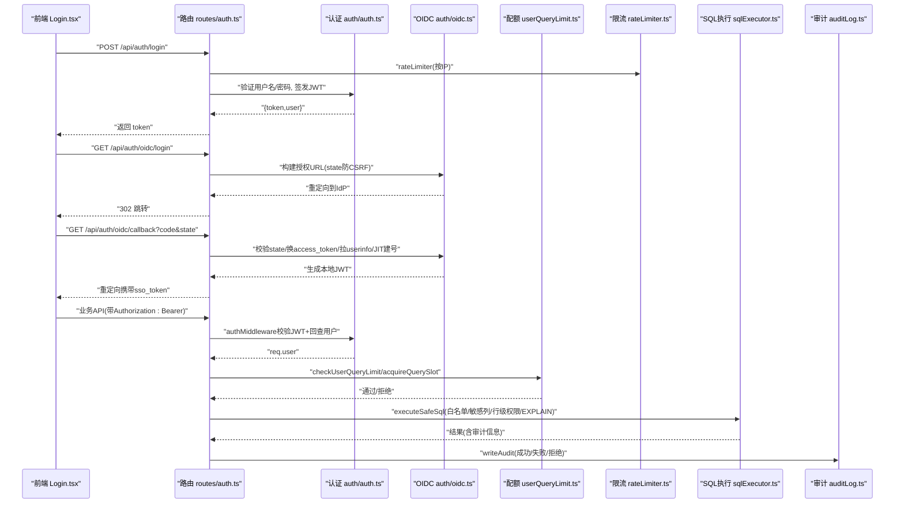
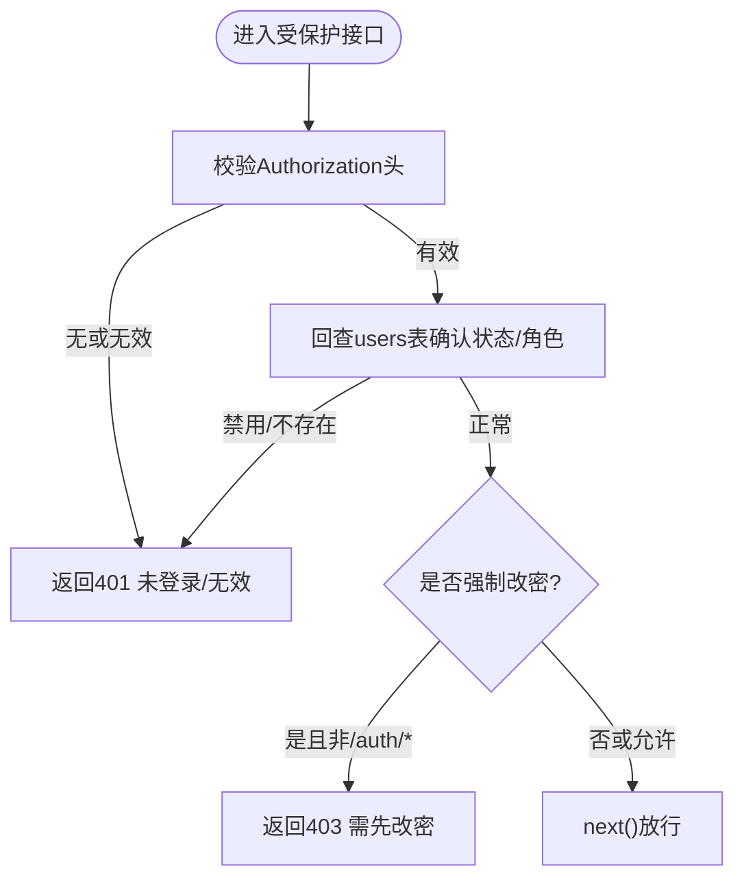
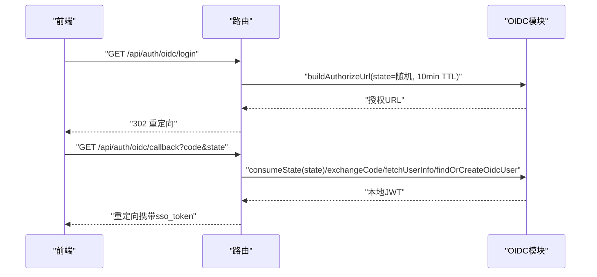
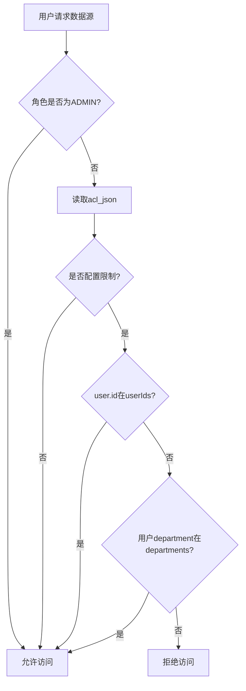
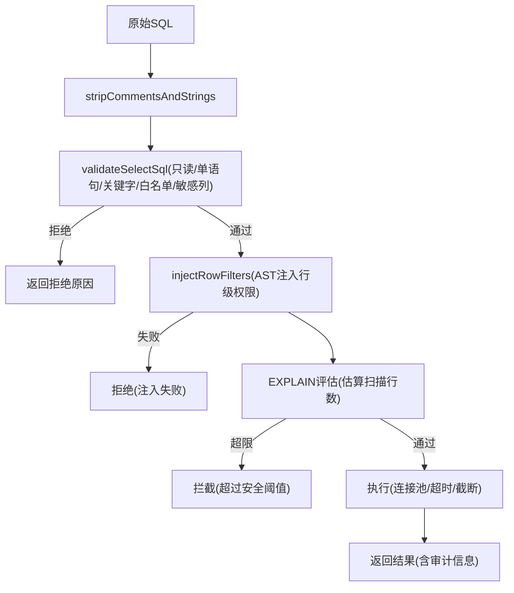
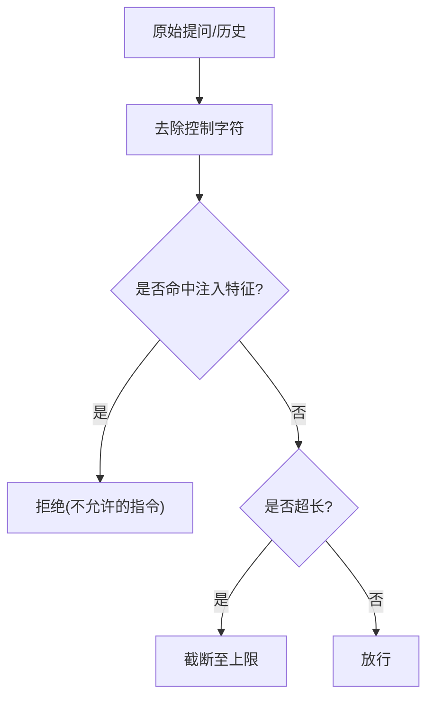
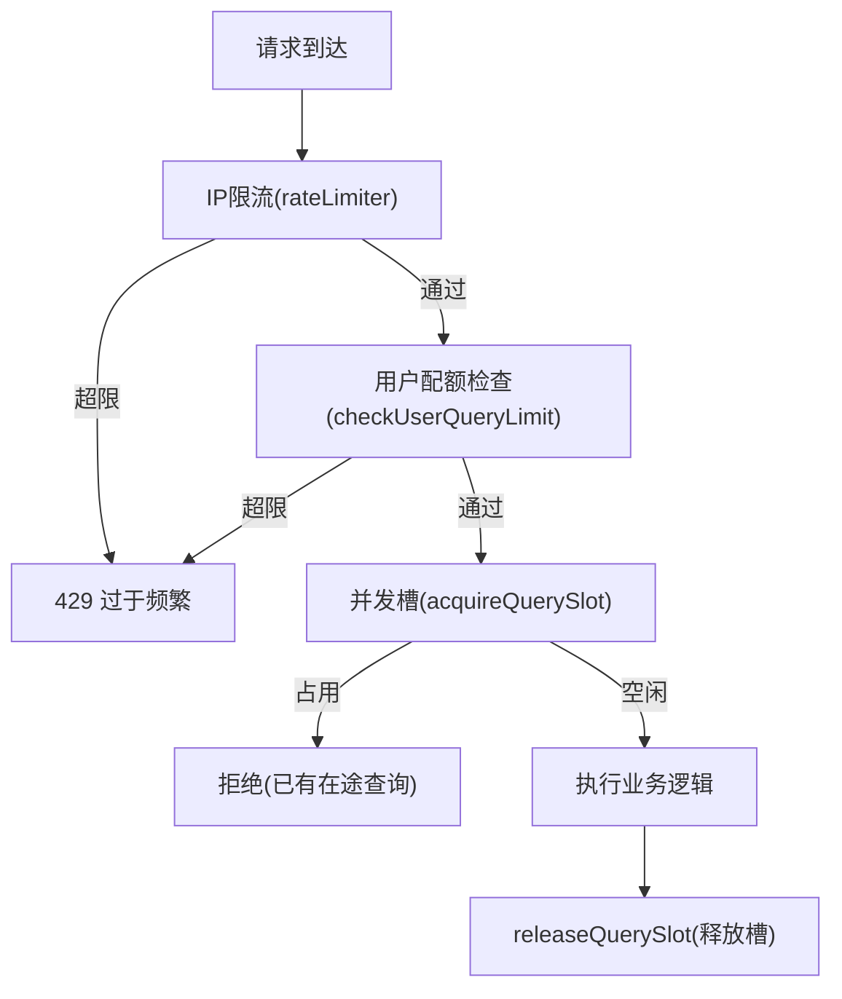
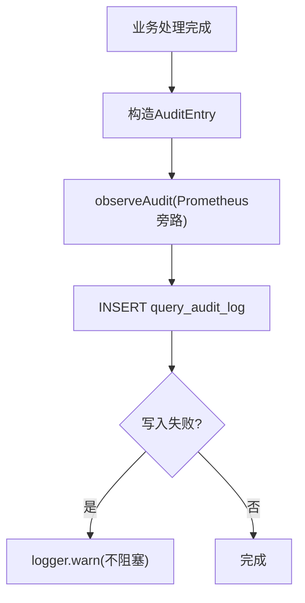
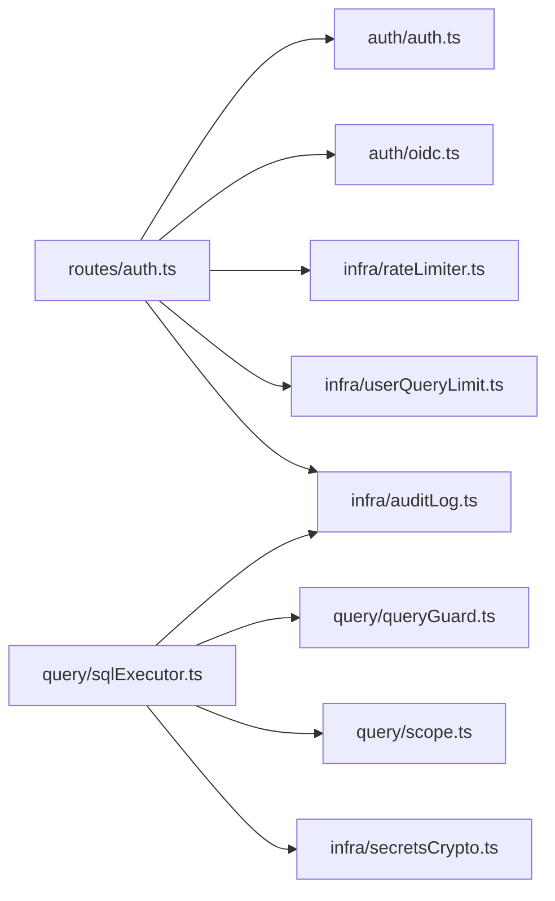

# 安全与认证

<cite>
**本文引用的文件**
- [server/auth/auth.ts](file://server/auth/auth.ts)
- [server/auth/oidc.ts](file://server/auth/oidc.ts)
- [server/auth/accessControl.ts](file://server/auth/accessControl.ts)
- [server/routes/auth.ts](file://server/routes/auth.ts)
- [server/query/sqlExecutor.ts](file://server/query/sqlExecutor.ts)
- [server/query/queryGuard.ts](file://server/query/queryGuard.ts)
- [server/query/scope.ts](file://server/query/scope.ts)
- [server/infra/rateLimiter.ts](file://server/infra/rateLimiter.ts)
- [server/infra/userQueryLimit.ts](file://server/infra/userQueryLimit.ts)
- [server/infra/auditLog.ts](file://server/infra/auditLog.ts)
- [server/infra/secretsCrypto.ts](file://server/infra/secretsCrypto.ts)
- [server/infra/requestLogger.ts](file://server/infra/requestLogger.ts)
- [src/components/auth/Login.tsx](file://src/components/auth/Login.tsx)
</cite>

## 目录
1. [简介](#简介)
2. [项目结构](#项目结构)
3. [核心组件](#核心组件)
4. [架构总览](#架构总览)
5. [详细组件分析](#详细组件分析)
6. [依赖关系分析](#依赖关系分析)
7. [性能与安全权衡](#性能与安全权衡)
8. [故障排查指南](#故障排查指南)
9. [结论](#结论)
10. [附录：配置与合规清单](#附录配置与合规清单)

## 简介
本章节面向“智能问数据分析系统”的安全与认证体系，覆盖以下主题：
- JWT 令牌认证机制、OIDC 企业登录集成（授权码流程 + JIT 建号）
- RBAC 权限模型与数据源访问控制（ACL）
- SQL 注入防护、XSS/提示注入防护、CSRF 保护策略
- 数据脱敏机制、访问审计日志、操作追踪
- 速率限制、用户级配额与并发互斥、会话管理
- 安全配置指南、漏洞防护方案与合规性要求

## 项目结构
安全相关代码主要分布在 server/auth、server/routes、server/query、server/infra 以及前端登录页面。整体采用分层设计：
- 认证层：JWT 签发/校验、OIDC 集成、密码强度与哈希
- 路由层：登录、当前用户、改密、OIDC 回调等接口
- 执行层：SQL 安全执行、范围过滤、行级权限注入、EXPLAIN 防线
- 基础设施层：限流、用户配额、审计日志、请求追踪、凭据加密
- 前端层：登录页与企业统一登录入口展示

图表来源
- [server/routes/auth.ts:1-156](file://server/routes/auth.ts#L1-L156)
- [server/auth/auth.ts:1-127](file://server/auth/auth.ts#L1-L127)
- [server/auth/oidc.ts:1-244](file://server/auth/oidc.ts#L1-L244)
- [server/query/sqlExecutor.ts:1-832](file://server/query/sqlExecutor.ts#L1-L832)
- [server/query/queryGuard.ts:1-101](file://server/query/queryGuard.ts#L1-L101)
- [server/query/scope.ts:1-101](file://server/query/scope.ts#L1-L101)
- [server/infra/rateLimiter.ts:1-54](file://server/infra/rateLimiter.ts#L1-L54)
- [server/infra/userQueryLimit.ts:1-98](file://server/infra/userQueryLimit.ts#L1-L98)
- [server/infra/auditLog.ts:1-62](file://server/infra/auditLog.ts#L1-L62)
- [server/infra/requestLogger.ts:1-36](file://server/infra/requestLogger.ts#L1-L36)
- [server/infra/secretsCrypto.ts:1-50](file://server/infra/secretsCrypto.ts#L1-L50)
- [src/components/auth/Login.tsx:1-137](file://src/components/auth/Login.tsx#L1-L137)

章节来源
- [server/routes/auth.ts:1-156](file://server/routes/auth.ts#L1-L156)
- [server/auth/auth.ts:1-127](file://server/auth/auth.ts#L1-L127)
- [server/auth/oidc.ts:1-244](file://server/auth/oidc.ts#L1-L244)
- [server/query/sqlExecutor.ts:1-832](file://server/query/sqlExecutor.ts#L1-L832)
- [server/query/queryGuard.ts:1-101](file://server/query/queryGuard.ts#L1-L101)
- [server/query/scope.ts:1-101](file://server/query/scope.ts#L1-L101)
- [server/infra/rateLimiter.ts:1-54](file://server/infra/rateLimiter.ts#L1-L54)
- [server/infra/userQueryLimit.ts:1-98](file://server/infra/userQueryLimit.ts#L1-L98)
- [server/infra/auditLog.ts:1-62](file://server/infra/auditLog.ts#L1-L62)
- [server/infra/requestLogger.ts:1-36](file://server/infra/requestLogger.ts#L1-L36)
- [server/infra/secretsCrypto.ts:1-50](file://server/infra/secretsCrypto.ts#L1-L50)
- [src/components/auth/Login.tsx:1-137](file://src/components/auth/Login.tsx#L1-L137)

## 核心组件
- JWT 认证中间件：校验 Bearer Token，回查用户状态并附加 req.user；强制首次改密；角色守卫 requireRole
- OIDC 企业登录：授权码流程、state 防 CSRF、JIT 建号/同步、默认角色
- RBAC 与 ACL：基于角色的访问控制与数据源部门/个人维度 ACL
- SQL 安全执行：SELECT-only、白名单表、敏感列拒绝、AST 复核、行级权限注入、EXPLAIN 防线、结果截断
- 输入净化与提示注入防护：长度限制、控制字符清理、注入特征拦截
- 速率限制与用户配额：IP 级限流、用户级每小时次数上限、同用户并发互斥
- 审计与追踪：全链路审计落库、请求 ID 贯穿、Prometheus 埋点
- 凭据加密：AES-256-GCM 加密数据源密码，密钥派生自环境变量

章节来源
- [server/auth/auth.ts:1-127](file://server/auth/auth.ts#L1-L127)
- [server/auth/oidc.ts:1-244](file://server/auth/oidc.ts#L1-L244)
- [server/auth/accessControl.ts:1-108](file://server/auth/accessControl.ts#L1-L108)
- [server/query/sqlExecutor.ts:1-832](file://server/query/sqlExecutor.ts#L1-L832)
- [server/query/queryGuard.ts:1-101](file://server/query/queryGuard.ts#L1-L101)
- [server/infra/rateLimiter.ts:1-54](file://server/infra/rateLimiter.ts#L1-L54)
- [server/infra/userQueryLimit.ts:1-98](file://server/infra/userQueryLimit.ts#L1-L98)
- [server/infra/auditLog.ts:1-62](file://server/infra/auditLog.ts#L1-L62)
- [server/infra/secretsCrypto.ts:1-50](file://server/infra/secretsCrypto.ts#L1-L50)

## 架构总览
下图展示了从前端登录到后端认证、OIDC 集成、SQL 安全执行的完整调用链。

图表来源
- [server/routes/auth.ts:1-156](file://server/routes/auth.ts#L1-L156)
- [server/auth/auth.ts:1-127](file://server/auth/auth.ts#L1-L127)
- [server/auth/oidc.ts:1-244](file://server/auth/oidc.ts#L1-L244)
- [server/infra/userQueryLimit.ts:1-98](file://server/infra/userQueryLimit.ts#L1-L98)
- [server/infra/rateLimiter.ts:1-54](file://server/infra/rateLimiter.ts#L1-L54)
- [server/query/sqlExecutor.ts:1-832](file://server/query/sqlExecutor.ts#L1-L832)
- [server/infra/auditLog.ts:1-62](file://server/infra/auditLog.ts#L1-L62)

## 详细组件分析

### JWT 令牌认证与 RBAC
- 令牌签发：使用 jwt.sign 将用户标识、用户名、角色写入载荷，有效期由环境变量控制；未配置密钥时进程级随机密钥（重启失效），生产必须配置固定强密钥
- 令牌校验：authMiddleware 解析 Bearer Token，verify 成功后回查 users 表确认账号状态与角色变更立即生效；注入 LLM 用户上下文；若 must_change_password 为真且非 /api/auth/* 路径则拒绝
- RBAC：requireRole 中间件校验角色，支持多角色白名单

图表来源
- [server/auth/auth.ts:60-127](file://server/auth/auth.ts#L60-L127)

章节来源
- [server/auth/auth.ts:1-127](file://server/auth/auth.ts#L1-L127)

### OIDC 企业登录集成
- 授权码流程：前端通过 /api/auth/oidc/status 判断是否启用；/login 重定向至 IdP；回调 /callback 校验 state、交换 access_token、获取 userinfo、JIT 建号/同步、签发本地 JWT 并重定向回前端
- CSRF 防护：state 一次性票据，内存 Map 或 Redis 存储，TTL 10 分钟；消费后删除
- 发现端点缓存：/.well-known/openid-configuration 缓存 1 小时
- 用户名规整：转为合法本地用户名，过短补前缀；JIT 建号默认角色可配

图表来源
- [server/routes/auth.ts:116-153](file://server/routes/auth.ts#L116-L153)
- [server/auth/oidc.ts:62-189](file://server/auth/oidc.ts#L62-L189)
- [server/auth/oidc.ts:191-244](file://server/auth/oidc.ts#L191-L244)

章节来源
- [server/routes/auth.ts:116-153](file://server/routes/auth.ts#L116-L153)
- [server/auth/oidc.ts:1-244](file://server/auth/oidc.ts#L1-L244)
- [src/components/auth/Login.tsx:14-125](file://src/components/auth/Login.tsx#L14-L125)

### 数据源访问控制（ACL）与 RBAC 协同
- ACL 模型：data_sources.acl_json 包含 departments 与 userIds；为空表示不限制；否则仅 ADMIN、清单内部门成员、清单内个人用户可访问
- 判定逻辑：canAccessDataSource 纯函数判定；checkDataSourceAccess 加载 ACL 并判定
- 审批并入：grantUserAccess 幂等加入个人授权

图表来源
- [server/auth/accessControl.ts:18-73](file://server/auth/accessControl.ts#L18-L73)

章节来源
- [server/auth/accessControl.ts:1-108](file://server/auth/accessControl.ts#L1-L108)

### SQL 注入防护与执行安全
- 只读与单语句：仅允许 SELECT 开头（WITH 除外），分号仅允许末尾；禁止 INTO、危险关键字
- 白名单与 AST 复核：提取 FROM/JOIN 表名，结合 scope 白名单；node-sql-parser 进行语法树级复核
- 敏感列拒绝：匹配裸列名，命中即拒绝
- 行级权限注入：AST 包裹派生表，递归处理子查询/UNION/CTE，谓词非法 fail-closed
- EXPLAIN 防线：预估扫描行数超阈值拦截；MySQL/PG 兼容解析
- 结果截断与超时：MAX_ROWS 截断；MySQL MAX_EXECUTION_TIME hint；驱动连接/语句超时

图表来源
- [server/query/sqlExecutor.ts:155-387](file://server/query/sqlExecutor.ts#L155-L387)
- [server/query/sqlExecutor.ts:389-489](file://server/query/sqlExecutor.ts#L389-L489)
- [server/query/sqlExecutor.ts:531-662](file://server/query/sqlExecutor.ts#L531-L662)
- [server/query/sqlExecutor.ts:733-800](file://server/query/sqlExecutor.ts#L733-L800)

章节来源
- [server/query/sqlExecutor.ts:1-832](file://server/query/sqlExecutor.ts#L1-L832)

### 输入净化与提示注入防护（XSS/LLM 提示注入）
- 长度限制：最大 500 字，超长截断
- 控制字符清理：剥离不可见控制字符
- 注入特征拦截：忽略指令、越狱模式等关键词命中即拒绝
- 历史净化：仅保留 user 消息，丢弃 assistant 输出，防止模型输出回流污染上下文

图表来源
- [server/query/queryGuard.ts:7-69](file://server/query/queryGuard.ts#L7-L69)

章节来源
- [server/query/queryGuard.ts:1-101](file://server/query/queryGuard.ts#L1-L101)

### 速率限制、用户配额与会话管理
- IP 级限流：rateLimiter 按 IP 滑动窗口计数；Redis 模式多实例共享；超限返回 429
- 用户级配额：userQueryLimit 每小时次数上限；Redis 模式固定小时窗口 INCR；失败 fail-closed
- 并发互斥：同一用户同一时间仅一个进行中的查询；Redis 分布式锁或内存 token 绑定；释放时比对 token 防误删
- 会话管理：JWT 作为会话凭证；服务端强制首次改密；OIDC state 一次性票据防 CSRF

图表来源
- [server/infra/rateLimiter.ts:14-54](file://server/infra/rateLimiter.ts#L14-L54)
- [server/infra/userQueryLimit.ts:23-81](file://server/infra/userQueryLimit.ts#L23-L81)

章节来源
- [server/infra/rateLimiter.ts:1-54](file://server/infra/rateLimiter.ts#L1-L54)
- [server/infra/userQueryLimit.ts:1-98](file://server/infra/userQueryLimit.ts#L1-L98)

### 数据脱敏与审计日志
- 数据脱敏：敏感列在 schema 层面被剔除（password、secret、token、身份证等），避免进入 LLM 上下文；SQL 中引用敏感列直接拒绝
- 审计日志：writeAudit 记录用户、端点、数据源、问题、状态、执行 SQL、行数、耗时；写入失败仅告警不阻塞主流程
- 请求追踪：requestLogger 生成 requestId，响应头回传 X-Request-Id，便于关联排查

图表来源
- [server/infra/auditLog.ts:38-62](file://server/infra/auditLog.ts#L38-L62)
- [server/infra/requestLogger.ts:19-36](file://server/infra/requestLogger.ts#L19-L36)

章节来源
- [server/infra/auditLog.ts:1-62](file://server/infra/auditLog.ts#L1-L62)
- [server/infra/requestLogger.ts:1-36](file://server/infra/requestLogger.ts#L1-L36)

### 凭据加密与密码安全
- 数据源凭据：AES-256-GCM 加密落库，密钥派生自 DS_SECRET_KEY 或 JWT_SECRET；明文存量兼容
- 密码哈希：scrypt 参数 N=2^15、r=8、p=1，可选 pepper；新格式兼容旧格式；弱口令黑名单；强制首次改密

章节来源
- [server/infra/secretsCrypto.ts:1-50](file://server/infra/secretsCrypto.ts#L1-L50)
- [server/auth/passwords.ts:1-100](file://server/auth/passwords.ts#L1-L100)
- [server/routes/auth.ts:84-114](file://server/routes/auth.ts#L84-L114)

## 依赖关系分析
- 路由依赖认证与限流：routes/auth 依赖 auth/auth、auth/oidc、infra/rateLimiter、infra/userQueryLimit、infra/auditLog
- 执行层依赖范围与防护：sqlExecutor 依赖 queryGuard、scope、secretsCrypto、auditLog
- 认证依赖数据库与状态存储：auth/auth、auth/oidc 依赖 db pool 与 stateStore（内存/Redis）

图表来源
- [server/routes/auth.ts:1-156](file://server/routes/auth.ts#L1-L156)
- [server/query/sqlExecutor.ts:1-832](file://server/query/sqlExecutor.ts#L1-L832)

章节来源
- [server/routes/auth.ts:1-156](file://server/routes/auth.ts#L1-L156)
- [server/query/sqlExecutor.ts:1-832](file://server/query/sqlExecutor.ts#L1-L832)

## 性能与安全权衡
- SQL 执行：EXPLAIN 防线可能拦截大查询，但保障数据源稳定；对导出场景放宽阈值
- 连接池：按数据源与场景分级，避免交互问数被后台任务挤占；连接超时与语句超时双重保障
- 限流与配额：Redis 模式支持多实例共享；失败时 fail-closed 拒绝，优先安全
- 审计日志：写入失败不阻塞主流程，确保可用性

[本节为通用指导，无需特定文件来源]

## 故障排查指南
- 登录失败：检查 rateLimiter 是否触发 429；确认用户名/密码强度；查看审计日志中 DENIED_AUTH
- OIDC 登录失败：检查 state 是否过期或被重复消费；确认 IdP 端点可用；查看回调错误参数 sso_error
- SQL 被拒绝：查看审计日志 detail 字段；确认表白名单、敏感列、行级权限配置；检查 EXPLAIN 阈值
- 配额受限：检查 USER_QUERY_RATE_MAX；确认 Redis 状态；查看并发槽是否被占用
- 审计写入失败：关注 logger.warn 告警；不影响主流程但需修复存储

章节来源
- [server/infra/rateLimiter.ts:14-54](file://server/infra/rateLimiter.ts#L14-L54)
- [server/infra/userQueryLimit.ts:23-81](file://server/infra/userQueryLimit.ts#L23-L81)
- [server/infra/auditLog.ts:38-62](file://server/infra/auditLog.ts#L38-L62)
- [server/auth/oidc.ts:95-127](file://server/auth/oidc.ts#L95-L127)
- [server/query/sqlExecutor.ts:531-662](file://server/query/sqlExecutor.ts#L531-L662)

## 结论
本系统构建了多层纵深防御：
- 认证与授权：JWT + OIDC + RBAC + ACL，确保身份可信与资源可控
- 数据安全：SQL 安全执行、敏感列脱敏、行级权限注入、EXPLAIN 防线
- 输入安全：提示注入防护、长度限制、控制字符清理
- 运行安全：IP 限流、用户配额、并发互斥、审计与追踪、凭据加密
- 合规性：强制改密、弱口令拦截、审计留痕、最小权限原则

[本节为总结性内容，无需特定文件来源]

## 附录：配置与合规清单
- 环境变量建议
  - JWT_SECRET：生产环境必须配置固定强密钥
  - JWT_EXPIRES_IN：令牌有效期
  - OIDC_ISSUER、OIDC_CLIENT_ID、OIDC_CLIENT_SECRET、OIDC_REDIRECT_URI、OIDC_DEFAULT_ROLE：企业统一登录
  - RATE_LIMIT_MAX：IP 级每分钟请求上限
  - USER_QUERY_RATE_MAX：用户每小时问数次数上限
  - DS_POOL_MAX、DS_POOL_INTERACTIVE/CHAIN/EXPORT：连接池容量
  - QUERY_TIMEOUT_INTERACTIVE_MS/CHAIN_MS/EXPORT_MS：场景化超时
  - SQL_EXPLAIN_MAX_ROWS：EXPLAIN 防线阈值（0 关闭）
  - SCRYPT_PEPPER：密码哈希 pepper（可选）
  - DS_SECRET_KEY：数据源凭据加密密钥（优先于 JWT_SECRET）
- 合规要点
  - 强制首次改密与弱口令拦截
  - 审计日志留存（用户、操作、结果、耗时）
  - 敏感数据不落库明文（凭据 AES-256-GCM）
  - 最小权限与范围限定（表/列/行级）
  - 多实例部署下状态共享（Redis）与容错（fail-closed）

[本节为通用指导，无需特定文件来源]