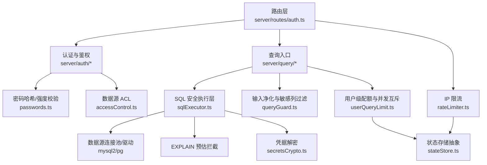
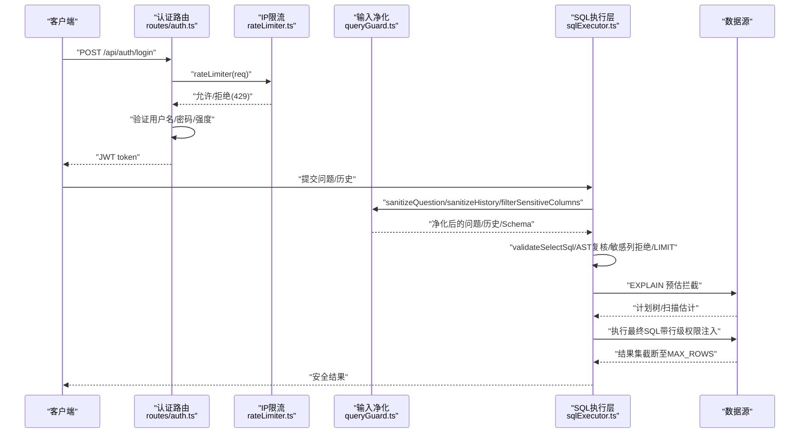
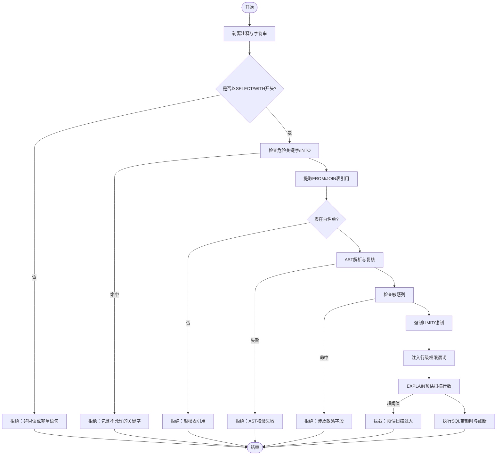
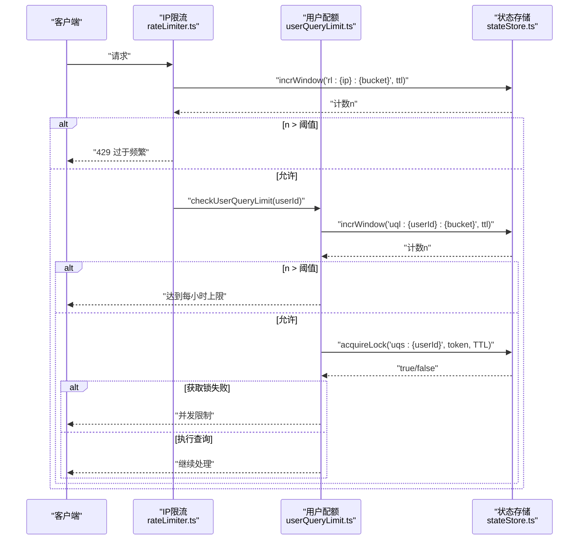
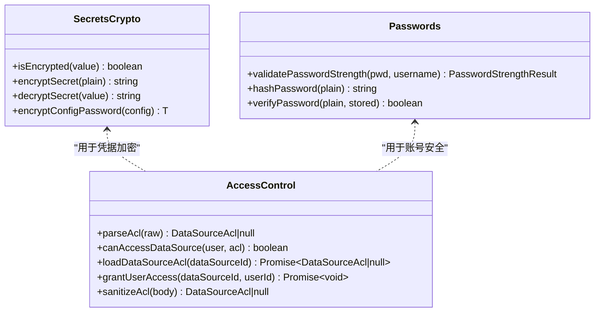
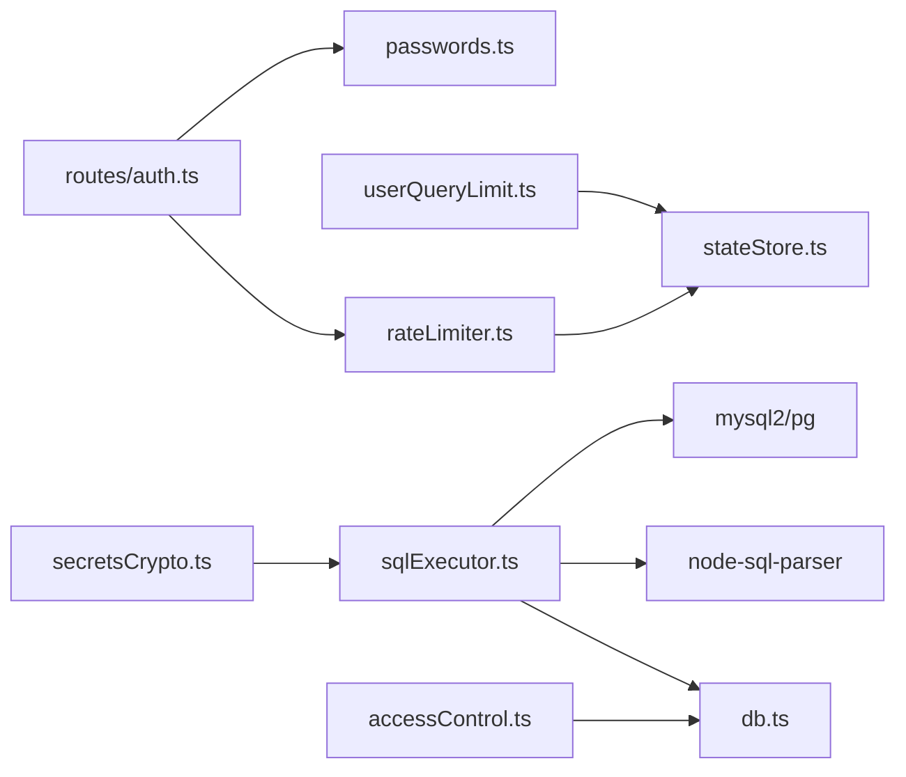

# 安全防护

<cite>
**本文引用的文件**
- [server/query/sqlExecutor.ts](file://server/query/sqlExecutor.ts)
- [server/query/queryGuard.ts](file://server/query/queryGuard.ts)
- [server/infra/rateLimiter.ts](file://server/infra/rateLimiter.ts)
- [server/infra/userQueryLimit.ts](file://server/infra/userQueryLimit.ts)
- [server/infra/stateStore.ts](file://server/infra/stateStore.ts)
- [server/infra/secretsCrypto.ts](file://server/infra/secretsCrypto.ts)
- [server/auth/accessControl.ts](file://server/auth/accessControl.ts)
- [server/routes/auth.ts](file://server/routes/auth.ts)
- [server/infra/db.ts](file://server/infra/db.ts)
- [server/auth/passwords.ts](file://server/auth/passwords.ts)
</cite>

## 目录
1. [简介](#简介)
2. [项目结构](#项目结构)
3. [核心组件](#核心组件)
4. [架构总览](#架构总览)
5. [详细组件分析](#详细组件分析)
6. [依赖关系分析](#依赖关系分析)
7. [性能与安全权衡](#性能与安全权衡)
8. [故障排查指南](#故障排查指南)
9. [结论](#结论)
10. [附录：安全配置清单与漏洞防护方案](#附录安全配置清单与漏洞防护方案)

## 简介
本模块聚焦“智能问数据分析系统”的安全防护能力，覆盖 SQL 注入防护、XSS 防护、CSRF 保护、速率限制、敏感信息保护等关键领域。系统采用“纵深防御”策略：在输入净化、上下文过滤、SQL 白名单校验、AST 复核、行级权限注入、EXPLAIN 预估拦截、结果截断等多层防线协同工作；同时通过凭据加密、密码强度校验、访问控制（ACL）与限流配额，构建端到端的安全闭环。

## 项目结构
安全相关代码主要分布在以下路径：
- 查询执行与 SQL 安全：server/query/sqlExecutor.ts、server/query/queryGuard.ts
- 速率限制与配额：server/infra/rateLimiter.ts、server/infra/userQueryLimit.ts、server/infra/stateStore.ts
- 认证与访问控制：server/routes/auth.ts、server/auth/accessControl.ts、server/auth/passwords.ts
- 敏感信息与密钥：server/infra/secretsCrypto.ts
- 应用数据库与初始化：server/infra/db.ts

**图表来源**
- [server/routes/auth.ts:41-77](file://server/routes/auth.ts#L41-L77)
- [server/query/sqlExecutor.ts:291-387](file://server/query/sqlExecutor.ts#L291-L387)
- [server/query/queryGuard.ts:38-69](file://server/query/queryGuard.ts#L38-L69)
- [server/infra/rateLimiter.ts:14-42](file://server/infra/rateLimiter.ts#L14-L42)
- [server/infra/userQueryLimit.ts:24-68](file://server/infra/userQueryLimit.ts#L24-L68)
- [server/infra/stateStore.ts:10-23](file://server/infra/stateStore.ts#L10-L23)
- [server/auth/passwords.ts:34-56](file://server/auth/passwords.ts#L34-L56)
- [server/auth/accessControl.ts:44-73](file://server/auth/accessControl.ts#L44-L73)
- [server/infra/secretsCrypto.ts:27-43](file://server/infra/secretsCrypto.ts#L27-L43)

**章节来源**
- [server/query/sqlExecutor.ts:1-110](file://server/query/sqlExecutor.ts#L1-L110)
- [server/query/queryGuard.ts:1-101](file://server/query/queryGuard.ts#L1-L101)
- [server/infra/rateLimiter.ts:1-54](file://server/infra/rateLimiter.ts#L1-L54)
- [server/infra/userQueryLimit.ts:1-98](file://server/infra/userQueryLimit.ts#L1-L98)
- [server/infra/stateStore.ts:1-219](file://server/infra/stateStore.ts#L1-L219)
- [server/auth/accessControl.ts:1-108](file://server/auth/accessControl.ts#L1-L108)
- [server/routes/auth.ts:1-156](file://server/routes/auth.ts#L1-L156)
- [server/infra/secretsCrypto.ts:1-50](file://server/infra/secretsCrypto.ts#L1-L50)
- [server/infra/db.ts:52-200](file://server/infra/db.ts#L52-L200)
- [server/auth/passwords.ts:1-100](file://server/auth/passwords.ts#L1-L100)

## 核心组件
- SQL 安全执行层：对 LLM 生成的 SQL 进行严格校验（只读、单语句、关键字黑名单、表白名单、AST 复核、敏感列拒绝、强制 LIMIT、超时与行数截断），并在执行前注入行级权限与 EXPLAIN 预估拦截。
- 输入净化与敏感列过滤：对用户提问进行长度限制、控制字符清理、提示注入特征检测；对 Schema 中的敏感列进行剔除，防止进入 LLM 上下文。
- 速率限制与配额：IP 级滑动窗口/固定窗口限流；用户级每小时次数上限与并发互斥（分布式锁或内存槽）。
- 认证与访问控制：登录接口限流、密码强度校验、OIDC 集成；数据源 ACL（部门/用户维度）控制可见性与使用权限。
- 敏感信息保护：数据源凭据 AES-256-GCM 加密落库；密码哈希 scrypt + pepper；启动时默认管理员弱口令告警。

**章节来源**
- [server/query/sqlExecutor.ts:291-387](file://server/query/sqlExecutor.ts#L291-L387)
- [server/query/queryGuard.ts:38-100](file://server/query/queryGuard.ts#L38-L100)
- [server/infra/rateLimiter.ts:14-42](file://server/infra/rateLimiter.ts#L14-L42)
- [server/infra/userQueryLimit.ts:24-68](file://server/infra/userQueryLimit.ts#L24-L68)
- [server/auth/accessControl.ts:44-73](file://server/auth/accessControl.ts#L44-L73)
- [server/infra/secretsCrypto.ts:27-43](file://server/infra/secretsCrypto.ts#L27-L43)
- [server/auth/passwords.ts:34-56](file://server/auth/passwords.ts#L34-L56)

## 架构总览
下图展示从请求到执行的完整安全链路：前端/客户端发起请求，经过认证与限流，进入查询处理；查询入口先做输入净化与敏感列过滤，再交由 SQL 安全执行层进行多重校验与防护，最终在受控条件下执行并返回受限结果。

**图表来源**
- [server/routes/auth.ts:41-77](file://server/routes/auth.ts#L41-L77)
- [server/infra/rateLimiter.ts:14-42](file://server/infra/rateLimiter.ts#L14-L42)
- [server/query/queryGuard.ts:38-69](file://server/query/queryGuard.ts#L38-L69)
- [server/query/sqlExecutor.ts:291-387](file://server/query/sqlExecutor.ts#L291-L387)
- [server/query/sqlExecutor.ts:629-662](file://server/query/sqlExecutor.ts#L629-L662)

## 详细组件分析

### SQL 注入防护机制
- 输入验证与清洗：
  - 仅允许 SELECT 开头（含 WITH CTE），单语句，禁止危险关键字（INSERT/UPDATE/DELETE/DROP/ALTER/EXEC/PROCEDURE 等）。
  - 剥离注释与字符串字面量后进行结构校验，避免被字面量或注释绕过。
  - 表引用白名单：仅允许 scope 白名单内的表；CTE 名排除在表白名单之外。
  - AST 二道防线：node-sql-parser 解析后强校验语句类型与表引用，失败则 fail-closed。
  - 敏感列拒绝：若 SQL 引用了被标记为敏感的列，直接拒绝。
  - 强制 LIMIT：无 LIMIT 时追加 MAX_ROWS；有 LIMIT 时 clamp 到 MAX_ROWS。
- 参数化查询：
  - 数据源连接使用 mysql2/pg 的 Promise 模式，查询以参数化方式执行（例如登录查询使用占位符），避免拼接 SQL。
- 危险函数拦截：
  - 关键字黑名单覆盖写操作与管理类命令；INTO 写文件/表明确拒绝；WITH CTE 需 AST 解析成功才放行。
- 执行期防护：
  - 行级权限注入：通过 AST 包裹派生表，强制 WHERE 谓词，递归覆盖子查询/UNION/CTE。
  - EXPLAIN 预估拦截：估算扫描行数超过阈值则拦截，保护数据源性能。
  - 超时与截断：MySQL 注入 MAX_EXECUTION_TIME hint；PG 使用 statement_timeout；结果集限制 MAX_ROWS。

**图表来源**
- [server/query/sqlExecutor.ts:155-163](file://server/query/sqlExecutor.ts#L155-L163)
- [server/query/sqlExecutor.ts:174-182](file://server/query/sqlExecutor.ts#L174-L182)
- [server/query/sqlExecutor.ts:194-235](file://server/query/sqlExecutor.ts#L194-L235)
- [server/query/sqlExecutor.ts:242-266](file://server/query/sqlExecutor.ts#L242-L266)
- [server/query/sqlExecutor.ts:291-387](file://server/query/sqlExecutor.ts#L291-L387)
- [server/query/sqlExecutor.ts:396-489](file://server/query/sqlExecutor.ts#L396-L489)
- [server/query/sqlExecutor.ts:629-662](file://server/query/sqlExecutor.ts#L629-L662)

**章节来源**
- [server/query/sqlExecutor.ts:155-163](file://server/query/sqlExecutor.ts#L155-L163)
- [server/query/sqlExecutor.ts:174-182](file://server/query/sqlExecutor.ts#L174-L182)
- [server/query/sqlExecutor.ts:194-235](file://server/query/sqlExecutor.ts#L194-L235)
- [server/query/sqlExecutor.ts:242-266](file://server/query/sqlExecutor.ts#L242-L266)
- [server/query/sqlExecutor.ts:291-387](file://server/query/sqlExecutor.ts#L291-L387)
- [server/query/sqlExecutor.ts:396-489](file://server/query/sqlExecutor.ts#L396-L489)
- [server/query/sqlExecutor.ts:629-662](file://server/query/sqlExecutor.ts#L629-L662)

### XSS 攻击防护措施
- 输出编码：系统在服务端不直接渲染用户可控 HTML；查询结果以结构化数据返回，前端负责安全渲染。
- 内容安全策略（CSP）：当前仓库未提供 CSP 中间件实现；建议在网关或前端引入 CSP 头，限制脚本来源与内联脚本执行。
- 脚本过滤：SQL 安全层已屏蔽危险关键字与写操作，降低注入风险；对于文本型输出，建议在前端统一转义与白名单过滤。

[本节为概念性说明，不涉及具体源码]

### CSRF 保护策略
- 令牌验证：当前未实现传统表单 CSRF Token；API 基于 JWT 鉴权，登录接口启用 IP 限流。
- 同源检查：建议结合 CORS 策略与 SameSite Cookie 设置；当前仓库未提供显式 CORS 配置。
- 请求签名：未实现请求签名；可通过网关层或 API 网关增加签名校验与重放防护。

[本节为概念性说明，不涉及具体源码]

### 速率限制机制
- IP 限流：
  - 内存模式：按 IP 记录最近 60 秒的请求时间戳，超限返回 429。
  - Redis 模式：固定分钟窗口原子计数，多实例共享；异常时 fail-closed 拒绝。
- 用户限流：
  - 每小时次数上限（默认 20 次），Redis 模式使用固定小时窗口 INCR；内存模式滑动窗口。
  - 并发互斥：同一用户同一时间仅允许一个进行中的查询；Redis 模式使用分布式锁（TTL 自动释放），内存模式使用 Map 槽位。
- API 调用频率控制：
  - 登录与 OIDC 回调均挂载 rateLimiter，防止爆破与滥用。

**图表来源**
- [server/infra/rateLimiter.ts:14-42](file://server/infra/rateLimiter.ts#L14-L42)
- [server/infra/userQueryLimit.ts:24-68](file://server/infra/userQueryLimit.ts#L24-L68)
- [server/infra/stateStore.ts:140-162](file://server/infra/stateStore.ts#L140-L162)

**章节来源**
- [server/infra/rateLimiter.ts:14-42](file://server/infra/rateLimiter.ts#L14-L42)
- [server/infra/userQueryLimit.ts:24-68](file://server/infra/userQueryLimit.ts#L24-L68)
- [server/infra/stateStore.ts:140-162](file://server/infra/stateStore.ts#L140-L162)
- [server/routes/auth.ts:41-77](file://server/routes/auth.ts#L41-L77)

### 敏感信息保护
- 数据脱敏：
  - 敏感列识别：匹配 password/passwd/pwd/secret/token/api_key/private_key/access_key/id_card/身份证/密码/密钥/令牌 等关键词，从 Schema 中剔除，防止进入 LLM 上下文。
- 加密存储：
  - 数据源凭据使用 AES-256-GCM 加密落库，密文格式 enc:v1:<iv>:<authTag>:<cipher>；读取时解密，明文存量兼容。
  - 密码哈希使用 scrypt（N=2^15, r=8, p=1），支持 pepper（SCRYPT_PEPPER），旧格式兼容。
- 密钥管理：
  - DS_SECRET_KEY 优先于 JWT_SECRET；生产环境缺失将 fail-fast。
  - 启动时检测默认管理员弱口令并告警，必要时强制改密。

**图表来源**
- [server/infra/secretsCrypto.ts:23-49](file://server/infra/secretsCrypto.ts#L23-L49)
- [server/auth/passwords.ts:34-56](file://server/auth/passwords.ts#L34-L56)
- [server/auth/accessControl.ts:18-41](file://server/auth/accessControl.ts#L18-L41)

**章节来源**
- [server/query/queryGuard.ts:71-100](file://server/query/queryGuard.ts#L71-L100)
- [server/infra/secretsCrypto.ts:23-49](file://server/infra/secretsCrypto.ts#L23-L49)
- [server/auth/passwords.ts:34-56](file://server/auth/passwords.ts#L34-L56)
- [server/infra/db.ts:755-778](file://server/infra/db.ts#L755-L778)

## 依赖关系分析
- SQL 执行层依赖：
  - node-sql-parser（AST 解析）、mysql2/pg（驱动）、监控埋点、日志、LLM 客户端（纠偏重试）、文件数据源工具。
- 状态存储抽象：
  - MemoryStateStore（进程内 Map）与 RedisStateStore（ioredis）统一接口，供限流、配额、缓存、锁等模块复用。
- 认证与访问控制：
  - 路由层挂载 rateLimiter；ACL 模块读取 data_sources.acl_json 并判定用户可访问性。
- 数据库初始化：
  - 建库建表、种子数据、迁移、默认管理员弱口令检测与告警。

**图表来源**
- [server/infra/rateLimiter.ts:14-42](file://server/infra/rateLimiter.ts#L14-L42)
- [server/infra/userQueryLimit.ts:24-68](file://server/infra/userQueryLimit.ts#L24-L68)
- [server/infra/stateStore.ts:10-23](file://server/infra/stateStore.ts#L10-L23)
- [server/query/sqlExecutor.ts:11-22](file://server/query/sqlExecutor.ts#L11-L22)
- [server/routes/auth.ts:41-77](file://server/routes/auth.ts#L41-L77)
- [server/auth/passwords.ts:34-56](file://server/auth/passwords.ts#L34-L56)
- [server/auth/accessControl.ts:58-73](file://server/auth/accessControl.ts#L58-L73)
- [server/infra/secretsCrypto.ts:27-43](file://server/infra/secretsCrypto.ts#L27-L43)

**章节来源**
- [server/query/sqlExecutor.ts:11-22](file://server/query/sqlExecutor.ts#L11-L22)
- [server/infra/stateStore.ts:10-23](file://server/infra/stateStore.ts#L10-L23)
- [server/routes/auth.ts:41-77](file://server/routes/auth.ts#L41-L77)
- [server/auth/accessControl.ts:58-73](file://server/auth/accessControl.ts#L58-L73)

## 性能与安全权衡
- EXPLAIN 预估拦截：
  - 默认阈值 100 万行，导出场景放宽 10 倍；EXPLAIN 失败时 fail-open 放行但记录警告，确保可用性。
- 连接池与超时：
  - 数据源连接池容量公式化（DS_POOL_MAX 或按 EXPECTED_CONCURRENT_USERS 推导），场景化超时（交互 15s、链 120s、导出 60s）。
- 结果截断：
  - MAX_ROWS 默认 10 万，防止 OOM 与大结果集传输开销。
- 限流与配额：
  - IP 限流防匿名爆破；用户级配额与并发互斥保护 LLM 与数据源资源。

[本节为通用指导，不直接分析具体文件]

## 故障排查指南
- 登录失败：
  - 检查 rateLimiter 是否触发 429；确认用户名/密码强度校验；查看数据库连接与 users 表状态。
- 查询被拒绝：
  - 查看 reject 原因（非只读、关键字、越权表、敏感列、AST 失败、EXPLAIN 拦截）；调整查询范围或白名单。
- 限流异常：
  - Redis 模式：检查 REDIS_URL 与连接预热；内存模式：检查进程内 Map 清理定时器。
- 凭据解密失败：
  - 检查 DS_SECRET_KEY/JWT_SECRET；确认密文格式 enc:v1:...；排查密钥变更导致的解密失败。

**章节来源**
- [server/routes/auth.ts:41-77](file://server/routes/auth.ts#L41-L77)
- [server/query/sqlExecutor.ts:291-387](file://server/query/sqlExecutor.ts#L291-L387)
- [server/query/sqlExecutor.ts:629-662](file://server/query/sqlExecutor.ts#L629-L662)
- [server/infra/rateLimiter.ts:14-42](file://server/infra/rateLimiter.ts#L14-L42)
- [server/infra/userQueryLimit.ts:24-68](file://server/infra/userQueryLimit.ts#L24-L68)
- [server/infra/stateStore.ts:140-162](file://server/infra/stateStore.ts#L140-L162)
- [server/infra/secretsCrypto.ts:27-43](file://server/infra/secretsCrypto.ts#L27-L43)

## 结论
本系统通过多层安全防线与严格的执行约束，有效防范 SQL 注入、越权访问、资源滥用与敏感信息泄露。建议在生产环境启用 Redis 外置状态存储、完善 CSP/CORS 策略、强化网关层 CSRF 与签名校验，并持续监控限流与配额指标，确保安全与性能的平衡。

[本节为总结性内容，不直接分析具体文件]

## 附录：安全配置清单与漏洞防护方案
- SQL 注入防护
  - 启用 AST 复核与关键字黑名单；保持表白名单最小化；强制 LIMIT；启用 EXPLAIN 预估拦截。
  - 参考实现：[server/query/sqlExecutor.ts:291-387](file://server/query/sqlExecutor.ts#L291-L387)、[server/query/sqlExecutor.ts:629-662](file://server/query/sqlExecutor.ts#L629-L662)
- XSS 防护
  - 前端统一输出编码；引入 CSP 头限制脚本来源；避免内联脚本与不受信任的 DOM 操作。
  - 参考实现：当前仓库未提供 CSP 中间件，建议在前端或网关层补充。
- CSRF 保护
  - 启用 SameSite Cookie；结合 CORS 策略；在网关层增加请求签名与重放防护。
  - 参考实现：当前仓库未提供显式 CSRF 中间件，建议通过网关增强。
- 速率限制与配额
  - 配置 RATE_LIMIT_MAX、USER_QUERY_RATE_MAX；启用 REDIS_URL 以支持多实例共享与 TTL 过期。
  - 参考实现：[server/infra/rateLimiter.ts:14-42](file://server/infra/rateLimiter.ts#L14-L42)、[server/infra/userQueryLimit.ts:24-68](file://server/infra/userQueryLimit.ts#L24-L68)、[server/infra/stateStore.ts:140-162](file://server/infra/stateStore.ts#L140-L162)
- 敏感信息保护
  - 设置 DS_SECRET_KEY 与 SCRYPT_PEPPER；启用默认管理员弱口令检测与强制改密。
  - 参考实现：[server/infra/secretsCrypto.ts:27-43](file://server/infra/secretsCrypto.ts#L27-L43)、[server/auth/passwords.ts:34-56](file://server/auth/passwords.ts#L34-L56)、[server/infra/db.ts:755-778](file://server/infra/db.ts#L755-L778)
- 访问控制
  - 配置 data_sources.acl_json（departments/userIds）；ADMIN 豁免；审批流程并入个人授权。
  - 参考实现：[server/auth/accessControl.ts:44-73](file://server/auth/accessControl.ts#L44-L73)、[server/auth/accessControl.ts:79-86](file://server/auth/accessControl.ts#L79-L86)

**章节来源**
- [server/query/sqlExecutor.ts:291-387](file://server/query/sqlExecutor.ts#L291-L387)
- [server/query/sqlExecutor.ts:629-662](file://server/query/sqlExecutor.ts#L629-L662)
- [server/infra/rateLimiter.ts:14-42](file://server/infra/rateLimiter.ts#L14-L42)
- [server/infra/userQueryLimit.ts:24-68](file://server/infra/userQueryLimit.ts#L24-L68)
- [server/infra/stateStore.ts:140-162](file://server/infra/stateStore.ts#L140-L162)
- [server/infra/secretsCrypto.ts:27-43](file://server/infra/secretsCrypto.ts#L27-L43)
- [server/auth/passwords.ts:34-56](file://server/auth/passwords.ts#L34-L56)
- [server/infra/db.ts:755-778](file://server/infra/db.ts#L755-L778)
- [server/auth/accessControl.ts:44-73](file://server/auth/accessControl.ts#L44-L73)
- [server/auth/accessControl.ts:79-86](file://server/auth/accessControl.ts#L79-L86)