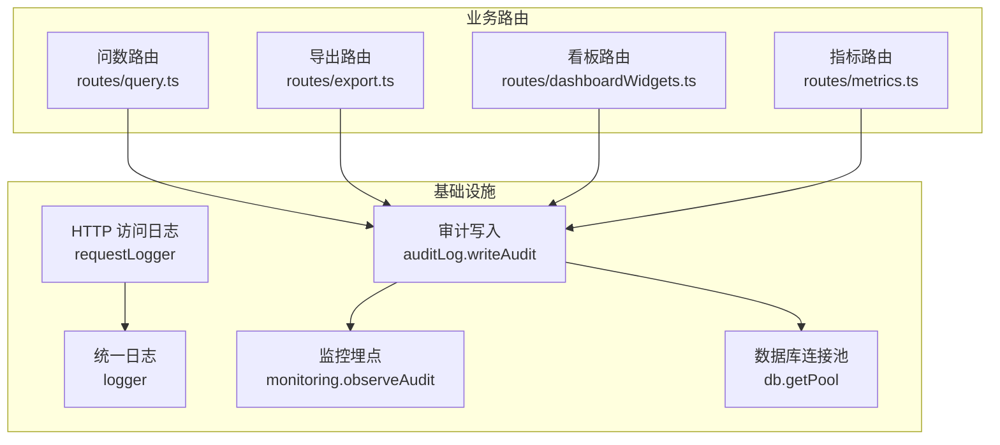
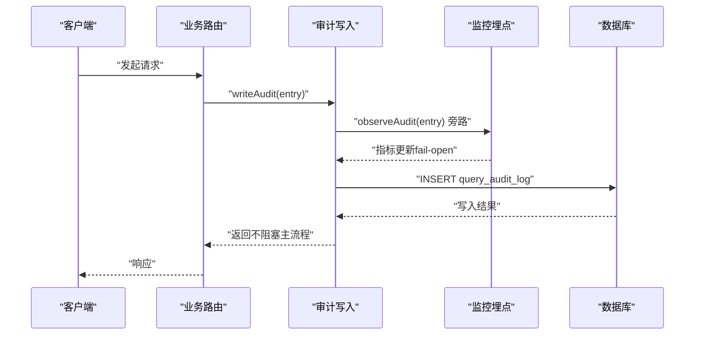
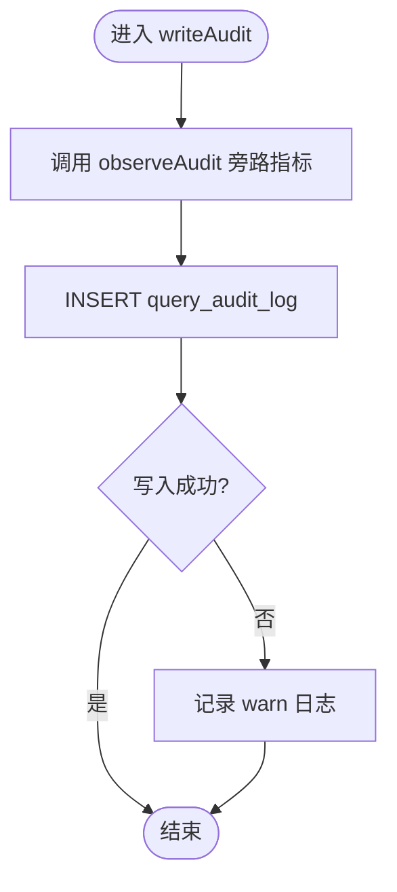
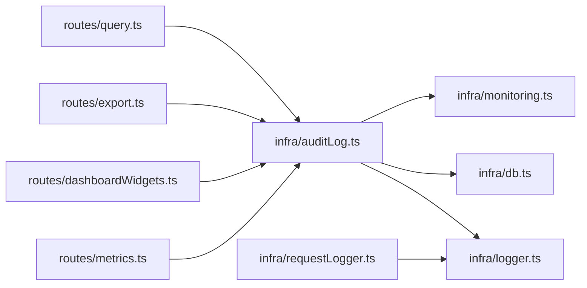

# 审计日志

<cite>
**本文引用的文件**
- [auditLog.ts](file://server/infra/auditLog.ts)
- [logger.ts](file://server/infra/logger.ts)
- [requestLogger.ts](file://server/infra/requestLogger.ts)
- [monitoring.ts](file://server/infra/monitoring.ts)
- [db.ts](file://server/infra/db.ts)
- [query.ts](file://server/routes/query.ts)
- [export.ts](file://server/routes/export.ts)
- [dashboardWidgets.ts](file://server/routes/dashboardWidgets.ts)
- [metrics.ts](file://server/routes/metrics.ts)
- [reconcile-metrics.ts](file://scripts/reconcile-metrics.ts)
</cite>

## 目录
1. [简介](#简介)
2. [项目结构](#项目结构)
3. [核心组件](#核心组件)
4. [架构总览](#架构总览)
5. [详细组件分析](#详细组件分析)
6. [依赖关系分析](#依赖关系分析)
7. [性能考量](#性能考量)
8. [故障排查指南](#故障排查指南)
9. [结论](#结论)
10. [附录：配置与合规](#附录：配置与合规)

## 简介
本模块为智能问数据分析系统的“审计日志”子系统，负责全链路操作审计、访问日志收集、异常行为检测、指标旁路与对账校验。其设计目标包括：
- 用户操作追踪：记录关键业务事件（问数、导出、看板固化等）的完整上下文。
- 关键业务事件记录：覆盖成功、降级、错误与被拒绝（输入/权限/频率/开关）等终态。
- 异常行为检测：通过状态分布、耗时直方图与对账脚本识别异常趋势。
- 访问日志收集策略：HTTP 请求日志、数据库操作日志、API 调用日志统一出口与可观测性。
- 结构化格式：统一的日志级别、时间戳、用户上下文、请求标识。
- 存储与管理：持久化到数据库表，支持索引查询；配合监控指标进行趋势分析与告警。
- 合规要求：数据保留策略、隐私保护（字段截断/脱敏）、审计报表生成与对账。

## 项目结构
审计日志相关代码主要分布在 infra 层与 routes 层：
- infra/auditLog.ts：审计落库入口，定义审计条目结构与写入逻辑。
- infra/logger.ts：统一日志出口，控制日志级别与环境差异。
- infra/requestLogger.ts：HTTP 访问日志中间件，生成并回传请求标识。
- infra/monitoring.ts：Prometheus 指标埋点（fail-open），提供 /metrics 端点。
- infra/db.ts：数据库表结构定义与迁移（含审计表）。
- routes/*：各业务路由在关键路径调用 writeAudit 完成审计落账。
- scripts/reconcile-metrics.ts：Prometheus 指标与审计表对账校验脚本。

图表来源
- [auditLog.ts:38-61](file://server/infra/auditLog.ts#L38-L61)
- [requestLogger.ts:19-35](file://server/infra/requestLogger.ts#L19-L35)
- [monitoring.ts:92-100](file://server/infra/monitoring.ts#L92-L100)
- [db.ts:180-212](file://server/infra/db.ts#L180-L212)
- [query.ts:47-102](file://server/routes/query.ts#L47-L102)
- [export.ts:91-165](file://server/routes/export.ts#L91-L165)
- [dashboardWidgets.ts:89-180](file://server/routes/dashboardWidgets.ts#L89-L180)
- [metrics.ts:91-117](file://server/routes/metrics.ts#L91-L117)

章节来源
- [auditLog.ts:1-62](file://server/infra/auditLog.ts#L1-L62)
- [logger.ts:1-41](file://server/infra/logger.ts#L1-L41)
- [requestLogger.ts:1-36](file://server/infra/requestLogger.ts#L1-L36)
- [monitoring.ts:1-153](file://server/infra/monitoring.ts#L1-L153)
- [db.ts:180-212](file://server/infra/db.ts#L180-L212)
- [query.ts:47-102](file://server/routes/query.ts#L47-L102)
- [export.ts:91-165](file://server/routes/export.ts#L91-L165)
- [dashboardWidgets.ts:89-180](file://server/routes/dashboardWidgets.ts#L89-L180)
- [metrics.ts:91-117](file://server/routes/metrics.ts#L91-L117)

## 核心组件
- 审计写入器（writeAudit）
  - 职责：将审计条目写入 query_audit_log，同时旁路 Prometheus 指标计数与耗时直方图。
  - 失败策略：写入失败仅告警不阻塞主流程（fail-open）。
  - 关键字段：userId、username、endpoint、dataSourceId、question、status、detail、executedSql、rowCount、durationMs、created_at。
- 统一日志（logger）
  - 职责：集中输出运行时代码日志，支持 LOG_LEVEL 控制级别，测试环境静默非 error 日志。
- HTTP 访问日志（requestLogger）
  - 职责：为每个请求生成 requestId，记录 /api 请求的方法、URL、状态码、耗时与用户信息，并在响应头回传 X-Request-Id。
- 监控埋点（monitoring）
  - 职责：暴露 nl2sql_requests_total、nl2sql_duration_seconds、llm_call_duration_seconds、sql_execute_duration_seconds、http_request_duration_seconds 等指标；提供 /metrics 端点（可选 METRICS_TOKEN 保护）。
- 数据库表（query_audit_log）
  - 职责：持久化审计明细，包含索引 user_id+created_at、created_at，便于按用户与时间范围检索。

章节来源
- [auditLog.ts:10-61](file://server/infra/auditLog.ts#L10-L61)
- [logger.ts:1-41](file://server/infra/logger.ts#L1-L41)
- [requestLogger.ts:1-36](file://server/infra/requestLogger.ts#L1-L36)
- [monitoring.ts:19-153](file://server/infra/monitoring.ts#L19-L153)
- [db.ts:180-212](file://server/infra/db.ts#L180-L212)

## 架构总览
审计日志系统采用“单点写入 + 旁路埋点 + 持久化存储”的架构：
- 所有业务路由在关键路径调用 writeAudit，形成统一审计入口。
- writeAudit 内部先调用 observeAudit 进行 Prometheus 指标旁路（fail-open），再异步落库。
- 数据库表具备必要索引，支持按用户、时间、状态、端点等维度查询与分析。
- HTTP 访问日志由 requestLogger 中间件统一采集，便于关联审计明细。

图表来源
- [auditLog.ts:38-61](file://server/infra/auditLog.ts#L38-L61)
- [monitoring.ts:92-100](file://server/infra/monitoring.ts#L92-L100)
- [db.ts:180-212](file://server/infra/db.ts#L180-L212)

## 详细组件分析

### 审计写入器（writeAudit）
- 数据结构
  - AuditEntry：包含用户上下文、端点、数据源、问题、状态、详情、执行 SQL、行数、耗时等。
  - AuditStatus：SUCCESS、CACHE、FALLBACK、ERROR、CLARIFY、REFUSED、QUEUED、DENIED_INPUT、DENIED_AUTH、DENIED_RATE、DENIED_SWITCH。
- 处理逻辑
  - 先调用 observeAudit 进行指标旁路（不阻塞）。
  - 使用 getPool().query 插入 query_audit_log，字段长度限制防止溢出。
  - 捕获写入异常并记录 warn 日志，确保不影响主流程可用性。
- 复杂度
  - 单次写入 O(1)，受数据库写入性能影响。
- 优化机会
  - 批量写入或异步队列（当前已采用 catch 不阻塞，后续可引入缓冲合并）。
  - 根据查询模式增加复合索引（如 endpoint+created_at、status+created_at）。

图表来源
- [auditLog.ts:38-61](file://server/infra/auditLog.ts#L38-L61)
- [monitoring.ts:92-100](file://server/infra/monitoring.ts#L92-L100)

章节来源
- [auditLog.ts:10-61](file://server/infra/auditLog.ts#L10-L61)

### 统一日志（logger）
- 功能
  - 提供 debug/info/warn/error 四级输出。
  - 通过 LOG_LEVEL 控制阈值，test 环境仅保留 error。
- 适用场景
  - 运行时通用日志输出，避免散落 console.*。
  - 审计写入失败时的 warn 日志记录。

章节来源
- [logger.ts:1-41](file://server/infra/logger.ts#L1-L41)

### HTTP 访问日志（requestLogger）
- 功能
  - 为每个请求生成唯一 requestId，附加到 req.requestId。
  - 在响应头设置 X-Request-Id，便于前端关联报错。
  - 仅记录 /api 请求，减少静态资源噪音。
  - 记录方法、原始 URL、状态码、耗时与用户信息。
- 适用场景
  - 与审计明细通过 requestId 关联，提升排障效率。

章节来源
- [requestLogger.ts:1-36](file://server/infra/requestLogger.ts#L1-L36)

### 监控埋点（monitoring）
- 指标
  - nl2sql_requests_total：按 status、endpoint 统计审计落账总数。
  - nl2sql_duration_seconds：按 status 统计端到端耗时直方图。
  - llm_call_duration_seconds、llm_tokens_total：LLM 调用耗时与 token 消耗。
  - sql_execute_duration_seconds：安全 SQL 执行耗时。
  - http_request_duration_seconds：/api/* 接口耗时。
- 特性
  - fail-open：所有埋点 try/catch 静默，不影响业务。
  - 低基数 label：避免 question/userId/dataSourceId 作为 label。
  - /metrics 端点：可选 METRICS_TOKEN 保护。

章节来源
- [monitoring.ts:19-153](file://server/infra/monitoring.ts#L19-L153)

### 数据库表（query_audit_log）
- 字段
  - id、user_id、username、endpoint、data_source_id、question、status、detail、executed_sql、row_count、duration_ms、created_at。
- 索引
  - idx_audit_user_created(user_id, created_at)
  - idx_audit_created(created_at)
- 迁移
  - 启动时创建表，增量添加 executed_sql、row_count 列（幂等）。

章节来源
- [db.ts:180-212](file://server/infra/db.ts#L180-L212)

### 业务路由中的审计落账
- 问数路由（query.ts）
  - 在权限校验、输入清洗、频率限制、数据源开关、计划模式等环节调用 writeAudit，记录 DENIED_AUTH、DENIED_INPUT、DENIED_RATE、DENIED_SWITCH、SUCCESS 等状态。
- 导出路由（export.ts）
  - 在硬上限、审批阈值、导出成功等路径调用 writeAudit，记录 DENIED_INPUT、DENIED_AUTH、SUCCESS，并附带行数与耗时。
- 看板路由（dashboardWidgets.ts）
  - 在固化、排序调整、删除等操作中调用 writeAudit，记录 SUCCESS 与越权尝试的 DENIED_AUTH。
- 指标路由（metrics.ts）
  - 在 ACL 校验、频率限制、成功执行等路径调用 writeAudit，记录 DENIED_AUTH、DENIED_RATE、SUCCESS。

章节来源
- [query.ts:47-102](file://server/routes/query.ts#L47-L102)
- [export.ts:91-165](file://server/routes/export.ts#L91-L165)
- [dashboardWidgets.ts:89-180](file://server/routes/dashboardWidgets.ts#L89-L180)
- [metrics.ts:91-117](file://server/routes/metrics.ts#L91-L117)

## 依赖关系分析
- 组件耦合
  - auditLog 依赖 db、monitoring、logger。
  - monitoring 依赖 prom-client，类型引用 auditLog 与 llmUsage。
  - requestLogger 依赖 logger。
  - 各路由依赖 auth、rateLimiter、auditLog。
- 外部依赖
  - MySQL 连接池（getPool）。
  - Prometheus 指标库（prom-client）。
- 循环依赖
  - 未发现循环导入；monitoring 仅类型引用 auditLog，无运行时依赖。

图表来源
- [auditLog.ts:1-62](file://server/infra/auditLog.ts#L1-L62)
- [monitoring.ts:1-153](file://server/infra/monitoring.ts#L1-L153)
- [logger.ts:1-41](file://server/infra/logger.ts#L1-L41)
- [requestLogger.ts:1-36](file://server/infra/requestLogger.ts#L1-L36)
- [query.ts:47-102](file://server/routes/query.ts#L47-L102)
- [export.ts:91-165](file://server/routes/export.ts#L91-L165)
- [dashboardWidgets.ts:89-180](file://server/routes/dashboardWidgets.ts#L89-L180)
- [metrics.ts:91-117](file://server/routes/metrics.ts#L91-L117)

章节来源
- [auditLog.ts:1-62](file://server/infra/auditLog.ts#L1-L62)
- [monitoring.ts:1-153](file://server/infra/monitoring.ts#L1-L153)
- [logger.ts:1-41](file://server/infra/logger.ts#L1-L41)
- [requestLogger.ts:1-36](file://server/infra/requestLogger.ts#L1-L36)
- [query.ts:47-102](file://server/routes/query.ts#L47-L102)
- [export.ts:91-165](file://server/routes/export.ts#L91-L165)
- [dashboardWidgets.ts:89-180](file://server/routes/dashboardWidgets.ts#L89-L180)
- [metrics.ts:91-117](file://server/routes/metrics.ts#L91-L117)

## 性能考量
- 旁路埋点
  - observeAudit 使用 try/catch 静默失败，避免影响主链路。
  - 指标 label 保持低基数，防止序列爆炸。
- 写入策略
  - 审计写入失败仅 warn，不阻塞业务，保障可用性。
  - 字段长度限制（question/detail/executedSql）防止超长导致写入失败。
- 查询性能
  - 审计表具备 user_id+created_at、created_at 索引，支持按用户与时间范围高效检索。
  - 建议根据实际查询模式增加复合索引（如 endpoint+created_at、status+created_at）。
- 监控与对账
  - Prometheus 指标与审计表对账脚本用于月度口径审计与埋点回归排查。

章节来源
- [monitoring.ts:92-100](file://server/infra/monitoring.ts#L92-L100)
- [auditLog.ts:38-61](file://server/infra/auditLog.ts#L38-L61)
- [db.ts:180-212](file://server/infra/db.ts#L180-L212)
- [reconcile-metrics.ts:84-95](file://scripts/reconcile-metrics.ts#L84-L95)

## 故障排查指南
- 审计写入失败
  - 现象：warn 日志提示“审计日志写入失败”。
  - 排查：检查数据库连接池、表结构、字段长度限制；确认写入 SQL 参数是否被截断。
  - 参考：[auditLog.ts:58-60](file://server/infra/auditLog.ts#L58-L60)
- 指标不一致
  - 现象：Prometheus increase(nl2sql_requests_total) 与 query_audit_log 计数不符。
  - 排查：运行对账脚本，检查窗口与容差；确认埋点旁路未被跳过或重复。
  - 参考：[reconcile-metrics.ts:84-95](file://scripts/reconcile-metrics.ts#L84-L95)
- HTTP 请求无法关联
  - 现象：前端报错无法定位服务端日志。
  - 排查：确认 X-Request-Id 是否回传；检查 requestLogger 是否拦截 /api 请求。
  - 参考：[requestLogger.ts:24-33](file://server/infra/requestLogger.ts#L24-L33)
- 指标端点不可访问
  - 现象：GET /metrics 返回 403。
  - 排查：检查 METRICS_TOKEN 是否配置且授权正确。
  - 参考：[monitoring.ts:137-151](file://server/infra/monitoring.ts#L137-L151)

章节来源
- [auditLog.ts:58-60](file://server/infra/auditLog.ts#L58-L60)
- [reconcile-metrics.ts:84-95](file://scripts/reconcile-metrics.ts#L84-L95)
- [requestLogger.ts:24-33](file://server/infra/requestLogger.ts#L24-L33)
- [monitoring.ts:137-151](file://server/infra/monitoring.ts#L137-L151)

## 结论
审计日志模块通过统一写入入口、旁路指标与持久化存储，实现了全链路操作审计与可观测性。其 fail-open 设计与低基数 label 保障了高可用与可扩展性；结合对账脚本与索引优化，满足合规与运维需求。建议在后续迭代中持续完善查询索引与批处理写入，进一步提升性能与可维护性。

## 附录：配置与合规
- 日志级别
  - 环境变量 LOG_LEVEL：debug/info/warn/error，默认 info；test 环境仅 error。
  - 参考：[logger.ts:12-24](file://server/infra/logger.ts#L12-L24)
- 指标保护
  - 环境变量 METRICS_TOKEN：可选开启 /metrics 端点 Bearer/query 保护。
  - 参考：[monitoring.ts:137-151](file://server/infra/monitoring.ts#L137-L151)
- 导出阈值
  - 环境变量 DLP_EXPORT_APPROVE_ROWS：导出审批阈值（默认 5000）。
  - 环境变量 DLP_EXPORT_MAX_ROWS：导出硬上限（默认 100000）。
  - 参考：[export.ts:22-31](file://server/routes/export.ts#L22-L31)
- 数据保留策略
  - 审计表按 created_at 索引，建议定期归档历史数据（如按季度归档至冷存储）。
  - 对账脚本支持窗口查询，便于短期趋势分析。
- 隐私保护措施
  - 字段截断：question/detail/executedSql 限制长度，防止敏感信息泄露。
  - 水印导出：CSV 首尾行嵌入导出人、部门、时间与行数，泄漏可溯源。
  - 参考：[auditLog.ts:49-54](file://server/infra/auditLog.ts#L49-L54)、[export.ts:41-56](file://server/routes/export.ts#L41-L56)
- 审计报表生成
  - 基于 query_audit_log 与 Prometheus 指标生成报表：成功率、缓存命中率、拒答率、澄清率、平均耗时等。
  - 对账脚本用于月度口径审计与埋点回归排查。
  - 参考：[reconcile-metrics.ts:84-95](file://scripts/reconcile-metrics.ts#L84-L95)

章节来源
- [logger.ts:12-24](file://server/infra/logger.ts#L12-L24)
- [monitoring.ts:137-151](file://server/infra/monitoring.ts#L137-L151)
- [export.ts:22-31](file://server/routes/export.ts#L22-L31)
- [auditLog.ts:49-54](file://server/infra/auditLog.ts#L49-L54)
- [export.ts:41-56](file://server/routes/export.ts#L41-L56)
- [reconcile-metrics.ts:84-95](file://scripts/reconcile-metrics.ts#L84-L95)