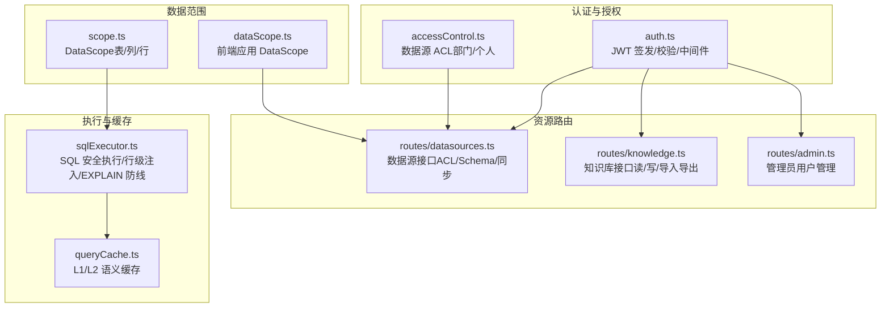
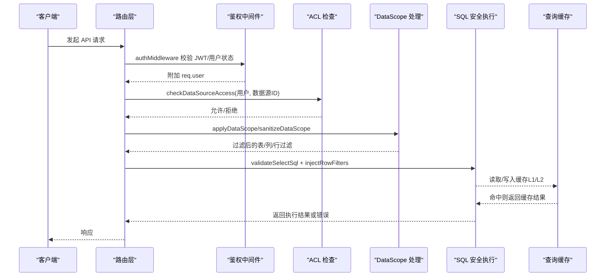
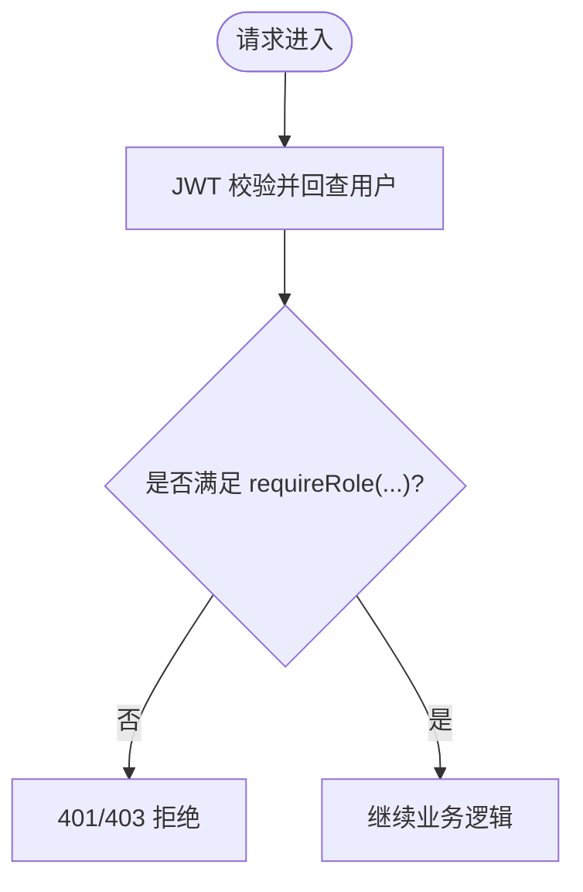
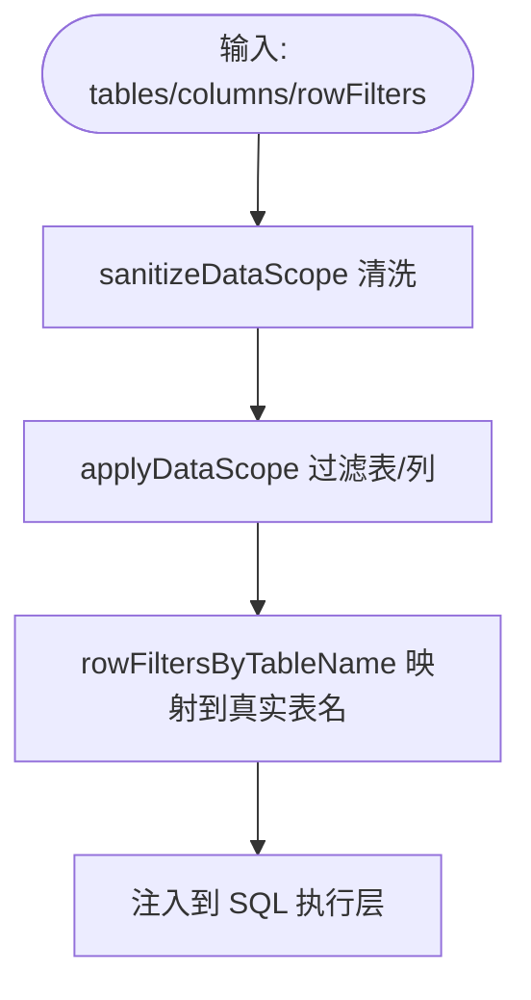
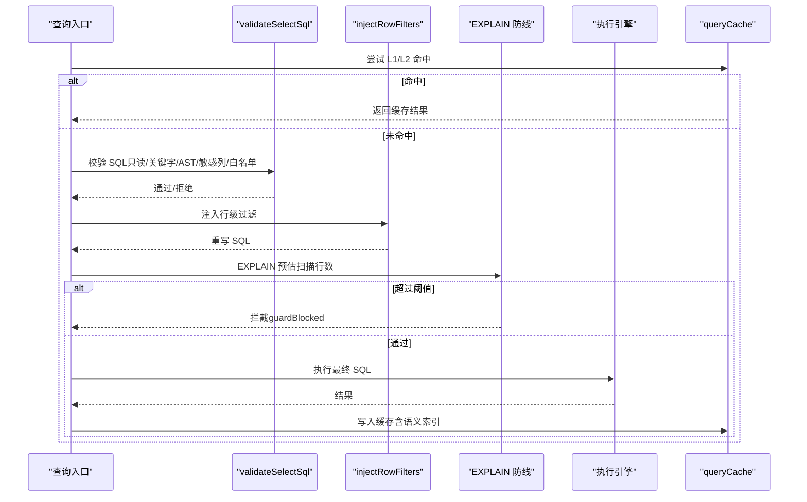
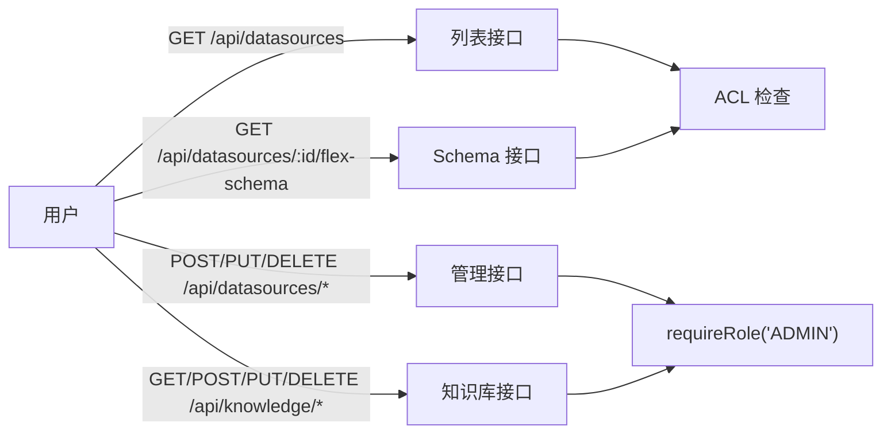
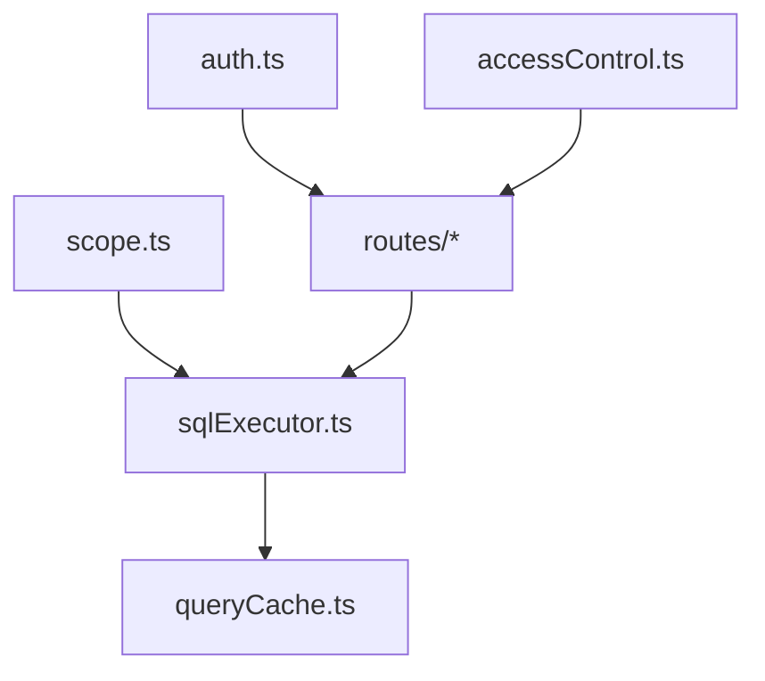

# 权限控制

<cite>
**本文引用的文件**
- [server/auth/auth.ts](file://server/auth/auth.ts)
- [server/auth/accessControl.ts](file://server/auth/accessControl.ts)
- [server/query/scope.ts](file://server/query/scope.ts)
- [src/utils/dataScope.ts](file://src/utils/dataScope.ts)
- [server/routes/datasources.ts](file://server/routes/datasources.ts)
- [server/routes/knowledge.ts](file://server/routes/knowledge.ts)
- [server/query/sqlExecutor.ts](file://server/query/sqlExecutor.ts)
- [server/query/queryCache.ts](file://server/query/queryCache.ts)
- [server/routes/admin.ts](file://server/routes/admin.ts)
- [src/types/analytics.ts](file://src/types/analytics.ts)
</cite>

## 目录
1. [简介](#简介)
2. [项目结构](#项目结构)
3. [核心组件](#核心组件)
4. [架构总览](#架构总览)
5. [详细组件分析](#详细组件分析)
6. [依赖关系分析](#依赖关系分析)
7. [性能考虑](#性能考虑)
8. [故障排查指南](#故障排查指南)
9. [结论](#结论)
10. [附录：配置示例与最佳实践](#附录配置示例与最佳实践)

## 简介
本模块为智能问数据分析系统的权限控制子系统，围绕 RBAC 角色权限模型、数据范围控制（DataScope）、查询安全执行与缓存策略、以及资源访问控制（API/数据源/知识库）进行设计与实现。系统提供三种内置角色：ADMIN、ANALYST、VIEWER，并通过 ACL（部门/个人白名单）实现数据源级隔离；通过 DataScope 实现表/列/行级权限；在 SQL 执行前进行严格校验与安全注入；并提供基于内存/Redis 的语义缓存策略以兼顾性能与一致性。

## 项目结构
权限相关代码主要分布在以下位置：
- 认证与授权中间件：server/auth
- 数据源访问控制（ACL）：server/auth/accessControl.ts
- 数据范围（DataScope）：server/query/scope.ts 与前端 src/utils/dataScope.ts
- 路由层鉴权与资源保护：server/routes/*（datasources、knowledge、admin 等）
- SQL 安全执行与行级权限注入：server/query/sqlExecutor.ts
- 查询结果缓存（含语义缓存）：server/query/queryCache.ts
- 类型定义：src/types/analytics.ts

**图表来源**
- [server/auth/auth.ts:1-127](file://server/auth/auth.ts#L1-L127)
- [server/auth/accessControl.ts:1-108](file://server/auth/accessControl.ts#L1-L108)
- [server/query/scope.ts:1-101](file://server/query/scope.ts#L1-L101)
- [src/utils/dataScope.ts:1-22](file://src/utils/dataScope.ts#L1-L22)
- [server/routes/datasources.ts:1-800](file://server/routes/datasources.ts#L1-L800)
- [server/routes/knowledge.ts:1-457](file://server/routes/knowledge.ts#L1-L457)
- [server/query/sqlExecutor.ts:1-800](file://server/query/sqlExecutor.ts#L1-L800)
- [server/query/queryCache.ts:1-254](file://server/query/queryCache.ts#L1-L254)

**章节来源**
- [server/auth/auth.ts:1-127](file://server/auth/auth.ts#L1-L127)
- [server/auth/accessControl.ts:1-108](file://server/auth/accessControl.ts#L1-L108)
- [server/query/scope.ts:1-101](file://server/query/scope.ts#L1-L101)
- [src/utils/dataScope.ts:1-22](file://src/utils/dataScope.ts#L1-L22)
- [server/routes/datasources.ts:1-800](file://server/routes/datasources.ts#L1-L800)
- [server/routes/knowledge.ts:1-457](file://server/routes/knowledge.ts#L1-L457)
- [server/query/sqlExecutor.ts:1-800](file://server/query/sqlExecutor.ts#L1-L800)
- [server/query/queryCache.ts:1-254](file://server/query/queryCache.ts#L1-L254)

## 核心组件
- 认证与角色守卫：JWT 签发/校验，登录态回查用户状态，强制改密拦截；提供 requireRole 守卫用于路由级角色控制。
- 数据源访问控制（ACL）：按部门/个人白名单控制数据源可见性与使用；ADMIN 可绕过；未配置 ACL 表示不限制。
- 数据范围（DataScope）：表级/列级/行级权限；服务端对 scope 进行清洗与校验，并在 SQL 执行前注入行级过滤谓词。
- SQL 安全执行：只读校验、关键字黑名单、AST 复核、敏感列拒绝、强制 LIMIT、EXPLAIN 防线、连接池分级与超时。
- 查询缓存：L1 精确键命中 + L2 语义相似度命中；支持 Redis 多实例共享；TTL 与失效策略由数据源变更触发。
- 资源访问控制：数据源列表/Schema/同步/导入导出；知识库文档 CRUD 与导入导出；管理员用户管理。

**章节来源**
- [server/auth/auth.ts:1-127](file://server/auth/auth.ts#L1-L127)
- [server/auth/accessControl.ts:1-108](file://server/auth/accessControl.ts#L1-L108)
- [server/query/scope.ts:1-101](file://server/query/scope.ts#L1-L101)
- [server/query/sqlExecutor.ts:1-800](file://server/query/sqlExecutor.ts#L1-L800)
- [server/query/queryCache.ts:1-254](file://server/query/queryCache.ts#L1-L254)
- [server/routes/datasources.ts:1-800](file://server/routes/datasources.ts#L1-L800)
- [server/routes/knowledge.ts:1-457](file://server/routes/knowledge.ts#L1-L457)
- [server/routes/admin.ts:1-295](file://server/routes/admin.ts#L1-L295)

## 架构总览
下图展示从请求进入、鉴权、数据源 ACL 检查、DataScope 应用到 SQL 安全执行与缓存的全链路。

**图表来源**
- [server/auth/auth.ts:66-127](file://server/auth/auth.ts#L66-L127)
- [server/auth/accessControl.ts:57-73](file://server/auth/accessControl.ts#L57-L73)
- [server/query/scope.ts:28-101](file://server/query/scope.ts#L28-L101)
- [server/query/sqlExecutor.ts:291-489](file://server/query/sqlExecutor.ts#L291-L489)
- [server/query/queryCache.ts:43-90](file://server/query/queryCache.ts#L43-L90)

## 详细组件分析

### RBAC 角色权限模型
- 角色定义：ADMIN、ANALYST、VIEWER。
- 鉴权中间件：校验 JWT、回查用户状态、注入 req.user、强制改密拦截。
- 角色守卫：requireRole(...) 用于路由级权限控制。
- 管理员用户管理：仅 ADMIN 可创建/更新/删除用户，且保证至少一个 ACTIVE 管理员存在。

**图表来源**
- [server/auth/auth.ts:66-127](file://server/auth/auth.ts#L66-L127)
- [server/routes/admin.ts:1-295](file://server/routes/admin.ts#L1-L295)

**章节来源**
- [server/auth/auth.ts:1-127](file://server/auth/auth.ts#L1-L127)
- [server/routes/admin.ts:1-295](file://server/routes/admin.ts#L1-L295)
- [src/types/analytics.ts:1-30](file://src/types/analytics.ts#L1-L30)

### 数据范围控制（DataScope）
- 表级：tables 白名单决定可问数表集合。
- 列级：columns[tableId] 限制可用字段。
- 行级：rowFilters[tableId] 为 WHERE 片段，执行层 AST 强制注入，非法谓词将被拒绝。
- 前端与服务端均会应用 DataScope 过滤，确保 UI 与执行一致。

**图表来源**
- [server/query/scope.ts:18-101](file://server/query/scope.ts#L18-L101)
- [src/utils/dataScope.ts:1-22](file://src/utils/dataScope.ts#L1-L22)

**章节来源**
- [server/query/scope.ts:1-101](file://server/query/scope.ts#L1-L101)
- [src/utils/dataScope.ts:1-22](file://src/utils/dataScope.ts#L1-L22)

### 查询权限验证流程（SQL 执行前检查、动态注入、缓存）
- 校验阶段：只读语句、关键字黑名单、AST 复核、敏感列拒绝、表引用白名单。
- 动态注入：行级权限谓词通过 AST 包裹派生表注入，覆盖 CTE/子查询/UNION。
- 执行防护：EXPLAIN 预估扫描行数阈值拦截；MySQL MAX_EXECUTION_TIME hint；PG statement_timeout。
- 缓存策略：L1 精确键命中（内存/Redis），L2 语义相似度命中（embedding 向量）；TTL 默认 30 分钟，数据源变更时失效。

**图表来源**
- [server/query/sqlExecutor.ts:291-489](file://server/query/sqlExecutor.ts#L291-L489)
- [server/query/sqlExecutor.ts:629-662](file://server/query/sqlExecutor.ts#L629-L662)
- [server/query/queryCache.ts:43-90](file://server/query/queryCache.ts#L43-L90)
- [server/query/queryCache.ts:231-254](file://server/query/queryCache.ts#L231-L254)

**章节来源**
- [server/query/sqlExecutor.ts:1-800](file://server/query/sqlExecutor.ts#L1-L800)
- [server/query/queryCache.ts:1-254](file://server/query/queryCache.ts#L1-L254)

### 资源访问控制
- API 接口权限：
  - 数据源列表：所有登录用户可见；非 ADMIN 不可见 tables 详情，无权限时标记 accessDenied。
  - Schema 获取：需 ADMIN/ANALYST 角色，并受 ACL 约束。
  - 数据源同步/导入/更新/删除：仅 ADMIN。
- 数据源访问权限：
  - ACL 白名单（部门/个人）控制数据源可见性与使用；ADMIN 可绕过。
  - 列表接口对无权限数据源仅下发最小信息，便于“申请权限”入口。
- 知识库操作权限：
  - 读取：所有登录用户。
  - 登记/编辑/删除/导入/导出：仅 ADMIN。

**图表来源**
- [server/routes/datasources.ts:364-440](file://server/routes/datasources.ts#L364-L440)
- [server/routes/datasources.ts:442-752](file://server/routes/datasources.ts#L442-L752)
- [server/routes/knowledge.ts:55-107](file://server/routes/knowledge.ts#L55-L107)
- [server/routes/knowledge.ts:164-375](file://server/routes/knowledge.ts#L164-L375)
- [server/routes/knowledge.ts:389-454](file://server/routes/knowledge.ts#L389-L454)

**章节来源**
- [server/routes/datasources.ts:1-800](file://server/routes/datasources.ts#L1-L800)
- [server/routes/knowledge.ts:1-457](file://server/routes/knowledge.ts#L1-L457)
- [server/auth/accessControl.ts:1-108](file://server/auth/accessControl.ts#L1-L108)

## 依赖关系分析
- 认证中间件被各路由统一挂载，保障所有业务接口鉴权。
- 数据源路由依赖 ACL 与 DataScope，确保列表/Schema/同步等操作受控。
- SQL 执行器依赖 DataScope 的行级过滤映射，并在执行前进行 EXPLAIN 防护。
- 缓存模块与执行器解耦，通过 key 与语义索引提升命中率，数据源变更时主动失效。

**图表来源**
- [server/auth/auth.ts:1-127](file://server/auth/auth.ts#L1-L127)
- [server/auth/accessControl.ts:1-108](file://server/auth/accessControl.ts#L1-L108)
- [server/query/scope.ts:1-101](file://server/query/scope.ts#L1-L101)
- [server/query/sqlExecutor.ts:1-800](file://server/query/sqlExecutor.ts#L1-L800)
- [server/query/queryCache.ts:1-254](file://server/query/queryCache.ts#L1-L254)

**章节来源**
- [server/auth/auth.ts:1-127](file://server/auth/auth.ts#L1-L127)
- [server/auth/accessControl.ts:1-108](file://server/auth/accessControl.ts#L1-L108)
- [server/query/scope.ts:1-101](file://server/query/scope.ts#L1-L101)
- [server/query/sqlExecutor.ts:1-800](file://server/query/sqlExecutor.ts#L1-L800)
- [server/query/queryCache.ts:1-254](file://server/query/queryCache.ts#L1-L254)

## 性能考虑
- 连接池分级：按数据源+场景（interactive/chain/export）独立配额与超时，避免大任务阻塞交互。
- EXPLAIN 防线：预估扫描行数超阈值拦截，防止拖垮数据源。
- 缓存策略：L1 精确命中 + L2 语义命中；TTL 默认 30 分钟；数据源变更时主动失效。
- 结果截断：MAX_ROWS 限制最大返回行数，防止 OOM。

[本节为通用性能建议，无需特定文件来源]

## 故障排查指南
- 登录失败/过期：检查 JWT_SECRET 配置与 token 有效期；确认用户状态 ACTIVE。
- 无权限访问数据源：确认 ACL 配置（部门/个人白名单）；非 ADMIN 将受 ACL 限制。
- SQL 被拒绝：查看是否包含禁止关键字、非 SELECT、引用范围外表、敏感列；检查 DataScope 配置是否正确。
- 行级权限注入失败：检查 rowFilters 谓词合法性（长度、字符集、语法）；失败将拒绝执行。
- 缓存未命中：确认 key 生成规则（dataSourceId、问题归一化、variant）；检查 Redis 可用性。

**章节来源**
- [server/auth/auth.ts:66-127](file://server/auth/auth.ts#L66-L127)
- [server/auth/accessControl.ts:43-73](file://server/auth/accessControl.ts#L43-L73)
- [server/query/scope.ts:18-101](file://server/query/scope.ts#L18-L101)
- [server/query/sqlExecutor.ts:291-489](file://server/query/sqlExecutor.ts#L291-L489)
- [server/query/queryCache.ts:22-90](file://server/query/queryCache.ts#L22-L90)

## 结论
本权限控制模块通过 RBAC 角色、ACL 数据源访问控制、DataScope 表/列/行级权限、SQL 安全执行与 EXPLAIN 防线、以及多级缓存策略，构建了端到端的权限与安全保障体系。建议在企业环境中结合组织部门划分与最小权限原则配置 ACL 与 DataScope，并对高风险查询启用更严格的 EXPLAIN 阈值与场景化超时。

[本节为总结性内容，无需特定文件来源]

## 附录：配置示例与最佳实践
- 角色与用户
  - 创建用户时指定 role（ADMIN/ANALYST/VIEWER）与 department（用于 ACL 匹配）。
  - 首次登录强制改密，改密前仅放行认证相关接口。
- 数据源 ACL
  - departments：部门白名单；userIds：个人白名单；为空/null 表示不限制。
  - 非 ADMIN 无权限的数据源在列表中仅显示最小信息与 accessDenied 标记。
- DataScope
  - tables：限定可问数表；columns：进一步限制列；rowFilters：行级过滤谓词（需合法）。
  - 同步 Schema 后自动清洗 DataScope，剔除已删除的表/列。
- SQL 安全
  - 仅允许 SELECT；禁止危险关键字；AST 复核；敏感列拒绝；强制 LIMIT。
  - EXPLAIN 防线：根据场景调整阈值；导出类任务放宽但仍有上限。
- 缓存
  - L1 精确键命中（内存/Redis）；L2 语义相似度命中（阈值可配置）。
  - 数据源结构/配置变更后调用失效接口，保证一致性。

**章节来源**
- [server/routes/admin.ts:41-76](file://server/routes/admin.ts#L41-L76)
- [server/auth/accessControl.ts:18-55](file://server/auth/accessControl.ts#L18-L55)
- [server/query/scope.ts:28-101](file://server/query/scope.ts#L28-L101)
- [server/query/sqlExecutor.ts:291-489](file://server/query/sqlExecutor.ts#L291-L489)
- [server/query/queryCache.ts:12-28](file://server/query/queryCache.ts#L12-L28)
- [server/query/queryCache.ts:92-114](file://server/query/queryCache.ts#L92-L114)