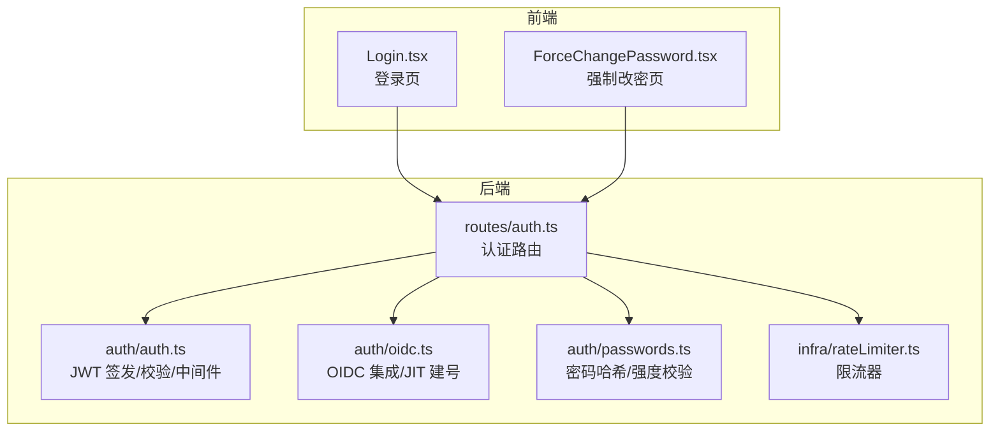
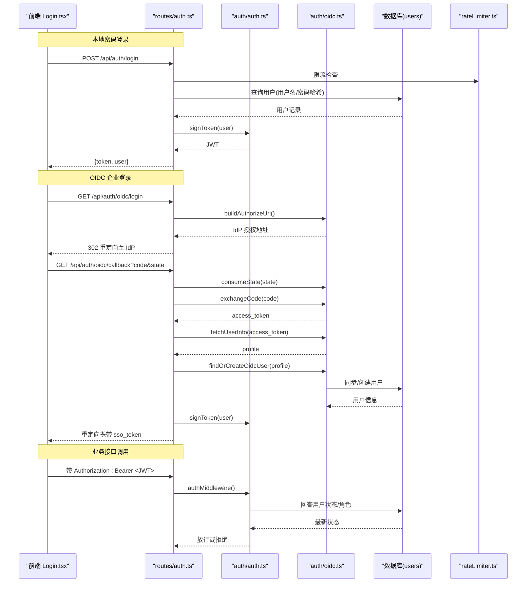
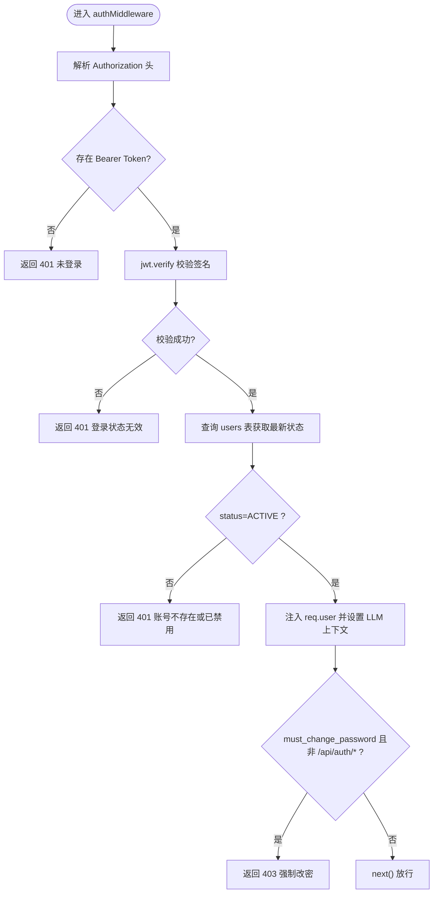
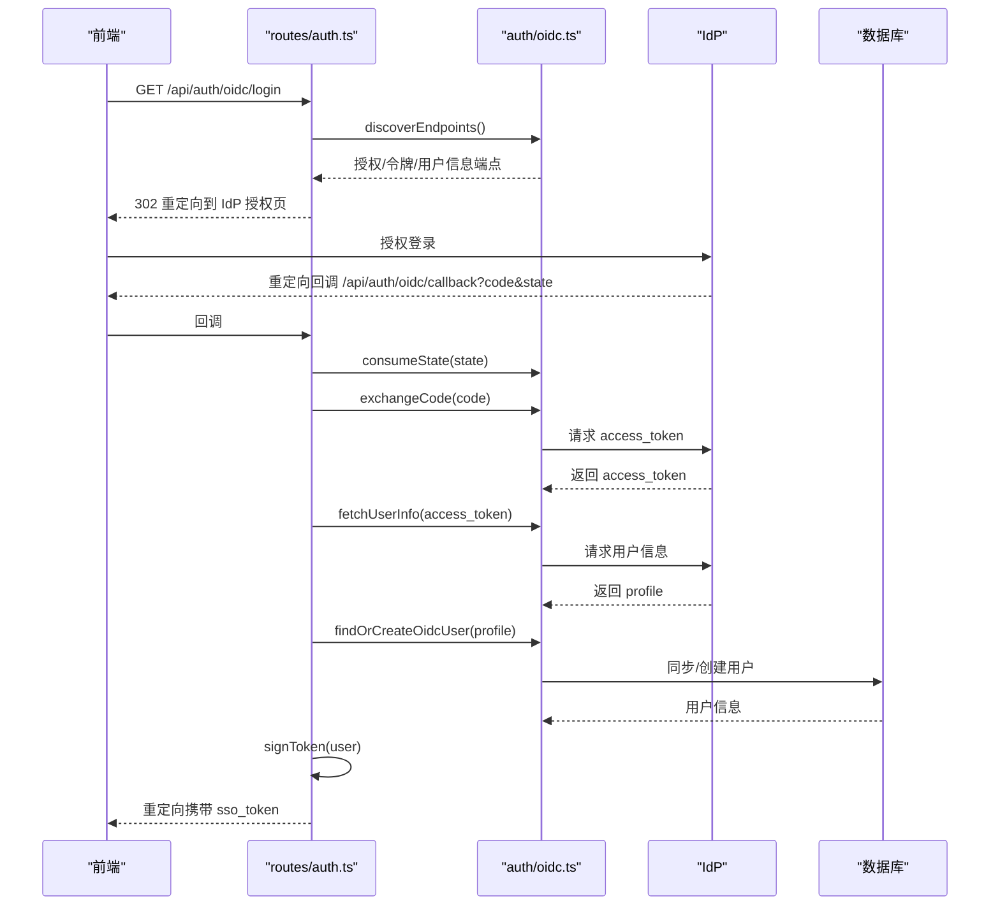
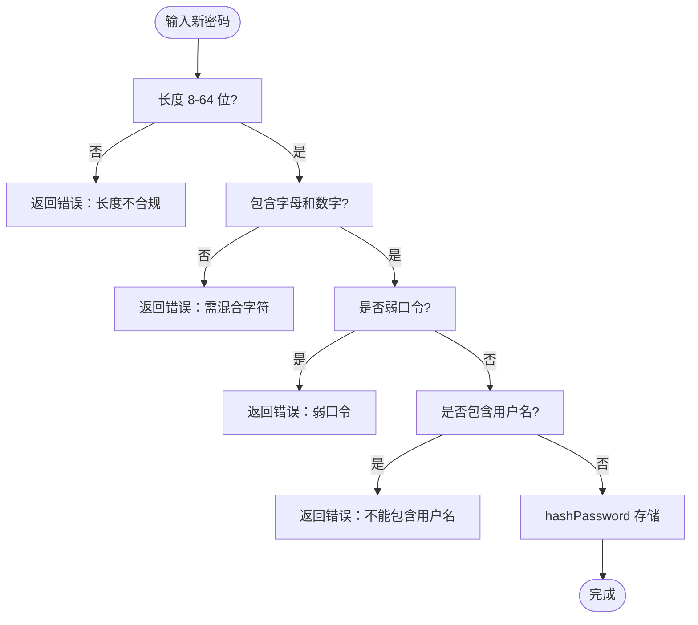
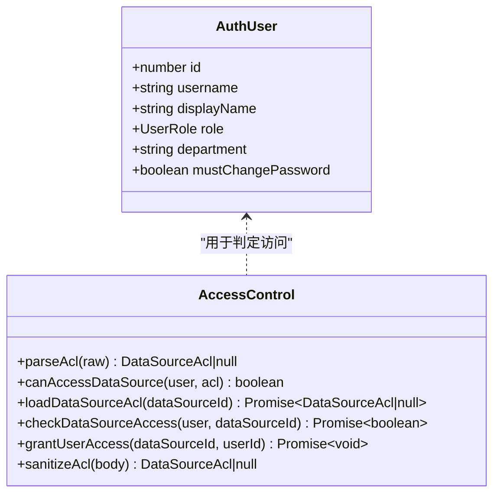
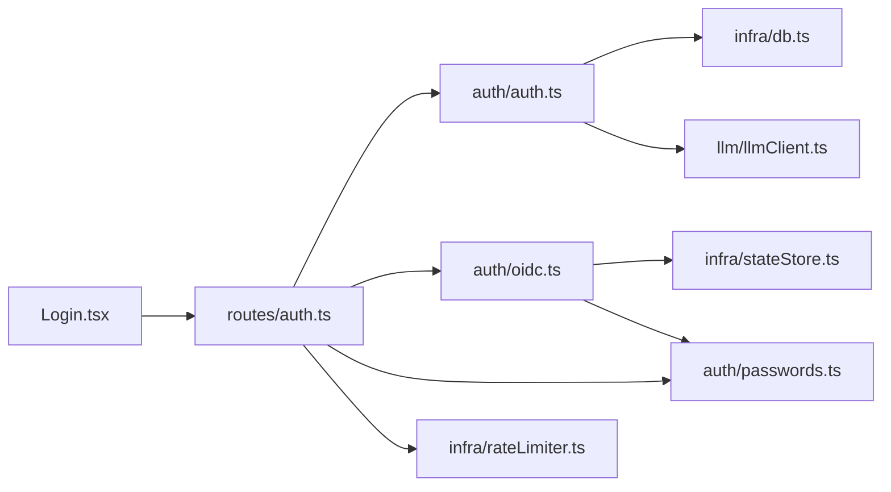

# 身份认证

<cite>
**本文引用的文件**
- [server/auth/auth.ts](file://server/auth/auth.ts)
- [server/auth/oidc.ts](file://server/auth/oidc.ts)
- [server/auth/passwords.ts](file://server/auth/passwords.ts)
- [server/routes/auth.ts](file://server/routes/auth.ts)
- [server/auth/accessControl.ts](file://server/auth/accessControl.ts)
- [server/infra/rateLimiter.ts](file://server/infra/rateLimiter.ts)
- [src/components/auth/Login.tsx](file://src/components/auth/Login.tsx)
- [src/components/auth/ForceChangePassword.tsx](file://src/components/auth/ForceChangePassword.tsx)
</cite>

## 目录
1. [简介](#简介)
2. [项目结构](#项目结构)
3. [核心组件](#核心组件)
4. [架构总览](#架构总览)
5. [详细组件分析](#详细组件分析)
6. [依赖关系分析](#依赖关系分析)
7. [性能与安全考量](#性能与安全考量)
8. [故障排查指南](#故障排查指南)
9. [结论](#结论)
10. [附录：配置与使用示例](#附录：配置与使用示例)

## 简介
本模块为智能问数据分析系统的身份认证子系统，提供本地密码登录、JWT 令牌签发与校验、OIDC 企业统一登录（SSO）、强制改密、会话状态检查与权限即时生效等能力。系统通过中间件在每次请求时回查用户状态，确保禁用账号、角色变更立即生效；同时结合限流器与强密码策略，保障认证链路安全。

## 项目结构
认证相关代码主要分布在 server/auth、server/routes/auth 以及前端登录组件中：
- server/auth：JWT 签发/校验、OIDC 流程、密码哈希与强度校验、数据源访问控制
- server/routes/auth：认证路由（登录、当前用户、改密、OIDC 回调）
- src/components/auth：前端登录页与强制改密页

**图表来源**
- [server/routes/auth.ts:1-156](file://server/routes/auth.ts#L1-L156)
- [server/auth/auth.ts:1-127](file://server/auth/auth.ts#L1-L127)
- [server/auth/oidc.ts:1-244](file://server/auth/oidc.ts#L1-L244)
- [server/auth/passwords.ts:1-100](file://server/auth/passwords.ts#L1-L100)
- [server/infra/rateLimiter.ts:1-54](file://server/infra/rateLimiter.ts#L1-L54)
- [src/components/auth/Login.tsx:1-137](file://src/components/auth/Login.tsx#L1-L137)
- [src/components/auth/ForceChangePassword.tsx:1-138](file://src/components/auth/ForceChangePassword.tsx#L1-L138)

**章节来源**
- [server/routes/auth.ts:1-156](file://server/routes/auth.ts#L1-L156)
- [server/auth/auth.ts:1-127](file://server/auth/auth.ts#L1-L127)
- [server/auth/oidc.ts:1-244](file://server/auth/oidc.ts#L1-L244)
- [server/auth/passwords.ts:1-100](file://server/auth/passwords.ts#L1-L100)
- [server/infra/rateLimiter.ts:1-54](file://server/infra/rateLimiter.ts#L1-L54)
- [src/components/auth/Login.tsx:1-137](file://src/components/auth/Login.tsx#L1-L137)
- [src/components/auth/ForceChangePassword.tsx:1-138](file://src/components/auth/ForceChangePassword.tsx#L1-L138)

## 核心组件
- JWT 令牌签发与校验：基于 jsonwebtoken，载荷包含用户标识、用户名与角色；过期时间由环境变量控制；密钥支持进程级随机兜底（开发环境）与固定密钥（生产）。
- 认证中间件：解析 Authorization 头中的 Bearer Token，验证签名后回查数据库用户状态与角色，注入 req.user，并处理强制改密拦截。
- OIDC 企业登录：授权码流程 + JIT 建号；支持 discovery 缓存、state 一次性票据防 CSRF、Redis 多实例共享 state。
- 密码安全：scrypt 哈希（含 pepper 可选），兼容新旧格式；强制复杂度规则与弱口令黑名单。
- 会话与权限：鉴权中间件每次请求回查 users 表，禁用账号、角色变更即时生效；可配合 requireRole 守卫实现细粒度权限控制。
- 限流保护：对登录与 OIDC 入口启用按 IP 的滑动窗口/固定窗口限流，防止爆破。

**章节来源**
- [server/auth/auth.ts:46-127](file://server/auth/auth.ts#L46-L127)
- [server/auth/oidc.ts:41-244](file://server/auth/oidc.ts#L41-L244)
- [server/auth/passwords.ts:18-100](file://server/auth/passwords.ts#L18-L100)
- [server/routes/auth.ts:41-153](file://server/routes/auth.ts#L41-L153)
- [server/infra/rateLimiter.ts:1-54](file://server/infra/rateLimiter.ts#L1-L54)

## 架构总览
下图展示了从前端到后端的完整认证流程，包括本地密码登录与 OIDC 企业登录两条路径，以及 JWT 校验与强制改密拦截。

**图表来源**
- [server/routes/auth.ts:41-153](file://server/routes/auth.ts#L41-L153)
- [server/auth/auth.ts:60-113](file://server/auth/auth.ts#L60-L113)
- [server/auth/oidc.ts:129-243](file://server/auth/oidc.ts#L129-L243)
- [server/infra/rateLimiter.ts:14-42](file://server/infra/rateLimiter.ts#L14-L42)
- [src/components/auth/Login.tsx:14-125](file://src/components/auth/Login.tsx#L14-L125)

## 详细组件分析

### JWT 令牌机制
- 令牌结构：载荷包含用户唯一标识、用户名与角色，便于后续权限判断与审计。
- 签发参数：过期时间由环境变量控制；密钥优先读取固定密钥，未配置时在进程内生成临时密钥（重启失效）。
- 校验流程：解析 Authorization 头，验证签名后回查数据库用户状态与角色，注入 req.user；若用户不存在或被禁用则拒绝。
- 强制改密：当 must_change_password 置位且访问非认证白名单接口时，返回特定错误码要求先改密。

**图表来源**
- [server/auth/auth.ts:66-113](file://server/auth/auth.ts#L66-L113)

**章节来源**
- [server/auth/auth.ts:46-127](file://server/auth/auth.ts#L46-L127)

### OIDC 企业登录集成
- 配置开关：仅当配置了 Issuer 与 Client ID 时启用；默认角色白名单外回退为只读角色。
- Discovery 缓存：1 小时缓存 IdP 端点，减少外部请求。
- State 防 CSRF：一次性随机票据，内存 Map 或 Redis（多实例共享），TTL 10 分钟。
- 授权码流程：构建授权链接 → 重定向 IdP → 回调校验 state → 交换 access_token → 拉取 userinfo → JIT 建号/同步 → 签发本地 JWT → 重定向回前端。
- 用户名规整：将第三方用户名规范化为合法本地用户名，避免冲突。

**图表来源**
- [server/routes/auth.ts:116-153](file://server/routes/auth.ts#L116-L153)
- [server/auth/oidc.ts:41-243](file://server/auth/oidc.ts#L41-L243)

**章节来源**
- [server/auth/oidc.ts:41-243](file://server/auth/oidc.ts#L41-L243)
- [server/routes/auth.ts:116-153](file://server/routes/auth.ts#L116-L153)

### 密码安全策略
- 存储加密：采用 scrypt 算法，显式参数 N、r、p，支持 pepper（环境变量），兼容旧格式哈希。
- 强度校验：长度 8-64 位，必须包含字母与数字，排除常见弱口令，禁止包含用户名。
- 强制改密：首次登录或被管理员重置密码后，必须修改密码才能访问业务接口；改密成功后清除标志位。
- 前端引导：强制改密页提示原密码与新密码一致性校验，提交后刷新状态。

**图表来源**
- [server/auth/passwords.ts:18-56](file://server/auth/passwords.ts#L18-L56)
- [server/routes/auth.ts:84-114](file://server/routes/auth.ts#L84-L114)
- [src/components/auth/ForceChangePassword.tsx:20-42](file://src/components/auth/ForceChangePassword.tsx#L20-L42)

**章节来源**
- [server/auth/passwords.ts:18-100](file://server/auth/passwords.ts#L18-L100)
- [server/routes/auth.ts:84-114](file://server/routes/auth.ts#L84-L114)
- [src/components/auth/ForceChangePassword.tsx:1-138](file://src/components/auth/ForceChangePassword.tsx#L1-L138)

### 会话管理与权限即时生效
- 会话状态检查：每次请求通过中间件回查 users 表，确保 status 为 ACTIVE；否则拒绝访问。
- 禁用账号处理：登录阶段与中间件均会检查账号状态，禁用即阻断。
- 权限变更即时生效：角色变更后，下一次请求即可生效；可通过 requireRole 守卫限制敏感操作。
- 组织维度访问控制：数据源 ACL 支持部门与个人白名单，ADMIN 豁免；与 DataScope 正交。

**图表来源**
- [server/auth/auth.ts:15-24](file://server/auth/auth.ts#L15-L24)
- [server/auth/accessControl.ts:13-108](file://server/auth/accessControl.ts#L13-L108)

**章节来源**
- [server/auth/auth.ts:66-113](file://server/auth/auth.ts#L66-L113)
- [server/auth/accessControl.ts:13-108](file://server/auth/accessControl.ts#L13-L108)

### 认证中间件使用示例与安全配置
- 中间件挂载：在需要鉴权的路由前挂载 authMiddleware；对敏感操作再叠加 requireRole('ADMIN'|'ANALYST')。
- 限流保护：对登录与 OIDC 入口挂载 rateLimiter，防止暴力破解。
- 安全配置要点：
  - 生产环境务必配置固定 JWT_SECRET 与合适的 JWT_EXPIRES_IN。
  - 建议开启 SCRYPT_PEPPER 以增强离线破解成本。
  - 多实例部署建议启用 REDIS_URL 以共享 state 与限流计数。
  - 合理配置 OIDC_ISSUER、OIDC_CLIENT_ID、OIDC_REDIRECT_URI、OIDC_DEFAULT_ROLE。

**章节来源**
- [server/routes/auth.ts:41-153](file://server/routes/auth.ts#L41-L153)
- [server/infra/rateLimiter.ts:14-42](file://server/infra/rateLimiter.ts#L14-L42)
- [server/auth/auth.ts:46-127](file://server/auth/auth.ts#L46-L127)

## 依赖关系分析
- routes/auth 依赖 auth/auth（JWT）、auth/oidc（SSO）、auth/passwords（密码）、infra/rateLimiter（限流）。
- auth/auth 依赖 infra/db（数据库连接池）、llm/llmClient（用户上下文注入）。
- auth/oidc 依赖 infra/stateStore（state 存储）、auth/passwords（JIT 建号占位密码）。
- 前端 Login.tsx 依赖后端 /api/auth/oidc/status 决定是否展示 SSO 入口。

**图表来源**
- [server/routes/auth.ts:1-20](file://server/routes/auth.ts#L1-L20)
- [server/auth/auth.ts:5-11](file://server/auth/auth.ts#L5-L11)
- [server/auth/oidc.ts:14-20](file://server/auth/oidc.ts#L14-L20)
- [src/components/auth/Login.tsx:14-18](file://src/components/auth/Login.tsx#L14-L18)

**章节来源**
- [server/routes/auth.ts:1-20](file://server/routes/auth.ts#L1-L20)
- [server/auth/auth.ts:5-11](file://server/auth/auth.ts#L5-L11)
- [server/auth/oidc.ts:14-20](file://server/auth/oidc.ts#L14-L20)
- [src/components/auth/Login.tsx:14-18](file://src/components/auth/Login.tsx#L14-L18)

## 性能与安全考量
- 性能
  - Discovery 端点缓存 1 小时，降低 IdP 往返开销。
  - 中间件仅在鉴权通过后回查数据库一次，避免重复查询。
  - 限流器支持 Redis 模式，多实例共享计数，避免热点 IP 攻击。
- 安全
  - JWT 密钥生产环境强制固定，开发环境进程级随机，杜绝跨环境伪造。
  - 密码哈希采用 scrypt，显式参数与 pepper，兼容旧格式但 fail-closed。
  - 强制改密与弱口令黑名单，降低初始密码风险。
  - OIDC state 一次性票据，防 CSRF；回调失败统一重定向错误提示。

[本节为通用指导，无需具体文件引用]

## 故障排查指南
- 登录失败
  - 检查用户名/密码是否正确；确认账号未被禁用；查看限流是否触发。
  - 参考：登录路由与限流器实现。
- OIDC 登录失败
  - 检查 OIDC 配置（Issuer、Client ID、Redirect URI）；确认 state 有效；查看回调错误参数。
  - 参考：OIDC 回调与状态消费逻辑。
- 强制改密拦截
  - 确认 must_change_password 标志位；访问 /api/auth/change-password 修改密码。
  - 参考：强制改密页与中间件拦截逻辑。
- 权限不足
  - 检查用户角色与 requireRole 守卫；确认数据源 ACL 配置。
  - 参考：角色守卫与数据源访问控制。

**章节来源**
- [server/routes/auth.ts:41-153](file://server/routes/auth.ts#L41-L153)
- [server/auth/auth.ts:66-113](file://server/auth/auth.ts#L66-L113)
- [server/auth/oidc.ts:129-243](file://server/auth/oidc.ts#L129-L243)
- [server/auth/accessControl.ts:43-73](file://server/auth/accessControl.ts#L43-L73)
- [server/infra/rateLimiter.ts:14-42](file://server/infra/rateLimiter.ts#L14-L42)

## 结论
本认证模块以 JWT 为核心，结合 OIDC 企业登录、强密码策略与会话状态回查，实现了高安全、可扩展的身份认证体系。通过中间件与守卫的组合，确保权限变更即时生效；通过限流与 state 机制，抵御常见攻击面。建议在生产环境严格配置密钥与环境变量，并结合 Redis 提升多实例一致性与安全性。

[本节为总结性内容，无需具体文件引用]

## 附录：配置与使用示例
- JWT 配置
  - JWT_SECRET：生产环境必须配置固定强密钥；未配置时进程级随机（重启失效）。
  - JWT_EXPIRES_IN：令牌过期时间，默认 12 小时。
- OIDC 配置
  - OIDC_ISSUER：IdP 根地址（去除尾斜杠）。
  - OIDC_CLIENT_ID / OIDC_CLIENT_SECRET：客户端凭据（公共客户端可留空）。
  - OIDC_REDIRECT_URI：回调地址，默认 http://localhost:{PORT}/api/auth/oidc/callback。
  - OIDC_DEFAULT_ROLE：JIT 建号默认角色，白名单外回退 VIEWER。
- 密码策略
  - SCRYPT_PEPPER：服务级 pepper，与库表分离存储，增强离线破解成本。
  - 复杂度：8-64 位，字母+数字，排除弱口令，禁止包含用户名。
- 中间件使用
  - 鉴权：在路由前挂载 authMiddleware。
  - 权限：对敏感操作叠加 requireRole('ADMIN'|'ANALYST')。
  - 限流：对登录与 OIDC 入口挂载 rateLimiter。

**章节来源**
- [server/auth/auth.ts:46-64](file://server/auth/auth.ts#L46-L64)
- [server/auth/oidc.ts:41-56](file://server/auth/oidc.ts#L41-L56)
- [server/auth/passwords.ts:15-48](file://server/auth/passwords.ts#L15-L48)
- [server/routes/auth.ts:41-153](file://server/routes/auth.ts#L41-L153)
- [server/infra/rateLimiter.ts:14-42](file://server/infra/rateLimiter.ts#L14-L42)