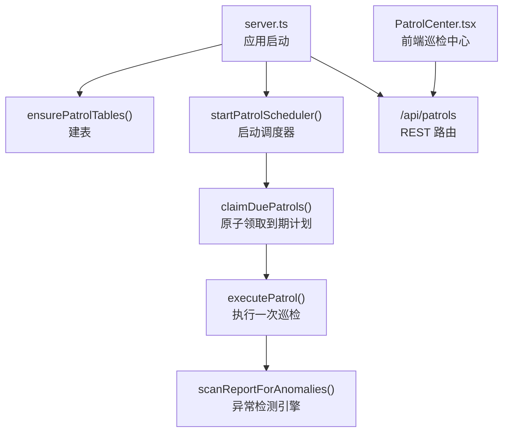
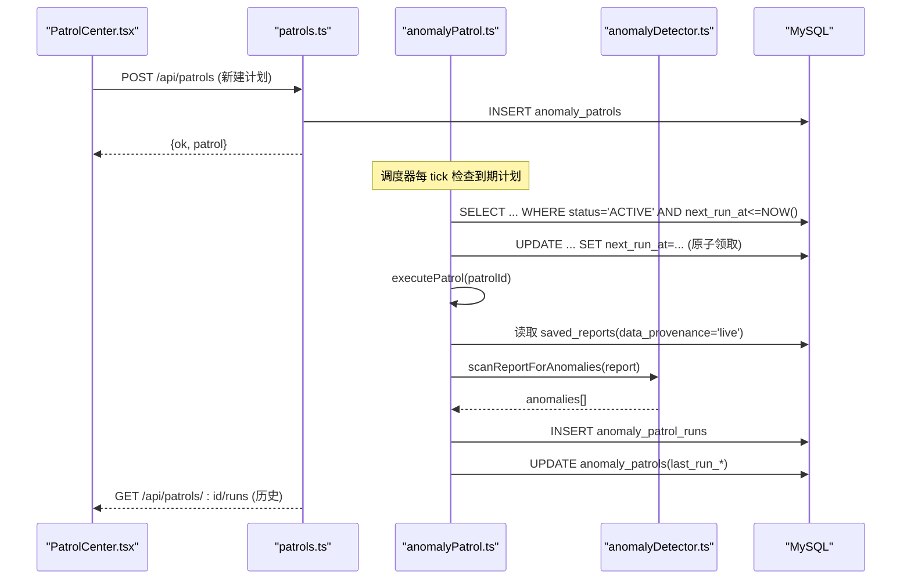
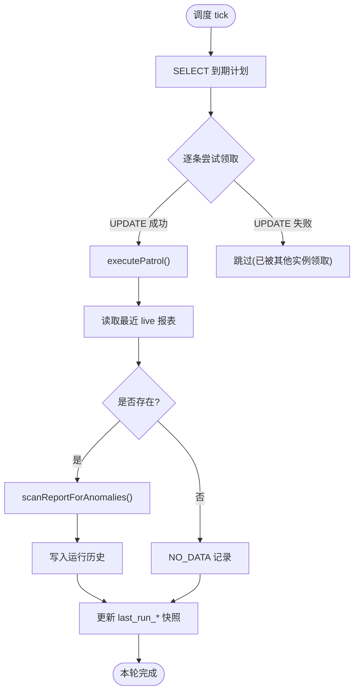
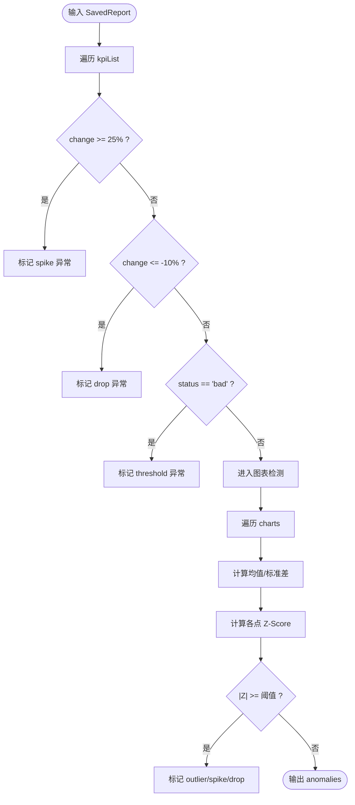
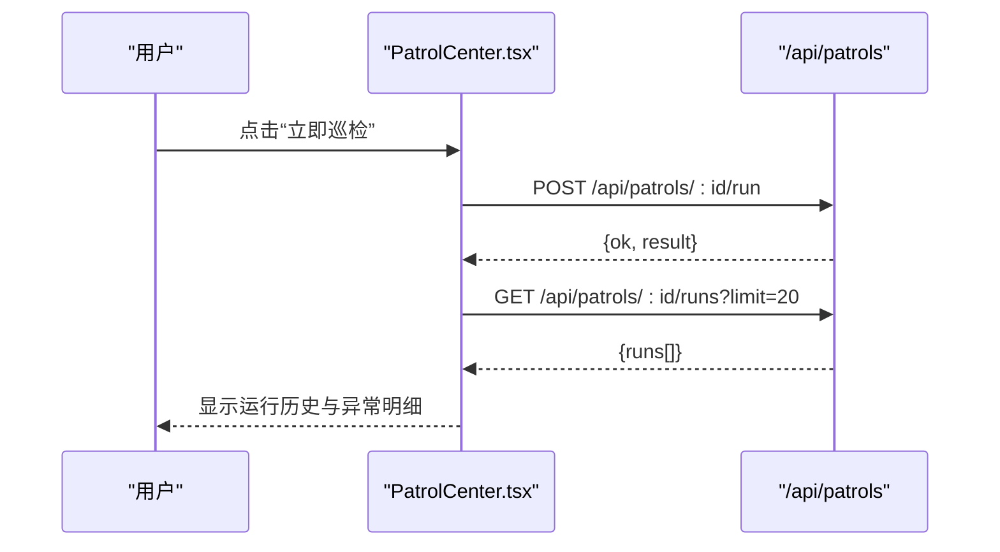
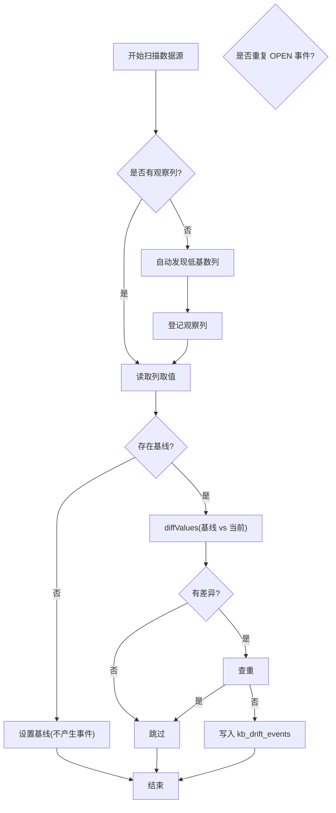
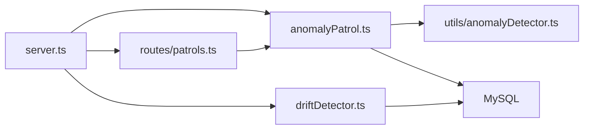

# 异常巡逻系统

<cite>
**本文引用的文件**
- [server/anomalyPatrol.ts](file://server/anomalyPatrol.ts)
- [server/routes/patrols.ts](file://server/routes/patrols.ts)
- [src/components/reports/PatrolCenter.tsx](file://src/components/reports/PatrolCenter.tsx)
- [src/utils/anomalyDetector.ts](file://src/utils/anomalyDetector.ts)
- [server/driftDetector.ts](file://server/driftDetector.ts)
- [server.ts](file://server.ts)
- [src/types/analytics.ts](file://src/types/analytics.ts)
</cite>

## 目录
1. [简介](#简介)
2. [项目结构](#项目结构)
3. [核心组件](#核心组件)
4. [架构总览](#架构总览)
5. [详细组件分析](#详细组件分析)
6. [依赖关系分析](#依赖关系分析)
7. [性能考虑](#性能考虑)
8. [故障排查指南](#故障排查指南)
9. [结论](#结论)

## 简介
本系统提供“异常巡逻”能力：为每个数据源创建巡检计划，按周期自动扫描该数据源最新一份真实数据（live）的决策报表，基于统计规则（Z-Score、阈值、波动率等）检测指标异常，并将结果持久化到运行历史中，供前端“异常巡检中心”统一展示与操作。系统内置低频调度器，支持多实例并发安全执行；同时提供知识库漂移检测能力，辅助知识文档时效性管理。

## 项目结构
围绕异常巡逻的核心代码分布在服务端路由、调度与执行、前端界面以及异常检测算法四个层面：
- 服务端入口负责启动时建表并启动调度器
- 路由层暴露 REST API 用于计划管理与手动触发
- 调度器周期性领取到期计划并执行扫描
- 异常检测引擎对 KPI 与图表数据进行统计异常判定
- 前端提供巡检计划管理、运行历史查看与即时执行

**图示来源**
- [server.ts:112-150](file://server.ts#L112-L150)
- [server/anomalyPatrol.ts:95-133](file://server/anomalyPatrol.ts#L95-L133)
- [server/anomalyPatrol.ts:332-398](file://server/anomalyPatrol.ts#L332-L398)
- [server/routes/patrols.ts:1-210](file://server/routes/patrols.ts#L1-L210)
- [src/components/reports/PatrolCenter.tsx:1-558](file://src/components/reports/PatrolCenter.tsx#L1-L558)

**章节来源**
- [server.ts:112-150](file://server.ts#L112-L150)
- [server/anomalyPatrol.ts:95-133](file://server/anomalyPatrol.ts#L95-L133)
- [server/anomalyPatrol.ts:332-398](file://server/anomalyPatrol.ts#L332-L398)
- [server/routes/patrols.ts:1-210](file://server/routes/patrols.ts#L1-L210)
- [src/components/reports/PatrolCenter.tsx:1-558](file://src/components/reports/PatrolCenter.tsx#L1-L558)

## 核心组件
- 巡检计划与运行记录模型：定义计划状态、运行状态、字段约束与存储结构
- 调度器：定时 tick、原子领取到期计划、防重入保护、日志记录
- 执行器：加载最近 live 报表、调用异常检测引擎、落库运行历史与计划快照
- 异常检测引擎：KPI 突增/骤降/阈值越界；图表时间序列 Z-Score 离群检测
- 前端巡检中心：计划 CRUD、启停、立即执行、运行历史弹窗、异常明细展示
- 知识库漂移检测：低基数列取值快照比对，发现新增/消失值生成事件

**章节来源**
- [server/anomalyPatrol.ts:18-71](file://server/anomalyPatrol.ts#L18-L71)
- [server/anomalyPatrol.ts:244-330](file://server/anomalyPatrol.ts#L244-L330)
- [src/utils/anomalyDetector.ts:1-146](file://src/utils/anomalyDetector.ts#L1-L146)
- [src/components/reports/PatrolCenter.tsx:24-558](file://src/components/reports/PatrolCenter.tsx#L24-L558)
- [server/driftDetector.ts:1-285](file://server/driftDetector.ts#L1-L285)

## 架构总览
系统采用“计划驱动 + 内置调度 + 统计异常检测”的架构：
- 计划层：以数据源为单位维护巡检计划，包含间隔、状态、下次执行时间等
- 调度层：基于数据库时间推进 next_run_at，使用 UPDATE 条件竞争实现多实例安全执行
- 执行层：读取最近 live 报表，调用异常检测引擎，写入运行历史与计划快照
- 展示层：前端提供计划管理、运行历史查看与即时执行

**图示来源**
- [server/routes/patrols.ts:57-93](file://server/routes/patrols.ts#L57-L93)
- [server/anomalyPatrol.ts:352-381](file://server/anomalyPatrol.ts#L352-L381)
- [server/anomalyPatrol.ts:280-330](file://server/anomalyPatrol.ts#L280-L330)
- [src/utils/anomalyDetector.ts:11-146](file://src/utils/anomalyDetector.ts#L11-L146)

## 详细组件分析

### 调度器与执行流程
- 调度周期：默认 60 秒，可通过环境变量调整
- 批量领取：每次 tick 最多领取若干到期计划，避免单次负载过大
- 原子领取：通过带条件的 UPDATE 确保同一计划仅被一个实例执行
- 防重入：闭包标记 ticking，防止慢扫描导致重复执行
- 执行逻辑：加载最近 live 报表 → 调用异常检测 → 写入运行历史 → 更新计划快照

**图示来源**
- [server/anomalyPatrol.ts:332-398](file://server/anomalyPatrol.ts#L332-L398)
- [server/anomalyPatrol.ts:280-330](file://server/anomalyPatrol.ts#L280-L330)

**章节来源**
- [server/anomalyPatrol.ts:332-398](file://server/anomalyPatrol.ts#L332-L398)
- [server/anomalyPatrol.ts:280-330](file://server/anomalyPatrol.ts#L280-L330)

### 异常检测引擎
- KPI 检测：根据 change 百分比判断突增或骤降，结合业务阈值标记异常
- 图表检测：对时间序列计算均值与标准差，使用 Z-Score 阈值识别离群点
- 小样本策略：样本少于 10 时使用更严格的阈值，降低误报
- 输出结构：返回异常列表，包含严重级别、类型、偏离百分比、原因说明等

**图示来源**
- [src/utils/anomalyDetector.ts:11-146](file://src/utils/anomalyDetector.ts#L11-L146)

**章节来源**
- [src/utils/anomalyDetector.ts:11-146](file://src/utils/anomalyDetector.ts#L11-L146)

### 前端巡检中心
- 计划管理：新建、启停、删除，权限控制（ADMIN/ANALYST）
- 运行历史：弹窗展示最近运行记录与 Top10 异常明细
- 即时执行：按钮触发立即巡检，不改变既有排期
- 状态展示：上次巡检时间、结果标签、下次巡检时间

**图示来源**
- [src/components/reports/PatrolCenter.tsx:188-226](file://src/components/reports/PatrolCenter.tsx#L188-L226)
- [server/routes/patrols.ts:168-207](file://server/routes/patrols.ts#L168-L207)

**章节来源**
- [src/components/reports/PatrolCenter.tsx:188-226](file://src/components/reports/PatrolCenter.tsx#L188-L226)
- [server/routes/patrols.ts:168-207](file://server/routes/patrols.ts#L168-L207)

### 知识库漂移检测
- 观察名单：kb_drift_watch 记录数据源×表×列的取值快照
- 自动发现：当名单为空时，基于 Schema 自动发现低基数列（字符串列且 DISTINCT ≤ 50）
- 扫描比对：读取当前取值与基线对比，新增/消失值生成漂移事件
- 去重机制：同列相同内容的 OPEN 事件不重复告警

**图示来源**
- [server/driftDetector.ts:157-220](file://server/driftDetector.ts#L157-L220)
- [server/driftDetector.ts:57-66](file://server/driftDetector.ts#L57-L66)

**章节来源**
- [server/driftDetector.ts:157-220](file://server/driftDetector.ts#L157-L220)
- [server/driftDetector.ts:57-66](file://server/driftDetector.ts#L57-L66)

## 依赖关系分析
- 服务启动依赖：初始化数据库 schema、注册任务处理器、启动健康检查、启动漂移扫描与异常巡检调度
- 路由依赖：鉴权中间件、限流、审计日志、错误码
- 数据依赖：saved_reports（live 决策报表）、data_sources（数据源元信息）
- 外部依赖：MySQL 连接池、可选 Redis（多实例共享状态）

**图示来源**
- [server.ts:112-150](file://server.ts#L112-L150)
- [server/routes/patrols.ts:1-210](file://server/routes/patrols.ts#L1-L210)
- [server/anomalyPatrol.ts:95-133](file://server/anomalyPatrol.ts#L95-L133)
- [server/driftDetector.ts:1-285](file://server/driftDetector.ts#L1-L285)

**章节来源**
- [server.ts:112-150](file://server.ts#L112-L150)
- [server/routes/patrols.ts:1-210](file://server/routes/patrols.ts#L1-L210)
- [server/anomalyPatrol.ts:95-133](file://server/anomalyPatrol.ts#L95-L133)
- [server/driftDetector.ts:1-285](file://server/driftDetector.ts#L1-L285)

## 性能考虑
- 调度频率：默认 60 秒 tick，可通过环境变量调整；单 tick 批量领取限制上限，避免过载
- 异常检测：对图表数据计算均值与标准差，复杂度 O(n)，小样本提高阈值降低误报
- 存储优化：运行历史仅保留 Top10 异常明细，减少 JSON 体积
- 并发安全：原子领取避免多实例重复执行；闭包防重入避免慢扫描导致的并发问题
- I/O 路径：读取 saved_reports 仅取最近一条，索引优化查询性能

[本节为通用性能讨论，无需特定文件引用]

## 故障排查指南
- 无数据可扫描：若数据源无 live 决策报表，巡检结果为 NO_DATA，需先生成真实数据报表
- 执行失败：检查数据库连接、saved_reports 数据结构（kpiList/charts 数组）、异常检测引擎返回值
- 调度未执行：确认调度器已启动、next_run_at 是否正确推进、status 是否为 ACTIVE
- 权限问题：仅 ADMIN/ANALYST 可创建/更新/删除计划；非所有者访问返回 404 防探测
- 漂移事件重复：系统对相同内容的 OPEN 事件去重，避免重复告警

**章节来源**
- [server/anomalyPatrol.ts:247-264](file://server/anomalyPatrol.ts#L247-L264)
- [server/anomalyPatrol.ts:280-330](file://server/anomalyPatrol.ts#L280-L330)
- [server/routes/patrols.ts:37-44](file://server/routes/patrols.ts#L37-L44)
- [server/driftDetector.ts:199-214](file://server/driftDetector.ts#L199-L214)

## 结论
异常巡逻系统通过“计划 + 调度 + 统计检测”的组合，实现了对数据源决策报表的自动化异常监控。系统具备多实例安全执行、前端可视化管控、运行历史追溯与知识库漂移检测等能力，适用于生产环境的持续质量保障与风险预警。建议在生产环境中合理配置调度频率、异常阈值与存储保留策略，并结合告警通道实现及时响应。