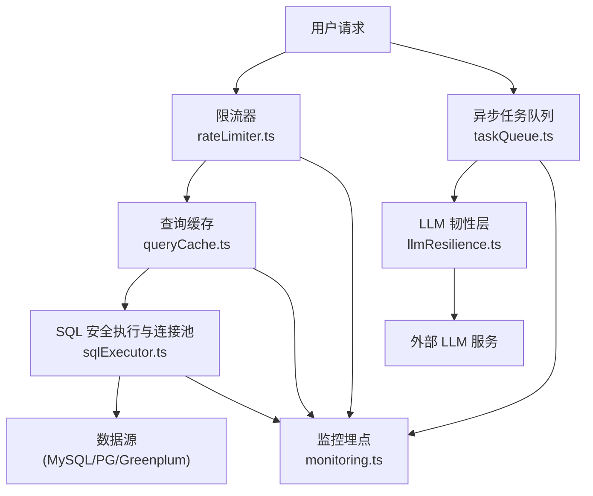
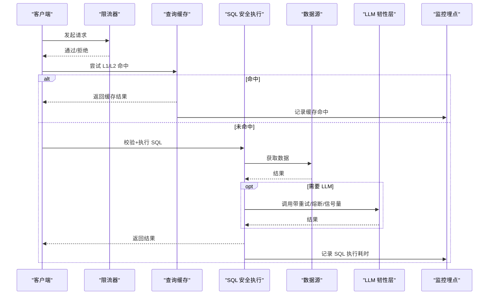
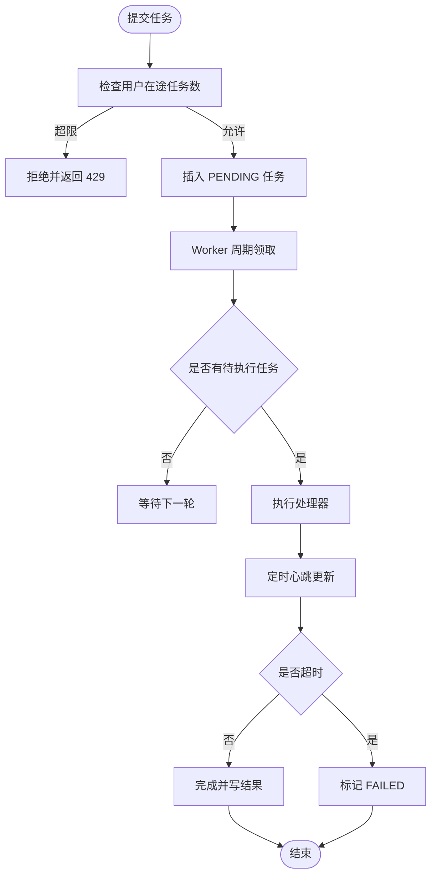
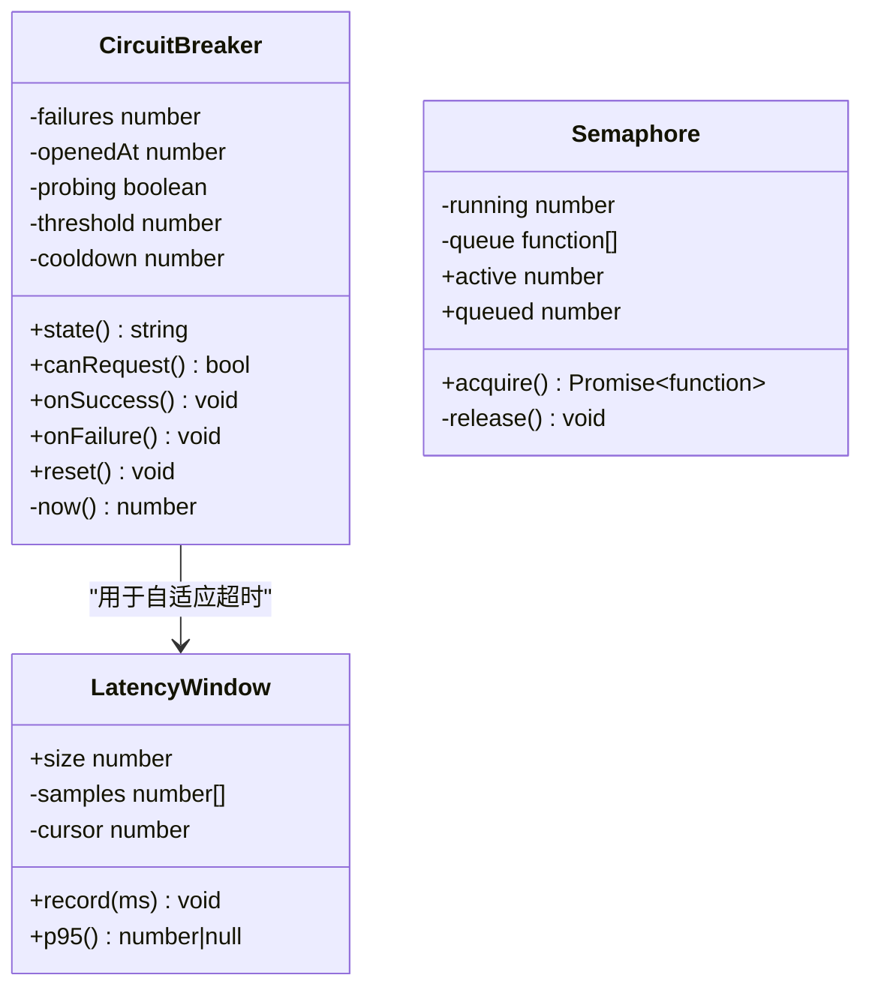
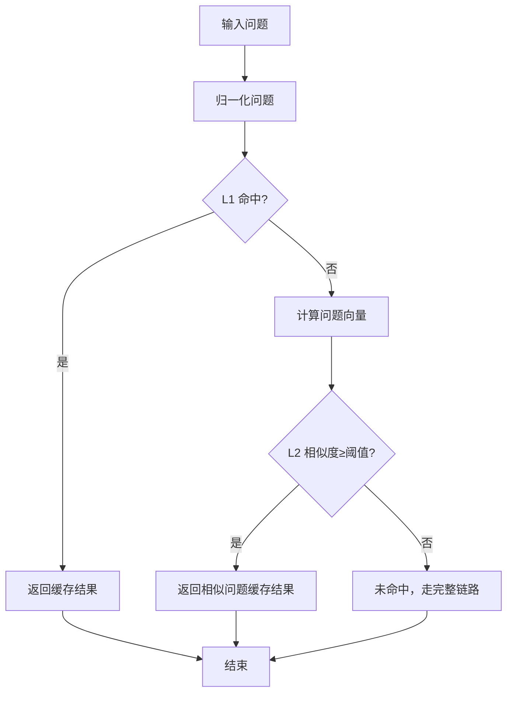
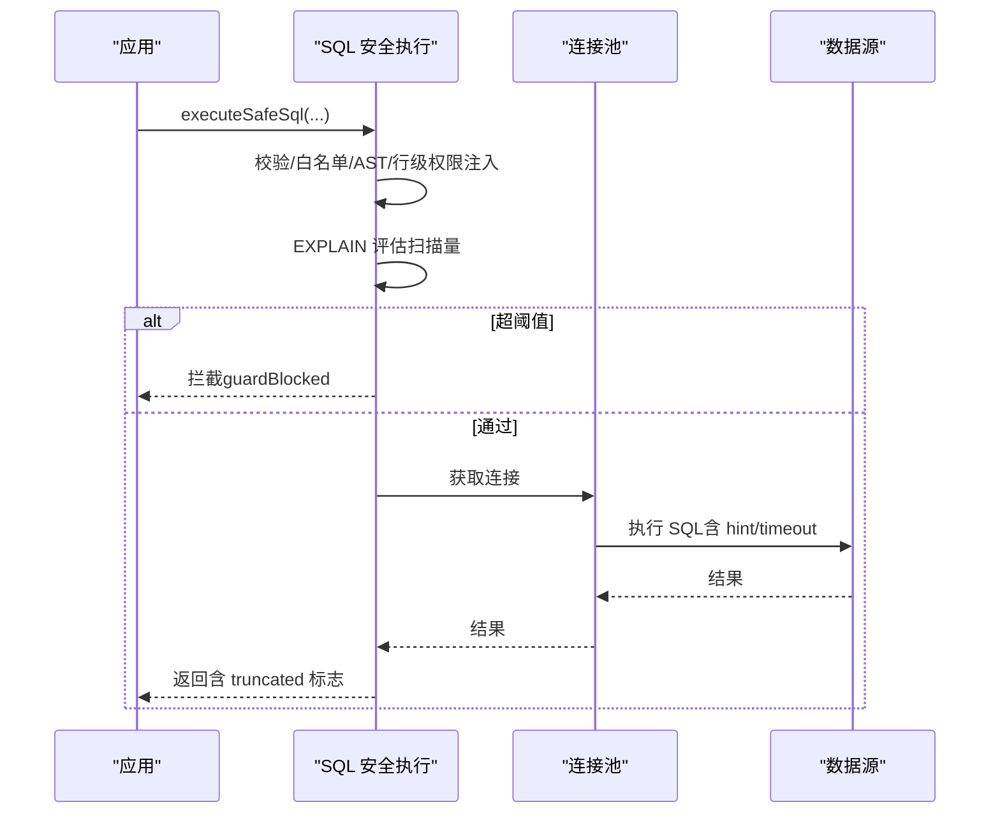
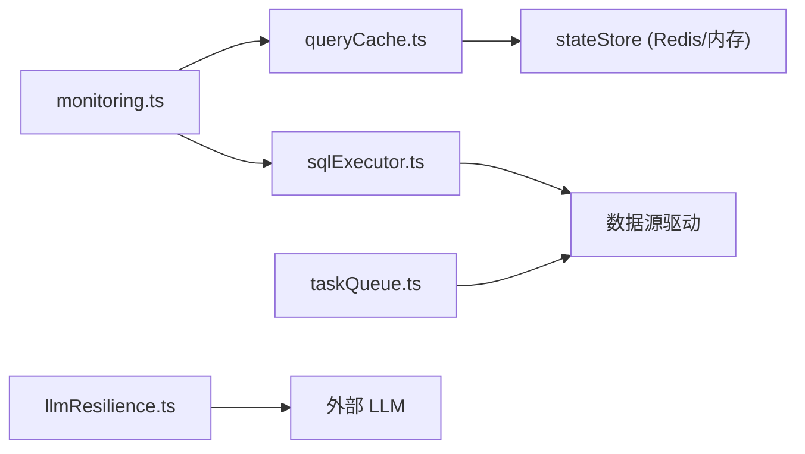

# 性能优化

<cite>
**本文引用的文件**
- [server/infra/taskQueue.ts](file://server/infra/taskQueue.ts)
- [server/llm/llmResilience.ts](file://server/llm/llmResilience.ts)
- [server/query/queryCache.ts](file://server/query/queryCache.ts)
- [server/query/sqlExecutor.ts](file://server/query/sqlExecutor.ts)
- [server/query/sqlExecutorPool.test.ts](file://server/query/sqlExecutorPool.test.ts)
- [server/infra/rateLimiter.ts](file://server/infra/rateLimiter.ts)
- [server/infra/monitoring.ts](file://server/infra/monitoring.ts)
- [server/routes/metrics.ts](file://server/routes/metrics.ts)
- [server/eval/loadTest.ts](file://server/eval/loadTest.ts)
- [docs/容量规划与压测报告-P1-9.md](file://docs/容量规划与压测报告-P1-9.md)
- [docs/性能专项评估报告-20260902.md](file://docs/性能专项评估报告-20260902.md)
</cite>

## 目录
1. [简介](#简介)
2. [项目结构](#项目结构)
3. [核心组件](#核心组件)
4. [架构总览](#架构总览)
5. [详细组件分析](#详细组件分析)
6. [依赖关系分析](#依赖关系分析)
7. [性能考量](#性能考量)
8. [故障排查指南](#故障排查指南)
9. [结论](#结论)
10. [附录](#附录)

## 简介
本文件聚焦智能问数据分析系统的性能优化，覆盖异步任务队列、LLM 调用熔断降级、查询缓存策略、连接池优化、监控指标、瓶颈分析方法、资源使用优化、并发控制、内存管理、GC 调优、压测工具与基准测试、容量规划、生产调优经验、故障预警与弹性扩缩容方案。内容基于仓库内实现与评测文档进行系统化梳理，帮助读者在生产环境中稳定、高效地运行系统。

## 项目结构
围绕性能优化的关键模块分布如下：
- 异步任务队列：server/infra/taskQueue.ts
- LLM 韧性（重试、熔断、信号量、自适应超时）：server/llm/llmResilience.ts
- 查询缓存（L1 精确 + L2 语义）：server/query/queryCache.ts
- SQL 安全执行与连接池分级：server/query/sqlExecutor.ts
- 限流器（IP 级滑动窗口/Redis 固定窗口）：server/infra/rateLimiter.ts
- Prometheus 监控埋点：server/infra/monitoring.ts
- 指标层路由（示例：指标查询复用安全执行层）：server/routes/metrics.ts
- 压测脚本与容量规划报告：server/eval/loadTest.ts、docs/容量规划与压测报告-P1-9.md、docs/性能专项评估报告-20260902.md

图表来源
- [server/infra/rateLimiter.ts:1-54](file://server/infra/rateLimiter.ts#L1-L54)
- [server/query/queryCache.ts:1-254](file://server/query/queryCache.ts#L1-L254)
- [server/query/sqlExecutor.ts:1-800](file://server/query/sqlExecutor.ts#L1-L800)
- [server/infra/taskQueue.ts:1-347](file://server/infra/taskQueue.ts#L1-L347)
- [server/llm/llmResilience.ts:1-245](file://server/llm/llmResilience.ts#L1-L245)
- [server/infra/monitoring.ts:1-153](file://server/infra/monitoring.ts#L1-L153)

章节来源
- [server/infra/rateLimiter.ts:1-54](file://server/infra/rateLimiter.ts#L1-L54)
- [server/query/queryCache.ts:1-254](file://server/query/queryCache.ts#L1-L254)
- [server/query/sqlExecutor.ts:1-800](file://server/query/sqlExecutor.ts#L1-L800)
- [server/infra/taskQueue.ts:1-347](file://server/infra/taskQueue.ts#L1-L347)
- [server/llm/llmResilience.ts:1-245](file://server/llm/llmResilience.ts#L1-L245)
- [server/infra/monitoring.ts:1-153](file://server/infra/monitoring.ts#L1-L153)

## 核心组件
- 异步任务队列：持久化到 MySQL 的长任务队列，支持心跳、孤儿回收、并发上限与用户排队上限，避免 HTTP 长时间占用。
- LLM 韧性：指数退避重试、引擎级熔断器、并发信号量、自适应超时，保护后端 LLM 服务并提升整体可用性。
- 查询缓存：L1 归一化精确命中 + L2 语义相似度命中；默认内存 Map，可选 Redis 多实例共享；TTL 可配置，失效联动。
- SQL 安全执行与连接池：SELECT-only 白名单、AST 复核、行级权限注入、EXPLAIN 防线、场景化连接池配额与超时档位。
- 限流器：按 IP 计数，内存滑动窗口或 Redis 固定窗口，防止突发流量打爆系统。
- 监控埋点：Prometheus 指标，覆盖请求耗时、缓存命中、LLM 调用、SQL 执行等，fail-open 不阻塞业务。

章节来源
- [server/infra/taskQueue.ts:1-347](file://server/infra/taskQueue.ts#L1-L347)
- [server/llm/llmResilience.ts:1-245](file://server/llm/llmResilience.ts#L1-L245)
- [server/query/queryCache.ts:1-254](file://server/query/queryCache.ts#L1-L254)
- [server/query/sqlExecutor.ts:1-800](file://server/query/sqlExecutor.ts#L1-L800)
- [server/infra/rateLimiter.ts:1-54](file://server/infra/rateLimiter.ts#L1-L54)
- [server/infra/monitoring.ts:1-153](file://server/infra/monitoring.ts#L1-L153)

## 架构总览
下图展示一次典型“问数”请求在性能优化层的流转：先经限流，再查缓存；未命中则进入 SQL 安全执行层，必要时走 LLM 韧性层；所有路径均记录监控指标。

图表来源
- [server/infra/rateLimiter.ts:1-54](file://server/infra/rateLimiter.ts#L1-L54)
- [server/query/queryCache.ts:1-254](file://server/query/queryCache.ts#L1-L254)
- [server/query/sqlExecutor.ts:1-800](file://server/query/sqlExecutor.ts#L1-L800)
- [server/llm/llmResilience.ts:1-245](file://server/llm/llmResilience.ts#L1-L245)
- [server/infra/monitoring.ts:1-153](file://server/infra/monitoring.ts#L1-L153)

## 详细组件分析

### 异步任务队列机制
- 设计要点
  - 持久化：MySQL 表 async_tasks，状态机 PENDING/RUNNING/SUCCESS/FAILED。
  - 原子领取：利用 SKIP LOCKED 避免重复领取，支持多 worker/多实例。
  - 并发与排队：worker 并发上限 TASK_WORKER_CONCURRENCY；同用户在途上限 TASK_QUEUE_USER_MAX。
  - 心跳与孤儿回收：RUNNING 任务定期心跳，超时后 attempts < 最大重试次数回队重跑，否则标 FAILED。
  - 超时保护：任务执行期有独立超时，避免长期悬挂。
- 适用场景
  - 报告生成、PDF 导出等分钟级长任务，避免 HTTP 连接与用户并发槽被长时间占用。
- 监控与可观测性
  - 任务状态变更、失败原因、孤儿回收数量可通过日志与数据库观察；建议结合 Prometheus 自定义指标扩展。

图表来源
- [server/infra/taskQueue.ts:1-347](file://server/infra/taskQueue.ts#L1-L347)

章节来源
- [server/infra/taskQueue.ts:1-347](file://server/infra/taskQueue.ts#L1-L347)

### LLM 调用熔断降级
- 重试策略
  - 仅对可恢复错误重试（超时、网络错误、5xx、429），4xx 立即失败，避免浪费配额。
  - 指数退避 + 抖动，降低多实例重试风暴。
- 熔断器
  - 按引擎隔离（ollama/qwen/gemini 等），连续失败 N 次开路，冷却期后半开单探测恢复。
- 并发信号量
  - 每引擎限制并发，超出排队，避免打爆推理进程。
- 自适应超时
  - 基于近期成功调用 P95×3 动态调整超时，夹在配置上下限之间，兼顾慢模型与快模型。

图表来源
- [server/llm/llmResilience.ts:1-245](file://server/llm/llmResilience.ts#L1-L245)

章节来源
- [server/llm/llmResilience.ts:1-245](file://server/llm/llmResilience.ts#L1-L245)

### 查询缓存策略
- L1 精确命中
  - 归一化问题键（小写、去空白标点），默认内存 Map，TTL 可配置（默认 30 分钟）。
  - 可选 Redis 模式，多实例共享；大结果集超过阈值不缓存，防内存膨胀。
- L2 语义命中
  - 基于 embedding 相似度（默认阈值 0.95），匹配最近成功结果；命中时返回原问题供前端标注。
  - 索引条目按数据源+模型变体隔离，过期自动清理。
- 失效联动
  - 数据源结构变更后调用失效函数，清理对应前缀键与语义索引。

图表来源
- [server/query/queryCache.ts:1-254](file://server/query/queryCache.ts#L1-L254)

章节来源
- [server/query/queryCache.ts:1-254](file://server/query/queryCache.ts#L1-L254)

### 连接池优化与安全执行
- 场景化连接池
  - 交互/分析链/导出三类场景独立配额与超时档位，避免后台任务挤占交互体验。
  - 公式化容量：DS_POOL_MAX 显式优先，否则按 EXPECTED_CONCURRENT_USERS 推导并 clamp。
- 安全执行
  - SELECT-only、表名白名单、敏感列拒绝、单语句、强制 LIMIT、结果行数截断。
  - AST 二道防线与行级权限注入（CTE 递归包裹）。
  - EXPLAIN 防线：预估扫描超阈值拦截，保护数据源。
- MySQL 服务端时限
  - 注入 MAX_EXECUTION_TIME hint，双保险（驱动 timeout + hint）。

图表来源
- [server/query/sqlExecutor.ts:1-800](file://server/query/sqlExecutor.ts#L1-L800)

章节来源
- [server/query/sqlExecutor.ts:1-800](file://server/query/sqlExecutor.ts#L1-L800)
- [server/query/sqlExecutorPool.test.ts:1-171](file://server/query/sqlExecutorPool.test.ts#L1-L171)

### 限流与并发控制
- 限流器
  - 内存滑动窗口（默认 60s）或 Redis 固定窗口（多实例共享）；超限返回 429。
- 并发控制
  - LLM 侧按引擎信号量限流；任务队列 worker 并发上限；用户任务排队上限。
  - 场景化连接池配额隔离，避免不同场景互相影响。

章节来源
- [server/infra/rateLimiter.ts:1-54](file://server/infra/rateLimiter.ts#L1-L54)
- [server/llm/llmResilience.ts:1-245](file://server/llm/llmResilience.ts#L1-L245)
- [server/infra/taskQueue.ts:1-347](file://server/infra/taskQueue.ts#L1-L347)
- [server/query/sqlExecutor.ts:1-800](file://server/query/sqlExecutor.ts#L1-L800)

### 监控指标与可观测性
- 指标类型
  - 请求总数与耗时直方图、缓存命中计数、LLM 调用耗时与 token 消耗、SQL 执行耗时、EXPLAIN 防线统计、HTTP 接口耗时。
- 采集方式
  - 旁路埋点（fail-open），不侵入热路径；/metrics 端点暴露 Prometheus 格式。
- 告警与可视化
  - 结合 Grafana 仪表盘（部署目录包含多个 dashboard JSON）与 Prometheus 规则进行告警。

章节来源
- [server/infra/monitoring.ts:1-153](file://server/infra/monitoring.ts#L1-L153)
- [server/routes/metrics.ts:1-302](file://server/routes/metrics.ts#L1-L302)

## 依赖关系分析
- 低耦合高内聚
  - 各组件通过明确接口协作：任务队列、缓存、执行层、韧性层、监控彼此解耦。
- 直接依赖
  - 监控埋点被多处调用（缓存、SQL 执行、审计、LLM 用量）。
  - 缓存依赖状态存储（内存或 Redis），语义缓存依赖 embedding 能力。
  - SQL 执行依赖数据源配置与驱动（mysql2/pg）。
- 潜在风险
  - 若 Redis 不可用，缓存与限流降级为内存模式，需关注多实例一致性。
  - 若 LLM 服务不稳定，熔断器会快速保护，但可能增加失败率，需配合重试与降级策略。

图表来源
- [server/infra/monitoring.ts:1-153](file://server/infra/monitoring.ts#L1-L153)
- [server/query/queryCache.ts:1-254](file://server/query/queryCache.ts#L1-L254)
- [server/query/sqlExecutor.ts:1-800](file://server/query/sqlExecutor.ts#L1-L800)
- [server/infra/taskQueue.ts:1-347](file://server/infra/taskQueue.ts#L1-L347)
- [server/llm/llmResilience.ts:1-245](file://server/llm/llmResilience.ts#L1-L245)

章节来源
- [server/infra/monitoring.ts:1-153](file://server/infra/monitoring.ts#L1-L153)
- [server/query/queryCache.ts:1-254](file://server/query/queryCache.ts#L1-L254)
- [server/query/sqlExecutor.ts:1-800](file://server/query/sqlExecutor.ts#L1-L800)
- [server/infra/taskQueue.ts:1-347](file://server/infra/taskQueue.ts#L1-L347)
- [server/llm/llmResilience.ts:1-245](file://server/llm/llmResilience.ts#L1-L245)

## 性能考量
- 瓶颈定位
  - 真实环境评估显示：LLM 推理是绝对瓶颈；缓存命中可带来数量级加速；演示模式无缓存导致重复提问缓慢。
- 优化方向
  - 放宽小模型路由条件，使简单查询更快；延长缓存 TTL；接入真实流式输出改善首字节时间；并行化 Schema Linking 与分析阶段。
- 容量规划
  - 连接池公式化：DS_POOL_MAX 与 APP_POOL_MAX 按 EXPECTED_CONCURRENT_USERS 推导并 clamp；生产建议根据团队规模设置。
- 压测方法
  - 使用 loadTest.ts 对 SQL 执行层施压，验证连接池排队与延迟分布；报告落盘便于回归对比。

章节来源
- [docs/性能专项评估报告-20260902.md:1-213](file://docs/性能专项评估报告-20260902.md#L1-L213)
- [docs/容量规划与压测报告-P1-9.md:1-89](file://docs/容量规划与压测报告-P1-9.md#L1-L89)
- [server/eval/loadTest.ts:1-161](file://server/eval/loadTest.ts#L1-L161)

## 故障排查指南
- 常见问题
  - 任务长时间 RUNNING：检查心跳与孤儿回收逻辑；确认任务处理器是否异常退出。
  - LLM 频繁失败：查看熔断器状态与重试次数；调整超时与退避参数。
  - 缓存命中率低：检查归一化键、TTL、语义阈值；确认数据源变更是否触发失效。
  - SQL 执行被拦截：查看 EXPLAIN 防线与白名单/敏感列规则；调整查询范围或权限。
- 诊断手段
  - 通过 /metrics 端点拉取 Prometheus 指标；结合 Grafana 仪表盘观察趋势。
  - 审查审计日志与错误日志，定位失败根因。

章节来源
- [server/infra/taskQueue.ts:1-347](file://server/infra/taskQueue.ts#L1-L347)
- [server/llm/llmResilience.ts:1-245](file://server/llm/llmResilience.ts#L1-L245)
- [server/query/queryCache.ts:1-254](file://server/query/queryCache.ts#L1-L254)
- [server/query/sqlExecutor.ts:1-800](file://server/query/sqlExecutor.ts#L1-L800)
- [server/infra/monitoring.ts:1-153](file://server/infra/monitoring.ts#L1-L153)

## 结论
系统在异步任务、LLM 韧性、缓存、连接池与监控方面具备完善的性能优化基础。生产环境应重点关注：
- 合理设置连接池与超时档位，避免资源争抢。
- 启用并调优缓存策略，提高命中率与时效性。
- 利用熔断与重试保护 LLM 调用，保障稳定性。
- 持续压测与容量规划，确保在高并发下稳定运行。
- 建立告警与可视化体系，及时发现问题并快速响应。

## 附录
- 压测工具使用
  - 命令示例：npx tsx server/eval/loadTest.ts --ds <id> --levels 20,50,100 --rounds 5
  - 输出：reports/load-report-*.json，包含各并发档 P50/P95/P99/max、吞吐与错误样本。
- 生产调优经验
  - 默认值适用于中小团队；大规模并发需显式配置 DS_POOL_MAX、APP_POOL_MAX 与 QUERY_TIMEOUT_*。
  - 数据源端 max_connections 需预留余量；必要时下调池容量至公式值以下。
- 弹性扩缩容
  - 水平扩展：多实例共享 Redis（缓存/限流），任务队列多 worker 并发；注意幂等与去重。
  - 垂直扩展：提升 LLM 算力或切换更优模型；调整自适应超时与信号量上限。
- 内存管理与 GC 调优
  - 缓存项大小限制（如 Redis 载荷上限）；内存 Map 容量控制与淘汰策略。
  - Node.js 进程堆内存监控与 GC 日志分析，结合 Prometheus 指标观察峰值与回收频率。

章节来源
- [server/eval/loadTest.ts:1-161](file://server/eval/loadTest.ts#L1-L161)
- [docs/容量规划与压测报告-P1-9.md:1-89](file://docs/容量规划与压测报告-P1-9.md#L1-L89)
- [server/query/queryCache.ts:1-254](file://server/query/queryCache.ts#L1-L254)
- [server/infra/rateLimiter.ts:1-54](file://server/infra/rateLimiter.ts#L1-L54)
- [server/infra/monitoring.ts:1-153](file://server/infra/monitoring.ts#L1-L153)