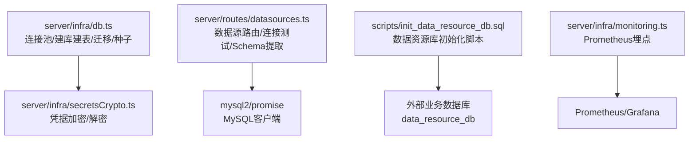
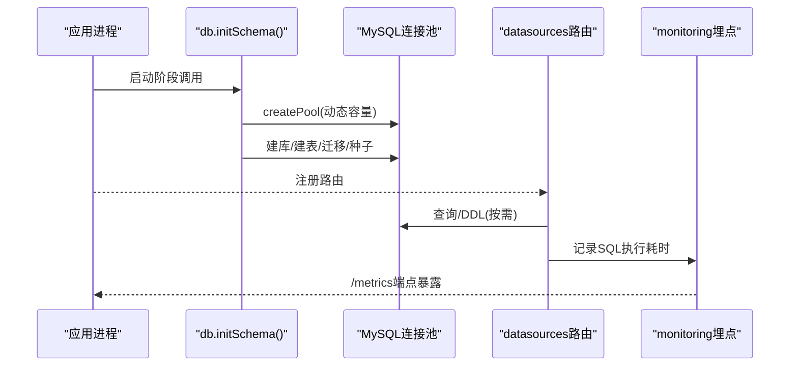
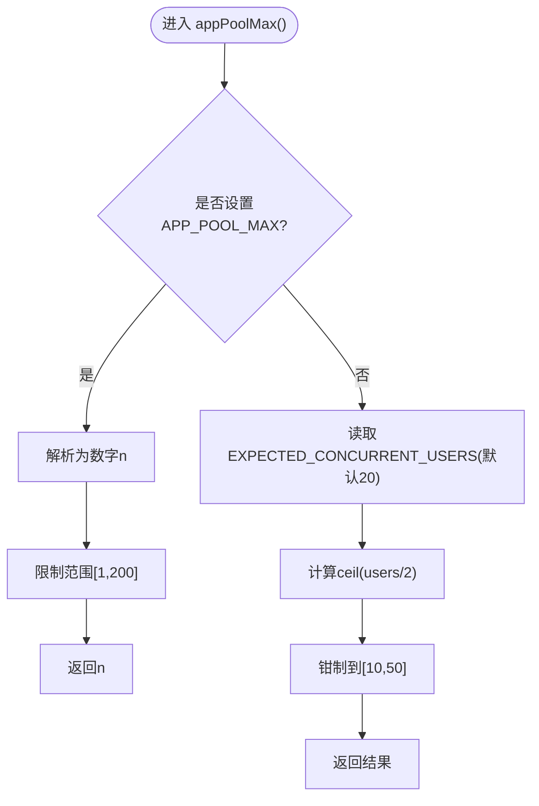
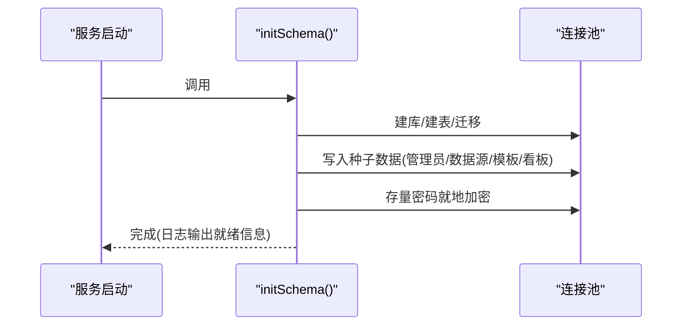
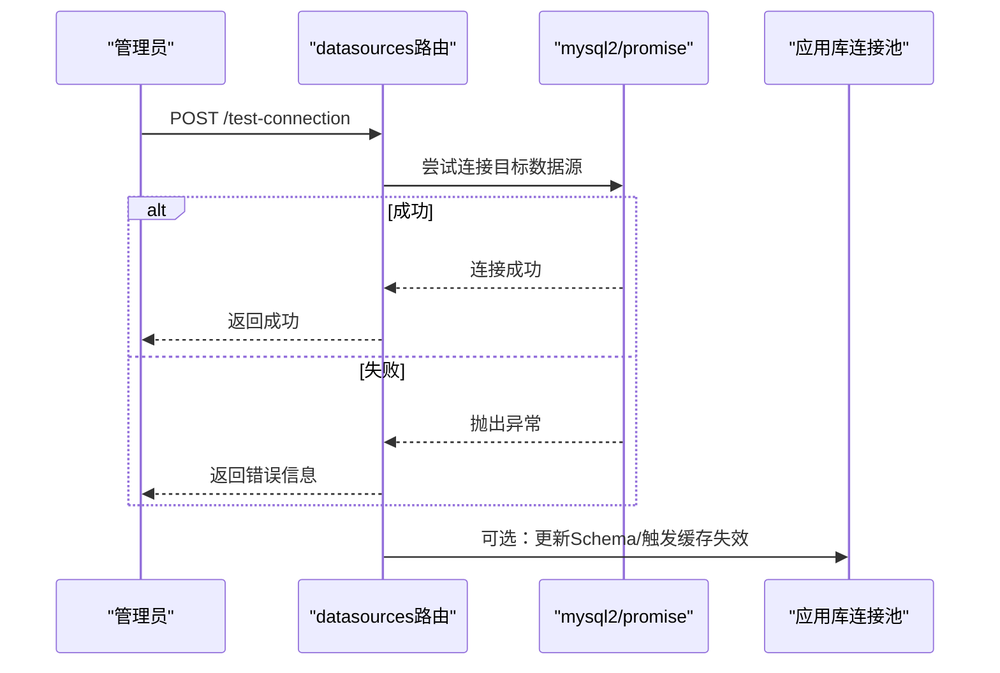
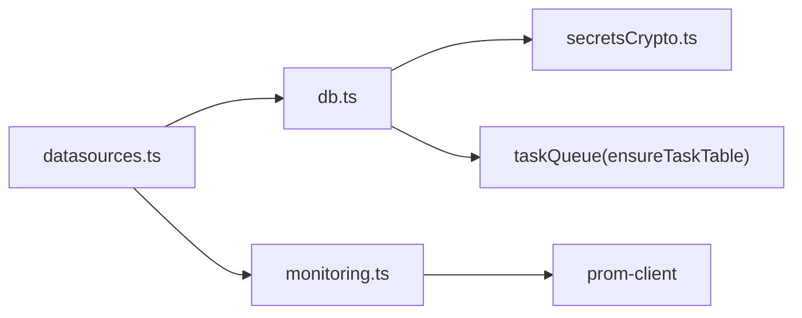

# 数据库连接管理

<cite>
**本文引用的文件**
- [server/infra/db.ts](file://server/infra/db.ts)
- [server/infra/secretsCrypto.ts](file://server/infra/secretsCrypto.ts)
- [server/routes/datasources.ts](file://server/routes/datasources.ts)
- [server/infra/monitoring.ts](file://server/infra/monitoring.ts)
- [scripts/init_data_resource_db.sql](file://scripts/init_data_resource_db.sql)
</cite>

## 目录
1. [简介](#简介)
2. [项目结构](#项目结构)
3. [核心组件](#核心组件)
4. [架构总览](#架构总览)
5. [详细组件分析](#详细组件分析)
6. [依赖关系分析](#依赖关系分析)
7. [性能考虑](#性能考虑)
8. [故障排查指南](#故障排查指南)
9. [结论](#结论)
10. [附录](#附录)

## 简介
本文件聚焦于应用内 MySQL 连接池与数据持久化的全生命周期管理，覆盖以下主题：
- 连接池配置与动态容量计算（基于并发用户数）
- 连接池生命周期管理（初始化、建库建表、迁移、种子数据）
- 敏感信息加密存储与环境变量配置管理
- 监控指标与可观测性
- 连接测试、健康检查与负载均衡最佳实践

## 项目结构
与数据库连接管理直接相关的代码集中在 server/infra 与 server/routes 下，并辅以脚本用于数据资源库初始化。

图表来源
- [server/infra/db.ts:1-817](file://server/infra/db.ts#L1-L817)
- [server/infra/secretsCrypto.ts:1-50](file://server/infra/secretsCrypto.ts#L1-L50)
- [server/routes/datasources.ts:1-200](file://server/routes/datasources.ts#L1-L200)
- [scripts/init_data_resource_db.sql:1-78](file://scripts/init_data_resource_db.sql#L1-L78)
- [server/infra/monitoring.ts:1-153](file://server/infra/monitoring.ts#L1-L153)

章节来源
- [server/infra/db.ts:1-817](file://server/infra/db.ts#L1-L817)
- [server/infra/secretsCrypto.ts:1-50](file://server/infra/secretsCrypto.ts#L1-L50)
- [server/routes/datasources.ts:1-200](file://server/routes/datasources.ts#L1-L200)
- [scripts/init_data_resource_db.sql:1-78](file://scripts/init_data_resource_db.sql#L1-L78)
- [server/infra/monitoring.ts:1-153](file://server/infra/monitoring.ts#L1-L153)

## 核心组件
- 应用库连接池与初始化：负责创建数据库、建表、增量迁移、种子数据注入，以及暴露连接池供其他模块使用。
- 凭据加密：对数据源密码等敏感信息进行 AES-256-GCM 加密落库，并提供明文读取兼容与就地迁移能力。
- 数据源路由：提供数据源的增删改查、连接测试、Schema 提取与同步，支持多类型数据源。
- 监控埋点：通过 Prometheus 暴露关键指标，便于观测 SQL 执行耗时、缓存命中、LLM 调用等。

章节来源
- [server/infra/db.ts:1-817](file://server/infra/db.ts#L1-L817)
- [server/infra/secretsCrypto.ts:1-50](file://server/infra/secretsCrypto.ts#L1-L50)
- [server/routes/datasources.ts:1-200](file://server/routes/datasources.ts#L1-L200)
- [server/infra/monitoring.ts:1-153](file://server/infra/monitoring.ts#L1-L153)

## 架构总览
应用启动时完成数据库初始化与连接池构建；业务请求通过路由层访问数据源，必要时进行连接测试与 Schema 同步；所有关键路径均埋入监控指标。

图表来源
- [server/infra/db.ts:52-70](file://server/infra/db.ts#L52-L70)
- [server/routes/datasources.ts:1-200](file://server/routes/datasources.ts#L1-L200)
- [server/infra/monitoring.ts:63-88](file://server/infra/monitoring.ts#L63-L88)

## 详细组件分析

### 连接池与动态容量
- 动态容量公式：
  - 优先读取 APP_POOL_MAX 显式配置；否则按 EXPECTED_CONCURRENT_USERS 推导为 ceil(并发用户/2)，并钳制在 [10, 50] 范围内，上限不超过 200（当显式配置时）。
- 连接池创建：
  - 先以无库连接确保数据库存在，再创建绑定到目标库的连接池，设置字符集与等待策略。
- 获取连接池：
  - 未初始化时抛出错误，强制要求先执行初始化流程。

图表来源
- [server/infra/db.ts:29-43](file://server/infra/db.ts#L29-L43)

章节来源
- [server/infra/db.ts:29-43](file://server/infra/db.ts#L29-L43)
- [server/infra/db.ts:45-70](file://server/infra/db.ts#L45-L70)

### 数据库初始化流程（建库建表与迁移）
- 建库：若不存在则创建 utf8mb4 数据库。
- 建表：幂等的 CREATE TABLE IF NOT EXISTS，覆盖用户、数据源、审计、反馈、知识库、技能、报告、看板、指标定义、专家角色、LLM用量、外部知识库、任务队列、漂移检测等。
- 增量迁移：通过 ALTER TABLE 安全加列或修改枚举，捕获重复字段错误以保障幂等。
- 种子数据：
  - 首次启动创建管理员账号并标记首登强制改密。
  - 若数据源表为空，写入演示数据源。
  - 内置技能、预设报告模板、默认看板图表等仅在空表时插入。
- 存量迁移：扫描 data_sources.config_json 中的明文密码，就地加密并回写。

图表来源
- [server/infra/db.ts:52-817](file://server/infra/db.ts#L52-L817)

章节来源
- [server/infra/db.ts:52-817](file://server/infra/db.ts#L52-L817)

### 敏感信息加密与环境变量
- 加密算法：AES-256-GCM，密文格式含 iv、authTag、cipher 的十六进制拼接，带 enc:v1: 前缀。
- 密钥来源：优先 DS_SECRET_KEY，其次 JWT_SECRET；缺失时使用开发弱口令（仅本地），生产环境应保证密钥存在。
- 幂等保护：已加密值原样返回；明文存量在启动时自动迁移加密。
- 环境变量：
  - 应用库连接：MYSQL_HOST、MYSQL_PORT、MYSQL_USER、MYSQL_PASSWORD、MYSQL_DATABASE。
  - 管理员账号：ADMIN_USERNAME、ADMIN_PASSWORD。
  - 连接池容量：APP_POOL_MAX、EXPECTED_CONCURRENT_USERS。
  - 监控鉴权：METRICS_TOKEN。
  - 凭据密钥：DS_SECRET_KEY、JWT_SECRET。

章节来源
- [server/infra/secretsCrypto.ts:1-50](file://server/infra/secretsCrypto.ts#L1-L50)
- [server/infra/db.ts:16-27](file://server/infra/db.ts#L16-L27)
- [server/infra/db.ts:755-813](file://server/infra/db.ts#L755-L813)

### 数据源管理与连接测试
- 路由职责：
  - 列出/新增/更新/删除数据源（列表接口不返回密码）。
  - 连接测试：针对 mysql/postgresql/greenplum 执行真实连接探测；其余类型返回模拟结果。
  - Schema 提取：从元数据表抽取表/列信息，推导指标/维度角色，落库 schema_json。
- 安全与权限：
  - 写入与连接测试需管理员权限。
  - 支持 scope/acl 控制数据源可见性与访问范围。
- 缓存失效：
  - 数据源变更后触发 Schema 缓存、执行器池、查询缓存失效，保证一致性。

图表来源
- [server/routes/datasources.ts:1-200](file://server/routes/datasources.ts#L1-L200)

章节来源
- [server/routes/datasources.ts:1-200](file://server/routes/datasources.ts#L1-L200)

### 监控指标与可观测性
- 指标类别：
  - 问数请求总量与耗时直方图（按状态/端点）。
  - 缓存命中计数（L1/L2）。
  - LLM 调用耗时与 token 消耗（按通道/引擎/模型）。
  - SQL 执行耗时直方图（成功/失败）。
  - HTTP 接口耗时（/api/*）。
- 暴露方式：
  - /metrics 端点，支持可选 METRICS_TOKEN 鉴权。
- 设计原则：
  - 低基数标签，避免高基数导致内存膨胀。
  - fail-open：埋点异常不影响主链路。

章节来源
- [server/infra/monitoring.ts:1-153](file://server/infra/monitoring.ts#L1-L153)

### 数据资源库初始化脚本
- 用途：部署时创建数据资源库及示例宽表、样本数据，便于演示与评测。
- 内容：
  - 创建数据库与表（业务主宽表、财务宽表）。
  - 插入示例行数据。
  - 可选创建只读用户并授权（生产建议通过环境变量注入密码）。

章节来源
- [scripts/init_data_resource_db.sql:1-78](file://scripts/init_data_resource_db.sql#L1-L78)

## 依赖关系分析
- 模块耦合：
  - db.ts 依赖 secretsCrypto.ts 进行凭据加密；依赖 logger 记录日志；依赖 taskQueue 确保任务表存在。
  - datasources.ts 依赖 mysql2/pg 客户端进行连接测试与 Schema 提取，依赖 db.ts 的应用库连接池进行元数据操作。
  - monitoring.ts 独立暴露指标，被各模块旁路调用。
- 外部依赖：
  - mysql2/promise、pg 作为数据库驱动。
  - prom-client 用于 Prometheus 指标采集与导出。

图表来源
- [server/infra/db.ts:1-12](file://server/infra/db.ts#L1-L12)
- [server/routes/datasources.ts:1-200](file://server/routes/datasources.ts#L1-L200)
- [server/infra/monitoring.ts:1-18](file://server/infra/monitoring.ts#L1-L18)

章节来源
- [server/infra/db.ts:1-12](file://server/infra/db.ts#L1-L12)
- [server/routes/datasources.ts:1-200](file://server/routes/datasources.ts#L1-L200)
- [server/infra/monitoring.ts:1-18](file://server/infra/monitoring.ts#L1-L18)

## 性能考虑
- 连接池容量调优：
  - 推荐通过 EXPECTED_CONCURRENT_USERS 估算并发，或使用 APP_POOL_MAX 显式设定；保持下限不低于 10，上限不超过 50（默认推导）或 200（显式配置）。
  - 在高并发场景下，结合压测观察连接等待与超时情况，逐步调整。
- SQL 执行优化：
  - 利用 EXPLAIN 防线统计与 sql_execute_duration_seconds 直方图识别慢查询。
  - 合理索引与查询改写，减少扫描行数。
- 缓存命中率：
  - 关注 nl2sql_cache_hits_total，提升 L1/L2 命中以降低数据库压力。
- 监控与告警：
  - 基于 /metrics 暴露的指标建立 Grafana 面板与告警规则，关注 SQL 执行耗时、错误率、连接池耗尽等。

[本节为通用指导，不直接分析具体文件]

## 故障排查指南
- 连接池未初始化：
  - 现象：调用 getPool() 抛错提示未初始化。
  - 处理：确保在应用启动时调用 initSchema() 完成连接池构建。
- 默认管理员密码风险：
  - 现象：启动日志警告管理员仍使用默认密码且未登录。
  - 处理：首次登录后系统会强制修改密码；生产环境务必修改默认凭证。
- 数据源密码未加密：
  - 现象：旧版明文密码在启动时被就地加密。
  - 处理：确认 DS_SECRET_KEY/JWT_SECRET 已正确配置；如迁移失败，检查 config_json 格式与密钥一致性。
- 连接测试失败：
  - 现象：路由返回连接错误。
  - 处理：核对 host/port/user/password/database 等参数；检查网络连通性与防火墙策略；查看日志中异常消息定位原因。
- 监控不可用：
  - 现象：/metrics 返回 403 或 500。
  - 处理：检查 METRICS_TOKEN 是否正确；确认 prom-client 正常收集指标；查看内部 try/catch 后的错误日志。

章节来源
- [server/infra/db.ts:45-49](file://server/infra/db.ts#L45-L49)
- [server/infra/db.ts:755-778](file://server/infra/db.ts#L755-L778)
- [server/infra/db.ts:800-813](file://server/infra/db.ts#L800-L813)
- [server/routes/datasources.ts:1-200](file://server/routes/datasources.ts#L1-L200)
- [server/infra/monitoring.ts:135-153](file://server/infra/monitoring.ts#L135-L153)

## 结论
本方案通过动态容量计算与幂等初始化流程，实现了稳健的 MySQL 连接池与数据持久化管理；配合凭据加密、监控埋点与数据源路由，覆盖了从连接、迁移、测试到可观测性的完整闭环。建议在上线前完成容量规划、密钥配置与监控告警基线建设，并在变更数据源或表结构时遵循幂等迁移与缓存失效策略。

[本节为总结，不直接分析具体文件]

## 附录
- 环境变量清单（节选）：
  - MYSQL_HOST、MYSQL_PORT、MYSQL_USER、MYSQL_PASSWORD、MYSQL_DATABASE
  - ADMIN_USERNAME、ADMIN_PASSWORD
  - APP_POOL_MAX、EXPECTED_CONCURRENT_USERS
  - DS_SECRET_KEY、JWT_SECRET
  - METRICS_TOKEN
- 关键指标（节选）：
  - nl2sql_requests_total、nl2sql_duration_seconds
  - nl2sql_cache_hits_total
  - llm_call_duration_seconds、llm_tokens_total
  - sql_execute_duration_seconds、sql_explain_guard_total
  - http_request_duration_seconds

[本节为补充信息，不直接分析具体文件]