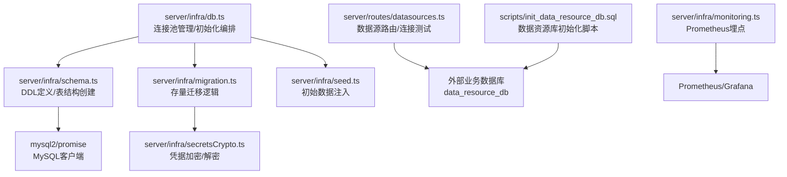
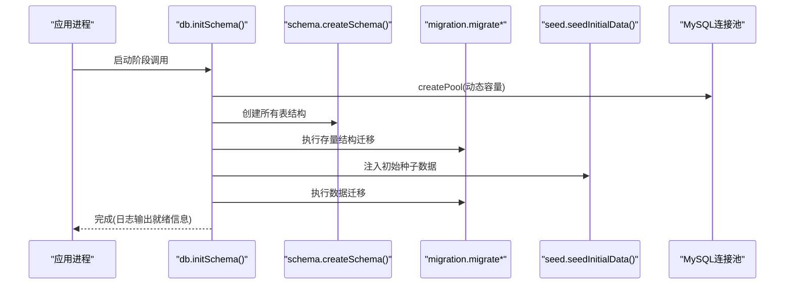
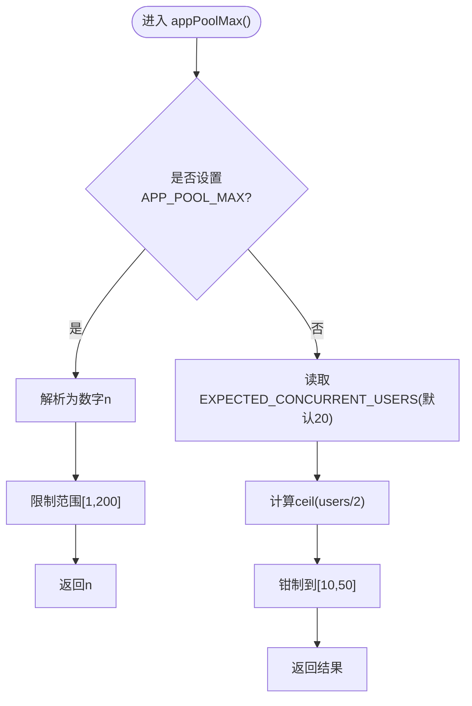
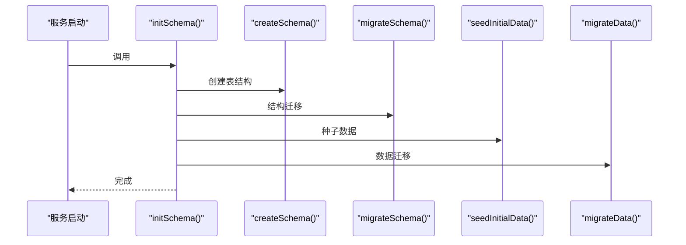
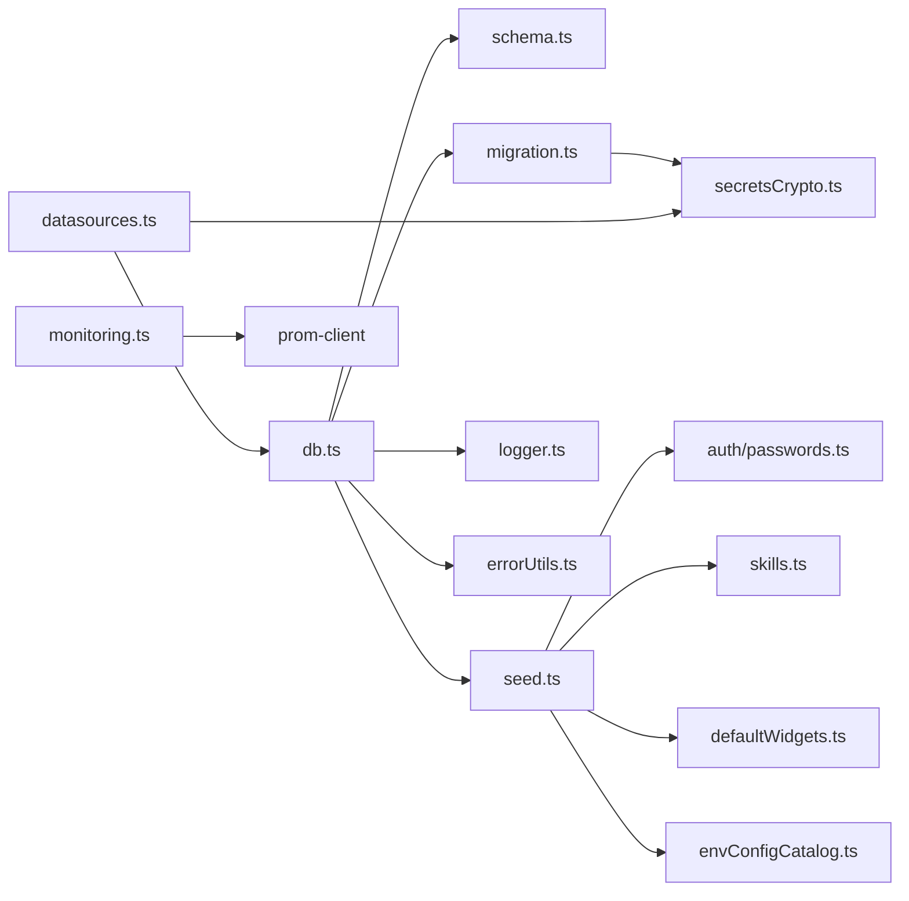

# 数据库连接管理

<cite>
**本文引用的文件**
- [server/infra/db.ts](file://server/infra/db.ts)
- [server/infra/schema.ts](file://server/infra/schema.ts)
- [server/infra/migration.ts](file://server/infra/migration.ts)
- [server/infra/seed.ts](file://server/infra/seed.ts)
- [server/infra/secretsCrypto.ts](file://server/infra/secretsCrypto.ts)
- [server/routes/datasources.ts](file://server/routes/datasources.ts)
- [server/infra/monitoring.ts](file://server/infra/monitoring.ts)
- [scripts/init_data_resource_db.sql](file://scripts/init_data_resource_db.sql)
</cite>

## 更新摘要
**变更内容**
- 数据库架构重构：将原926行单体文件拆分为四个独立模块
- 新增 schema.ts：专门负责DDL定义和表结构创建
- 新增 migration.ts：专注于存量数据迁移逻辑
- 新增 seed.ts：处理初始种子数据注入
- 优化 db.ts：仅保留连接池管理和初始化编排逻辑
- 提升代码可维护性和单一职责原则

## 目录
1. [简介](#简介)
2. [项目结构](#项目结构)
3. [核心组件](#核心组件)
4. [架构总览](#架构总览)
5. [详细组件分析](#详细组件分析)
6. [依赖关系分析](#依赖关系分析)
7. [性能考虑](#性能考虑)
8. [故障排查指南](#故障排查指南)
9. [结论](#结论)
10. [附录](#附录)

## 简介
本文件聚焦于应用内 MySQL 连接池与数据持久化的全生命周期管理，覆盖以下主题：
- 连接池配置与动态容量计算（基于并发用户数）
- 连接池生命周期管理（初始化、建库建表、迁移、种子数据）
- 敏感信息加密存储与环境变量配置管理
- 监控指标与可观测性
- 连接测试、健康检查与负载均衡最佳实践

**更新** 经过架构重构后，系统采用模块化设计，每个组件职责明确，便于维护和扩展。

## 项目结构
与数据库连接管理直接相关的代码集中在 server/infra 与 server/routes 下，并辅以脚本用于数据资源库初始化。重构后的模块化结构如下：

```mermaid
graph TB
A["server/infra/db.ts<br/>连接池管理/初始化编排"] --> B["server/infra/schema.ts<br/>DDL定义/表结构创建"]
A --> C["server/infra/migration.ts<br/>存量迁移逻辑"]
A --> D["server/infra/seed.ts<br/>初始数据注入"]
B --> E["mysql2/promise<br/>MySQL客户端"]
C --> F["server/infra/secretsCrypto.ts<br/>凭据加密/解密"]
G["server/routes/datasources.ts<br/>数据源路由/连接测试"] --> H["外部业务数据库<br/>data_resource_db"]
I["scripts/init_data_resource_db.sql<br/>数据资源库初始化脚本"] --> H
J["server/infra/monitoring.ts<br/>Prometheus埋点"] --> K["Prometheus/Grafana"]
```

**图表来源**
- [server/infra/db.ts:1-103](file://server/infra/db.ts#L1-L103)
- [server/infra/schema.ts:1-579](file://server/infra/schema.ts#L1-L579)
- [server/infra/migration.ts:1-182](file://server/infra/migration.ts#L1-L182)
- [server/infra/seed.ts:1-165](file://server/infra/seed.ts#L1-L165)

**章节来源**
- [server/infra/db.ts:1-103](file://server/infra/db.ts#L1-L103)
- [server/infra/schema.ts:1-579](file://server/infra/schema.ts#L1-L579)
- [server/infra/migration.ts:1-182](file://server/infra/migration.ts#L1-L182)
- [server/infra/seed.ts:1-165](file://server/infra/seed.ts#L1-L165)

## 核心组件
- **连接池管理**：db.ts 负责创建数据库、构建连接池，并协调各模块的初始化流程
- **结构定义**：schema.ts 包含所有表的 CREATE TABLE 语句和幂等结构变更
- **迁移逻辑**：migration.ts 处理存量库的结构和数据迁移，确保向后兼容
- **种子数据**：seed.ts 注入默认管理员、内置技能、预设模板等初始数据
- **凭据加密**：secretsCrypto.ts 提供 AES-256-GCM 加密算法保护敏感信息
- **数据源路由**：datasources.ts 提供数据源的增删改查、连接测试和 Schema 提取
- **监控埋点**：monitoring.ts 通过 Prometheus 暴露关键指标

**章节来源**
- [server/infra/db.ts:1-103](file://server/infra/db.ts#L1-L103)
- [server/infra/schema.ts:1-579](file://server/infra/schema.ts#L1-L579)
- [server/infra/migration.ts:1-182](file://server/infra/migration.ts#L1-L182)
- [server/infra/seed.ts:1-165](file://server/infra/seed.ts#L1-L165)

## 架构总览
应用启动时按顺序执行：连接池构建 → 结构定义 → 存量迁移 → 种子数据 → 数据迁移；业务请求通过路由层访问数据源，必要时进行连接测试与 Schema 同步；所有关键路径均埋入监控指标。

```mermaid
sequenceDiagram
participant App as "应用进程"
participant DB as "db.initSchema()"
participant Schema as "schema.createSchema()"
participant Migration as "migration.migrate*"
participant Seed as "seed.seedInitialData()"
participant Pool as "MySQL连接池"
App->>DB : 启动阶段调用
DB->>Pool : createPool(动态容量)
DB->>Schema : 创建所有表结构
DB->>Migration : 执行存量结构迁移
DB->>Seed : 注入初始种子数据
DB->>Migration : 执行数据迁移
DB-->>App : 完成(日志输出就绪信息)
```

**图表来源**
- [server/infra/db.ts:68-102](file://server/infra/db.ts#L68-L102)
- [server/infra/schema.ts:10-578](file://server/infra/schema.ts#L10-L578)
- [server/infra/migration.ts:15-181](file://server/infra/migration.ts#L15-L181)
- [server/infra/seed.ts:19-164](file://server/infra/seed.ts#L19-L164)

## 详细组件分析

### 连接池与动态容量
- **动态容量公式**：
  - 优先读取 APP_POOL_MAX 显式配置；否则按 EXPECTED_CONCURRENT_USERS 推导为 ceil(并发用户/2)，并钳制在 [10, 50] 范围内，上限不超过 200（当显式配置时）。
- **连接池创建**：
  - 先以无库连接确保数据库存在，再创建绑定到目标库的连接池，设置字符集与等待策略。
- **获取连接池**：
  - 未初始化时抛出错误，强制要求先执行初始化流程。

```mermaid
flowchart TD
Start(["进入 appPoolMax()"]) --> CheckEnv{"是否设置APP_POOL_MAX?"}
CheckEnv --> |是| ParseN["解析为数字n"]
ParseN --> Clamp1["限制范围[1,200]"]
Clamp1 --> Return1["返回n"]
CheckEnv --> |否| ReadUsers["读取EXPECTED_CONCURRENT_USERS(默认20)"]
ReadUsers --> Calc["计算ceil(users/2)"]
Calc --> Clamp2["钳制到[10,50]"]
Clamp2 --> Return2["返回结果"]
```

**图表来源**
- [server/infra/db.ts:32-40](file://server/infra/db.ts#L32-L40)

**章节来源**
- [server/infra/db.ts:32-40](file://server/infra/db.ts#L32-L40)
- [server/infra/db.ts:79-87](file://server/infra/db.ts#L79-L87)

### 模块化初始化流程
重构后的初始化流程更加清晰，每个模块职责明确：

1. **连接池构建**：db.ts 创建数据库和连接池
2. **结构定义**：schema.ts 创建所有表结构
3. **存量迁移**：migration.ts 执行结构迁移
4. **种子数据**：seed.ts 注入初始数据
5. **数据迁移**：migration.ts 执行数据迁移

```mermaid
sequenceDiagram
participant S as "服务启动"
participant I as "initSchema()"
participant SC as "createSchema()"
participant MS as "migrateSchema()"
participant SD as "seedInitialData()"
participant MD as "migrateData()"
S->>I : 调用
I->>SC : 创建表结构
I->>MS : 结构迁移
I->>SD : 种子数据
I->>MD : 数据迁移
I-->>S : 完成
```

**图表来源**
- [server/infra/db.ts:68-102](file://server/infra/db.ts#L68-L102)

**章节来源**
- [server/infra/db.ts:68-102](file://server/infra/db.ts#L68-L102)

### 表结构定义与管理
schema.ts 集中管理所有数据库表结构，包括：

- **用户管理**：users、org_units（组织架构树）
- **数据源管理**：data_sources、permission_requests、download_requests
- **审计追踪**：query_audit_log、query_trace
- **知识库**：knowledge_base、knowledge_base_entries
- **技能库**：skill_library、sql_examples
- **报告系统**：report_templates、query_reports、saved_reports
- **看板系统**：dashboard_widgets、flex_queries
- **指标管理**：metric_definitions、metric_versions
- **专家角色**：expert_personas、llm_usage
- **外部集成**：external_kb_sources
- **任务队列**：task_queue（通过 ensureTaskTable）
- **对抗训练**：adversarial_samples、fallback_audit_log、few_shot_examples
- **漂移检测**：kb_drift_watch、kb_drift_events
- **环境配置**：env_config

**章节来源**
- [server/infra/schema.ts:10-578](file://server/infra/schema.ts#L10-L578)

### 存量迁移机制
migration.ts 提供幂等的存量迁移能力：

- **结构迁移**：ADD COLUMN、MODIFY COLUMN 等操作，捕获重复字段错误保证幂等
- **数据迁移**：历史点赞样例回填、明文凭据就地加密
- **版本兼容**：支持不同版本的数据库结构升级

主要迁移操作包括：
- users 表添加 must_change_password、department、org_unit_id 字段
- data_sources 表添加 scope_json、allow_introspection、acl_json 字段
- query_audit_log 表添加 executed_sql、row_count、fallback 相关字段
- metric_definitions 表状态机扩展和版本控制
- expert_personas 表 role_prompt 扩容和内容版本控制
- llm_usage 表增加用户维度统计

**章节来源**
- [server/infra/migration.ts:15-151](file://server/infra/migration.ts#L15-L151)
- [server/infra/migration.ts:154-181](file://server/infra/migration.ts#L154-L181)

### 初始种子数据
seed.ts 负责注入系统运行所需的初始数据：

- **内置技能**：从 BUILTIN_SKILLS 注入系统级技能
- **出厂看板**：DEFAULT_DASHBOARD_WIDGET_SEEDS 预置看板组件
- **预设模板**：四种报告模板（综合经营分析、资产质量监控、投资收益分析、企业战略简报）
- **管理员账号**：默认管理员并标记首登强制改密
- **示例数据源**：INITIAL_DATA_SOURCES 演示用数据源
- **环境配置**：ENV_CONFIG_SEED 标准键位
- **组织架构**：总部根节点

**章节来源**
- [server/infra/seed.ts:19-164](file://server/infra/seed.ts#L19-L164)

### 敏感信息加密与环境变量
- **加密算法**：AES-256-GCM，密文格式含 iv、authTag、cipher 的十六进制拼接，带 enc:v1: 前缀
- **密钥来源**：优先 DS_SECRET_KEY，其次 JWT_SECRET；缺失时使用开发弱口令（仅本地），生产环境应保证密钥存在
- **幂等保护**：已加密值原样返回；明文存量在启动时自动迁移加密
- **环境变量**：
  - 应用库连接：MYSQL_HOST、MYSQL_PORT、MYSQL_USER、MYSQL_PASSWORD、MYSQL_DATABASE
  - 管理员账号：ADMIN_USERNAME、ADMIN_PASSWORD
  - 连接池容量：APP_POOL_MAX、EXPECTED_CONCURRENT_USERS
  - 监控鉴权：METRICS_TOKEN
  - 凭据密钥：DS_SECRET_KEY、JWT_SECRET

**章节来源**
- [server/infra/secretsCrypto.ts:1-51](file://server/infra/secretsCrypto.ts#L1-L51)
- [server/infra/db.ts:16-24](file://server/infra/db.ts#L16-L24)

### 数据源管理与连接测试
- **路由职责**：
  - 列出/新增/更新/删除数据源（列表接口不返回密码）
  - 连接测试：针对 mysql/postgresql/greenplum 执行真实连接探测；其余类型返回模拟结果
  - Schema 提取：从元数据表抽取表/列信息，推导指标/维度角色，落库 schema_json
- **安全与权限**：
  - 写入与连接测试需管理员权限
  - 支持 scope/acl 控制数据源可见性与访问范围
- **缓存失效**：
  - 数据源变更后触发 Schema 缓存、执行器池、查询缓存失效，保证一致性

**章节来源**
- [server/routes/datasources.ts:1-200](file://server/routes/datasources.ts#L1-L200)

### 监控指标与可观测性
- **指标类别**：
  - 问数请求总量与耗时直方图（按状态/端点）
  - 缓存命中计数（L1/L2）
  - LLM 调用耗时与 token 消耗（按通道/引擎/模型）
  - SQL 执行耗时直方图（成功/失败）
  - HTTP 接口耗时（/api/*）
- **暴露方式**：
  - /metrics 端点，支持可选 METRICS_TOKEN 鉴权
- **设计原则**：
  - 低基数标签，避免高基数导致内存膨胀
  - fail-open：埋点异常不影响主链路

**章节来源**
- [server/infra/monitoring.ts:1-162](file://server/infra/monitoring.ts#L1-L162)

### 数据资源库初始化脚本
- **用途**：部署时创建数据资源库及示例宽表、样本数据，便于演示与评测
- **内容**：
  - 创建数据库与表（业务主宽表、财务宽表）
  - 插入示例行数据
  - 可选创建只读用户并授权（生产建议通过环境变量注入密码）

**章节来源**
- [scripts/init_data_resource_db.sql:1-78](file://scripts/init_data_resource_db.sql#L1-L78)

## 依赖关系分析
重构后的模块间依赖关系更加清晰：

```mermaid
graph LR
DB["db.ts"] --> SCHEMA["schema.ts"]
DB --> MIGRATION["migration.ts"]
DB --> SEED["seed.ts"]
MIGRATION --> SECRETS["secretsCrypto.ts"]
DB --> LOGGER["logger.ts"]
DB --> ERROR_UTILS["errorUtils.ts"]
SEED --> AUTH["auth/passwords.ts"]
SEED --> SKILLS["skills.ts"]
SEED --> DEFAULT_WIDGETS["defaultWidgets.ts"]
SEED --> ENV_CONFIG["envConfigCatalog.ts"]
DS["datasources.ts"] --> DB
DS --> SECRETS
MON["monitoring.ts"] --> PROM["prom-client"]
```

**图表来源**
- [server/infra/db.ts:7-12](file://server/infra/db.ts#L7-L12)
- [server/infra/migration.ts:9-12](file://server/infra/migration.ts#L9-L12)
- [server/infra/seed.ts:7-12](file://server/infra/seed.ts#L7-L12)

**章节来源**
- [server/infra/db.ts:7-12](file://server/infra/db.ts#L7-L12)
- [server/infra/migration.ts:9-12](file://server/infra/migration.ts#L9-L12)
- [server/infra/seed.ts:7-12](file://server/infra/seed.ts#L7-L12)

## 性能考虑
- **连接池容量调优**：
  - 推荐通过 EXPECTED_CONCURRENT_USERS 估算并发，或使用 APP_POOL_MAX 显式设定；保持下限不低于 10，上限不超过 50（默认推导）或 200（显式配置）
  - 在高并发场景下，结合压测观察连接等待与超时情况，逐步调整
- **SQL 执行优化**：
  - 利用 EXPLAIN 防线统计与 sql_execute_duration_seconds 直方图识别慢查询
  - 合理索引与查询改写，减少扫描行数
- **缓存命中率**：
  - 关注 nl2sql_cache_hits_total，提升 L1/L2 命中以降低数据库压力
- **监控与告警**：
  - 基于 /metrics 暴露的指标建立 Grafana 面板与告警规则，关注 SQL 执行耗时、错误率、连接池耗尽等

## 故障排查指南
- **连接池未初始化**：
  - 现象：调用 getPool() 抛错提示未初始化
  - 处理：确保在应用启动时调用 initSchema() 完成连接池构建
- **默认管理员密码风险**：
  - 现象：启动日志警告管理员仍使用默认密码且未登录
  - 处理：首次登录后系统会强制修改密码；生产环境务必修改默认凭证
- **数据源密码未加密**：
  - 现象：旧版明文密码在启动时被就地加密
  - 处理：确认 DS_SECRET_KEY/JWT_SECRET 已正确配置；如迁移失败，检查 config_json 格式与密钥一致性
- **连接测试失败**：
  - 现象：路由返回连接错误
  - 处理：核对 host/port/user/password/database 等参数；检查网络连通性与防火墙策略；查看日志中异常消息定位原因
- **监控不可用**：
  - 现象：/metrics 返回 403 或 500
  - 处理：检查 METRICS_TOKEN 是否正确；确认 prom-client 正常收集指标；查看内部 try/catch 后的错误日志
- **模块化初始化问题**：
  - 现象：某个模块初始化失败导致整个启动过程中断
  - 处理：检查各模块间的依赖关系和执行顺序；查看具体模块的错误日志

**章节来源**
- [server/infra/db.ts:45-49](file://server/infra/db.ts#L45-L49)
- [server/infra/seed.ts:110-123](file://server/infra/seed.ts#L110-L123)
- [server/infra/migration.ts:166-181](file://server/infra/migration.ts#L166-L181)
- [server/routes/datasources.ts:1-200](file://server/routes/datasources.ts#L1-L200)
- [server/infra/monitoring.ts:146-162](file://server/infra/monitoring.ts#L146-L162)

## 结论
经过架构重构后，系统采用了更加清晰的模块化设计，将原来926行的单体文件拆分为四个职责明确的独立模块：

- **db.ts**：专注连接池管理和初始化编排
- **schema.ts**：集中管理所有表结构定义
- **migration.ts**：处理存量数据迁移逻辑
- **seed.ts**：负责初始种子数据注入

这种设计显著提升了代码的可维护性和可扩展性，每个模块都遵循单一职责原则，便于独立测试和维护。配合凭据加密、监控埋点与数据源路由，覆盖了从连接、迁移、测试到可观测性的完整闭环。建议在上线前完成容量规划、密钥配置与监控告警基线建设，并在变更数据源或表结构时遵循幂等迁移与缓存失效策略。

## 附录
- **环境变量清单（节选）**：
  - MYSQL_HOST、MYSQL_PORT、MYSQL_USER、MYSQL_PASSWORD、MYSQL_DATABASE
  - ADMIN_USERNAME、ADMIN_PASSWORD
  - APP_POOL_MAX、EXPECTED_CONCURRENT_USERS
  - DS_SECRET_KEY、JWT_SECRET
  - METRICS_TOKEN
- **关键指标（节选）**：
  - nl2sql_requests_total、nl2sql_duration_seconds
  - nl2sql_cache_hits_total
  - llm_call_duration_seconds、llm_tokens_total
  - sql_execute_duration_seconds、sql_explain_guard_total
  - http_request_duration_seconds
- **重构优势**：
  - 代码组织更清晰，便于理解和维护
  - 单一职责原则，每个模块功能明确
  - 更好的测试覆盖，可以独立测试各模块
  - 更容易进行功能扩展和修改