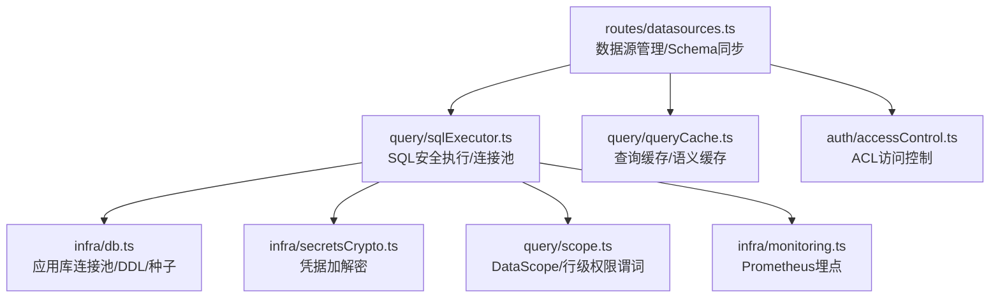
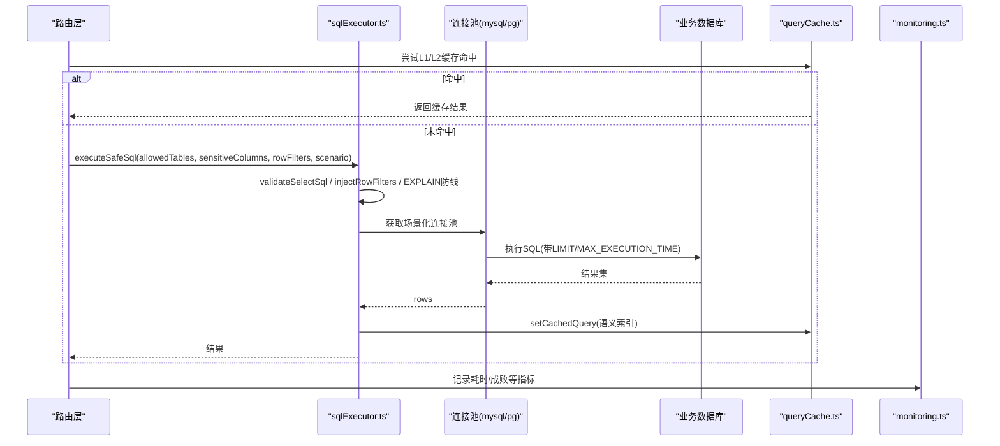
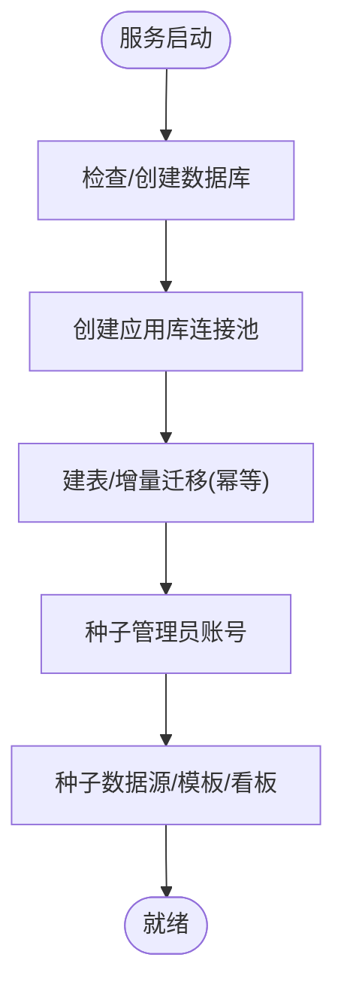
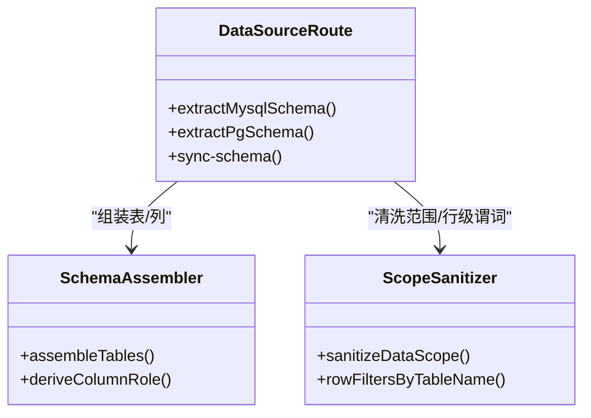
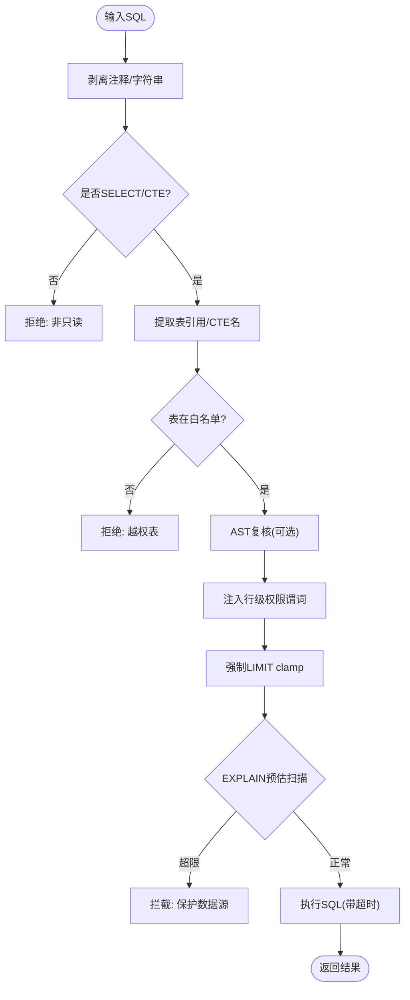
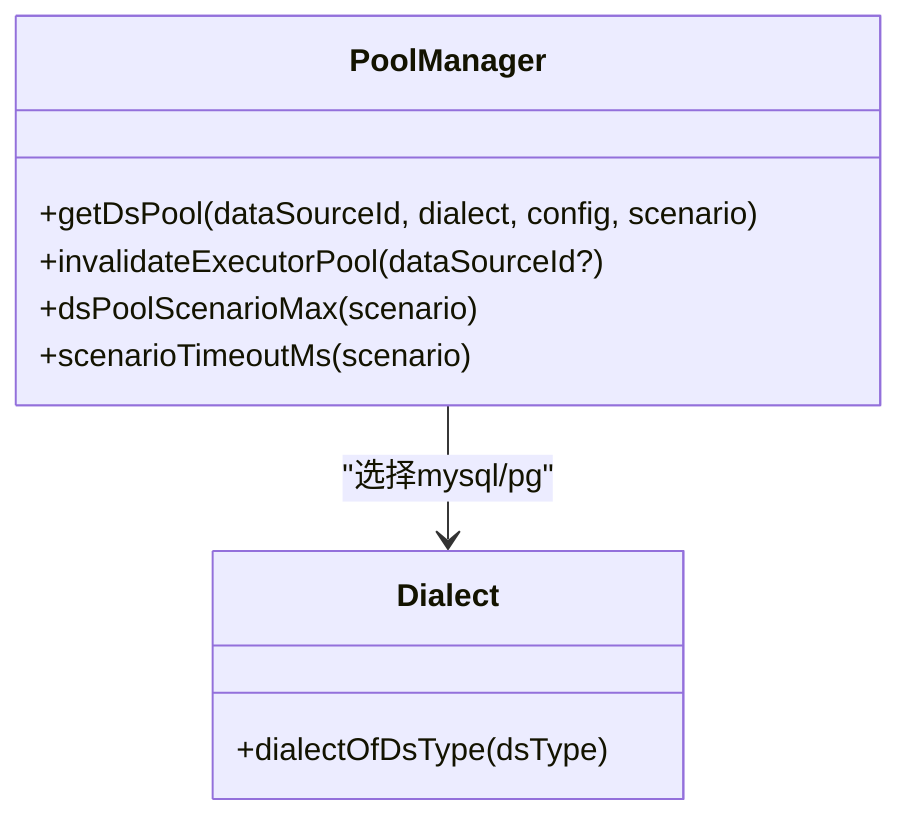
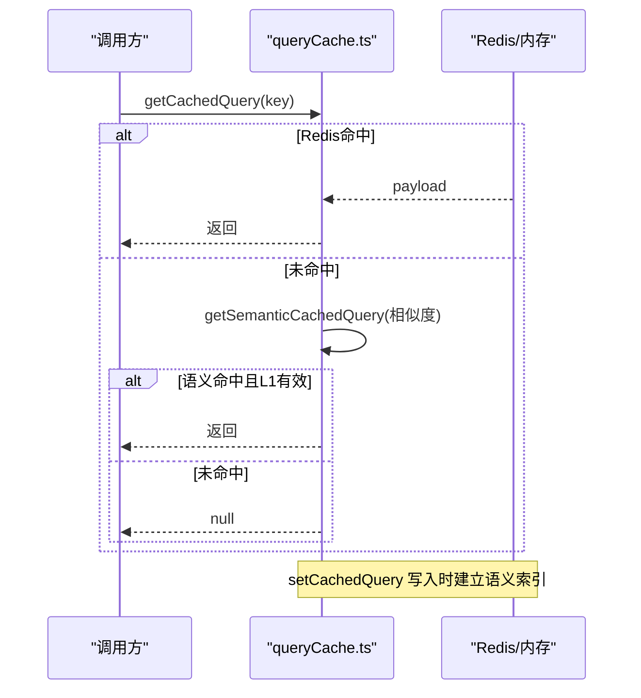
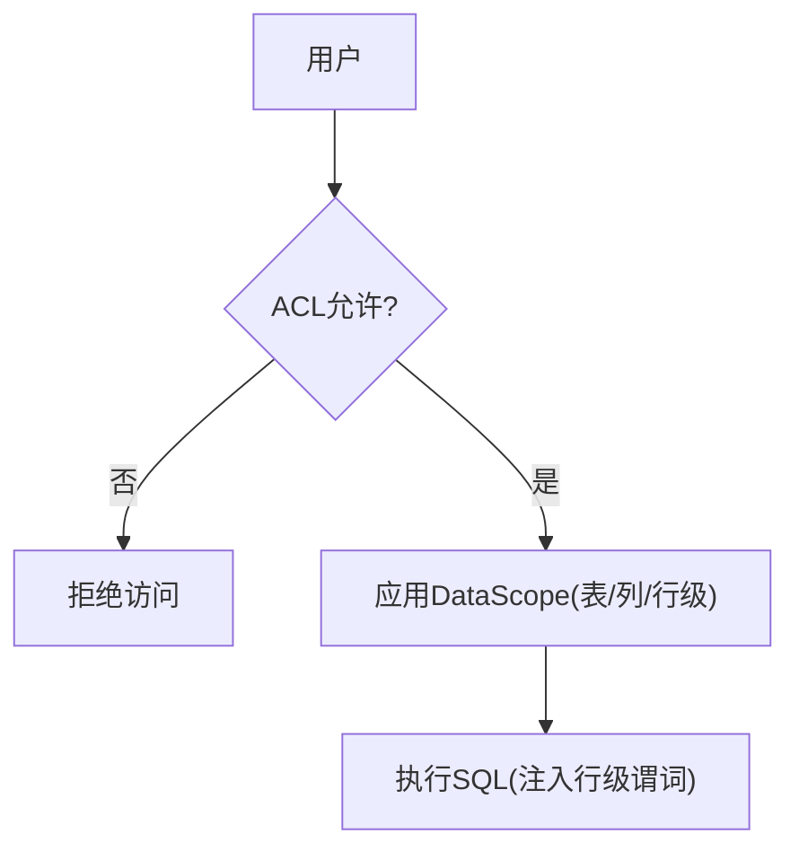
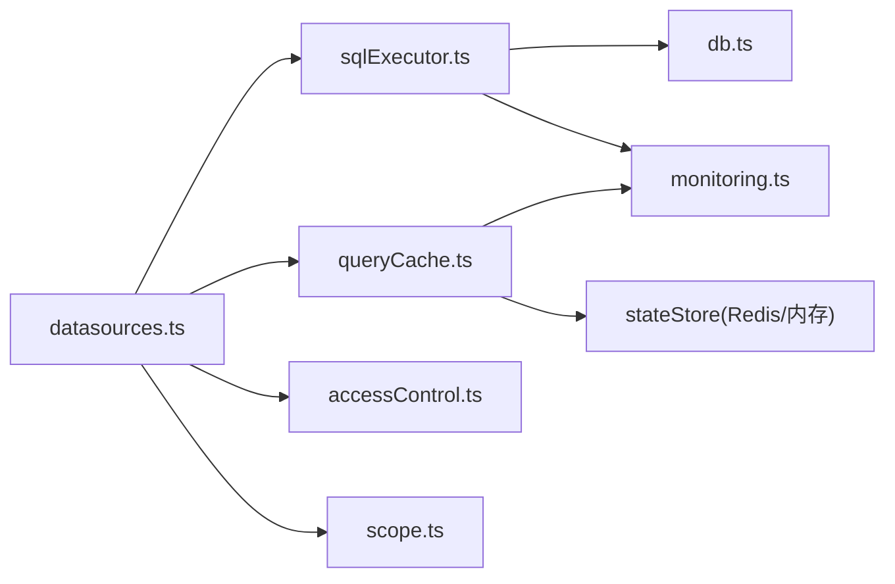

# 数据访问层

<cite>
**本文引用的文件**
- [server/infra/db.ts](file://server/infra/db.ts)
- [server/query/sqlExecutor.ts](file://server/query/sqlExecutor.ts)
- [server/query/sqlExecutorPool.test.ts](file://server/query/sqlExecutorPool.test.ts)
- [server/routes/datasources.ts](file://server/routes/datasources.ts)
- [server/query/queryCache.ts](file://server/query/queryCache.ts)
- [server/infra/secretsCrypto.ts](file://server/infra/secretsCrypto.ts)
- [server/query/scope.ts](file://server/query/scope.ts)
- [server/auth/accessControl.ts](file://server/auth/accessControl.ts)
- [server/infra/monitoring.ts](file://server/infra/monitoring.ts)
</cite>

## 目录
1. [简介](#简介)
2. [项目结构](#项目结构)
3. [核心组件](#核心组件)
4. [架构总览](#架构总览)
5. [详细组件分析](#详细组件分析)
6. [依赖关系分析](#依赖关系分析)
7. [性能考量](#性能考量)
8. [故障诊断指南](#故障诊断指南)
9. [结论](#结论)
10. [附录：配置与最佳实践](#附录：配置与最佳实践)

## 简介
本文件聚焦“智能问数据分析系统”的数据访问层，系统性说明数据库连接池管理、多数据源支持、事务处理机制（含行级权限注入）、SQL 执行引擎与安全校验、查询优化策略（EXPLAIN 防线与 LIMIT/MAX_EXECUTION_TIME）、缓存机制（内存与 Redis 双实现及语义缓存）、Schema 元数据管理、数据权限控制（ACL + DataScope）、敏感信息过滤、数据迁移策略、备份恢复方案、性能监控指标，并提供连接配置、查询调优与故障诊断的最佳实践。

## 项目结构
数据访问相关代码主要分布在以下模块：
- 应用库持久化与连接池：server/infra/db.ts
- SQL 安全执行与多数据源连接池：server/query/sqlExecutor.ts
- 数据源管理与 Schema 同步：server/routes/datasources.ts
- 查询结果缓存（内存/Redis）与语义缓存：server/query/queryCache.ts
- 凭据加密：server/infra/secretsCrypto.ts
- 数据范围与行级权限：server/query/scope.ts
- 数据源访问控制（ACL）：server/auth/accessControl.ts
- 监控埋点：server/infra/monitoring.ts

图表来源
- [server/routes/datasources.ts:1-120](file://server/routes/datasources.ts#L1-L120)
- [server/query/sqlExecutor.ts:1-120](file://server/query/sqlExecutor.ts#L1-L120)
- [server/infra/db.ts:1-80](file://server/infra/db.ts#L1-L80)
- [server/query/queryCache.ts:1-60](file://server/query/queryCache.ts#L1-L60)
- [server/infra/secretsCrypto.ts:1-50](file://server/infra/secretsCrypto.ts#L1-L50)
- [server/query/scope.ts:1-40](file://server/query/scope.ts#L1-L40)
- [server/auth/accessControl.ts:1-40](file://server/auth/accessControl.ts#L1-L40)
- [server/infra/monitoring.ts:1-80](file://server/infra/monitoring.ts#L1-L80)

章节来源
- [server/infra/db.ts:1-80](file://server/infra/db.ts#L1-L80)
- [server/query/sqlExecutor.ts:1-120](file://server/query/sqlExecutor.ts#L1-L120)
- [server/routes/datasources.ts:1-120](file://server/routes/datasources.ts#L1-L120)
- [server/query/queryCache.ts:1-60](file://server/query/queryCache.ts#L1-L60)

## 核心组件
- 应用库连接池与初始化：负责创建 MySQL 连接池、建库建表、初始种子数据与增量迁移。
- SQL 安全执行引擎：对 LLM 生成的 SQL 进行白名单校验、AST 复核、敏感列拒绝、强制 LIMIT、EXPLAIN 防线、行级权限注入、超时保护。
- 多数据源连接池：按数据源+场景分级缓存连接池，支持 MySQL 与 PostgreSQL/Greenplum。
- 查询缓存：L1 精确匹配（内存或 Redis），L2 语义相似度命中；TTL 可配；结构变更时失效。
- Schema 元数据管理：自动提取 MySQL/PG/Greenplum 的表/列结构，角色推导，管理员维护业务口径。
- 数据权限控制：ACL（部门/用户）与 DataScope（表/列/行级谓词）正交组合。
- 凭据加密：AES-256-GCM 落库，启动时就地加密存量。
- 监控埋点：Prometheus 指标覆盖请求耗时、缓存命中、LLM 用量、SQL 执行耗时、EXPLAIN 防线。

章节来源
- [server/infra/db.ts:30-80](file://server/infra/db.ts#L30-L80)
- [server/query/sqlExecutor.ts:24-120](file://server/query/sqlExecutor.ts#L24-L120)
- [server/query/queryCache.ts:1-60](file://server/query/queryCache.ts#L1-L60)
- [server/routes/datasources.ts:224-347](file://server/routes/datasources.ts#L224-L347)
- [server/auth/accessControl.ts:1-73](file://server/auth/accessControl.ts#L1-L73)
- [server/infra/secretsCrypto.ts:1-50](file://server/infra/secretsCrypto.ts#L1-L50)
- [server/infra/monitoring.ts:1-80](file://server/infra/monitoring.ts#L1-L80)

## 架构总览
数据访问层在“问数链路”中承担关键职责：从路由层获取数据源与 Schema，经 ACL/DataScope 过滤后，进入 SQL 安全执行引擎，最终通过多数据源连接池执行并返回结果；同时结合缓存与监控提升性能与可观测性。

图表来源
- [server/query/sqlExecutor.ts:734-800](file://server/query/sqlExecutor.ts#L734-L800)
- [server/query/queryCache.ts:43-90](file://server/query/queryCache.ts#L43-L90)
- [server/infra/monitoring.ts:92-133](file://server/infra/monitoring.ts#L92-L133)

## 详细组件分析

### 数据库连接池与初始化（应用库）
- 连接池容量公式化：根据 EXPECTED_CONCURRENT_USERS 或显式 APP_POOL_MAX 计算，默认区间 [10, 50]，避免硬编码。
- 初始化流程：确保数据库存在 → 创建连接池 → 建表/增量迁移 → 种子数据（管理员账号、演示数据源、预设模板等）。
- 幂等迁移：大量 ALTER TABLE 使用 try/catch 捕获重复字段错误，保证多次启动安全。
- 审计与追踪表：query_audit_log、query_trace、analysis_intermediate_tables 等支撑全链路可观测与中间表治理。

图表来源
- [server/infra/db.ts:52-80](file://server/infra/db.ts#L52-L80)
- [server/infra/db.ts:73-124](file://server/infra/db.ts#L73-L124)
- [server/infra/db.ts:755-798](file://server/infra/db.ts#L755-L798)

章节来源
- [server/infra/db.ts:30-80](file://server/infra/db.ts#L30-L80)
- [server/infra/db.ts:52-124](file://server/infra/db.ts#L52-L124)
- [server/infra/db.ts:755-798](file://server/infra/db.ts#L755-L798)

### 多数据源支持与 Schema 元数据管理
- 支持类型：mysql、postgresql、greenplum、csv/json/excel（文件导入转应用库物理表 upl_*）。
- Schema 提取：MySQL 走 information_schema；PostgreSQL/Greenplum 走 pg_catalog/information_schema，兼容视图、物化视图、外部表。
- 列角色推导：基于数据类型、主键、长度等自动推断指标/维度，管理员可人工修正。
- 同步与清理：同步后清洗 DataScope（剔除已删除表/字段），失效 Schema 缓存、执行器连接池与查询缓存。

图表来源
- [server/routes/datasources.ts:224-347](file://server/routes/datasources.ts#L224-L347)
- [server/routes/datasources.ts:177-204](file://server/routes/datasources.ts#L177-L204)
- [server/query/scope.ts:45-86](file://server/query/scope.ts#L45-L86)

章节来源
- [server/routes/datasources.ts:224-347](file://server/routes/datasources.ts#L224-L347)
- [server/routes/datasources.ts:588-656](file://server/routes/datasources.ts#L588-L656)
- [server/query/scope.ts:45-86](file://server/query/scope.ts#L45-L86)

### SQL 执行引擎与安全校验
- 只读限制：仅允许 SELECT（含 WITH CTE），拒绝写/DDL/管理类关键字。
- 白名单校验：FROM/JOIN 表名必须在 allowedTables 内，CTE 名排除。
- AST 二道防线：node-sql-parser 解析失败时 fail-closed（WITH 必须解析成功），否则正则防线兜底。
- 敏感列拒绝：裸列名整词匹配拒绝。
- 强制 LIMIT：无 LIMIT 追加，有 LIMIT 则 clamp 到 MAX_ROWS（默认 100000）。
- 行级权限注入：AST 包裹派生表注入 WHERE 谓词，递归覆盖子查询/UNION/CTE。
- 超时保护：MySQL 注入 MAX_EXECUTION_TIME hint；PG 使用 statement_timeout；驱动层 connectionTimeoutMillis。
- EXPLAIN 防线：预估扫描行数超阈值拦截（可配置），失败时 fail-open 放行但打点。

图表来源
- [server/query/sqlExecutor.ts:291-387](file://server/query/sqlExecutor.ts#L291-L387)
- [server/query/sqlExecutor.ts:396-489](file://server/query/sqlExecutor.ts#L396-L489)
- [server/query/sqlExecutor.ts:531-662](file://server/query/sqlExecutor.ts#L531-L662)

章节来源
- [server/query/sqlExecutor.ts:291-387](file://server/query/sqlExecutor.ts#L291-L387)
- [server/query/sqlExecutor.ts:396-489](file://server/query/sqlExecutor.ts#L396-L489)
- [server/query/sqlExecutor.ts:531-662](file://server/query/sqlExecutor.ts#L531-L662)

### 连接池管理（按数据源+场景分级）
- 分级池键：dataSourceId::scenario（interactive/chain/export），隔离配额与超时。
- 容量公式：DS_POOL_MAX 显式优先，否则按 EXPECTED_CONCURRENT_USERS 推导，clamp 到合理区间。
- 场景配额：interactive=base，chain≈base/2，export≈base/5；支持显式 DS_POOL_INTERACTIVE/CHAIN/EXPORT 覆盖。
- 场景超时：interactive=15s，chain=120s，export=60s；支持显式 QUERY_TIMEOUT_*_MS 覆盖。
- 失效机制：数据源配置/删除时调用 invalidateExecutorPool 关闭旧池并重建。

图表来源
- [server/query/sqlExecutor.ts:491-726](file://server/query/sqlExecutor.ts#L491-L726)
- [server/query/sqlExecutorPool.test.ts:117-170](file://server/query/sqlExecutorPool.test.ts#L117-L170)

章节来源
- [server/query/sqlExecutor.ts:491-726](file://server/query/sqlExecutor.ts#L491-L726)
- [server/query/sqlExecutorPool.test.ts:46-96](file://server/query/sqlExecutorPool.test.ts#L46-L96)
- [server/query/sqlExecutorPool.test.ts:117-170](file://server/query/sqlExecutorPool.test.ts#L117-L170)

### 查询缓存与语义缓存（Redis集成）
- L1 精确缓存：归一化问题 key，内存 Map 或 Redis（isRedisEnabled）；TTL 默认 30 分钟，可配置 QUERY_CACHE_TTL_MINUTES。
- L2 语义缓存：embedding 相似度≥阈值（默认 0.95），命中后再校验 L1 条目仍存在；支持 Redis 存储索引。
- 失效策略：数据源结构/配置变更后调用 invalidateQueryCache 按前缀删除。
- 体积保护：Redis 单条载荷上限 REDIS_MAX_PAYLOAD_BYTES，超大结果不缓存。

图表来源
- [server/query/queryCache.ts:43-90](file://server/query/queryCache.ts#L43-L90)
- [server/query/queryCache.ts:231-254](file://server/query/queryCache.ts#L231-L254)
- [server/query/queryCache.ts:92-114](file://server/query/queryCache.ts#L92-L114)

章节来源
- [server/query/queryCache.ts:1-60](file://server/query/queryCache.ts#L1-L60)
- [server/query/queryCache.ts:92-114](file://server/query/queryCache.ts#L92-L114)
- [server/query/queryCache.ts:231-254](file://server/query/queryCache.ts#L231-L254)

### 数据权限控制（ACL + DataScope）
- ACL：data_sources.acl_json = { departments[], userIds[] }；ADMIN 始终可访问；非空时仅清单内部门/用户可访问。
- DataScope：tables/columns/rowFilters；用于限定可用表/列与行级过滤谓词；同步时清洗无效项。
- 行级权限注入：执行前将谓词以 AST 包裹方式注入，防止越权读取。

图表来源
- [server/auth/accessControl.ts:18-73](file://server/auth/accessControl.ts#L18-L73)
- [server/query/scope.ts:28-43](file://server/query/scope.ts#L28-L43)
- [server/query/scope.ts:92-101](file://server/query/scope.ts#L92-L101)
- [server/query/sqlExecutor.ts:396-489](file://server/query/sqlExecutor.ts#L396-L489)

章节来源
- [server/auth/accessControl.ts:18-73](file://server/auth/accessControl.ts#L18-L73)
- [server/query/scope.ts:28-43](file://server/query/scope.ts#L28-L43)
- [server/query/scope.ts:92-101](file://server/query/scope.ts#L92-L101)

### 敏感信息过滤与凭据加密
- 敏感列拒绝：SQL 中若出现受保护列名即拒绝执行。
- 文件导入清洗：上传 CSV/Excel/JSON 时剔除敏感列，保留投影后的数据入应用库物理表。
- 凭据加密：config.password 使用 AES-256-GCM 加密落库；读取时解密；支持明文存量兼容与就地加密。

章节来源
- [server/query/sqlExecutor.ts:355-363](file://server/query/sqlExecutor.ts#L355-L363)
- [server/routes/datasources.ts:484-586](file://server/routes/datasources.ts#L484-L586)
- [server/infra/secretsCrypto.ts:1-50](file://server/infra/secretsCrypto.ts#L1-L50)

### 事务处理机制
- 当前数据访问层以“只读查询”为主，SQL 安全层严格限制为 SELECT-only，因此不涉及跨表事务提交/回滚。
- 行级权限注入在 AST 层完成，属于 SQL 重写，不在应用层开启事务。
- 应用库的 DDL/种子/迁移在 initSchema 中顺序执行，非事务型（幂等设计）。

章节来源
- [server/query/sqlExecutor.ts:155-163](file://server/query/sqlExecutor.ts#L155-L163)
- [server/query/sqlExecutor.ts:291-387](file://server/query/sqlExecutor.ts#L291-L387)
- [server/infra/db.ts:52-80](file://server/infra/db.ts#L52-L80)

### 数据迁移策略与备份恢复
- 迁移策略：initSchema 中使用大量幂等 ALTER TABLE 与 INSERT ... SELECT FROM DUAL 的幂等插入，确保多次启动安全。
- 增量升级：新增字段/索引/枚举扩展均包裹 try/catch 捕获重复错误，避免中断启动。
- 备份恢复：仓库未提供专用脚本；建议基于 MySQL 原生工具（如 mysqldump）对应用库进行定期备份；业务库由各自运维体系保障。

章节来源
- [server/infra/db.ts:88-139](file://server/infra/db.ts#L88-L139)
- [server/infra/db.ts:181-253](file://server/infra/db.ts#L181-L253)
- [server/infra/db.ts:582-609](file://server/infra/db.ts#L582-L609)
- [server/infra/db.ts:663-703](file://server/infra/db.ts#L663-L703)

### 性能监控指标
- 请求指标：nl2sql_requests_total、nl2sql_duration_seconds（按状态/端点）。
- 缓存指标：nl2sql_cache_hits_total（l1/l2）。
- LLM 指标：llm_call_duration_seconds、llm_tokens_total（按通道/模型/类型）。
- SQL 指标：sql_execute_duration_seconds、sql_explain_guard_total（passed/blocked/error × dialect）。
- HTTP 指标：http_request_duration_seconds（/api/*）。

章节来源
- [server/infra/monitoring.ts:19-88](file://server/infra/monitoring.ts#L19-L88)
- [server/infra/monitoring.ts:92-133](file://server/infra/monitoring.ts#L92-L133)

## 依赖关系分析
- routes/datasources.ts 依赖 sqlExecutor.ts（失效连接池）、schemaContext（失效 Schema 缓存）、queryCache（失效查询缓存）、accessControl（ACL 校验）、secretsCrypto（密码加密）。
- sqlExecutor.ts 依赖 infra/db.ts（应用库连接池）、infra/monitoring.ts（埋点）、llmClient（纠偏重试入口）、fileDataSource（文件数据源物理表）。
- queryCache.ts 依赖 stateStore（Redis/内存）、llmClient（embedding）、monitoring.ts（埋点）。
- scope.ts 与 accessControl.ts 为纯函数/轻量封装，被路由与执行层复用。

图表来源
- [server/routes/datasources.ts:1-30](file://server/routes/datasources.ts#L1-L30)
- [server/query/sqlExecutor.ts:11-21](file://server/query/sqlExecutor.ts#L11-L21)
- [server/query/queryCache.ts:1-11](file://server/query/queryCache.ts#L1-L11)

章节来源
- [server/routes/datasources.ts:1-30](file://server/routes/datasources.ts#L1-L30)
- [server/query/sqlExecutor.ts:11-21](file://server/query/sqlExecutor.ts#L11-L21)
- [server/query/queryCache.ts:1-11](file://server/query/queryCache.ts#L1-L11)

## 性能考量
- 连接池容量与超时：按场景分级，避免导出任务挤占交互问数；可通过 DS_POOL_* 与 QUERY_TIMEOUT_*_MS 精细调优。
- EXPLAIN 防线：防止大扫描拖垮业务库；阈值可按场景放宽（export 默认 10x）。
- 强制 LIMIT 与 MAX_EXECUTION_TIME：双重保护，避免 OOM 与长尾查询。
- 缓存命中率：L1 精确命中优先，L2 语义命中降低重复 LLM 成本；TTL 与阈值可调。
- Schema 同步与缓存失效：结构/配置变更后及时失效，保证正确性与一致性。

[本节为通用指导，无需特定文件来源]

## 故障诊断指南
- 连接池相关问题：
  - 现象：连接耗尽/排队严重。排查 DS_POOL_MAX 与场景配额是否合理；确认是否有长事务或慢查询。
  - 参考：[server/query/sqlExecutor.ts:491-726](file://server/query/sqlExecutor.ts#L491-L726)
- SQL 被拦截：
  - 现象：返回“非只读/越权表/敏感字段/EXPLAIN_GUARD”。检查 allowedTables、sensitiveColumns、rowFilters 与 EXPLAIN 阈值。
  - 参考：[server/query/sqlExecutor.ts:291-387](file://server/query/sqlExecutor.ts#L291-L387), [server/query/sqlExecutor.ts:531-662](file://server/query/sqlExecutor.ts#L531-L662)
- 缓存未命中：
  - 现象：L1/L2 均未命中。检查 normalizeQuestion 规则、TTL、语义阈值与 Redis 连通性。
  - 参考：[server/query/queryCache.ts:22-34](file://server/query/queryCache.ts#L22-L34), [server/query/queryCache.ts:126-129](file://server/query/queryCache.ts#L126-L129)
- Schema 不同步：
  - 现象：前端可见表/列与实际不一致。触发 sync-schema 并确认失效了 Schema 缓存与执行器池。
  - 参考：[server/routes/datasources.ts:588-656](file://server/routes/datasources.ts#L588-L656)
- 凭据解密失败：
  - 现象：连接失败或报解密异常。检查 DS_SECRET_KEY/JWT_SECRET 一致性与密文格式。
  - 参考：[server/infra/secretsCrypto.ts:1-50](file://server/infra/secretsCrypto.ts#L1-L50)

章节来源
- [server/query/sqlExecutor.ts:291-387](file://server/query/sqlExecutor.ts#L291-L387)
- [server/query/sqlExecutor.ts:531-662](file://server/query/sqlExecutor.ts#L531-L662)
- [server/query/queryCache.ts:22-34](file://server/query/queryCache.ts#L22-L34)
- [server/query/queryCache.ts:126-129](file://server/query/queryCache.ts#L126-L129)
- [server/routes/datasources.ts:588-656](file://server/routes/datasources.ts#L588-L656)
- [server/infra/secretsCrypto.ts:1-50](file://server/infra/secretsCrypto.ts#L1-L50)

## 结论
数据访问层以“安全优先、性能兼顾”为原则，构建了多层防护与高效执行体系：严格的 SQL 安全校验与行级权限注入、按场景分级的连接池与超时控制、EXPLAIN 防线与 LIMIT/MAX_EXECUTION_TIME 双重保护、两级缓存（精确+语义）与 TTL 失效机制、完善的 Schema 管理与权限控制（ACL+DataScope）、以及全面的 Prometheus 监控指标。该体系在保证数据安全的同时，显著提升了问数链路的稳定性与性能。

[本节为总结，无需特定文件来源]

## 附录：配置与最佳实践

- 连接池与超时
  - DS_POOL_MAX：全局数据源连接池基数；配合 DS_POOL_INTERACTIVE/CHAIN/EXPORT 细化场景配额。
  - QUERY_TIMEOUT_INTERACTIVE_MS/QUERY_TIMEOUT_CHAIN_MS/QUERY_TIMEOUT_EXPORT_MS：场景化执行超时。
  - 建议：生产环境根据并发用户数估算 base，再按场景拆分；导出类任务独立配额，避免阻塞交互。

- 查询优化
  - 合理设置 SQL_EXPLAIN_MAX_ROWS：默认 100 万，export 场景可放宽至 10 倍；根据业务容忍度调整。
  - 强制 LIMIT 与 MAX_EXECUTION_TIME：避免大结果与长尾查询；必要时在业务侧分页。
  - 利用 DataScope.rowFilters：在源头缩小扫描范围，减少 EXPLAIN 风险。

- 缓存策略
  - 启用 Redis：设置 REDIS_URL 以启用外置缓存与语义索引，支持多实例共享。
  - 调整 TTL：QUERY_CACHE_TTL_MINUTES 默认 30 分钟；分析型场景可适当延长。
  - 语义阈值：SEMANTIC_CACHE_THRESHOLD 默认 0.95；更换 embedding 模型后需重新标定。

- 权限与敏感信息
  - ACL：按部门/用户精细化授权；非 ADMIN 无权限时仅展示最小信息。
  - DataScope：表/列/行级谓词组合，确保最小可用集合。
  - 敏感列：在 Schema 同步与文件导入阶段剔除；执行层再次拒绝。

- 监控与排障
  - 关注指标：nl2sql_duration_seconds、sql_execute_duration_seconds、sql_explain_guard_total、nl2sql_cache_hits_total。
  - 告警建议：EXPLAIN_GUARD blocked 突增、SQL 执行错误率上升、缓存命中率下降。

章节来源
- [server/query/sqlExecutor.ts:51-109](file://server/query/sqlExecutor.ts#L51-L109)
- [server/query/sqlExecutor.ts:531-662](file://server/query/sqlExecutor.ts#L531-L662)
- [server/query/queryCache.ts:14-20](file://server/query/queryCache.ts#L14-L20)
- [server/query/queryCache.ts:126-129](file://server/query/queryCache.ts#L126-L129)
- [server/auth/accessControl.ts:18-73](file://server/auth/accessControl.ts#L18-L73)
- [server/infra/monitoring.ts:19-88](file://server/infra/monitoring.ts#L19-L88)