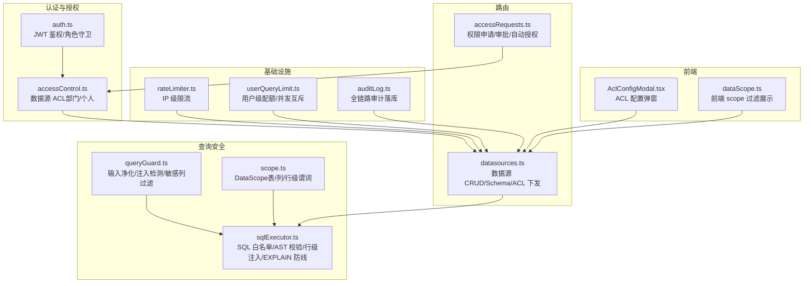
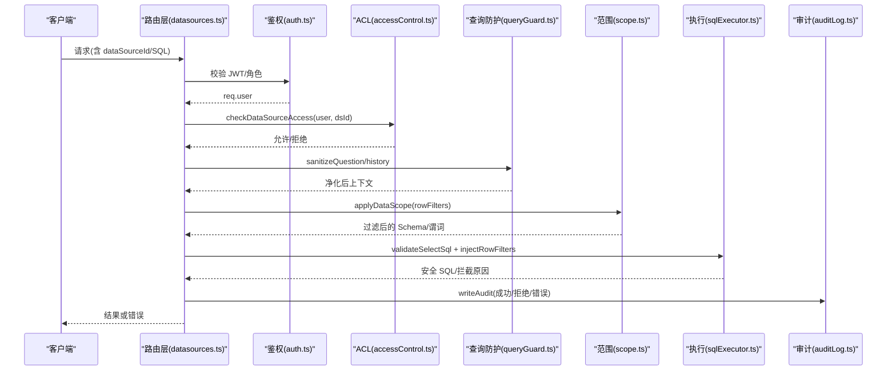
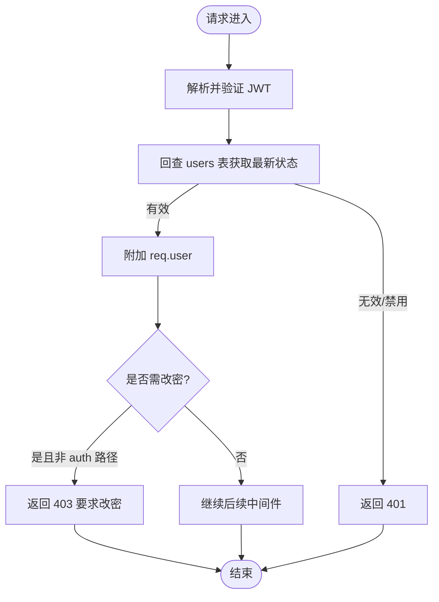
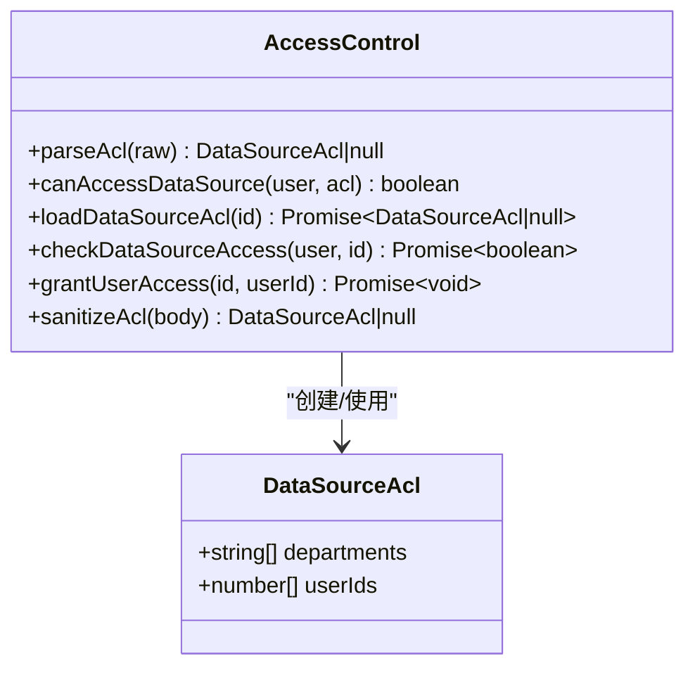
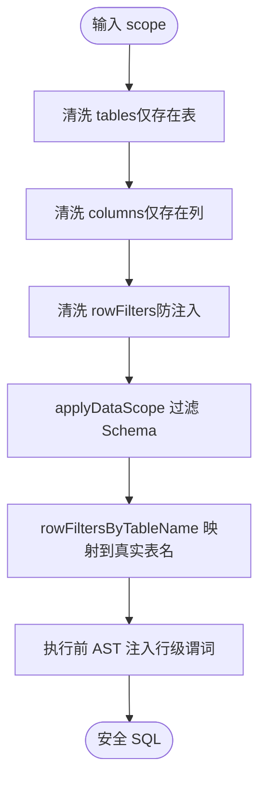
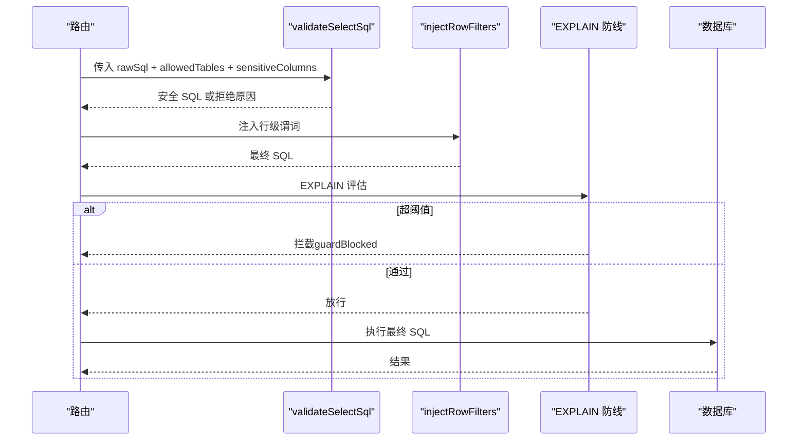
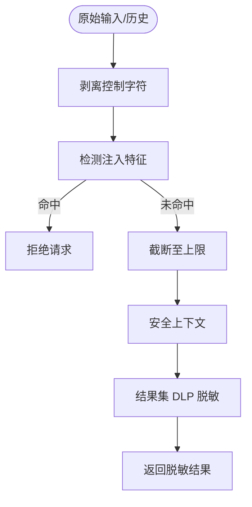
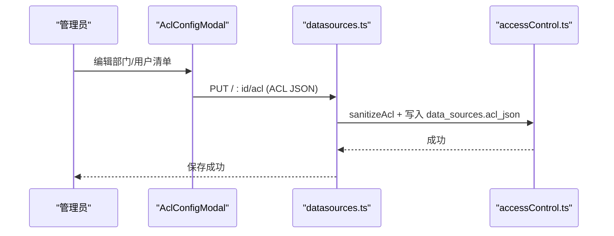
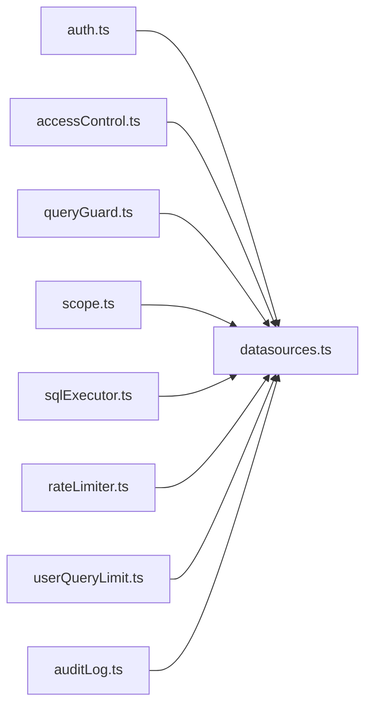

# 权限控制

<cite>
**本文引用的文件**
- [accessControl.ts](file://server/auth/accessControl.ts)
- [auth.ts](file://server/auth/auth.ts)
- [queryGuard.ts](file://server/query/queryGuard.ts)
- [scope.ts](file://server/query/scope.ts)
- [sqlExecutor.ts](file://server/query/sqlExecutor.ts)
- [auditLog.ts](file://server/infra/auditLog.ts)
- [rateLimiter.ts](file://server/infra/rateLimiter.ts)
- [userQueryLimit.ts](file://server/infra/userQueryLimit.ts)
- [datasources.ts](file://server/routes/datasources.ts)
- [accessRequests.ts](file://server/routes/accessRequests.ts)
- [AclConfigModal.tsx](file://src/components/datasource/AclConfigModal.tsx)
- [dataScope.ts](file://src/utils/dataScope.ts)
</cite>

## 目录
1. [简介](#简介)
2. [项目结构](#项目结构)
3. [核心组件](#核心组件)
4. [架构总览](#架构总览)
5. [详细组件分析](#详细组件分析)
6. [依赖关系分析](#依赖关系分析)
7. [性能与安全特性](#性能与安全特性)
8. [故障排查指南](#故障排查指南)
9. [结论](#结论)
10. [附录：测试与合规实践](#附录测试与合规实践)

## 简介
本文件系统化梳理智能问数据分析系统的权限控制体系，覆盖 RBAC 角色授权、数据源访问控制（ACL）、行级权限过滤、查询安全网关（SQL 白名单与 AST 校验）、敏感信息脱敏机制、ACL 配置管理、部门级权限控制、用户权限继承规则、权限审计日志、违规查询拦截与安全策略热更新。同时提供权限测试用例、渗透测试与合规性检查的实现方法建议。

## 项目结构
权限相关代码主要分布在以下模块：
- 认证与授权：server/auth
- 查询安全与范围控制：server/query
- 基础设施（限流、配额、审计）：server/infra
- 路由层（数据源管理、权限申请审批）：server/routes
- 前端 ACL 配置 UI：src/components/datasource
- 前端 scope 工具：src/utils

**图表来源**
- [auth.ts:60-127](file://server/auth/auth.ts#L60-L127)
- [accessControl.ts:18-86](file://server/auth/accessControl.ts#L18-L86)
- [queryGuard.ts:27-100](file://server/query/queryGuard.ts#L27-L100)
- [scope.ts:17-100](file://server/query/scope.ts#L17-L100)
- [sqlExecutor.ts:291-489](file://server/query/sqlExecutor.ts#L291-L489)
- [rateLimiter.ts:14-42](file://server/infra/rateLimiter.ts#L14-L42)
- [userQueryLimit.ts:23-81](file://server/infra/userQueryLimit.ts#L23-L81)
- [auditLog.ts:38-61](file://server/infra/auditLog.ts#L38-L61)
- [datasources.ts:368-440](file://server/routes/datasources.ts#L368-L440)
- [accessRequests.ts:37-138](file://server/routes/accessRequests.ts#L37-L138)
- [AclConfigModal.tsx:21-99](file://src/components/datasource/AclConfigModal.tsx#L21-L99)
- [dataScope.ts:7-21](file://src/utils/dataScope.ts#L7-L21)

**章节来源**
- [auth.ts:60-127](file://server/auth/auth.ts#L60-L127)
- [accessControl.ts:18-86](file://server/auth/accessControl.ts#L18-L86)
- [queryGuard.ts:27-100](file://server/query/queryGuard.ts#L27-L100)
- [scope.ts:17-100](file://server/query/scope.ts#L17-L100)
- [sqlExecutor.ts:291-489](file://server/query/sqlExecutor.ts#L291-L489)
- [rateLimiter.ts:14-42](file://server/infra/rateLimiter.ts#L14-L42)
- [userQueryLimit.ts:23-81](file://server/infra/userQueryLimit.ts#L23-L81)
- [auditLog.ts:38-61](file://server/infra/auditLog.ts#L38-L61)
- [datasources.ts:368-440](file://server/routes/datasources.ts#L368-L440)
- [accessRequests.ts:37-138](file://server/routes/accessRequests.ts#L37-L138)
- [AclConfigModal.tsx:21-99](file://src/components/datasource/AclConfigModal.tsx#L21-L99)
- [dataScope.ts:7-21](file://src/utils/dataScope.ts#L7-L21)

## 核心组件
- RBAC 角色与登录态：基于 JWT 的鉴权中间件，强制回查用户状态与角色，支持强制改密流程。
- 数据源 ACL：按部门与用户 ID 控制数据源可见性与使用；管理员不受限；未配置即不限制。
- DataScope 范围控制：表级、列级、行级（WHERE 片段）三重过滤；行级谓词严格清洗并 AST 注入。
- SQL 安全网关：只读 SELECT 白名单、关键字黑名单、AST 语法树复核、敏感列拒绝、LIMIT 强制、EXPLAIN 扫描量防线。
- 审计日志：成功、降级、错误与被拒绝请求均落库，失败不阻塞主流程。
- 限流与配额：IP 级滑动窗口限流；用户级小时配额与并发互斥（支持 Redis 分布式）。
- 权限申请与审批：用户可发起申请，管理员审批通过后自动并入 ACL。

**章节来源**
- [auth.ts:60-127](file://server/auth/auth.ts#L60-L127)
- [accessControl.ts:18-86](file://server/auth/accessControl.ts#L18-L86)
- [scope.ts:17-100](file://server/query/scope.ts#L17-L100)
- [sqlExecutor.ts:291-489](file://server/query/sqlExecutor.ts#L291-L489)
- [auditLog.ts:38-61](file://server/infra/auditLog.ts#L38-L61)
- [rateLimiter.ts:14-42](file://server/infra/rateLimiter.ts#L14-L42)
- [userQueryLimit.ts:23-81](file://server/infra/userQueryLimit.ts#L23-L81)
- [accessRequests.ts:37-138](file://server/routes/accessRequests.ts#L37-L138)

## 架构总览
下图展示了从请求进入、鉴权、ACL 判定、DataScope 过滤、SQL 安全网关到执行与审计的全链路。

**图表来源**
- [datasources.ts:368-440](file://server/routes/datasources.ts#L368-L440)
- [auth.ts:67-113](file://server/auth/auth.ts#L67-L113)
- [accessControl.ts:57-73](file://server/auth/accessControl.ts#L57-L73)
- [queryGuard.ts:35-69](file://server/query/queryGuard.ts#L35-L69)
- [scope.ts:28-100](file://server/query/scope.ts#L28-L100)
- [sqlExecutor.ts:291-489](file://server/query/sqlExecutor.ts#L291-L489)
- [auditLog.ts:38-61](file://server/infra/auditLog.ts#L38-L61)

## 详细组件分析

### RBAC 与登录态
- 通过 JWT 签发与校验，并在每次请求时回查 users 表确保禁用/角色变更即时生效。
- 支持强制改密：首次登录或被重置密码的用户仅能访问 /api/auth/*。
- 提供 requireRole 中间件用于接口级角色保护（如 ADMIN/ANALYST）。

**图表来源**
- [auth.ts:60-127](file://server/auth/auth.ts#L60-L127)

**章节来源**
- [auth.ts:60-127](file://server/auth/auth.ts#L60-L127)

### 数据源访问控制（ACL）
- 模型：data_sources.acl_json = { departments: string[], userIds: number[] }
- 规则：
  - NULL 或两组皆空 → 不限制（全员可见）
  - 非空 → 仅 ADMIN 或清单内部门成员/个人用户可访问
- 能力：
  - 解析/清洗 ACL 入参（长度上限、去重、类型校验）
  - 加载与校验访问权限
  - 审批通过后将用户加入 acl_json.userIds（幂等）

**图表来源**
- [accessControl.ts:13-107](file://server/auth/accessControl.ts#L13-L107)

**章节来源**
- [accessControl.ts:18-107](file://server/auth/accessControl.ts#L18-L107)
- [datasources.ts:368-440](file://server/routes/datasources.ts#L368-L440)
- [accessRequests.ts:106-138](file://server/routes/accessRequests.ts#L106-L138)

### 数据范围（DataScope）与行级权限
- 表级：tables 白名单
- 列级：columns[tableId] 白名单
- 行级：rowFilters[tableId] 为 WHERE 片段，经严格清洗后在 AST 中强制注入派生表包裹
- 行级谓词清洗规则：禁止多语句、注释、子查询、INTO 等危险构造

**图表来源**
- [scope.ts:17-100](file://server/query/scope.ts#L17-L100)

**章节来源**
- [scope.ts:17-100](file://server/query/scope.ts#L17-L100)

### SQL 安全网关（查询安全网关）
- 只读白名单：仅允许 SELECT（含 WITH CTE），禁止写/DDL/管理类关键字
- 表引用白名单：正则提取 FROM/JOIN 表名，AST 二次校验，排除 CTE 别名
- 敏感列拒绝：若 SQL 引用被剔除的敏感列，直接拒绝
- LIMIT 强制：无 LIMIT 则追加，有 LIMIT 则 clamp 到最大行数
- EXPLAIN 防线：预估扫描行数超过阈值则拦截（fail-open 放行异常场景）
- 行级权限注入：对受控表进行 AST 包裹，递归处理 CTE/子查询/UNION

**图表来源**
- [sqlExecutor.ts:291-489](file://server/query/sqlExecutor.ts#L291-L489)
- [sqlExecutor.ts:629-662](file://server/query/sqlExecutor.ts#L629-L662)

**章节来源**
- [sqlExecutor.ts:291-489](file://server/query/sqlExecutor.ts#L291-L489)
- [sqlExecutor.ts:629-662](file://server/query/sqlExecutor.ts#L629-L662)

### 查询输入净化与敏感信息脱敏
- 输入净化：控制字符剥离、提示注入特征拒绝、长度截断
- 历史净化：仅保留 user 消息，丢弃 assistant 输出，防止回流污染
- 敏感列过滤：匹配敏感列名/描述，从 Schema 中剔除并记录 removed 列表
- 结果脱敏（DLP）：根据列名与内容抽样命中规则对手机号、身份证、邮箱、银行卡等进行掩码；支持全局开关与管理员豁免

**图表来源**
- [queryGuard.ts:27-100](file://server/query/queryGuard.ts#L27-L100)

**章节来源**
- [queryGuard.ts:27-100](file://server/query/queryGuard.ts#L27-L100)

### ACL 配置管理与部门级权限
- 前端提供 ACL 配置弹窗，支持设置部门与用户 ID 清单（逗号分隔）
- 后端对 ACL 入参进行白名单结构与长度上限清洗
- 列表接口对非管理员屏蔽 tables 详情，并对无权限数据源标记 accessDenied
- 审批通过后自动将用户加入 acl_json.userIds，实现“部门/个人”双通道授权

**图表来源**
- [AclConfigModal.tsx:21-99](file://src/components/datasource/AclConfigModal.tsx#L21-L99)
- [accessControl.ts:88-107](file://server/auth/accessControl.ts#L88-L107)
- [datasources.ts:368-440](file://server/routes/datasources.ts#L368-L440)

**章节来源**
- [AclConfigModal.tsx:21-99](file://src/components/datasource/AclConfigModal.tsx#L21-L99)
- [accessControl.ts:88-107](file://server/auth/accessControl.ts#L88-L107)
- [datasources.ts:368-440](file://server/routes/datasources.ts#L368-L440)

### 用户权限继承规则
- 管理员（ADMIN）不受 ACL 限制，始终拥有所有数据源访问权
- 普通用户需满足：
  - 所属部门在 ACL.departments 中，或
  - 用户 ID 在 ACL.userIds 中
- 审批通过会自动将用户 ID 并入 ACL.userIds，形成“个人授权”继承

**章节来源**
- [accessControl.ts:43-55](file://server/auth/accessControl.ts#L43-L55)
- [accessRequests.ts:106-138](file://server/routes/accessRequests.ts#L106-L138)

### 权限审计日志
- 全链路事件：成功、缓存命中、降级、错误、澄清、拒绝（输入/权限/频率/开关）、队列化任务
- 字段包含：用户、端点、数据源、问题、状态、详情、实际执行 SQL、行数、耗时
- 写入失败仅告警不阻塞主流程，保证可用性

**章节来源**
- [auditLog.ts:10-61](file://server/infra/auditLog.ts#L10-L61)

### 违规查询拦截与安全策略热更新
- 违规拦截：
  - 输入净化拒绝注入
  - SQL 白名单/AST 校验拒绝非 SELECT/越权表/敏感列
  - EXPLAIN 防线拦截大扫描
  - 行级权限注入失败 fail-closed 拒绝
- 热更新：
  - 数据源配置/Schema/Scope 变更后调用 invalidateExecutorPool/invalidateSchemaCache/invalidateQueryCache 使连接池与缓存失效，策略即时生效

**章节来源**
- [sqlExecutor.ts:291-489](file://server/query/sqlExecutor.ts#L291-L489)
- [sqlExecutor.ts:629-662](file://server/query/sqlExecutor.ts#L629-L662)
- [datasources.ts:642-651](file://server/routes/datasources.ts#L642-L651)

## 依赖关系分析
- 路由层依赖鉴权与 ACL 进行访问控制，再委托查询安全层执行 SQL
- 查询安全层依赖范围控制与输入净化，确保最终 SQL 合法、安全、受限
- 基础设施提供限流、配额、审计支撑，保障系统可用性与可观测性
- 前端提供 ACL 配置与 scope 展示，配合后端完成策略下发与渲染

**图表来源**
- [datasources.ts:6-17](file://server/routes/datasources.ts#L6-L17)
- [auth.ts:60-127](file://server/auth/auth.ts#L60-L127)
- [accessControl.ts:18-86](file://server/auth/accessControl.ts#L18-L86)
- [queryGuard.ts:27-100](file://server/query/queryGuard.ts#L27-L100)
- [scope.ts:17-100](file://server/query/scope.ts#L17-L100)
- [sqlExecutor.ts:291-489](file://server/query/sqlExecutor.ts#L291-L489)
- [rateLimiter.ts:14-42](file://server/infra/rateLimiter.ts#L14-L42)
- [userQueryLimit.ts:23-81](file://server/infra/userQueryLimit.ts#L23-L81)
- [auditLog.ts:38-61](file://server/infra/auditLog.ts#L38-L61)

**章节来源**
- [datasources.ts:6-17](file://server/routes/datasources.ts#L6-L17)

## 性能与安全特性
- 连接池分级与场景超时：交互/分析链/导出独立配额与超时，避免互相影响
- MAX_ROWS 限制：默认 10 万行，防止 OOM
- EXPLAIN 防线：默认 100 万行阈值（导出放宽 10 倍），拦截潜在大扫描
- 审计旁路埋点：不影响主流程
- 限流与配额：IP 级与用户级双重保护，支持 Redis 分布式

[本节为通用性能与安全讨论，无需特定文件来源]

## 故障排查指南
- 401/403：检查 JWT 有效性、用户状态、角色守卫与 ACL 配置
- 429：检查 IP 限流与用户配额是否达到上限
- 拒绝执行：查看审计日志中的 status（DENIED_INPUT/DENIED_AUTH/DENIED_RATE/DENIED_SWITCH）与 detail
- 行级权限注入失败：确认 rowFilters 谓词合法性与 AST 注入是否成功
- EXPLAIN 拦截：调整查询条件缩小范围或提高阈值（谨慎）

**章节来源**
- [auditLog.ts:10-61](file://server/infra/auditLog.ts#L10-L61)
- [rateLimiter.ts:14-42](file://server/infra/rateLimiter.ts#L14-L42)
- [userQueryLimit.ts:23-81](file://server/infra/userQueryLimit.ts#L23-L81)
- [sqlExecutor.ts:291-489](file://server/query/sqlExecutor.ts#L291-L489)

## 结论
本系统构建了多层纵深防御的权限控制体系：以 RBAC 为基础，结合数据源 ACL、DataScope 行级权限、SQL 安全网关与审计日志，实现了从身份认证、资源访问、查询执行到结果输出的全链路安全管控。通过热更新与严格的输入/SQL 校验，系统在保障安全的同时兼顾了可用性与性能。

[本节为总结性内容，无需特定文件来源]

## 附录：测试与合规实践

### 权限测试用例建议
- 角色与登录态
  - 未登录/过期 token → 401
  - 账号禁用/角色变更 → 401
  - 强制改密 → 403（非 auth 路径）
- ACL
  - 管理员访问任意数据源 → 通过
  - 非管理员不在 ACL → 列表隐藏 tables，flex-schema 拒绝
  - 部门/个人命中任一 → 通过
  - ACL 入参清洗：超长/非法类型 → 归一或忽略
- DataScope
  - 表/列白名单生效
  - 行级谓词清洗：多语句/注释/子查询/INTO → 拒绝
  - 注入失败 → 拒绝执行
- SQL 安全网关
  - 非 SELECT/危险关键字 → 拒绝
  - 越权表/敏感列 → 拒绝
  - LIMIT 强制与 clamp
  - EXPLAIN 拦截 → guardBlocked
- 限流与配额
  - IP 超限 → 429
  - 用户配额超限 → 拒绝
  - 并发互斥 → 同一用户仅一个进行中查询

**章节来源**
- [auth.ts:60-127](file://server/auth/auth.ts#L60-L127)
- [accessControl.ts:18-107](file://server/auth/accessControl.ts#L18-L107)
- [scope.ts:17-100](file://server/query/scope.ts#L17-L100)
- [sqlExecutor.ts:291-489](file://server/query/sqlExecutor.ts#L291-L489)
- [rateLimiter.ts:14-42](file://server/infra/rateLimiter.ts#L14-L42)
- [userQueryLimit.ts:23-81](file://server/infra/userQueryLimit.ts#L23-L81)

### 渗透测试要点
- 注入攻击：尝试绕过输入净化与 SQL 白名单（提示注入、SQL 注入、CTE 滥用）
- 越权访问：利用 ACL/DataScope 边界尝试访问未授权数据源或表
- 大扫描攻击：构造大范围聚合触发 EXPLAIN 防线
- 并发与配额：高频请求与并发抢占，验证限流与互斥
- 结果泄露：验证敏感列是否在结果中被脱敏

**章节来源**
- [queryGuard.ts:27-100](file://server/query/queryGuard.ts#L27-L100)
- [sqlExecutor.ts:291-489](file://server/query/sqlExecutor.ts#L291-L489)
- [auditLog.ts:10-61](file://server/infra/auditLog.ts#L10-L61)

### 合规性检查方法
- 策略一致性：核对 ACL 与 DataScope 是否与业务口径一致
- 审计可追溯：抽查 query_audit_log 中 DENIED_* 与 ERROR 条目，定位风险
- 脱敏覆盖率：验证敏感列与内容命中是否按策略脱敏
- 热更新验证：修改 ACL/Scope/Schema 后，立即验证旧连接/缓存已失效

**章节来源**
- [accessControl.ts:18-107](file://server/auth/accessControl.ts#L18-L107)
- [scope.ts:17-100](file://server/query/scope.ts#L17-L100)
- [auditLog.ts:10-61](file://server/infra/auditLog.ts#L10-L61)