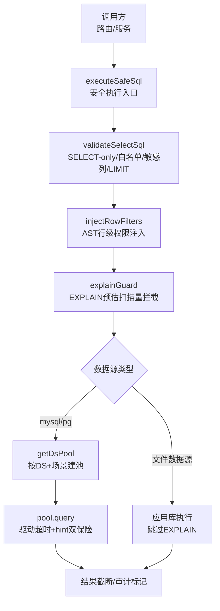
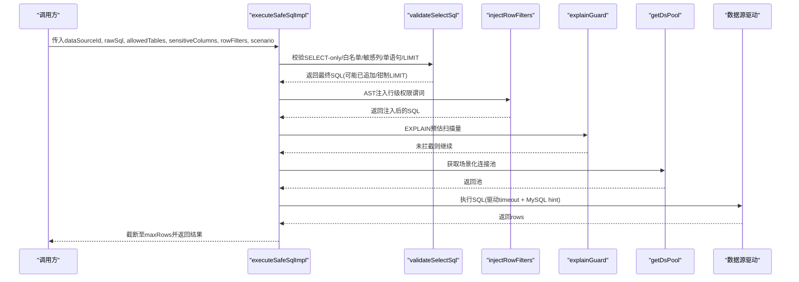
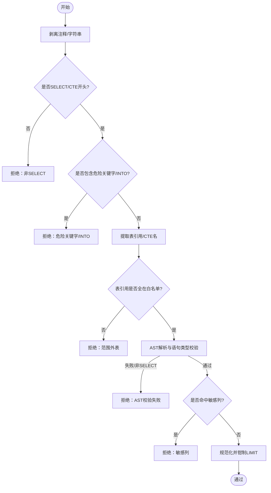
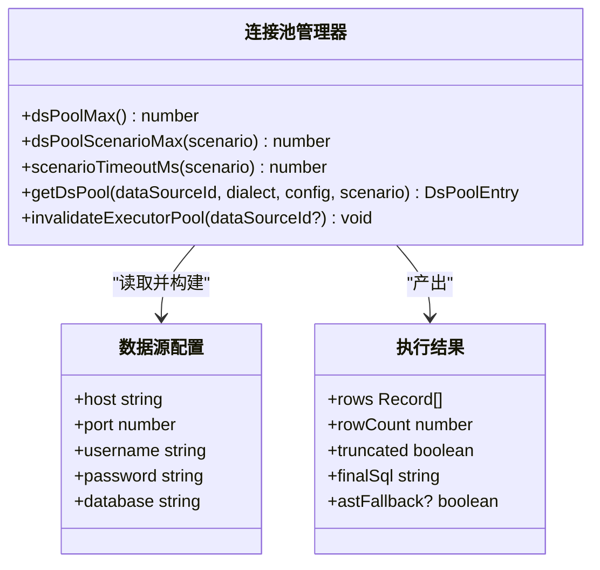
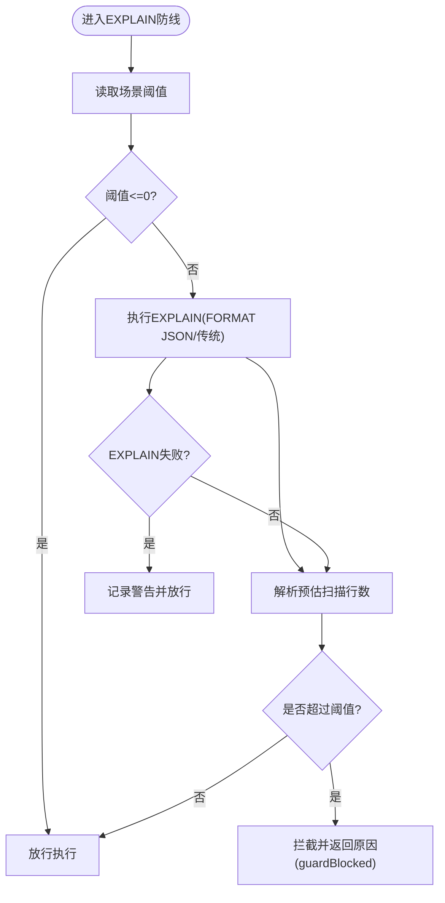
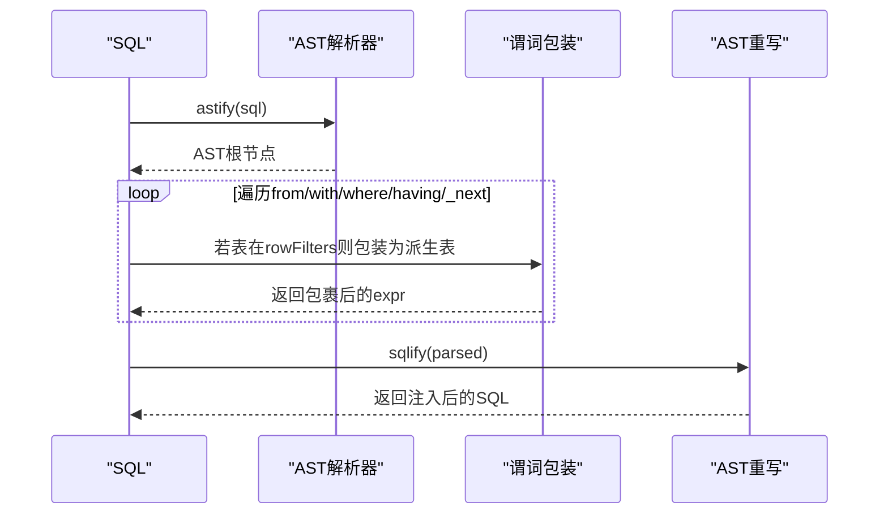
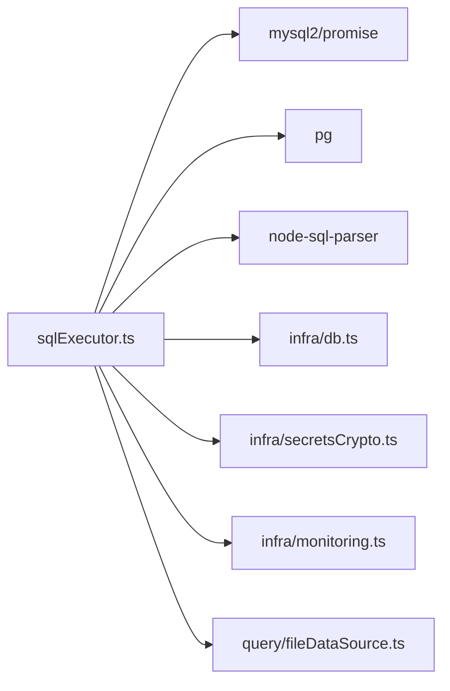

# SQL执行器

<cite>
**本文引用的文件**
- [sqlExecutor.ts](file://server/query/sqlExecutor.ts)
- [sqlExecutorPool.test.ts](file://server/query/sqlExecutorPool.test.ts)
- [sqlTemplates.ts](file://server/query/sqlTemplates.ts)
- [queryGuard.ts](file://server/query/queryGuard.ts)
- [ironRules.ts](file://server/query/ironRules.ts)
- [db.ts](file://server/infra/db.ts)
</cite>

## 目录
1. [简介](#简介)
2. [项目结构](#项目结构)
3. [核心组件](#核心组件)
4. [架构总览](#架构总览)
5. [详细组件分析](#详细组件分析)
6. [依赖关系分析](#依赖关系分析)
7. [性能考量](#性能考量)
8. [故障排查指南](#故障排查指南)
9. [结论](#结论)
10. [附录：配置与示例](#附录：配置与示例)

## 简介
本模块提供“SQL安全执行层”，确保由LLM或用户生成的SQL在真实数据源上执行前，通过多重安全防线与资源保护机制。核心目标包括：
- 仅允许只读查询（SELECT-only），拒绝写操作、DDL与管理类语句
- 表名白名单校验（结合scope与敏感列过滤后的Schema）
- 敏感列拒绝匹配
- 单语句限制与强制LIMIT
- EXPLAIN防线评估预估扫描行数并拦截高风险查询
- 行级权限注入（AST解析+谓词注入+子查询递归处理）
- 连接池分级管理（按数据源ID与场景分级）、超时控制与容量公式化设计
- 结果集截断与审计标记（如AST降级回退）

该实现同时支持MySQL与PostgreSQL/Greenplum方言差异，并在必要时对MySQL注入服务端执行时限提示以保障超时兜底。

## 项目结构
围绕SQL执行的核心文件与职责如下：
- server/query/sqlExecutor.ts：安全校验、EXPLAIN防线、行级权限注入、连接池与执行主流程
- server/query/sqlExecutorPool.test.ts：连接池分级、场景超时、MySQL hint注入的单元测试
- server/query/sqlTemplates.ts：参数化分析模板（辅助复杂SQL构建，非执行路径必需）
- server/query/queryGuard.ts：输入净化、历史净化与敏感列特征（为上游生成阶段提供上下文过滤）
- server/query/ironRules.ts：管理员登记铁律规则（注入prompt约束，不直接拼接SQL）
- server/infra/db.ts：应用库连接池与初始化（用于读取数据源配置等）

图表来源
- [sqlExecutor.ts:734-832](file://server/query/sqlExecutor.ts#L734-L832)
- [sqlExecutor.ts:291-387](file://server/query/sqlExecutor.ts#L291-L387)
- [sqlExecutor.ts:396-489](file://server/query/sqlExecutor.ts#L396-L489)
- [sqlExecutor.ts:629-662](file://server/query/sqlExecutor.ts#L629-L662)
- [sqlExecutor.ts:686-726](file://server/query/sqlExecutor.ts#L686-L726)

章节来源
- [sqlExecutor.ts:1-120](file://server/query/sqlExecutor.ts#L1-L120)
- [sqlExecutor.ts:734-832](file://server/query/sqlExecutor.ts#L734-L832)

## 核心组件
- SELECT-only与安全校验：stripCommentsAndStrings、FORBIDDEN_PATTERN、extractTableRefs、checkAstSafety、validateSelectSql
- 表名前缀纠偏：repairTablePrefixes
- 行级权限注入：injectRowFilters（AST遍历、派生表包裹、WITH/UNION/子查询递归）
- EXPLAIN防线：parseMysqlExplainRows、parsePgExplainRows、explainGuard、explainGuardMaxRows
- 连接池与超时：dsPoolMax、dsPoolScenarioMax、scenarioTimeoutMs、getDsPool、invalidateExecutorPool、injectMysqlMaxExecTime
- 执行主流程：executeSafeSql / executeSafeSqlImpl（含文件数据源分支、结果截断、审计标记）

章节来源
- [sqlExecutor.ts:155-182](file://server/query/sqlExecutor.ts#L155-L182)
- [sqlExecutor.ts:190-235](file://server/query/sqlExecutor.ts#L190-L235)
- [sqlExecutor.ts:242-266](file://server/query/sqlExecutor.ts#L242-L266)
- [sqlExecutor.ts:272-283](file://server/query/sqlExecutor.ts#L272-L283)
- [sqlExecutor.ts:291-387](file://server/query/sqlExecutor.ts#L291-L387)
- [sqlExecutor.ts:396-489](file://server/query/sqlExecutor.ts#L396-L489)
- [sqlExecutor.ts:531-662](file://server/query/sqlExecutor.ts#L531-L662)
- [sqlExecutor.ts:686-726](file://server/query/sqlExecutor.ts#L686-L726)
- [sqlExecutor.ts:734-832](file://server/query/sqlExecutor.ts#L734-L832)

## 架构总览
SQL执行链路采用“多层防线 + 资源保护”的设计：
- L1 正则防线：剥离注释/字符串后关键字匹配、语句开头检查、多语句检测、INTO拒绝
- L2 白名单与AST复核：提取表引用与CTE名，AST解析强校验语句类型与表引用
- L3 行级权限注入：AST包裹受控表为带WHERE的子查询，递归覆盖子查询/UNION/CTE
- L4 EXPLAIN防线：估算扫描行数，超阈值拦截；失败时fail-open放行但记录错误
- 资源保护：场景化连接池配额与超时；MySQL注入MAX_EXECUTION_TIME；结果集截断

图表来源
- [sqlExecutor.ts:734-832](file://server/query/sqlExecutor.ts#L734-L832)
- [sqlExecutor.ts:291-387](file://server/query/sqlExecutor.ts#L291-L387)
- [sqlExecutor.ts:396-489](file://server/query/sqlExecutor.ts#L396-L489)
- [sqlExecutor.ts:629-662](file://server/query/sqlExecutor.ts#L629-L662)
- [sqlExecutor.ts:686-726](file://server/query/sqlExecutor.ts#L686-L726)

## 详细组件分析

### 安全执行流程（SELECT-only、白名单、敏感列、单语句、强制LIMIT）
- 注释与字符串剥离：避免字面量中的关键字干扰结构校验；PG方言保留双引号标识符
- 危险关键字黑名单：拒绝写/DDL/管理类关键字（包含PROCEDURE ANALYSE等危险构造）
- 表引用提取：支持FROM/JOIN链、逗号分隔多表、子查询内部表；排除CTE别名
- AST二道防线：使用node-sql-parser解析，校验所有语句类型为select，且表引用在白名单内
- 敏感列拒绝：基于裸列名整词匹配，防止越权访问
- 强制LIMIT：无LIMIT则追加；有LIMIT则按方言规范化并钳制到MAX_ROWS

图表来源
- [sqlExecutor.ts:174-182](file://server/query/sqlExecutor.ts#L174-L182)
- [sqlExecutor.ts:190-235](file://server/query/sqlExecutor.ts#L190-L235)
- [sqlExecutor.ts:242-266](file://server/query/sqlExecutor.ts#L242-L266)
- [sqlExecutor.ts:291-387](file://server/query/sqlExecutor.ts#L291-L387)

章节来源
- [sqlExecutor.ts:174-182](file://server/query/sqlExecutor.ts#L174-L182)
- [sqlExecutor.ts:190-235](file://server/query/sqlExecutor.ts#L190-L235)
- [sqlExecutor.ts:242-266](file://server/query/sqlExecutor.ts#L242-L266)
- [sqlExecutor.ts:291-387](file://server/query/sqlExecutor.ts#L291-L387)

### 连接池管理策略（按数据源ID与场景分级、超时控制、容量公式化）
- 容量公式：DS_POOL_MAX显式优先；否则按EXPECTED_CONCURRENT_USERS推导，clamp到[3,20]
- 场景配额：interactive/chain/export分别独立配额，显式env覆盖；默认比例参考基准
- 场景超时：interactive=15s、chain=120s、export=60s；显式env覆盖
- 建池隔离：key=dataSourceId::scenario；不同场景互不影响；失效接口可关闭指定数据源全部场景池
- 方言差异：PG使用statement_timeout；MySQL使用驱动timeout + MAX_EXECUTION_TIME hint

图表来源
- [sqlExecutor.ts:51-109](file://server/query/sqlExecutor.ts#L51-L109)
- [sqlExecutor.ts:686-726](file://server/query/sqlExecutor.ts#L686-L726)
- [sqlExecutor.ts:517-529](file://server/query/sqlExecutor.ts#L517-L529)

章节来源
- [sqlExecutor.ts:51-109](file://server/query/sqlExecutor.ts#L51-L109)
- [sqlExecutor.ts:686-726](file://server/query/sqlExecutor.ts#L686-L726)
- [sqlExecutorPool.test.ts:46-96](file://server/query/sqlExecutorPool.test.ts#L46-L96)
- [sqlExecutorPool.test.ts:117-170](file://server/query/sqlExecutorPool.test.ts#L117-L170)

### EXPLAIN防线机制（预估扫描行数、方言差异、阈值配置）
- 阈值配置：SQL_EXPLAIN_MAX_ROWS（默认100万；0=关闭）；export场景放宽10倍
- MySQL解析：兼容表格形式(rows字段)、JSON格式(rows_examined_per_scan/estimated_rows)、树形文本(rows=N)
- PG解析：QUERY PLAN树中Scan节点Plan Rows最大值
- 行为：超阈值拦截并返回guardBlocked标记；EXPLAIN失败fail-open放行并记录错误

图表来源
- [sqlExecutor.ts:531-540](file://server/query/sqlExecutor.ts#L531-L540)
- [sqlExecutor.ts:544-592](file://server/query/sqlExecutor.ts#L544-L592)
- [sqlExecutor.ts:594-620](file://server/query/sqlExecutor.ts#L594-L620)
- [sqlExecutor.ts:629-662](file://server/query/sqlExecutor.ts#L629-L662)

章节来源
- [sqlExecutor.ts:531-662](file://server/query/sqlExecutor.ts#L531-L662)

### 行级权限注入（AST解析、谓词注入、子查询递归处理）
- 触发条件：存在rowFilters映射（实际表名→谓词）且SQL引用了受控表
- 注入方式：将FROM t替换为FROM (SELECT * FROM t WHERE pred) AS t，保持外层列引用不变
- 递归覆盖：
  - WITH CTE定义内的真实表引用也需包裹（防漏注）
  - WHERE/HAVING表达式中的子查询（IN/EXISTS等）
  - UNION/UNION ALL链（_next链）
- 失败处理：谓词解析失败或AST回写失败均fail-closed拒绝

图表来源
- [sqlExecutor.ts:396-489](file://server/query/sqlExecutor.ts#L396-L489)

章节来源
- [sqlExecutor.ts:396-489](file://server/query/sqlExecutor.ts#L396-L489)

### 错误重试机制、事务处理、结果集截断
- 错误处理：执行异常统一捕获并返回失败原因；EXPLAIN失败fail-open放行
- 事务处理：当前实现为单条SELECT执行，不涉及跨语句事务；如需事务可在上层封装
- 结果集截断：无论何种数据源，最终结果slice(0, maxRows)，并标记truncated
- 审计标记：astFallback表示AST解析失败走正则兜底，供路由层审计

章节来源
- [sqlExecutor.ts:818-832](file://server/query/sqlExecutor.ts#L818-L832)
- [sqlExecutor.ts:629-662](file://server/query/sqlExecutor.ts#L629-L662)

## 依赖关系分析
- 外部依赖：
  - mysql2/promise：MySQL连接池与查询
  - pg：PostgreSQL/Greenplum连接池与查询
  - node-sql-parser：AST解析与重建（tableList、astify、sqlify）
- 内部依赖：
  - infra/db：应用库连接池（读取数据源配置）
  - infra/secretsCrypto：解密数据源密码
  - infra/monitoring：埋点观察（执行耗时、EXPLAIN守卫状态）
  - llm/llmClient：可选自愈入口（校验失败时可调用LLM纠偏重试一次，见模块注释）
  - query/fileDataSource：文件数据源物理表识别

图表来源
- [sqlExecutor.ts:11-22](file://server/query/sqlExecutor.ts#L11-L22)
- [sqlExecutor.ts:671-684](file://server/query/sqlExecutor.ts#L671-L684)
- [sqlExecutor.ts:767-800](file://server/query/sqlExecutor.ts#L767-L800)

章节来源
- [sqlExecutor.ts:11-22](file://server/query/sqlExecutor.ts#L11-L22)
- [sqlExecutor.ts:671-684](file://server/query/sqlExecutor.ts#L671-L684)
- [sqlExecutor.ts:767-800](file://server/query/sqlExecutor.ts#L767-L800)

## 性能考量
- 连接池容量公式化：避免硬编码导致资源不足或打爆后端max_connections
- 场景化超时：交互/链/导出差异化超时，减少长任务阻塞交互
- MySQL服务端限时：MAX_EXECUTION_TIME hint作为第二重超时保障
- EXPLAIN防线：提前拦截大扫描，降低对业务库的压力
- 结果截断：防止超大结果集占用内存与带宽

[本节为通用指导，无需具体文件引用]

## 故障排查指南
- 常见拒绝原因：
  - 非SELECT开头或包含危险关键字/INTO
  - 引用范围外表或未通过AST校验
  - 命中敏感列
  - EXPLAIN预估扫描量超阈值
- 调试建议：
  - 查看返回reason与guardBlocked标记
  - 检查allowedTables与sensitiveColumns配置
  - 调整SQL_EXPLAIN_MAX_ROWS或增加筛选条件
  - 确认rowFilters是否正确映射实际表名
  - 对于文件数据源，确认物理表名与方言选择

章节来源
- [sqlExecutor.ts:291-387](file://server/query/sqlExecutor.ts#L291-L387)
- [sqlExecutor.ts:629-662](file://server/query/sqlExecutor.ts#L629-L662)
- [sqlExecutor.ts:754-832](file://server/query/sqlExecutor.ts#L754-L832)

## 结论
本SQL执行器通过“正则+AST+EXPLAIN+行级权限注入+连接池分级+超时与截断”的多层防护体系，在保证安全性的前提下兼顾可用性与性能。其模块化设计与清晰的配置项使得在不同数据源与场景下均可稳定运行，并为后续扩展（如自愈重试、更多方言支持）预留空间。

[本节为总结性内容，无需具体文件引用]

## 附录：配置与示例

### 环境变量与配置项
- DS_POOL_MAX：数据源连接池最大容量（显式优先）
- EXPECTED_CONCURRENT_USERS：并发用户数，用于推导默认池容量
- DS_POOL_INTERACTIVE / DS_POOL_CHAIN / DS_POOL_EXPORT：场景化连接池配额（显式覆盖）
- QUERY_TIMEOUT_INTERACTIVE_MS / QUERY_TIMEOUT_CHAIN_MS / QUERY_TIMEOUT_EXPORT_MS：场景化执行超时（毫秒）
- SQL_EXPLAIN_MAX_ROWS：EXPLAIN防线阈值（0=关闭；export场景自动放宽10倍）

章节来源
- [sqlExecutor.ts:51-109](file://server/query/sqlExecutor.ts#L51-L109)
- [sqlExecutor.ts:531-540](file://server/query/sqlExecutor.ts#L531-L540)
- [sqlExecutorPool.test.ts:28-44](file://server/query/sqlExecutorPool.test.ts#L28-L44)
- [sqlExecutorPool.test.ts:82-96](file://server/query/sqlExecutorPool.test.ts#L82-L96)

### 关键函数与用法路径
- 安全校验与执行入口：executeSafeSql / executeSafeSqlImpl
- SELECT-only与白名单校验：validateSelectSql
- 行级权限注入：injectRowFilters
- EXPLAIN防线：explainGuard / parseMysqlExplainRows / parsePgExplainRows
- 连接池与超时：getDsPool / dsPoolScenarioMax / scenarioTimeoutMs / injectMysqlMaxExecTime

章节来源
- [sqlExecutor.ts:291-387](file://server/query/sqlExecutor.ts#L291-L387)
- [sqlExecutor.ts:396-489](file://server/query/sqlExecutor.ts#L396-L489)
- [sqlExecutor.ts:531-662](file://server/query/sqlExecutor.ts#L531-L662)
- [sqlExecutor.ts:686-726](file://server/query/sqlExecutor.ts#L686-L726)
- [sqlExecutor.ts:734-832](file://server/query/sqlExecutor.ts#L734-L832)

### 相关测试用例参考
- 连接池分级与场景超时：dsPoolScenarioMax、scenarioTimeoutMs、injectMysqlMaxExecTime、getDsPool、invalidateExecutorPool
- SELECT-only、白名单、敏感列、CTE与复杂语法：validateSelectSql、extractTableRefs、extractCteNames、stripCommentsAndStrings、injectRowFilters

章节来源
- [sqlExecutorPool.test.ts:46-170](file://server/query/sqlExecutorPool.test.ts#L46-L170)
- [sqlExecutor.test.ts:1-200](file://server/query/sqlExecutor.test.ts#L1-L200)

### 模板与规则（辅助能力）
- 参数化分析模板：year_over_year、month_over_month、top_n_with_pct、conditional_agg_cross_tab（buildSql）
- 铁律规则：ADMIN维护，全量ACTIVE规则注入prompt，最高优先级约束SQL生成

章节来源
- [sqlTemplates.ts:1-119](file://server/query/sqlTemplates.ts#L1-L119)
- [ironRules.ts:1-265](file://server/query/ironRules.ts#L1-L265)