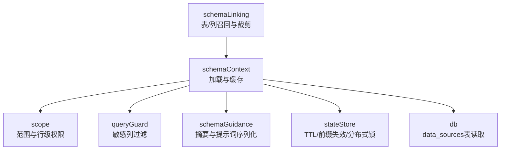
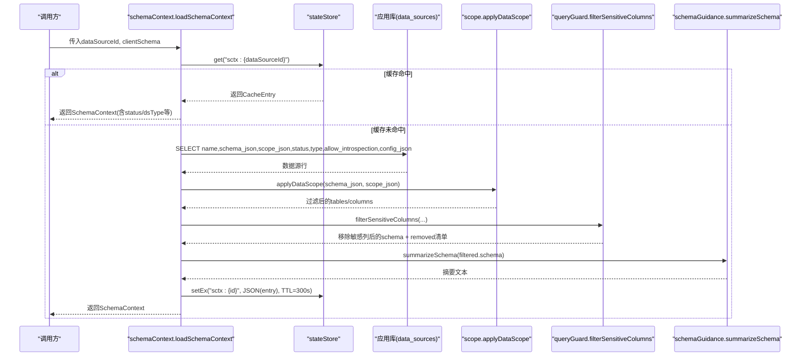
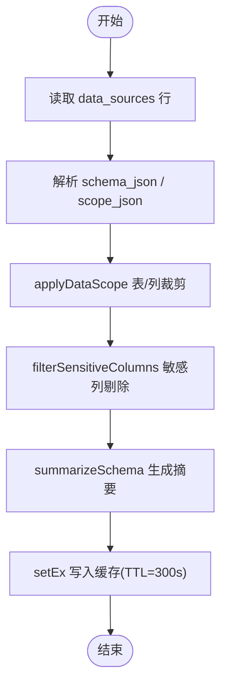
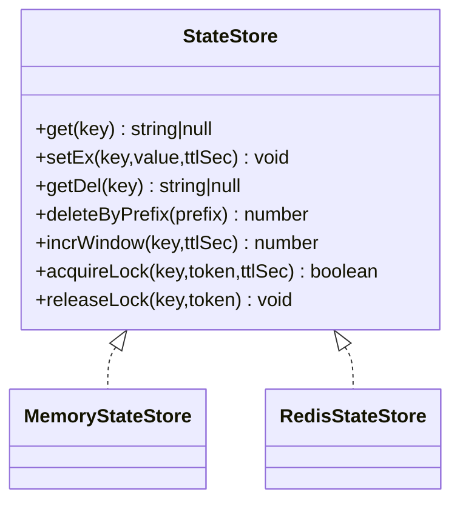
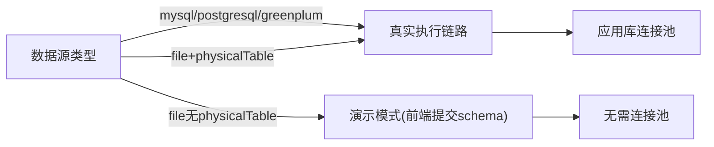
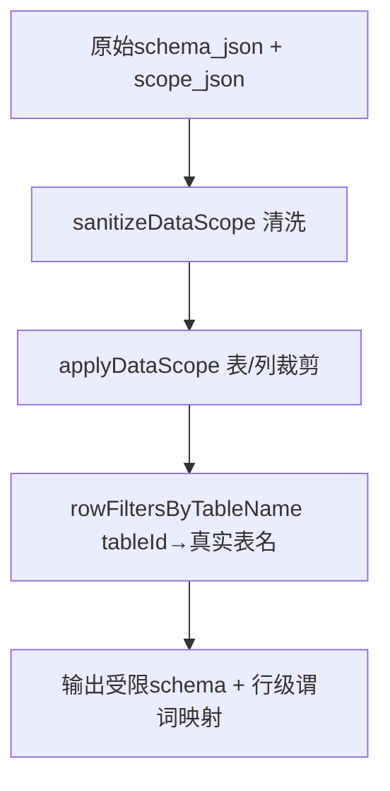
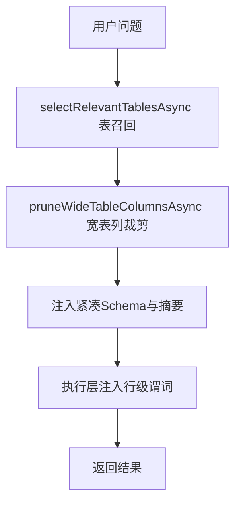
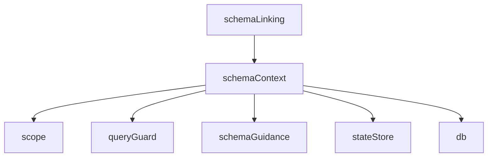

# Schema上下文管理

<cite>
**本文引用的文件**
- [server/query/schemaContext.ts](file://server/query/schemaContext.ts)
- [server/query/schemaTypes.ts](file://server/query/schemaTypes.ts)
- [server/query/scope.ts](file://server/query/scope.ts)
- [server/infra/stateStore.ts](file://server/infra/stateStore.ts)
- [server/query/schemaLinking.ts](file://server/query/schemaLinking.ts)
- [server/query/schemaGuidance.ts](file://server/query/schemaGuidance.ts)
- [server/query/queryGuard.ts](file://server/query/queryGuard.ts)
- [server/infra/db.ts](file://server/infra/db.ts)
</cite>

## 目录
1. [简介](#简介)
2. [项目结构](#项目结构)
3. [核心组件](#核心组件)
4. [架构总览](#架构总览)
5. [详细组件分析](#详细组件分析)
6. [依赖关系分析](#依赖关系分析)
7. [性能考量](#性能考量)
8. [故障排查指南](#故障排查指南)
9. [结论](#结论)
10. [附录](#附录)

## 简介
本文件系统性梳理“Schema上下文管理”的机制与实现，覆盖以下目标：
- Schema元数据提取：从应用库读取数据源配置、表结构与字段类型识别、索引信息收集策略。
- Schema缓存策略：内存缓存与Redis共享、TTL过期、失效触发条件。
- 多数据源Schema管理：不同数据库类型的适配处理、连接复用、并发访问控制。
- Schema权限控制：表级、列级、行级权限集成。
- Schema变更检测、版本管理与回滚机制。
- Schema上下文在查询优化中的作用：统计信息利用、执行计划选择等。

## 项目结构
围绕Schema上下文的关键代码分布在如下模块：
- schemaContext：加载并缓存Schema上下文，串联范围过滤、敏感列过滤、摘要生成与缓存写入。
- scope：数据范围（DataScope）与行级权限谓词清洗、映射。
- stateStore：统一的状态存储抽象（内存/Redis），提供TTL、前缀删除、分布式锁等能力。
- schemaLinking：表/列相关性召回与宽表列裁剪，含embedding缓存与内容指纹。
- schemaGuidance：Schema动态摘要、提示词序列化、维度/指标候选抽取。
- queryGuard：输入净化与敏感列过滤，保障进入LLM上下文的Schema安全。
- db：应用库DDL与数据源表结构定义，承载schema_json、scope_json、allow_introspection等。



**图表来源**
- [server/query/schemaContext.ts:108-171](file://server/query/schemaContext.ts#L108-L171)
- [server/query/scope.ts:28-100](file://server/query/scope.ts#L28-L100)
- [server/query/queryGuard.ts:82-100](file://server/query/queryGuard.ts#L82-L100)
- [server/query/schemaGuidance.ts:26-36](file://server/query/schemaGuidance.ts#L26-L36)
- [server/infra/stateStore.ts:10-23](file://server/infra/stateStore.ts#L10-L23)
- [server/infra/db.ts:104-139](file://server/infra/db.ts#L104-L139)

**章节来源**
- [server/query/schemaContext.ts:1-172](file://server/query/schemaContext.ts#L1-L172)
- [server/query/scope.ts:1-101](file://server/query/scope.ts#L1-L101)
- [server/infra/stateStore.ts:1-219](file://server/infra/stateStore.ts#L1-L219)
- [server/query/schemaLinking.ts:1-382](file://server/query/schemaLinking.ts#L1-L382)
- [server/query/schemaGuidance.ts:1-122](file://server/query/schemaGuidance.ts#L1-L122)
- [server/query/queryGuard.ts:1-101](file://server/query/queryGuard.ts#L1-L101)
- [server/infra/db.ts:104-139](file://server/infra/db.ts#L104-L139)

## 核心组件
- Schema上下文加载器：负责按数据源ID加载schema_json、scope_json、status/type/allow_introspection/config_json，进行范围过滤、敏感列过滤、摘要生成，并写入带TTL的缓存。
- 状态存储抽象：提供get/setEx/getDel/deleteByPrefix/incrWindow/acquireLock/releaseLock等接口；默认内存实现，可选Redis实现以支持多实例共享与TTL自动过期。
- 数据范围与行级权限：对tables/columns/rowFilters进行校验与清洗，将tableId到真实表名的映射用于执行层AST注入。
- Schema链接与裁剪：基于关键词+embedding的表/列召回，宽表列裁剪，内置进程内embedding缓存与内容指纹失效。
- Schema摘要与提示词序列化：抽取维度/指标候选，压缩Schema为紧凑JSON，降低prompt体积。
- 安全过滤：敏感列模式匹配剔除，防止敏感信息进入LLM上下文。
- 应用库持久化：data_sources表承载schema_json、scope_json、allow_introspection、acl_json等，支撑多数据源管理与权限控制。

**章节来源**
- [server/query/schemaContext.ts:18-73](file://server/query/schemaContext.ts#L18-L73)
- [server/infra/stateStore.ts:10-23](file://server/infra/stateStore.ts#L10-L23)
- [server/query/scope.ts:10-15](file://server/query/scope.ts#L10-L15)
- [server/query/schemaLinking.ts:15-16](file://server/query/schemaLinking.ts#L15-L16)
- [server/query/schemaGuidance.ts:26-36](file://server/query/schemaGuidance.ts#L26-L36)
- [server/query/queryGuard.ts:71-100](file://server/query/queryGuard.ts#L71-L100)
- [server/infra/db.ts:104-139](file://server/infra/db.ts#L104-L139)

## 架构总览
Schema上下文加载流程（含缓存命中/失效、权限过滤、摘要生成）：



**图表来源**
- [server/query/schemaContext.ts:108-171](file://server/query/schemaContext.ts#L108-L171)
- [server/query/scope.ts:28-43](file://server/query/scope.ts#L28-L43)
- [server/query/queryGuard.ts:82-100](file://server/query/queryGuard.ts#L82-L100)
- [server/query/schemaGuidance.ts:26-36](file://server/query/schemaGuidance.ts#L26-L36)
- [server/infra/stateStore.ts:10-23](file://server/infra/stateStore.ts#L10-L23)
- [server/infra/db.ts:104-139](file://server/infra/db.ts#L104-L139)

## 详细组件分析

### Schema元数据提取机制
- 数据来源：从应用库data_sources表读取schema_json、scope_json、status、type、allow_introspection、config_json。
- 表结构与字段类型识别：通过schema_json中的columns数组描述字段名、类型、主键/维度/指标标记；系统据此推断维度与指标候选，并生成摘要。
- 索引信息收集：当前上下文加载不直接拉取物理索引；如需索引信息用于优化，可在schema_json中由管理员登记或通过扩展字段补充。
- 文件数据源适配：当类型为file且config.physicalTable存在时，视为已落物理表，走真实执行链路（isLiveCapableType判定）。



**图表来源**
- [server/query/schemaContext.ts:134-156](file://server/query/schemaContext.ts#L134-L156)
- [server/query/scope.ts:28-43](file://server/query/scope.ts#L28-L43)
- [server/query/queryGuard.ts:82-100](file://server/query/queryGuard.ts#L82-L100)
- [server/query/schemaGuidance.ts:26-36](file://server/query/schemaGuidance.ts#L26-L36)

**章节来源**
- [server/query/schemaContext.ts:134-171](file://server/query/schemaContext.ts#L134-L171)
- [server/infra/db.ts:104-139](file://server/infra/db.ts#L104-L139)
- [server/query/schemaTypes.ts:8-29](file://server/query/schemaTypes.ts#L8-L29)

### Schema缓存策略
- 缓存键：sctx:{dataSourceId}，值包含schema、guidance、status、dsType、sensitiveRemoved、allowIntrospection、rowFilters、dataSourceName、fileBacked。
- TTL：固定300秒（5分钟），通过stateStore.setEx设置。
- 失效机制：
  - 主动失效：invalidateSchemaCache(dataSourceId?) 可清理指定或全部sctx:*键，支持跨实例广播（Redis模式下deleteByPrefix）。
  - 损坏容错：缓存体解析失败视为未命中，重建后重新写入。
- 多实例共享：启用REDIS_URL时使用RedisStateStore，否则使用MemoryStateStore。



**图表来源**
- [server/infra/stateStore.ts:10-23](file://server/infra/stateStore.ts#L10-L23)
- [server/infra/stateStore.ts:32-98](file://server/infra/stateStore.ts#L32-L98)
- [server/infra/stateStore.ts:105-163](file://server/infra/stateStore.ts#L105-L163)

**章节来源**
- [server/query/schemaContext.ts:30-55](file://server/query/schemaContext.ts#L30-L55)
- [server/query/schemaContext.ts:113-156](file://server/query/schemaContext.ts#L113-L156)
- [server/infra/stateStore.ts:10-23](file://server/infra/stateStore.ts#L10-L23)
- [server/infra/stateStore.ts:169-187](file://server/infra/stateStore.ts#L169-L187)

### 多数据源Schema管理
- 数据源类型适配：
  - mysql/postgresql/greenplum：走真实SQL执行链路。
  - file：若config.physicalTable存在则视为已落物理表，走真实执行；否则演示模式。
- 连接复用：通过应用库连接池（mysql2/promise Pool）统一管理，容量公式化配置，避免频繁创建销毁连接。
- 并发访问控制：
  - 连接池限制并发数（connectionLimit）。
  - 分布式锁接口可用于外部协调（如预热、任务抢占），但Schema加载本身无全局写竞争。



**图表来源**
- [server/query/schemaContext.ts:75-81](file://server/query/schemaContext.ts#L75-L81)
- [server/infra/db.ts:47-70](file://server/infra/db.ts#L47-L70)

**章节来源**
- [server/query/schemaContext.ts:75-81](file://server/query/schemaContext.ts#L75-L81)
- [server/infra/db.ts:29-70](file://server/infra/db.ts#L29-L70)

### Schema权限控制实现
- 表级权限：scope.tables白名单过滤，仅允许可见表进入上下文。
- 列级权限：scope.columns[tableId]限制字段集合，进一步裁剪列。
- 行级权限：scope.rowFilters[tableId]提供WHERE片段，经sanitizeRowFilterPredicate清洗后，映射到实际表名，供执行层AST强制注入。
- 数据源ACL：data_sources.acl_json支持部门/用户白名单，结合组织维度控制访问。



**图表来源**
- [server/query/scope.ts:46-86](file://server/query/scope.ts#L46-L86)
- [server/query/scope.ts:92-100](file://server/query/scope.ts#L92-L100)
- [server/infra/db.ts:133-139](file://server/infra/db.ts#L133-L139)

**章节来源**
- [server/query/scope.ts:1-101](file://server/query/scope.ts#L1-L101)
- [server/infra/db.ts:133-139](file://server/infra/db.ts#L133-L139)

### Schema变更检测、版本管理与回滚
- 变更检测：
  - 通过invalidateSchemaCache按数据源前缀删除缓存，使后续请求重建上下文。
  - embedding向量缓存采用内容指纹（sha1前16位）作为key，编辑表/列描述即改变digest，旧向量自然失效。
- 版本管理：
  - metric_definitions.version与metric_versions记录指标口径版本历史，便于审计与回溯。
  - expert_personas.content_version标记内置角色提示词版本。
- 回滚机制：
  - 指标版本历史表支持按version快照回滚。
  - 缓存层面通过前缀删除快速回退到最新重建结果。

```mermaid
sequenceDiagram
participant Admin as "管理员"
participant Store as "stateStore"
participant Link as "schemaLinking 缓存"
Admin->>Store : deleteByPrefix("sctx : {dsId}")
Note over Store : 触发Schema上下文失效
Admin->>Link : 编辑表/列描述 → digest变化
Note over Link : 内容指纹变化 → 旧向量失效
```

**图表来源**
- [server/query/schemaContext.ts:50-55](file://server/query/schemaContext.ts#L50-L55)
- [server/query/schemaLinking.ts:95-113](file://server/query/schemaLinking.ts#L95-L113)
- [server/infra/db.ts:611-623](file://server/infra/db.ts#L611-L623)

**章节来源**
- [server/query/schemaContext.ts:50-55](file://server/query/schemaContext.ts#L50-L55)
- [server/query/schemaLinking.ts:95-113](file://server/query/schemaLinking.ts#L95-L113)
- [server/infra/db.ts:611-623](file://server/infra/db.ts#L611-L623)

### Schema上下文在查询优化中的作用
- 统计信息利用：
  - rowCount可用于粗略估计数据规模，辅助提示词与展示策略。
  - 维度/指标候选抽取（summarizeSchema）帮助模型选择合适聚合与分组。
- 执行计划选择：
  - 表/列裁剪减少注入prompt的Schema体量，提升检索与生成效率。
  - 行级权限谓词在执行层强制注入，确保结果集符合权限约束。
- 宽表优化：
  - 宽表列裁剪（pruneWideTableColumns）保留top-N相关列与强制列，降低上下文压力。
  - 表级召回（selectRelevantTablesAsync）结合关键词与embedding精排，优先注入高相关表。



**图表来源**
- [server/query/schemaLinking.ts:147-181](file://server/query/schemaLinking.ts#L147-L181)
- [server/query/schemaLinking.ts:327-381](file://server/query/schemaLinking.ts#L327-L381)
- [server/query/scope.ts:92-100](file://server/query/scope.ts#L92-L100)
- [server/query/schemaGuidance.ts:26-36](file://server/query/schemaGuidance.ts#L26-L36)

**章节来源**
- [server/query/schemaLinking.ts:147-181](file://server/query/schemaLinking.ts#L147-L181)
- [server/query/schemaLinking.ts:327-381](file://server/query/schemaLinking.ts#L327-L381)
- [server/query/scope.ts:92-100](file://server/query/scope.ts#L92-L100)
- [server/query/schemaGuidance.ts:26-36](file://server/query/schemaGuidance.ts#L26-L36)

## 依赖关系分析
- schemaContext依赖：
  - scope（范围与行级权限）、queryGuard（敏感列过滤）、schemaGuidance（摘要）、stateStore（缓存）、db（数据源读取）、fileDataSource（文件数据源判定）。
- stateStore提供统一抽象，屏蔽内存/Redis差异。
- schemaLinking独立于上下文加载，但在提示词构建阶段被调用，影响注入的表/列集合。



**图表来源**
- [server/query/schemaContext.ts:8-14](file://server/query/schemaContext.ts#L8-L14)
- [server/infra/stateStore.ts:169-187](file://server/infra/stateStore.ts#L169-L187)
- [server/query/schemaLinking.ts:1-13](file://server/query/schemaLinking.ts#L1-L13)

**章节来源**
- [server/query/schemaContext.ts:8-14](file://server/query/schemaContext.ts#L8-L14)
- [server/infra/stateStore.ts:169-187](file://server/infra/stateStore.ts#L169-L187)
- [server/query/schemaLinking.ts:1-13](file://server/query/schemaLinking.ts#L1-L13)

## 性能考量
- 缓存命中率：合理设置TTL与失效策略，避免频繁重建；编辑schema后仅受影响项重算（内容指纹）。
- 连接池容量：根据并发用户数推导connectionLimit，避免资源争用与排队。
- 宽表裁剪：限制注入列数量，降低prompt体积与embedding计算量。
- 批量embedding：预填候选表/列向量，减少多次远程调用。
- 降级策略：embedding不可用时静默降级为纯关键词打分，保证可用性。

[本节为通用指导，不直接分析具体文件]

## 故障排查指南
- 缓存未命中：检查stateStore是否可用（Redis连接预热warmStateStore），确认键前缀与TTL设置。
- 权限异常：验证scope.tables/columns/rowFilters是否合法，确认rowFilters清洗逻辑与tableId→真实表名映射。
- 敏感列泄露：检查queryGuard的敏感列模式匹配是否生效，确认UI侧removed清单展示。
- 数据源不可达：确认data_sources.status是否为connected，必要时调用invalidateSchemaCache刷新。
- 宽表性能问题：调整WIDE_TABLE_COLUMN_THRESHOLD与MAX_COLUMNS_IN_WIDE_TABLE，评估embedding批大小。

**章节来源**
- [server/infra/stateStore.ts:194-213](file://server/infra/stateStore.ts#L194-L213)
- [server/query/scope.ts:17-26](file://server/query/scope.ts#L17-L26)
- [server/query/queryGuard.ts:71-100](file://server/query/queryGuard.ts#L71-L100)
- [server/query/schemaContext.ts:50-55](file://server/query/schemaContext.ts#L50-L55)

## 结论
本方案通过统一的Schema上下文加载与缓存机制，结合范围与权限过滤、敏感列保护、摘要生成与智能召回裁剪，实现了高效、安全、可扩展的多数据源Schema管理。配合内容指纹驱动的缓存失效与版本历史，保障了Schema变更的可观测性与可回滚性。在查询优化方面，通过表/列召回与宽表裁剪显著降低上下文压力，提升整体性能与稳定性。

[本节为总结性内容，不直接分析具体文件]

## 附录
- 关键类型定义：
  - SchemaColumn/SchemaTable：规范化的表/列元数据结构，贯穿全链路。
  - DataScope：表/列/行级权限的结构化表达。
  - CacheEntry：缓存条目结构，包含schema、guidance、status、dsType、sensitiveRemoved、allowIntrospection、rowFilters、dataSourceName、fileBacked。

**章节来源**
- [server/query/schemaTypes.ts:8-29](file://server/query/schemaTypes.ts#L8-L29)
- [server/query/scope.ts:10-15](file://server/query/scope.ts#L10-L15)
- [server/query/schemaContext.ts:33-48](file://server/query/schemaContext.ts#L33-L48)