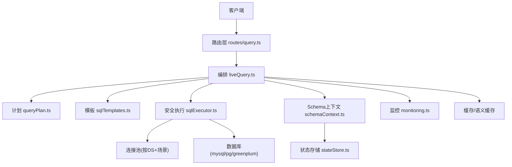
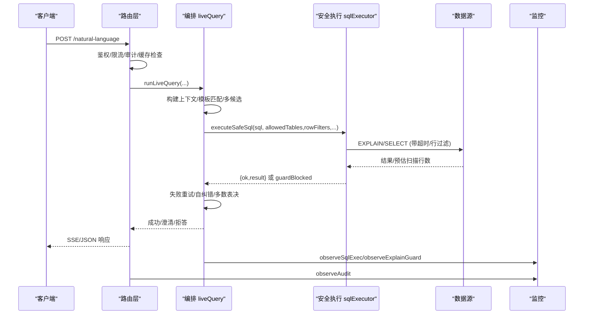
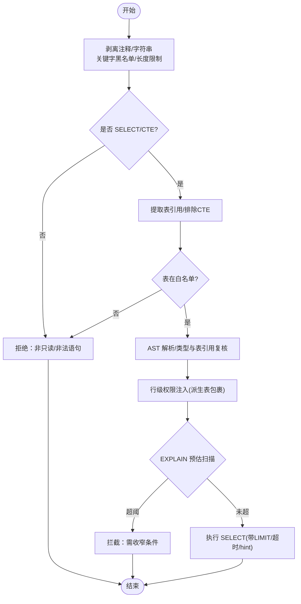
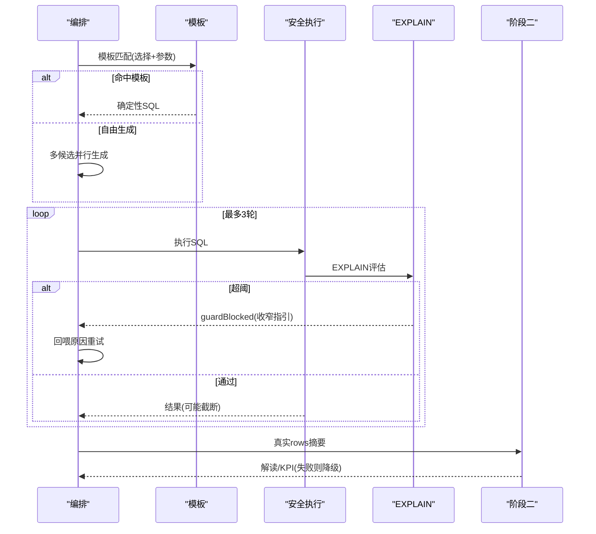
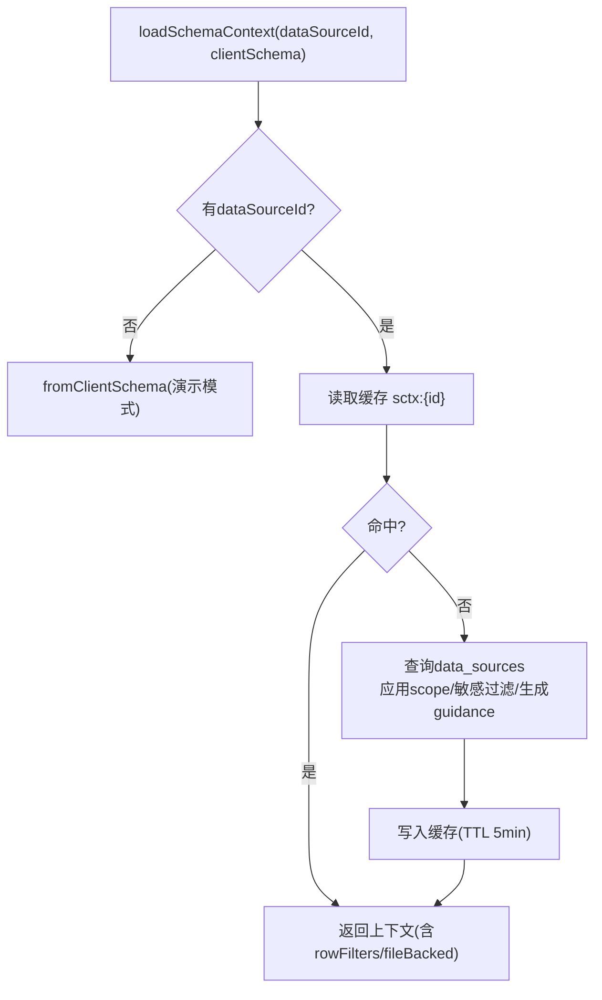
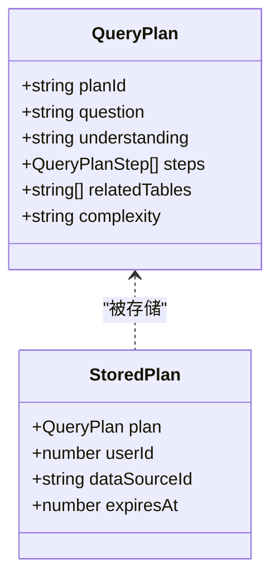
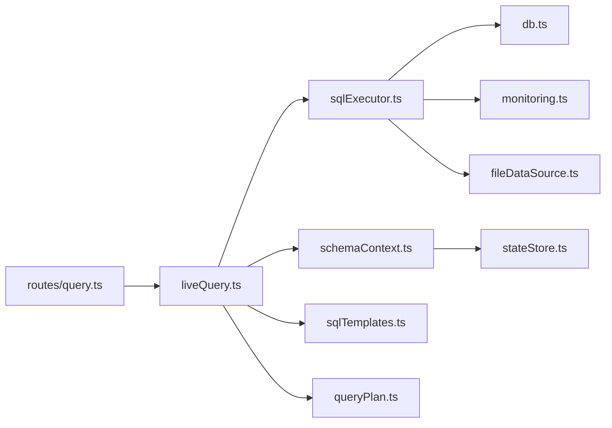

# 查询执行引擎

<cite>
**本文引用的文件**
- [sqlExecutor.ts](file://server/query/sqlExecutor.ts)
- [schemaContext.ts](file://server/query/schemaContext.ts)
- [sqlTemplates.ts](file://server/query/sqlTemplates.ts)
- [liveQuery.ts](file://server/query/liveQuery.ts)
- [queryPlan.ts](file://server/query/queryPlan.ts)
- [scope.ts](file://server/query/scope.ts)
- [queryGuard.ts](file://server/query/queryGuard.ts)
- [db.ts](file://server/infra/db.ts)
- [stateStore.ts](file://server/infra/stateStore.ts)
- [metrics.ts](file://server/query/metrics.ts)
- [monitoring.ts](file://server/infra/monitoring.ts)
- [fileDataSource.ts](file://server/query/fileDataSource.ts)
- [schemaTypes.ts](file://server/query/schemaTypes.ts)
- [routes/query.ts](file://server/routes/query.ts)
</cite>

## 目录
1. [简介](#简介)
2. [项目结构](#项目结构)
3. [核心组件](#核心组件)
4. [架构总览](#架构总览)
5. [详细组件分析](#详细组件分析)
6. [依赖关系分析](#依赖关系分析)
7. [性能考量](#性能考量)
8. [故障排查指南](#故障排查指南)
9. [结论](#结论)
10. [附录](#附录)

## 简介
本文件面向“智能问数据分析系统”的查询执行引擎，系统性说明从自然语言到 SQL 生成、安全校验、执行计划与 EXPLAIN 防线、多数据源路由、事务与超时控制、错误重试、慢查询与监控、SQL 注入防护、权限验证、结果集处理等全链路实现。文档同时覆盖 Schema 上下文管理、元数据缓存机制、查询模板系统与多阶段编排（含计划模式与深度分析链）。

## 项目结构
查询执行引擎位于 server/query 与 server/infra 下，围绕以下关键模块协作：
- 入口与编排：routes/query.ts 负责鉴权、限流、SSE、审计、缓存命中与降级；liveQuery.ts 负责两阶段 LLM 编排与安全执行调用。
- 安全执行层：sqlExecutor.ts 提供 SELECT-only 校验、表白名单、敏感列拒绝、AST 复核、行级权限注入、EXPLAIN 防线、连接池与方言适配。
- 上下文与缓存：schemaContext.ts 加载并缓存 Schema、Scope、敏感列过滤、行级权限映射；stateStore.ts 提供内存/Redis 状态存储。
- 模板与指标：sqlTemplates.ts 提供确定性模板拼装；metrics.ts 提供语义指标层与统一指标查询。
- 范围与防护：scope.ts 定义 DataScope 与行级权限谓词清洗；queryGuard.ts 提供输入净化与敏感列特征过滤。
- 基础设施：db.ts 维护应用库连接池与表结构；monitoring.ts 暴露 Prometheus 埋点；fileDataSource.ts 支持文件数据源落库真实执行。

图表来源
- [routes/query.ts:47-393](file://server/routes/query.ts#L47-L393)
- [liveQuery.ts:189-749](file://server/query/liveQuery.ts#L189-L749)
- [sqlExecutor.ts:734-832](file://server/query/sqlExecutor.ts#L734-L832)
- [schemaContext.ts:108-172](file://server/query/schemaContext.ts#L108-L172)
- [stateStore.ts:169-187](file://server/infra/stateStore.ts#L169-L187)
- [monitoring.ts:92-133](file://server/infra/monitoring.ts#L92-L133)

章节来源
- [routes/query.ts:47-393](file://server/routes/query.ts#L47-L393)
- [liveQuery.ts:189-749](file://server/query/liveQuery.ts#L189-L749)
- [sqlExecutor.ts:734-832](file://server/query/sqlExecutor.ts#L734-L832)
- [schemaContext.ts:108-172](file://server/query/schemaContext.ts#L108-L172)
- [stateStore.ts:169-187](file://server/infra/stateStore.ts#L169-L187)
- [monitoring.ts:92-133](file://server/infra/monitoring.ts#L92-L133)

## 核心组件
- 安全执行层（sqlExecutor.ts）
  - SELECT-only 校验、关键字黑名单、长度限制、单语句约束
  - AST 二道防线（node-sql-parser），CTE 名排除、表引用白名单校验
  - 行级权限注入（AST 包裹派生表），失败 fail-closed
  - EXPLAIN 防线（MySQL/PG 扫描行数估计阈值拦截）
  - 连接池分级（按 dataSourceId + 场景 interactive/chain/export），超时与容量公式化
  - MySQL MAX_EXECUTION_TIME hint 注入（含 WITH 链定位）
  - 文件数据源改道应用库执行（upl_* 物理表）
- 编排与两阶段（liveQuery.ts）
  - 阶段一：并行构建七路上下文（few-shot/RAG/外部知识/指标/反例/对话/铁律），模板优先，多候选 Self-Consistency
  - 执行：executeSafeSql 安全执行；失败回喂 LLM 重试（最多 3 次）
  - 阶段二：真实 rows 摘要回喂 LLM 解读，规则降级兜底
  - 澄清/拒答竞速返回；EXPLAIN 拦截仅给一次收窄机会
- Schema 上下文（schemaContext.ts）
  - 落库 schema → scope 白名单 → 敏感列过滤 → 摘要生成，5 分钟 TTL 缓存（Redis 共享）
  - 返回 dsType/status/allowIntrospection/rowFilters/fileBacked
- 查询计划（queryPlan.ts）
  - LLM 生成可执行分析计划（不执行），一次性消费防重放，过期清理
- 模板系统（sqlTemplates.ts）
  - 同比/环比/TOP-N/交叉表等参数化模板，LLM 选择 + 服务端确定性拼装
- 范围与防护（scope.ts, queryGuard.ts）
  - DataScope 表/列/行级权限谓词清洗；输入净化、注入检测、历史净化
- 指标层（metrics.ts）
  - 语义指标定义、审批版本化、统一指标查询 SQL 生成、金额单位换算
- 基础设施（db.ts, stateStore.ts, monitoring.ts, fileDataSource.ts）
  - 应用库连接池、表初始化；内存/Redis 状态存储；Prometheus 埋点；文件数据源落库真实执行

章节来源
- [sqlExecutor.ts:1-832](file://server/query/sqlExecutor.ts#L1-L832)
- [liveQuery.ts:189-749](file://server/query/liveQuery.ts#L189-L749)
- [schemaContext.ts:1-172](file://server/query/schemaContext.ts#L1-L172)
- [queryPlan.ts:1-184](file://server/query/queryPlan.ts#L1-L184)
- [sqlTemplates.ts:1-119](file://server/query/sqlTemplates.ts#L1-L119)
- [scope.ts:1-101](file://server/query/scope.ts#L1-L101)
- [queryGuard.ts:1-101](file://server/query/queryGuard.ts#L1-L101)
- [metrics.ts:1-531](file://server/query/metrics.ts#L1-L531)
- [db.ts:1-817](file://server/infra/db.ts#L1-L817)
- [stateStore.ts:1-219](file://server/infra/stateStore.ts#L1-L219)
- [monitoring.ts:1-153](file://server/infra/monitoring.ts#L1-L153)
- [fileDataSource.ts:1-208](file://server/query/fileDataSource.ts#L1-L208)

## 架构总览
查询执行引擎采用“编排 + 安全执行 + 上下文缓存 + 监控审计”的分层架构。路由层完成鉴权、限流、SSE、审计与缓存命中；编排层负责 LLM 提示组装、多候选生成、模板匹配与结果表决；安全执行层确保只读、白名单、行级权限、EXPLAIN 防线与超时；上下文层提供 Schema/Scope/敏感列过滤与缓存；监控层提供 Prometheus 指标与审计落账。

图表来源
- [routes/query.ts:47-393](file://server/routes/query.ts#L47-L393)
- [liveQuery.ts:189-749](file://server/query/liveQuery.ts#L189-L749)
- [sqlExecutor.ts:629-662](file://server/query/sqlExecutor.ts#L629-L662)
- [monitoring.ts:92-133](file://server/infra/monitoring.ts#L92-L133)

## 详细组件分析

### 安全执行层（sqlExecutor.ts）
- 安全校验流程
  - 剥离注释与字符串后做关键字黑名单与长度限制
  - 仅允许 SELECT 开头（WITH CTE 放行交由 AST 强校验）
  - 提取 FROM/JOIN 表引用，排除 CTE 名，校验在白名单内
  - AST 解析失败时 fail-closed（针对 WITH）或 fallback（非 WITH）
  - 敏感列整词匹配拒绝
  - 强制 LIMIT clamping（MySQL/PG 差异处理）
- 行级权限注入
  - 通过 AST 将受控表包裹为派生表 WHERE 子句，递归覆盖子查询/UNION/CTE
  - 注入失败 fail-closed
- EXPLAIN 防线
  - MySQL：FORMAT=JSON 兼容 rows_examined_per_scan/estimated_rows
  - PG：PLAN JSON 中 Scan 节点 Plan Rows 最大值
  - 超过阈值拦截并给出收窄建议（export 场景放宽 10 倍）
- 连接池与超时
  - 按 dataSourceId + 场景（interactive/chain/export）分级建池
  - 容量公式化（环境变量 DS_POOL_MAX/DS_POOL_* 优先）
  - 场景化超时（QUERY_TIMEOUT_*_MS）
  - MySQL 注入 MAX_EXECUTION_TIME hint（含 WITH 链定位）
- 文件数据源
  - upl_* 物理表在应用库执行，跳过 EXPLAIN 防线，保留驱动 timeout

图表来源
- [sqlExecutor.ts:169-387](file://server/query/sqlExecutor.ts#L169-L387)
- [sqlExecutor.ts:396-489](file://server/query/sqlExecutor.ts#L396-L489)
- [sqlExecutor.ts:531-662](file://server/query/sqlExecutor.ts#L531-L662)
- [sqlExecutor.ts:686-726](file://server/query/sqlExecutor.ts#L686-L726)
- [sqlExecutor.ts:118-153](file://server/query/sqlExecutor.ts#L118-L153)

章节来源
- [sqlExecutor.ts:169-387](file://server/query/sqlExecutor.ts#L169-L387)
- [sqlExecutor.ts:396-489](file://server/query/sqlExecutor.ts#L396-L489)
- [sqlExecutor.ts:531-662](file://server/query/sqlExecutor.ts#L531-L662)
- [sqlExecutor.ts:686-726](file://server/query/sqlExecutor.ts#L686-L726)
- [sqlExecutor.ts:118-153](file://server/query/sqlExecutor.ts#L118-L153)

### 编排与两阶段（liveQuery.ts）
- 阶段一
  - 并行构建七路上下文（few-shot/RAG/外部知识/指标/反例/对话/铁律）
  - 模板优先：LLM 选择模板 + 参数校验 + 确定性 SQL 拼装
  - 多候选并行生成（Self-Consistency 多数表决择优）
  - 数据自省（可选）：轻量真实执行确认取值后再最终生成
- 执行
  - 安全执行层（SELECT-only/白名单/行过滤/超时）
  - EXPLAIN 拦截标记：给 LLM 一次收窄机会（防空转）
- 阶段二
  - 真实 rows 摘要（采样+列统计）回喂 LLM 生成解读/KPI
  - LLM 异常时规则化降级解读
- 澄清/拒答
  - 首轮首个候选竞速判定，避免等待退化
- 中间表与深度分析
  - 复杂度评估触发清洗链（M3），引用 ait_* 中间表时改在应用库执行

图表来源
- [liveQuery.ts:221-327](file://server/query/liveQuery.ts#L221-L327)
- [liveQuery.ts:359-393](file://server/query/liveQuery.ts#L359-L393)
- [liveQuery.ts:396-628](file://server/query/liveQuery.ts#L396-L628)
- [liveQuery.ts:652-749](file://server/query/liveQuery.ts#L652-L749)

章节来源
- [liveQuery.ts:221-327](file://server/query/liveQuery.ts#L221-L327)
- [liveQuery.ts:359-393](file://server/query/liveQuery.ts#L359-L393)
- [liveQuery.ts:396-628](file://server/query/liveQuery.ts#L396-L628)
- [liveQuery.ts:652-749](file://server/query/liveQuery.ts#L652-L749)

### Schema 上下文与元数据缓存（schemaContext.ts）
- 加载流程
  - 若 dataSourceId 为空：使用前端提交的 schema（演示模式）
  - 否则：读取 data_sources 记录，应用 scope 白名单与敏感列过滤，生成 guidance
  - 计算 rowFilters（tableId→实际表名映射），判断 fileBacked（已落物理表的文件型）
- 缓存策略
  - 键 sctx:{dataSourceId}，TTL 5 分钟
  - Redis 模式下跨实例共享；配置变更后 invalidateSchemaCache 广播失效
- 能力判定
  - isLiveCapableType：mysql/postgresql/greenplum 或 fileBacked=true 才走真实执行链路

图表来源
- [schemaContext.ts:108-172](file://server/query/schemaContext.ts#L108-L172)
- [schemaContext.ts:50-55](file://server/query/schemaContext.ts#L50-L55)
- [schemaContext.ts:75-81](file://server/query/schemaContext.ts#L75-L81)

章节来源
- [schemaContext.ts:108-172](file://server/query/schemaContext.ts#L108-L172)
- [schemaContext.ts:50-55](file://server/query/schemaContext.ts#L50-L55)
- [schemaContext.ts:75-81](file://server/query/schemaContext.ts#L75-L81)

### 查询计划（queryPlan.ts）
- 生成：LLM 输出结构化计划（understanding/steps/relatedTables/complexity），首次失败纠偏重试一次
- 存储：内存 Map（10 分钟 TTL）或 Redis（setEx），惰性清理过期条目
- 消费：consumePlan 原子 GETDEL（Redis）或删除（内存），校验 userId/dataSourceId/过期时间，防重放

图表来源
- [queryPlan.ts:13-34](file://server/query/queryPlan.ts#L13-L34)
- [queryPlan.ts:56-100](file://server/query/queryPlan.ts#L56-L100)
- [queryPlan.ts:162-184](file://server/query/queryPlan.ts#L162-L184)

章节来源
- [queryPlan.ts:56-100](file://server/query/queryPlan.ts#L56-L100)
- [queryPlan.ts:162-184](file://server/query/queryPlan.ts#L162-L184)

### 查询模板系统（sqlTemplates.ts）
- 模板集合：同比、环比、TOP-N 占比、条件聚合交叉表
- 参数校验：validateTemplateParams 严格校验必填字段与类型
- 生成 SQL：buildSql 根据 dialect（mysql/pg）拼接，保证零偏差确定性输出
- 集成：liveQuery 阶段一优先尝试模板匹配，命中则直接执行（仍经安全层校验）

章节来源
- [sqlTemplates.ts:1-119](file://server/query/sqlTemplates.ts#L1-L119)
- [liveQuery.ts:359-393](file://server/query/liveQuery.ts#L359-L393)

### 多数据源路由与文件数据源（sqlExecutor.ts, fileDataSource.ts）
- 路由规则
  - mysql → mysql2 驱动；postgresql/greenplum → pg 驱动
  - 文件数据源（csv/json/excel）→ 落应用库 upl_* 物理表，按 MySQL 方言校验并在应用库执行
- 文件数据源处理
  - 解析 CSV/Excel/JSON，表头安全化与敏感列剔除，类型推断，批量参数化写入
  - 物理表名前缀白名单校验，级联删除

章节来源
- [sqlExecutor.ts:24-32](file://server/query/sqlExecutor.ts#L24-L32)
- [sqlExecutor.ts:767-800](file://server/query/sqlExecutor.ts#L767-L800)
- [fileDataSource.ts:46-58](file://server/query/fileDataSource.ts#L46-L58)
- [fileDataSource.ts:78-99](file://server/query/fileDataSource.ts#L78-L99)
- [fileDataSource.ts:183-208](file://server/query/fileDataSource.ts#L183-L208)

### 事务处理与超时控制
- 连接级超时
  - PG：statement_timeout 按场景池设置；connectionTimeoutMillis 连接超时
  - MySQL：connectTimeout 与 multipleStatements=false；MAX_EXECUTION_TIME hint 注入
- 场景化超时
  - interactive/chain/export 分别默认 15s/120s/60s，可通过环境变量覆盖
- 事务
  - 当前实现以单次 SELECT 为主，无显式事务封装；如需事务可在上层封装并使用对应驱动的事务 API

章节来源
- [sqlExecutor.ts:686-726](file://server/query/sqlExecutor.ts#L686-L726)
- [sqlExecutor.ts:94-109](file://server/query/sqlExecutor.ts#L94-L109)
- [sqlExecutor.ts:118-153](file://server/query/sqlExecutor.ts#L118-L153)

### 错误重试与自愈机制
- LLM 重试
  - 阶段一失败（契约校验/执行失败/结果异常）回喂原因重试，最多 3 次
  - 计划模式：首次结构校验失败纠偏重试一次
- EXPLAIN 拦截自愈
  - 仅给一次收窄机会（guardBlocked），二次拦截终止（防空转）
- 模板回退
  - 模板路径失败清空模板，下一 attempt 回退自由生成

章节来源
- [liveQuery.ts:396-628](file://server/query/liveQuery.ts#L396-L628)
- [queryPlan.ts:162-184](file://server/query/queryPlan.ts#L162-L184)

### 慢查询分析与执行计划优化
- 慢查询识别
  - 路由层对 execute-sql 端点记录时长与行数，>3s 或 >10万行标记 SLOW
- EXPLAIN 防线
  - 预估扫描行数超阈值拦截，提示增加筛选条件
- 指标层优化
  - 统一指标查询按白名单维度 GROUP BY，金额单位换算，减少自由发挥导致的口径漂移

章节来源
- [routes/query.ts:596-624](file://server/routes/query.ts#L596-L624)
- [sqlExecutor.ts:531-662](file://server/query/sqlExecutor.ts#L531-L662)
- [metrics.ts:140-162](file://server/query/metrics.ts#L140-L162)

### SQL 注入防护与权限验证
- 输入净化
  - sanitizeQuestion：控制字符过滤、注入特征拒绝、500 字截断
  - sanitizeHistory：仅保留 user 消息，逐条注入检测，最多 5 轮
- SQL 安全
  - 关键字黑名单、单语句、INTO 拒绝、AST 复核、表白名单、敏感列拒绝
  - 行级权限注入（AST 包裹），失败 fail-closed
- 权限验证
  - 路由层角色校验与数据源 ACL；数据源级 AI 开关（disconnected 拒绝）
  - 计划模式一次性消费防重放

章节来源
- [queryGuard.ts:27-69](file://server/query/queryGuard.ts#L27-L69)
- [sqlExecutor.ts:155-387](file://server/query/sqlExecutor.ts#L155-L387)
- [sqlExecutor.ts:396-489](file://server/query/sqlExecutor.ts#L396-L489)
- [routes/query.ts:47-203](file://server/routes/query.ts#L47-L203)
- [queryPlan.ts:73-100](file://server/query/queryPlan.ts#L73-L100)

### 结果集处理
- 规范化与脱敏
  - normalizeQueryResult 统一结果结构；maskRows 按角色脱敏（VIEWER/ANALYST 掩码，ADMIN 豁免）
- 截断与标注
  - MAX_ROWS 截断（默认 10 万），truncated 标志；文件数据源行/列上限截断
- 图表配置
  - rectifyChartKeys/buildColumnNames/yAxisNames 中文化图例与轴名

章节来源
- [routes/query.ts:279-314](file://server/routes/query.ts#L279-L314)
- [routes/query.ts:596-624](file://server/routes/query.ts#L596-L624)
- [fileDataSource.ts:126-136](file://server/query/fileDataSource.ts#L126-L136)
- [liveQuery.ts:633-650](file://server/query/liveQuery.ts#L633-L650)

## 依赖关系分析
- 低耦合高内聚
  - 安全执行层独立于编排逻辑，可被多处复用（自然语言/SQL重跑/下钻）
  - 上下文与缓存解耦，支持多实例共享（Redis）
- 直接依赖
  - liveQuery 依赖 sqlExecutor、schemaContext、sqlTemplates、metrics、queryPlan
  - sqlExecutor 依赖 db、monitoring、llmClient（用于自愈）、fileDataSource
  - 路由层依赖所有上层模块，承担鉴权/限流/审计/缓存/SSE
- 潜在循环
  - 模块间通过接口与 re-export 解耦，未见循环导入迹象

图表来源
- [routes/query.ts:17-42](file://server/routes/query.ts#L17-L42)
- [liveQuery.ts:16-73](file://server/query/liveQuery.ts#L16-L73)
- [sqlExecutor.ts:11-21](file://server/query/sqlExecutor.ts#L11-L21)
- [schemaContext.ts:8-15](file://server/query/schemaContext.ts#L8-L15)

章节来源
- [routes/query.ts:17-42](file://server/routes/query.ts#L17-L42)
- [liveQuery.ts:16-73](file://server/query/liveQuery.ts#L16-L73)
- [sqlExecutor.ts:11-21](file://server/query/sqlExecutor.ts#L11-L21)
- [schemaContext.ts:8-15](file://server/query/schemaContext.ts#L8-L15)

## 性能考量
- 连接池容量公式化
  - 应用库：APP_POOL_MAX 或 EXPECTED_CONCURRENT_USERS/2，clamp [10,50]
  - 数据源池：DS_POOL_MAX 或 EXPECTED_CONCURRENT_USERS/4，clamp [3,20]；场景细分配额
- 超时与限额
  - 场景化超时（interactive/chain/export）；MAX_ROWS 截断防 OOM
- 缓存命中
  - L1 精确 + L2 语义缓存；演示模式同样命中，显著降低相似提问耗时
- EXPLAIN 防线
  - 提前拦截大扫描，保护数据源性能
- 监控与审计
  - Prometheus 指标（请求耗时、LLM 耗时/token、SQL 执行耗时、EXPLAIN 守卫）
  - 审计落账（status/endpoint/durationMs/executedSql/rowCount）

章节来源
- [db.ts:29-43](file://server/infra/db.ts#L29-L43)
- [sqlExecutor.ts:44-109](file://server/query/sqlExecutor.ts#L44-L109)
- [sqlExecutor.ts:531-662](file://server/query/sqlExecutor.ts#L531-L662)
- [monitoring.ts:19-78](file://server/infra/monitoring.ts#L19-L78)
- [routes/query.ts:205-223](file://server/routes/query.ts#L205-L223)

## 故障排查指南
- 常见错误与定位
  - SQL 被拒绝：检查关键字黑名单、表白名单、敏感列、单语句/长度限制
  - EXPLAIN 拦截：查看预估扫描行数与阈值，增加筛选条件
  - 行级权限注入失败：检查谓词合法性与 AST 包裹逻辑
  - 模板匹配失败：确认模板参数校验与 dialect 选择
  - 缓存未命中：检查 cacheKey 变体（model/amountUnit）与刷新标志
- 日志与监控
  - 审计日志：status 包含 DENIED_INPUT/DENIED_AUTH/CACHE/SUCCESS/FALLBACK/REFUSED
  - Prometheus：nl2sql_duration_seconds、sql_execute_duration_seconds、sql_explain_guard_total
- 恢复与降级
  - 演示模式：真实链路失败自动降级，返回 simulated 结果
  - 计划模式：plan 一次性消费，过期/越权需重新制定

章节来源
- [routes/query.ts:58-75](file://server/routes/query.ts#L58-L75)
- [routes/query.ts:205-223](file://server/routes/query.ts#L205-L223)
- [sqlExecutor.ts:155-387](file://server/query/sqlExecutor.ts#L155-L387)
- [sqlExecutor.ts:531-662](file://server/query/sqlExecutor.ts#L531-L662)
- [monitoring.ts:92-133](file://server/infra/monitoring.ts#L92-L133)

## 结论
该查询执行引擎通过“安全执行层 + 两阶段编排 + 上下文缓存 + 监控审计”的体系，实现了高可用、高安全的 NL2SQL 能力。其核心优势包括：
- 多层安全防护（输入净化、SQL 白名单、AST 复核、行级权限、EXPLAIN 防线）
- 可扩展的上下文与缓存（Schema/Scope/敏感列过滤，Redis 共享）
- 确定性模板与指标层（降低 LLM 偏差，保障口径一致）
- 精细化资源控制（连接池/超时/限额）与可观测性（监控/审计/慢查询）
建议在复杂场景下结合模板与指标层优先，配合 EXPLAIN 防线与场景化超时，以获得稳定高效的查询体验。

## 附录
- 关键类型与常量
  - SqlDialect：'mysql' | 'pg'
  - QueryScenario：'interactive' | 'chain' | 'export'
  - MAX_ROWS：100000（可配置）
  - 场景超时：interactive 15s / chain 120s / export 60s（可环境变量覆盖）
- 环境变量参考
  - DS_POOL_MAX / DS_POOL_INTERACTIVE / DS_POOL_CHAIN / DS_POOL_EXPORT
  - QUERY_TIMEOUT_INTERACTIVE_MS / QUERY_TIMEOUT_CHAIN_MS / QUERY_TIMEOUT_EXPORT_MS
  - SQL_EXPLAIN_MAX_ROWS（0=关闭防线）
  - REDIS_URL（启用外置状态存储）
  - APP_POOL_MAX / EXPECTED_CONCURRENT_USERS

章节来源
- [sqlExecutor.ts:24-109](file://server/query/sqlExecutor.ts#L24-L109)
- [stateStore.ts:169-187](file://server/infra/stateStore.ts#L169-L187)
- [db.ts:29-43](file://server/infra/db.ts#L29-L43)