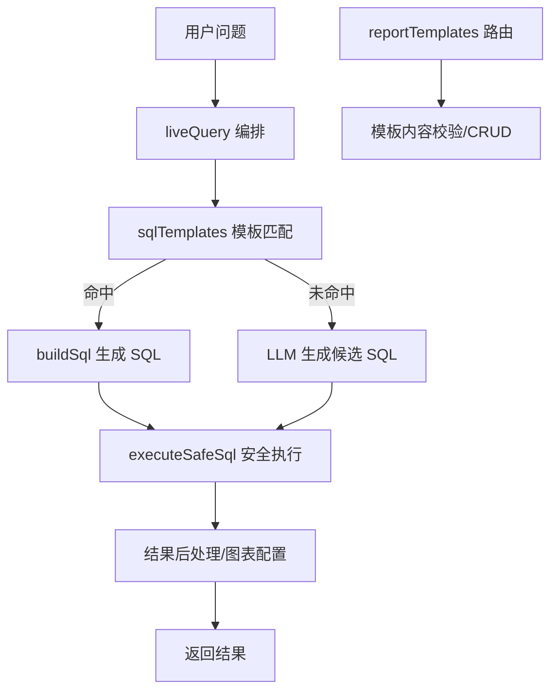
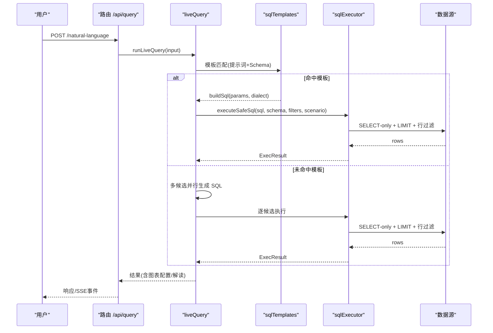
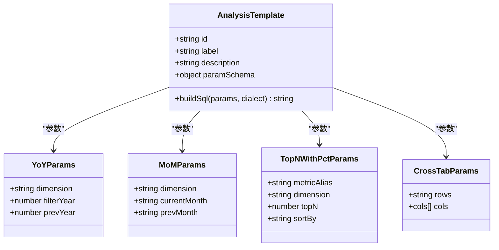
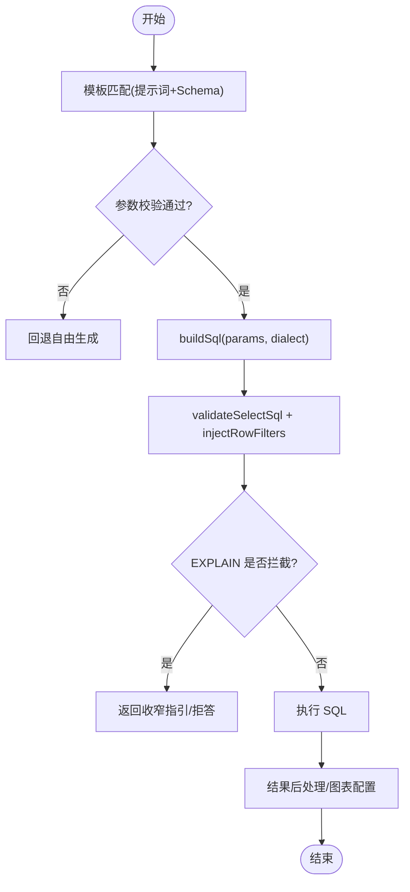
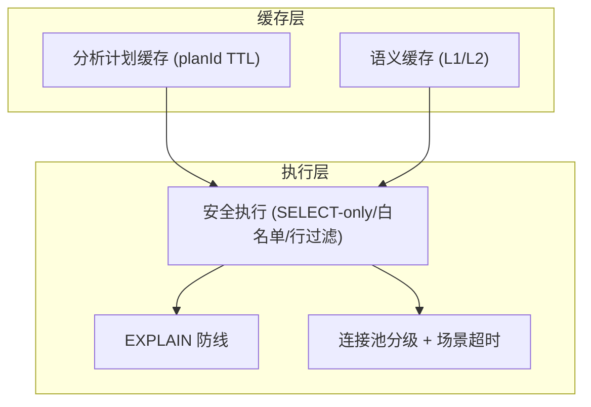
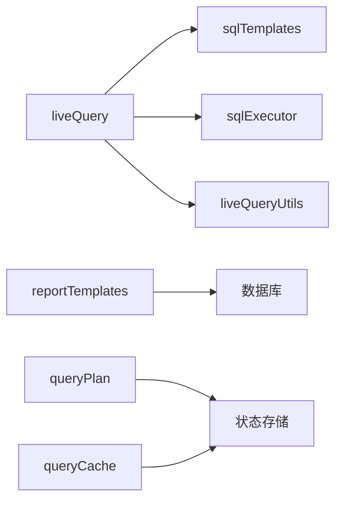

# 查询模板系统

<cite>
**本文引用的文件**
- [server/query/sqlTemplates.ts](file://server/query/sqlTemplates.ts)
- [server/query/liveQuery.ts](file://server/query/liveQuery.ts)
- [server/query/sqlExecutor.ts](file://server/query/sqlExecutor.ts)
- [server/routes/reportTemplates.ts](file://server/routes/reportTemplates.ts)
- [server/query/queryPlan.ts](file://server/query/queryPlan.ts)
- [server/query/queryCache.ts](file://server/query/queryCache.ts)
- [server/query/liveQueryUtils.ts](file://server/query/liveQueryUtils.ts)
- [server/routes/query.ts](file://server/routes/query.ts)
- [server/query/sqlTemplates.test.ts](file://server/query/sqlTemplates.test.ts)
</cite>

## 目录
1. [简介](#简介)
2. [项目结构](#项目结构)
3. [核心组件](#核心组件)
4. [架构总览](#架构总览)
5. [详细组件分析](#详细组件分析)
6. [依赖关系分析](#依赖关系分析)
7. [性能考虑](#性能考虑)
8. [故障排查指南](#故障排查指南)
9. [结论](#结论)
10. [附录](#附录)

## 简介
本文件系统性地文档化“查询模板系统”，覆盖 SQL 模板设计模式（参数化查询、动态条件构建、聚合函数模板）、模板引擎实现（模板解析、变量替换、语法检查）、预定义模板库（常用查询模式、分析模板、报表模板）、版本与兼容性管理策略、性能优化（查询计划缓存、执行路径优化），以及开发指南（最佳实践、调试方法、测试用例）和具体使用场景。

该系统在智能问数链路中，优先通过“模板选择 + 参数填充”的确定性方式拼装 SQL，避免本地模型生成复杂 SQL 的不稳定性；未命中模板时回退到自由生成并走安全执行层。同时提供报告模板管理能力，支持结构化模板内容的校验与持久化。

## 项目结构
围绕查询模板系统的核心代码主要分布在 server/query 与 server/routes 下：
- 模板定义与参数校验：server/query/sqlTemplates.ts
- 模板匹配与编排集成：server/query/liveQuery.ts
- 安全执行与方言适配：server/query/sqlExecutor.ts
- 报告模板管理路由：server/routes/reportTemplates.ts
- 分析计划与存储：server/query/queryPlan.ts
- 语义缓存与性能优化：server/query/queryCache.ts
- 结果后处理与工具：server/query/liveQueryUtils.ts
- 入口路由与上下文装配：server/routes/query.ts
- 模板单元测试：server/query/sqlTemplates.test.ts

**图示来源**
- [server/query/liveQuery.ts:359-393](file://server/query/liveQuery.ts#L359-L393)
- [server/query/sqlTemplates.ts:42-89](file://server/query/sqlTemplates.ts#L42-L89)
- [server/query/sqlExecutor.ts:734-789](file://server/query/sqlExecutor.ts#L734-L789)
- [server/routes/reportTemplates.ts:44-67](file://server/routes/reportTemplates.ts#L44-L67)

**章节来源**
- [server/query/sqlTemplates.ts:1-119](file://server/query/sqlTemplates.ts#L1-L119)
- [server/query/liveQuery.ts:189-393](file://server/query/liveQuery.ts#L189-L393)
- [server/query/sqlExecutor.ts:291-387](file://server/query/sqlExecutor.ts#L291-L387)
- [server/routes/reportTemplates.ts:1-253](file://server/routes/reportTemplates.ts#L1-L253)

## 核心组件
- 模板接口与可用模板集合：AnalysisTemplate、AVAILABLE_TEMPLATES
- 模板参数校验：validateTemplateParams
- 模板匹配与注入：liveQuery 中的模板选择提示词与参数校验流程
- 安全执行层：validateSelectSql、injectRowFilters、EXPLAIN 防线、LIMIT 强制、方言差异处理
- 报告模板管理：模板内容 JSON 校验、CRUD 路由、审计日志
- 分析计划：generateQueryPlan、storePlan、consumePlan
- 语义缓存：getCachedQuery/setCachedQuery/invalidateQueryCache
- 结果后处理：金额单位、列统计、图表轴键矫正、中文表头兜底

**章节来源**
- [server/query/sqlTemplates.ts:10-16](file://server/query/sqlTemplates.ts#L10-L16)
- [server/query/sqlTemplates.ts:91-118](file://server/query/sqlTemplates.ts#L91-L118)
- [server/query/liveQuery.ts:359-393](file://server/query/liveQuery.ts#L359-L393)
- [server/query/sqlExecutor.ts:291-387](file://server/query/sqlExecutor.ts#L291-L387)
- [server/routes/reportTemplates.ts:44-67](file://server/routes/reportTemplates.ts#L44-L67)
- [server/query/queryPlan.ts:117-183](file://server/query/queryPlan.ts#L117-L183)
- [server/query/queryCache.ts:22-34](file://server/query/queryCache.ts#L22-L34)
- [server/query/liveQueryUtils.ts:11-29](file://server/query/liveQueryUtils.ts#L11-L29)

## 架构总览
查询模板系统在智能问数主链路中作为“确定性 SQL 生成”的优先路径，结合 LLM 自由生成与安全执行层，形成高可靠、可观测、可回退的端到端能力。

**图示来源**
- [server/routes/query.ts:47-200](file://server/routes/query.ts#L47-L200)
- [server/query/liveQuery.ts:359-393](file://server/query/liveQuery.ts#L359-L393)
- [server/query/sqlExecutor.ts:734-789](file://server/query/sqlExecutor.ts#L734-L789)

## 详细组件分析

### 模板设计与参数化查询
- 模板类型与参数结构：AnalysisTemplate 定义了 id、label、description、paramSchema、buildSql(dialect?)，确保每个模板具备元信息与确定性 SQL 构建能力。
- 预定义模板：
  - 同比对比：year_over_year，按年维度 LEFT JOIN 派生表计算同期数据。
  - 环比对比：month_over_month，按月范围聚合后 JOIN。
  - TOP-N 占比：top_n_with_pct，窗口函数排名与合计占比计算。
  - 条件聚合交叉表：conditional_agg_cross_tab，CASE WHEN + SUM 横向展开多维度指标。
- 参数校验：validateTemplateParams 对每个模板进行字段存在性、类型与取值范围校验，非法参数直接拒绝，防止 SQL 注入或越界拼接。

**图示来源**
- [server/query/sqlTemplates.ts:10-16](file://server/query/sqlTemplates.ts#L10-L16)
- [server/query/sqlTemplates.ts:18-40](file://server/query/sqlTemplates.ts#L18-L40)

**章节来源**
- [server/query/sqlTemplates.ts:42-89](file://server/query/sqlTemplates.ts#L42-L89)
- [server/query/sqlTemplates.ts:91-118](file://server/query/sqlTemplates.ts#L91-L118)

### 模板引擎实现：解析、变量替换、语法检查
- 模板解析：liveQuery 构造“模板选择提示词”，将可用模板清单与 Schema 注入，由 LLM 输出 templateId 与 params。
- 变量替换：validateTemplateParams 严格校验参数后，调用对应模板的 buildSql(params, dialect) 生成 SQL；dialect 根据数据源类型切换 mysql/pg。
- 语法检查：生成的 SQL 进入 executeSafeSql 进行结构安全校验（SELECT-only、白名单、敏感列拒绝、单语句、强制 LIMIT、CTE 支持等），并通过 AST 复核与 EXPLAIN 防线评估扫描量。

**图示来源**
- [server/query/liveQuery.ts:359-393](file://server/query/liveQuery.ts#L359-L393)
- [server/query/sqlExecutor.ts:291-387](file://server/query/sqlExecutor.ts#L291-L387)
- [server/query/sqlExecutor.ts:629-662](file://server/query/sqlExecutor.ts#L629-L662)

**章节来源**
- [server/query/liveQuery.ts:359-393](file://server/query/liveQuery.ts#L359-L393)
- [server/query/sqlExecutor.ts:291-387](file://server/query/sqlExecutor.ts#L291-L387)

### 预定义模板库：常用查询模式、分析模板、报表模板
- 常用查询模式：同比、环比、TOP-N 占比、条件聚合交叉表，覆盖常见业务分析场景。
- 分析模板：以 AnalysisTemplate 为统一抽象，便于扩展新模板（新增 id、参数结构、buildSql）。
- 报表模板：reportTemplates 路由提供模板内容（JSON 结构 sections）的 CRUD 与校验，支持预设模板保护与审计记录。

**章节来源**
- [server/query/sqlTemplates.ts:42-89](file://server/query/sqlTemplates.ts#L42-L89)
- [server/routes/reportTemplates.ts:44-67](file://server/routes/reportTemplates.ts#L44-L67)
- [server/routes/reportTemplates.ts:84-132](file://server/routes/reportTemplates.ts#L84-L132)
- [server/routes/reportTemplates.ts:134-203](file://server/routes/reportTemplates.ts#L134-L203)
- [server/routes/reportTemplates.ts:205-250](file://server/routes/reportTemplates.ts#L205-L250)

### 模板版本管理与迁移策略
- 向后兼容：模板通过 id 标识，新增模板不影响既有调用；参数校验保证旧参数不被误用。
- 迁移策略：当模板参数结构变化时，可通过 validateTemplateParams 逐步放宽/收紧校验，并在 liveQuery 中增加降级逻辑（如未命中模板回退自由生成）。
- 灰度发布：可在 liveQuery 中基于环境或请求特征控制模板启用比例（例如仅对部分数据源启用新模板），配合 queryCache 的 variant 区分不同模型/口径的缓存键，避免串扰。

说明：当前仓库未包含显式的模板版本字段与迁移脚本，建议在生产环境中引入版本字段与变更日志，并结合路由层开关实现灰度。

**章节来源**
- [server/query/sqlTemplates.ts:91-118](file://server/query/sqlTemplates.ts#L91-L118)
- [server/query/liveQuery.ts:359-393](file://server/query/liveQuery.ts#L359-L393)
- [server/query/queryCache.ts:30-34](file://server/query/queryCache.ts#L30-L34)

### 模板性能优化：查询计划缓存、执行路径优化
- 查询计划缓存：queryPlan 支持内存/Redis 存储，TTL 10 分钟，一次性消费防重放，减少重复规划开销。
- 语义缓存：queryCache 提供 L1 精确匹配与 L2 embedding 语义命中，默认阈值 0.95，避免重复触发昂贵 LLM 链路。
- 执行路径优化：
  - 多候选并行生成与多数表决择优，降低失败重试成本。
  - 行级权限注入与 EXPLAIN 防线提前拦截大扫描查询。
  - MySQL MAX_EXECUTION_TIME hint 与 PG statement_timeout 双保险。
  - 连接池分级与场景超时（interactive/chain/export）隔离资源。

**图示来源**
- [server/query/queryPlan.ts:56-100](file://server/query/queryPlan.ts#L56-L100)
- [server/query/queryCache.ts:43-90](file://server/query/queryCache.ts#L43-L90)
- [server/query/sqlExecutor.ts:686-726](file://server/query/sqlExecutor.ts#L686-L726)
- [server/query/sqlExecutor.ts:629-662](file://server/query/sqlExecutor.ts#L629-L662)

**章节来源**
- [server/query/queryPlan.ts:56-100](file://server/query/queryPlan.ts#L56-L100)
- [server/query/queryCache.ts:43-90](file://server/query/queryCache.ts#L43-L90)
- [server/query/sqlExecutor.ts:686-726](file://server/query/sqlExecutor.ts#L686-L726)

### 模板开发指南：最佳实践、调试方法、测试用例
- 最佳实践：
  - 使用参数化模板，避免字符串拼接风险；buildSql 中仅拼接受控参数。
  - 明确 dialect 支持（mysql/pg），必要时在 buildSql 中做方言分支。
  - 参数校验严格，非法输入快速失败。
  - 模板描述清晰，便于 LLM 选择与前端展示。
- 调试方法：
  - 利用 liveQuery 的 onTrace 回调记录模板命中与执行步骤。
  - 通过 executeSafeSql 的 finalSql 与 astFallback 标记定位安全层行为。
  - 使用 EXPLAIN 返回值判断扫描量与执行计划。
- 测试用例：
  - 模板清单与字段完整性断言。
  - 参数校验的正反例覆盖（有效/缺失/非法值）。
  - 模板 SQL 生成结果的结构与边界条件验证。

**章节来源**
- [server/query/sqlTemplates.test.ts:7-63](file://server/query/sqlTemplates.test.ts#L7-L63)
- [server/query/liveQuery.ts:191-197](file://server/query/liveQuery.ts#L191-L197)
- [server/query/sqlExecutor.ts:734-789](file://server/query/sqlExecutor.ts#L734-L789)

### 具体模板示例与使用场景
- 同比对比：适用于年度业绩对比，按年份维度 LEFT JOIN 派生表计算本期与上期指标。
- 环比对比：适用于月度趋势分析，按月时间范围聚合后 JOIN。
- TOP-N 占比：适用于头部贡献分析，窗口函数排名与合计占比计算。
- 条件聚合交叉表：适用于多维指标横向展开，CASE WHEN + SUM 生成交叉视图。

使用场景：
- 智能问数：用户自然语言问题 → 模板匹配 → 确定性 SQL → 安全执行 → 图表与解读。
- 报表生成：报告模板内容（sections）经校验后持久化，供报表链路复用。

**章节来源**
- [server/query/sqlTemplates.ts:42-89](file://server/query/sqlTemplates.ts#L42-L89)
- [server/routes/reportTemplates.ts:44-67](file://server/routes/reportTemplates.ts#L44-L67)

## 依赖关系分析
- liveQuery 依赖 sqlTemplates 进行模板匹配与 SQL 生成，依赖 sqlExecutor 进行安全执行。
- reportTemplates 独立提供模板内容管理，与 liveQuery 解耦但可协同（报表链路复用模板内容）。
- queryPlan 与 queryCache 为可选增强能力，提升规划与缓存效率。
- liveQueryUtils 提供纯函数工具，零 IO 依赖，便于测试与复用。

**图示来源**
- [server/query/liveQuery.ts:16-43](file://server/query/liveQuery.ts#L16-L43)
- [server/routes/reportTemplates.ts:8-15](file://server/routes/reportTemplates.ts#L8-L15)
- [server/query/queryPlan.ts:7-11](file://server/query/queryPlan.ts#L7-L11)
- [server/query/queryCache.ts:8-10](file://server/query/queryCache.ts#L8-L10)

**章节来源**
- [server/query/liveQuery.ts:16-43](file://server/query/liveQuery.ts#L16-L43)
- [server/routes/reportTemplates.ts:8-15](file://server/routes/reportTemplates.ts#L8-L15)
- [server/query/queryPlan.ts:7-11](file://server/query/queryPlan.ts#L7-L11)
- [server/query/queryCache.ts:8-10](file://server/query/queryCache.ts#L8-L10)

## 性能考虑
- 模板优先：命中模板即确定性拼装 SQL，避免 LLM 生成不稳定带来的重试与失败。
- 多候选并行：未命中模板时并行生成多个候选，首个成功即可收工，其余继续收集用于多数表决。
- 安全执行前置：EXPLAIN 防线提前拦截大扫描查询，减少无效执行。
- 缓存策略：分析计划与语义缓存减少重复计算；variant 区分模型/口径，避免缓存污染。
- 连接池与超时：按场景分级配额与超时，保障交互体验与后台任务隔离。

[本节为通用性能讨论，不直接分析具体文件]

## 故障排查指南
- 模板参数错误：检查 validateTemplateParams 返回的 reason，确认必填字段与类型。
- 模板未命中：查看 liveQuery 的模板匹配提示词与 Schema 注入是否正确，确认 AVAILABLE_TEMPLATES 是否包含目标模板。
- 安全执行失败：检查 validateSelectSql 的拒绝原因（非 SELECT、白名单外表、敏感列、长度超限等），调整 SQL 或权限。
- EXPLAIN 拦截：根据 guardBlocked 标记与 reason 提示，增加筛选条件或缩小时间范围。
- 缓存命中异常：检查 cacheKey 的 variant 是否区分模型/口径，确认 invalidateQueryCache 是否在数据源变更后调用。

**章节来源**
- [server/query/sqlTemplates.ts:91-118](file://server/query/sqlTemplates.ts#L91-L118)
- [server/query/liveQuery.ts:359-393](file://server/query/liveQuery.ts#L359-L393)
- [server/query/sqlExecutor.ts:291-387](file://server/query/sqlExecutor.ts#L291-L387)
- [server/query/sqlExecutor.ts:629-662](file://server/query/sqlExecutor.ts#L629-L662)
- [server/query/queryCache.ts:92-114](file://server/query/queryCache.ts#L92-L114)

## 结论
查询模板系统通过“模板优先 + 安全执行 + 多候选择优 + 缓存增强”的组合策略，实现了高可靠、高性能的智能问数能力。预定义模板覆盖常见分析场景，参数化与校验机制确保 SQL 安全与稳定；报告模板管理提供结构化模板内容的持久化与复用。建议在后续迭代中引入显式版本管理与灰度发布机制，进一步提升可维护性与可控性。

[本节为总结性内容，不直接分析具体文件]

## 附录
- 关键接口与类型：
  - AnalysisTemplate：模板抽象，包含元信息与 buildSql。
  - LiveQueryInput：问数入参，包含问题、历史、Schema、数据源、权限、回调等。
  - ExecOutcome：安全执行结果，包含成功/失败与守卫拦截标记。
- 环境变量：
  - DS_POOL_MAX、DS_POOL_INTERACTIVE/CHAIN/EXPORT：连接池容量。
  - QUERY_TIMEOUT_INTERACTIVE_MS/CHAIN_MS/EXPORT_MS：场景超时。
  - SQL_EXPLAIN_MAX_ROWS：EXPLAIN 防线阈值。
  - SEMANTIC_CACHE_THRESHOLD：语义缓存相似度阈值。
  - QUERY_CACHE_TTL_MINUTES：缓存 TTL。

**章节来源**
- [server/query/sqlTemplates.ts:10-16](file://server/query/sqlTemplates.ts#L10-L16)
- [server/query/liveQuery.ts:78-113](file://server/query/liveQuery.ts#L78-L113)
- [server/query/sqlExecutor.ts:51-109](file://server/query/sqlExecutor.ts#L51-L109)
- [server/query/queryCache.ts:14-17](file://server/query/queryCache.ts#L14-L17)
- [server/query/queryCache.ts:126-129](file://server/query/queryCache.ts#L126-L129)