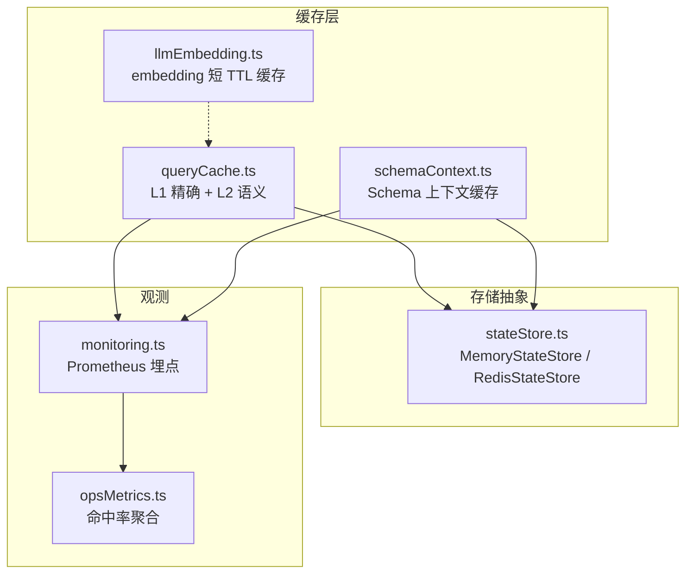
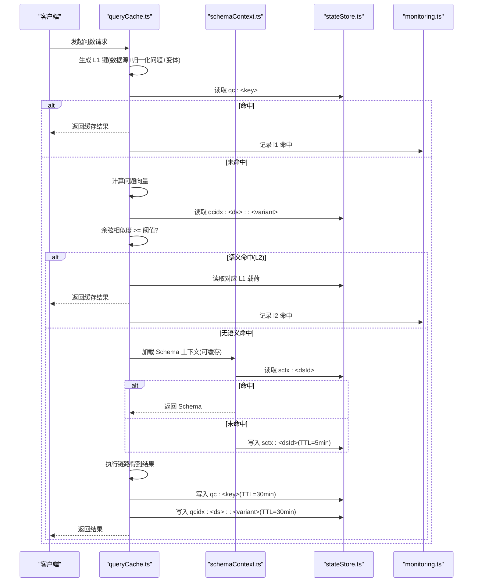
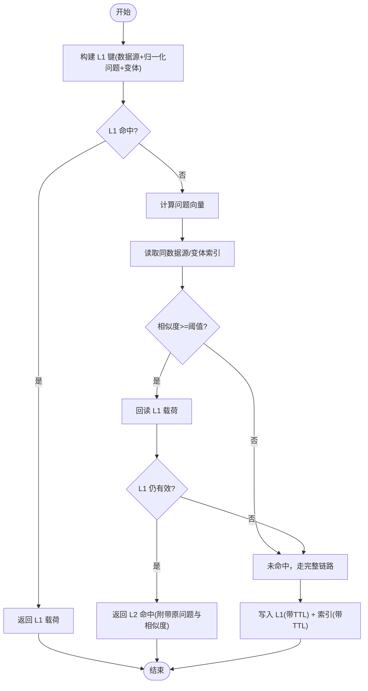
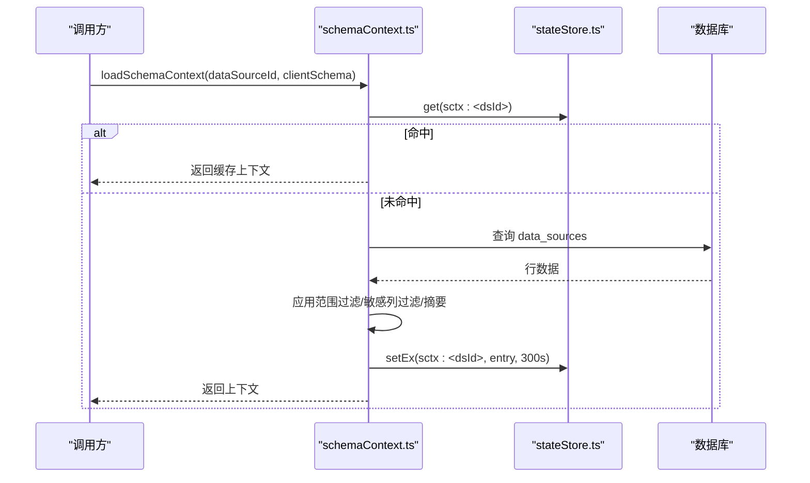
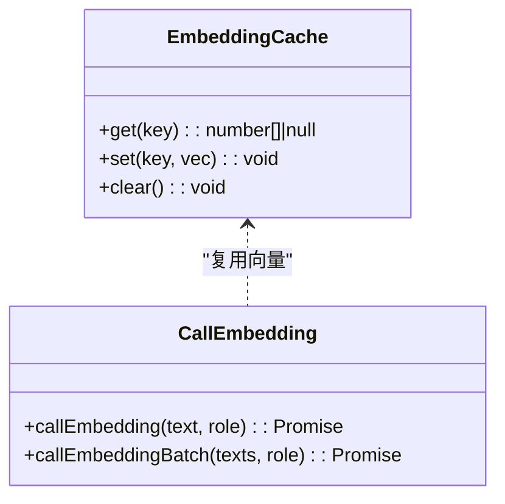
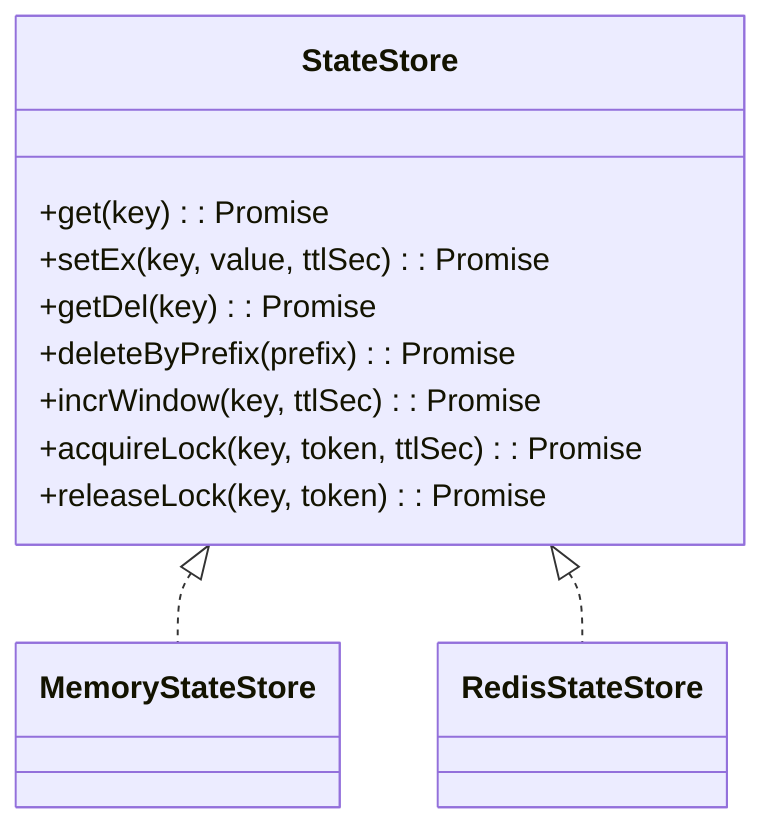
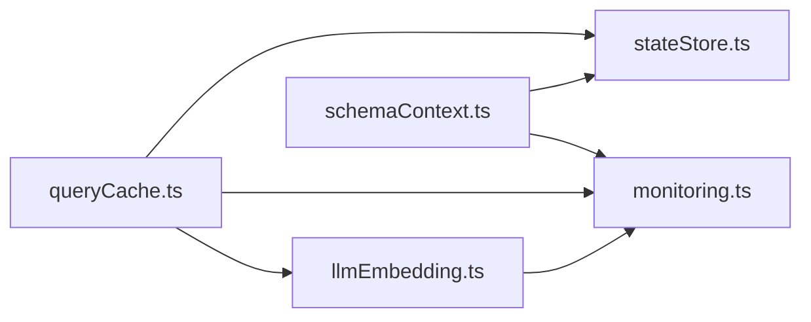

# 缓存策略

<cite>
**本文引用的文件**
- [server/query/queryCache.ts](file://server/query/queryCache.ts)
- [server/query/schemaContext.ts](file://server/query/schemaContext.ts)
- [server/llm/llmEmbedding.ts](file://server/llm/llmEmbedding.ts)
- [server/infra/stateStore.ts](file://server/infra/stateStore.ts)
- [server/infra/monitoring.ts](file://server/infra/monitoring.ts)
- [server/routes/opsMetrics.ts](file://server/routes/opsMetrics.ts)
- [server/query/queryCache.test.ts](file://server/query/queryCache.test.ts)
</cite>

## 目录
1. [简介](#简介)
2. [项目结构](#项目结构)
3. [核心组件](#核心组件)
4. [架构总览](#架构总览)
5. [详细组件分析](#详细组件分析)
6. [依赖关系分析](#依赖关系分析)
7. [性能与容量规划](#性能与容量规划)
8. [故障排查指南](#故障排查指南)
9. [结论](#结论)
10. [附录](#附录)

## 简介
本文件系统化梳理本项目的多级缓存策略，覆盖查询结果缓存、Schema 元数据缓存、LLM embedding 缓存机制；说明 Redis 集成与多实例共享、缓存键生成、TTL 管理、内存占用控制、失效策略、监控指标、预热与批量操作、异常恢复等。目标是帮助读者快速理解并安全地运维与扩展缓存体系。

## 项目结构
缓存相关代码主要分布在以下模块：
- 问数结果缓存与语义缓存：server/query/queryCache.ts
- Schema 元数据缓存：server/query/schemaContext.ts
- LLM embedding 缓存（短 TTL）与批量化：server/llm/llmEmbedding.ts
- 状态存储抽象（内存/Redis 双实现）：server/infra/stateStore.ts
- 监控埋点（Prometheus）：server/infra/monitoring.ts
- 运营指标聚合（命中率统计）：server/routes/opsMetrics.ts
- 单元测试（行为验证）：server/query/queryCache.test.ts

图表来源
- [server/query/queryCache.ts:1-254](file://server/query/queryCache.ts#L1-L254)
- [server/query/schemaContext.ts:1-172](file://server/query/schemaContext.ts#L1-L172)
- [server/llm/llmEmbedding.ts:1-317](file://server/llm/llmEmbedding.ts#L1-L317)
- [server/infra/stateStore.ts:1-219](file://server/infra/stateStore.ts#L1-L219)
- [server/infra/monitoring.ts:1-153](file://server/infra/monitoring.ts#L1-L153)
- [server/routes/opsMetrics.ts:180-250](file://server/routes/opsMetrics.ts#L180-L250)

章节来源
- [server/query/queryCache.ts:1-254](file://server/query/queryCache.ts#L1-L254)
- [server/query/schemaContext.ts:1-172](file://server/query/schemaContext.ts#L1-L172)
- [server/llm/llmEmbedding.ts:1-317](file://server/llm/llmEmbedding.ts#L1-L317)
- [server/infra/stateStore.ts:1-219](file://server/infra/stateStore.ts#L1-L219)
- [server/infra/monitoring.ts:1-153](file://server/infra/monitoring.ts#L1-L153)
- [server/routes/opsMetrics.ts:180-250](file://server/routes/opsMetrics.ts#L180-L250)

## 核心组件
- 问数结果缓存（L1/L2）
  - L1：基于“数据源 + 归一化问题 + 模型变体”的精确匹配，命中直接返回 payload。
  - L2：在 L1 未命中时，计算问题向量并与同数据源/同变体的索引进行相似度比较，阈值默认 0.95，命中后回读 L1 载荷。
  - 支持进程内 Map 与 Redis 两种后端；Redis 下按前缀清理实现跨实例失效。
- Schema 元数据缓存
  - 对每个数据源的 schema、行级过滤、敏感列剔除、摘要等信息进行缓存，TTL 为 5 分钟。
  - 通过 StateStore 统一读写，支持 Redis 模式下的跨实例失效。
- LLM embedding 缓存
  - 短 TTL（10 分钟）进程内缓存，避免重复调用 embedding 模型；支持单条与批量接口，失败降级。
- 状态存储抽象（StateStore）
  - 提供 get/setEx/getDel/deleteByPrefix/incrWindow/acquireLock/releaseLock 等能力。
  - 默认 MemoryStateStore；配置 REDIS_URL 自动切换至 RedisStateStore，具备 TTL、原子锁、窗口计数等分布式能力。
- 监控与指标
  - Prometheus 埋点：nl2sql_cache_hits_total（l1/l2）、耗时直方图等。
  - 运营指标聚合：按周/日维度统计 cacheHitRate 等。

章节来源
- [server/query/queryCache.ts:1-254](file://server/query/queryCache.ts#L1-L254)
- [server/query/schemaContext.ts:1-172](file://server/query/schemaContext.ts#L1-L172)
- [server/llm/llmEmbedding.ts:1-317](file://server/llm/llmEmbedding.ts#L1-L317)
- [server/infra/stateStore.ts:1-219](file://server/infra/stateStore.ts#L1-L219)
- [server/infra/monitoring.ts:1-153](file://server/infra/monitoring.ts#L1-L153)
- [server/routes/opsMetrics.ts:180-250](file://server/routes/opsMetrics.ts#L180-L250)

## 架构总览
下图展示请求进入后的多级缓存路径与失效联动。

图表来源
- [server/query/queryCache.ts:31-114](file://server/query/queryCache.ts#L31-L114)
- [server/query/queryCache.ts:168-253](file://server/query/queryCache.ts#L168-L253)
- [server/query/schemaContext.ts:108-171](file://server/query/schemaContext.ts#L108-L171)
- [server/infra/stateStore.ts:108-137](file://server/infra/stateStore.ts#L108-L137)
- [server/infra/monitoring.ts:37-44](file://server/infra/monitoring.ts#L37-L44)

## 详细组件分析

### 问数结果缓存（L1 精确 + L2 语义）
- 键生成策略
  - 基础键：数据源 ID + 归一化问题（小写、去除空白与常见标点）。
  - 变体隔离：当用户选择不同模型/引擎时，追加 variant（如 engine:model），避免跨模型串用。
- 命中流程
  - 优先查 L1（Redis 或内存 Map），命中即返回并记录 l1 命中。
  - L1 未命中则尝试 L2：计算问题向量，检索同数据源/同变体的索引列表，计算余弦相似度，超过阈值（默认 0.95）且对应 L1 载荷仍存在才视为命中。
- 写入与失效
  - 成功结果写入 L1（带 TTL），同时异步构建 L2 索引（失败不阻断主链路）。
  - 数据源变更时调用失效接口，按前缀删除 qc:* 与 qcidx:*，保证一致性。
- 容量与体积控制
  - 内存模式：Map 最大条目数限制，超出淘汰最早写入项。
  - Redis 模式：单条 payload 超过上限不缓存，防止大结果集撑爆存储。
- 监控
  - 分别记录 l1 与 l2 命中次数，便于评估命中率与效果。

图表来源
- [server/query/queryCache.ts:22-34](file://server/query/queryCache.ts#L22-L34)
- [server/query/queryCache.ts:43-90](file://server/query/queryCache.ts#L43-L90)
- [server/query/queryCache.ts:116-253](file://server/query/queryCache.ts#L116-L253)

章节来源
- [server/query/queryCache.ts:22-34](file://server/query/queryCache.ts#L22-L34)
- [server/query/queryCache.ts:43-90](file://server/query/queryCache.ts#L43-L90)
- [server/query/queryCache.ts:116-253](file://server/query/queryCache.ts#L116-L253)
- [server/query/queryCache.test.ts:20-63](file://server/query/queryCache.test.ts#L20-L63)
- [server/query/queryCache.test.ts:65-137](file://server/query/queryCache.test.ts#L65-L137)

### Schema 元数据缓存
- 缓存内容
  - 数据源 schema、行级过滤谓词、敏感列剔除结果、摘要、数据源类型、自省开关、显示名、是否文件物理表等。
- 键与 TTL
  - 键前缀 sctx:，以数据源 ID 结尾；TTL 为 5 分钟。
- 失效策略
  - 数据源配置/结构变更后，调用失效接口按前缀删除，Redis 模式下跨实例同步。
- 降级与容错
  - 解析损坏缓存视为未命中；数据库查询失败回退到客户端提交的 schema。

图表来源
- [server/query/schemaContext.ts:30-55](file://server/query/schemaContext.ts#L30-L55)
- [server/query/schemaContext.ts:108-171](file://server/query/schemaContext.ts#L108-L171)

章节来源
- [server/query/schemaContext.ts:30-55](file://server/query/schemaContext.ts#L30-L55)
- [server/query/schemaContext.ts:108-171](file://server/query/schemaContext.ts#L108-L171)

### LLM embedding 缓存（短 TTL）
- 缓存粒度
  - 以“引擎 | 角色(query/document) | 输入文本”为键，缓存向量。
- TTL 与容量
  - TTL 10 分钟；进程内 Map 最大 256 条，超出淘汰最早项。
- 批量化
  - 支持批量 embedding，按批次大小分片请求，减少网络往返；失败项置空，由调用方降级。
- 多后端兼容
  - Ollama、通义千问、Gemini 三种后端；Ollama 旧端点回退；用量统计仅记录实际网络调用。

图表来源
- [server/llm/llmEmbedding.ts:21-52](file://server/llm/llmEmbedding.ts#L21-L52)
- [server/llm/llmEmbedding.ts:60-162](file://server/llm/llmEmbedding.ts#L60-L162)
- [server/llm/llmEmbedding.ts:260-315](file://server/llm/llmEmbedding.ts#L260-L315)

章节来源
- [server/llm/llmEmbedding.ts:21-52](file://server/llm/llmEmbedding.ts#L21-L52)
- [server/llm/llmEmbedding.ts:60-162](file://server/llm/llmEmbedding.ts#L60-L162)
- [server/llm/llmEmbedding.ts:260-315](file://server/llm/llmEmbedding.ts#L260-L315)

### 状态存储抽象（StateStore）
- 能力
  - get/setEx/getDel/deleteByPrefix/incrWindow/acquireLock/releaseLock。
- 实现
  - MemoryStateStore：单机进程内 Map，支持过期与窗口计数。
  - RedisStateStore：分布式键值存储，支持 SCAN 前缀删除、原子锁、窗口计数器。
- 启动预热
  - warmStateStore：等待 Redis 连接就绪，避免冷启动窗口导致限流/缓存未命中等问题。

图表来源
- [server/infra/stateStore.ts:10-23](file://server/infra/stateStore.ts#L10-L23)
- [server/infra/stateStore.ts:32-98](file://server/infra/stateStore.ts#L32-L98)
- [server/infra/stateStore.ts:105-163](file://server/infra/stateStore.ts#L105-L163)
- [server/infra/stateStore.ts:195-213](file://server/infra/stateStore.ts#L195-L213)

章节来源
- [server/infra/stateStore.ts:10-23](file://server/infra/stateStore.ts#L10-L23)
- [server/infra/stateStore.ts:32-98](file://server/infra/stateStore.ts#L32-L98)
- [server/infra/stateStore.ts:105-163](file://server/infra/stateStore.ts#L105-L163)
- [server/infra/stateStore.ts:195-213](file://server/infra/stateStore.ts#L195-L213)

### 监控与指标
- 缓存命中
  - nl2sql_cache_hits_total，标签 layer=l1/l2，用于统计命中率。
- 其他指标
  - 请求耗时直方图、LLM 调用耗时与 token、SQL 执行耗时、EXPLAIN 守卫等。
- 运营聚合
  - opsMetrics 中汇总 cacheHitRate 等指标，便于看板展示。

章节来源
- [server/infra/monitoring.ts:37-44](file://server/infra/monitoring.ts#L37-L44)
- [server/infra/monitoring.ts:90-153](file://server/infra/monitoring.ts#L90-L153)
- [server/routes/opsMetrics.ts:180-250](file://server/routes/opsMetrics.ts#L180-L250)

## 依赖关系分析
- queryCache.ts 依赖 stateStore.ts 进行持久化；依赖 llmClient 获取 embedding；依赖 monitoring.ts 记录命中。
- schemaContext.ts 依赖 stateStore.ts 进行缓存读写；依赖 scope、queryGuard、schemaGuidance 处理上下文。
- llmEmbedding.ts 依赖 llmClient 与 ollamaBackends，提供单条/批量 embedding，内部维护短 TTL 缓存。
- 所有缓存均通过 stateStore.ts 抽象，屏蔽内存/Redis 差异，确保水平扩展与失效一致性。

图表来源
- [server/query/queryCache.ts:1-254](file://server/query/queryCache.ts#L1-L254)
- [server/query/schemaContext.ts:1-172](file://server/query/schemaContext.ts#L1-L172)
- [server/llm/llmEmbedding.ts:1-317](file://server/llm/llmEmbedding.ts#L1-L317)
- [server/infra/stateStore.ts:1-219](file://server/infra/stateStore.ts#L1-L219)
- [server/infra/monitoring.ts:1-153](file://server/infra/monitoring.ts#L1-L153)

章节来源
- [server/query/queryCache.ts:1-254](file://server/query/queryCache.ts#L1-L254)
- [server/query/schemaContext.ts:1-172](file://server/query/schemaContext.ts#L1-L172)
- [server/llm/llmEmbedding.ts:1-317](file://server/llm/llmEmbedding.ts#L1-L317)
- [server/infra/stateStore.ts:1-219](file://server/infra/stateStore.ts#L1-L219)
- [server/infra/monitoring.ts:1-153](file://server/infra/monitoring.ts#L1-L153)

## 性能与容量规划
- 命中率与成本
  - L1 精确命中开销极低；L2 语义命中需一次 embedding 与相似度计算，适合高重复提问场景。
  - embedding 短 TTL 缓存显著降低重复调用成本。
- TTL 建议
  - 问数结果缓存默认 30 分钟，可通过环境变量调整；Schema 缓存 5 分钟。
  - 根据业务数据更新频率与时效性要求调优 TTL。
- 内存与体积
  - 内存 Map 设置最大条目数，避免无限增长；Redis 单条 payload 超限不缓存。
  - embedding 缓存限制最大条目数与 TTL，控制进程内存占用。
- 批量优化
  - embedding 批量接口将 N 次请求降为 ceil(N/batchSize)，提升吞吐。
- 预热
  - 启动时预热 Redis 连接，减少冷启动期间的限流/缓存未命中影响。

[本节为通用指导，无需特定文件引用]

## 故障排查指南
- 缓存未命中
  - 检查 L1 键是否正确（数据源、归一化、变体）；确认 TTL 是否已过期。
  - L2 未命中可能因 embedding 不可用或相似度低于阈值。
- 缓存不一致
  - 数据源变更后是否调用失效接口；Redis 模式下确认前缀删除生效。
- 性能抖动
  - 观察 nl2sql_cache_hits_total 与 nl2sql_duration_seconds；若命中率低且耗时高，考虑调整阈值或 TTL。
- 存储异常
  - Redis 连接异常会触发降级（fail-open），关注日志与监控告警；必要时重启服务或扩容 Redis。

章节来源
- [server/query/queryCache.ts:43-114](file://server/query/queryCache.ts#L43-L114)
- [server/query/queryCache.ts:168-253](file://server/query/queryCache.ts#L168-L253)
- [server/infra/stateStore.ts:171-213](file://server/infra/stateStore.ts#L171-L213)
- [server/infra/monitoring.ts:90-153](file://server/infra/monitoring.ts#L90-L153)

## 结论
本项目采用“L1 精确 + L2 语义 + Schema 元数据 + embedding 短 TTL”的多级缓存架构，结合 StateStore 抽象实现内存/Redis 无缝切换，满足单机与多实例部署需求。通过严格的键生成、TTL 管理、容量控制与失效策略，保障一致性与性能；借助 Prometheus 监控与运营指标，持续优化命中率与成本。建议在数据更新频繁的场景下调小 TTL，在高并发场景启用 Redis 并预热连接，以获得更稳定的体验。

[本节为总结，无需特定文件引用]

## 附录
- 关键环境变量
  - REDIS_URL：启用 Redis 外置存储（多实例共享）。
  - QUERY_CACHE_TTL_MINUTES：问数结果缓存 TTL（分钟）。
  - SEMANTIC_CACHE_THRESHOLD：语义缓存相似度阈值（默认 0.95）。
  - EMBED_MODEL/QWEN_EMBED_MODEL：embedding 模型名称。
  - EMBED_BATCH_SIZE：embedding 批量大小（默认 16，上限 64）。
  - METRICS_TOKEN：metrics 端点鉴权令牌。

[本节为配置参考，无需特定文件引用]