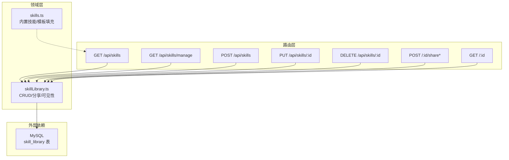
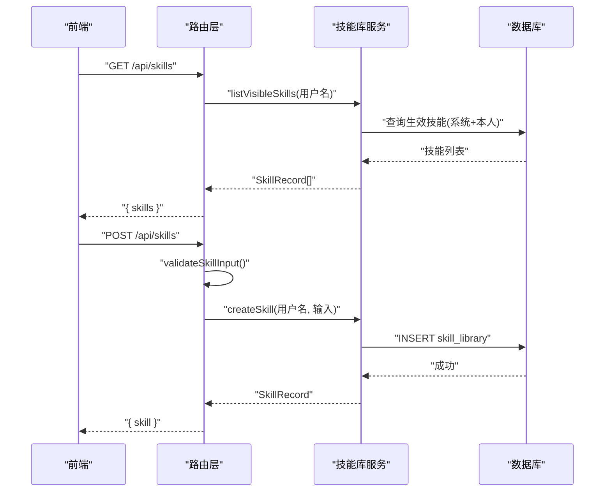
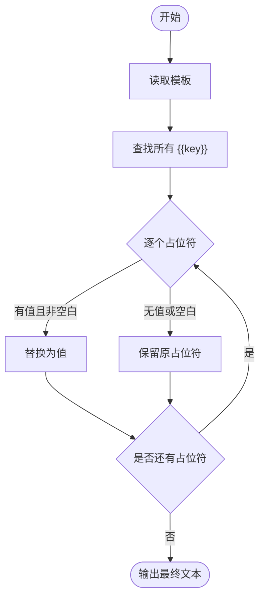
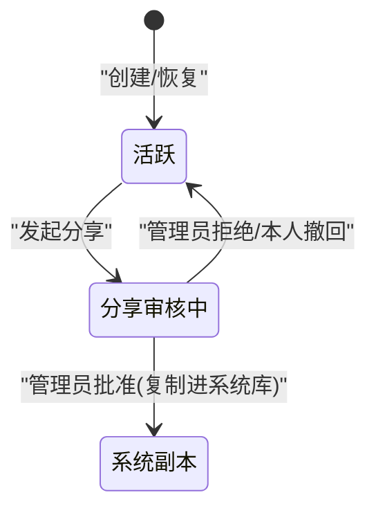
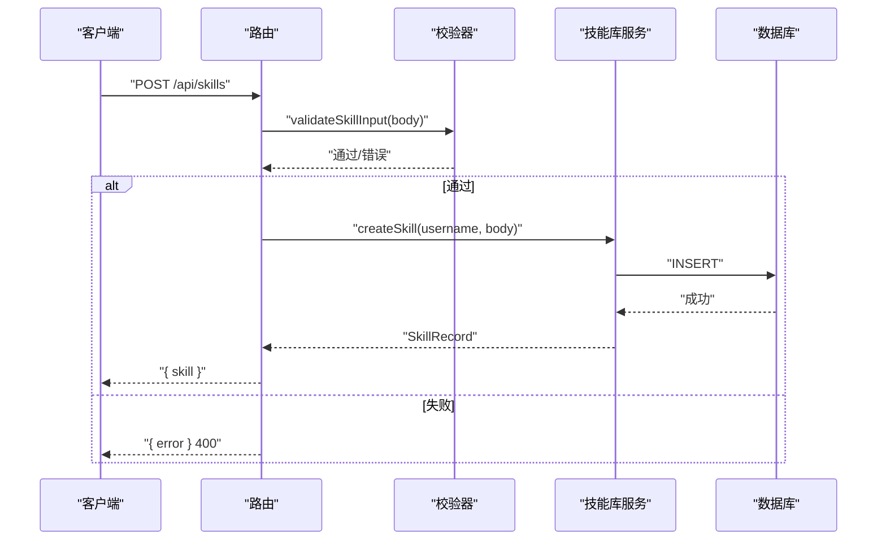
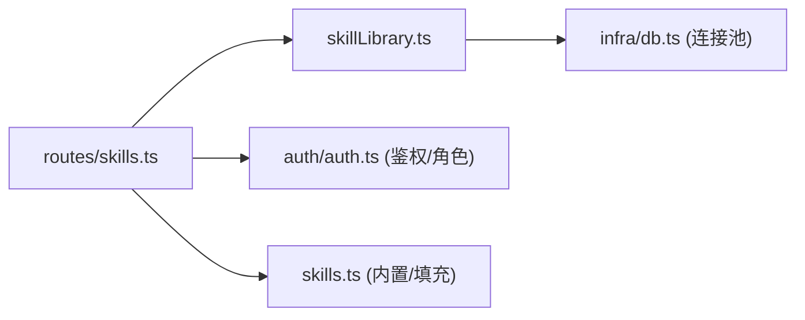

# 技能系统

<cite>
**本文引用的文件**
- [server/skillLibrary.ts](file://server/skillLibrary.ts)
- [server/skills.ts](file://server/skills.ts)
- [server/routes/skills.ts](file://server/routes/skills.ts)
- [server/skillLibrary.test.ts](file://server/skillLibrary.test.ts)
- [server/skills.test.ts](file://server/skills.test.ts)
- [plugins/ponytail/.qoder-plugin/plugin.json](file://plugins/ponytail/.qoder-plugin/plugin.json)
- [plugins/ponytail/skills/ponytail/SKILL.md](file://plugins/ponytail/skills/ponytail/SKILL.md)
</cite>

## 目录
1. [简介](#简介)
2. [项目结构](#项目结构)
3. [核心组件](#核心组件)
4. [架构总览](#架构总览)
5. [详细组件分析](#详细组件分析)
6. [依赖关系分析](#依赖关系分析)
7. [性能与可观测性](#性能与可观测性)
8. [故障排查指南](#故障排查指南)
9. [结论](#结论)
10. [附录：开发指南与最佳实践](#附录开发指南与最佳实践)

## 简介
本技能系统围绕“提问模板 + 占位符”的范式，将高频、可复用的分析方法封装为技能。用户在前端问数面板选择技能后，系统自动填充占位符并生成自然语言问题，再由 NL2SQL 链路生成 SQL 并安全执行。技能库支持个人与系统两级范围、分享审核流程，并提供内置技能与插件技能扩展点。

## 项目结构
技能系统由三层组成：
- 路由层：对外暴露 REST API，负责鉴权、参数校验与结果转换。
- 领域层：实现技能注册、生命周期管理（创建/编辑/删除/分享/审核）、可见性控制等。
- 能力层：提供内置技能定义与模板填充工具；插件以约定目录组织，便于扩展。

图表来源
- [server/routes/skills.ts:1-145](file://server/routes/skills.ts#L1-L145)
- [server/skillLibrary.ts:1-241](file://server/skillLibrary.ts#L1-L241)
- [server/skills.ts:1-97](file://server/skills.ts#L1-L97)

章节来源
- [server/routes/skills.ts:1-145](file://server/routes/skills.ts#L1-L145)
- [server/skillLibrary.ts:1-241](file://server/skillLibrary.ts#L1-L241)
- [server/skills.ts:1-97](file://server/skills.ts#L1-L97)

## 核心组件
- 技能定义与内置技能：集中维护面向业务场景的提问模板与占位符，零占位符即可一键提问。
- 技能库服务：实现技能的增删改查、权限控制、分享申请与管理员审核、可见性过滤。
- 路由接口：统一鉴权、入参校验、错误码返回与响应体转换。
- 模板填充：将用户填写的值替换到模板占位符中，未填项原样保留以便继续补全。

章节来源
- [server/skills.ts:1-97](file://server/skills.ts#L1-L97)
- [server/skillLibrary.ts:1-241](file://server/skillLibrary.ts#L1-L241)
- [server/routes/skills.ts:1-145](file://server/routes/skills.ts#L1-L145)

## 架构总览
技能系统采用“路由-领域-数据”分层，职责清晰、耦合度低。技能仅作为结构化提问模板，不绕过 NL2SQL 与安全执行层，确保查询安全可控。

图表来源
- [server/routes/skills.ts:51-81](file://server/routes/skills.ts#L51-L81)
- [server/skillLibrary.ts:86-141](file://server/skillLibrary.ts#L86-L141)

## 详细组件分析

### 技能定义与模板填充
- 内置技能集合：包含多个面向不良资产经营分析的场景模板，多数为零占位符，点击即问。
- 模板填充函数：按正则匹配 {{key}}，用传入值替换；未填写或空白值保持原样，提示继续补全。
- 测试覆盖：验证字段完整性、占位符一致性、填充行为与边界情况。

图表来源
- [server/skills.ts:90-97](file://server/skills.ts#L90-L97)

章节来源
- [server/skills.ts:1-97](file://server/skills.ts#L1-L97)
- [server/skills.test.ts:1-50](file://server/skills.test.ts#L1-L50)

### 技能库服务（注册、生命周期、可见性）
- 作用域与状态：
  - USER：个人技能，仅本人可维护。
  - SYSTEM：系统技能，管理员维护，全员可见可用。
  - ACTIVE：生效；PENDING_SHARE：分享审核中。
- 可见性：问数面板可见 = 系统库全部生效 + 本人个人库生效。
- 分享流程：
  - 本人对私有技能发起分享申请 → PENDING_SHARE。
  - 管理员批准：复制一份进入系统库（重名自动加“（分享）”后缀），原个人技能恢复 ACTIVE。
  - 管理员拒绝：退回 PRIVATE 并恢复 ACTIVE。
- 权限控制：
  - 编辑/删除：个人技能仅本人；系统技能仅管理员。
  - 分享/撤回：仅本人操作自己的技能。
- 入参校验：名称/模板必填且长度限制，描述可选但有限长。

图表来源
- [server/skillLibrary.ts:128-241](file://server/skillLibrary.ts#L128-L241)

章节来源
- [server/skillLibrary.ts:1-241](file://server/skillLibrary.ts#L1-L241)
- [server/skillLibrary.test.ts:1-126](file://server/skillLibrary.test.ts#L1-L126)

### 路由与接口契约
- GET /api/skills：返回问数面板可见技能（系统生效 + 本人生效）。
- GET /api/skills/manage：管理视图（我的技能 + 系统技能；管理员额外返回待审核分享列表）。
- POST /api/skills：新建个人技能（需通过入参校验）。
- PUT /api/skills/:id：编辑技能（权限同删除）。
- DELETE /api/skills/:id：删除技能（权限同上）。
- POST /:id/share：本人发起分享申请。
- POST /:id/share/cancel：本人撤回分享申请。
- POST /:id/share/approve：管理员批准（复制进系统库）。
- POST /:id/share/reject：管理员拒绝（退回私有）。
- GET /:id：单个技能详情（需可见）。

图表来源
- [server/routes/skills.ts:71-81](file://server/routes/skills.ts#L71-L81)
- [server/skillLibrary.ts:42-141](file://server/skillLibrary.ts#L42-L141)

章节来源
- [server/routes/skills.ts:1-145](file://server/routes/skills.ts#L1-L145)

### 插件技能集成方式
- 插件元信息：通过 plugin.json 声明名称、版本、分类、关键词及 skills 目录路径。
- 技能说明：在 skills/<plugin>/SKILL.md 中以 Markdown 描述技能意图、参数提示、许可证等。
- 集成建议：将第三方技能以插件形式放入 plugins 目录，遵循上述约定，便于后续被上层加载与展示。

章节来源
- [plugins/ponytail/.qoder-plugin/plugin.json:1-16](file://plugins/ponytail/.qoder-plugin/plugin.json#L1-L16)
- [plugins/ponytail/skills/ponytail/SKILL.md:1-121](file://plugins/ponytail/skills/ponytail/SKILL.md#L1-L121)

## 依赖关系分析
- 路由依赖鉴权中间件与角色校验，确保只有登录用户与管理员可访问相应接口。
- 路由依赖技能库服务进行业务逻辑处理与数据持久化。
- 技能库服务依赖数据库连接池访问 skill_library 表。
- 内置技能与模板填充为纯函数模块，无外部依赖，易于测试与复用。

图表来源
- [server/routes/skills.ts:1-24](file://server/routes/skills.ts#L1-L24)
- [server/skillLibrary.ts:9-10](file://server/skillLibrary.ts#L9-L10)
- [server/skills.ts:1-97](file://server/skills.ts#L1-L97)

章节来源
- [server/routes/skills.ts:1-145](file://server/routes/skills.ts#L1-L145)
- [server/skillLibrary.ts:1-241](file://server/skillLibrary.ts#L1-L241)
- [server/skills.ts:1-97](file://server/skills.ts#L1-L97)

## 性能与可观测性
- 查询优化：可见技能列表使用单条 SQL 聚合系统库与本人库，并按 scope 排序，减少多次往返。
- 写入原子性：分享批准流程涉及多步写操作（插入系统副本、更新原状态），建议在数据库事务中执行以保证一致性（当前实现为顺序调用，可在高并发下考虑事务包装）。
- 缓存建议：对频繁读取的“问数面板可见技能”列表可引入短期缓存（如内存缓存），降低数据库压力。
- 监控指标：建议统计各接口的 QPS、延迟分布、错误率；对分享审核队列长度进行监控。
- 日志审计：对创建/编辑/删除/分享/审核等关键操作记录审计日志，便于追溯。

[本节为通用指导，不直接分析具体文件]

## 故障排查指南
- 常见错误码与原因：
  - 400：请求体校验失败（名称/模板为空或超长）、重复分享申请、非审核中操作。
  - 403：无权限编辑/删除系统技能、非本人分享/撤回。
  - 404：技能不存在。
- 定位步骤：
  - 检查路由入参与校验函数返回值。
  - 核对权限判断（scope、createdBy、role）。
  - 查看数据库记录状态是否为 ACTIVE/PENDING_SHARE。
- 单元测试参考：
  - 占位符提取与填充行为。
  - 分享流程的状态流转与 SQL 调用次数。

章节来源
- [server/routes/skills.ts:71-145](file://server/routes/skills.ts#L71-L145)
- [server/skillLibrary.test.ts:1-126](file://server/skillLibrary.test.ts#L1-L126)
- [server/skills.test.ts:1-50](file://server/skills.test.ts#L1-L50)

## 结论
技能系统以“模板 + 占位符”为核心，结合清晰的权限模型与分享审核流程，既满足个人高效复用，又支持企业级共享治理。通过内置技能快速上手，通过插件机制扩展生态，同时保证不绕过 NL2SQL 与安全执行层，整体设计简洁、可扩展、易维护。

[本节为总结性内容，不直接分析具体文件]

## 附录：开发指南与最佳实践

### 技能开发规范
- 模板编写：
  - 使用 {{占位符}} 表达可变部分，避免硬编码业务口径。
  - 占位符命名应语义清晰，并在描述中说明含义。
- 元信息：
  - name/description 简明扼要，便于检索与理解。
  - placeholders 与模板中的占位符保持一致（可通过工具自动提取）。
- 权限与范围：
  - 个人技能用于实验与复用；经审核后分享进入系统库供全员使用。
- 安全与合规：
  - 技能仅为提问模板，不直接执行 SQL；最终由 NL2SQL 与安全执行层保障。

章节来源
- [server/skills.ts:1-97](file://server/skills.ts#L1-L97)
- [server/skillLibrary.ts:42-141](file://server/skillLibrary.ts#L42-L141)

### SDK 与接口使用
- 获取技能列表：调用 GET /api/skills，前端渲染问数面板的技能菜单。
- 管理技能：使用 manage 接口获取“我的技能/系统技能/待审核”，并进行编辑/删除。
- 创建/编辑：POST/PUT 提交 name、description、promptTemplate，服务端会校验并自动生成 placeholders。
- 分享流程：POST /:id/share 发起分享；管理员通过 approve/reject 完成审核。

章节来源
- [server/routes/skills.ts:51-145](file://server/routes/skills.ts#L51-L145)

### 测试方法
- 单元测试：
  - 模板填充：覆盖已填/未填/空白值/无占位符等场景。
  - 占位符提取：去重、trim、保序。
  - 分享流程：状态机流转与异常分支。
- 集成测试建议：
  - 使用测试数据库或内存数据库模拟 skill_library 表。
  - 校验路由层鉴权与错误码返回。

章节来源
- [server/skills.test.ts:1-50](file://server/skills.test.ts#L1-L50)
- [server/skillLibrary.test.ts:1-126](file://server/skillLibrary.test.ts#L1-L126)

### 发布与版本管理策略
- 版本标识：
  - 插件层面：在 plugin.json 中维护 version，配合变更日志。
  - 技能层面：通过 name 或 description 标注版本/口径（例如“核算版 v2”），或在分享时通过重名后缀区分。
- 发布流程：
  - 个人技能完善后发起分享 → 管理员审核 → 进入系统库。
  - 系统库技能变更需走评审与灰度发布流程。
- 回滚策略：
  - 系统库技能支持删除或停用（可通过状态或下架策略），必要时保留历史版本副本。

章节来源
- [plugins/ponytail/.qoder-plugin/plugin.json:1-16](file://plugins/ponytail/.qoder-plugin/plugin.json#L1-L16)
- [server/skillLibrary.ts:203-227](file://server/skillLibrary.ts#L203-L227)

### 效果评估、性能监控与安全沙箱
- 效果评估：
  - 基于问数成功率、平均耗时、用户满意度等指标评估技能价值。
  - 对热门技能进行 A/B 对比（不同模板措辞/口径）。
- 性能监控：
  - 接口级：QPS、P95/P99 延迟、错误率。
  - 数据层：慢查询、连接池使用率。
- 安全沙箱：
  - 技能仅作为模板，不直接执行 SQL；NL2SQL 与安全执行层负责注入防护、权限控制与资源限制。
  - 建议对生成的 SQL 进行白名单/黑名单规则校验与审计。

[本节为通用指导，不直接分析具体文件]