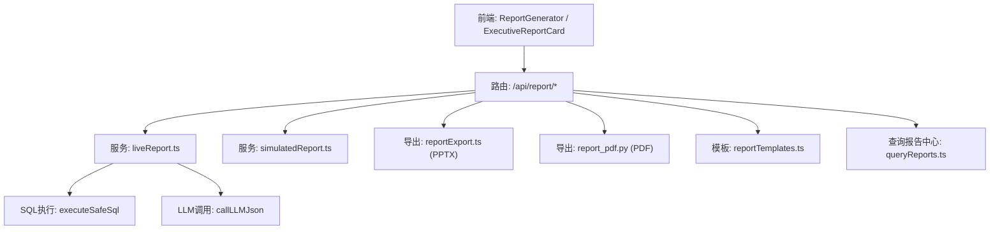
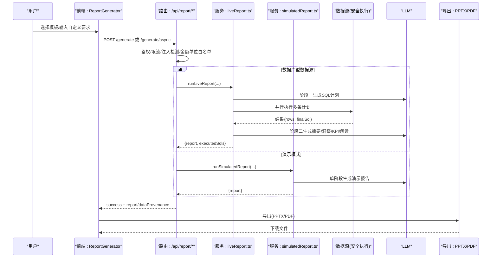
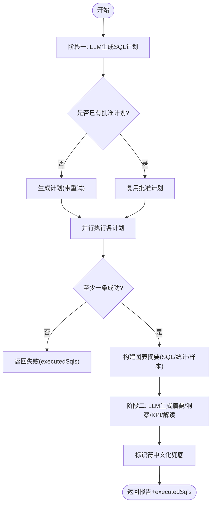
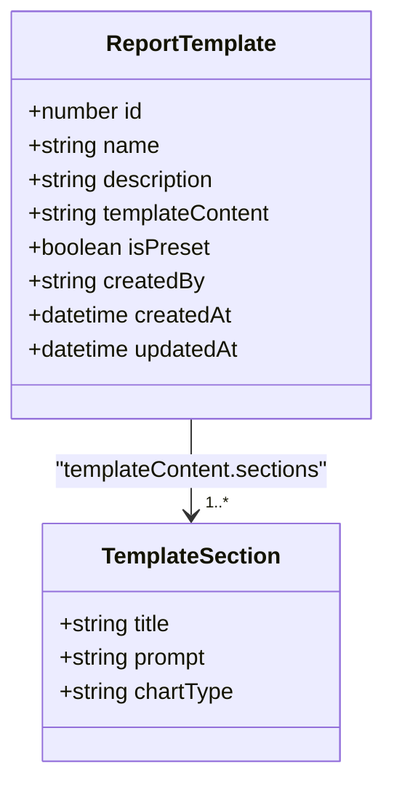
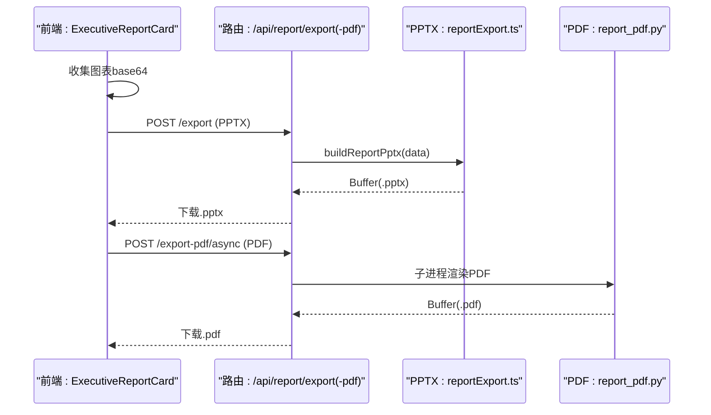
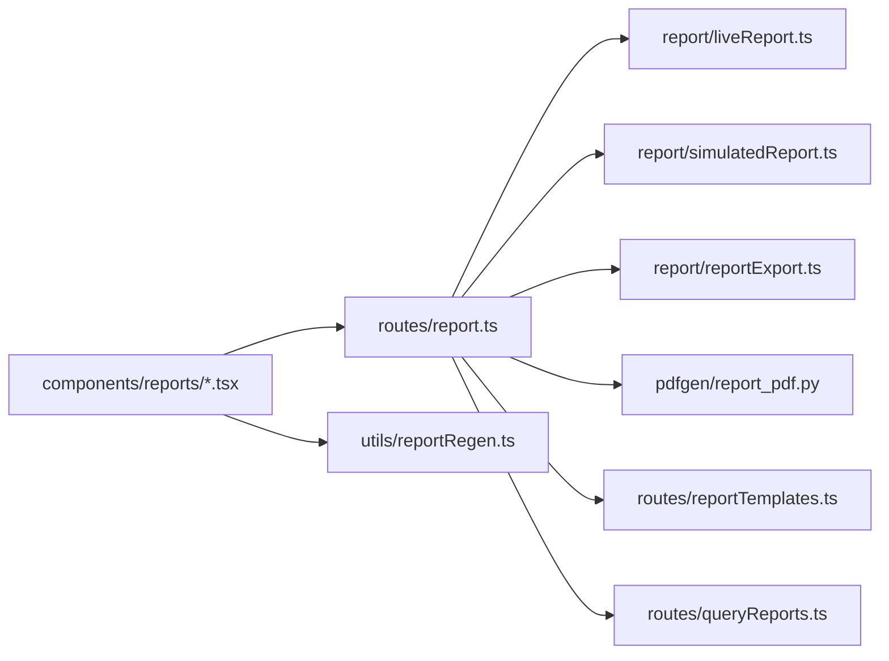

# 报表生成系统

<cite>
**本文引用的文件**
- [liveReport.ts](file://server/report/liveReport.ts)
- [simulatedReport.ts](file://server/report/simulatedReport.ts)
- [reportExport.ts](file://server/report/reportExport.ts)
- [report_pdf.py](file://server/pdfgen/report_pdf.py)
- [report.ts](file://server/routes/report.ts)
- [queryReports.ts](file://server/routes/queryReports.ts)
- [reportTemplates.ts](file://server/routes/reportTemplates.ts)
- [ReportGenerator.tsx](file://src/components/reports/ReportGenerator.tsx)
- [ExecutiveReportCard.tsx](file://src/components/reports/ExecutiveReportCard.tsx)
- [reportRegen.ts](file://src/utils/reportRegen.ts)
</cite>

## 目录
1. [简介](#简介)
2. [项目结构](#项目结构)
3. [核心组件](#核心组件)
4. [架构总览](#架构总览)
5. [详细组件分析](#详细组件分析)
6. [依赖关系分析](#依赖关系分析)
7. [性能与并发](#性能与并发)
8. [故障排查指南](#故障排查指南)
9. [结论](#结论)
10. [附录：模板开发与扩展指南](#附录模板开发与扩展指南)

## 简介
本系统提供“智能问数”驱动的可视化决策报表能力，支持真实数据源（数据库/已落库文件）的自动查询计划生成、安全执行、LLM 文案撰写与图表渲染；同时提供演示模式（Simulated Report）用于无直连数据源时的快速体验。系统支持 PPTX 与 PDF 导出，具备异步任务队列、进度跟踪、DLP 水印、权限与注入防护、金额单位口径一致性等高级特性。

## 项目结构
- 服务端路由层：统一入口 /api/report/*，负责鉴权、限流、参数校验、审计日志、任务提交与结果返回。
- 报表服务层：
  - liveReport：双阶段真实报表（阶段一 LLM 生成 SQL 计划 → 并行安全执行 → 阶段二 LLM 基于真实数据生成高管摘要/KPI/洞察/图表解读）。
  - simulatedReport：单阶段 LLM 生成演示报表（不连接数据库）。
- 导出层：
  - reportExport：PPTX 构建（pptxgenjs），封面/摘要/KPI/每图一页/结论页。
  - pdfgen/report_pdf.py：PDF 构建（ReportLab），原生排版与中文支持。
- 前端：
  - ReportGenerator：报表创建、计划模式、异步生成、历史维护、自动重生成。
  - ExecutiveReportCard：报告渲染、异常扫描、批注、导出（PPT/PDF）、打印、下钻。
- 模板管理：
  - reportTemplates：模板 CRUD，预设模板不可编辑/删除。
  - ReportTemplateManager：模板编辑器（章节标题、提示词、图表类型）。

**图示来源**
- [report.ts:31-584](file://server/routes/report.ts#L31-L584)
- [liveReport.ts:350-493](file://server/report/liveReport.ts#L350-L493)
- [simulatedReport.ts:61-76](file://server/report/simulatedReport.ts#L61-L76)
- [reportExport.ts:111-214](file://server/report/reportExport.ts#L111-L214)
- [report_pdf.py:213-271](file://server/pdfgen/report_pdf.py#L213-L271)
- [reportTemplates.ts:70-253](file://server/routes/reportTemplates.ts#L70-L253)
- [queryReports.ts:47-149](file://server/routes/queryReports.ts#L47-L149)

**章节来源**
- [report.ts:31-584](file://server/routes/report.ts#L31-L584)
- [ReportGenerator.tsx:198-366](file://src/components/reports/ReportGenerator.tsx#L198-L366)
- [ExecutiveReportCard.tsx:283-366](file://src/components/reports/ExecutiveReportCard.tsx#L283-L366)

## 核心组件
- 动态报表创建流程（Live Report）
  - 阶段一：LLM 按模板主题生成 2-4 条聚合 SQL 计划（含 chartType/xAxisKey/yAxisKeys/purpose），可复用已批准计划（M4）。
  - 执行：多条计划并行过安全执行层（允许部分失败，至少一条成功继续），汇总 executedSqls 与 charts 索引对齐。
  - 阶段二：将各图表的真实数据摘要回喂 LLM 生成 title/summary/insights/kpiList/commentaries，并进行标识符中文化兜底。
- 模拟报表（Simulated Report）
  - 非数据库直连时，LLM 单阶段生成演示数据与标准 JSON 报告，标记 dataProvenance=simulated。
- 模板管理系统
  - 模板内容结构为 sections 数组（title/prompt/chartType），支持新增/编辑/删除（预设模板受保护）。
  - 从对话生成报告时可加载模板内容并拼接至 prompt。
- 导出功能
  - PPTX：服务端 pptxgenjs 组装，封面/摘要/KPI/每图一页/结论页，支持 DLP 水印。
  - PDF：ReportLab 原生排版，A4/横竖版，中文 STSong-Light，图片等比缩放，页眉页脚与水印。
- 异步与进度
  - 异步端点提交即返回 taskId，后台 worker 执行后轮询获取结果；PDF 导出同样异步化。
- 缓存与计划
  - 报告计划存储（内存 Map 或 Redis，TTL 10 分钟，一次性消费防重放），金额单位一致性校验。

**章节来源**
- [liveReport.ts:237-320](file://server/report/liveReport.ts#L237-L320)
- [liveReport.ts:350-493](file://server/report/liveReport.ts#L350-L493)
- [simulatedReport.ts:30-76](file://server/report/simulatedReport.ts#L30-L76)
- [reportTemplates.ts:44-67](file://server/routes/reportTemplates.ts#L44-L67)
- [reportExport.ts:67-103](file://server/report/reportExport.ts#L67-L103)
- [report_pdf.py:213-271](file://server/pdfgen/report_pdf.py#L213-L271)
- [report.ts:374-513](file://server/routes/report.ts#L374-L513)

## 架构总览

**图示来源**
- [report.ts:31-160](file://server/routes/report.ts#L31-L160)
- [report.ts:374-513](file://server/routes/report.ts#L374-L513)
- [liveReport.ts:350-493](file://server/report/liveReport.ts#L350-L493)
- [simulatedReport.ts:61-76](file://server/report/simulatedReport.ts#L61-L76)
- [reportExport.ts:111-214](file://server/report/reportExport.ts#L111-L214)
- [report_pdf.py:213-271](file://server/pdfgen/report_pdf.py#L213-L271)

## 详细组件分析

### 动态报表创建（Live Report）
- 阶段一：构建 system prompt（Schema/业务备注/指标口径/铁律规则/知识库RAG/方言规则），调用 LLM 输出 JSON 契约（reportTitle/plans），最多重试一次。
- 执行：Promise.all 并行执行各计划，记录 executedSqls 与 totalRows；若全部失败则返回错误。
- 阶段二：构造图表摘要（SQL/行数/列统计/样本），调用 LLM 生成文本内容；对英文标识符进行中文替换兜底。
- 计划批准（M4）：storeReportPlan/consumeReportPlan 支持一次性消费与过期校验，金额单位一致性强制校验。

**图示来源**
- [liveReport.ts:237-320](file://server/report/liveReport.ts#L237-L320)
- [liveReport.ts:350-493](file://server/report/liveReport.ts#L350-L493)

**章节来源**
- [liveReport.ts:237-320](file://server/report/liveReport.ts#L237-L320)
- [liveReport.ts:350-493](file://server/report/liveReport.ts#L350-L493)

### 模拟报表（Simulated Report）
- 当数据源不可直连或链路降级时，使用单阶段 LLM 生成演示数据与标准 JSON 报告，dataProvenance=simulated。
- 输出结构与 live 一致，便于前端统一渲染。

**章节来源**
- [simulatedReport.ts:30-76](file://server/report/simulatedReport.ts#L30-L76)
- [report.ts:140-155](file://server/routes/report.ts#L140-L155)

### 模板管理系统
- 模板结构：sections 数组，每项包含 title/prompt/chartType。
- 权限：仅 ADMIN 可新增/编辑/删除；预设模板不可编辑/删除。
- 集成：从对话生成报告时，可加载模板内容并拼接至 prompt。

**图示来源**
- [reportTemplates.ts:18-42](file://server/routes/reportTemplates.ts#L18-L42)
- [reportTemplates.ts:44-67](file://server/routes/reportTemplates.ts#L44-L67)

**章节来源**
- [reportTemplates.ts:70-253](file://server/routes/reportTemplates.ts#L70-L253)
- [report.ts:295-310](file://server/routes/report.ts#L295-L310)

### 导出：PPTX 与 PDF
- PPTX：
  - 前端截图图表为 base64 PNG，后端用 pptxgenjs 组装页面（封面/摘要/KPI/每图一页/结论），添加页脚与 DLP 水印。
  - 文件名安全处理，支持 .pptx 下载。
- PDF：
  - Python 脚本通过 stdin 接收 JSON，ReportLab 原生排版，A4/横竖版，中文 STSong-Light，图片等比缩放，页眉页脚与水印。
  - 异步导出：提交返回 taskId，完成后通过任务下载端点获取文件。

**图示来源**
- [ExecutiveReportCard.tsx:283-366](file://src/components/reports/ExecutiveReportCard.tsx#L283-L366)
- [reportExport.ts:111-214](file://server/report/reportExport.ts#L111-L214)
- [report_pdf.py:213-271](file://server/pdfgen/report_pdf.py#L213-L271)
- [report.ts:515-581](file://server/routes/report.ts#L515-L581)

**章节来源**
- [reportExport.ts:67-103](file://server/report/reportExport.ts#L67-L103)
- [reportExport.ts:111-214](file://server/report/reportExport.ts#L111-L214)
- [report_pdf.py:213-271](file://server/pdfgen/report_pdf.py#L213-L271)
- [report.ts:515-581](file://server/routes/report.ts#L515-L581)

### 历史报表维护与重新生成
- 条件解析：优先使用 genParams 快照，旧版回退 customPrompt 与默认模板/单位。
- 准入判定：仅 live 报表且操作人有权限才可重新生成。
- 就地替换：保留原报表 id 与批注，更新内容字段与生成条件快照。

**章节来源**
- [reportRegen.ts:18-69](file://src/utils/reportRegen.ts#L18-L69)
- [ReportGenerator.tsx:308-366](file://src/components/reports/ReportGenerator.tsx#L308-L366)

### 查询报告中心
- 列表/详情/删除接口，按数据源过滤，ADMIN 可查看所有，普通用户仅本人。
- 从对话生成报告时，结果写入 query_reports 表，供报告中心查看。

**章节来源**
- [queryReports.ts:47-149](file://server/routes/queryReports.ts#L47-L149)
- [report.ts:228-372](file://server/routes/report.ts#L228-L372)

## 依赖关系分析
- 路由层依赖：
  - 鉴权/限流/审计：authMiddleware、rateLimiter、writeAudit。
  - 上下文：loadSchemaContext（schema/guidance/敏感列/行级权限）。
  - 服务：runLiveReport/runSimulatedReport、normalizeExportData/buildReportPptx、runPdfGenerator。
  - 任务：submitTask（异步生成/导出）。
- 服务层依赖：
  - liveReport：executeSafeSql、callLLMJson、metrics/ironRules/knowledge 检索、stateStore（计划存储）。
  - simulatedReport：callLLMJson、normalizeReport。
- 导出层依赖：
  - PPTX：pptxgenjs。
  - PDF：ReportLab（STSong-Light 字体）。
- 前端依赖：
  - ReportGenerator：useAnalyticsStore、useAuthStore、useEngineInfo、AmountUnitSelect、reportRegen、asyncTask。
  - ExecutiveReportCard：DynamicChart、anomalyDetector、asyncTask。

**图示来源**
- [report.ts:1-584](file://server/routes/report.ts#L1-L584)
- [liveReport.ts:1-493](file://server/report/liveReport.ts#L1-L493)
- [simulatedReport.ts:1-76](file://server/report/simulatedReport.ts#L1-L76)
- [reportExport.ts:1-222](file://server/report/reportExport.ts#L1-L222)
- [report_pdf.py:1-294](file://server/pdfgen/report_pdf.py#L1-L294)
- [reportTemplates.ts:1-253](file://server/routes/reportTemplates.ts#L1-L253)
- [queryReports.ts:1-150](file://server/routes/queryReports.ts#L1-L150)
- [ReportGenerator.tsx:1-706](file://src/components/reports/ReportGenerator.tsx#L1-L706)
- [ExecutiveReportCard.tsx:1-800](file://src/components/reports/ExecutiveReportCard.tsx#L1-L800)
- [reportRegen.ts:1-69](file://src/utils/reportRegen.ts#L1-L69)

**章节来源**
- [report.ts:1-584](file://server/routes/report.ts#L1-L584)
- [ReportGenerator.tsx:1-706](file://src/components/reports/ReportGenerator.tsx#L1-L706)
- [ExecutiveReportCard.tsx:1-800](file://src/components/reports/ExecutiveReportCard.tsx#L1-L800)

## 性能与并发
- 并行执行：阶段一多计划并行执行，墙钟时间由“逐条相加”降为“最慢一条”，提升吞吐。
- 连接池配额：chain 场景默认 5，export 场景默认 2，避免资源争用。
- 异步任务：/generate/async 与 /export-pdf/async 提交即返回 taskId，后台 worker 独立执行，不阻塞用户交互。
- 采样限制：阶段二每图真实行采样上限（SAMPLE_ROWS_PER_CHART）控制 token 预算。
- 计划缓存：rqp:* 键 TTL 10 分钟，一次性消费（GETDEL）防重放。

[本节为通用性能说明，无需特定文件引用]

## 故障排查指南
- 权限/限流/注入：
  - 403：角色无权限（需 ADMIN/ANALYST）。
  - 429：频率超限或在途任务过多。
  - 400：金额单位非法/模板内容非法/缺少必填字段。
- 数据源状态：
  - 403：数据源已停用智能问数（disconnected）。
- 计划失效：
  - 409：计划过期/越权/不匹配（userId/datasourceId/templateType/amountUnit）。
- 导出失败：
  - PPTX：图表 base64 缺失或格式错误；检查前端截图逻辑。
  - PDF：Python 子进程报错（JSON 解析/图片解码）；检查 stderr 日志。
- 审计日志：
  - 所有关键路径均写审计（DENIED_AUTH/DENIED_INPUT/DENIED_RATE/DENIED_SWITCH/SUCCESS/FALLBACK/ERROR）。

**章节来源**
- [report.ts:31-160](file://server/routes/report.ts#L31-L160)
- [report.ts:374-513](file://server/routes/report.ts#L374-L513)
- [report.ts:515-581](file://server/routes/report.ts#L515-L581)

## 结论
本报表生成系统以“双阶段真实报表 + 演示模式”为核心，结合模板管理、PPTX/PDF 导出、异步任务与进度跟踪，形成端到端的决策简报生产流水线。通过安全执行层、注入防护、金额单位一致性、DLP 水印与审计日志，保障企业级可用性与合规性。前端提供丰富的交互（主题/对比/异常标注/批注/下钻），后端保证高并发与可扩展性。

[本节为总结性内容，无需特定文件引用]

## 附录：模板开发与扩展指南

### 模板变量绑定与条件渲染
- 模板内容结构：{ sections: [{ title, prompt, chartType }] }。
- 在“从对话生成报告”时，可将用户问题与模板 sections 拼接为 prompt，实现变量绑定。
- 条件渲染：根据 chartType 在前端 DynamicChart 中选择不同图表类型；后端阶段一 plan.chartType 决定图表配置。

**章节来源**
- [reportTemplates.ts:44-67](file://server/routes/reportTemplates.ts#L44-L67)
- [report.ts:295-310](file://server/routes/report.ts#L295-L310)
- [liveReport.ts:296-320](file://server/report/liveReport.ts#L296-L320)

### 布局配置
- 模板章节顺序即为报告段落顺序；每个章节可指定 chartType 以影响前端渲染。
- 金额单位：通过 amountUnit 控制 SQL 换算与文案表述一致性。

**章节来源**
- [reportTemplates.ts:84-132](file://server/routes/reportTemplates.ts#L84-L132)
- [liveReport.ts:322-343](file://server/report/liveReport.ts#L322-L343)

### 扩展新导出格式
- 新增导出器：参考 reportExport.ts 的 normalizeExportData/buildReportPptx，实现新的 buildReportXXX(data) 函数。
- 路由接入：在 routes/report.ts 新增 POST /export-xxx，鉴权/限流/审计后调用导出器并返回文件流。
- 前端集成：在 ExecutiveReportCard 中添加导出按钮，收集图表 base64 并提交。

**章节来源**
- [reportExport.ts:67-103](file://server/report/reportExport.ts#L67-L103)
- [reportExport.ts:111-214](file://server/report/reportExport.ts#L111-L214)
- [report.ts:515-581](file://server/routes/report.ts#L515-L581)
- [ExecutiveReportCard.tsx:283-366](file://src/components/reports/ExecutiveReportCard.tsx#L283-L366)

### 自定义图表类型
- 前端：在 DynamicChart 中新增 chartType 分支，实现渲染逻辑。
- 后端：阶段一 plan.chartType 白名单扩展（liveReport.ts 解析时校验），确保 LLM 输出合法。

**章节来源**
- [liveReport.ts:296-320](file://server/report/liveReport.ts#L296-L320)
- [ExecutiveReportCard.tsx:745-797](file://src/components/reports/ExecutiveReportCard.tsx#L745-L797)

### 集成第三方报表库
- 替换导出器：将 pptxgenjs/ReportLab 替换为其他库，保持输入数据结构一致（ReportExportData）。
- 保持协议：normalizeExportData 校验与 buildExportFilename 命名策略不变，确保前后端兼容。

**章节来源**
- [reportExport.ts:67-103](file://server/report/reportExport.ts#L67-L103)
- [reportExport.ts:216-222](file://server/report/reportExport.ts#L216-L222)