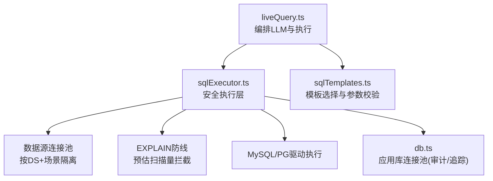
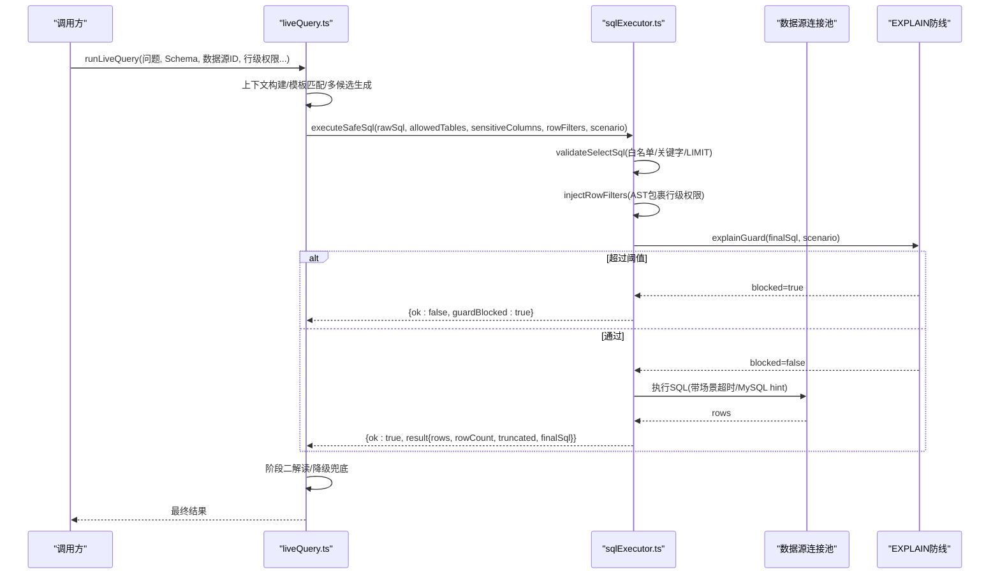
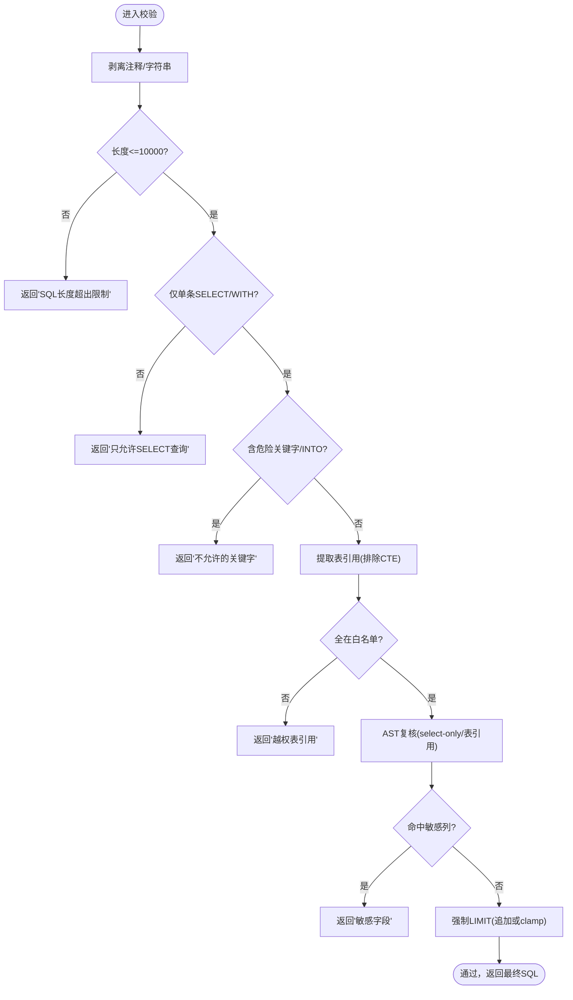
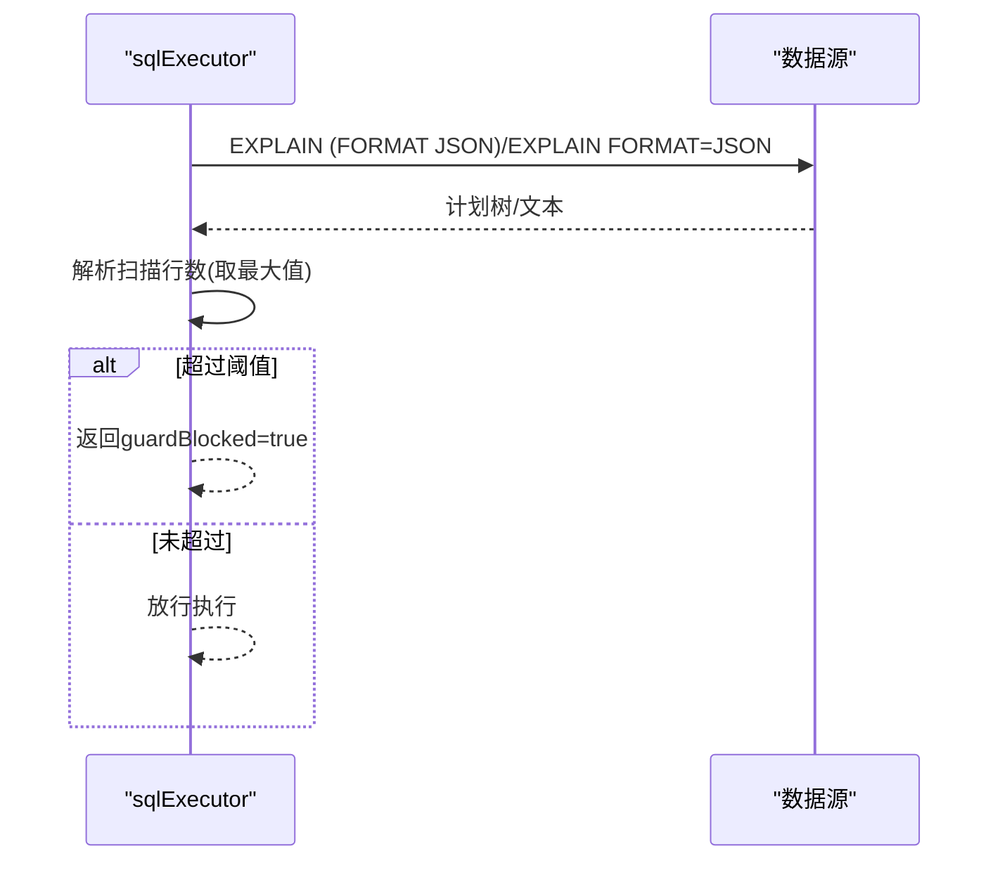
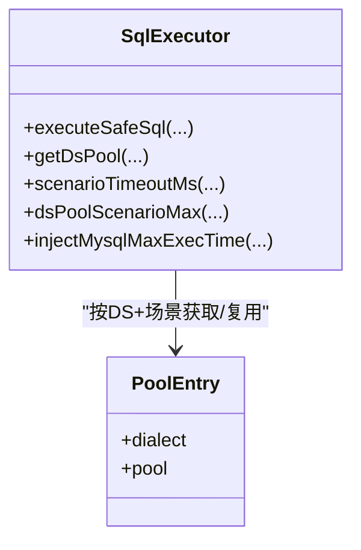
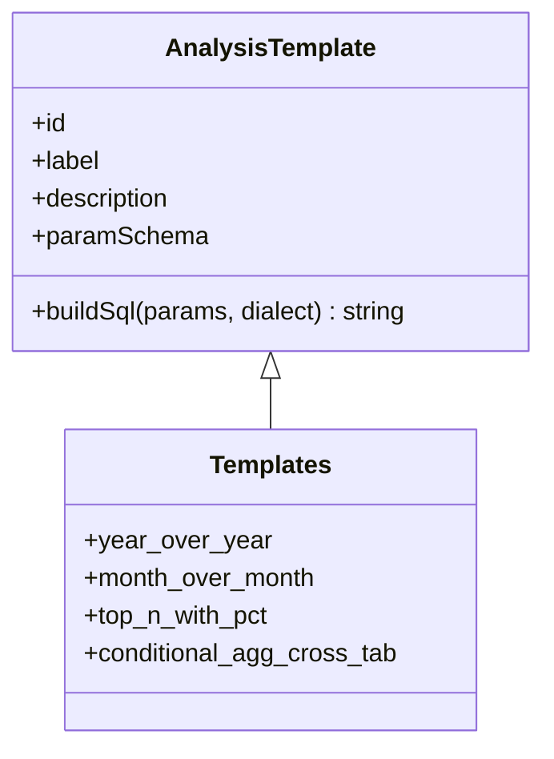
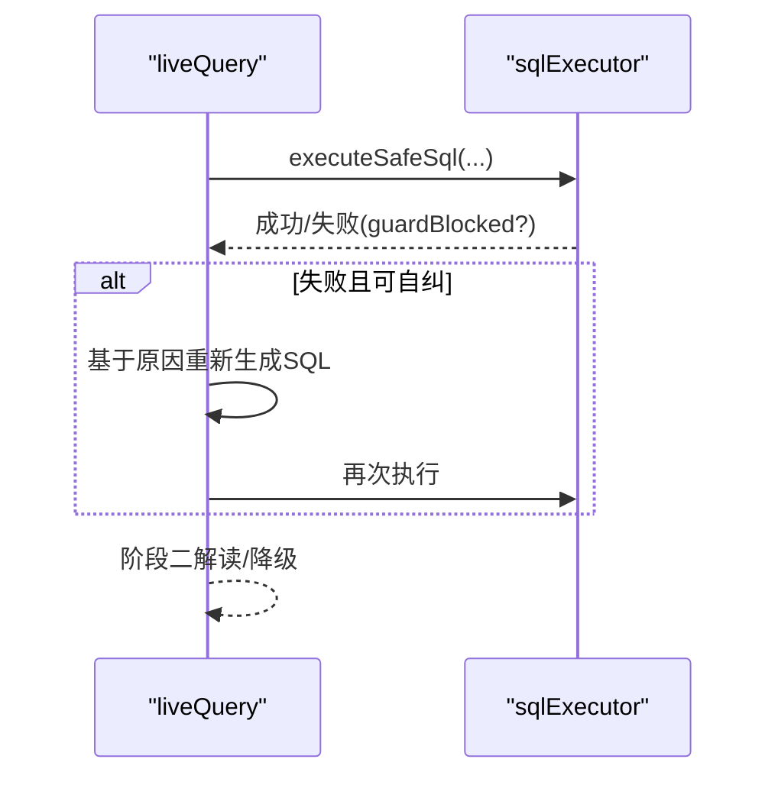
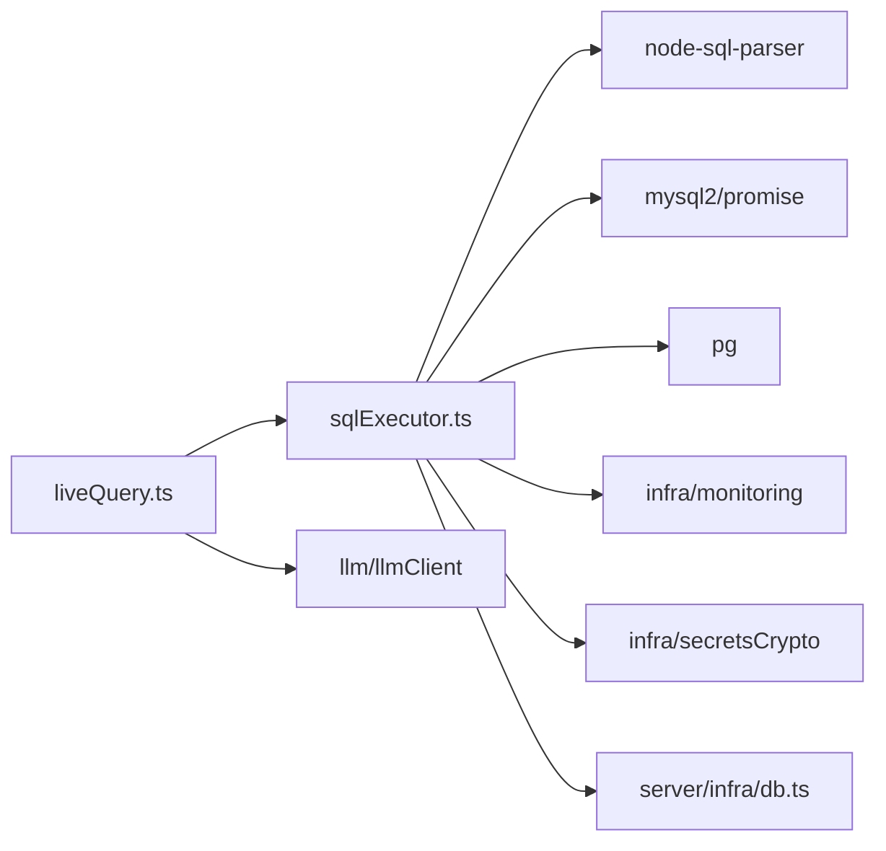

# SQL执行器

<cite>
**本文引用的文件**
- [server/query/sqlExecutor.ts](file://server/query/sqlExecutor.ts)
- [server/query/sqlTemplates.ts](file://server/query/sqlTemplates.ts)
- [server/query/liveQuery.ts](file://server/query/liveQuery.ts)
- [server/query/sqlExecutorPool.test.ts](file://server/query/sqlExecutorPool.test.ts)
- [server/query/sqlTemplates.test.ts](file://server/query/sqlTemplates.test.ts)
- [server/infra/db.ts](file://server/infra/db.ts)
</cite>

## 目录
1. [简介](#简介)
2. [项目结构](#项目结构)
3. [核心组件](#核心组件)
4. [架构总览](#架构总览)
5. [详细组件分析](#详细组件分析)
6. [依赖关系分析](#依赖关系分析)
7. [性能与容量规划](#性能与容量规划)
8. [故障排查指南](#故障排查指南)
9. [结论](#结论)
10. [附录：扩展与配置示例](#附录：扩展与配置示例)

## 简介
本文件面向“智能问数据分析系统”的SQL执行器，聚焦安全执行的核心机制与工程实现。内容覆盖：
- SQL注入防护、权限验证（表白名单+行级权限）、查询限制（单语句、关键字过滤、行数截断）
- executeSafeSql 的工作流程与安全防线
- SQL模板系统的设计模式与动态拼装策略
- 连接池管理、超时控制、错误恢复等高级特性
- 如何扩展查询规则、自定义安全策略、配置执行参数

## 项目结构
围绕SQL执行的关键模块与职责：
- sqlExecutor.ts：安全执行层，包含校验、注入、EXPLAIN防线、连接池、执行与结果截断
- sqlTemplates.ts：参数化分析模板引擎，提供确定性SQL构建能力
- liveQuery.ts：编排LLM生成SQL并调用安全执行层，支持多候选、自纠错与结果解读
- db.ts：应用库连接池与初始化（审计、追踪、中间表等）
- 测试文件：覆盖连接池分级、场景超时、MySQL hint注入、模板参数校验等

图表来源
- [server/query/liveQuery.ts:189-749](file://server/query/liveQuery.ts#L189-L749)
- [server/query/sqlExecutor.ts:734-832](file://server/query/sqlExecutor.ts#L734-L832)
- [server/query/sqlTemplates.ts:1-119](file://server/query/sqlTemplates.ts#L1-L119)
- [server/infra/db.ts:47-70](file://server/infra/db.ts#L47-L70)

章节来源
- [server/query/sqlExecutor.ts:1-120](file://server/query/sqlExecutor.ts#L1-L120)
- [server/query/sqlTemplates.ts:1-119](file://server/query/sqlTemplates.ts#L1-L119)
- [server/query/liveQuery.ts:1-120](file://server/query/liveQuery.ts#L1-L120)
- [server/infra/db.ts:1-80](file://server/infra/db.ts#L1-L80)

## 核心组件
- 安全校验与注入
  - validateSelectSql：只允许SELECT、单语句、关键字过滤、表白名单、敏感列拒绝、强制LIMIT
  - injectRowFilters：AST包裹派生表注入行级权限谓词
  - checkAstSafety：node-sql-parser AST复核，确保仅读且表引用在白名单内
- EXPLAIN防线
  - explainGuard：在真实执行前评估预估扫描行数，超阈值拦截（fail-open）
- 连接池与超时
  - getDsPool：按dataSourceId+场景分级建池；MySQL使用mysql2，PG系使用pg
  - scenarioTimeoutMs/dsPoolScenarioMax：场景化超时与配额公式
  - injectMysqlMaxExecTime：为MySQL SELECT注入服务端执行时限hint
- 结果处理
  - 结果截断至maxRows，标记truncated；保留finalSql用于审计展示
- 模板系统
  - AnalysisTemplate接口与AVAILABLE_TEMPLATES清单
  - validateTemplateParams：严格校验模板参数，buildSql确定性拼装SQL

章节来源
- [server/query/sqlExecutor.ts:169-387](file://server/query/sqlExecutor.ts#L169-L387)
- [server/query/sqlExecutor.ts:396-489](file://server/query/sqlExecutor.ts#L396-L489)
- [server/query/sqlExecutor.ts:531-662](file://server/query/sqlExecutor.ts#L531-L662)
- [server/query/sqlExecutor.ts:686-726](file://server/query/sqlExecutor.ts#L686-L726)
- [server/query/sqlTemplates.ts:10-119](file://server/query/sqlTemplates.ts#L10-L119)

## 架构总览
SQL执行从“自然语言→LLM计划→安全执行→结果解读”的端到端链路，安全执行层是核心闸门。

图表来源
- [server/query/liveQuery.ts:189-749](file://server/query/liveQuery.ts#L189-L749)
- [server/query/sqlExecutor.ts:734-832](file://server/query/sqlExecutor.ts#L734-L832)
- [server/query/sqlExecutor.ts:531-662](file://server/query/sqlExecutor.ts#L531-L662)

## 详细组件分析

### 安全校验与注入（validateSelectSql / injectRowFilters / checkAstSafety）
- 剥离注释与字符串后做结构校验，避免字面量干扰
- 单语句、禁止危险关键字、INTO写操作
- 表白名单校验：提取FROM/JOIN目标，排除CTE别名
- AST复核：仅允许select类型，表引用必须在白名单或CTE中
- 敏感列拒绝：裸列名整词匹配
- 强制LIMIT：无则追加，有则clamp到MAX_ROWS；兼容MySQL与PG语法差异
- 行级权限注入：AST遍历from子树，将受控表替换为带WHERE谓词的派生表，递归覆盖子查询/UNION/CTE

图表来源
- [server/query/sqlExecutor.ts:169-387](file://server/query/sqlExecutor.ts#L169-L387)
- [server/query/sqlExecutor.ts:396-489](file://server/query/sqlExecutor.ts#L396-L489)

章节来源
- [server/query/sqlExecutor.ts:169-387](file://server/query/sqlExecutor.ts#L169-L387)
- [server/query/sqlExecutor.ts:396-489](file://server/query/sqlExecutor.ts#L396-L489)

### EXPLAIN防线（explainGuard）
- 在执行前对finalSql执行EXPLAIN，解析MySQL/PG计划树估计扫描行数
- 超过阈值则拦截，附带友好提示（建议增加筛选条件）
- EXPLAIN失败时fail-open放行，记录告警日志，不阻断正常查询

图表来源
- [server/query/sqlExecutor.ts:531-662](file://server/query/sqlExecutor.ts#L531-L662)

章节来源
- [server/query/sqlExecutor.ts:531-662](file://server/query/sqlExecutor.ts#L531-L662)

### 连接池与超时（getDsPool / dsPoolScenarioMax / scenarioTimeoutMs / injectMysqlMaxExecTime）
- 按dataSourceId+场景分级缓存连接池，支持失效重建
- 场景配额公式：interactive/chain/export分别分配不同池大小，防止后台任务挤占交互
- 场景超时：交互15s、链120s、导出60s，可通过环境变量覆盖
- MySQL：query timeout + MAX_EXECUTION_TIME hint双保险；PG：statement_timeout
- 文件数据源：改道应用库执行，跳过EXPLAIN防线，保留驱动timeout与hint

图表来源
- [server/query/sqlExecutor.ts:686-726](file://server/query/sqlExecutor.ts#L686-L726)
- [server/query/sqlExecutor.ts:78-109](file://server/query/sqlExecutor.ts#L78-L109)
- [server/query/sqlExecutor.ts:118-153](file://server/query/sqlExecutor.ts#L118-L153)

章节来源
- [server/query/sqlExecutor.ts:78-109](file://server/query/sqlExecutor.ts#L78-L109)
- [server/query/sqlExecutor.ts:118-153](file://server/query/sqlExecutor.ts#L118-L153)
- [server/query/sqlExecutor.ts:686-726](file://server/query/sqlExecutor.ts#L686-L726)

### 模板系统（AnalysisTemplate / AVAILABLE_TEMPLATES / validateTemplateParams）
- 设计模式：声明式模板（id/label/description/paramSchema/buildSql），由LLM轻量选择模板并填充参数
- 内置模板：同比、环比、TOP-N占比、条件聚合交叉表
- 参数校验：严格检查必填字段与类型，非法参数直接拒绝
- 优势：规避本地模型复杂语法不稳定问题，保证口径零偏差

图表来源
- [server/query/sqlTemplates.ts:10-89](file://server/query/sqlTemplates.ts#L10-L89)

章节来源
- [server/query/sqlTemplates.ts:10-119](file://server/query/sqlTemplates.ts#L10-L119)

### 执行入口与编排（executeSafeSql / liveQuery.runLiveQuery）
- executeSafeSql：统一入口，包装埋点、异常捕获，委托内部实现
- liveQuery.runLiveQuery：并行构建上下文、模板匹配、多候选生成、执行与多数表决、结果解读与降级
- 自纠错：执行失败或结果异常时回喂原因重试（最多3次），EXPLAIN拦截给一次收窄机会

图表来源
- [server/query/liveQuery.ts:189-749](file://server/query/liveQuery.ts#L189-L749)
- [server/query/sqlExecutor.ts:734-832](file://server/query/sqlExecutor.ts#L734-L832)

章节来源
- [server/query/liveQuery.ts:189-749](file://server/query/liveQuery.ts#L189-L749)
- [server/query/sqlExecutor.ts:734-832](file://server/query/sqlExecutor.ts#L734-L832)

## 依赖关系分析
- 外部依赖
  - node-sql-parser：AST解析与表引用提取、AST改写
  - mysql2/promise：MySQL连接池与查询
  - pg：PostgreSQL/Greenplum连接池与查询
- 内部依赖
  - infra/db：应用库连接池（审计、追踪、中间表）
  - llm/llmClient：LLM调用（模板匹配、多候选生成、解读）
  - infra/monitoring：执行耗时与EXPLAIN守卫埋点
  - infra/secretsCrypto：数据源密码解密

图表来源
- [server/query/sqlExecutor.ts:11-22](file://server/query/sqlExecutor.ts#L11-L22)
- [server/query/liveQuery.ts:16-43](file://server/query/liveQuery.ts#L16-L43)
- [server/infra/db.ts:47-70](file://server/infra/db.ts#L47-L70)

章节来源
- [server/query/sqlExecutor.ts:11-22](file://server/query/sqlExecutor.ts#L11-L22)
- [server/query/liveQuery.ts:16-43](file://server/query/liveQuery.ts#L16-L43)
- [server/infra/db.ts:47-70](file://server/infra/db.ts#L47-L70)

## 性能与容量规划
- 连接池容量
  - 应用库：appPoolMax() 默认按并发用户数/2计算，上限200
  - 数据源池：dsPoolMax() 默认按并发用户数/4计算，范围[3,20]，可DS_POOL_MAX覆盖
  - 场景配额：interactive/chain/export按比例分配，支持显式env覆盖
- 超时策略
  - 场景超时：interactive 15s、chain 120s、export 60s，可环境变量覆盖
  - MySQL：驱动timeout + MAX_EXECUTION_TIME hint
  - PG：statement_timeout
- EXPLAIN阈值
  - interactive/export差异化阈值，默认100万行，export放宽10倍
- 结果截断
  - 默认MAX_ROWS=100000，防止OOM；返回truncated标志

章节来源
- [server/infra/db.ts:35-43](file://server/infra/db.ts#L35-L43)
- [server/query/sqlExecutor.ts:41-59](file://server/query/sqlExecutor.ts#L41-L59)
- [server/query/sqlExecutor.ts:78-109](file://server/query/sqlExecutor.ts#L78-L109)
- [server/query/sqlExecutor.ts:531-540](file://server/query/sqlExecutor.ts#L531-L540)
- [server/query/sqlExecutor.ts:818-827](file://server/query/sqlExecutor.ts#L818-L827)

## 故障排查指南
- 常见拒绝原因
  - “SQL为空或格式无效”：检查rawSql是否为非空字符串
  - “只允许单条SELECT语句”：确认无分号分隔的多语句
  - “SQL包含不允许的关键字”：检查是否出现INSERT/UPDATE/DELETE/EXEC等
  - “SQL引用了问数范围外的表”：核对allowedTables与scope配置
  - “SQL涉及受保护的敏感字段”：核对sensitiveColumns列表
  - “WITH查询无法完成语法解析确认”：CTE路径需AST解析成功
- EXPLAIN拦截
  - 提示“预估扫描约X行超过安全阈值Y行”：增加时间范围/部门/维度等筛选条件
- 执行失败
  - 查看错误信息前200字符，定位驱动/权限/方言问题
  - 若EXPLAIN失败但放行执行，关注监控埋点error事件
- 连接池相关
  - 配置变更后调用invalidateExecutorPool(dataSourceId)使旧池失效
  - 检查DS_POOL_*与QUERY_TIMEOUT_*环境变量是否生效

章节来源
- [server/query/sqlExecutor.ts:291-387](file://server/query/sqlExecutor.ts#L291-L387)
- [server/query/sqlExecutor.ts:531-662](file://server/query/sqlExecutor.ts#L531-L662)
- [server/query/sqlExecutor.ts:499-515](file://server/query/sqlExecutor.ts#L499-L515)

## 结论
该SQL执行器以“多重防线+场景化资源治理”为核心：
- 安全防线：正则+AST双重校验、表白名单、敏感列拒绝、行级权限注入、EXPLAIN预估扫描拦截
- 资源治理：按场景分级连接池与超时，防止后台任务影响交互体验
- 稳定性：EXPLAIN失败fail-open、LLM多候选与自纠错、结果合理性校验与降级解读
- 可维护性：模板系统提供确定性SQL拼装，便于扩展新分析模式

## 附录：扩展与配置示例

- 扩展查询规则
  - 新增危险关键字：在FORBIDDEN_PATTERN中添加新关键字，确保不影响合法SELECT语法
  - 新增敏感列：在传入sensitiveColumns中登记，执行层将拒绝引用
  - 调整MAX_ROWS：修改常量或传入maxRows参数，控制结果截断
  - 调整EXPLAIN阈值：设置SQL_EXPLAIN_MAX_ROWS环境变量，或按场景区分

- 自定义安全策略
  - 行级权限：在rowFilters中为实际表名注入WHERE谓词，AST会强制包裹
  - 表名修复：repairTablePrefixes自动修正LLM臆造的前缀，提升白名单命中率
  - 模板扩展：在sqlTemplates.ts新增AnalysisTemplate，并在AVAILABLE_TEMPLATES注册；实现validateTemplateParams校验

- 配置执行参数
  - 连接池容量：DS_POOL_MAX、EXPECTED_CONCURRENT_USERS；场景配额DS_POOL_INTERACTIVE/CHAIN/EXPORT
  - 超时：QUERY_TIMEOUT_INTERACTIVE_MS/CHAIN_MS/EXPORT_MS
  - 数据源配置：loadDataSourceConfig读取config_json并解密密码
  - 连接池失效：配置变更时调用invalidateExecutorPool(dataSourceId)

- 代码片段路径参考
  - 安全校验与注入：[server/query/sqlExecutor.ts:291-387](file://server/query/sqlExecutor.ts#L291-L387)、[server/query/sqlExecutor.ts:396-489](file://server/query/sqlExecutor.ts#L396-L489)
  - EXPLAIN防线：[server/query/sqlExecutor.ts:531-662](file://server/query/sqlExecutor.ts#L531-L662)
  - 连接池与超时：[server/query/sqlExecutor.ts:78-109](file://server/query/sqlExecutor.ts#L78-L109)、[server/query/sqlExecutor.ts:686-726](file://server/query/sqlExecutor.ts#L686-L726)
  - 模板系统：[server/query/sqlTemplates.ts:10-119](file://server/query/sqlTemplates.ts#L10-L119)
  - 编排与自纠错：[server/query/liveQuery.ts:189-749](file://server/query/liveQuery.ts#L189-L749)
  - 应用库连接池：[server/infra/db.ts:47-70](file://server/infra/db.ts#L47-L70)

章节来源
- [server/query/sqlExecutor.ts:291-387](file://server/query/sqlExecutor.ts#L291-L387)
- [server/query/sqlExecutor.ts:396-489](file://server/query/sqlExecutor.ts#L396-L489)
- [server/query/sqlExecutor.ts:531-662](file://server/query/sqlExecutor.ts#L531-L662)
- [server/query/sqlExecutor.ts:78-109](file://server/query/sqlExecutor.ts#L78-L109)
- [server/query/sqlExecutor.ts:686-726](file://server/query/sqlExecutor.ts#L686-L726)
- [server/query/sqlTemplates.ts:10-119](file://server/query/sqlTemplates.ts#L10-L119)
- [server/query/liveQuery.ts:189-749](file://server/query/liveQuery.ts#L189-L749)
- [server/infra/db.ts:47-70](file://server/infra/db.ts#L47-L70)