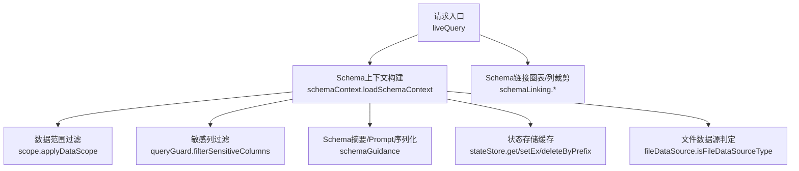
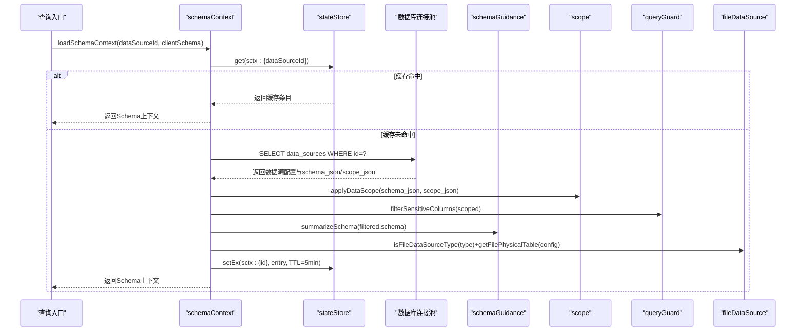
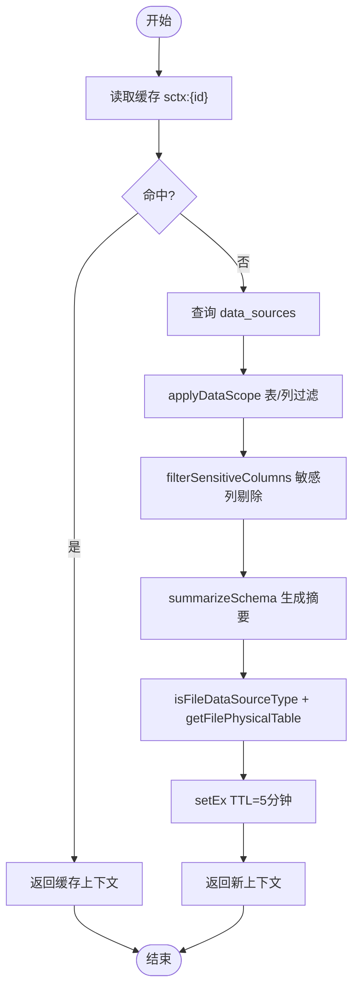
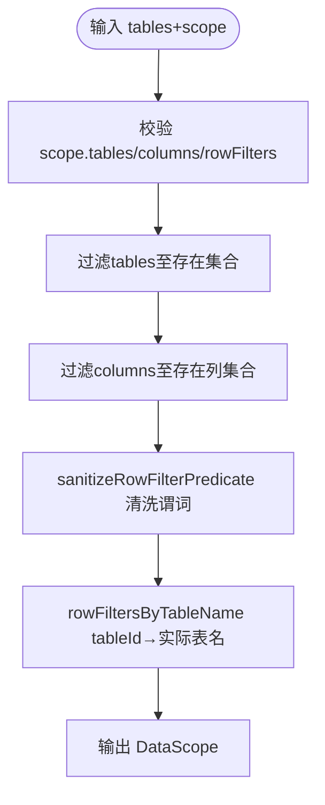
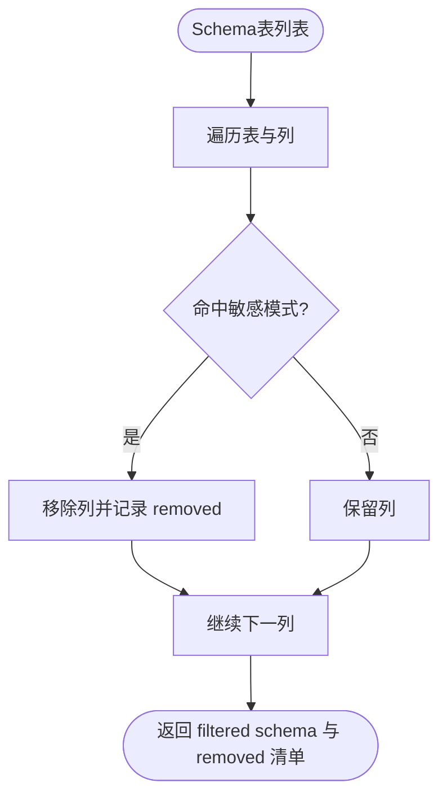
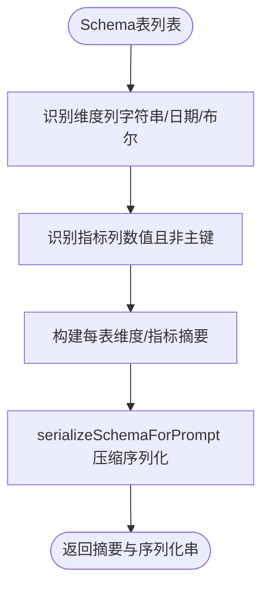
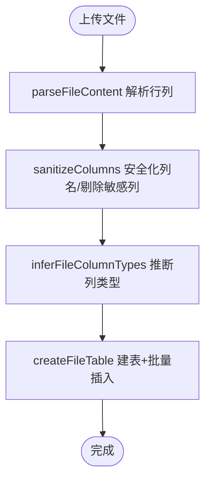
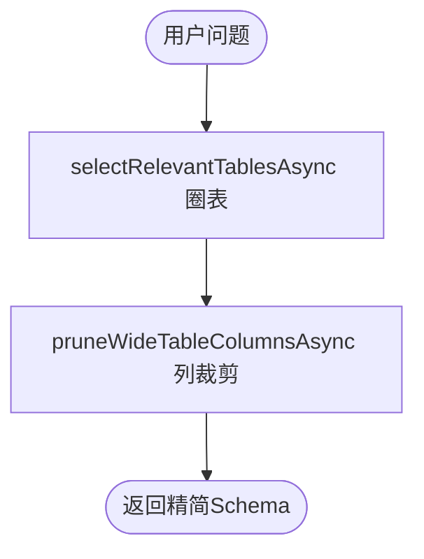
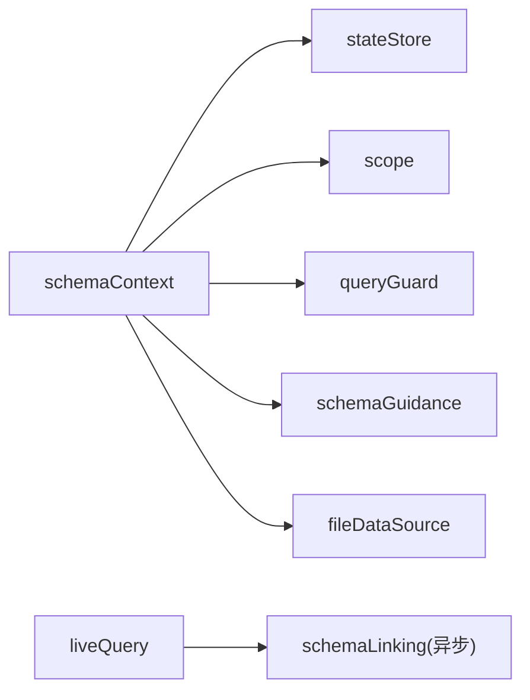

# Schema上下文构建

<cite>
**本文引用的文件**
- [server/query/schemaContext.ts](file://server/query/schemaContext.ts)
- [server/query/schemaGuidance.ts](file://server/query/schemaGuidance.ts)
- [server/query/scope.ts](file://server/query/scope.ts)
- [server/query/queryGuard.ts](file://server/query/queryGuard.ts)
- [server/infra/stateStore.ts](file://server/infra/stateStore.ts)
- [server/query/fileDataSource.ts](file://server/query/fileDataSource.ts)
- [server/query/liveQuery.ts](file://server/query/liveQuery.ts)
- [server/query/schemaLinking.test.ts](file://server/query/schemaLinking.test.ts)
- [server/query/schemaLinkingCache.test.ts](file://server/query/schemaLinkingCache.test.ts)
</cite>

## 目录
1. [简介](#简介)
2. [项目结构](#项目结构)
3. [核心组件](#核心组件)
4. [架构总览](#架构总览)
5. [详细组件分析](#详细组件分析)
6. [依赖关系分析](#依赖关系分析)
7. [性能考虑](#性能考虑)
8. [故障排查指南](#故障排查指南)
9. [结论](#结论)
10. [附录：扩展与优化示例](#附录：扩展与优化示例)

## 简介
本文件系统性阐述“Schema上下文构建”的完整实现，覆盖以下目标：
- 动态获取数据库Schema并进行缓存（含多实例共享、TTL过期、跨实例失效）
- 元数据提取、权限过滤（表级/列级/行级）、敏感字段识别
- Schema引导系统：将数据库结构转换为LLM可理解的提示词格式
- Schema链接算法：通过语义匹配提升查询准确性（圈表与宽表列裁剪）
- 缓存策略、增量更新、错误处理与降级路径
- 可扩展点：自定义字段映射、扩展现有Schema支持、优化查询性能

## 项目结构
围绕Schema上下文构建的关键模块分布如下：
- schemaContext：加载并缓存Schema上下文，串联scope白名单、敏感列过滤、摘要生成
- scope：数据范围（DataScope）过滤与行级权限谓词清洗/映射
- queryGuard：输入净化与敏感列特征识别
- schemaGuidance：Schema摘要、Prompt序列化、降维选择
- fileDataSource：文件数据源解析、落库物理表、类型推断与安全化
- stateStore：统一状态存储抽象（内存/Redis），提供TTL、前缀删除等能力
- liveQuery：调用schemaLinking进行圈表与宽表列裁剪（异步版本）
- schemaLinking.*：测试文件体现圈表与列裁剪逻辑及向量缓存行为

图表来源
- [server/query/schemaContext.ts:108-171](file://server/query/schemaContext.ts#L108-L171)
- [server/query/scope.ts:28-43](file://server/query/scope.ts#L28-L43)
- [server/query/queryGuard.ts:82-100](file://server/query/queryGuard.ts#L82-L100)
- [server/query/schemaGuidance.ts:26-36](file://server/query/schemaGuidance.ts#L26-L36)
- [server/infra/stateStore.ts:10-23](file://server/infra/stateStore.ts#L10-L23)
- [server/query/fileDataSource.ts:46-58](file://server/query/fileDataSource.ts#L46-L58)
- [server/query/liveQuery.ts:212-290](file://server/query/liveQuery.ts#L212-L290)

章节来源
- [server/query/schemaContext.ts:1-172](file://server/query/schemaContext.ts#L1-L172)
- [server/query/scope.ts:1-101](file://server/query/scope.ts#L1-L101)
- [server/query/queryGuard.ts:1-101](file://server/query/queryGuard.ts#L1-L101)
- [server/query/schemaGuidance.ts:1-122](file://server/query/schemaGuidance.ts#L1-L122)
- [server/infra/stateStore.ts:1-219](file://server/infra/stateStore.ts#L1-L219)
- [server/query/fileDataSource.ts:1-208](file://server/query/fileDataSource.ts#L1-L208)
- [server/query/liveQuery.ts:212-290](file://server/query/liveQuery.ts#L212-L290)

## 核心组件
- Schema上下文加载器：负责从数据源读取配置与Schema，应用权限与敏感过滤，生成摘要并写入缓存；若失败则回退到客户端提交的Schema。
- 数据范围过滤器：按表/列限制缩小Schema，同时清洗并映射行级权限谓词，确保执行层安全注入。
- 敏感列过滤器：基于正则模式识别疑似敏感列并从Schema中剔除，返回剔除清单用于UI标记与审计。
- Schema引导与序列化：生成紧凑的维度/指标摘要与Prompt友好的Schema序列化，控制长度避免Prompt膨胀。
- 状态存储抽象：统一内存/Redis两种实现，提供TTL、前缀删除、原子计数与分布式锁等能力。
- 文件数据源支持：解析CSV/Excel/JSON，安全化列名与类型推断，落库为物理表，参与真实SQL执行。
- Schema链接（圈表/列裁剪）：根据问题语义选择相关表与列，结合向量缓存减少重复计算。

章节来源
- [server/query/schemaContext.ts:18-81](file://server/query/schemaContext.ts#L18-L81)
- [server/query/scope.ts:10-15](file://server/query/scope.ts#L10-L15)
- [server/query/queryGuard.ts:71-100](file://server/query/queryGuard.ts#L71-L100)
- [server/query/schemaGuidance.ts:26-100](file://server/query/schemaGuidance.ts#L26-L100)
- [server/infra/stateStore.ts:10-23](file://server/infra/stateStore.ts#L10-L23)
- [server/query/fileDataSource.ts:46-58](file://server/query/fileDataSource.ts#L46-L58)

## 架构总览
下图展示Schema上下文构建在问数链路中的位置与交互：

图表来源
- [server/query/schemaContext.ts:108-171](file://server/query/schemaContext.ts#L108-L171)
- [server/infra/stateStore.ts:10-23](file://server/infra/stateStore.ts#L10-L23)
- [server/query/scope.ts:28-43](file://server/query/scope.ts#L28-L43)
- [server/query/queryGuard.ts:82-100](file://server/query/queryGuard.ts#L82-L100)
- [server/query/schemaGuidance.ts:26-36](file://server/query/schemaGuidance.ts#L26-L36)
- [server/query/fileDataSource.ts:46-58](file://server/query/fileDataSource.ts#L46-L58)

## 详细组件分析

### Schema上下文加载与缓存（schemaContext）
- 功能要点
  - 优先从状态存储读取缓存键 sctx:{dataSourceId}，命中直接返回
  - 未命中时查询数据源配置，应用scope白名单与敏感列过滤，生成摘要，写入缓存（TTL=5分钟）
  - 异常或无数据源时回退到客户端提交的Schema（演示模式）
  - 提供 invalidateSchemaCache 支持按数据源或全量前缀删除，配合Redis实现跨实例同步失效
  - 提供 isLiveCapableType 判断是否走真实SQL执行（mysql/postgresql/greenplum或文件已落物理表）
- 数据结构
  - CacheEntry 包含 schema、guidance、status、dsType、sensitiveRemoved、allowIntrospection、rowFilters、dataSourceName、fileBacked
  - SchemaContext 对外暴露上述字段，供上层使用
- 关键流程
  - 读取缓存 → 查库 → scope过滤 → 敏感过滤 → 摘要 → 写缓存 → 返回
  - 异常捕获后降级到 fromClientSchema

图表来源
- [server/query/schemaContext.ts:108-171](file://server/query/schemaContext.ts#L108-L171)
- [server/infra/stateStore.ts:10-23](file://server/infra/stateStore.ts#L10-L23)

章节来源
- [server/query/schemaContext.ts:18-81](file://server/query/schemaContext.ts#L18-L81)
- [server/query/schemaContext.ts:108-171](file://server/query/schemaContext.ts#L108-L171)

### 数据范围与行级权限（scope）
- 表/列白名单过滤：仅保留允许访问的表与列
- 行级权限谓词清洗：拒绝危险字符与SQL关键字片段，保证安全注入
- 行级权限映射：将tableId→实际表名，便于执行层AST注入WHERE片段
- 漂移容错：清理不存在的表/列引用，保持配置健壮性

图表来源
- [server/query/scope.ts:28-100](file://server/query/scope.ts#L28-L100)

章节来源
- [server/query/scope.ts:10-15](file://server/query/scope.ts#L10-L15)
- [server/query/scope.ts:28-43](file://server/query/scope.ts#L28-L43)
- [server/query/scope.ts:46-86](file://server/query/scope.ts#L46-L86)
- [server/query/scope.ts:92-100](file://server/query/scope.ts#L92-L100)

### 敏感列识别与过滤（queryGuard）
- 敏感列特征：基于正则匹配列名/描述，命中即从Schema剔除
- 返回剔除清单：供UI标注与审计追踪
- 输入净化与历史净化：防止提示注入与控制字符污染

图表来源
- [server/query/queryGuard.ts:71-100](file://server/query/queryGuard.ts#L71-L100)

章节来源
- [server/query/queryGuard.ts:71-100](file://server/query/queryGuard.ts#L71-L100)

### Schema引导与Prompt序列化（schemaGuidance）
- 维度/指标摘要：自动识别维度列与指标列，生成紧凑摘要注入Prompt
- Prompt序列化：压缩Schema结构，去除冗余字段，降低Prompt体积
- 表/列选择辅助：pickTableForQuery、pickFallbackAxes 用于降级场景

图表来源
- [server/query/schemaGuidance.ts:26-36](file://server/query/schemaGuidance.ts#L26-L36)
- [server/query/schemaGuidance.ts:90-100](file://server/query/schemaGuidance.ts#L90-L100)

章节来源
- [server/query/schemaGuidance.ts:26-36](file://server/query/schemaGuidance.ts#L26-L36)
- [server/query/schemaGuidance.ts:90-100](file://server/query/schemaGuidance.ts#L90-L100)

### 文件数据源支持（fileDataSource）
- 解析CSV/Excel/JSON：统一行列结构，截断超限行/列
- 列安全化：非法标识符改名为fN，保留原表头于description；敏感列整列剔除
- 类型推断：样本统计推断DOUBLE/TEXT
- 物理表管理：创建upl_前缀物理表，参数化批量插入，级联删除

图表来源
- [server/query/fileDataSource.ts:78-109](file://server/query/fileDataSource.ts#L78-L109)
- [server/query/fileDataSource.ts:139-201](file://server/query/fileDataSource.ts#L139-L201)

章节来源
- [server/query/fileDataSource.ts:46-58](file://server/query/fileDataSource.ts#L46-L58)
- [server/query/fileDataSource.ts:78-109](file://server/query/fileDataSource.ts#L78-L109)
- [server/query/fileDataSource.ts:139-201](file://server/query/fileDataSource.ts#L139-L201)

### Schema链接算法（圈表与宽表列裁剪）
- 圈表：根据问题语义选择最相关的表，限制最大数量，保持顺序稳定
- 宽表列裁剪：对超列宽表进行top-N裁剪，保留主键与指标引用列，维持原列顺序
- 向量缓存：表/列摘要向量化结果按内容指纹缓存，编辑单表/列仅重算受影响项

图表来源
- [server/query/liveQuery.ts:212-290](file://server/query/liveQuery.ts#L212-L290)
- [server/query/schemaLinkingCache.test.ts:48-95](file://server/query/schemaLinkingCache.test.ts#L48-L95)
- [server/query/schemaLinkingCache.test.ts:97-128](file://server/query/schemaLinkingCache.test.ts#L97-L128)
- [server/query/schemaLinking.test.ts:21-59](file://server/query/schemaLinking.test.ts#L21-L59)
- [server/query/schemaLinking.test.ts:76-113](file://server/query/schemaLinking.test.ts#L76-L113)

章节来源
- [server/query/schemaLinking.test.ts:21-59](file://server/query/schemaLinking.test.ts#L21-L59)
- [server/query/schemaLinking.test.ts:76-113](file://server/query/schemaLinking.test.ts#L76-L113)
- [server/query/schemaLinkingCache.test.ts:48-95](file://server/query/schemaLinkingCache.test.ts#L48-L95)
- [server/query/schemaLinkingCache.test.ts:97-128](file://server/query/schemaLinkingCache.test.ts#L97-L128)

## 依赖关系分析
- schemaContext 依赖：
  - stateStore：缓存读写与前缀删除
  - scope：表/列/行级权限过滤
  - queryGuard：敏感列过滤
  - schemaGuidance：摘要与Prompt序列化
  - fileDataSource：文件数据源类型与物理表判定
- liveQuery 依赖：
  - schemaLinking（异步版）：圈表与列裁剪
- stateStore 提供：
  - MemoryStateStore（默认）与 RedisStateStore（REDIS_URL启用）
  - TTL、getDel、deleteByPrefix、incrWindow、acquireLock/releaseLock

图表来源
- [server/query/schemaContext.ts:108-171](file://server/query/schemaContext.ts#L108-L171)
- [server/query/liveQuery.ts:212-290](file://server/query/liveQuery.ts#L212-L290)
- [server/infra/stateStore.ts:10-23](file://server/infra/stateStore.ts#L10-L23)

章节来源
- [server/query/schemaContext.ts:108-171](file://server/query/schemaContext.ts#L108-L171)
- [server/query/liveQuery.ts:212-290](file://server/query/liveQuery.ts#L212-L290)
- [server/infra/stateStore.ts:10-23](file://server/infra/stateStore.ts#L10-L23)

## 性能考虑
- 缓存策略
  - Schema上下文缓存TTL=5分钟，键前缀 sctx:{dataSourceId}
  - 支持按前缀批量删除，跨实例共享（Redis）或进程内一致（Memory）
- 增量更新
  - 编辑数据源后调用 invalidateSchemaCache 触发失效，仅重算受影响项
  - Schema链接向量缓存按表/列粒度失效，编辑单列仅重算该列
- 宽表裁剪
  - 超过阈值的宽表进行列级裁剪，保留主键与指标引用列，控制Prompt体积
- 并发与韧性
  - LLM调用具备熔断、重试、信号量排队与自适应超时，避免雪崩
- 文件数据源
  - 行/列上限截断，批量参数化写入，避免应用库膨胀与注入风险

[本节为通用性能讨论，不直接分析具体文件]

## 故障排查指南
- 缓存未命中或损坏
  - 检查状态存储是否可用（Redis/Memory），确认键前缀与TTL设置
  - 若缓存体解析失败，会回退到客户端Schema
- 权限过滤异常
  - 检查scope.tables/columns是否与实际Schema一致，必要时运行 sanitizeDataScope 清理漂移
  - 行级权限谓词需通过 sanitizeRowFilterPredicate 校验，避免危险字符
- 敏感列误删
  - 调整敏感列正则或业务说明，确保不会误伤正常业务列
- 文件数据源导入失败
  - 检查文件格式、行数/列数上限、列名安全化规则与敏感列匹配
- LLM调用失败
  - 查看熔断与重试日志，确认引擎配置与密钥，必要时切换备用引擎

章节来源
- [server/query/schemaContext.ts:167-171](file://server/query/schemaContext.ts#L167-L171)
- [server/query/scope.ts:18-26](file://server/query/scope.ts#L18-L26)
- [server/query/queryGuard.ts:27-53](file://server/query/queryGuard.ts#L27-L53)
- [server/query/fileDataSource.ts:78-109](file://server/query/fileDataSource.ts#L78-L109)
- [server/infra/stateStore.ts:169-187](file://server/infra/stateStore.ts#L169-L187)

## 结论
Schema上下文构建通过“缓存+过滤+摘要+链接”的组合策略，实现了高效、安全、可扩展的数据源结构注入。其设计兼顾了多实例一致性、增量更新、Prompt瘦身与宽表优化，并在文件数据源场景中提供了真实执行能力。通过清晰的职责划分与统一的类型规范，系统具备良好的可维护性与扩展性。

[本节为总结性内容，不直接分析具体文件]

## 附录：扩展与优化示例
- 扩展Schema支持
  - 新增数据源类型：在 isLiveCapableType 中添加类型分支，或在 fileDataSource 中扩展解析与落库逻辑
  - 自定义字段映射：在 schemaGuidance 中扩展维度/指标识别规则，或调整 serializeSchemaForPrompt 的序列化字段
- 自定义字段映射
  - 在 scope 中为特定表配置 columns 白名单，或使用 rowFilters 注入行级权限
  - 在 queryGuard 中扩展敏感列正则以适配新的敏感字段命名约定
- 优化查询性能
  - 调整缓存TTL与失效策略，结合业务热点数据源缩短或延长有效期
  - 利用 schemaLinking 的向量缓存与宽表列裁剪，减少Prompt体积与计算开销
  - 合理配置LLM调用并发与熔断阈值，避免资源争用

章节来源
- [server/query/schemaContext.ts:75-81](file://server/query/schemaContext.ts#L75-L81)
- [server/query/fileDataSource.ts:46-58](file://server/query/fileDataSource.ts#L46-L58)
- [server/query/schemaGuidance.ts:26-36](file://server/query/schemaGuidance.ts#L26-L36)
- [server/query/scope.ts:28-43](file://server/query/scope.ts#L28-L43)
- [server/query/queryGuard.ts:71-100](file://server/query/queryGuard.ts#L71-L100)
- [server/query/schemaLinkingCache.test.ts:48-95](file://server/query/schemaLinkingCache.test.ts#L48-L95)
- [server/query/schemaLinkingCache.test.ts:97-128](file://server/query/schemaLinkingCache.test.ts#L97-L128)