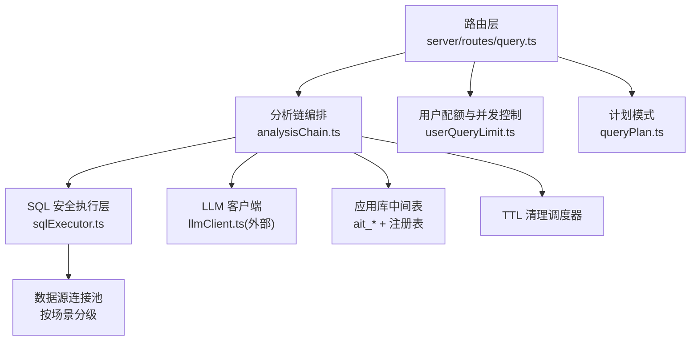
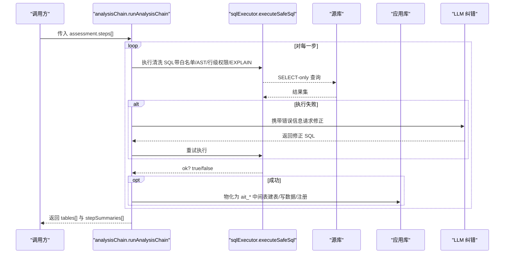
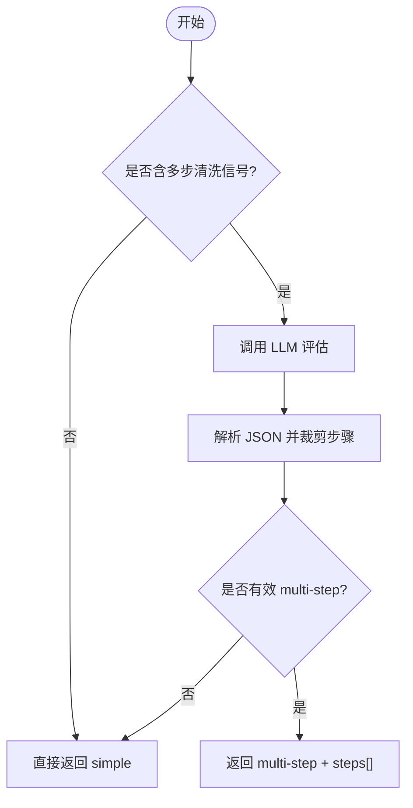
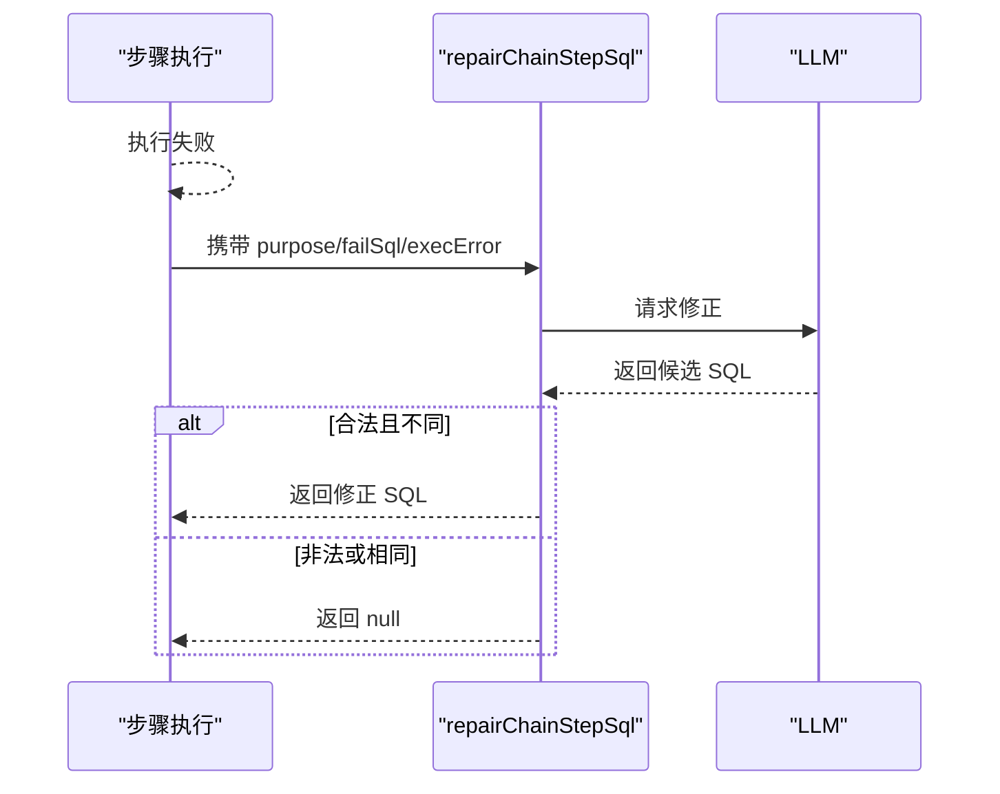
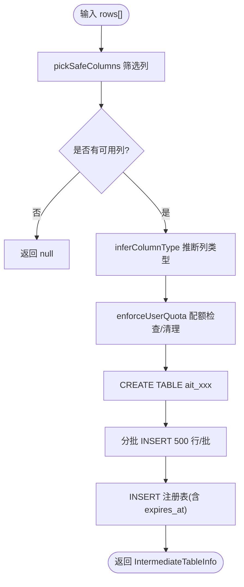
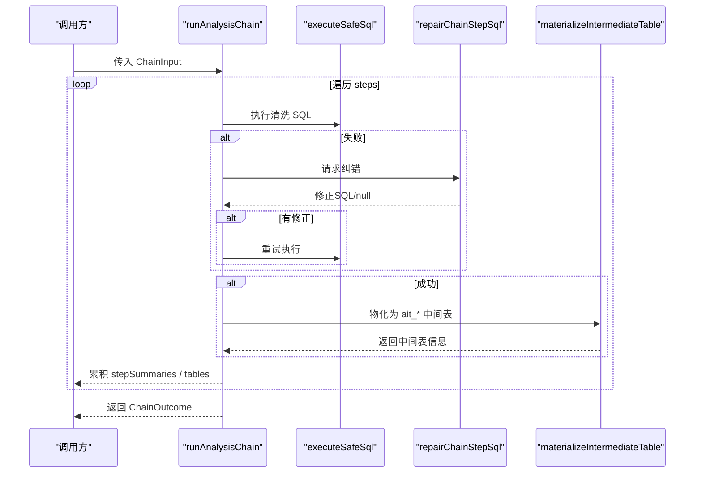
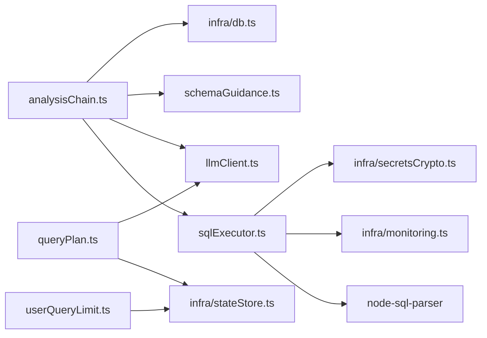

# 分析链处理

<cite>
**本文引用的文件**
- [analysisChain.ts](file://server/query/analysisChain.ts)
- [sqlExecutor.ts](file://server/query/sqlExecutor.ts)
- [sqlTemplates.ts](file://server/query/sqlTemplates.ts)
- [queryPlan.ts](file://server/query/queryPlan.ts)
- [userQueryLimit.ts](file://server/infra/userQueryLimit.ts)
- [query.ts](file://server/routes/query.ts)
- [analysisChain.test.ts](file://server/query/analysisChain.test.ts)
</cite>

## 目录
1. [简介](#简介)
2. [项目结构](#项目结构)
3. [核心组件](#核心组件)
4. [架构总览](#架构总览)
5. [详细组件分析](#详细组件分析)
6. [依赖关系分析](#依赖关系分析)
7. [性能考量](#性能考量)
8. [故障排查指南](#故障排查指南)
9. [结论](#结论)
10. [附录](#附录)

## 简介
本文件聚焦 M3 中间表清洗链的完整工作机制，覆盖复杂度评估、多步清洗计划生成、SQL 纠错重试、中间表物化与生命周期管理（用户配额、TTL 清理）、以及应用库侧执行校验等关键环节。文档同时给出可操作的配置建议、监控指标与排错要点，帮助读者快速理解并安全使用分析链能力。

## 项目结构
围绕“分析链”的核心代码主要分布在以下模块：
- server/query/analysisChain.ts：清洗链编排、复杂度评估、中间表物化、TTL 清理、应用库执行校验
- server/query/sqlExecutor.ts：SQL 安全执行层（白名单、AST 校验、行级权限注入、EXPLAIN 防线、场景化连接池与超时）
- server/query/sqlTemplates.ts：参数化 SQL 模板（用于复杂查询构建）
- server/query/queryPlan.ts：M2 计划模式（先出计划后执行），含 TTL 存储与一次性消费
- server/infra/userQueryLimit.ts：用户级频率与并发控制
- server/routes/query.ts：问数路由入口，串联 L1-L6 防护与 SSE 流式事件

图表来源
- [analysisChain.ts:1-411](file://server/query/analysisChain.ts#L1-L411)
- [sqlExecutor.ts:1-832](file://server/query/sqlExecutor.ts#L1-L832)
- [queryPlan.ts:1-184](file://server/query/queryPlan.ts#L1-L184)
- [userQueryLimit.ts:1-98](file://server/infra/userQueryLimit.ts#L1-L98)
- [query.ts:47-200](file://server/routes/query.ts#L47-L200)

章节来源
- [analysisChain.ts:1-411](file://server/query/analysisChain.ts#L1-L411)
- [sqlExecutor.ts:1-832](file://server/query/sqlExecutor.ts#L1-L832)
- [queryPlan.ts:1-184](file://server/query/queryPlan.ts#L1-L184)
- [userQueryLimit.ts:1-98](file://server/infra/userQueryLimit.ts#L1-L98)
- [query.ts:47-200](file://server/routes/query.ts#L47-L200)

## 核心组件
- 复杂度评估与启发式预门控：assessComplexity、hasMultiStepSignal
- 多步清洗计划解析与约束：parseAssessment、MAX_CHAIN_STEPS
- SQL 纠错重试：repairChainStepSql
- 中间表物化：materializeIntermediateTable（建表、列类型推断、敏感列剔除、批量写入、注册）
- 应用库执行校验：executeOnAppDb（仅 SELECT、白名单 ait_*、LIMIT 保护）
- 生命周期管理：enforceUserQuota（每用户最多 N 张）、cleanupExpiredIntermediateTables（TTL 清理）、startChainCleanupScheduler（定时任务）
- 安全执行层复用：executeSafeSql（SELECT-only、白名单、AST 复核、行级权限注入、EXPLAIN 防线、场景化超时）

章节来源
- [analysisChain.ts:47-112](file://server/query/analysisChain.ts#L47-L112)
- [analysisChain.ts:114-156](file://server/query/analysisChain.ts#L114-L156)
- [analysisChain.ts:158-253](file://server/query/analysisChain.ts#L158-L253)
- [analysisChain.ts:255-384](file://server/query/analysisChain.ts#L255-L384)
- [analysisChain.ts:386-411](file://server/query/analysisChain.ts#L386-L411)
- [sqlExecutor.ts:24-110](file://server/query/sqlExecutor.ts#L24-L110)
- [sqlExecutor.ts:155-387](file://server/query/sqlExecutor.ts#L155-L387)
- [sqlExecutor.ts:531-662](file://server/query/sqlExecutor.ts#L531-L662)
- [sqlExecutor.ts:734-800](file://server/query/sqlExecutor.ts#L734-L800)

## 架构总览
分析链在“智能问数”主链路中作为可选增强路径：当问题被判定为需要多步清洗时，系统会先生成清洗步骤计划，逐条在源库安全执行，结果物化为应用库中的 ait_* 中间表；最终回答阶段可引用这些中间表进行高效聚合与展示。

图表来源
- [analysisChain.ts:255-326](file://server/query/analysisChain.ts#L255-L326)
- [sqlExecutor.ts:734-800](file://server/query/sqlExecutor.ts#L734-L800)

## 详细组件分析

### 复杂度评估与启发式预门控
- 目标：避免对简单问题触发昂贵的 LLM 评估。
- 策略：
  - 关键词信号匹配：若问题包含“去重/标准化/异常值/剔除/清洗/分位数/先去重再…”等信号，则进入 LLM 评估；否则直接判定 simple。
  - 环境变量开关：ASSESS_ALWAYS_LLM=1 强制走 LLM；opts.force 也可强制。
  - LLM 输出解析：仅接受 JSON，限制 steps 数量与长度，过滤非 SELECT 或非法步骤。
- 复杂度：O(n) 字符串扫描（正则匹配）+ 一次 LLM 调用（命中信号时）。

图表来源
- [analysisChain.ts:83-112](file://server/query/analysisChain.ts#L83-L112)

章节来源
- [analysisChain.ts:83-112](file://server/query/analysisChain.ts#L83-L112)
- [analysisChain.test.ts:72-95](file://server/query/analysisChain.test.ts#L72-L95)

### 多步清洗计划生成与约束
- 最大步数：MAX_CHAIN_STEPS = 3，防止过长链路导致延迟与资源占用。
- 步骤约束：每条 sql 必须为 SELECT，长度上限 4000，purpose 截断至 200 字符。
- 安全：步骤只允许访问 Schema 中的真实表与列，禁止敏感字段。

章节来源
- [analysisChain.ts:22-30](file://server/query/analysisChain.ts#L22-L30)
- [analysisChain.ts:66-81](file://server/query/analysisChain.ts#L66-L81)

### SQL 纠错重试
- 触发条件：单步 executeSafeSql 返回失败。
- 机制：将“用途 + 失败 SQL + 错误信息”发给 LLM，要求返回修正后的 SELECT；若返回与原 SQL 相同或非法则放弃重试。
- 目的：应对模型偶发编造列名/表名导致的 Unknown column 等错误。

图表来源
- [analysisChain.ts:114-156](file://server/query/analysisChain.ts#L114-L156)

章节来源
- [analysisChain.ts:114-156](file://server/query/analysisChain.ts#L114-L156)
- [analysisChain.test.ts:225-312](file://server/query/analysisChain.test.ts#L225-L312)

### 中间表物化与生命周期管理
- 列选择与安全：pickSafeColumns 仅保留合法标识符且剔除敏感列。
- 列类型推断：inferColumnType 基于样本统计，数值占比高则 DOUBLE，否则 TEXT。
- 值规整：toCellValue 统一空值、DOUBLE 非数值转 null、字符串截断。
- 配额控制：enforceUserQuota 超过 MAX_TABLES_PER_USER 时删除最旧中间表（物理表 + 注册条目）。
- 物化流程：CREATE TABLE -> 分批 INSERT（500 行/批）-> 注册到 analysis_intermediate_tables（含 expires_at）。
- TTL 清理：cleanupExpiredIntermediateTables 定时删除过期中间表；startChainCleanupScheduler 每小时执行。

图表来源
- [analysisChain.ts:158-253](file://server/query/analysisChain.ts#L158-L253)

章节来源
- [analysisChain.ts:158-253](file://server/query/analysisChain.ts#L158-L253)
- [analysisChain.ts:386-411](file://server/query/analysisChain.ts#L386-L411)
- [analysisChain.test.ts:139-188](file://server/query/analysisChain.test.ts#L139-L188)
- [analysisChain.test.ts:315-327](file://server/query/analysisChain.test.ts#L315-L327)

### 应用库执行校验（仅 ait_* 中间表）
- 规则：仅允许单条 SELECT；拒绝 INTO、危险关键字；必须引用已注册的 ait_* 表；自动补齐 LIMIT 500。
- 作用：确保最终查询在应用库安全执行，不越权访问源库。

章节来源
- [analysisChain.ts:328-384](file://server/query/analysisChain.ts#L328-L384)

### 清洗链编排 runAnalysisChain
- 步骤执行：遍历 assessment.steps，调用 executeSafeSql 执行；失败则尝试 repairChainStepSql 一次；成功后物化为中间表。
- 错误处理：记录 stepSummaries，onTrace 回调上报中间步骤状态；失败步骤不阻断后续步骤。
- 结果收集：tables[] 保存成功物化的中间表元信息；stepSummaries[] 包含每步 SQL、行数、耗时、是否成功及错误信息。

图表来源
- [analysisChain.ts:255-326](file://server/query/analysisChain.ts#L255-L326)

章节来源
- [analysisChain.ts:255-326](file://server/query/analysisChain.ts#L255-L326)
- [analysisChain.test.ts:190-313](file://server/query/analysisChain.test.ts#L190-L313)

### 与 SQL 安全执行层的集成
- 复用 executeSafeSql：保证 SELECT-only、白名单、AST 复核、行级权限注入、EXPLAIN 防线、场景化超时。
- 场景：分析链使用 scenario='chain'，获得更长的默认超时与独立的连接池配额，避免阻塞交互查询。

章节来源
- [sqlExecutor.ts:61-109](file://server/query/sqlExecutor.ts#L61-L109)
- [sqlExecutor.ts:734-800](file://server/query/sqlExecutor.ts#L734-L800)

### 与计划模式的协同
- M2 计划模式：先生成 QueryPlan（steps、relatedTables、complexity），经用户批准后以 planId 提交执行；具备 TTL 与一次性消费防重放。
- 与清洗链的关系：清洗链可在“clean”类步骤中落地中间表，供后续步骤或最终查询引用。

章节来源
- [queryPlan.ts:1-184](file://server/query/queryPlan.ts#L1-L184)

### 用户配额与并发控制
- 频率限制：checkUserQueryLimit 实现每小时滑动窗口（内存）或固定小时窗口（Redis），默认 20 次/小时。
- 并发互斥：acquireQuerySlot/releaseQuerySlot 保证同一用户同一时间仅一个查询进行中；支持分布式锁与进程内 token 释放。
- 路由集成：/api/query/natural-language 在进入 L3 上下文前完成配额与并发槽检查。

章节来源
- [userQueryLimit.ts:1-98](file://server/infra/userQueryLimit.ts#L1-L98)
- [query.ts:97-116](file://server/routes/query.ts#L97-L116)

## 依赖关系分析
- analysisChain.ts 依赖：
  - sqlExecutor.ts：executeSafeSql、stripCommentsAndStrings、extractTableRefs、FORBIDDEN_KEYWORD_RE
  - llmClient.ts：callLLMJson、sqlStageRoute（外部模块）
  - schemaGuidance.ts：serializeSchemaForPrompt（外部模块）
  - infra/db.ts：getPool（应用库连接）
- sqlExecutor.ts 依赖：
  - node-sql-parser：AST 解析与表引用提取
  - infra/db.ts：应用库连接（文件数据源）
  - infra/monitoring.ts：埋点 observeSqlExec、observeExplainGuard
  - infra/secretsCrypto.ts：解密数据源密码
- queryPlan.ts 依赖：
  - stateStore.ts：Redis/内存存储计划
  - llmClient.ts：callLLMJson
- userQueryLimit.ts 依赖：
  - stateStore.ts：Redis 计数与分布式锁

图表来源
- [analysisChain.ts:1-20](file://server/query/analysisChain.ts#L1-L20)
- [sqlExecutor.ts:11-21](file://server/query/sqlExecutor.ts#L11-L21)
- [queryPlan.ts:7-11](file://server/query/queryPlan.ts#L7-L11)
- [userQueryLimit.ts:7-8](file://server/infra/userQueryLimit.ts#L7-L8)

章节来源
- [analysisChain.ts:1-20](file://server/query/analysisChain.ts#L1-L20)
- [sqlExecutor.ts:11-21](file://server/query/sqlExecutor.ts#L11-L21)
- [queryPlan.ts:7-11](file://server/query/queryPlan.ts#L7-L11)
- [userQueryLimit.ts:7-8](file://server/infra/userQueryLimit.ts#L7-L8)

## 性能考量
- 复杂度评估优化：无清洗信号时直接返回 simple，避免一次 LLM 调用；可通过 ASSESS_ALWAYS_LLM 或 force 恢复全量评估。
- 执行超时与连接池：
  - 场景化超时：interactive=15s、chain=120s、export=60s；可通过 QUERY_TIMEOUT_*_MS 覆盖。
  - 连接池容量：DS_POOL_MAX 决定总量，chain/export 按比例分配；可通过 DS_POOL_CHAIN/EXPORT/INTERACTIVE 显式设置。
- EXPLAIN 防线：预估扫描行数超阈值拦截，防止大扫描拖垮业务库；可通过 SQL_EXPLAIN_MAX_ROWS 调整。
- 中间表物化：
  - 批量写入：500 行/批，降低往返开销。
  - 列类型推断：减少不必要的 CAST，提升查询效率。
  - TTL 清理：每小时清理过期中间表，释放空间。
- 应用库执行：
  - 强制 LIMIT 500，避免大结果集回传。
  - 仅允许 ait_* 中间表，缩小攻击面。

[本节为通用性能指导，不直接分析具体文件]

## 故障排查指南
- 常见问题定位：
  - 步骤执行失败：查看 stepSummaries 中的 error 字段；若为 Unknown column，确认是否触发了纠错重试。
  - 中间表未创建：检查 pickSafeColumns 是否因敏感列全部剔除导致无可用列；确认 enforceUserQuota 是否触发了旧表删除。
  - 应用库执行失败：确认 SQL 是否仅引用已注册的 ait_* 表；检查 FORBIDDEN_KEYWORD_RE 是否误拦。
  - 配额超限：检查用户每小时次数是否达到上限；确认 Redis/内存模式是否正常。
- 日志与埋点：
  - 观察 explain-guard 埋点（blocked/passed/error）判断是否被 EXPLAIN 防线拦截。
  - 观察 SQL 执行埋点 observeSqlExec 的耗时与成败。
- 调试建议：
  - 开启 ASSESS_ALWAYS_LLM=1 强制评估，便于复现复杂问题。
  - 通过 onTrace 回调收集每步输入/输出摘要与耗时，辅助前端展示与诊断。

章节来源
- [analysisChain.ts:255-326](file://server/query/analysisChain.ts#L255-L326)
- [sqlExecutor.ts:531-662](file://server/query/sqlExecutor.ts#L531-L662)
- [userQueryLimit.ts:23-48](file://server/infra/userQueryLimit.ts#L23-L48)

## 结论
M3 中间表清洗链通过“启发式预门控 + LLM 评估 + 安全执行层 + 中间表物化 + 生命周期管理”的组合，实现了复杂分析的可扩展、可控与可观测。其设计在保证安全的前提下，显著提升了复杂问题的回答质量与执行效率；配合用户配额、并发控制与 TTL 清理，形成了完整的闭环治理体系。

[本节为总结性内容，不直接分析具体文件]

## 附录

### 配置与示例指引
- 复杂度评估开关：
  - 环境变量：ASSESS_ALWAYS_LLM=1 强制每次评估；默认关闭，依赖关键词信号。
  - 函数参数：assessComplexity(question, schema, { force: true }) 强制走 LLM。
- 分析链参数：
  - 最大步数：MAX_CHAIN_STEPS = 3（不可配置，硬编码）。
  - 每步行数上限：CHAIN_MAX_ROWS = 5000（由 executeSafeSql 的 maxRows 控制）。
  - TTL：CHAIN_TTL_MS = 24h（注册表 expires_at 字段）。
  - 用户配额：MAX_TABLES_PER_USER = 10（超出删除最旧）。
- 执行层配置：
  - 场景超时：QUERY_TIMEOUT_INTERACTIVE_MS / QUERY_TIMEOUT_CHAIN_MS / QUERY_TIMEOUT_EXPORT_MS。
  - 连接池容量：DS_POOL_MAX 与 DS_POOL_CHAIN / EXPORT / INTERACTIVE。
  - EXPLAIN 防线：SQL_EXPLAIN_MAX_ROWS（默认 100 万，export 场景放宽 10 倍）。
- 自定义 SQL 模板：
  - 参考 sqlTemplates.ts 中的 AVAILABLE_TEMPLATES，定义 id、label、description、paramSchema、buildSql。
  - 通过 validateTemplateParams 校验参数，再由 buildSql 生成确定性 SQL。
- 监控与追踪：
  - 使用 onTrace 回调收集每步标题、SQL、行数、耗时与状态。
  - 结合 observeSqlExec 与 observeExplainGuard 埋点分析性能与拦截原因。

章节来源
- [analysisChain.ts:16-20](file://server/query/analysisChain.ts#L16-L20)
- [analysisChain.ts:97-112](file://server/query/analysisChain.ts#L97-L112)
- [analysisChain.ts:218-253](file://server/query/analysisChain.ts#L218-L253)
- [sqlExecutor.ts:61-109](file://server/query/sqlExecutor.ts#L61-L109)
- [sqlExecutor.ts:531-540](file://server/query/sqlExecutor.ts#L531-L540)
- [sqlTemplates.ts:1-119](file://server/query/sqlTemplates.ts#L1-L119)