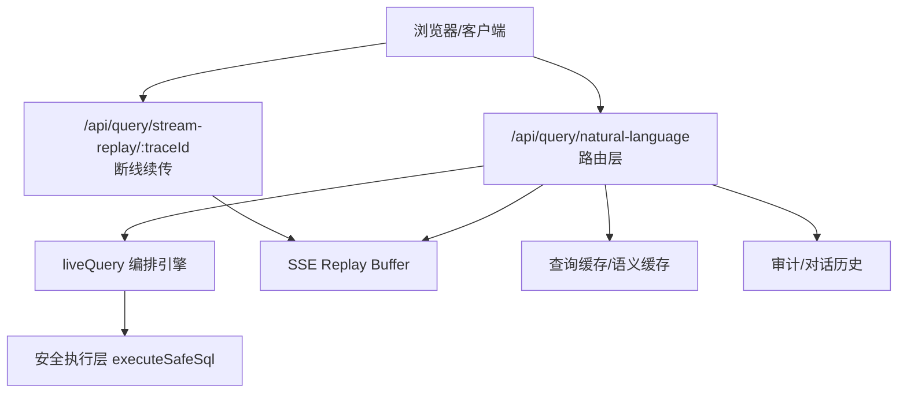
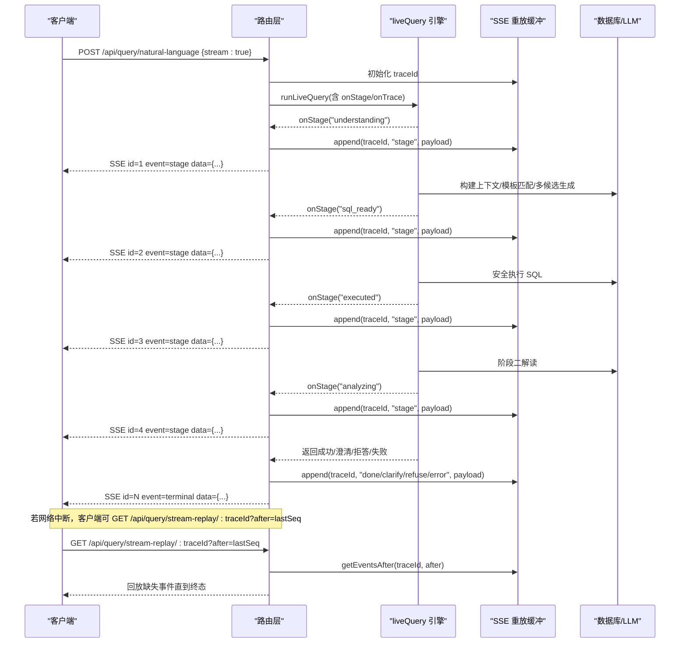
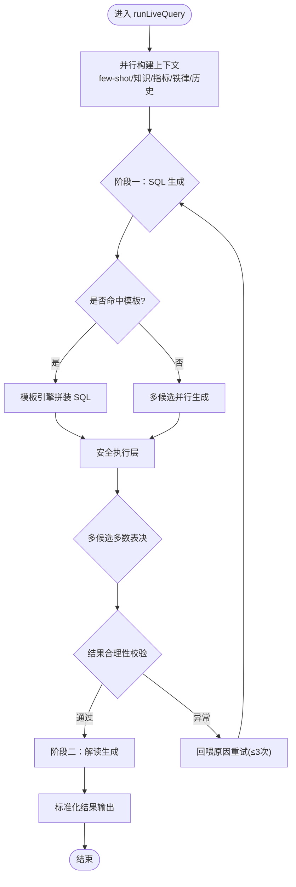
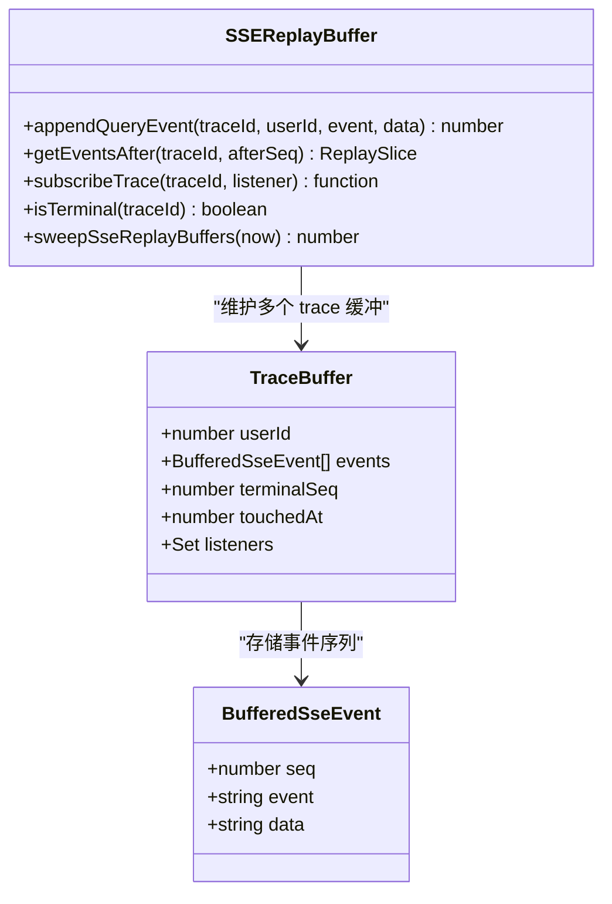
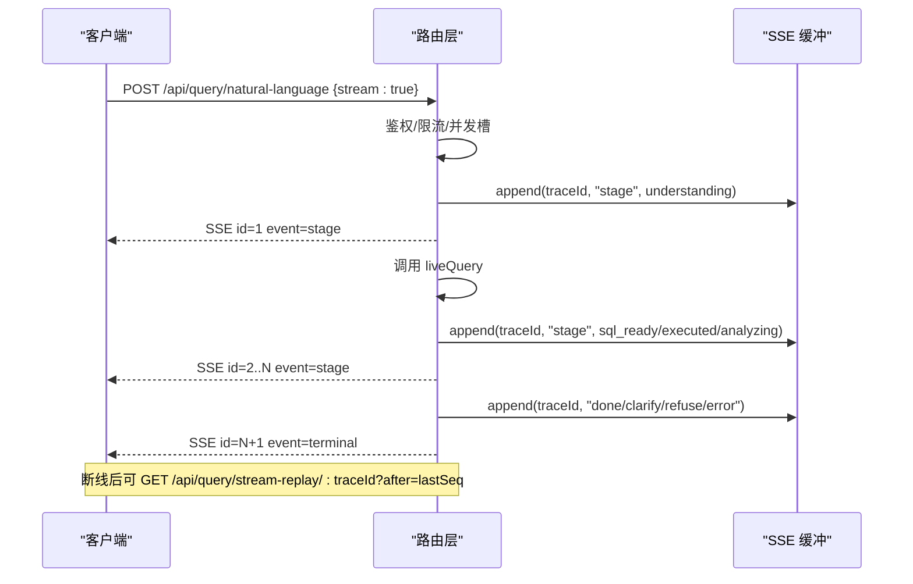
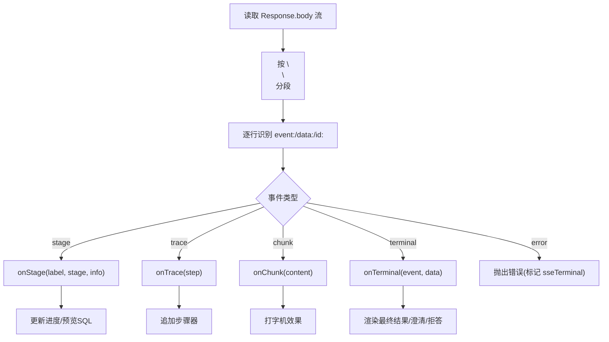
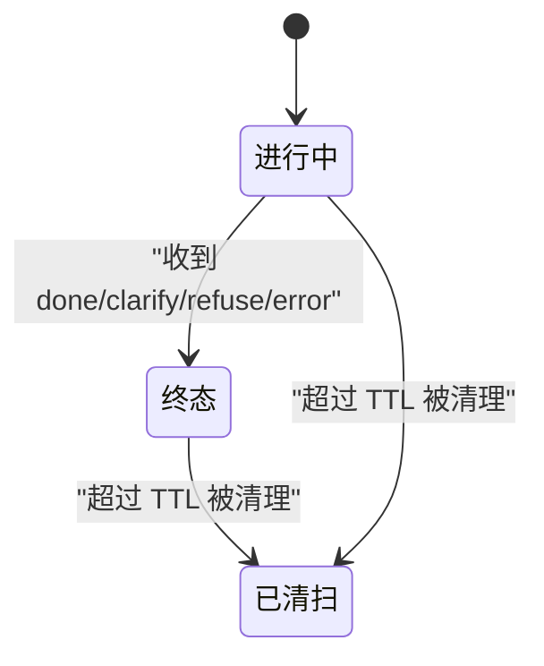
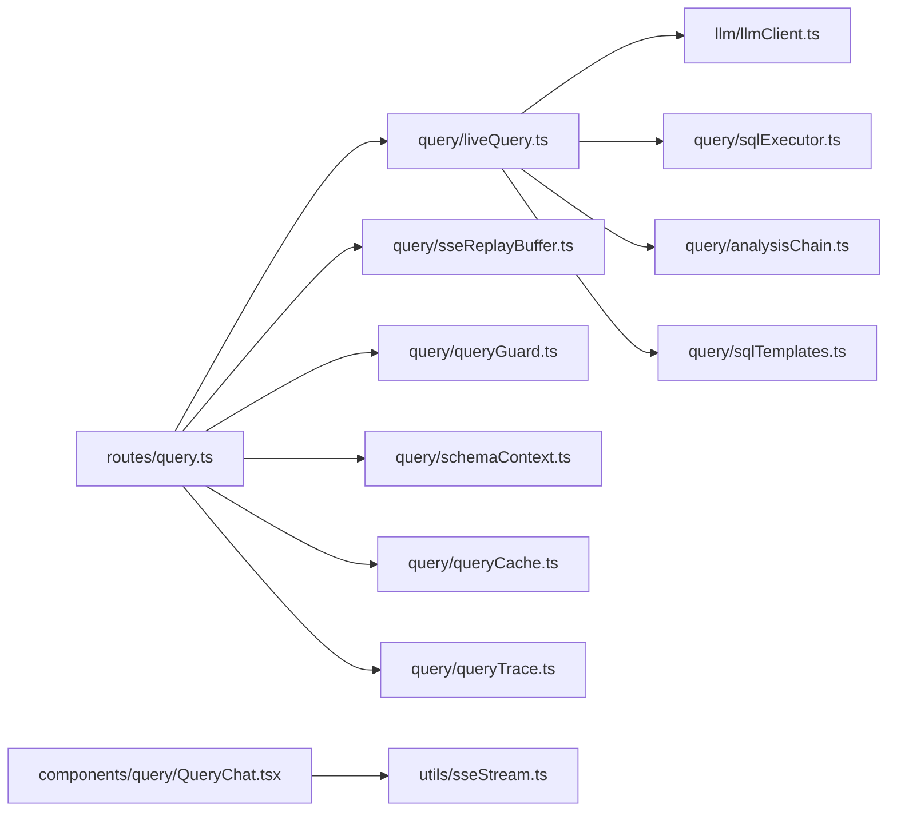

# 实时查询

<cite>
**本文引用的文件**
- [server/routes/query.ts](file://server/routes/query.ts)
- [server/query/liveQuery.ts](file://server/query/liveQuery.ts)
- [server/query/sseReplayBuffer.ts](file://server/query/sseReplayBuffer.ts)
- [src/utils/sseStream.ts](file://src/utils/sseStream.ts)
- [src/components/query/QueryChat.tsx](file://src/components/query/QueryChat.tsx)
- [server/query/liveQuery.test.ts](file://server/query/liveQuery.test.ts)
- [server/query/sseReplayBuffer.test.ts](file://server/query/sseReplayBuffer.test.ts)
</cite>

## 目录
1. [简介](#简介)
2. [项目结构](#项目结构)
3. [核心组件](#核心组件)
4. [架构总览](#架构总览)
5. [详细组件分析](#详细组件分析)
6. [依赖关系分析](#依赖关系分析)
7. [性能考量](#性能考量)
8. [故障排查指南](#故障排查指南)
9. [结论](#结论)
10. [附录](#附录)

## 简介
本文件聚焦“实时查询”能力，系统性解析 SSE（Server-Sent Events）流式响应在智能问数链路中的实现原理与工程实践。内容覆盖：
- 数据推送机制：阶段事件、推导步骤、终端事件的流式下发
- 客户端重连与断线续传：基于 Last-Event-ID 语义的重放缓冲
- 消息缓冲设计：SSE Replay Buffer 的序号、终态、TTL 与订阅机制
- liveQuery 模块工作流：从查询接收到结果推送的完整链路
- 集成示例：如何在前端消费 SSE、处理事件、优化传输
- 错误处理、资源管理、并发控制等关键技术点

## 项目结构
实时查询由“服务端路由 + 编排引擎 + 重放缓冲 + 前端 SSE 消费者”组成：
- 服务端路由：接收请求、鉴权限流、开启 SSE、调用编排引擎、写入审计与缓存
- 编排引擎：两阶段 LLM 生成 SQL 并安全执行，产出图表配置与解读
- 重放缓冲：按 traceId 记录事件序列，支持断线续传
- 前端消费者：解析 SSE 文本流，渲染进度、步骤器、最终结果

**图示来源**
- [server/routes/query.ts:47-393](file://server/routes/query.ts#L47-L393)
- [server/query/liveQuery.ts:189-748](file://server/query/liveQuery.ts#L189-L748)
- [server/query/sseReplayBuffer.ts:41-132](file://server/query/sseReplayBuffer.ts#L41-L132)

**章节来源**
- [server/routes/query.ts:47-393](file://server/routes/query.ts#L47-L393)
- [server/query/liveQuery.ts:189-748](file://server/query/liveQuery.ts#L189-L748)
- [server/query/sseReplayBuffer.ts:41-132](file://server/query/sseReplayBuffer.ts#L41-L132)

## 核心组件
- 路由层（/api/query/natural-language）：负责鉴权、限流、并发槽、SSE 头设置、事件入缓冲、调用编排引擎、落库审计与缓存
- liveQuery 编排引擎：构建上下文、模板匹配、多候选并行生成、安全执行、多数表决、阶段二解读、降级策略
- SSE Replay Buffer：事件追加、序号分配、终态判定、增量订阅、过期清扫
- 前端 SSE 消费者：按 event/data/id 分段解析，分发 stage/trace/chunk/terminal 事件，支持断点续传

**章节来源**
- [server/routes/query.ts:47-393](file://server/routes/query.ts#L47-L393)
- [server/query/liveQuery.ts:189-748](file://server/query/liveQuery.ts#L189-L748)
- [server/query/sseReplayBuffer.ts:41-132](file://server/query/sseReplayBuffer.ts#L41-L132)
- [src/utils/sseStream.ts:37-116](file://src/utils/sseStream.ts#L37-L116)

## 架构总览
下图展示一次带流式响应的问数请求从客户端到服务端的完整时序，包括阶段事件、推导步骤、终端事件以及断线续传流程。

**图示来源**
- [server/routes/query.ts:118-153](file://server/routes/query.ts#L118-L153)
- [server/routes/query.ts:225-291](file://server/routes/query.ts#L225-L291)
- [server/routes/query.ts:395-456](file://server/routes/query.ts#L395-L456)
- [server/query/liveQuery.ts:199-748](file://server/query/liveQuery.ts#L199-L748)
- [server/query/sseReplayBuffer.ts:41-132](file://server/query/sseReplayBuffer.ts#L41-L132)

## 详细组件分析

### liveQuery 模块工作流
- 输入与上下文构建：问题、历史、Schema、业务口径、权限过滤、指标与铁律规则、Few-shot 与知识库片段并行加载
- 阶段一（SQL 生成与执行）：
  - 模板优先：命中模板则确定性拼装 SQL，否则 LLM 多候选并行生成
  - 安全执行：SELECT-only、白名单、行级权限、超时；EXPLAIN 防线拦截提供收窄指引
  - 多数表决：多候选执行后按结果签名分组取多数派
  - 自省与自纠错：可选数据自省与最多 3 轮重试
- 阶段二（解读生成）：真实行采样 + 列统计回喂 LLM，失败时规则化降级
- 输出：标准化结果对象（SQL、图表配置、洞察、KPI、建议问题等），空结果直接给出真实结论

**图示来源**
- [server/query/liveQuery.ts:220-332](file://server/query/liveQuery.ts#L220-L332)
- [server/query/liveQuery.ts:359-628](file://server/query/liveQuery.ts#L359-L628)
- [server/query/liveQuery.ts:633-748](file://server/query/liveQuery.ts#L633-L748)

**章节来源**
- [server/query/liveQuery.ts:189-748](file://server/query/liveQuery.ts#L189-L748)

### SSE 流式响应与事件模型
- 事件类型：
  - stage：阶段进度（understanding/sql_ready/executed/analyzing/introspecting）
  - trace：推导留痕步骤（stepType/title/inputSummary/outputSummary/durationMs）
  - chunk：Token 级流式内容（打字机效果）
  - terminal：done/clarify/refuse/error 终态事件
- 事件编号：每个事件分配单调递增 seq，作为 SSE id，用于断点续传
- 缓冲策略：终态事件集合为 done/clarify/refuse/error；终态后不再接受新事件
- TTL 清理：终态 10 分钟、进行中 30 分钟；单 trace 上限 500 条事件

**图示来源**
- [server/query/sseReplayBuffer.ts:10-35](file://server/query/sseReplayBuffer.ts#L10-L35)
- [server/query/sseReplayBuffer.ts:41-132](file://server/query/sseReplayBuffer.ts#L41-L132)

**章节来源**
- [server/query/sseReplayBuffer.ts:41-132](file://server/query/sseReplayBuffer.ts#L41-L132)

### 路由层与 SSE 发送
- 入口：POST /api/query/natural-language
- 鉴权与限流：角色校验、数据源访问控制、频率限制、并发槽（每用户并发 1）
- SSE 启动：首次事件时设置 text/event-stream 头，后续事件追加 id/event/data
- 事件入缓冲：所有事件先 appendQueryEvent，再 res.write；客户端断开不影响主链路
- 断线续传：GET /api/query/stream-replay/:traceId，支持 Last-Event-ID 或 after 参数
- 审计与缓存：成功/失败/缓存命中均写审计；结果写入精确与语义缓存

**图示来源**
- [server/routes/query.ts:47-153](file://server/routes/query.ts#L47-L153)
- [server/routes/query.ts:225-291](file://server/routes/query.ts#L225-L291)
- [server/routes/query.ts:395-456](file://server/routes/query.ts#L395-L456)

**章节来源**
- [server/routes/query.ts:47-393](file://server/routes/query.ts#L47-L393)
- [server/routes/query.ts:395-456](file://server/routes/query.ts#L395-L456)

### 前端 SSE 消费者与集成
- 解析器：readSseStream 按 \n\n 分段，逐行识别 event:/data:/id:，分发回调
- 事件处理：
  - stage：转换为可读文案并更新 UI 进度
  - trace：追加步骤器
  - chunk：累积内容并实时推送（打字机效果）
  - terminal：done/clarify/refuse 处理最终结果；error 标记 sseTerminal 区分业务错误与网络中断
- 断点续传：记录最后一个 eventId，断线后使用 Last-Event-ID 或 after 参数续传
- 组件集成：QueryChat 中维护 streamProgress、streamPreviewSql、streamingContent、liveTraceSteps 等状态

**图示来源**
- [src/utils/sseStream.ts:37-116](file://src/utils/sseStream.ts#L37-L116)
- [src/components/query/QueryChat.tsx:81-90](file://src/components/query/QueryChat.tsx#L81-L90)

**章节来源**
- [src/utils/sseStream.ts:37-116](file://src/utils/sseStream.ts#L37-L116)
- [src/components/query/QueryChat.tsx:81-90](file://src/components/query/QueryChat.tsx#L81-L90)

### SSE Replay Buffer 设计与状态恢复
- 序号分配：同一 traceId 从 1 单调递增，不同 traceId 独立
- 终态保护：到达终态事件后拒绝新事件，避免重复写入
- 容量上限：单 trace 最多 500 条事件，防止异常刷屏
- 订阅机制：subscribeTrace 支持增量订阅，回放与订阅竞态下不重不漏
- TTL 清扫：终态 10 分钟、进行中 30 分钟，周期性清理内存
- 归属校验：仅本人或管理员可续传他人会话

**图示来源**
- [server/query/sseReplayBuffer.ts:27-35](file://server/query/sseReplayBuffer.ts#L27-L35)
- [server/query/sseReplayBuffer.ts:41-132](file://server/query/sseReplayBuffer.ts#L41-L132)

**章节来源**
- [server/query/sseReplayBuffer.ts:41-132](file://server/query/sseReplayBuffer.ts#L41-L132)

## 依赖关系分析
- 路由层依赖：
  - liveQuery：编排引擎
  - sseReplayBuffer：事件缓冲与续传
  - queryGuard/schemaContext/auth/rateLimiter：安全与上下文
  - queryCache/queryTrace：缓存与推导留痕
- liveQuery 依赖：
  - llmClient：调用 LLM（JSON 文本）
  - sqlExecutor：安全执行层
  - schemaLinking/metrics/ironRules/knowledge：上下文构建
  - analysisChain/sqlTemplates：复杂分析与模板匹配
- 前端依赖：
  - sseStream：SSE 解析器
  - QueryChat：UI 状态管理与事件处理

**图示来源**
- [server/routes/query.ts:17-42](file://server/routes/query.ts#L17-L42)
- [server/query/liveQuery.ts:16-73](file://server/query/liveQuery.ts#L16-L73)
- [src/components/query/QueryChat.tsx:34-36](file://src/components/query/QueryChat.tsx#L34-L36)

**章节来源**
- [server/routes/query.ts:17-42](file://server/routes/query.ts#L17-L42)
- [server/query/liveQuery.ts:16-73](file://server/query/liveQuery.ts#L16-L73)
- [src/components/query/QueryChat.tsx:34-36](file://src/components/query/QueryChat.tsx#L34-L36)

## 性能考量
- 并行上下文构建：few-shot、知识库、外部知识、指标、反例、个人沉淀、铁律规则互不依赖，Promise.all 并行加载
- 多候选并行生成：首候选竞速判定澄清/拒答，未命中则收齐其余候选，降低澄清场景等待时间
- 模板优先：命中模板则确定性拼装 SQL，减少 LLM 调用与不确定性
- 安全执行层：SELECT-only、白名单、行级权限、超时，失败快速回退
- 结果缓存：L1 精确 + L2 语义缓存，相似问题复用结果
- 缓冲上限与 TTL：防止内存泄漏，终态短保留、进行中长保留
- 前端节流：chunk 累积与实时推送平衡渲染性能

[本节为通用性能讨论，无需特定文件引用]

## 故障排查指南
- 常见问题定位：
  - 无阶段事件：检查 streamMode 与 SSE 头设置
  - 断线续传失败：确认 traceId 合法性与归属校验，检查 after 游标
  - 终态错误：error 事件标记 sseTerminal，区分业务错误与网络中断
  - 缓冲溢出：单 trace 上限 500 条，关注异常刷屏
  - 并发冲突：每用户并发 1，释放槽位由 finally 保证
- 日志与审计：
  - 路由层 writeAudit 记录各阶段状态与耗时
  - liveQuery onTrace 记录步骤详情
  - 错误路径统一 logger.error 与兜底响应
- 测试用例参考：
  - liveQuery 单元测试覆盖金额单位、图表白名单、候选提示、结果签名、降级解读
  - sseReplayBuffer 单元测试覆盖序号、终态、续传切片、订阅通知、TTL 清扫

**章节来源**
- [server/query/liveQuery.test.ts:4-74](file://server/query/liveQuery.test.ts#L4-L74)
- [server/query/liveQuery.test.ts:76-178](file://server/query/liveQuery.test.ts#L76-L178)
- [server/query/liveQuery.test.ts:180-229](file://server/query/liveQuery.test.ts#L180-L229)
- [server/query/sseReplayBuffer.test.ts:18-155](file://server/query/sseReplayBuffer.test.ts#L18-L155)

## 结论
实时查询通过“路由层 + 编排引擎 + 重放缓冲 + 前端消费者”的分层设计，实现了高可用、可观测、可恢复的流式问答体验。SSE Replay Buffer 提供了断线续传能力，liveQuery 的两阶段编排保障了 SQL 生成的准确性与解读的可读性。结合缓存、限流、并发控制与审计，系统在性能与稳定性之间取得平衡。

[本节为总结性内容，无需特定文件引用]

## 附录
- 关键 API 端点：
  - POST /api/query/natural-language：智能问数主链路（支持 stream）
  - GET /api/query/stream-replay/:traceId：SSE 断线续传
  - GET /api/query/trace/:traceId：推导过程回放
  - POST /api/query/plan：计划模式
  - POST /api/query/feedback：反馈闭环
  - POST /api/query/execute-sql：SQL 重跑
  - POST /api/query/sql-assist：SQL AI 助手
  - POST /api/query/drill：图表点击下钻
- 事件模型：
  - stage：understanding/sql_ready/executed/analyzing/introspecting
  - trace：stepType/title/inputSummary/outputSummary/durationMs
  - chunk：type/content/done/error
  - terminal：done/clarify/refuse/error

[本节为概览性内容，无需特定文件引用]