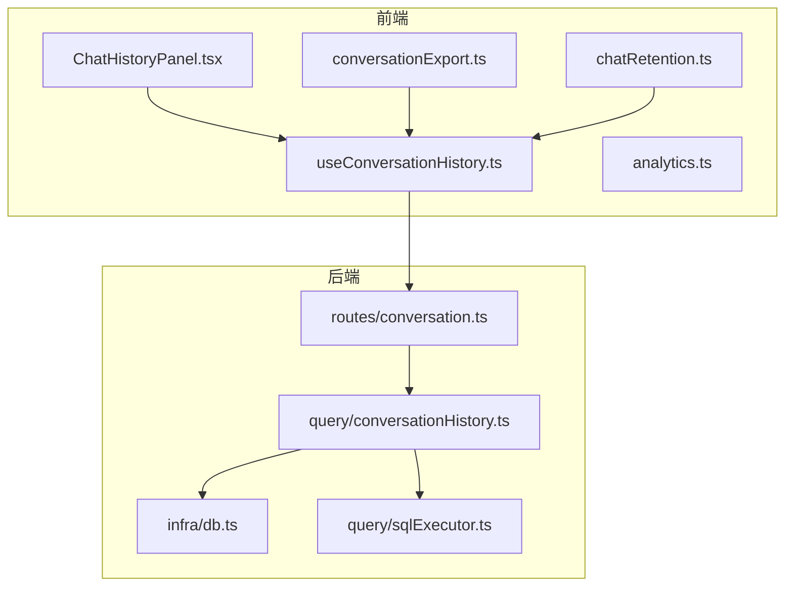
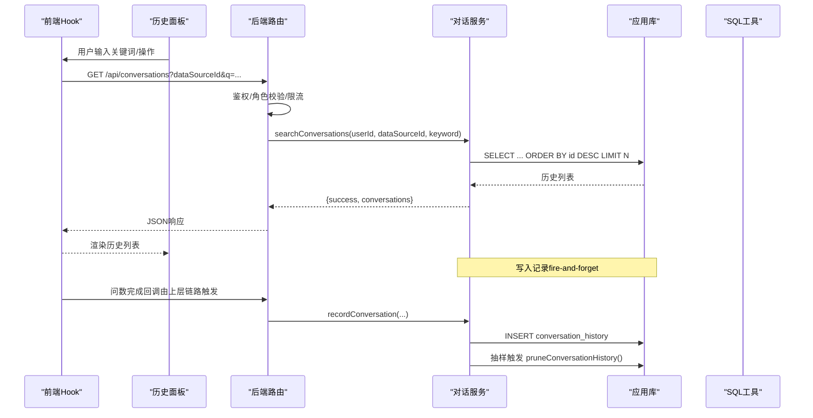
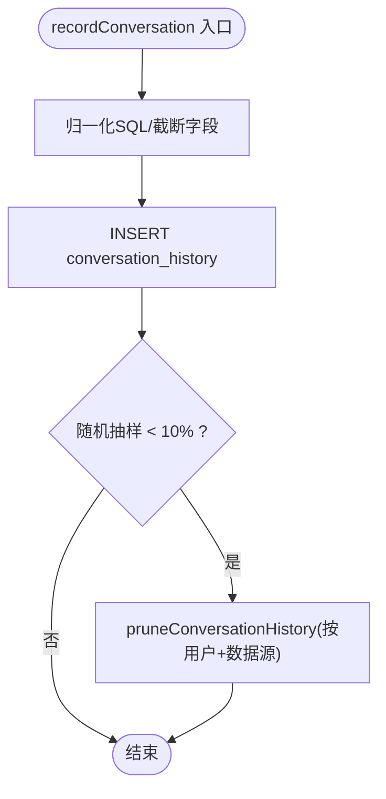
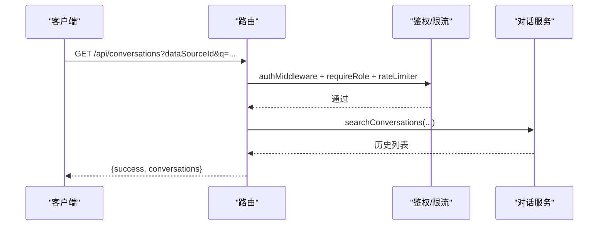
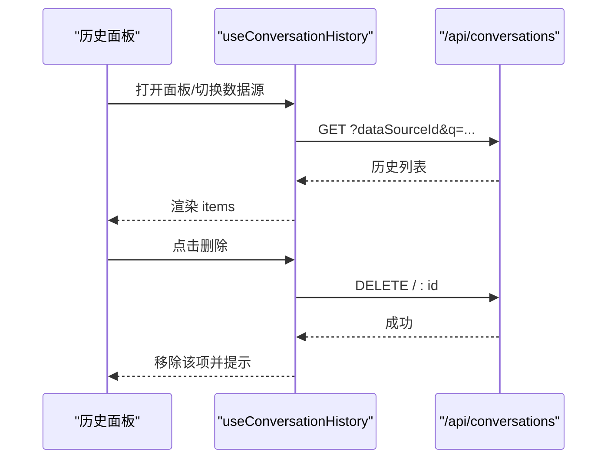
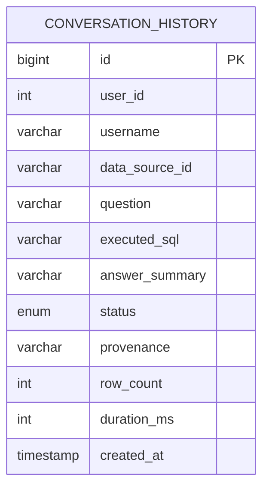
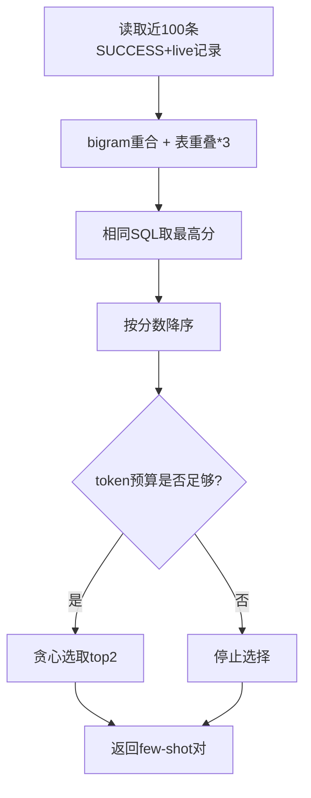
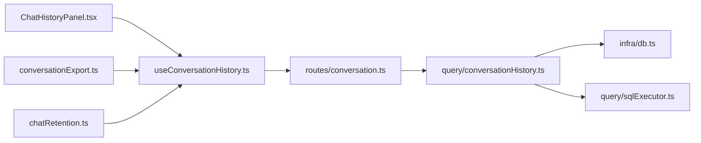

# 对话历史管理

<cite>
**本文引用的文件**
- [conversationHistory.ts](file://server/query/conversationHistory.ts)
- [conversation.ts](file://server/routes/conversation.ts)
- [db.ts](file://server/infra/db.ts)
- [useConversationHistory.ts](file://src/hooks/useConversationHistory.ts)
- [ChatHistoryPanel.tsx](file://src/components/query/ChatHistoryPanel.tsx)
- [conversationExport.ts](file://src/utils/conversationExport.ts)
- [chatRetention.ts](file://src/utils/chatRetention.ts)
- [analytics.ts](file://src/types/analytics.ts)
- [sqlExecutor.ts](file://server/query/sqlExecutor.ts)
</cite>

## 目录
1. [简介](#简介)
2. [项目结构](#项目结构)
3. [核心组件](#核心组件)
4. [架构总览](#架构总览)
5. [详细组件分析](#详细组件分析)
6. [依赖关系分析](#依赖关系分析)
7. [性能与优化](#性能与优化)
8. [故障排查指南](#故障排查指南)
9. [结论](#结论)
10. [附录：扩展与最佳实践](#附录：扩展与最佳实践)

## 简介
本文件围绕“对话历史管理”进行系统化说明，覆盖多轮对话的状态管理、上下文维护、消息持久化与会话恢复；阐述前后端协作模式（React Hook 与后端 API 的交互）；给出存储结构设计、检索策略、数据压缩与内存优化方案；并提供扩展自定义消息类型、智能上下文提取的实践路径。

## 项目结构
对话历史管理涉及前端状态与 UI、服务端路由与持久化、以及 SQL 执行层的辅助能力。整体由以下模块组成：
- 前端 Hook：封装历史加载、删除、导出等逻辑，并与后端 API 交互
- 前端面板：展示历史列表、支持搜索、重问、删除
- 服务端路由：提供检索与删除接口，鉴权与限流
- 服务层：对话记录落库、窗口清理、个人 few-shot 检索
- 数据库：会话表结构与索引
- SQL 执行层：SQL 归一化、表引用提取等工具，用于个人 few-shot 评分

图表来源
- [useConversationHistory.ts:1-124](file://src/hooks/useConversationHistory.ts#L1-L124)
- [ChatHistoryPanel.tsx:1-116](file://src/components/query/ChatHistoryPanel.tsx#L1-L116)
- [conversationExport.ts:1-44](file://src/utils/conversationExport.ts#L1-L44)
- [chatRetention.ts:1-49](file://src/utils/chatRetention.ts#L1-L49)
- [conversation.ts:1-44](file://server/routes/conversation.ts#L1-L44)
- [conversationHistory.ts:1-204](file://server/query/conversationHistory.ts#L1-L204)
- [db.ts:271-289](file://server/infra/db.ts#L271-L289)
- [sqlExecutor.ts:174-200](file://server/query/sqlExecutor.ts#L174-L200)

章节来源
- [useConversationHistory.ts:1-124](file://src/hooks/useConversationHistory.ts#L1-L124)
- [conversation.ts:1-44](file://server/routes/conversation.ts#L1-L44)
- [conversationHistory.ts:1-204](file://server/query/conversationHistory.ts#L1-L204)
- [db.ts:271-289](file://server/infra/db.ts#L271-L289)

## 核心组件
- 服务端对话记录与检索
  - 记录：每次问数完成后以“fire-and-forget”方式写入 conversation_history，包含问题、执行 SQL、摘要、状态、来源、行数、耗时等
  - 检索：按用户+数据源查询，支持关键词模糊匹配问题与摘要，限制返回条数
  - 删除：仅允许删除本人记录，越权返回未找到
  - 窗口清理：按环境变量控制保留条数，抽样触发清理，避免写放大
  - 个人 few-shot：从近 100 条成功 live 记录中按 bigram 重合与表重叠打分，预算内取 top 2 注入后续提示
- 前端历史管理 Hook
  - 加载：根据当前数据源与关键词调用 /api/conversations
  - 删除：调用 DELETE /api/conversations/:id，成功后本地移除
  - 导出：将当前可见消息构建为 Markdown 并下载
  - 自动刷新：面板打开期间切换数据源时重新拉取
- 历史面板 UI
  - 展示状态标签（成功/降级/演示）、时间戳、问题与摘要
  - 支持回车搜索、一键回填提问、单条删除
- 数据持久化与迁移
  - conversation_history 表结构、索引与枚举字段演进
- SQL 执行层工具
  - SQL 归一化、注释与字符串剥离、表引用提取，支撑 few-shot 评分

章节来源
- [conversationHistory.ts:43-90](file://server/query/conversationHistory.ts#L43-L90)
- [conversationHistory.ts:107-138](file://server/query/conversationHistory.ts#L107-L138)
- [conversationHistory.ts:158-203](file://server/query/conversationHistory.ts#L158-L203)
- [useConversationHistory.ts:41-123](file://src/hooks/useConversationHistory.ts#L41-L123)
- [ChatHistoryPanel.tsx:21-116](file://src/components/query/ChatHistoryPanel.tsx#L21-L116)
- [db.ts:271-289](file://server/infra/db.ts#L271-L289)
- [sqlExecutor.ts:174-200](file://server/query/sqlExecutor.ts#L174-L200)

## 架构总览
下图展示了从前端到后端的完整请求链路，包括鉴权、检索、落库与清理流程。

图表来源
- [useConversationHistory.ts:48-66](file://src/hooks/useConversationHistory.ts#L48-L66)
- [conversation.ts:16-27](file://server/routes/conversation.ts#L16-L27)
- [conversationHistory.ts:43-65](file://server/query/conversationHistory.ts#L43-L65)
- [conversationHistory.ts:107-129](file://server/query/conversationHistory.ts#L107-L129)
- [db.ts:271-289](file://server/infra/db.ts#L271-L289)

## 详细组件分析

### 服务端：对话记录与检索
- 记录写入
  - 入参包含用户、数据源、问题、执行 SQL、摘要、状态、来源、行数、耗时
  - SQL 会先归一化并截断，摘要与用户名也做长度限制，防止超长字段
  - 写入后以 10% 概率触发窗口清理，避免每写必删的写放大
- 窗口清理
  - 通过环境变量控制保留条数（默认 500），超过则按 id 升序删除最早记录
  - 关闭治理可设置保留数为 0
- 检索
  - 按用户+数据源过滤，支持对问题与摘要的 LIKE 模糊匹配
  - 限制最大返回条数，防止大结果集
- 删除
  - 仅删除本人记录，影响行数为 0 视为不存在或无权
- 个人 few-shot
  - 读取近 100 条成功 live 记录，计算 bigram 重合度与表重叠得分
  - 去重相同 SQL 取最高分，按 token 预算贪心选取 top 2

图表来源
- [conversationHistory.ts:43-65](file://server/query/conversationHistory.ts#L43-L65)
- [conversationHistory.ts:76-90](file://server/query/conversationHistory.ts#L76-L90)

章节来源
- [conversationHistory.ts:43-90](file://server/query/conversationHistory.ts#L43-L90)
- [conversationHistory.ts:107-138](file://server/query/conversationHistory.ts#L107-L138)
- [conversationHistory.ts:158-203](file://server/query/conversationHistory.ts#L158-L203)

### 服务端：路由与鉴权
- GET /api/conversations
  - 参数：dataSourceId（必填）、q（可选）
  - 鉴权：登录态 + 角色校验
  - 返回：{ success, conversations }
- DELETE /api/conversations/:id
  - 参数：id（正整数）
  - 鉴权：登录态 + 角色校验 + 限流
  - 返回：成功或 404（不存在或无权）

图表来源
- [conversation.ts:16-41](file://server/routes/conversation.ts#L16-L41)

章节来源
- [conversation.ts:1-44](file://server/routes/conversation.ts#L1-L44)

### 前端：Hook 与面板
- useConversationHistory
  - 加载历史：拼接 dataSourceId 与 q，调用 /api/conversations，失败时清空并提示
  - 删除历史：DELETE /api/conversations/:id，成功后本地移除并提示
  - 导出：基于 visibleMessages 构建 Markdown 并下载
  - 自动刷新：面板打开且 activeDataSourceId 变化时重新加载
- ChatHistoryPanel
  - 展示状态、来源、时间与摘要
  - 支持回车搜索、回填提问、删除
- 导出工具
  - 构建 Markdown：标题、数据源、时间、消息条数，逐条输出问题/回答与 SQL 代码块
  - 下载：Blob + a.click 触发浏览器下载

图表来源
- [useConversationHistory.ts:48-99](file://src/hooks/useConversationHistory.ts#L48-L99)
- [ChatHistoryPanel.tsx:41-106](file://src/components/query/ChatHistoryPanel.tsx#L41-L106)
- [conversationExport.ts:12-43](file://src/utils/conversationExport.ts#L12-L43)

章节来源
- [useConversationHistory.ts:41-123](file://src/hooks/useConversationHistory.ts#L41-L123)
- [ChatHistoryPanel.tsx:21-116](file://src/components/query/ChatHistoryPanel.tsx#L21-L116)
- [conversationExport.ts:1-44](file://src/utils/conversationExport.ts#L1-L44)

### 数据结构与存储
- 对话历史表
  - 字段：id、user_id、username、data_source_id、question、executed_sql、answer_summary、status、provenance、row_count、duration_ms、created_at
  - 索引：(user_id, data_source_id, id) 加速按用户+数据源的排序检索
  - 枚举：status 支持 SUCCESS/FALLBACK/REFUSED
- 前端消息模型
  - ChatMessage 包含 role、content、timestamp、queryResult、dataSourceId 等，用于导出与展示
- 会话裁剪
  - 按数据源分组保留最近 N 条，无归属消息全局限量，防止 localStorage 膨胀

图表来源
- [db.ts:271-289](file://server/infra/db.ts#L271-L289)

章节来源
- [db.ts:271-289](file://server/infra/db.ts#L271-L289)
- [analytics.ts:191-237](file://src/types/analytics.ts#L191-L237)
- [chatRetention.ts:1-49](file://src/utils/chatRetention.ts#L1-L49)

### 个人 few-shot 与智能上下文提取
- 数据来源：同用户同数据源的真实执行成功记录（live），近 100 条
- 评分维度
  - 问题 bigram 重合度
  - SQL 引用表与当前相关表的交集数量（权重×3）
- 去重与选择
  - 相同 SQL 只保留最高分
  - 按 token 预算贪心选取 top 2，控制注入大小
- 工具依赖
  - SQL 归一化、注释与字符串剥离、表引用提取

图表来源
- [conversationHistory.ts:158-203](file://server/query/conversationHistory.ts#L158-L203)
- [sqlExecutor.ts:174-200](file://server/query/sqlExecutor.ts#L174-L200)

章节来源
- [conversationHistory.ts:158-203](file://server/query/conversationHistory.ts#L158-L203)
- [sqlExecutor.ts:174-200](file://server/query/sqlExecutor.ts#L174-L200)

## 依赖关系分析
- 前端依赖
  - useConversationHistory 依赖 apiFetch 与 conversationExport
  - ChatHistoryPanel 依赖 useConversationHistory 暴露的状态与方法
  - chatRetention 用于前端消息滚动裁剪，避免存储膨胀
- 后端依赖
  - routes/conversation 依赖鉴权、限流、logger 与对话服务
  - query/conversationHistory 依赖 db 连接池、SQL 工具与 LLM 预算估算
- 数据库
  - conversation_history 表及索引由 infra/db 初始化与迁移

图表来源
- [useConversationHistory.ts:1-124](file://src/hooks/useConversationHistory.ts#L1-L124)
- [conversation.ts:1-44](file://server/routes/conversation.ts#L1-L44)
- [conversationHistory.ts:1-204](file://server/query/conversationHistory.ts#L1-L204)
- [db.ts:271-289](file://server/infra/db.ts#L271-L289)
- [sqlExecutor.ts:174-200](file://server/query/sqlExecutor.ts#L174-L200)

章节来源
- [useConversationHistory.ts:1-124](file://src/hooks/useConversationHistory.ts#L1-L124)
- [conversation.ts:1-44](file://server/routes/conversation.ts#L1-L44)
- [conversationHistory.ts:1-204](file://server/query/conversationHistory.ts#L1-L204)
- [db.ts:271-289](file://server/infra/db.ts#L271-L289)
- [sqlExecutor.ts:174-200](file://server/query/sqlExecutor.ts#L174-L200)

## 性能与优化
- 写入优化
  - fire-and-forget：记录写入不阻塞主链路，异常不影响用户体验
  - 抽样清理：10% 概率触发窗口清理，降低写放大
- 检索优化
  - 限制返回条数（默认 50，上限 200），避免大结果集
  - 使用 (user_id, data_source_id, id) 复合索引加速排序与过滤
- 存储与内存
  - 前端按数据源分组裁剪消息，防止 localStorage 无限增长
  - 字段截断：用户名、问题、SQL、摘要均做长度限制，减少存储体积
- Few-shot 预算控制
  - 按 token 预算贪心选取，避免提示过长导致延迟与成本上升
- 连接池与超时
  - 数据源连接池容量公式化，场景化超时保护交互体验

章节来源
- [conversationHistory.ts:43-90](file://server/query/conversationHistory.ts#L43-L90)
- [conversationHistory.ts:107-129](file://server/query/conversationHistory.ts#L107-L129)
- [chatRetention.ts:1-49](file://src/utils/chatRetention.ts#L1-L49)
- [sqlExecutor.ts:44-109](file://server/query/sqlExecutor.ts#L44-L109)

## 故障排查指南
- 无法加载历史
  - 检查 dataSourceId 是否传递正确
  - 查看网络请求是否被鉴权拦截
  - 确认 conversation_history 表存在且有索引
- 删除失败
  - 确认 ID 为正整数
  - 检查是否越权删除他人记录（返回 404）
- 历史过多导致卡顿
  - 调整前端消息裁剪阈值（MAX_MESSAGES_PER_SOURCE）
  - 调整服务端保留窗口（CONVERSATION_RETENTION）
- 个人 few-shot 不生效
  - 确认记录状态为 SUCCESS 且 provenance 为 live
  - 检查 SQL 是否非空且可解析出表引用
  - 检查 token 预算是否过小导致无法选取

章节来源
- [conversation.ts:16-41](file://server/routes/conversation.ts#L16-L41)
- [conversationHistory.ts:76-90](file://server/query/conversationHistory.ts#L76-L90)
- [conversationHistory.ts:158-203](file://server/query/conversationHistory.ts#L158-L203)
- [chatRetention.ts:1-49](file://src/utils/chatRetention.ts#L1-L49)

## 结论
该对话历史管理系统通过“前端 Hook + 后端路由 + 服务层 + 数据库”的分层设计，实现了跨设备共享的历史沉淀、高效检索与可控清理；结合个人 few-shot 自学习机制，持续反哺后续问数的准确性与效率。通过字段截断、窗口清理、预算控制与前端消息裁剪等手段，系统在可扩展性与性能之间取得良好平衡。

## 附录：扩展与最佳实践
- 扩展对话功能
  - 新增字段：在 conversation_history 表中增加字段并在 recordConversation/searchConversations 中处理
  - 新增状态：扩展 status 枚举并在 UI 中展示对应徽标
- 自定义消息类型
  - 在 ChatMessage 中扩展字段（如 reportCard、dlpMaskedLabels），并在导出与面板中兼容显示
- 智能上下文提取
  - 利用 extractTableRefs 与 stripCommentsAndStrings 提升表级相关性判断
  - 调整 bigramOverlap 与表重叠权重，优化 few-shot 选择质量
- 数据压缩策略
  - 服务端：字段截断、窗口清理、索引优化
  - 前端：按数据源分组裁剪、导出时仅包含必要字段
- 版本兼容性
  - 数据库迁移幂等：ALTER TABLE 与 MODIFY COLUMN 需容忍重复执行
  - 前端兼容旧版消息结构（如 result.generatedSQL）

章节来源
- [db.ts:271-299](file://server/infra/db.ts#L271-L299)
- [conversationHistory.ts:43-90](file://server/query/conversationHistory.ts#L43-L90)
- [conversationHistory.ts:158-203](file://server/query/conversationHistory.ts#L158-L203)
- [conversationExport.ts:12-43](file://src/utils/conversationExport.ts#L12-L43)
- [analytics.ts:191-237](file://src/types/analytics.ts#L191-L237)