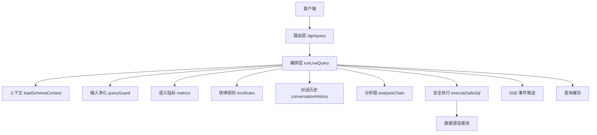
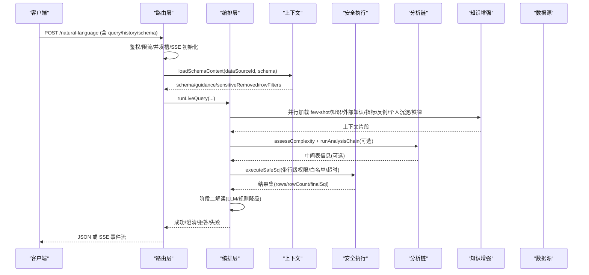
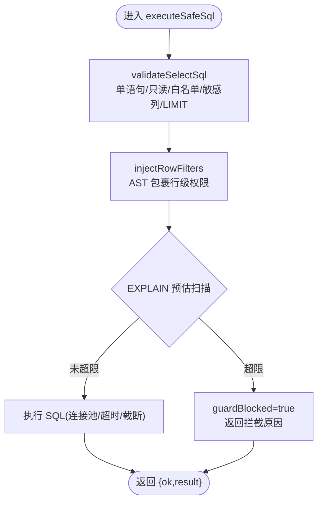
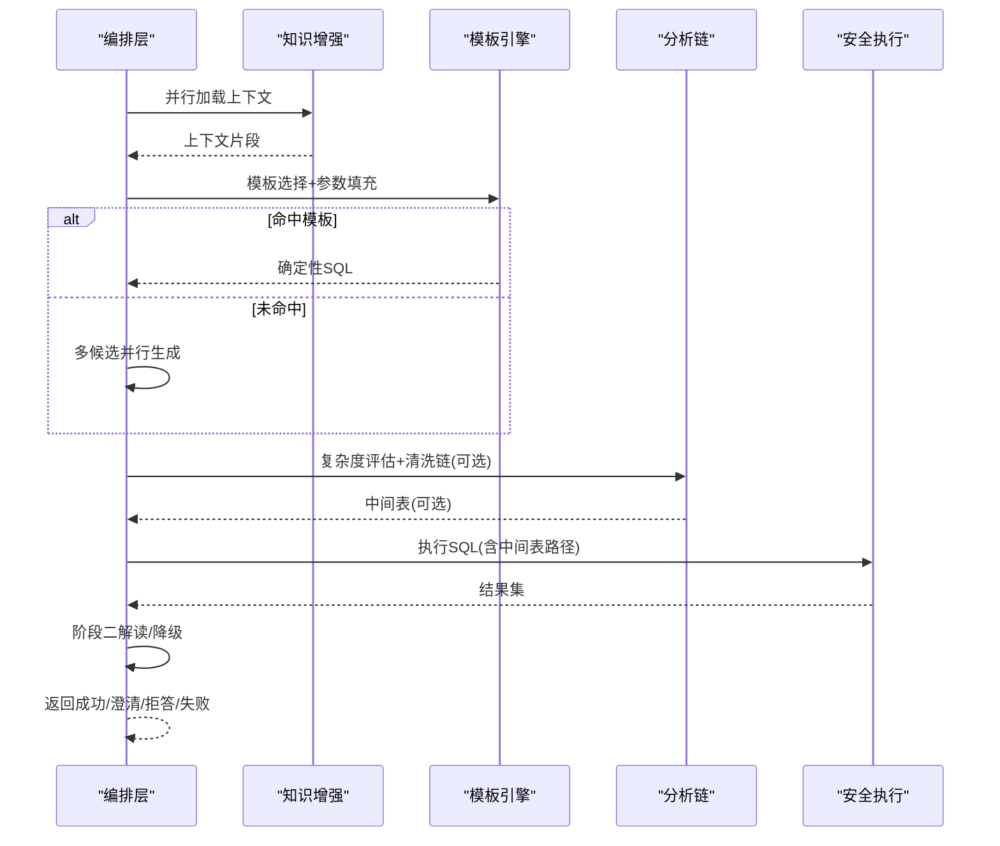
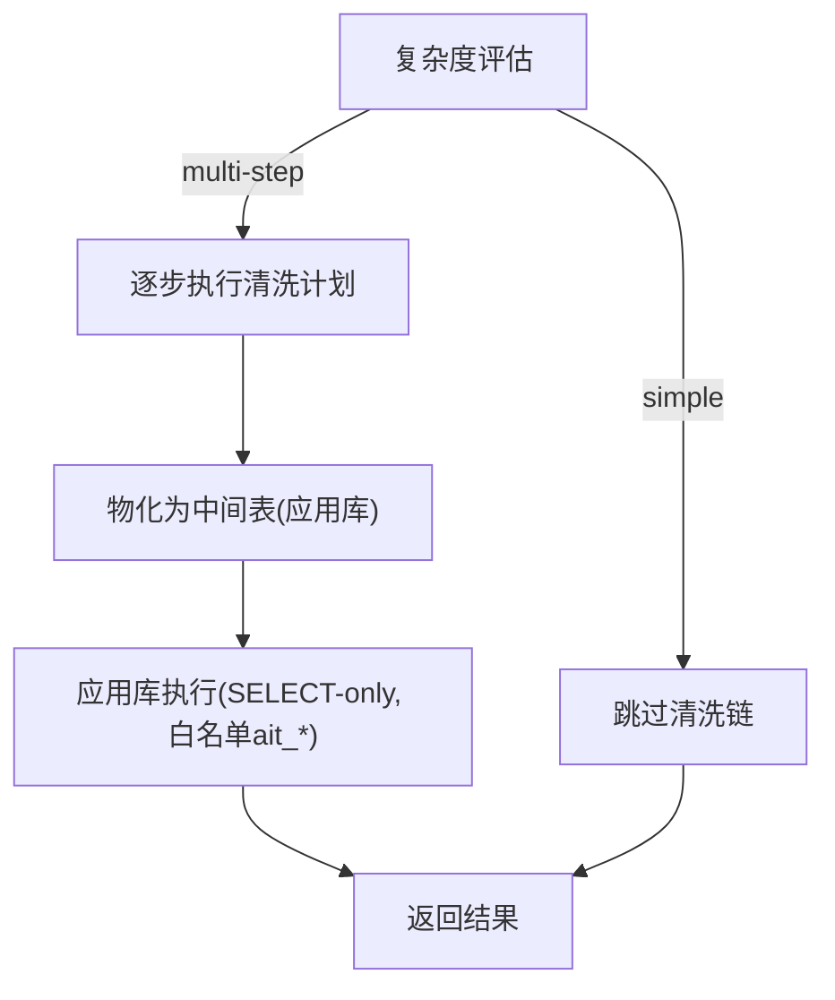
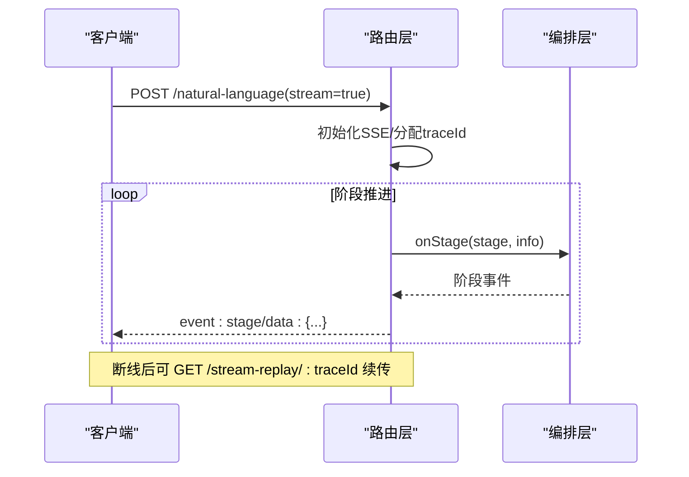
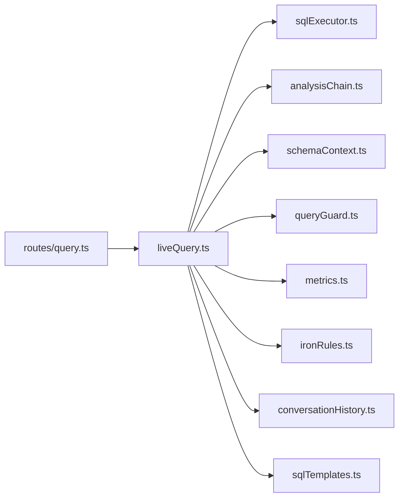

# 查询处理引擎

<cite>
**本文引用的文件**
- [server/query/liveQuery.ts](file://server/query/liveQuery.ts)
- [server/query/analysisChain.ts](file://server/query/analysisChain.ts)
- [server/query/sqlExecutor.ts](file://server/query/sqlExecutor.ts)
- [server/query/schemaContext.ts](file://server/query/schemaContext.ts)
- [server/query/queryGuard.ts](file://server/query/queryGuard.ts)
- [server/routes/query.ts](file://server/routes/query.ts)
- [server/query/sqlTemplates.ts](file://server/query/sqlTemplates.ts)
- [server/query/conversationHistory.ts](file://server/query/conversationHistory.ts)
- [server/query/metrics.ts](file://server/query/metrics.ts)
- [server/query/ironRules.ts](file://server/query/ironRules.ts)
</cite>

## 目录
1. [简介](#简介)
2. [项目结构](#项目结构)
3. [核心组件](#核心组件)
4. [架构总览](#架构总览)
5. [详细组件分析](#详细组件分析)
6. [依赖关系分析](#依赖关系分析)
7. [性能与优化](#性能与优化)
8. [故障排查指南](#故障排查指南)
9. [结论](#结论)
10. [附录：扩展与配置示例](#附录：扩展与配置示例)

## 简介
本文件面向“智能问数据分析系统”的查询处理引擎，系统性解析 NL2SQL 转换流程、SQL 执行与安全、多轮对话管理、Schema 上下文构建、查询安全防护、分析链（Analysis Chain）工作机制、实时查询（Live Query）流式响应与中断续传等核心能力。文档同时提供扩展查询逻辑、自定义 SQL 模板、配置查询规则的具体指引，并总结性能优化策略、错误处理机制与调试工具使用方式。

## 项目结构
查询处理引擎围绕以下关键模块组织：
- 路由层：统一入口、鉴权、限流、SSE 流式事件、推导留痕、缓存命中与降级。
- 编排层：双阶段真实执行（阶段一生成 SQL + 图表配置；阶段二基于真实结果生成解读）。
- 安全执行层：SELECT-only、表白名单、敏感列拒绝、行级权限注入、EXPLAIN 防线、连接池与超时控制。
- 上下文层：Schema 加载、范围过滤、敏感列过滤、提示摘要、缓存。
- 分析链：复杂度评估、中间表物化、应用库执行、TTL 清理。
- 知识增强：Few-shot、知识库 RAG、外部知识库、语义指标、个人沉淀、铁律规则。
- 对话历史：服务端落库、窗口清理、个人 few-shot 检索。
- 模板引擎：参数化分析模板，确定性拼装复杂 SQL。

**图示来源**
- [server/routes/query.ts:47-393](file://server/routes/query.ts#L47-L393)
- [server/query/liveQuery.ts:189-749](file://server/query/liveQuery.ts#L189-L749)
- [server/query/schemaContext.ts:108-172](file://server/query/schemaContext.ts#L108-L172)
- [server/query/sqlExecutor.ts:734-832](file://server/query/sqlExecutor.ts#L734-L832)

**章节来源**
- [server/routes/query.ts:47-393](file://server/routes/query.ts#L47-L393)
- [server/query/liveQuery.ts:189-749](file://server/query/liveQuery.ts#L189-L749)

## 核心组件
- 安全执行层：负责 SQL 校验、AST 复核、行级权限注入、EXPLAIN 防线、连接池与超时控制。
- 编排层：实现双阶段真实执行、多候选并行生成与多数表决、澄清/拒答竞速、结果合理性校验与回退。
- 分析链：对复杂问题自动进行多步清洗，产出中间表并在应用库执行最终查询。
- 上下文层：从数据源加载 Schema，应用 scope 白名单与敏感列过滤，生成提示摘要并缓存。
- 知识增强：组合 Few-shot、知识库片段、外部知识库、语义指标、个人沉淀与铁律规则，提升 SQL 生成质量。
- 对话历史：持久化问答记录，支持搜索、删除与个人 few-shot 自学习。
- 模板引擎：通过轻量 LLM 选择模板并填充参数，确定性拼装复杂 SQL，降低本地模型风险。

**章节来源**
- [server/query/sqlExecutor.ts:1-832](file://server/query/sqlExecutor.ts#L1-L832)
- [server/query/liveQuery.ts:189-749](file://server/query/liveQuery.ts#L189-L749)
- [server/query/analysisChain.ts:1-411](file://server/query/analysisChain.ts#L1-L411)
- [server/query/schemaContext.ts:1-172](file://server/query/schemaContext.ts#L1-L172)
- [server/query/metrics.ts:1-531](file://server/query/metrics.ts#L1-L531)
- [server/query/ironRules.ts:1-265](file://server/query/ironRules.ts#L1-L265)
- [server/query/conversationHistory.ts:1-204](file://server/query/conversationHistory.ts#L1-L204)
- [server/query/sqlTemplates.ts:1-119](file://server/query/sqlTemplates.ts#L1-L119)

## 架构总览
查询处理引擎采用“路由 → 编排 → 安全执行”的分层架构，结合“上下文 + 知识增强 + 分析链”的多路并行输入，确保高可用与高安全。

**图示来源**
- [server/routes/query.ts:47-393](file://server/routes/query.ts#L47-L393)
- [server/query/liveQuery.ts:189-749](file://server/query/liveQuery.ts#L189-L749)
- [server/query/analysisChain.ts:268-326](file://server/query/analysisChain.ts#L268-L326)
- [server/query/sqlExecutor.ts:734-832](file://server/query/sqlExecutor.ts#L734-L832)

## 详细组件分析

### 安全执行层（sqlExecutor）
- 职责：SQL 合法性校验（单语句、只读）、表白名单校验、敏感列拒绝、AST 复核、行级权限注入、EXPLAIN 防线、连接池与超时控制、结果截断。
- 关键点：
  - SELECT-only 与关键字黑名单拦截。
  - AST 解析失败时 fail-closed（WITH 场景），正则防线兜底。
  - 行级权限通过 AST 包裹派生表强制注入，覆盖子查询/CTE/UNION。
  - EXPLAIN 预估扫描行数超阈值则拦截，返回可引导用户收窄条件的提示。
  - 按场景分级连接池与超时（交互/分析链/导出）。
  - MySQL MAX_EXECUTION_TIME hint 注入，PG statement_timeout 配合。

**图示来源**
- [server/query/sqlExecutor.ts:291-387](file://server/query/sqlExecutor.ts#L291-L387)
- [server/query/sqlExecutor.ts:396-489](file://server/query/sqlExecutor.ts#L396-L489)
- [server/query/sqlExecutor.ts:629-662](file://server/query/sqlExecutor.ts#L629-L662)
- [server/query/sqlExecutor.ts:734-832](file://server/query/sqlExecutor.ts#L734-L832)

**章节来源**
- [server/query/sqlExecutor.ts:1-832](file://server/query/sqlExecutor.ts#L1-L832)

### 编排层（liveQuery）
- 职责：双阶段真实执行、多候选并行生成与多数表决、澄清/拒答竞速、结果合理性校验与回退、阶段二解读与降级。
- 关键点：
  - 七路上下文并行加载（few-shot、知识库、外部知识、指标、反例、个人沉淀、铁律）。
  - 模板匹配优先：命中则确定性拼装 SQL，失败回退自由生成。
  - 多候选并行生成（Self-Consistency），结果签名多数表决择优。
  - 数据自省（intermediate_sql）仅首次允许一轮，避免递归拖慢。
  - 空结果跳过阶段二，直接给出真实结论。
  - 阶段二失败时规则化降级解读，保证可用性。

**图示来源**
- [server/query/liveQuery.ts:220-327](file://server/query/liveQuery.ts#L220-L327)
- [server/query/liveQuery.ts:359-393](file://server/query/liveQuery.ts#L359-L393)
- [server/query/liveQuery.ts:396-620](file://server/query/liveQuery.ts#L396-L620)
- [server/query/liveQuery.ts:622-749](file://server/query/liveQuery.ts#L622-L749)

**章节来源**
- [server/query/liveQuery.ts:189-749](file://server/query/liveQuery.ts#L189-L749)

### 分析链（analysisChain）
- 职责：对复杂问题进行多步清洗，将清洗结果物化为应用库中间表，最终在应用库执行仅引用中间表的 SELECT。
- 关键点：
  - 复杂度评估：启发式信号 + LLM 评估，默认简单问题不触发。
  - 中间表物化：列名安全化、类型推断、批量写入、配额限制、TTL 清理。
  - 应用库执行：仅允许 SELECT，严格白名单校验 ait_* 中间表。
  - 纠错重试：执行失败携带错误让 LLM 自纠一次。

**图示来源**
- [server/query/analysisChain.ts:97-112](file://server/query/analysisChain.ts#L97-L112)
- [server/query/analysisChain.ts:268-326](file://server/query/analysisChain.ts#L268-L326)
- [server/query/analysisChain.ts:330-384](file://server/query/analysisChain.ts#L330-L384)

**章节来源**
- [server/query/analysisChain.ts:1-411](file://server/query/analysisChain.ts#L1-L411)

### 上下文构建（schemaContext）
- 职责：加载数据源 Schema，应用 scope 白名单与敏感列过滤，生成提示摘要，缓存 5 分钟。
- 关键点：
  - 支持演示模式（前端提交 schema）与真实数据源模式。
  - 行级权限谓词由 scope 计算并注入执行层。
  - 文件数据源已落物理表时走真实执行链路。

**章节来源**
- [server/query/schemaContext.ts:1-172](file://server/query/schemaContext.ts#L1-L172)

### 查询安全防护（queryGuard）
- 职责：输入净化（L1）、历史净化（L4）、敏感列过滤（L3）。
- 关键点：
  - 控制字符过滤、注入特征拒绝、长度截断。
  - 历史仅保留 user 消息，逐条过注入检测，最多 5 轮。
  - 敏感列特征匹配后从 Schema 剔除并返回清单。

**章节来源**
- [server/query/queryGuard.ts:1-101](file://server/query/queryGuard.ts#L1-L101)

### 多轮对话管理（conversationHistory）
- 职责：服务端落库、窗口清理、个人 few-shot 检索。
- 关键点：
  - 每次问数记录问题/SQL/摘要/状态/来源/行数/耗时。
  - 抽样清理旧记录，保留窗口大小可配。
  - 个人 few-shot 基于 bigram 重合与表重合打分，预算内取 top 2。

**章节来源**
- [server/query/conversationHistory.ts:1-204](file://server/query/conversationHistory.ts#L1-L204)

### 语义指标与铁律规则（metrics & ironRules）
- 语义指标：管理员登记权威口径，命中即注入 prompt，禁止口径漂移；支持维度切分与金额单位换算。
- 铁律规则：全量 ACTIVE 规则恒注入，最高优先级约束 SQL 生成，仅 ADMIN 维护。

**章节来源**
- [server/query/metrics.ts:1-531](file://server/query/metrics.ts#L1-L531)
- [server/query/ironRules.ts:1-265](file://server/query/ironRules.ts#L1-L265)

### 实时查询（Live Query）与 SSE
- 路由层支持 streamMode 开启 SSE，阶段事件（understanding/executed/introspecting/analyzing）实时推送。
- 断线续传：事件入重放缓冲，支持 Last-Event-ID 与 after 参数回放，不重新执行 SQL。
- 查询中断：客户端断开释放并发槽，旧请求继续完成但不再写流。

**图示来源**
- [server/routes/query.ts:118-153](file://server/routes/query.ts#L118-L153)
- [server/routes/query.ts:395-456](file://server/routes/query.ts#L395-L456)

**章节来源**
- [server/routes/query.ts:47-456](file://server/routes/query.ts#L47-L456)

## 依赖关系分析
- 路由层依赖：鉴权、限流、Schema 上下文、编排层、安全执行、缓存、SSE、审计、对话历史、计划模式。
- 编排层依赖：LLM 客户端、Schema Linking、反馈样例、对话历史、知识库、外部知识、指标、铁律、分析链、模板引擎、工具函数。
- 安全执行层依赖：数据库驱动、AST 解析器、监控埋点、密钥解密、文件数据源适配。
- 上下文层依赖：StateStore、Scope、Schema Guidance、敏感列过滤、文件数据源判定。

**图示来源**
- [server/routes/query.ts:17-42](file://server/routes/query.ts#L17-L42)
- [server/query/liveQuery.ts:16-73](file://server/query/liveQuery.ts#L16-L73)

**章节来源**
- [server/routes/query.ts:17-42](file://server/routes/query.ts#L17-L42)
- [server/query/liveQuery.ts:16-73](file://server/query/liveQuery.ts#L16-L73)

## 性能与优化
- 连接池容量公式化：按 EXPECTED_CONCURRENT_USERS 推导，上限保护防打爆数据源。
- 场景化超时与配额：交互/分析链/导出独立配置，避免后台任务挤占交互。
- 多候选并行生成：减少墙钟延迟，澄清/拒答竞速提前返回。
- 模板匹配优先：确定性拼装复杂 SQL，降低本地模型风险与延迟。
- 列级裁剪：宽表 top-N 列注入，降低 prompt token 占用。
- 结果缓存：精确键 + 语义近似命中，显著降低重复提问延迟。
- EXPLAIN 防线：拦截大扫描查询，保护业务库性能。
- 中间表 TTL 清理：定时清理过期中间表，释放存储。

[本节为通用性能讨论，无需具体文件引用]

## 故障排查指南
- 常见错误定位：
  - SQL 被拒绝：检查 validateSelectSql 与 AST 复核原因（非只读/越权表/敏感列）。
  - 执行超时：确认场景超时配置与 MAX_EXECUTION_TIME hint。
  - EXPLAIN 拦截：根据 guardBlocked 提示增加筛选条件。
  - 中间表写入失败：检查列名安全化与配额限制。
  - 阶段二解读失败：查看规则降级输出是否合理。
- 调试工具：
  - 推导留痕：GET /trace/:traceId 回放步骤详情。
  - SSE 断线续传：GET /stream-replay/:traceId?after=seq。
  - 日志与埋点：infra/logger 与 monitoring 埋点观察执行时长与成败。

**章节来源**
- [server/routes/query.ts:458-476](file://server/routes/query.ts#L458-L476)
- [server/routes/query.ts:395-456](file://server/routes/query.ts#L395-L456)
- [server/query/sqlExecutor.ts:629-662](file://server/query/sqlExecutor.ts#L629-L662)

## 结论
该查询处理引擎通过分层架构与多重安全防线，实现了高可用、高安全的 NL2SQL 转换与执行。分析链与知识增强提升了复杂问题的处理能力，SSE 与断线续传改善了用户体验。模板引擎与多候选并行在保证正确性的同时优化了性能。建议在生产环境中合理配置连接池、超时与 EXPLAIN 阈值，并结合指标与铁律规则保障口径一致性与合规性。

[本节为总结，无需具体文件引用]

## 附录：扩展与配置示例

### 扩展查询逻辑
- 在编排层新增上下文来源：参考 liveQuery 中并行加载模式，新增异步加载函数并加入 Promise.all。
- 新增阶段二解读策略：在阶段二失败时替换降级逻辑，保持结果结构不变。

**章节来源**
- [server/query/liveQuery.ts:220-327](file://server/query/liveQuery.ts#L220-L327)
- [server/query/liveQuery.ts:692-715](file://server/query/liveQuery.ts#L692-L715)

### 自定义 SQL 模板
- 定义新模板：在 sqlTemplates 中新增 AnalysisTemplate，实现 buildSql 方法。
- 注册到 AVAILABLE_TEMPLATES：供模板匹配引擎选择。
- 参数校验：在 validateTemplateParams 中添加字段校验逻辑。

**章节来源**
- [server/query/sqlTemplates.ts:1-119](file://server/query/sqlTemplates.ts#L1-L119)

### 配置查询规则
- 语义指标：通过 metrics 模块登记权威口径，启用 ACTIVE 状态参与问数命中。
- 铁律规则：通过 ironRules 模块登记强制规则，全量注入阶段一 prompt。
- 行级权限：通过 schemaContext 的 scope 计算 rowFilters，执行层 AST 强制注入。

**章节来源**
- [server/query/metrics.ts:1-531](file://server/query/metrics.ts#L1-L531)
- [server/query/ironRules.ts:1-265](file://server/query/ironRules.ts#L1-L265)
- [server/query/schemaContext.ts:108-172](file://server/query/schemaContext.ts#L108-L172)