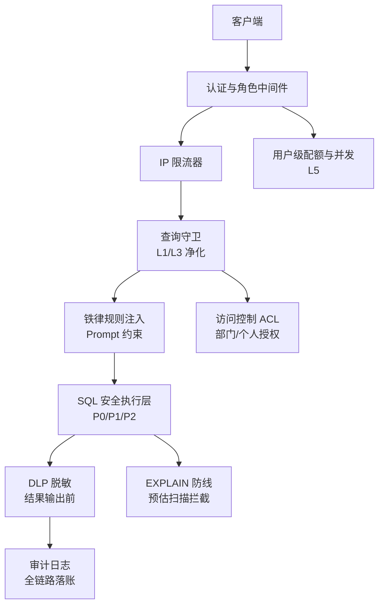
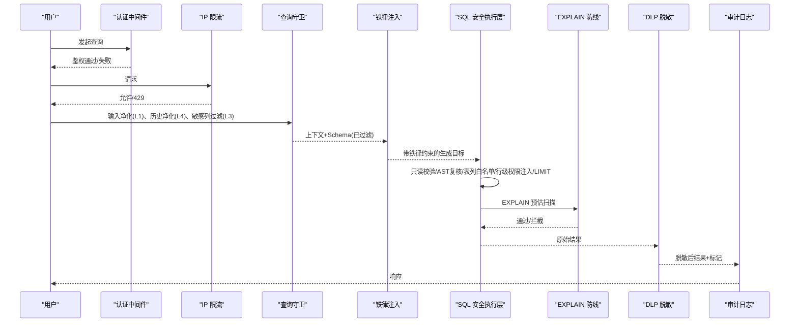
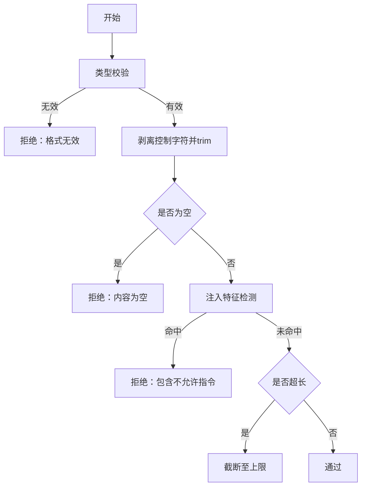
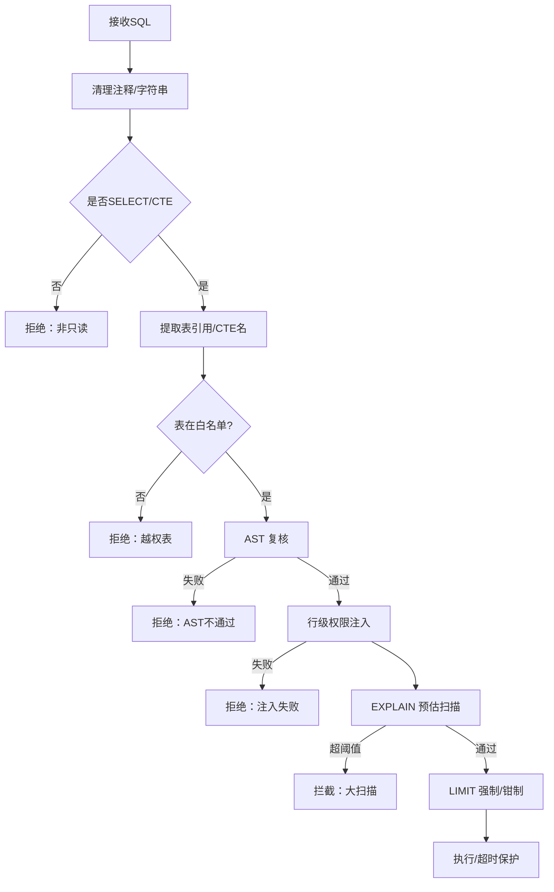
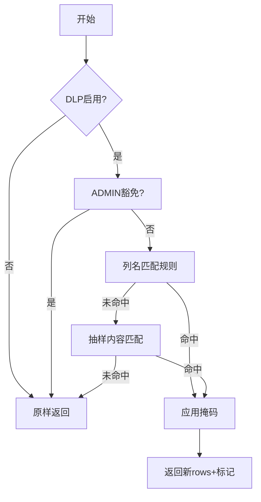
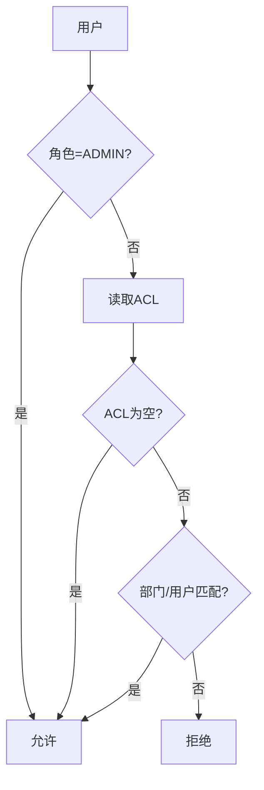
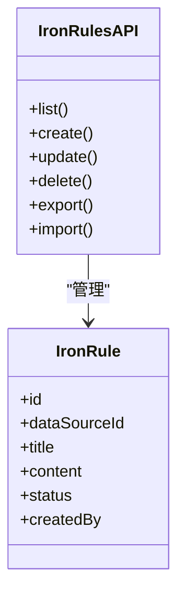
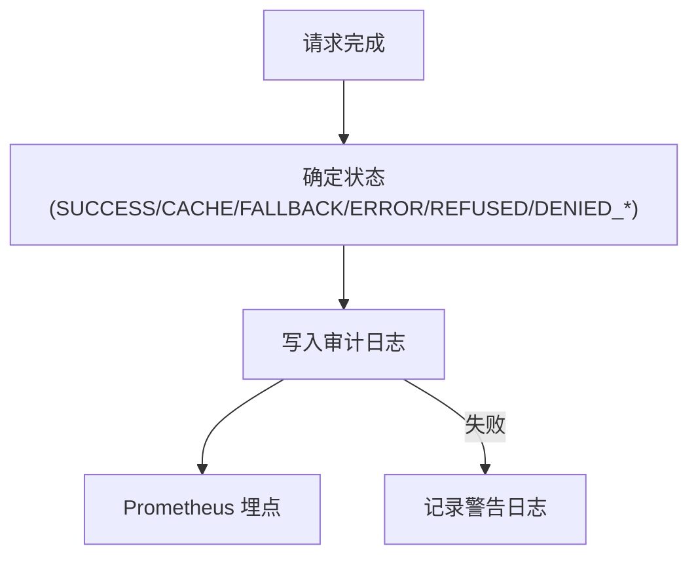
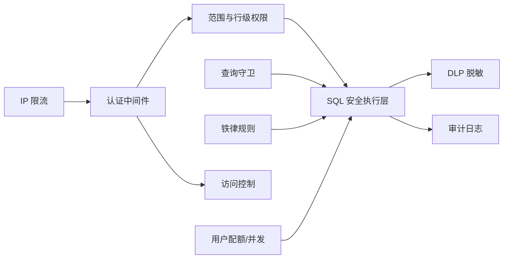

# 查询安全防护

<cite>
**本文引用的文件**
- [queryGuard.ts](file://server/query/queryGuard.ts)
- [ironRules.ts](file://server/query/ironRules.ts)
- [accessControl.ts](file://server/auth/accessControl.ts)
- [auditLog.ts](file://server/infra/auditLog.ts)
- [dlp.ts](file://server/query/dlp.ts)
- [sqlExecutor.ts](file://server/query/sqlExecutor.ts)
- [rateLimiter.ts](file://server/infra/rateLimiter.ts)
- [auth.ts](file://server/auth/auth.ts)
- [scope.ts](file://server/query/scope.ts)
- [userQueryLimit.ts](file://server/infra/userQueryLimit.ts)
- [ironRules.ts（路由）](file://server/routes/ironRules.ts)
</cite>

## 目录
1. [简介](#简介)
2. [项目结构与安全分层总览](#项目结构与安全分层总览)
3. [核心组件](#核心组件)
4. [架构总览](#架构总览)
5. [关键组件深度解析](#关键组件深度解析)
6. [依赖关系分析](#依赖关系分析)
7. [性能与可用性考量](#性能与可用性考量)
8. [故障排查指南](#故障排查指南)
9. [结论](#结论)
10. [附录：扩展与配置示例](#附录：扩展与配置示例)

## 简介
本文件系统性阐述“智能问数据分析系统”的查询安全防护体系，覆盖多层纵深防御：输入净化、SQL 注入防护、数据脱敏、敏感信息检测、访问控制、频率限制、审计日志、违规检测与应急响应。重点解释查询守卫的工作流程、铁律（Iron Rules）的设计理念与执行机制，并提供扩展安全策略、自定义脱敏规则、配置访问权限的实践指引。

## 项目结构与安全分层总览
系统在查询链路中按阶段实施安全检查，形成从请求入口到结果输出的全链路防护：
- L1 输入净化：拒绝提示注入、过滤控制字符、长度截断
- L3 上下文敏感列过滤：剔除敏感列名或描述命中列，防止进入 LLM 上下文
- P0 SQL 安全执行层：只读校验、表白名单、AST 复核、行级权限注入、EXPLAIN 防线、LIMIT 强制、超时保护
- DLP 数据防泄漏：结果集敏感字段自动脱敏（列名匹配 + 内容抽样）
- 访问控制：组织/部门维度 ACL、角色鉴权
- 频率限制：IP 级限流、用户级配额与并发互斥
- 审计日志：全链路成功/失败/拒绝记录，支持 Prometheus 埋点

**图表来源**
- [auth.ts:67-113](file://server/auth/auth.ts#L67-L113)
- [rateLimiter.ts:14-42](file://server/infra/rateLimiter.ts#L14-L42)
- [queryGuard.ts:27-69](file://server/query/queryGuard.ts#L27-L69)
- [ironRules.ts:44-49](file://server/query/ironRules.ts#L44-L49)
- [sqlExecutor.ts:291-387](file://server/query/sqlExecutor.ts#L291-L387)
- [sqlExecutor.ts:629-662](file://server/query/sqlExecutor.ts#L629-L662)
- [dlp.ts:103-161](file://server/query/dlp.ts#L103-L161)
- [auditLog.ts:38-61](file://server/infra/auditLog.ts#L38-L61)
- [accessControl.ts:44-73](file://server/auth/accessControl.ts#L44-L73)
- [userQueryLimit.ts:24-68](file://server/infra/userQueryLimit.ts#L24-L68)

**章节来源**
- [queryGuard.ts:27-69](file://server/query/queryGuard.ts#L27-L69)
- [sqlExecutor.ts:291-387](file://server/query/sqlExecutor.ts#L291-L387)
- [dlp.ts:103-161](file://server/query/dlp.ts#L103-L161)
- [accessControl.ts:44-73](file://server/auth/accessControl.ts#L44-L73)
- [rateLimiter.ts:14-42](file://server/infra/rateLimiter.ts#L14-L42)
- [userQueryLimit.ts:24-68](file://server/infra/userQueryLimit.ts#L24-L68)
- [auditLog.ts:38-61](file://server/infra/auditLog.ts#L38-L61)

## 核心组件
- 查询守卫（queryGuard）：L1 输入净化、L4 历史净化、L3 敏感列过滤
- SQL 安全执行层（sqlExecutor）：只读校验、AST 复核、表/列白名单、行级权限注入、EXPLAIN 防线、LIMIT 强制、超时保护
- 数据防泄漏（dlp）：列名匹配 + 内容抽样脱敏，角色豁免与全局开关
- 访问控制（accessControl）：ACL JSON 解析、部门/个人授权判定
- 铁律（ironRules）：管理员登记的数据源级强制规则，全量 ACTIVE 规则注入 prompt，最高优先级
- 审计日志（auditLog）：成功/降级/错误/拒绝统一落账，Prometheus 旁路埋点
- 频率限制（rateLimiter、userQueryLimit）：IP 级限流、用户级配额与并发互斥
- 范围与行级权限（scope）：DataScope 表/列圈定、行级谓词清洗与 AST 注入

**章节来源**
- [queryGuard.ts:27-100](file://server/query/queryGuard.ts#L27-L100)
- [sqlExecutor.ts:291-387](file://server/query/sqlExecutor.ts#L291-L387)
- [dlp.ts:26-60](file://server/query/dlp.ts#L26-L60)
- [accessControl.ts:18-73](file://server/auth/accessControl.ts#L18-L73)
- [ironRules.ts:28-49](file://server/query/ironRules.ts#L28-L49)
- [auditLog.ts:24-61](file://server/infra/auditLog.ts#L24-L61)
- [rateLimiter.ts:14-42](file://server/infra/rateLimiter.ts#L14-L42)
- [userQueryLimit.ts:24-68](file://server/infra/userQueryLimit.ts#L24-L68)
- [scope.ts:17-26](file://server/query/scope.ts#L17-L26)

## 架构总览
查询请求在到达数据库之前经历多重安全关卡；结果返回前进行脱敏并记录审计日志。

**图表来源**
- [auth.ts:67-113](file://server/auth/auth.ts#L67-L113)
- [rateLimiter.ts:14-42](file://server/infra/rateLimiter.ts#L14-L42)
- [queryGuard.ts:27-100](file://server/query/queryGuard.ts#L27-L100)
- [ironRules.ts:44-49](file://server/query/ironRules.ts#L44-L49)
- [sqlExecutor.ts:291-387](file://server/query/sqlExecutor.ts#L291-L387)
- [sqlExecutor.ts:629-662](file://server/query/sqlExecutor.ts#L629-L662)
- [dlp.ts:103-161](file://server/query/dlp.ts#L103-L161)
- [auditLog.ts:38-61](file://server/infra/auditLog.ts#L38-L61)

## 关键组件深度解析

### 查询守卫（Query Guard）
- L1 输入净化：类型校验、控制字符剥离、注入特征拒绝、最大长度截断
- L4 历史净化：仅保留 user 消息、注入检测、长度截断、轮数上限
- L3 敏感列过滤：基于列名/描述正则匹配，剔除敏感列并返回移除清单供 UI 与审计

**图表来源**
- [queryGuard.ts:27-53](file://server/query/queryGuard.ts#L27-L53)

**章节来源**
- [queryGuard.ts:27-69](file://server/query/queryGuard.ts#L27-L69)
- [queryGuard.ts:71-100](file://server/query/queryGuard.ts#L71-L100)

### SQL 安全执行层（SQL Executor）
- 只读校验：禁止写/DDL/管理类关键字，单语句限制，长度限制
- 表/列白名单：基于 DataScope 与敏感列过滤后的 Schema 构建允许集合
- AST 二道防线：node-sql-parser 语法树复核语句类型与表引用
- 行级权限注入：AST 包裹派生表，递归处理 CTE/子查询/UNION
- EXPLAIN 防线：预估扫描行数超过阈值则拦截，兼容 MySQL/PG
- LIMIT 强制：无 LIMIT 追加，有 LIMIT 则 clamp 到上限
- 超时保护：MySQL MAX_EXECUTION_TIME hint、PG statement_timeout

**图表来源**
- [sqlExecutor.ts:291-387](file://server/query/sqlExecutor.ts#L291-L387)
- [sqlExecutor.ts:396-489](file://server/query/sqlExecutor.ts#L396-L489)
- [sqlExecutor.ts:629-662](file://server/query/sqlExecutor.ts#L629-L662)

**章节来源**
- [sqlExecutor.ts:291-387](file://server/query/sqlExecutor.ts#L291-L387)
- [sqlExecutor.ts:396-489](file://server/query/sqlExecutor.ts#L396-L489)
- [sqlExecutor.ts:629-662](file://server/query/sqlExecutor.ts#L629-L662)

### 数据防泄漏（DLP）
- 双通道识别：列名关键词命中直接整列脱敏；否则对前 N 行抽样内容匹配
- 内置规则：手机号、身份证、银行卡、邮箱等，掩码保留首尾便于排查
- 角色策略：默认 ADMIN 豁免，可全局关闭；返回新对象避免污染缓存
- 结果包装：maskQueryPayload 为 payload 附加 dlp 标记，前端提示“已脱敏”

**图表来源**
- [dlp.ts:26-60](file://server/query/dlp.ts#L26-L60)
- [dlp.ts:103-161](file://server/query/dlp.ts#L103-L161)

**章节来源**
- [dlp.ts:26-60](file://server/query/dlp.ts#L26-L60)
- [dlp.ts:103-161](file://server/query/dlp.ts#L103-L161)

### 访问控制（ACL）
- 模型：data_sources.acl_json = { departments, userIds }
- 判定：ADMIN 放行；未配置 ACL 不限制；否则需匹配部门或个人
- 审批并入：通过后将 userId 加入 acl_json.userIds（幂等）

**图表来源**
- [accessControl.ts:18-73](file://server/auth/accessControl.ts#L18-L73)

**章节来源**
- [accessControl.ts:18-73](file://server/auth/accessControl.ts#L18-L73)

### 铁律（Iron Rules）
- 设计理念：管理员登记的数据源级强制规则，ACTIVE 规则全量恒注入阶段一 prompt，优先级高于样例与知识片段；生成 SQL 仍过安全执行层校验
- 输入校验：标题/正文长度限制、状态规范化
- 导入导出：JSON 备份/恢复，冲突策略 skip/overwrite，dryRun 预检
- 路由：仅 ADMIN 可维护，CRUD 与导入导出端点

**图表来源**
- [ironRules.ts:14-49](file://server/query/ironRules.ts#L14-L49)
- [ironRules.ts:64-127](file://server/query/ironRules.ts#L64-L127)
- [ironRules.ts:194-264](file://server/query/ironRules.ts#L194-L264)
- [ironRules.ts（路由）:21-149](file://server/routes/ironRules.ts#L21-L149)

**章节来源**
- [ironRules.ts:28-49](file://server/query/ironRules.ts#L28-L49)
- [ironRules.ts:64-127](file://server/query/ironRules.ts#L64-L127)
- [ironRules.ts:194-264](file://server/query/ironRules.ts#L194-L264)
- [ironRules.ts（路由）:21-149](file://server/routes/ironRules.ts#L21-L149)

### 审计日志与违规检测
- 审计条目：用户、端点、数据源、问题、状态、执行 SQL、行数、耗时
- 写入策略：Prometheus 旁路埋点，写入失败仅告警不阻塞主流程
- 违规检测：结合 IP 限流、用户配额、SQL 安全执行层拒绝原因、EXPLAIN 拦截等，统一以 DENIED_* 状态落账

**图表来源**
- [auditLog.ts:24-61](file://server/infra/auditLog.ts#L24-L61)

**章节来源**
- [auditLog.ts:24-61](file://server/infra/auditLog.ts#L24-L61)

### 频率限制与并发控制
- IP 级限流：内存滑动窗口或 Redis 固定分钟窗口，超限返回 429
- 用户级配额：每小时次数上限，Redis 模式分布式锁实现并发互斥
- 场景化连接池与超时：交互/分析链/导出独立配额与超时档位

**章节来源**
- [rateLimiter.ts:14-42](file://server/infra/rateLimiter.ts#L14-L42)
- [userQueryLimit.ts:24-68](file://server/infra/userQueryLimit.ts#L24-L68)
- [sqlExecutor.ts:62-109](file://server/query/sqlExecutor.ts#L62-L109)

## 依赖关系分析
- 认证中间件依赖 JWT 与用户表回查，确保禁用/角色变更即时生效
- 查询守卫依赖 schemaTypes，用于敏感列过滤的类型一致性
- SQL 执行层依赖 node-sql-parser 做 AST 复核，依赖驱动连接池与 EXPLAIN 能力
- DLP 依赖角色信息与环境变量控制开关与豁免
- 访问控制依赖 data_sources.acl_json 解析与用户部门信息
- 铁律模块依赖数据库持久化与管理员路由保护
- 审计日志依赖监控埋点与数据库写入

**图表来源**
- [auth.ts:67-113](file://server/auth/auth.ts#L67-L113)
- [scope.ts:17-26](file://server/query/scope.ts#L17-L26)
- [sqlExecutor.ts:291-387](file://server/query/sqlExecutor.ts#L291-L387)
- [queryGuard.ts:27-100](file://server/query/queryGuard.ts#L27-L100)
- [ironRules.ts:44-49](file://server/query/ironRules.ts#L44-L49)
- [dlp.ts:103-161](file://server/query/dlp.ts#L103-L161)
- [auditLog.ts:38-61](file://server/infra/auditLog.ts#L38-L61)
- [accessControl.ts:44-73](file://server/auth/accessControl.ts#L44-L73)
- [rateLimiter.ts:14-42](file://server/infra/rateLimiter.ts#L14-L42)
- [userQueryLimit.ts:24-68](file://server/infra/userQueryLimit.ts#L24-L68)

**章节来源**
- [auth.ts:67-113](file://server/auth/auth.ts#L67-L113)
- [sqlExecutor.ts:291-387](file://server/query/sqlExecutor.ts#L291-L387)
- [queryGuard.ts:27-100](file://server/query/queryGuard.ts#L27-L100)
- [dlp.ts:103-161](file://server/query/dlp.ts#L103-L161)
- [accessControl.ts:44-73](file://server/auth/accessControl.ts#L44-L73)
- [ironRules.ts:44-49](file://server/query/ironRules.ts#L44-L49)
- [auditLog.ts:38-61](file://server/infra/auditLog.ts#L38-L61)
- [rateLimiter.ts:14-42](file://server/infra/rateLimiter.ts#L14-L42)
- [userQueryLimit.ts:24-68](file://server/infra/userQueryLimit.ts#L24-L68)

## 性能与可用性考量
- 连接池分级与场景超时：交互/分析链/导出独立配额与超时，避免后台任务挤占交互
- EXPLAIN 防线：预估扫描超阈值拦截，保护数据源性能；失败 fail-open 不阻断正常查询
- DLP 抽样：仅对前 N 行内容匹配，控制 CPU 开销
- 审计写入失败：仅告警不阻塞主流程，保障可用性
- 限流与配额：Redis 模式多实例共享计数，内存模式定时清理过期记录

[本节为通用指导，无需特定文件引用]

## 故障排查指南
- 输入被拒绝：检查 queryGuard 的注入特征与控制字符过滤逻辑
- SQL 被拒绝：查看 sqlExecutor 的只读校验、AST 复核、表白名单、敏感列拒绝、LIMIT 强制
- 大扫描拦截：确认 EXPLAIN 阈值与场景配置，必要时增加筛选条件
- 结果脱敏异常：检查 DLP 开关、角色豁免、列名/内容匹配规则
- 权限不足：核对 ACL 配置与用户部门/ID 匹配
- 频率限制：查看 IP 限流与用户配额是否达到上限
- 审计缺失：确认审计写入是否失败并记录警告日志

**章节来源**
- [queryGuard.ts:27-69](file://server/query/queryGuard.ts#L27-L69)
- [sqlExecutor.ts:291-387](file://server/query/sqlExecutor.ts#L291-L387)
- [sqlExecutor.ts:629-662](file://server/query/sqlExecutor.ts#L629-L662)
- [dlp.ts:103-161](file://server/query/dlp.ts#L103-L161)
- [accessControl.ts:44-73](file://server/auth/accessControl.ts#L44-L73)
- [rateLimiter.ts:14-42](file://server/infra/rateLimiter.ts#L14-L42)
- [userQueryLimit.ts:24-68](file://server/infra/userQueryLimit.ts#L24-L68)
- [auditLog.ts:38-61](file://server/infra/auditLog.ts#L38-L61)

## 结论
本系统通过“输入净化—上下文过滤—SQL 安全执行—结果脱敏—访问控制—频率限制—审计日志”的多层纵深防御，确保查询过程的安全性与可控性。铁律系统提供强约束的业务规则注入，结合 AST 复核与 EXPLAIN 防线，有效防范 SQL 注入与越权访问。DLP 与审计机制保障数据隐私与可追溯性。整体设计兼顾安全性、可用性与性能，适合企业级数据分析场景。

[本节为总结性内容，无需特定文件引用]

## 附录：扩展与配置示例

- 扩展安全策略（SQL 安全执行层）
  - 新增危险关键字或调整白名单：参考 validateSelectSql 与 FORBIDDEN_PATTERN 定义位置
  - 调整 LIMIT 上限与场景超时：参考 MAX_ROWS、scenarioTimeoutMs、dsPoolScenarioMax
  - 行级权限注入：参考 injectRowFilters 与 scope.rowFilters 清洗

  **章节来源**
  - [sqlExecutor.ts:155-163](file://server/query/sqlExecutor.ts#L155-L163)
  - [sqlExecutor.ts:291-387](file://server/query/sqlExecutor.ts#L291-L387)
  - [sqlExecutor.ts:396-489](file://server/query/sqlExecutor.ts#L396-L489)
  - [sqlExecutor.ts:62-109](file://server/query/sqlExecutor.ts#L62-L109)

- 自定义脱敏规则（DLP）
  - 新增 DLP_RULES 项：定义 key、label、columnPattern、valuePattern、mask
  - 调整抽样行数：修改 SAMPLE_ROWS
  - 角色豁免与全局开关：通过环境变量 DLP_EXEMPT_ADMIN、DLP_ENABLED 控制

  **章节来源**
  - [dlp.ts:26-60](file://server/query/dlp.ts#L26-L60)
  - [dlp.ts:62-72](file://server/query/dlp.ts#L62-L72)
  - [dlp.ts:103-161](file://server/query/dlp.ts#L103-L161)

- 配置访问权限（ACL）
  - 设置 data_sources.acl_json：departments、userIds 数组
  - 使用 sanitizeAcl 清洗入参，grantUserAccess 审批并入
  - 通过 checkDataSourceAccess 在服务端校验

  **章节来源**
  - [accessControl.ts:18-41](file://server/auth/accessControl.ts#L18-L41)
  - [accessControl.ts:75-107](file://server/auth/accessControl.ts#L75-L107)

- 铁律规则管理
  - 创建/更新/删除：仅 ADMIN 可通过路由端点操作
  - 导入/导出：JSON 备份/恢复，支持 dryRun 与冲突策略
  - Prompt 注入：buildIronRulesPrompt 将 ACTIVE 规则全量注入阶段一

  **章节来源**
  - [ironRules.ts:28-49](file://server/query/ironRules.ts#L28-L49)
  - [ironRules.ts:64-127](file://server/query/ironRules.ts#L64-L127)
  - [ironRules.ts:194-264](file://server/query/ironRules.ts#L194-L264)
  - [ironRules.ts（路由）:21-149](file://server/routes/ironRules.ts#L21-L149)

- 审计日志与违规检测
  - 记录端点、状态、执行 SQL、行数、耗时
  - 结合 IP 限流、用户配额、SQL 安全执行层拒绝原因统一落账
  - 写入失败仅告警，不影响主流程

  **章节来源**
  - [auditLog.ts:24-61](file://server/infra/auditLog.ts#L24-L61)
  - [rateLimiter.ts:14-42](file://server/infra/rateLimiter.ts#L14-L42)
  - [userQueryLimit.ts:24-68](file://server/infra/userQueryLimit.ts#L24-L68)
  - [sqlExecutor.ts:291-387](file://server/query/sqlExecutor.ts#L291-L387)