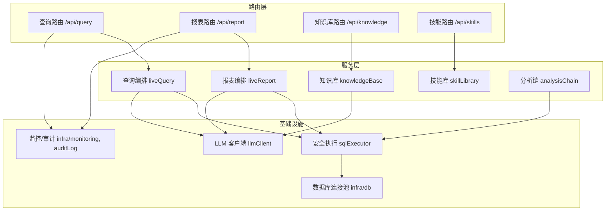
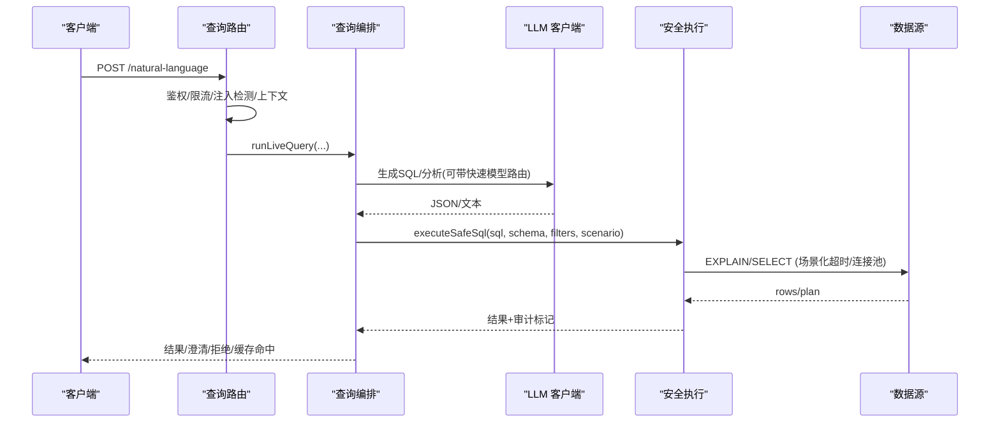
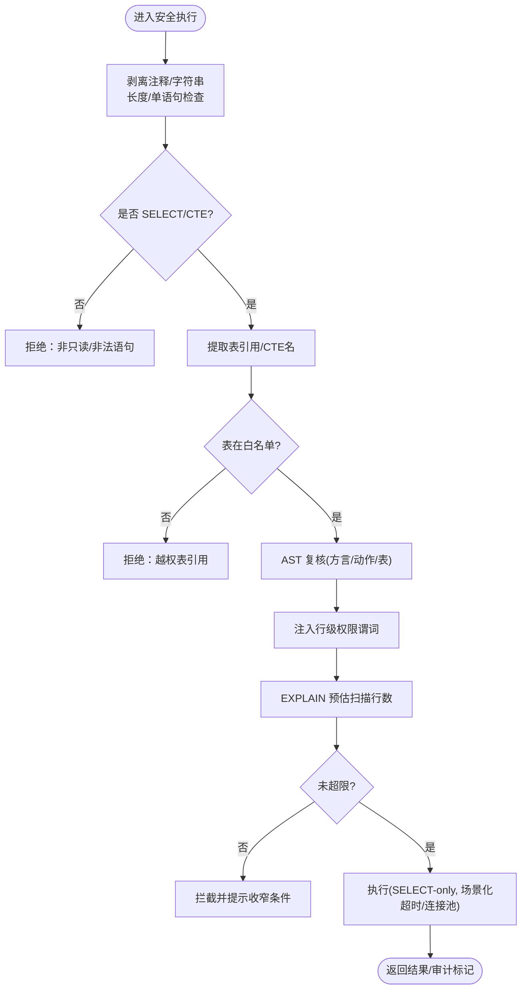
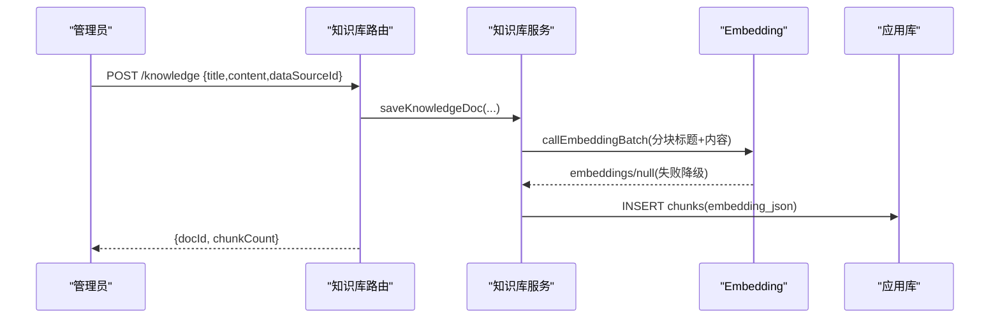
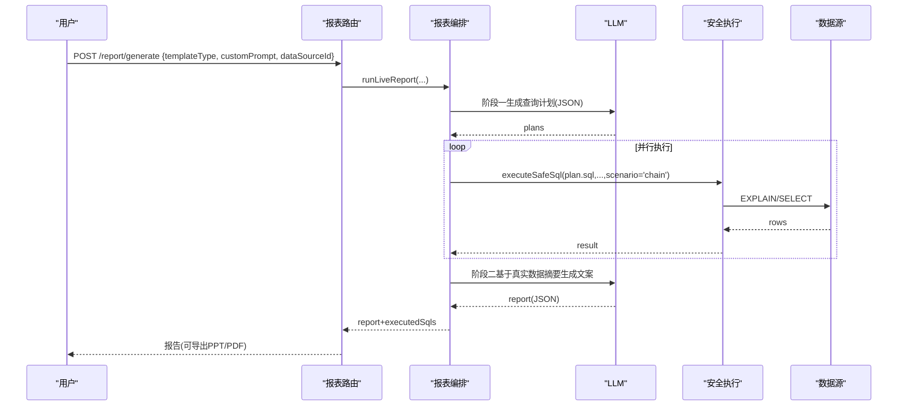
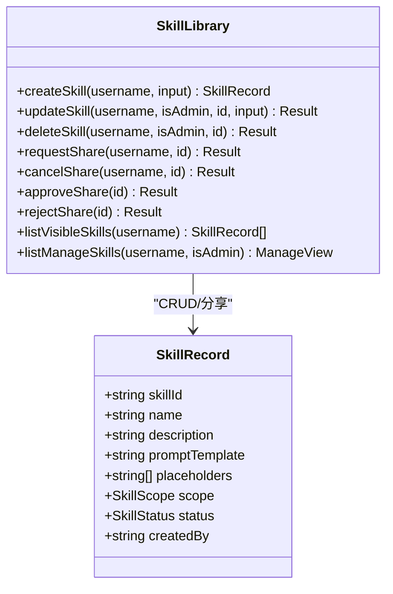
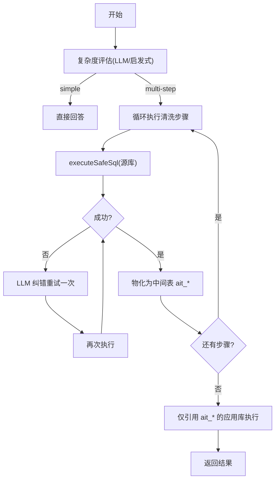
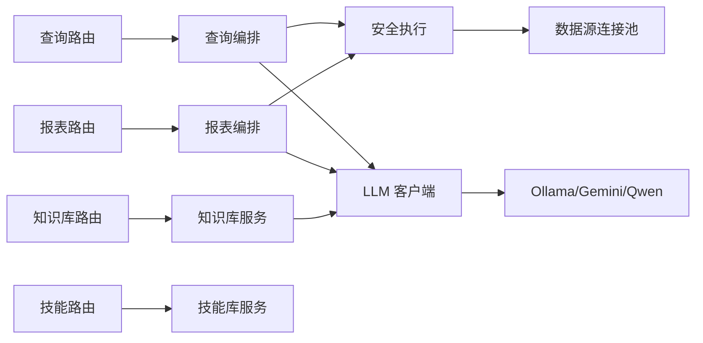

# 核心业务模块

<cite>
**本文引用的文件**
- [server/query/sqlExecutor.ts](file://server/query/sqlExecutor.ts)
- [server/knowledge/knowledgeBase.ts](file://server/knowledge/knowledgeBase.ts)
- [server/report/liveReport.ts](file://server/report/liveReport.ts)
- [server/analysisChain.ts](file://server/analysisChain.ts)
- [server/routes/query.ts](file://server/routes/query.ts)
- [server/routes/knowledge.ts](file://server/routes/knowledge.ts)
- [server/routes/report.ts](file://server/routes/report.ts)
- [server/skillLibrary.ts](file://server/skillLibrary.ts)
- [server/routes/skills.ts](file://server/routes/skills.ts)
- [server/llm/llmClient.ts](file://server/llm/llmClient.ts)
</cite>

## 目录
1. [简介](#简介)
2. [项目结构](#项目结构)
3. [核心组件](#核心组件)
4. [架构总览](#架构总览)
5. [详细组件分析](#详细组件分析)
6. [依赖关系分析](#依赖关系分析)
7. [性能考量](#性能考量)
8. [故障排查指南](#故障排查指南)
9. [结论](#结论)
10. [附录](#附录)

## 简介
本文件面向“智能问数据分析系统”的核心业务模块，聚焦四大子系统：查询处理引擎（NL2SQL转换、SQL执行与结果分析）、知识库管理系统（CRUD、语义检索、外部集成）、报表生成器（动态报表、模板管理、导出）、技能库系统（注册、执行流程、效果评估）。文档从业务逻辑、数据流转、组件交互、依赖关系、扩展点与性能优化等维度进行系统化说明，并提供使用示例、配置项与排障指引。

## 项目结构
- 路由层：对外暴露 HTTP API，负责鉴权、限流、审计、上下文装配与错误兜底。
- 服务层：封装领域能力（查询编排、报表生成、知识库、技能库、中间表清洗链）。
- 基础设施：LLM 统一调用通道、连接池与安全执行层、监控与审计、任务队列、状态存储。
- 前端：可视化面板、图表、报告中心、知识管理与技能管理等。

**图示来源**
- [server/routes/query.ts:47-393](file://server/routes/query.ts#L47-L393)
- [server/routes/report.ts:31-160](file://server/routes/report.ts#L31-L160)
- [server/routes/knowledge.ts:70-107](file://server/routes/knowledge.ts#L70-L107)
- [server/routes/skills.ts:52-81](file://server/routes/skills.ts#L52-L81)
- [server/report/liveReport.ts:350-492](file://server/report/liveReport.ts#L350-L492)
- [server/query/sqlExecutor.ts:734-832](file://server/query/sqlExecutor.ts#L734-L832)
- [server/llm/llmClient.ts:449-525](file://server/llm/llmClient.ts#L449-L525)

**章节来源**
- [server/routes/query.ts:47-393](file://server/routes/query.ts#L47-L393)
- [server/routes/report.ts:31-160](file://server/routes/report.ts#L31-L160)
- [server/routes/knowledge.ts:70-107](file://server/routes/knowledge.ts#L70-L107)
- [server/routes/skills.ts:52-81](file://server/routes/skills.ts#L52-L81)

## 核心组件
- 查询处理引擎：提供 NL2SQL 计划生成、安全执行（白名单/敏感列/行级权限/EXPLAIN 防线/场景化超时与连接池配额）、结果分析与下钻。
- 知识库管理：按数据源登记业务知识，切块与 embedding 入库；检索时向量相似度或 bigram 降级；支持导入导出与编辑。
- 报表生成器：双阶段真实报表（阶段一生成查询计划，阶段二基于真实数据摘要生成高管文案）；支持计划批准、PPT/PDF 导出与异步任务。
- 技能库系统：用户个人与系统共享技能（提问模板），分享审核机制；不绕过 NL2SQL 与安全执行层。
- 分析链（中间表）：复杂问题先规划多步清洗，落应用库中间表 ait_*，最终仅引用已注册中间表执行。

**章节来源**
- [server/query/sqlExecutor.ts:24-110](file://server/query/sqlExecutor.ts#L24-L110)
- [server/knowledge/knowledgeBase.ts:13-26](file://server/knowledge/knowledgeBase.ts#L13-L26)
- [server/report/liveReport.ts:28-34](file://server/report/liveReport.ts#L28-L34)
- [server/skillLibrary.ts:1-8](file://server/skillLibrary.ts#L1-L8)
- [server/analysisChain.ts:1-6](file://server/analysisChain.ts#L1-L6)

## 架构总览
系统以“路由 → 服务 → 基础设施”分层组织。所有 SQL 执行必须经过安全执行层；LLM 调用通过统一通道具备熔断、重试、并发控制与自适应超时；知识库检索在问数与报表链路中复用同一函数；报表支持计划模式与异步导出。

**图示来源**
- [server/routes/query.ts:47-393](file://server/routes/query.ts#L47-L393)
- [server/report/liveReport.ts:350-492](file://server/report/liveReport.ts#L350-L492)
- [server/query/sqlExecutor.ts:734-832](file://server/query/sqlExecutor.ts#L734-L832)
- [server/llm/llmClient.ts:449-525](file://server/llm/llmClient.ts#L449-L525)

## 详细组件分析

### 查询处理引擎（NL2SQL 转换、SQL 执行、结果分析）
- 安全执行层
  - 只读校验：正则 + AST 双重校验，拒绝写/DDL/危险关键字；CTE 放行但需 AST 解析成功。
  - 白名单与敏感列：仅允许 Schema 白名单内表；敏感列整词匹配拒绝。
  - 行级权限：AST 包裹派生表注入 WHERE 谓词，覆盖子查询/UNION/CTE。
  - EXPLAIN 防线：预估扫描行数超阈值拦截（MySQL/PG 兼容解析）。
  - 场景化资源：interactive/chain/export 三类场景独立连接池配额与超时；MySQL 注入 MAX_EXECUTION_TIME hint。
  - 结果截断：默认最大返回行数保护。
- 路由集成
  - 输入净化、ACL、限流、并发槽互斥、SSE 流式事件与断线续传、推导留痕、缓存命中（精确+语义）。
  - 失败降级：演示模式或兜底结果，保证可用性。

**图示来源**
- [server/query/sqlExecutor.ts:169-387](file://server/query/sqlExecutor.ts#L169-L387)
- [server/query/sqlExecutor.ts:396-489](file://server/query/sqlExecutor.ts#L396-L489)
- [server/query/sqlExecutor.ts:629-662](file://server/query/sqlExecutor.ts#L629-L662)
- [server/query/sqlExecutor.ts:734-832](file://server/query/sqlExecutor.ts#L734-L832)

**章节来源**
- [server/query/sqlExecutor.ts:24-110](file://server/query/sqlExecutor.ts#L24-L110)
- [server/query/sqlExecutor.ts:169-387](file://server/query/sqlExecutor.ts#L169-L387)
- [server/query/sqlExecutor.ts:396-489](file://server/query/sqlExecutor.ts#L396-L489)
- [server/query/sqlExecutor.ts:629-662](file://server/query/sqlExecutor.ts#L629-L662)
- [server/query/sqlExecutor.ts:734-832](file://server/query/sqlExecutor.ts#L734-L832)
- [server/routes/query.ts:47-393](file://server/routes/query.ts#L47-L393)

### 知识库管理系统（CRUD、语义搜索、外部集成）
- 文档切块与嵌入
  - 段落优先切块，相邻块重叠避免语义断裂；批量 embedding 请求，失败降级为关键词检索。
- 检索排序
  - 向量余弦相似度为主，bigram 降级；设置相关性阈值过滤无关片段；同文档最多入选若干块；高价值口径/指南类文档保留至少一个槽位。
- CRUD 与导入导出
  - 管理员登记/编辑/删除；导出还原完整原文；导入支持冲突策略（跳过/覆盖/追加）与 dryRun 预检。
- 与问数/报表集成
  - 检索函数被问数与报表共用，失败降级为空串，不阻断主链路。

**图示来源**
- [server/routes/knowledge.ts:94-107](file://server/routes/knowledge.ts#L94-L107)
- [server/knowledge/knowledgeBase.ts:172-197](file://server/knowledge/knowledgeBase.ts#L172-L197)
- [server/knowledge/knowledgeBase.ts:207-239](file://server/knowledge/knowledgeBase.ts#L207-L239)

**章节来源**
- [server/knowledge/knowledgeBase.ts:13-26](file://server/knowledge/knowledgeBase.ts#L13-L26)
- [server/knowledge/knowledgeBase.ts:44-75](file://server/knowledge/knowledgeBase.ts#L44-L75)
- [server/knowledge/knowledgeBase.ts:106-157](file://server/knowledge/knowledgeBase.ts#L106-L157)
- [server/knowledge/knowledgeBase.ts:172-197](file://server/knowledge/knowledgeBase.ts#L172-L197)
- [server/knowledge/knowledgeBase.ts:207-239](file://server/knowledge/knowledgeBase.ts#L207-L239)
- [server/routes/knowledge.ts:94-107](file://server/routes/knowledge.ts#L94-L107)
- [server/routes/knowledge.ts:164-224](file://server/routes/knowledge.ts#L164-L224)
- [server/routes/knowledge.ts:249-375](file://server/routes/knowledge.ts#L249-L375)

### 报表生成器（动态报表、模板管理、导出功能）
- 双阶段真实报表
  - 阶段一：注入 Schema、指标口径、铁律规则、知识库片段，生成 2-4 条聚合查询计划（JSON 契约校验，失败重试一次）。
  - 执行：多条计划并行过安全执行层，允许部分失败，至少一条成功继续。
  - 阶段二：将各图真实数据摘要回喂 LLM，生成高管摘要、洞察、KPI 与逐图解读；服务端兜底中文化英文标识符。
- 计划批准与金额单位一致性
  - 计划 TTL 一次性消费；批准时校验用户/数据源/模板/金额单位一致，防止口径互串。
- 导出与异步
  - PPTX/PDF 导出；异步任务提交返回 taskId，worker 独立并发执行；PDF 导出支持横竖版与水印。

**图示来源**
- [server/routes/report.ts:31-160](file://server/routes/report.ts#L31-L160)
- [server/report/liveReport.ts:237-320](file://server/report/liveReport.ts#L237-L320)
- [server/report/liveReport.ts:350-492](file://server/report/liveReport.ts#L350-L492)

**章节来源**
- [server/report/liveReport.ts:28-34](file://server/report/liveReport.ts#L28-L34)
- [server/report/liveReport.ts:237-320](file://server/report/liveReport.ts#L237-L320)
- [server/report/liveReport.ts:350-492](file://server/report/liveReport.ts#L350-L492)
- [server/routes/report.ts:31-160](file://server/routes/report.ts#L31-L160)
- [server/routes/report.ts:162-226](file://server/routes/report.ts#L162-L226)
- [server/routes/report.ts:480-584](file://server/routes/report.ts#L480-L584)

### 技能库系统（技能注册、执行流程、效果评估）
- 范围与权限
  - USER scope：个人技能，仅本人维护；SYSTEM scope：系统默认技能，管理员维护，全员可见可用。
- 生命周期
  - 创建/编辑/删除；发起分享申请（PENDING_SHARE），管理员批准复制进系统库（重名自动加后缀），拒绝退回私有。
- 执行约束
  - 技能仅为“提问模板”，不绕过 NL2SQL 与安全执行层。
- 管理视图
  - 我的技能、系统技能、待审核分享列表。

**图示来源**
- [server/skillLibrary.ts:15-24](file://server/skillLibrary.ts#L15-L24)
- [server/skillLibrary.ts:129-174](file://server/skillLibrary.ts#L129-L174)
- [server/skillLibrary.ts:177-241](file://server/skillLibrary.ts#L177-L241)
- [server/routes/skills.ts:52-145](file://server/routes/skills.ts#L52-L145)

**章节来源**
- [server/skillLibrary.ts:1-8](file://server/skillLibrary.ts#L1-L8)
- [server/skillLibrary.ts:129-174](file://server/skillLibrary.ts#L129-L174)
- [server/skillLibrary.ts:177-241](file://server/skillLibrary.ts#L177-L241)
- [server/routes/skills.ts:52-145](file://server/routes/skills.ts#L52-L145)

### 分析链（中间表物化与引用）
- 复杂度评估：无清洗信号直接判 simple；必要时走 LLM 评估并输出多步清洗计划。
- 步骤执行与自愈：每步经安全执行层执行，失败携带错误让 LLM 自纠一次。
- 中间表物化：剔除敏感列，推断列类型，批量写入应用库 ait_* 表，注册元信息并设置 TTL。
- 引用校验：最终 SQL 仅允许引用已注册且未过期的中间表，并在应用库执行。

**图示来源**
- [server/analysisChain.ts:49-112](file://server/analysisChain.ts#L49-L112)
- [server/analysisChain.ts:138-156](file://server/analysisChain.ts#L138-L156)
- [server/analysisChain.ts:218-253](file://server/analysisChain.ts#L218-L253)
- [server/analysisChain.ts:269-326](file://server/analysisChain.ts#L269-L326)
- [server/analysisChain.ts:361-384](file://server/analysisChain.ts#L361-L384)

**章节来源**
- [server/analysisChain.ts:49-112](file://server/analysisChain.ts#L49-L112)
- [server/analysisChain.ts:138-156](file://server/analysisChain.ts#L138-L156)
- [server/analysisChain.ts:218-253](file://server/analysisChain.ts#L218-L253)
- [server/analysisChain.ts:269-326](file://server/analysisChain.ts#L269-L326)
- [server/analysisChain.ts:361-384](file://server/analysisChain.ts#L361-L384)

## 依赖关系分析
- 路由到服务：查询/报表/知识库/技能路由分别委托对应服务实现。
- 服务到基础设施：
  - 查询/报表/分析链均依赖安全执行层；报表与分析链还依赖 LLM 客户端。
  - 知识库依赖 LLM 的 embedding 能力；失败降级不影响主链路。
- 安全执行层依赖数据源驱动（mysql2/pg）与监控埋点；支持 EXPLAIN 防护与场景化超时。
- LLM 客户端具备熔断、重试、并发限制、自适应超时与多后端选择。

**图示来源**
- [server/routes/query.ts:47-393](file://server/routes/query.ts#L47-L393)
- [server/routes/report.ts:31-160](file://server/routes/report.ts#L31-L160)
- [server/routes/knowledge.ts:70-107](file://server/routes/knowledge.ts#L70-L107)
- [server/routes/skills.ts:52-81](file://server/routes/skills.ts#L52-L81)
- [server/query/sqlExecutor.ts:734-832](file://server/query/sqlExecutor.ts#L734-L832)
- [server/llm/llmClient.ts:449-525](file://server/llm/llmClient.ts#L449-L525)

**章节来源**
- [server/query/sqlExecutor.ts:734-832](file://server/query/sqlExecutor.ts#L734-L832)
- [server/llm/llmClient.ts:449-525](file://server/llm/llmClient.ts#L449-L525)

## 性能考量
- 连接池与场景化配额
  - 数据源连接池容量公式化，按 interactive/chain/export 分级配额；显式环境变量优先。
  - 场景化超时：交互 15s、分析链 120s、导出 60s；可通过环境变量覆盖。
- EXPLAIN 防线
  - 预估扫描行数超过阈值拦截，保护业务库；失败 fail-open 不阻断正常查询。
- LLM 韧性
  - 重试、熔断、并发信号量、自适应超时；多后端故障转移；用量埋点。
- 缓存与会话
  - 精确+语义缓存命中；SSE 断线续传；计划一次性消费防重放。
- 中间表与 TTL
  - 用户配额限制（最多 10 张）；TTL 清理定时任务；批写入提升吞吐。

**章节来源**
- [server/query/sqlExecutor.ts:44-110](file://server/query/sqlExecutor.ts#L44-L110)
- [server/query/sqlExecutor.ts:629-662](file://server/query/sqlExecutor.ts#L629-L662)
- [server/llm/llmClient.ts:61-107](file://server/llm/llmClient.ts#L61-L107)
- [server/analysisChain.ts:192-204](file://server/analysisChain.ts#L192-L204)
- [server/analysisChain.ts:389-411](file://server/analysisChain.ts#L389-L411)

## 故障排查指南
- 查询被拒绝
  - 常见原因：非 SELECT/包含危险关键字/引用不在白名单/涉及敏感列/CTE 无法解析/EXPLAIN 预估扫描过大。
  - 定位：查看审计日志中的 reason/detail；确认 Schema 白名单与敏感列配置；调整筛选条件或增加索引。
- 执行慢或超时
  - 检查场景化超时与连接池配额；确认 EXPLAIN 是否触发拦截；对大表查询增加时间/部门/维度限定。
- LLM 不可用
  - 观察熔断与故障转移日志；检查密钥与网络；适当提高 LLM_RETRY_MAX 或调整 LLM_BREAKER_*。
- 知识库检索无效
  - 确认 embedding 是否成功；若失败会降级为 bigram；检查 KNOWLEDGE_MIN_SCORE 阈值与文档切块质量。
- 报表生成失败
  - 阶段一：检查 JSON 契约与字段映射；阶段二：关注 LLM 输出解析与中文化兜底；导出失败检查 base64 PNG 大小与格式。
- 技能分享异常
  - 确认分享状态（ACTIVE/PENDING_SHARE）；管理员审批后重名自动加后缀；撤回仅在 PENDING_SHARE 有效。

**章节来源**
- [server/query/sqlExecutor.ts:169-387](file://server/query/sqlExecutor.ts#L169-L387)
- [server/query/sqlExecutor.ts:629-662](file://server/query/sqlExecutor.ts#L629-L662)
- [server/llm/llmClient.ts:61-107](file://server/llm/llmClient.ts#L61-L107)
- [server/knowledge/knowledgeBase.ts:106-157](file://server/knowledge/knowledgeBase.ts#L106-L157)
- [server/report/liveReport.ts:237-320](file://server/report/liveReport.ts#L237-L320)
- [server/skillLibrary.ts:177-241](file://server/skillLibrary.ts#L177-L241)

## 结论
本系统通过“安全执行层 + 统一 LLM 通道 + 场景化资源治理”构建了稳定可靠的智能问数与报表能力。知识库与技能库增强了业务语义与模板化能力，分析链支撑复杂清洗场景。整体设计强调安全、可观测、可扩展与高性能，适合企业级部署与持续演进。

## 附录
- 关键配置项（示例）
  - 数据源连接池：DS_POOL_MAX、DS_POOL_INTERACTIVE、DS_POOL_CHAIN、DS_POOL_EXPORT
  - 场景超时：QUERY_TIMEOUT_INTERACTIVE_MS、QUERY_TIMEOUT_CHAIN_MS、QUERY_TIMEOUT_EXPORT_MS
  - EXPLAIN 阈值：SQL_EXPLAIN_MAX_ROWS（0 关闭）
  - LLM：LLM_MODEL、AI_ENGINE、LLM_SQL_ENGINE/MODEL、LLM_ANALYSIS_ENGINE/MODEL、LLM_RETRY_MAX、LLM_MAX_CONCURRENT、LLM_BREAKER_FAILS、LLM_BREAKER_COOLDOWN_MS、LLM_ADAPTIVE_TIMEOUT
  - 知识库：KNOWLEDGE_MIN_SCORE
- 使用示例（路径参考）
  - 智能问数：POST /api/query/natural-language（见路由入口）
  - 报表生成：POST /api/report/generate（含 planId 批准模式）
  - 知识库：POST /api/knowledge（登记）、GET /api/knowledge/export（导出）、POST /api/knowledge/import（导入）
  - 技能库：POST /api/skills（新建）、POST /api/skills/:id/share（分享）、管理员 approve/reject
- 扩展点
  - 新增数据源类型：在安全执行层添加方言与驱动适配；在路由层接入 ACL 与上下文。
  - 新增 LLM 后端：在客户端扩展通道与熔断/重试策略。
  - 新增报表模板：在服务端注入模板提示词与字段映射，保持 JSON 契约不变。
  - 新增技能模板：在技能库中注册，遵循占位符规范，不改变执行安全边界。