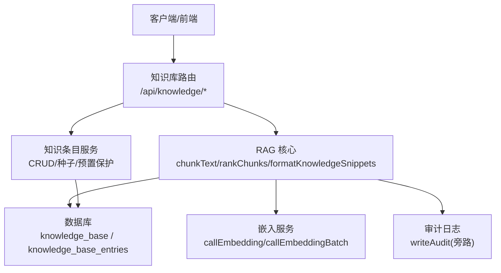
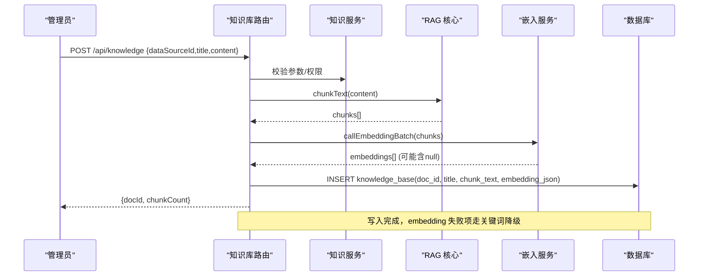
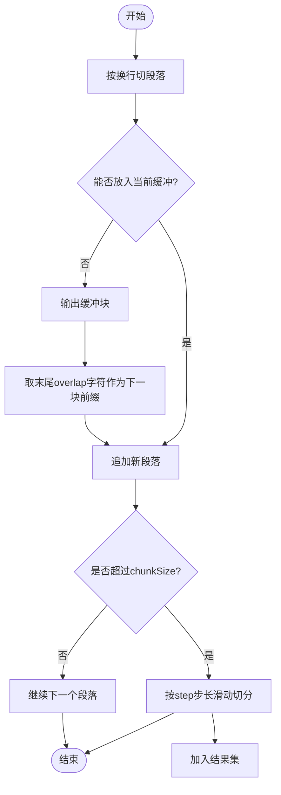
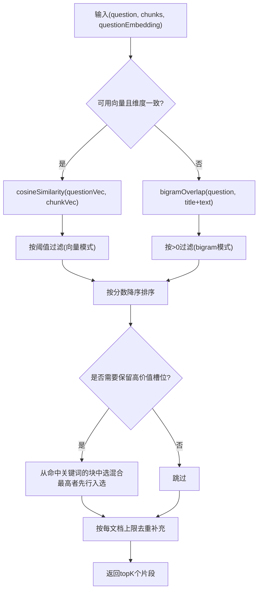
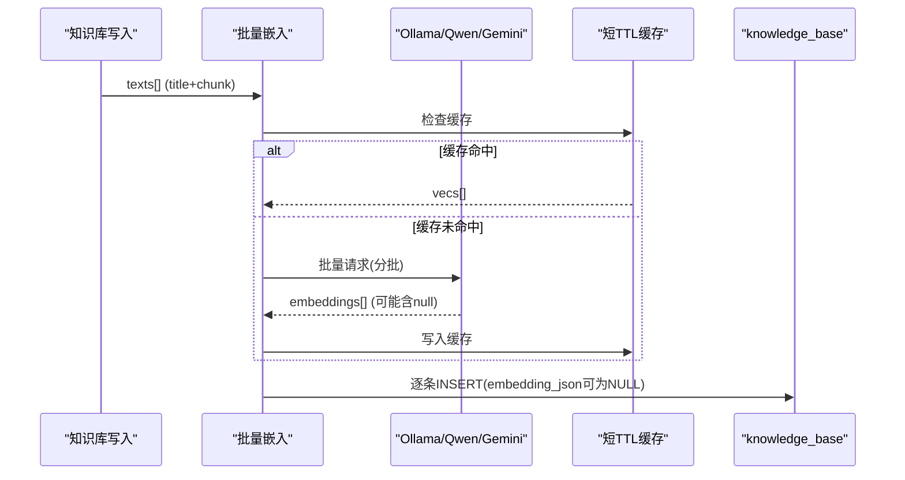
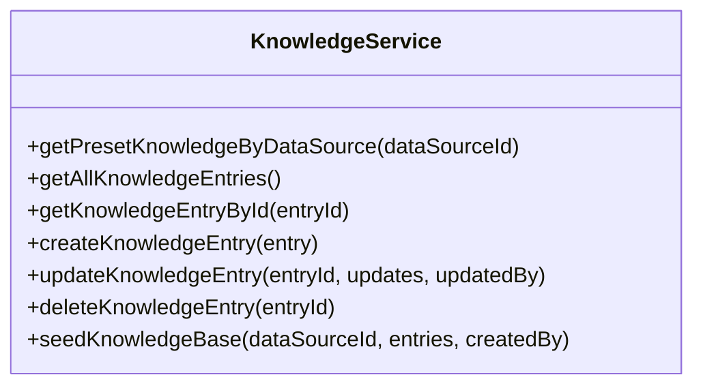
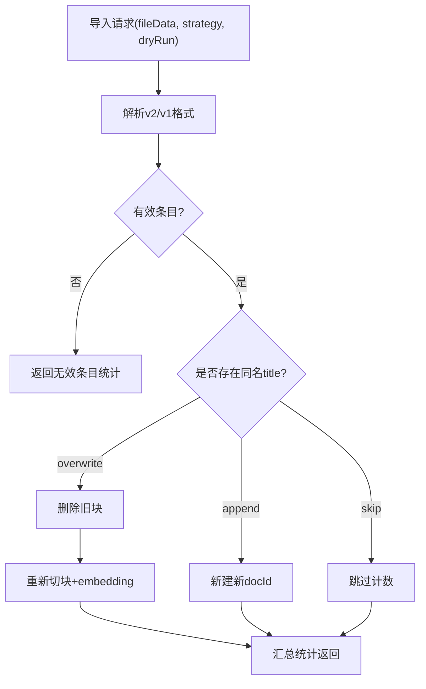
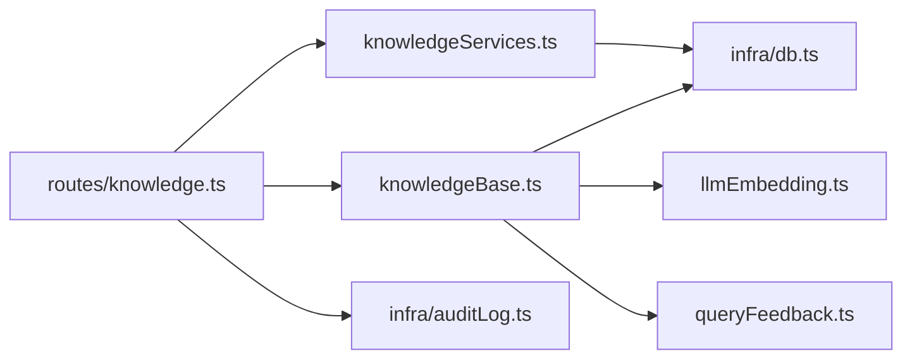

# 内部知识管理

<cite>
**本文引用的文件**
- [server/knowledge/knowledgeBase.ts](file://server/knowledge/knowledgeBase.ts)
- [server/knowledge/knowledgeServices.ts](file://server/knowledge/knowledgeServices.ts)
- [server/routes/knowledge.ts](file://server/routes/knowledge.ts)
- [server/llm/llmEmbedding.ts](file://server/llm/llmEmbedding.ts)
- [server/query/queryFeedback.ts](file://server/query/queryFeedback.ts)
- [server/infra/db.ts](file://server/infra/db.ts)
- [server/infra/auditLog.ts](file://server/infra/auditLog.ts)
</cite>

## 目录
1. [简介](#简介)
2. [项目结构](#项目结构)
3. [核心组件](#核心组件)
4. [架构总览](#架构总览)
5. [详细组件分析](#详细组件分析)
6. [依赖关系分析](#依赖关系分析)
7. [性能考虑](#性能考虑)
8. [故障排查指南](#故障排查指南)
9. [结论](#结论)
10. [附录：配置与调优](#附录：配置与调优)

## 简介
本系统提供企业级“内部知识库”能力，用于在问数链路中注入权威的业务口径、术语与计算规则，提升生成 SQL 的准确性与一致性。知识库支持文档切块、向量检索与关键词降级、导入导出、版本化条目管理、冲突处理与审计日志等完整生命周期。

## 项目结构
- 路由层：对外暴露知识库文档 CRUD、导入导出、详情查询等接口（按数据源隔离）。
- 服务层：实现知识条目的增删改查、预置条目保护、种子数据初始化。
- RAG 核心：文本切块、余弦相似度、bigram 关键词匹配、阈值过滤、多文档限制、提示词格式化。
- 嵌入层：统一调用 Ollama/Qwen/Gemini 的 embedding 接口，支持批量、短 TTL 缓存与失败降级。
- 存储层：MySQL 持久化（knowledge_base、knowledge_base_entries 等），连接池与建表迁移。
- 审计层：全链路审计落库，失败不阻塞主流程。



图表来源
- [server/routes/knowledge.ts:60-454](file://server/routes/knowledge.ts#L60-L454)
- [server/knowledge/knowledgeBase.ts:44-166](file://server/knowledge/knowledgeBase.ts#L44-L166)
- [server/llm/llmEmbedding.ts:60-315](file://server/llm/llmEmbedding.ts#L60-L315)
- [server/infra/db.ts:301-336](file://server/infra/db.ts#L301-L336)
- [server/infra/auditLog.ts:38-61](file://server/infra/auditLog.ts#L38-L61)

章节来源
- [server/routes/knowledge.ts:60-454](file://server/routes/knowledge.ts#L60-L454)
- [server/knowledge/knowledgeBase.ts:44-166](file://server/knowledge/knowledgeBase.ts#L44-L166)
- [server/llm/llmEmbedding.ts:60-315](file://server/llm/llmEmbedding.ts#L60-L315)
- [server/infra/db.ts:301-336](file://server/infra/db.ts#L301-L336)
- [server/infra/auditLog.ts:38-61](file://server/infra/auditLog.ts#L38-L61)

## 核心组件
- 文本切块 chunkText：段落优先合并，超长时按步长切分，相邻块保留重叠，避免语义截断。
- 检索排序 rankChunks：向量模式用余弦相似度并按阈值过滤；非向量模式降级 bigram 关键词；同文档最多入选若干块；为高价值口径/指南类文档保留槽位。
- 嵌入 callEmbedding/callEmbeddingBatch：统一接入 Ollama/Qwen/Gemini，支持批量、短 TTL 缓存、失败降级为 null 并触发关键词检索。
- 持久化 saveKnowledgeDoc/retrieveKnowledgeSnippets：切块后批量生成 embedding 入库；检索时读取并格式化注入 prompt。
- 条目服务 create/update/delete/seed：对 knowledge_base_entries 进行条目级 CRUD，预置条目不可编辑删除。
- 审计 writeAudit：成功/降级/错误/拒绝等状态落库，失败仅告警不阻塞。

章节来源
- [server/knowledge/knowledgeBase.ts:44-166](file://server/knowledge/knowledgeBase.ts#L44-L166)
- [server/llm/llmEmbedding.ts:60-315](file://server/llm/llmEmbedding.ts#L60-L315)
- [server/knowledge/knowledgeServices.ts:94-206](file://server/knowledge/knowledgeServices.ts#L94-L206)
- [server/infra/auditLog.ts:38-61](file://server/infra/auditLog.ts#L38-L61)

## 架构总览
知识库工作流分为“写入侧”和“检索侧”。写入侧负责将管理员输入的知识文档切块、生成向量并入库；检索侧在问数时根据问题召回最相关片段，格式化为强指令注入阶段一 prompt。



图表来源
- [server/routes/knowledge.ts:94-107](file://server/routes/knowledge.ts#L94-L107)
- [server/knowledge/knowledgeBase.ts:172-197](file://server/knowledge/knowledgeBase.ts#L172-L197)
- [server/llm/llmEmbedding.ts:260-315](file://server/llm/llmEmbedding.ts#L260-L315)
- [server/infra/db.ts:301-314](file://server/infra/db.ts#L301-L314)

## 详细组件分析

### 文本切块算法 chunkText
- 段落优先：按换行切分段落，逐段合并到不超过 chunkSize 的块内。
- 重叠机制：当新段落无法放入当前缓冲区时，以 overlap 字符作为前缀拼接下一段落，保证边界语义连续。
- 长度控制：若单个块仍超长，则按 step=chunkSize-overlap 步长滑动切分，确保每个输出块长度可控。
- 复杂度：时间 O(N)，空间 O(N)，N 为原文长度。



图表来源
- [server/knowledge/knowledgeBase.ts:44-75](file://server/knowledge/knowledgeBase.ts#L44-L75)

章节来源
- [server/knowledge/knowledgeBase.ts:44-75](file://server/knowledge/knowledgeBase.ts#L44-L75)

### 检索排序算法 rankChunks
- 向量模式：计算 question 与 chunk 的余弦相似度；低于阈值（默认 0.35）视为无关不注入。
- 降级模式：当无向量或维度不一致时，使用 bigramOverlap 计算关键词重合度。
- 多文档限制：同一标题（title）最多入选固定数量块，防止大字典文档占满槽位。
- 高价值引导：标题命中“口径/指南/速查/规则/枚举/对比/模式”等关键词的块优先保留一个槽位，采用混合得分（向量分 + 权重×归一 bigram）选取最佳块。
- 复杂度：排序 O(M log M)，M 为候选块数；过滤与选择线性扫描。



图表来源
- [server/knowledge/knowledgeBase.ts:106-157](file://server/knowledge/knowledgeBase.ts#L106-L157)
- [server/query/queryFeedback.ts:91-99](file://server/query/queryFeedback.ts#L91-L99)

章节来源
- [server/knowledge/knowledgeBase.ts:106-157](file://server/knowledge/knowledgeBase.ts#L106-L157)
- [server/query/queryFeedback.ts:91-99](file://server/query/queryFeedback.ts#L91-L99)

### 向量嵌入生成过程
- 单条与批量：callEmbedding 支持单条；callEmbeddingBatch 支持批量，按 EMBED_BATCH_SIZE 分批请求，减少往返次数。
- 模型适配：Ollama 优先 /api/embed，回退 /api/embeddings；Qwen 使用 OpenAI 兼容 /embeddings；Gemini 使用 SDK 并发逐条。
- 缓存复用：短 TTL 缓存（默认 10 分钟，最大 256 条），相同 key（引擎|角色|输入）命中直接返回，避免重复网络调用。
- 失败降级：任一文本向量化失败返回 null，上层检索自动降级为 bigram 关键词匹配，保障可用性。
- 存储格式：embedding_json 字段存储 JSON 数组字符串；检索时解析为 number[] 参与余弦计算。



图表来源
- [server/llm/llmEmbedding.ts:60-162](file://server/llm/llmEmbedding.ts#L60-L162)
- [server/llm/llmEmbedding.ts:172-315](file://server/llm/llmEmbedding.ts#L172-L315)
- [server/knowledge/knowledgeBase.ts:172-197](file://server/knowledge/knowledgeBase.ts#L172-L197)
- [server/infra/db.ts:301-314](file://server/infra/db.ts#L301-L314)

章节来源
- [server/llm/llmEmbedding.ts:60-162](file://server/llm/llmEmbedding.ts#L60-L162)
- [server/llm/llmEmbedding.ts:172-315](file://server/llm/llmEmbedding.ts#L172-L315)
- [server/knowledge/knowledgeBase.ts:172-197](file://server/knowledge/knowledgeBase.ts#L172-L197)
- [server/infra/db.ts:301-314](file://server/infra/db.ts#L301-L314)

### 检索与注入流程 retrieveKnowledgeSnippets
- 读取该数据源下所有知识块，解析 embedding_json。
- 尝试生成 question 向量；失败则置空，进入 bigram 降级。
- 调用 rankChunks 得到 topK 片段，formatKnowledgeSnippets 组装为强指令注入块。
- 异常兜底：任何异常返回空串，不阻断问数主链路。

```mermaid
sequenceDiagram
participant Q as "问数链路"
participant R as "retrieveKnowledgeSnippets"
participant DB as "knowledge_base"
participant Emb as "callEmbedding"
participant Rank as "rankChunks"
participantFmt as "formatKnowledgeSnippets"
Q->>R : 传入dataSourceId, question
R->>DB : SELECT title, chunk_text, embedding_json
R->>Emb : callEmbedding(question)
alt 成功
Emb-->>R : questionEmbedding
else 失败
Emb-->>R : null
end
R->>Rank : rankChunks(question, chunks, questionEmbedding)
Rank-->>R : topK chunks
R->>Fmt : formatKnowledgeSnippets(topK)
Fmt-->>Q : 注入prompt片段(可为空)
```

图表来源
- [server/knowledge/knowledgeBase.ts:207-239](file://server/knowledge/knowledgeBase.ts#L207-L239)
- [server/knowledge/knowledgeBase.ts:106-166](file://server/knowledge/knowledgeBase.ts#L106-L166)
- [server/llm/llmEmbedding.ts:60-162](file://server/llm/llmEmbedding.ts#L60-L162)

章节来源
- [server/knowledge/knowledgeBase.ts:207-239](file://server/knowledge/knowledgeBase.ts#L207-L239)
- [server/knowledge/knowledgeBase.ts:106-166](file://server/knowledge/knowledgeBase.ts#L106-L166)
- [server/llm/llmEmbedding.ts:60-162](file://server/llm/llmEmbedding.ts#L60-L162)

### 知识条目 CRUD 与版本控制
- 创建：createKnowledgeEntry 插入条目，支持标签、分类、预置标记。
- 更新：updateKnowledgeEntry 动态构建 SET 子句，禁止修改预置条目。
- 删除：deleteKnowledgeEntry 禁止删除预置条目。
- 查询：getPresetKnowledgeByDataSource 获取预置条目；getAllKnowledgeEntries 管理员视图；getKnowledgeEntryById 按 ID 查询。
- 种子：seedKnowledgeBase 启动时幂等初始化，失败条目记录日志不影响整体。



图表来源
- [server/knowledge/knowledgeServices.ts:14-260](file://server/knowledge/knowledgeServices.ts#L14-L260)

章节来源
- [server/knowledge/knowledgeServices.ts:14-260](file://server/knowledge/knowledgeServices.ts#L14-L260)

### 导入导出与冲突解决
- 导出：按 doc 聚合还原原文（stitchChunks 去重叠），输出 JSON 备份文件。
- 导入：识别 v2（knowledge-docs）与 v1（knowledgeBase 条目数组）格式；冲突判定基于目标数据源下已存在的 title；支持 skip/overwrite/append 策略；dryRun 仅预检不写库。
- 冲突处理：overwrite 先删除旧块再重新切块入库；append 允许同 title 新建不同 docId 的文档。



图表来源
- [server/routes/knowledge.ts:164-224](file://server/routes/knowledge.ts#L164-L224)
- [server/routes/knowledge.ts:249-375](file://server/routes/knowledge.ts#L249-L375)
- [server/routes/knowledge.ts:38-51](file://server/routes/knowledge.ts#L38-L51)

章节来源
- [server/routes/knowledge.ts:164-224](file://server/routes/knowledge.ts#L164-L224)
- [server/routes/knowledge.ts:249-375](file://server/routes/knowledge.ts#L249-L375)
- [server/routes/knowledge.ts:38-51](file://server/routes/knowledge.ts#L38-L51)

### 质量评估与审计日志
- 质量评估：通过 rankChunks 的阈值过滤与多文档限制，结合高价值引导关键词，确保注入内容的相关性与代表性。
- 审计日志：writeAudit 将成功、降级、错误、拒绝等状态落库 query_audit_log；写入失败仅告警不阻塞主流程。

章节来源
- [server/knowledge/knowledgeBase.ts:106-166](file://server/knowledge/knowledgeBase.ts#L106-L166)
- [server/infra/auditLog.ts:38-61](file://server/infra/auditLog.ts#L38-L61)

## 依赖关系分析
- 路由层依赖服务层与 RAG 核心，服务层依赖数据库与审计模块。
- RAG 核心依赖嵌入服务与关键词匹配工具。
- 嵌入服务依赖多种后端（Ollama/Qwen/Gemini）与缓存机制。
- 数据库层负责连接池、建表与迁移。



图表来源
- [server/routes/knowledge.ts:25-31](file://server/routes/knowledge.ts#L25-L31)
- [server/knowledge/knowledgeBase.ts:8-12](file://server/knowledge/knowledgeBase.ts#L8-L12)
- [server/llm/llmEmbedding.ts:1-7](file://server/llm/llmEmbedding.ts#L1-L7)
- [server/query/queryFeedback.ts:7-11](file://server/query/queryFeedback.ts#L7-L11)
- [server/infra/db.ts:1-12](file://server/infra/db.ts#L1-L12)
- [server/infra/auditLog.ts:1-8](file://server/infra/auditLog.ts#L1-L8)

章节来源
- [server/routes/knowledge.ts:25-31](file://server/routes/knowledge.ts#L25-L31)
- [server/knowledge/knowledgeBase.ts:8-12](file://server/knowledge/knowledgeBase.ts#L8-L12)
- [server/llm/llmEmbedding.ts:1-7](file://server/llm/llmEmbedding.ts#L1-L7)
- [server/query/queryFeedback.ts:7-11](file://server/query/queryFeedback.ts#L7-L11)
- [server/infra/db.ts:1-12](file://server/infra/db.ts#L1-L12)
- [server/infra/auditLog.ts:1-8](file://server/infra/auditLog.ts#L1-L8)

## 性能考虑
- 切块与检索：chunkText 线性复杂度；rankChunks 排序主导，建议合理设置 TOP_K_CHUNKS 与 MAX_CHUNKS_PER_DOC 控制注入规模。
- 嵌入批量：EMBED_BATCH_SIZE 可调（默认 16，上限 64），显著降低网络往返；缓存命中可进一步减少调用。
- 阈值与降级：KNOWLEDGE_MIN_SCORE 控制向量相关性下限；embedding 失败自动降级 bigram，保障可用性。
- 数据库：knowledge_base 与 knowledge_base_entries 索引优化查询；连接池容量按并发用户估算。

[本节为通用性能指导，无需特定文件引用]

## 故障排查指南
- 导入失败：检查文件格式（v1/v2）、mergeStrategy 合法性、目标数据源是否存在；查看 dryRun 结果定位冲突条目。
- 嵌入失败：确认 embedding 模型已安装（如 nomic-embed-text）；检查网络与超时；查看缓存与批量返回是否为空向量。
- 检索为空：检查 KNOWLEDGE_MIN_SCORE 是否过高；确认 chunks 是否入库；验证 questionEmbedding 是否生成成功。
- 审计缺失：检查 query_audit_log 写入是否成功；关注写入失败的告警日志。

章节来源
- [server/routes/knowledge.ts:249-375](file://server/routes/knowledge.ts#L249-L375)
- [server/llm/llmEmbedding.ts:60-162](file://server/llm/llmEmbedding.ts#L60-L162)
- [server/knowledge/knowledgeBase.ts:207-239](file://server/knowledge/knowledgeBase.ts#L207-L239)
- [server/infra/auditLog.ts:38-61](file://server/infra/auditLog.ts#L38-L61)

## 结论
本知识库系统通过“段落优先切块 + 向量检索 + 关键词降级”的组合策略，在保证可用性的同时提升了检索质量。配合导入导出、冲突处理与审计日志，形成完整的知识生命周期管理能力。建议在生产环境中合理调优阈值与批大小，并结合监控指标持续优化。

[本节为总结性内容，无需特定文件引用]

## 附录：配置与调优
- 切块与检索
  - CHUNK_SIZE、CHUNK_OVERLAP：控制段落合并与重叠长度，平衡上下文连贯与块粒度。
  - TOP_K_CHUNKS、MAX_CHUNKS_PER_DOC：控制注入片段数量与单文档占比，避免大文档挤占槽位。
  - GUIDED_DOC_KEYWORDS、GUIDED_BIGRAM_WEIGHT：高价值文档引导关键词与混合权重，提升关键口径命中率。
  - KNOWLEDGE_MIN_SCORE：向量相关性阈值，默认 0.35，可按业务场景调整。
- 嵌入服务
  - EMBED_MODEL、QWEN_EMBED_MODEL：指定 embedding 模型名称。
  - EMBED_BATCH_SIZE：批量大小，默认 16，上限 64。
  - 缓存 TTL 与容量：短 TTL 缓存减少重复调用，适合高频问题复用。
- 数据库
  - APP_POOL_MAX、EXPECTED_CONCURRENT_USERS：连接池容量公式化配置，避免资源争用。
  - 索引：knowledge_base 与 knowledge_base_entries 已建立常用索引，必要时可按查询热点扩展。
- 审计与监控
  - query_audit_log：记录全链路状态，便于事后回溯与问题定位。
  - 旁路埋点：observeAudit 不影响主流程，适合长期观测。

章节来源
- [server/knowledge/knowledgeBase.ts:13-41](file://server/knowledge/knowledgeBase.ts#L13-L41)
- [server/llm/llmEmbedding.ts:21-47](file://server/llm/llmEmbedding.ts#L21-L47)
- [server/llm/llmEmbedding.ts:167-170](file://server/llm/llmEmbedding.ts#L167-L170)
- [server/infra/db.ts:35-43](file://server/infra/db.ts#L35-L43)
- [server/infra/auditLog.ts:38-61](file://server/infra/auditLog.ts#L38-L61)