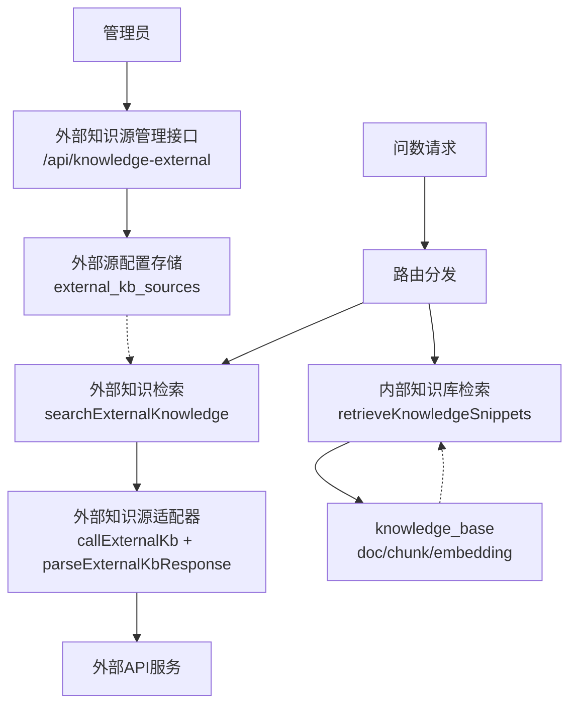
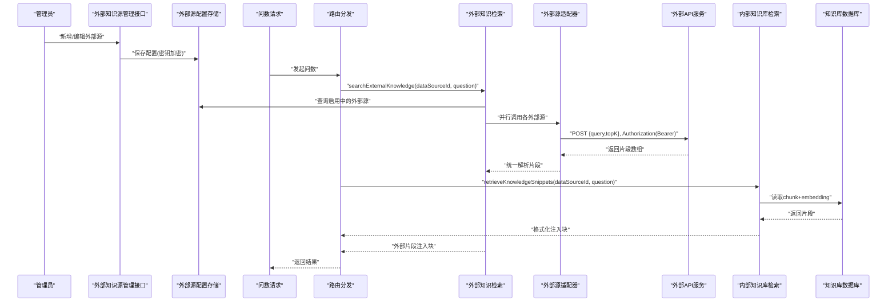
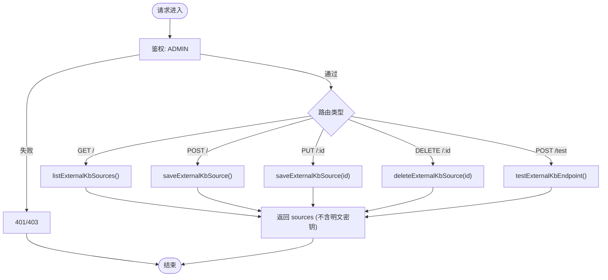
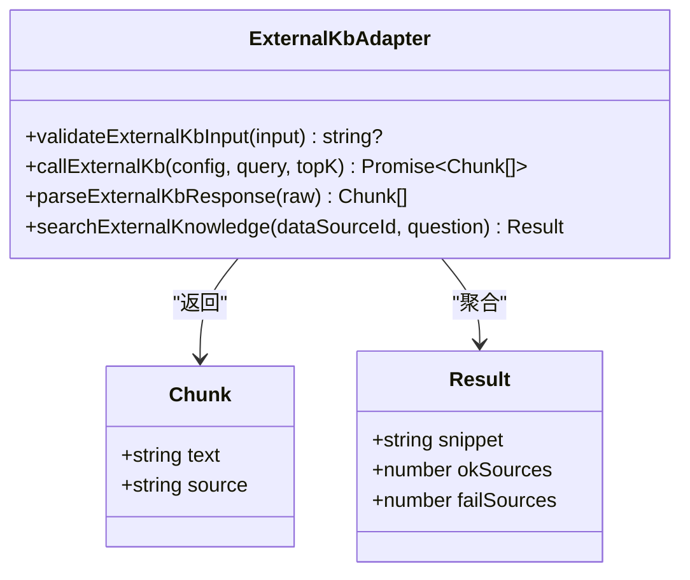
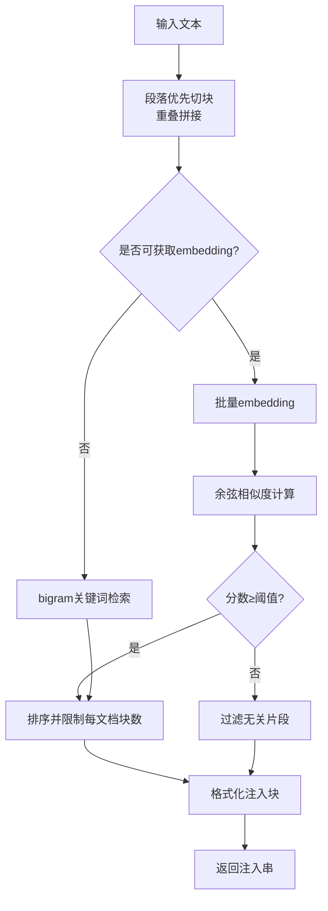
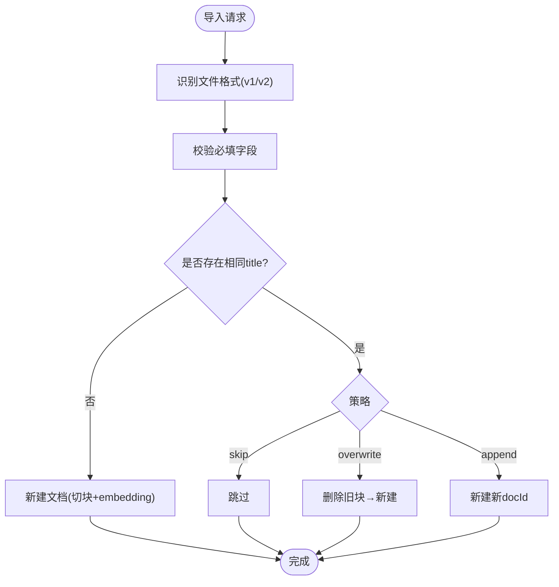
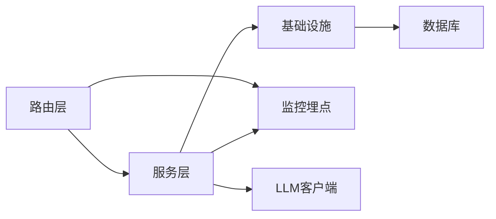

# 外部知识集成

<cite>
**本文引用的文件**
- [server/routes/externalKnowledge.ts](file://server/routes/externalKnowledge.ts)
- [server/knowledge/knowledgeBase.ts](file://server/knowledge/knowledgeBase.ts)
- [server/knowledge/knowledgeServices.ts](file://server/knowledge/knowledgeServices.ts)
- [server/routes/knowledge.ts](file://server/routes/knowledge.ts)
- [server/knowledge/externalKnowledge.test.ts](file://server/knowledge/externalKnowledge.test.ts)
- [server/infra/secretsCrypto.ts](file://server/infra/secretsCrypto.ts)
- [server/auth/accessControl.ts](file://server/auth/accessControl.ts)
- [server/infra/monitoring.ts](file://server/infra/monitoring.ts)
</cite>

## 目录
1. [简介](#简介)
2. [项目结构](#项目结构)
3. [核心组件](#核心组件)
4. [架构总览](#架构总览)
5. [详细组件分析](#详细组件分析)
6. [依赖关系分析](#依赖关系分析)
7. [性能与缓存](#性能与缓存)
8. [故障排查指南](#故障排查指南)
9. [结论](#结论)
10. [附录：扩展与接入示例](#附录：扩展与接入示例)

## 简介
本系统提供“外部知识集成”能力，允许管理员将企业Wiki、文档系统、API服务等外部知识源接入问数链路。系统在检索阶段并行调用已启用的外部源，聚合片段并注入到提示词中，从而增强业务口径、术语与规则的理解。内部知识库（本地RAG）与外部知识源协同工作，保证在向量模型不可用时仍可降级为关键词检索，确保主链路稳定可用。

## 项目结构
- 路由层
  - 外部知识源管理：/api/knowledge-external（仅管理员可配置）
  - 内部知识库管理：/api/knowledge（文档CRUD、导入导出）
- 服务层
  - 外部知识源适配与调用：解析多种响应格式、统一片段化、认证头组装、超时控制
  - 内部知识库RAG：切块、embedding、相似度排序、阈值过滤、格式化注入
  - 预置条目服务：种子数据、CRUD、版本保护
- 基础设施
  - 凭据加密：AES-256-GCM，密文落库，读取时解密
  - 访问控制：组织/部门维度ACL，限制数据源可见性
  - 监控埋点：Prometheus指标，fail-open设计

图表来源
- [server/routes/externalKnowledge.ts:1-85](file://server/routes/externalKnowledge.ts#L1-L85)
- [server/knowledge/knowledgeBase.ts:170-239](file://server/knowledge/knowledgeBase.ts#L170-L239)
- [server/knowledge/externalKnowledge.test.ts:125-206](file://server/knowledge/externalKnowledge.test.ts#L125-L206)

章节来源
- [server/routes/externalKnowledge.ts:1-85](file://server/routes/externalKnowledge.ts#L1-L85)
- [server/routes/knowledge.ts:1-457](file://server/routes/knowledge.ts#L1-L457)

## 核心组件
- 外部知识源管理路由
  - 列出、新增、编辑、删除、连通性测试；鉴权要求ADMIN；列表不返回明文密钥，仅提供hasKey标记
- 外部知识源适配器（由测试覆盖）
  - 统一POST JSON请求体{query, topK}，支持bearer认证头；非2xx抛错；支持timeoutMs中断；响应兼容results/documents/data/items等多种容器字段；片段长度截断与数量上限保护
- 内部知识库RAG
  - 文本切块、批量embedding、余弦相似度排序、阈值过滤、同文档块数限制、高价值文档保留槽位、格式化注入
- 预置条目服务
  - 预置条目查询、创建、更新（禁止修改）、删除（禁止删除）、批量种子初始化
- 安全与访问控制
  - 凭据加密落库与解密；ACL组织/部门维度访问控制
- 监控
  - Prometheus指标注册与旁路埋点，fail-open策略

章节来源
- [server/routes/externalKnowledge.ts:1-85](file://server/routes/externalKnowledge.ts#L1-L85)
- [server/knowledge/externalKnowledge.test.ts:18-206](file://server/knowledge/externalKnowledge.test.ts#L18-L206)
- [server/knowledge/knowledgeBase.ts:43-166](file://server/knowledge/knowledgeBase.ts#L43-L166)
- [server/knowledge/knowledgeServices.ts:31-259](file://server/knowledge/knowledgeServices.ts#L31-L259)
- [server/infra/secretsCrypto.ts:1-50](file://server/infra/secretsCrypto.ts#L1-L50)
- [server/auth/accessControl.ts:1-108](file://server/auth/accessControl.ts#L1-L108)
- [server/infra/monitoring.ts:1-153](file://server/infra/monitoring.ts#L1-L153)

## 架构总览
外部知识集成的整体流程如下：
- 管理员通过管理接口登记外部知识源（endpoint、authType、apiKey、timeoutMs、dataSourceId、enabled）
- 问数链路触发时，系统按数据源匹配启用中的外部源（含通配符全局源），并行发起检索
- 各外部源返回片段后，统一解析、截断、去重、前缀标注，合并为提示词注入块
- 同时，内部知识库基于embedding或bigram检索相关片段，两者共同注入，提升回答质量
- 所有异常均做降级处理，不阻断主链路

图表来源
- [server/routes/externalKnowledge.ts:19-82](file://server/routes/externalKnowledge.ts#L19-L82)
- [server/knowledge/externalKnowledge.test.ts:125-206](file://server/knowledge/externalKnowledge.test.ts#L125-L206)
- [server/knowledge/knowledgeBase.ts:206-239](file://server/knowledge/knowledgeBase.ts#L206-L239)

## 详细组件分析

### 外部知识源管理接口
- 功能
  - 列出外部源（隐藏明文密钥，返回hasKey）
  - 新增/编辑（校验endpoint、authType、apiKey、timeoutMs等）
  - 删除外部源
  - 连通性测试（不落库，即时检索验证）
- 权限
  - 全部操作需ADMIN角色
- 错误处理
  - 参数校验失败返回400；其他异常返回500并附带错误信息

图表来源
- [server/routes/externalKnowledge.ts:16-82](file://server/routes/externalKnowledge.ts#L16-L82)

章节来源
- [server/routes/externalKnowledge.ts:1-85](file://server/routes/externalKnowledge.ts#L1-L85)

### 外部知识源适配器（统一接口与容错）
- 协议
  - 请求：POST JSON { query, topK }
  - 认证：可选 bearer，Authorization: Bearer <apiKey>
  - 超时：支持timeoutMs，使用AbortController中断
- 响应解析
  - 兼容 results/documents/data/items 四种容器
  - 顶层数组或字符串数组直接解析
  - 单片段超600字自动截断；最多取20个片段
- 错误处理
  - 非2xx响应抛错，调用方降级为空且不阻断主链路
  - 数据库异常整体降级为空

图表来源
- [server/knowledge/externalKnowledge.test.ts:18-123](file://server/knowledge/externalKnowledge.test.ts#L18-L123)
- [server/knowledge/externalKnowledge.test.ts:125-206](file://server/knowledge/externalKnowledge.test.ts#L125-L206)

章节来源
- [server/knowledge/externalKnowledge.test.ts:18-206](file://server/knowledge/externalKnowledge.test.ts#L18-L206)

### 内部知识库RAG（本地RAG）
- 切块与嵌入
  - 段落优先切块，相邻块重叠防止语义截断
  - 批量embedding，失败降级为null走关键词检索
- 检索与排序
  - 向量模式：余弦相似度，低于阈值过滤
  - 降级模式：bigram关键词重叠
  - 同一文档最多入选固定块数，避免长字典占满
  - 高价值文档（标题命中特定关键词）保留一个槽位
- 注入格式化
  - 生成强指令提示块，约束口径/术语/枚举，不放开表列白名单

图表来源
- [server/knowledge/knowledgeBase.ts:43-166](file://server/knowledge/knowledgeBase.ts#L43-L166)
- [server/knowledge/knowledgeBase.ts:170-239](file://server/knowledge/knowledgeBase.ts#L170-L239)

章节来源
- [server/knowledge/knowledgeBase.ts:1-239](file://server/knowledge/knowledgeBase.ts#L1-L239)

### 预置条目服务（版本与保护）
- 功能
  - 按数据源获取预置条目
  - 管理员获取全部条目
  - 创建、更新（禁止修改预置）、删除（禁止删除预置）
  - 批量种子初始化（事务保护）
- 版本管理
  - 预置条目受保护，防止误改或删除
  - 导入导出支持多版本文件格式兼容

章节来源
- [server/knowledge/knowledgeServices.ts:31-259](file://server/knowledge/knowledgeServices.ts#L31-L259)
- [server/routes/knowledge.ts:112-375](file://server/routes/knowledge.ts#L112-L375)

### 导入导出与冲突处理
- 导出
  - 按数据源导出knowledge_base的文档，还原原文与原始切块
- 导入
  - 支持v2（knowledge-docs）与v1（knowledgeBase条目数组）
  - 冲突判定：同数据源下同title视为冲突
  - 冲突策略：skip（跳过）、overwrite（覆盖，先删旧块再重建）、append（重复新建新docId）
  - dryRun：仅预检不写库

图表来源
- [server/routes/knowledge.ts:249-375](file://server/routes/knowledge.ts#L249-L375)

章节来源
- [server/routes/knowledge.ts:160-375](file://server/routes/knowledge.ts#L160-L375)

### 安全与访问控制
- 凭据加密
  - AES-256-GCM，密文格式enc:v1:...，幂等加密，明文存量兼容
  - 列表接口不返回明文密钥，仅返回hasKey标记
- 访问控制
  - ACL支持部门与用户ID白名单；未配置表示不限制
  - 管理员始终可访问；普通用户需满足ACL条件

章节来源
- [server/infra/secretsCrypto.ts:1-50](file://server/infra/secretsCrypto.ts#L1-L50)
- [server/auth/accessControl.ts:1-108](file://server/auth/accessControl.ts#L1-L108)
- [server/knowledge/externalKnowledge.test.ts:208-261](file://server/knowledge/externalKnowledge.test.ts#L208-L261)

### 监控与可观测性
- 指标
  - 问数请求计数与耗时直方图
  - 缓存命中计数
  - LLM调用耗时与token消耗
  - SQL执行耗时与EXPLAIN守卫统计
  - HTTP接口耗时
- 策略
  - fail-open：埋点异常不影响业务
  - 低基数label：避免高基数字段污染指标

章节来源
- [server/infra/monitoring.ts:1-153](file://server/infra/monitoring.ts#L1-L153)

## 依赖关系分析
- 路由层依赖服务层
  - externalKnowledge路由 → knowledge/externalKnowledge（由测试覆盖）
  - knowledge路由 → knowledge/knowledgeBase、knowledgeServices
- 服务层依赖基础设施
  - 外部源调用依赖secretsCrypto（密钥解密）
  - 内部RAG依赖llmClient（embedding）与db（连接池）
  - 访问控制依赖db（ACL读取）
- 监控旁路
  - 审计、缓存、LLM、SQL、HTTP等埋点独立于业务逻辑

图表来源
- [server/routes/externalKnowledge.ts:1-85](file://server/routes/externalKnowledge.ts#L1-L85)
- [server/routes/knowledge.ts:1-457](file://server/routes/knowledge.ts#L1-L457)
- [server/knowledge/knowledgeBase.ts:1-239](file://server/knowledge/knowledgeBase.ts#L1-L239)
- [server/infra/monitoring.ts:1-153](file://server/infra/monitoring.ts#L1-L153)

章节来源
- [server/routes/externalKnowledge.ts:1-85](file://server/routes/externalKnowledge.ts#L1-L85)
- [server/routes/knowledge.ts:1-457](file://server/routes/knowledge.ts#L1-L457)
- [server/knowledge/knowledgeBase.ts:1-239](file://server/knowledge/knowledgeBase.ts#L1-L239)
- [server/infra/monitoring.ts:1-153](file://server/infra/monitoring.ts#L1-L153)

## 性能与缓存
- 外部知识源
  - 并行检索多个外部源，降低端到端延迟
  - 超时控制避免慢源阻塞
  - 片段长度与数量限制，减少上下文膨胀
- 内部知识库
  - 批量embedding减少往返次数
  - 向量阈值过滤减少无关注入
  - 同文档块数限制避免单一文档占满
- 缓存建议
  - 对高频问题可结合查询缓存（系统已有L1/L2缓存机制）
  - 外部源响应可按key短期缓存（需评估一致性）
- 监控指标
  - 关注nl2sql_duration_seconds、http_request_duration_seconds、llm_call_duration_seconds等指标定位瓶颈

[本节为通用指导，不直接分析具体文件]

## 故障排查指南
- 外部源连通性测试
  - 使用/test接口进行即时检索验证，确认endpoint、authType、apiKey、timeoutMs配置正确
- 常见错误
  - 非2xx响应：检查外部服务状态码与返回体
  - 超时中断：调整timeoutMs或优化外部服务响应时间
  - 数据库异常：外部检索整体降级为空，不影响主链路
- 密钥问题
  - 列表接口不返回明文密钥，若无法认证请检查hasKey与authType
  - 编辑时留空apiKey会保留原密钥；改为none会清空密钥
- 导入导出
  - 冲突策略选择：skip/overwrite/append；dryRun用于预检
  - 文件格式识别：v2（knowledge-docs）与v1（knowledgeBase）

章节来源
- [server/routes/externalKnowledge.ts:66-82](file://server/routes/externalKnowledge.ts#L66-L82)
- [server/knowledge/externalKnowledge.test.ts:105-123](file://server/knowledge/externalKnowledge.test.ts#L105-L123)
- [server/knowledge/externalKnowledge.test.ts:208-261](file://server/knowledge/externalKnowledge.test.ts#L208-L261)
- [server/routes/knowledge.ts:249-375](file://server/routes/knowledge.ts#L249-L375)

## 结论
外部知识集成通过统一适配器与严格的安全控制，实现了多源并行检索与稳定降级。内部RAG与外部源协同注入，提升了问答的业务准确性。系统具备完善的导入导出、冲突处理、监控与访问控制能力，便于企业级部署与运维。

[本节为总结，不直接分析具体文件]

## 附录：扩展与接入示例

### 扩展现有适配器
- 步骤
  - 在外部源适配器中新增对目标API的响应解析逻辑（参考现有results/documents/data/items兼容）
  - 配置endpoint、authType、apiKey、timeoutMs、dataSourceId、enabled
  - 使用/test接口验证连通性与返回格式
- 注意事项
  - 保持片段长度与数量限制，避免上下文过大
  - 非2xx响应应抛错以便调用方降级

章节来源
- [server/knowledge/externalKnowledge.test.ts:18-123](file://server/knowledge/externalKnowledge.test.ts#L18-L123)
- [server/routes/externalKnowledge.ts:28-82](file://server/routes/externalKnowledge.ts#L28-L82)

### 开发新的知识源连接器
- 设计要点
  - 统一请求体{query, topK}，支持bearer认证
  - 响应解析需兼容多种容器字段，并进行片段截断与去重
  - 错误处理遵循非2xx抛错、调用方降级的原则
- 集成方式
  - 通过外部源管理接口登记新连接器
  - 在问数链路中自动参与检索，无需改动主流程

章节来源
- [server/knowledge/externalKnowledge.test.ts:125-206](file://server/knowledge/externalKnowledge.test.ts#L125-L206)
- [server/routes/externalKnowledge.ts:1-85](file://server/routes/externalKnowledge.ts#L1-L85)

### 接入示例（概念性）
- 企业Wiki
  - endpoint指向Wiki搜索API；authType=bearer；apiKey为令牌；timeoutMs根据Wiki性能设置
- 文档系统
  - endpoint指向文档检索API；可能返回documents或items容器；注意片段长度限制
- API服务
  - endpoint为自定义检索服务；需确保返回片段符合预期格式；必要时在适配器中扩展解析逻辑

[本节为概念性说明，不直接分析具体文件]