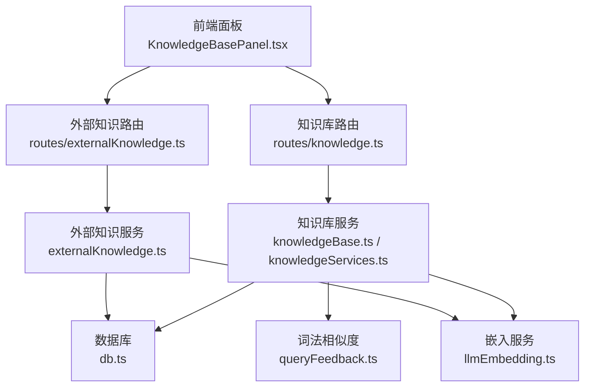
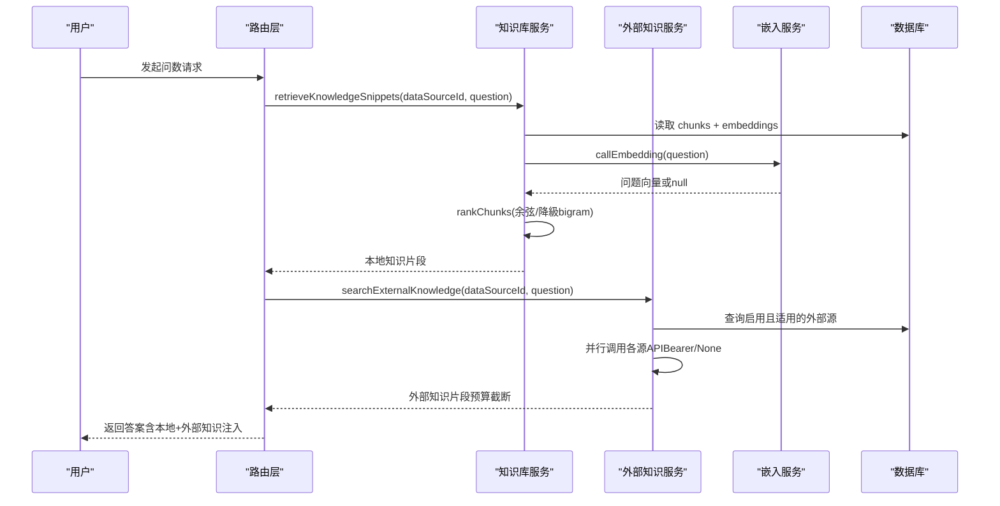
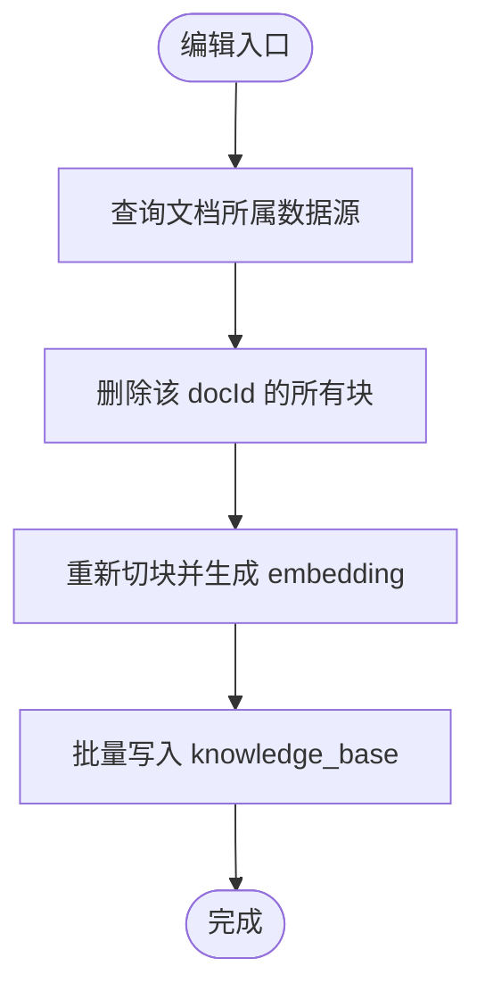
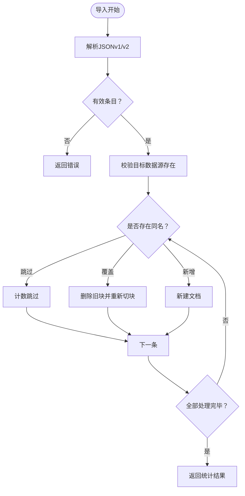
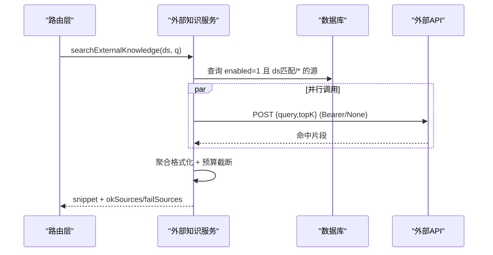
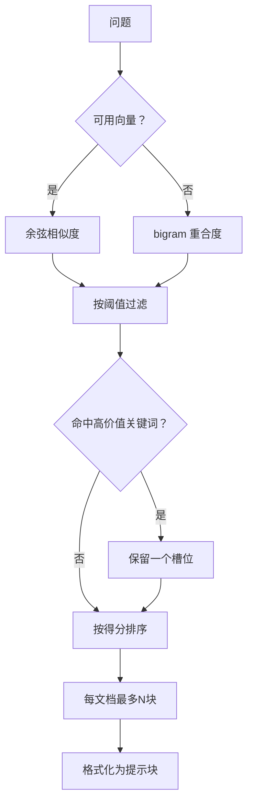
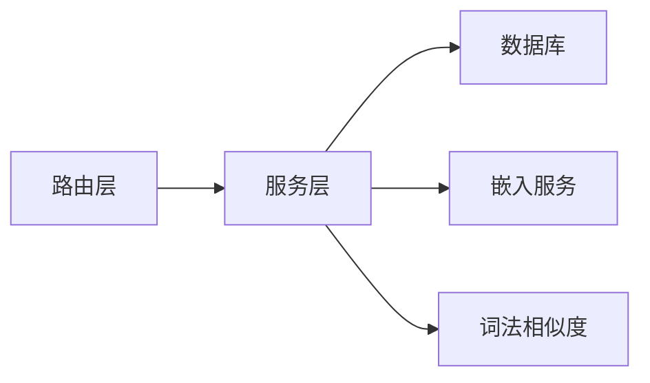

# 知识库管理

<cite>
**本文引用的文件**
- [server/knowledge/knowledgeBase.ts](file://server/knowledge/knowledgeBase.ts)
- [server/knowledge/knowledgeServices.ts](file://server/knowledge/knowledgeServices.ts)
- [server/routes/knowledge.ts](file://server/routes/knowledge.ts)
- [server/knowledge/externalKnowledge.ts](file://server/knowledge/externalKnowledge.ts)
- [server/routes/externalKnowledge.ts](file://server/routes/externalKnowledge.ts)
- [server/llm/llmEmbedding.ts](file://server/llm/llmEmbedding.ts)
- [server/query/queryFeedback.ts](file://server/query/queryFeedback.ts)
- [server/infra/db.ts](file://server/infra/db.ts)
- [src/components/datasource/KnowledgeBasePanel.tsx](file://src/components/datasource/KnowledgeBasePanel.tsx)
</cite>

## 目录
1. [简介](#简介)
2. [项目结构](#项目结构)
3. [核心组件](#核心组件)
4. [架构总览](#架构总览)
5. [详细组件分析](#详细组件分析)
6. [依赖关系分析](#依赖关系分析)
7. [性能考量](#性能考量)
8. [故障排查指南](#故障排查指南)
9. [结论](#结论)
10. [附录](#附录)

## 简介
本系统提供企业级知识库管理能力，覆盖内部知识条目与文档的完整生命周期（CRUD、版本控制、批量导入导出）、外部知识源集成（API 对接、认证配置、数据同步策略），以及语义检索（向量嵌入、相似度计算、检索优化）。同时提供审计日志、质量评估、冲突解决等企业级能力，并支持扩展新的知识类型、数据源适配器与搜索算法。

## 项目结构
知识库相关代码主要分布在以下模块：
- 服务端路由层：对外暴露 REST API，负责鉴权、参数校验、调用服务层
- 服务层：封装业务逻辑（切块、向量化、检索、排序、格式化）
- 存储层：MySQL 建库建表、索引设计、种子数据
- LLM 嵌入层：统一 embedding 调用通道（Ollama/Qwen/Gemini），支持缓存与批处理
- 前端面板：可视化操作知识库（登记、编辑、查看、导入导出、外部源配置）

图表来源
- [server/routes/knowledge.ts:1-457](file://server/routes/knowledge.ts#L1-L457)
- [server/routes/externalKnowledge.ts:1-85](file://server/routes/externalKnowledge.ts#L1-L85)
- [server/knowledge/knowledgeBase.ts:1-239](file://server/knowledge/knowledgeBase.ts#L1-L239)
- [server/knowledge/knowledgeServices.ts:1-260](file://server/knowledge/knowledgeServices.ts#L1-L260)
- [server/knowledge/externalKnowledge.ts:1-273](file://server/knowledge/externalKnowledge.ts#L1-L273)
- [server/llm/llmEmbedding.ts:1-317](file://server/llm/llmEmbedding.ts#L1-L317)
- [server/query/queryFeedback.ts:1-200](file://server/query/queryFeedback.ts#L1-L200)
- [server/infra/db.ts:300-724](file://server/infra/db.ts#L300-L724)

章节来源
- [server/routes/knowledge.ts:1-457](file://server/routes/knowledge.ts#L1-L457)
- [server/infra/db.ts:300-724](file://server/infra/db.ts#L300-L724)

## 核心组件
- 知识库文档模型（doc/chunk）：按段落优先、定长兜底切块，相邻块保留重叠；支持向量嵌入与关键词降级；检索时按阈值过滤与“高价值口径/指南”优先注入
- 知识库条目模型（entries）：标题、内容、标签、分类、版本、预置标记；支持 CRUD、批量初始化、预置保护
- 外部知识源：管理员配置 endpoint、认证方式（none/bearer）、超时、适用数据源范围；问数时并行检索、异常降级、预算截断
- 嵌入服务：统一调用 Ollama/Qwen/Gemini，短 TTL 缓存、单条与批量接口、失败项置空走降级
- 词法相似度：bigram 重合度作为无向量时的降级方案
- 数据库：knowledge_base、knowledge_base_entries、external_kb_sources 等表及索引

章节来源
- [server/knowledge/knowledgeBase.ts:1-239](file://server/knowledge/knowledgeBase.ts#L1-L239)
- [server/knowledge/knowledgeServices.ts:1-260](file://server/knowledge/knowledgeServices.ts#L1-L260)
- [server/knowledge/externalKnowledge.ts:1-273](file://server/knowledge/externalKnowledge.ts#L1-L273)
- [server/llm/llmEmbedding.ts:1-317](file://server/llm/llmEmbedding.ts#L1-L317)
- [server/query/queryFeedback.ts:1-200](file://server/query/queryFeedback.ts#L1-L200)
- [server/infra/db.ts:300-724](file://server/infra/db.ts#L300-L724)

## 架构总览
知识库检索在问数链路中作为阶段一提示注入，提升 SQL 生成的业务准确性。本地知识库与外部知识源并行检索，结果合并后按 token 预算截断，最终注入 prompt。

图表来源
- [server/knowledge/knowledgeBase.ts:168-239](file://server/knowledge/knowledgeBase.ts#L168-L239)
- [server/knowledge/externalKnowledge.ts:145-196](file://server/knowledge/externalKnowledge.ts#L145-L196)
- [server/llm/llmEmbedding.ts:60-162](file://server/llm/llmEmbedding.ts#L60-L162)
- [server/query/queryFeedback.ts:90-99](file://server/query/queryFeedback.ts#L90-L99)

## 详细组件分析

### 内部知识 CRUD 与版本控制
- 文档模型（doc/chunk）
  - 登记：POST /api/knowledge，切块、批量生成 embedding 入库，返回 docId 与 chunkCount
  - 列表：GET /api/knowledge?dataSourceId=xxx，按 doc 聚合显示元信息
  - 详情：GET /api/knowledge/:docId，返回切块明细（按入库顺序）
  - 编辑：PUT /api/knowledge/:docId，删除旧块后以原 docId 重新切块入库（embedding 重建）
  - 删除：DELETE /api/knowledge/:docId
- 条目模型（entries）
  - 获取预置条目：getPresetKnowledgeByDataSource
  - 管理员全量：getAllKnowledgeEntries
  - 按 ID 查找：getKnowledgeEntryById
  - 插入：createKnowledgeEntry（is_preset 标记）
  - 更新：updateKnowledgeEntry（预置不可改）
  - 删除：deleteKnowledgeEntry（预置不可删）
  - 批量初始化：seedKnowledgeBase（事务内幂等写入）
- 版本控制
  - entries 表包含 version 字段，可结合 metric_versions 思路实现版本快照与回溯
  - 编辑流程通过删除旧块重建，确保检索一致性

图表来源
- [server/routes/knowledge.ts:420-442](file://server/routes/knowledge.ts#L420-L442)
- [server/knowledge/knowledgeBase.ts:170-197](file://server/knowledge/knowledgeBase.ts#L170-L197)

章节来源
- [server/routes/knowledge.ts:58-107](file://server/routes/knowledge.ts#L58-L107)
- [server/routes/knowledge.ts:377-454](file://server/routes/knowledge.ts#L377-L454)
- [server/knowledge/knowledgeServices.ts:31-206](file://server/knowledge/knowledgeServices.ts#L31-L206)
- [server/knowledge/knowledgeServices.ts:214-260](file://server/knowledge/knowledgeServices.ts#L214-L260)
- [server/infra/db.ts:316-336](file://server/infra/db.ts#L316-L336)

### 批量导入导出
- 导出：GET /api/knowledge/export?dataSourceId=xxx，按 doc 聚合还原原文（stitchChunks 去重叠），输出 JSON 备份
- 导入：POST /api/knowledge/import，支持 v2（knowledge-docs）与 v1（knowledgeBase 数组）格式；冲突策略 skip/overwrite/append；dryRun 仅预检
- 前端面板：支持选择文件、设置冲突策略、Dry Run 预览、展示导入结果统计

图表来源
- [server/routes/knowledge.ts:159-224](file://server/routes/knowledge.ts#L159-L224)
- [server/routes/knowledge.ts:237-375](file://server/routes/knowledge.ts#L237-L375)
- [src/components/datasource/KnowledgeBasePanel.tsx:65-130](file://src/components/datasource/KnowledgeBasePanel.tsx#L65-L130)

章节来源
- [server/routes/knowledge.ts:159-224](file://server/routes/knowledge.ts#L159-L224)
- [server/routes/knowledge.ts:237-375](file://server/routes/knowledge.ts#L237-L375)
- [src/components/datasource/KnowledgeBasePanel.tsx:65-130](file://src/components/datasource/KnowledgeBasePanel.tsx#L65-L130)

### 外部知识源集成机制
- 配置管理：ADMIN 维护 endpoint、authType（none/bearer）、apiKey（加密落库）、timeoutMs、data_source_id（'*' 表示全局）
- 检索协议：POST {endpoint}，Content-Type application/json，Authorization Bearer <apiKey>（可选），请求体 { query, topK }
- 响应容错：兼容 results/documents/data/items 容器，取 content/text/chunk/pageContent 之一为文本，source/title 标注来源
- 并行检索：searchExternalKnowledge 并行调用所有启用且适用的源，异常降级为空，不阻断主链路
- 预算截断：按 EXTERNAL_KB_TOKEN_BUDGET 对注入文本进行截断，避免上下文溢出

图表来源
- [server/knowledge/externalKnowledge.ts:145-196](file://server/knowledge/externalKnowledge.ts#L145-L196)
- [server/knowledge/externalKnowledge.ts:110-135](file://server/knowledge/externalKnowledge.ts#L110-L135)
- [server/routes/externalKnowledge.ts:19-82](file://server/routes/externalKnowledge.ts#L19-L82)

章节来源
- [server/knowledge/externalKnowledge.ts:1-273](file://server/knowledge/externalKnowledge.ts#L1-L273)
- [server/routes/externalKnowledge.ts:1-85](file://server/routes/externalKnowledge.ts#L1-L85)

### 语义搜索实现原理
- 向量嵌入：callEmbedding/callEmbeddingBatch 支持 Ollama/Qwen/Gemini，短 TTL 缓存，失败项置空走降级
- 相似度计算：余弦相似度用于向量模式；bigramOverlap 用于无向量降级
- 检索优化：
  - 相关性阈值：knowledgeMinScore() 默认 0.35，低于阈值的无关片段不注入
  - 高价值文档优先：GUIDED_DOC_KEYWORDS 命中的高价值文档至少保留一个槽位
  - 每文档最多入选块数：MAX_CHUNKS_PER_DOC 防止字典类文档占满槽位
  - 混合打分：guided 场景使用向量分 + 加权 bigram 混合，避免分块边界导致正答块被压过

图表来源
- [server/knowledge/knowledgeBase.ts:43-166](file://server/knowledge/knowledgeBase.ts#L43-L166)
- [server/query/queryFeedback.ts:90-99](file://server/query/queryFeedback.ts#L90-L99)
- [server/llm/llmEmbedding.ts:60-162](file://server/llm/llmEmbedding.ts#L60-L162)

章节来源
- [server/knowledge/knowledgeBase.ts:1-239](file://server/knowledge/knowledgeBase.ts#L1-L239)
- [server/query/queryFeedback.ts:1-200](file://server/query/queryFeedback.ts#L1-L200)
- [server/llm/llmEmbedding.ts:1-317](file://server/llm/llmEmbedding.ts#L1-L317)

### 数据模型设计与索引策略
- knowledge_base：doc_id、data_source_id、title、chunk_text、embedding_json、created_by、created_at；索引 idx_kb_ds、idx_kb_doc
- knowledge_base_entries：entry_id（唯一）、data_source_id、title、content、tags（JSON）、category、version、is_preset、created_by、updated_by、created_at、updated_at；索引 idx_entries_ds、idx_entries_id、idx_entries_category
- external_kb_sources：id（主键）、name、endpoint、auth_type、api_key（加密）、enabled、timeout_ms、data_source_id、created_by、created_at、updated_at；索引 idx_ekb_ds

章节来源
- [server/infra/db.ts:300-336](file://server/infra/db.ts#L300-L336)
- [server/infra/db.ts:709-724](file://server/infra/db.ts#L709-L724)

### 知识质量评估、冲突解决、审计日志
- 质量评估
  - 向量模式使用相关性阈值过滤无关片段
  - 高价值文档优先保障注入机会
  - 外部源响应长度限制（单片段≤600字，最多20条）
- 冲突解决
  - 导入时按 title 判定冲突，支持 skip/overwrite/append
  - 预置条目不可编辑/删除，保证系统稳定性
- 审计日志
  - 问数链路审计表 query_audit_log 记录用户、数据源、问题、状态、执行SQL、行数、耗时
  - 外部源配置变更由 ADMIN 维护，列表不出明文密钥

章节来源
- [server/knowledge/knowledgeBase.ts:27-41](file://server/knowledge/knowledgeBase.ts#L27-L41)
- [server/knowledge/externalKnowledge.ts:80-108](file://server/knowledge/externalKnowledge.ts#L80-L108)
- [server/routes/knowledge.ts:237-375](file://server/routes/knowledge.ts#L237-L375)
- [server/infra/db.ts:181-199](file://server/infra/db.ts#L181-L199)

### 扩展现有知识类型、添加新数据源适配器、定制搜索算法
- 扩展现有知识类型
  - 在 knowledge_base_entries 中扩展 category/tags/version 字段，配合前端面板展示
  - 在检索逻辑中增加类别权重或过滤条件
- 添加新数据源适配器
  - 在 external_kb_sources 中新增一条记录，配置 endpoint/authType/apiKey/timeoutMs/data_source_id
  - 若外部 API 协议不同，可在 externalKnowledge.ts 中扩展 parseExternalKbResponse 适配
- 定制搜索算法
  - 在 rankChunks 中调整阈值、权重、topK、maxPerDoc
  - 在 llmEmbedding.ts 中切换 embedding 模型或调整批大小
  - 在 queryFeedback.ts 中调整 bigramOverlap 或引入更复杂的相似度函数

章节来源
- [server/knowledge/knowledgeServices.ts:31-206](file://server/knowledge/knowledgeServices.ts#L31-L206)
- [server/knowledge/externalKnowledge.ts:80-108](file://server/knowledge/externalKnowledge.ts#L80-L108)
- [server/knowledge/knowledgeBase.ts:106-166](file://server/knowledge/knowledgeBase.ts#L106-L166)
- [server/llm/llmEmbedding.ts:164-315](file://server/llm/llmEmbedding.ts#L164-L315)

## 依赖关系分析
- 路由层依赖服务层进行业务处理
- 服务层依赖数据库进行持久化，依赖嵌入服务进行向量化
- 嵌入服务支持多后端（Ollama/Qwen/Gemini），具备缓存与批处理能力
- 词法相似度作为无向量时的降级方案

图表来源
- [server/routes/knowledge.ts:1-457](file://server/routes/knowledge.ts#L1-L457)
- [server/knowledge/knowledgeBase.ts:1-239](file://server/knowledge/knowledgeBase.ts#L1-L239)
- [server/llm/llmEmbedding.ts:1-317](file://server/llm/llmEmbedding.ts#L1-L317)
- [server/query/queryFeedback.ts:1-200](file://server/query/queryFeedback.ts#L1-L200)

章节来源
- [server/routes/knowledge.ts:1-457](file://server/routes/knowledge.ts#L1-L457)
- [server/knowledge/knowledgeBase.ts:1-239](file://server/knowledge/knowledgeBase.ts#L1-L239)
- [server/llm/llmEmbedding.ts:1-317](file://server/llm/llmEmbedding.ts#L1-L317)
- [server/query/queryFeedback.ts:1-200](file://server/query/queryFeedback.ts#L1-L200)

## 性能考量
- 嵌入缓存：短 TTL 缓存减少重复调用，提升检索效率
- 批量嵌入：EMBED_BATCH_SIZE 控制批大小，降低网络往返次数
- 检索优化：相关性阈值过滤、高价值文档优先、每文档最多入选块数
- 外部源超时：timeoutMs 控制请求超时，避免阻塞主链路
- 预算截断：EXTERNAL_KB_TOKEN_BUDGET 控制注入文本长度，避免上下文溢出

章节来源
- [server/llm/llmEmbedding.ts:26-47](file://server/llm/llmEmbedding.ts#L26-L47)
- [server/llm/llmEmbedding.ts:164-315](file://server/llm/llmEmbedding.ts#L164-L315)
- [server/knowledge/knowledgeBase.ts:13-25](file://server/knowledge/knowledgeBase.ts#L13-L25)
- [server/knowledge/externalKnowledge.ts:22-23](file://server/knowledge/externalKnowledge.ts#L22-L23)

## 故障排查指南
- 嵌入失败：检查 embedding 模型是否安装（Ollama pull nomic-embed-text），或网络连通性
- 外部源不可用：检查 endpoint 地址、认证配置、超时设置；使用测试接口验证连通性
- 导入失败：检查文件格式、冲突策略、目标数据源是否存在
- 检索效果不佳：调整相关性阈值、topK、高价值关键词权重；检查切块质量

章节来源
- [server/llm/llmEmbedding.ts:60-162](file://server/llm/llmEmbedding.ts#L60-L162)
- [server/knowledge/externalKnowledge.ts:259-273](file://server/knowledge/externalKnowledge.ts#L259-L273)
- [server/routes/knowledge.ts:237-375](file://server/routes/knowledge.ts#L237-L375)
- [server/knowledge/knowledgeBase.ts:27-41](file://server/knowledge/knowledgeBase.ts#L27-L41)

## 结论
本知识库管理系统提供了完整的内部知识 CRUD、版本控制、批量导入导出功能，支持外部知识源集成与语义检索，具备企业级质量评估、冲突解决、审计日志能力。通过模块化设计与可扩展架构，便于后续扩展新的知识类型、数据源适配器与搜索算法。

## 附录
- 配置示例
  - 外部知识源：name="集团知识平台", endpoint="http://kb.internal/api/search", authType="bearer", apiKey="sk-xxx", timeoutMs=5000, data_source_id="*"
  - 知识库阈值：KNOWLEDGE_MIN_SCORE=0.35
  - 嵌入批大小：EMBED_BATCH_SIZE=16
- 数据模型
  - knowledge_base：doc_id、data_source_id、title、chunk_text、embedding_json
  - knowledge_base_entries：entry_id、data_source_id、title、content、tags、category、version、is_preset
  - external_kb_sources：id、name、endpoint、auth_type、api_key、enabled、timeout_ms、data_source_id
- 索引策略
  - 按 data_source_id、doc_id、entry_id、category 建立索引，提升查询效率

章节来源
- [server/knowledge/externalKnowledge.ts:22-38](file://server/knowledge/externalKnowledge.ts#L22-L38)
- [server/knowledge/knowledgeBase.ts:27-41](file://server/knowledge/knowledgeBase.ts#L27-L41)
- [server/infra/db.ts:300-336](file://server/infra/db.ts#L300-L336)
- [server/infra/db.ts:709-724](file://server/infra/db.ts#L709-L724)